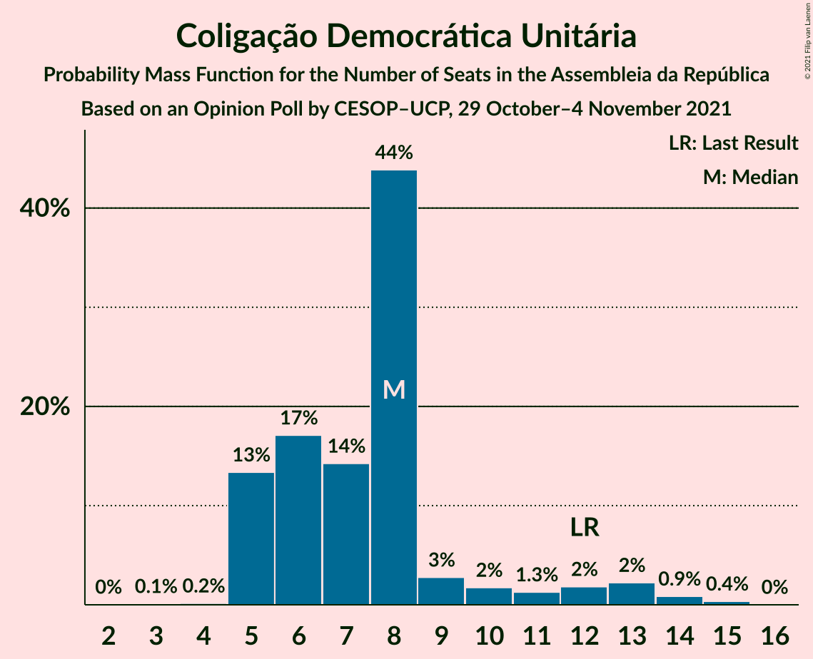
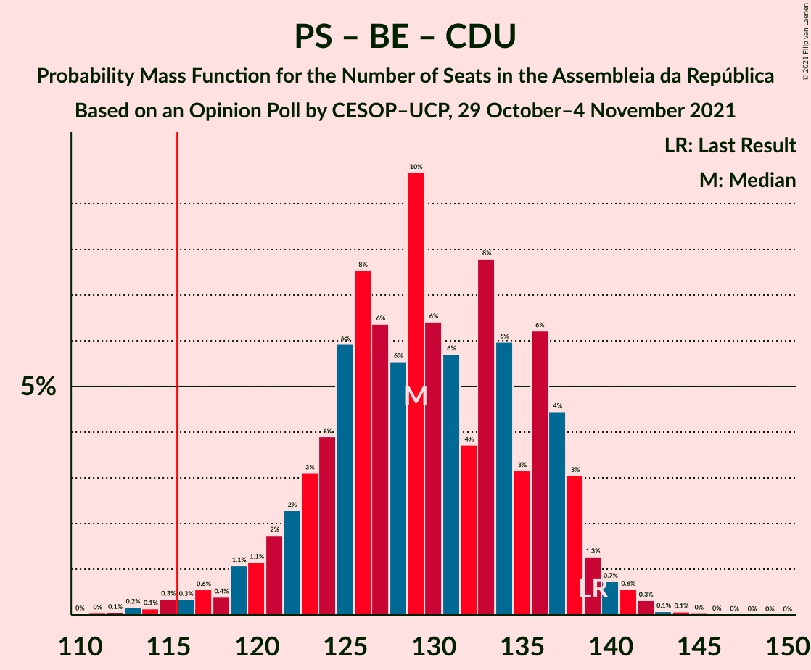
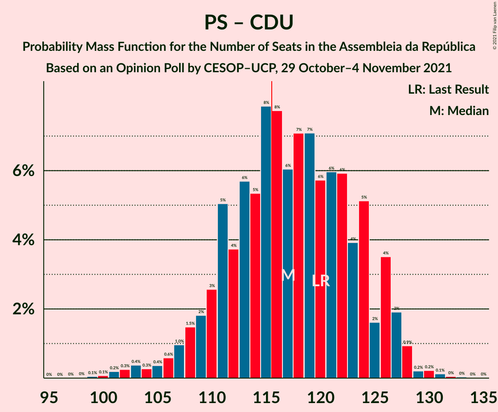

# Opinion Poll by CESOP–UCP, 29 October–4 November 2021

<a href="#voting-intentions">Voting Intentions</a> | <a href="#seats">Seats</a> | <a href="#coalitions">Coalitions</a> | <a href="#technical-information">Technical Information</a>

## Voting Intentions

### Confidence Intervals

| Party | Last Result | Poll Result | 80% Confidence Interval | 90% Confidence Interval | 95% Confidence Interval | 99% Confidence Interval |
|:-----:|:-----------:|:-----------:|:-----------------------:|:-----------------------:|:-----------------------:|:-----------------------:|
| Partido Socialista | 36.4% | 39.0% | 36.9–41.1% |36.3–41.7% |35.8–42.2% |34.8–43.3% |
| Partido Social Democrata | 27.8% | 30.0% | 28.0–32.0% |27.5–32.6% |27.0–33.1% |26.1–34.1% |
| Bloco de Esquerda | 9.5% | 6.9% | 6.0–8.2% |5.7–8.5% |5.4–8.8% |5.0–9.4% |
| Coligação Democrática Unitária | 6.3% | 5.0% | 4.2–6.1% |3.9–6.4% |3.7–6.7% |3.4–7.2% |
| Iniciativa Liberal | 1.3% | 5.0% | 4.2–6.1% |3.9–6.4% |3.7–6.7% |3.4–7.2% |
| Chega | 1.3% | 5.0% | 4.2–6.1% |3.9–6.4% |3.7–6.7% |3.4–7.2% |
| Pessoas–Animais–Natureza | 3.3% | 3.0% | 2.3–3.8% |2.2–4.1% |2.0–4.3% |1.8–4.8% |
| CDS–Partido Popular | 4.2% | 2.1% | 1.6–2.8% |1.4–3.0% |1.3–3.2% |1.1–3.6% |

*Note:* The poll result column reflects the actual value used in the calculations. Published results may vary slightly, and in addition be rounded to fewer digits.

## Seats

### Confidence Intervals

| Party | Last Result | Median | 80% Confidence Interval | 90% Confidence Interval | 95% Confidence Interval | 99% Confidence Interval |
|:-----:|:-----------:|:------:|:-----------------------:|:-----------------------:|:-----------------------:|:-----------------------:|
| <a href="#partido-socialista">Partido Socialista</a> | 108 | 110 | 105–114 |101–115 |97–117 |95–122 |
| <a href="#partido-social-democrata">Partido Social Democrata</a> | 79 | 82 | 77–88 |77–88 |74–91 |69–92 |
| <a href="#bloco-de-esquerda">Bloco de Esquerda</a> | 19 | 12 | 8–15 |7–16 |7–18 |7–18 |
| <a href="#coligação-democrática-unitária">Coligação Democrática Unitária</a> | 12 | 8 | 6–8 |5–9 |5–12 |5–14 |
| <a href="#iniciativa-liberal">Iniciativa Liberal</a> | 1 | 6 | 6–9 |5–12 |4–12 |4–13 |
| <a href="#chega">Chega</a> | 1 | 8 | 5–10 |4–10 |3–10 |3–11 |
| <a href="#pessoas–animais–natureza">Pessoas–Animais–Natureza</a> | 4 | 2 | 2–4 |2–6 |2–6 |1–6 |
| <a href="#cds–partido-popular">CDS–Partido Popular</a> | 5 | 0 | 0–1 |0–2 |0–2 |0–3 |

### Partido Socialista

*For a full overview of the results for this party, see the [Partido Socialista](party-partidosocialista.html) page.*

| Number of Seats | Probability | Accumulated | Special Marks |
|:---------------:|:-----------:|:-----------:|:-------------:|
| 93 | 0.1% | 100% |  |
| 94 | 0% | 99.9% |  |
| 95 | 2% | 99.9% |  |
| 96 | 0% | 98% |  |
| 97 | 0.4% | 98% |  |
| 98 | 0% | 97% |  |
| 99 | 1.5% | 97% |  |
| 100 | 0.7% | 96% |  |
| 101 | 3% | 95% |  |
| 102 | 0% | 93% |  |
| 103 | 0.9% | 93% |  |
| 104 | 0.1% | 92% |  |
| 105 | 20% | 92% |  |
| 106 | 1.3% | 72% |  |
| 107 | 7% | 70% |  |
| 108 | 3% | 63% | Last Result |
| 109 | 1.1% | 61% |  |
| 110 | 33% | 60% | Median |
| 111 | 5% | 26% |  |
| 112 | 2% | 22% |  |
| 113 | 1.3% | 20% |  |
| 114 | 12% | 19% |  |
| 115 | 4% | 7% |  |
| 116 | 0.4% | 3% | Majority |
| 117 | 0.4% | 3% |  |
| 118 | 0.7% | 2% |  |
| 119 | 0.1% | 1.4% |  |
| 120 | 0% | 1.3% |  |
| 121 | 0.2% | 1.3% |  |
| 122 | 1.0% | 1.1% |  |
| 123 | 0% | 0.1% |  |
| 124 | 0.1% | 0.1% |  |
| 125 | 0% | 0% |  |

### Partido Social Democrata

*For a full overview of the results for this party, see the [Partido Social Democrata](party-partidosocialdemocrata.html) page.*

| Number of Seats | Probability | Accumulated | Special Marks |
|:---------------:|:-----------:|:-----------:|:-------------:|
| 68 | 0.1% | 100% |  |
| 69 | 1.4% | 99.9% |  |
| 70 | 0.6% | 98.5% |  |
| 71 | 0.2% | 98% |  |
| 72 | 0% | 98% |  |
| 73 | 0% | 98% |  |
| 74 | 0.3% | 98% |  |
| 75 | 0.2% | 97% |  |
| 76 | 0.9% | 97% |  |
| 77 | 15% | 96% |  |
| 78 | 0.1% | 82% |  |
| 79 | 3% | 81% | Last Result |
| 80 | 2% | 79% |  |
| 81 | 2% | 76% |  |
| 82 | 33% | 74% | Median |
| 83 | 6% | 41% |  |
| 84 | 0.5% | 35% |  |
| 85 | 10% | 35% |  |
| 86 | 0% | 25% |  |
| 87 | 0% | 25% |  |
| 88 | 20% | 25% |  |
| 89 | 0.5% | 5% |  |
| 90 | 2% | 4% |  |
| 91 | 0.3% | 3% |  |
| 92 | 2% | 2% |  |
| 93 | 0.1% | 0.4% |  |
| 94 | 0% | 0.4% |  |
| 95 | 0% | 0.4% |  |
| 96 | 0% | 0.4% |  |
| 97 | 0% | 0.4% |  |
| 98 | 0.3% | 0.3% |  |
| 99 | 0% | 0% |  |

### Bloco de Esquerda

*For a full overview of the results for this party, see the [Bloco de Esquerda](party-blocodeesquerda.html) page.*

| Number of Seats | Probability | Accumulated | Special Marks |
|:---------------:|:-----------:|:-----------:|:-------------:|
| 7 | 8% | 100% |  |
| 8 | 7% | 92% |  |
| 9 | 0.3% | 85% |  |
| 10 | 2% | 85% |  |
| 11 | 32% | 83% |  |
| 12 | 2% | 51% | Median |
| 13 | 5% | 49% |  |
| 14 | 25% | 44% |  |
| 15 | 13% | 19% |  |
| 16 | 3% | 5% |  |
| 17 | 0.1% | 3% |  |
| 18 | 2% | 3% |  |
| 19 | 0.1% | 0.1% | Last Result |
| 20 | 0% | 0% |  |

### Coligação Democrática Unitária

*For a full overview of the results for this party, see the [Coligação Democrática Unitária](party-coligaçãodemocráticaunitária.html) page.*

| Number of Seats | Probability | Accumulated | Special Marks |
|:---------------:|:-----------:|:-----------:|:-------------:|
| 2 | 0.1% | 100% |  |
| 3 | 0.1% | 99.9% |  |
| 4 | 0.1% | 99.7% |  |
| 5 | 5% | 99.6% |  |
| 6 | 6% | 95% |  |
| 7 | 25% | 89% |  |
| 8 | 59% | 64% | Median |
| 9 | 2% | 5% |  |
| 10 | 0.2% | 3% |  |
| 11 | 0.2% | 3% |  |
| 12 | 0.9% | 3% | Last Result |
| 13 | 0.5% | 2% |  |
| 14 | 1.2% | 2% |  |
| 15 | 0.3% | 0.4% |  |
| 16 | 0% | 0% |  |

### Iniciativa Liberal

*For a full overview of the results for this party, see the [Iniciativa Liberal](party-iniciativaliberal.html) page.*

| Number of Seats | Probability | Accumulated | Special Marks |
|:---------------:|:-----------:|:-----------:|:-------------:|
| 1 | 0% | 100% | Last Result |
| 2 | 0% | 100% |  |
| 3 | 0% | 100% |  |
| 4 | 3% | 100% |  |
| 5 | 3% | 97% |  |
| 6 | 74% | 94% | Median |
| 7 | 2% | 20% |  |
| 8 | 1.2% | 18% |  |
| 9 | 8% | 17% |  |
| 10 | 1.3% | 9% |  |
| 11 | 3% | 8% |  |
| 12 | 4% | 5% |  |
| 13 | 1.1% | 1.2% |  |
| 14 | 0.1% | 0.1% |  |
| 15 | 0% | 0% |  |

### Chega

*For a full overview of the results for this party, see the [Chega](party-chega.html) page.*

| Number of Seats | Probability | Accumulated | Special Marks |
|:---------------:|:-----------:|:-----------:|:-------------:|
| 1 | 0% | 100% | Last Result |
| 2 | 0% | 100% |  |
| 3 | 3% | 100% |  |
| 4 | 5% | 97% |  |
| 5 | 20% | 93% |  |
| 6 | 13% | 73% |  |
| 7 | 7% | 59% |  |
| 8 | 16% | 52% | Median |
| 9 | 2% | 36% |  |
| 10 | 32% | 34% |  |
| 11 | 2% | 2% |  |
| 12 | 0.1% | 0.1% |  |
| 13 | 0% | 0% |  |

### Pessoas–Animais–Natureza

*For a full overview of the results for this party, see the [Pessoas–Animais–Natureza](party-pessoas–animais–natureza.html) page.*

| Number of Seats | Probability | Accumulated | Special Marks |
|:---------------:|:-----------:|:-----------:|:-------------:|
| 1 | 1.2% | 100% |  |
| 2 | 54% | 98.8% | Median |
| 3 | 4% | 45% |  |
| 4 | 34% | 41% | Last Result |
| 5 | 0.1% | 6% |  |
| 6 | 6% | 6% |  |
| 7 | 0% | 0.1% |  |
| 8 | 0.1% | 0.1% |  |
| 9 | 0% | 0% |  |

### CDS–Partido Popular

*For a full overview of the results for this party, see the [CDS–Partido Popular](party-cds–partidopopular.html) page.*

| Number of Seats | Probability | Accumulated | Special Marks |
|:---------------:|:-----------:|:-----------:|:-------------:|
| 0 | 61% | 100% | Median |
| 1 | 33% | 39% |  |
| 2 | 5% | 6% |  |
| 3 | 0.8% | 0.9% |  |
| 4 | 0% | 0.1% |  |
| 5 | 0% | 0% | Last Result |

## Coalitions

### Confidence Intervals

| Coalition | Last Result | Median | Majority? | 80% Confidence Interval | 90% Confidence Interval | 95% Confidence Interval | 99% Confidence Interval |
|:---------:|:-----------:|:------:|:---------:|:-----------------------:|:-----------------------:|:-----------------------:|:-----------------------:|
| Partido Socialista – Bloco de Esquerda – Coligação Democrática Unitária | 139 | 129 | 98% | 122–137 | 122–137 | 119–138 | 114–142 |
| Partido Socialista – Bloco de Esquerda | 127 | 121 | 88% | 114–129 | 114–129 | 110–130 | 108–133 |
| Partido Socialista – Coligação Democrática Unitária | 120 | 118 | 62% | 112–122 | 109–123 | 107–125 | 101–129 |
| Partido Socialista | 108 | 110 | 3% | 105–114 | 101–115 | 97–117 | 95–122 |
| Partido Social Democrata – CDS–Partido Popular | 84 | 82 | 0% | 78–88 | 77–88 | 75–92 | 70–93 |

### Partido Socialista – Bloco de Esquerda – Coligação Democrática Unitária

| Number of Seats | Probability | Accumulated | Special Marks |
|:---------------:|:-----------:|:-----------:|:-------------:|
| 113 | 0% | 100% |  |
| 114 | 2% | 99.9% |  |
| 115 | 0% | 98% |  |
| 116 | 0% | 98% | Majority |
| 117 | 0% | 98% |  |
| 118 | 0.3% | 98% |  |
| 119 | 0% | 98% |  |
| 120 | 0.2% | 97% |  |
| 121 | 0.5% | 97% |  |
| 122 | 8% | 97% |  |
| 123 | 1.0% | 89% |  |
| 124 | 1.1% | 88% |  |
| 125 | 3% | 87% |  |
| 126 | 20% | 84% |  |
| 127 | 6% | 64% |  |
| 128 | 1.1% | 58% |  |
| 129 | 34% | 57% |  |
| 130 | 1.3% | 23% | Median |
| 131 | 1.2% | 21% |  |
| 132 | 0.8% | 20% |  |
| 133 | 3% | 19% |  |
| 134 | 0.8% | 17% |  |
| 135 | 0.8% | 16% |  |
| 136 | 0.1% | 15% |  |
| 137 | 12% | 15% |  |
| 138 | 0.2% | 3% |  |
| 139 | 0.8% | 2% | Last Result |
| 140 | 0% | 2% |  |
| 141 | 0.2% | 2% |  |
| 142 | 1.5% | 2% |  |
| 143 | 0% | 0.1% |  |
| 144 | 0% | 0% |  |

### Partido Socialista – Bloco de Esquerda

| Number of Seats | Probability | Accumulated | Special Marks |
|:---------------:|:-----------:|:-----------:|:-------------:|
| 104 | 0% | 100% |  |
| 105 | 0% | 99.9% |  |
| 106 | 0% | 99.9% |  |
| 107 | 0.1% | 99.9% |  |
| 108 | 2% | 99.9% |  |
| 109 | 0% | 98% |  |
| 110 | 0.4% | 98% |  |
| 111 | 0.3% | 97% |  |
| 112 | 0.1% | 97% |  |
| 113 | 0.6% | 97% |  |
| 114 | 8% | 96% |  |
| 115 | 0.2% | 89% |  |
| 116 | 0.1% | 88% | Majority |
| 117 | 3% | 88% |  |
| 118 | 2% | 85% |  |
| 119 | 25% | 83% |  |
| 120 | 0.2% | 58% |  |
| 121 | 32% | 58% |  |
| 122 | 4% | 26% | Median |
| 123 | 0.5% | 22% |  |
| 124 | 2% | 21% |  |
| 125 | 0.4% | 19% |  |
| 126 | 1.0% | 19% |  |
| 127 | 0.6% | 18% | Last Result |
| 128 | 3% | 17% |  |
| 129 | 11% | 15% |  |
| 130 | 1.0% | 3% |  |
| 131 | 0.2% | 2% |  |
| 132 | 0.3% | 2% |  |
| 133 | 1.3% | 2% |  |
| 134 | 0% | 0.3% |  |
| 135 | 0.1% | 0.2% |  |
| 136 | 0.1% | 0.1% |  |
| 137 | 0% | 0% |  |

### Partido Socialista – Coligação Democrática Unitária

| Number of Seats | Probability | Accumulated | Special Marks |
|:---------------:|:-----------:|:-----------:|:-------------:|
| 100 | 0% | 100% |  |
| 101 | 2% | 99.9% |  |
| 102 | 0% | 98% |  |
| 103 | 0% | 98% |  |
| 104 | 0.1% | 98% |  |
| 105 | 0% | 98% |  |
| 106 | 0.3% | 98% |  |
| 107 | 2% | 98% |  |
| 108 | 0.1% | 96% |  |
| 109 | 3% | 96% |  |
| 110 | 0.1% | 93% |  |
| 111 | 0.4% | 93% |  |
| 112 | 20% | 92% |  |
| 113 | 1.0% | 72% |  |
| 114 | 0.5% | 71% |  |
| 115 | 9% | 71% |  |
| 116 | 3% | 62% | Majority |
| 117 | 2% | 59% |  |
| 118 | 32% | 57% | Median |
| 119 | 5% | 26% |  |
| 120 | 4% | 21% | Last Result |
| 121 | 0.3% | 17% |  |
| 122 | 11% | 17% |  |
| 123 | 0.7% | 5% |  |
| 124 | 2% | 5% |  |
| 125 | 0.6% | 3% |  |
| 126 | 0% | 2% |  |
| 127 | 0.6% | 2% |  |
| 128 | 0.1% | 1.3% |  |
| 129 | 1.0% | 1.2% |  |
| 130 | 0% | 0.2% |  |
| 131 | 0% | 0.2% |  |
| 132 | 0.1% | 0.1% |  |
| 133 | 0% | 0% |  |

### Partido Socialista

| Number of Seats | Probability | Accumulated | Special Marks |
|:---------------:|:-----------:|:-----------:|:-------------:|
| 93 | 0.1% | 100% |  |
| 94 | 0% | 99.9% |  |
| 95 | 2% | 99.9% |  |
| 96 | 0% | 98% |  |
| 97 | 0.4% | 98% |  |
| 98 | 0% | 97% |  |
| 99 | 1.5% | 97% |  |
| 100 | 0.7% | 96% |  |
| 101 | 3% | 95% |  |
| 102 | 0% | 93% |  |
| 103 | 0.9% | 93% |  |
| 104 | 0.1% | 92% |  |
| 105 | 20% | 92% |  |
| 106 | 1.3% | 72% |  |
| 107 | 7% | 70% |  |
| 108 | 3% | 63% | Last Result |
| 109 | 1.1% | 61% |  |
| 110 | 33% | 60% | Median |
| 111 | 5% | 26% |  |
| 112 | 2% | 22% |  |
| 113 | 1.3% | 20% |  |
| 114 | 12% | 19% |  |
| 115 | 4% | 7% |  |
| 116 | 0.4% | 3% | Majority |
| 117 | 0.4% | 3% |  |
| 118 | 0.7% | 2% |  |
| 119 | 0.1% | 1.4% |  |
| 120 | 0% | 1.3% |  |
| 121 | 0.2% | 1.3% |  |
| 122 | 1.0% | 1.1% |  |
| 123 | 0% | 0.1% |  |
| 124 | 0.1% | 0.1% |  |
| 125 | 0% | 0% |  |

### Partido Social Democrata – CDS–Partido Popular

| Number of Seats | Probability | Accumulated | Special Marks |
|:---------------:|:-----------:|:-----------:|:-------------:|
| 69 | 0.1% | 100% |  |
| 70 | 1.3% | 99.9% |  |
| 71 | 0.7% | 98.6% |  |
| 72 | 0.1% | 98% |  |
| 73 | 0.1% | 98% |  |
| 74 | 0.1% | 98% |  |
| 75 | 0.2% | 98% |  |
| 76 | 0.8% | 97% |  |
| 77 | 2% | 97% |  |
| 78 | 13% | 95% |  |
| 79 | 0.4% | 82% |  |
| 80 | 0.2% | 81% |  |
| 81 | 5% | 81% |  |
| 82 | 32% | 76% | Median |
| 83 | 7% | 44% |  |
| 84 | 0.9% | 36% | Last Result |
| 85 | 0.4% | 35% |  |
| 86 | 9% | 35% |  |
| 87 | 0.2% | 26% |  |
| 88 | 21% | 26% |  |
| 89 | 0.6% | 5% |  |
| 90 | 0% | 4% |  |
| 91 | 2% | 4% |  |
| 92 | 0.2% | 3% |  |
| 93 | 2% | 2% |  |
| 94 | 0.1% | 0.5% |  |
| 95 | 0% | 0.4% |  |
| 96 | 0% | 0.4% |  |
| 97 | 0% | 0.4% |  |
| 98 | 0% | 0.3% |  |
| 99 | 0.3% | 0.3% |  |
| 100 | 0% | 0.1% |  |
| 101 | 0% | 0% |  |

## Technical Information

### Opinion Poll

+ **Polling firm:** CESOP–UCP
+ **Commissioner(s):** —
+ **Fieldwork period:** 29 October–4 November 2021

### Calculations

+ **Sample size:** 878
+ **Simulations done:** 16,384
+ **Error estimate:** 1.84%

