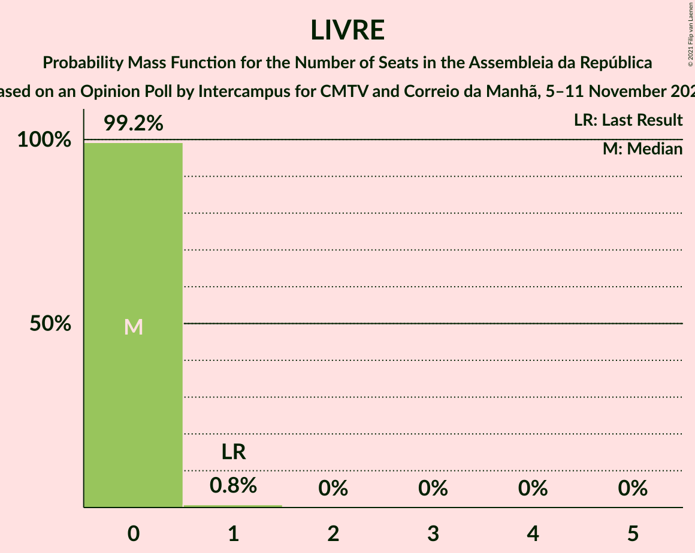

# Opinion Poll by Intercampus for CMTV and Correio da Manhã, 5–11 November 2021

<a href="#voting-intentions">Voting Intentions</a> | <a href="#seats">Seats</a> | <a href="#coalitions">Coalitions</a> | <a href="#technical-information">Technical Information</a>

## Voting Intentions

### Confidence Intervals

| Party | Last Result | Poll Result | 80% Confidence Interval | 90% Confidence Interval | 95% Confidence Interval | 99% Confidence Interval |
|:-----:|:-----------:|:-----------:|:-----------------------:|:-----------------------:|:-----------------------:|:-----------------------:|
| Partido Socialista | 36.4% | 39.1% | 36.6–41.6% |35.9–42.4% |35.3–43.0% |34.1–44.2% |
| Partido Social Democrata | 27.8% | 28.1% | 25.9–30.5% |25.2–31.2% |24.7–31.8% |23.6–33.0% |
| Bloco de Esquerda | 9.5% | 7.7% | 6.5–9.2% |6.1–9.7% |5.8–10.1% |5.3–10.9% |
| Chega | 1.3% | 6.4% | 5.3–7.8% |5.0–8.2% |4.7–8.6% |4.2–9.3% |
| Coligação Democrática Unitária | 6.3% | 5.2% | 4.2–6.6% |4.0–7.0% |3.7–7.3% |3.3–8.0% |
| Pessoas–Animais–Natureza | 3.3% | 4.4% | 3.5–5.7% |3.3–6.0% |3.0–6.4% |2.7–7.0% |
| Iniciativa Liberal | 1.3% | 4.2% | 3.4–5.5% |3.1–5.8% |2.9–6.2% |2.5–6.8% |
| CDS–Partido Popular | 4.2% | 2.0% | 1.4–2.9% |1.2–3.2% |1.1–3.4% |0.9–3.9% |
| LIVRE | 1.1% | 0.2% | 0.1–0.6% |0.0–0.8% |0.0–0.9% |0.0–1.2% |

*Note:* The poll result column reflects the actual value used in the calculations. Published results may vary slightly, and in addition be rounded to fewer digits.

## Seats

### Confidence Intervals

| Party | Last Result | Median | 80% Confidence Interval | 90% Confidence Interval | 95% Confidence Interval | 99% Confidence Interval |
|:-----:|:-----------:|:------:|:-----------------------:|:-----------------------:|:-----------------------:|:-----------------------:|
| <a href="#partido-socialista">Partido Socialista</a> | 108 | 108 | 103–117 |102–119 |100–121 |95–125 |
| <a href="#partido-social-democrata">Partido Social Democrata</a> | 79 | 76 | 69–82 |67–85 |65–85 |62–90 |
| <a href="#bloco-de-esquerda">Bloco de Esquerda</a> | 19 | 15 | 11–18 |10–18 |9–19 |7–22 |
| <a href="#chega">Chega</a> | 1 | 11 | 8–12 |7–13 |6–13 |4–15 |
| <a href="#coligação-democrática-unitária">Coligação Democrática Unitária</a> | 12 | 8 | 6–12 |5–13 |5–14 |4–15 |
| <a href="#pessoas–animais–natureza">Pessoas–Animais–Natureza</a> | 4 | 5 | 4–8 |3–9 |3–10 |2–11 |
| <a href="#iniciativa-liberal">Iniciativa Liberal</a> | 1 | 6 | 4–7 |4–9 |3–10 |3–12 |
| <a href="#cds–partido-popular">CDS–Partido Popular</a> | 5 | 1 | 0–2 |0–2 |0–2 |0–4 |
| <a href="#livre">LIVRE</a> | 1 | 0 | 0 |0 |0 |0–1 |

### Partido Socialista

*For a full overview of the results for this party, see the [Partido Socialista](party-partidosocialista.html) page.*

| Number of Seats | Probability | Accumulated | Special Marks |
|:---------------:|:-----------:|:-----------:|:-------------:|
| 88 | 0% | 100% |  |
| 89 | 0.1% | 99.9% |  |
| 90 | 0% | 99.9% |  |
| 91 | 0.1% | 99.8% |  |
| 92 | 0.1% | 99.7% |  |
| 93 | 0.1% | 99.7% |  |
| 94 | 0.1% | 99.6% |  |
| 95 | 0.2% | 99.5% |  |
| 96 | 0.4% | 99.4% |  |
| 97 | 0.2% | 99.0% |  |
| 98 | 0.4% | 98.8% |  |
| 99 | 0.3% | 98% |  |
| 100 | 2% | 98% |  |
| 101 | 1.2% | 96% |  |
| 102 | 2% | 95% |  |
| 103 | 8% | 94% |  |
| 104 | 3% | 85% |  |
| 105 | 3% | 82% |  |
| 106 | 14% | 79% |  |
| 107 | 15% | 65% |  |
| 108 | 6% | 50% | Last Result, Median |
| 109 | 3% | 44% |  |
| 110 | 3% | 41% |  |
| 111 | 10% | 38% |  |
| 112 | 4% | 28% |  |
| 113 | 3% | 24% |  |
| 114 | 1.4% | 21% |  |
| 115 | 4% | 20% |  |
| 116 | 7% | 17% | Majority |
| 117 | 4% | 10% |  |
| 118 | 1.3% | 6% |  |
| 119 | 2% | 5% |  |
| 120 | 0.5% | 3% |  |
| 121 | 0.8% | 3% |  |
| 122 | 0.1% | 2% |  |
| 123 | 0.8% | 2% |  |
| 124 | 0.2% | 1.3% |  |
| 125 | 0.6% | 1.0% |  |
| 126 | 0.1% | 0.4% |  |
| 127 | 0.2% | 0.3% |  |
| 128 | 0.1% | 0.1% |  |
| 129 | 0% | 0.1% |  |
| 130 | 0% | 0% |  |

### Partido Social Democrata

*For a full overview of the results for this party, see the [Partido Social Democrata](party-partidosocialdemocrata.html) page.*

| Number of Seats | Probability | Accumulated | Special Marks |
|:---------------:|:-----------:|:-----------:|:-------------:|
| 58 | 0% | 100% |  |
| 59 | 0% | 99.9% |  |
| 60 | 0.2% | 99.9% |  |
| 61 | 0.1% | 99.7% |  |
| 62 | 0.2% | 99.6% |  |
| 63 | 0.8% | 99.4% |  |
| 64 | 0.7% | 98.6% |  |
| 65 | 1.0% | 98% |  |
| 66 | 0.9% | 97% |  |
| 67 | 1.4% | 96% |  |
| 68 | 2% | 95% |  |
| 69 | 3% | 93% |  |
| 70 | 4% | 90% |  |
| 71 | 2% | 86% |  |
| 72 | 5% | 84% |  |
| 73 | 8% | 79% |  |
| 74 | 5% | 71% |  |
| 75 | 9% | 66% |  |
| 76 | 15% | 57% | Median |
| 77 | 3% | 42% |  |
| 78 | 3% | 39% |  |
| 79 | 7% | 35% | Last Result |
| 80 | 2% | 29% |  |
| 81 | 7% | 26% |  |
| 82 | 10% | 19% |  |
| 83 | 1.1% | 10% |  |
| 84 | 4% | 9% |  |
| 85 | 3% | 5% |  |
| 86 | 0.6% | 2% |  |
| 87 | 0.5% | 2% |  |
| 88 | 0.2% | 1.2% |  |
| 89 | 0.4% | 1.0% |  |
| 90 | 0.2% | 0.6% |  |
| 91 | 0.1% | 0.4% |  |
| 92 | 0.1% | 0.3% |  |
| 93 | 0.1% | 0.2% |  |
| 94 | 0% | 0.2% |  |
| 95 | 0% | 0.1% |  |
| 96 | 0% | 0.1% |  |
| 97 | 0% | 0% |  |

### Bloco de Esquerda

*For a full overview of the results for this party, see the [Bloco de Esquerda](party-blocodeesquerda.html) page.*

| Number of Seats | Probability | Accumulated | Special Marks |
|:---------------:|:-----------:|:-----------:|:-------------:|
| 7 | 2% | 100% |  |
| 8 | 0.6% | 98% |  |
| 9 | 2% | 98% |  |
| 10 | 2% | 96% |  |
| 11 | 10% | 95% |  |
| 12 | 10% | 85% |  |
| 13 | 7% | 75% |  |
| 14 | 17% | 68% |  |
| 15 | 22% | 51% | Median |
| 16 | 11% | 29% |  |
| 17 | 5% | 18% |  |
| 18 | 9% | 14% |  |
| 19 | 3% | 5% | Last Result |
| 20 | 0.5% | 2% |  |
| 21 | 0.7% | 1.4% |  |
| 22 | 0.6% | 0.7% |  |
| 23 | 0.1% | 0.1% |  |
| 24 | 0% | 0.1% |  |
| 25 | 0% | 0% |  |

### Chega

*For a full overview of the results for this party, see the [Chega](party-chega.html) page.*

| Number of Seats | Probability | Accumulated | Special Marks |
|:---------------:|:-----------:|:-----------:|:-------------:|
| 1 | 0% | 100% | Last Result |
| 2 | 0% | 100% |  |
| 3 | 0.1% | 100% |  |
| 4 | 2% | 99.9% |  |
| 5 | 0.7% | 98% |  |
| 6 | 1.4% | 98% |  |
| 7 | 1.4% | 96% |  |
| 8 | 15% | 95% |  |
| 9 | 6% | 80% |  |
| 10 | 23% | 74% |  |
| 11 | 39% | 51% | Median |
| 12 | 6% | 11% |  |
| 13 | 4% | 5% |  |
| 14 | 1.3% | 2% |  |
| 15 | 0.3% | 0.7% |  |
| 16 | 0% | 0.4% |  |
| 17 | 0.1% | 0.3% |  |
| 18 | 0.1% | 0.2% |  |
| 19 | 0% | 0.1% |  |
| 20 | 0% | 0.1% |  |
| 21 | 0% | 0% |  |

### Coligação Democrática Unitária

*For a full overview of the results for this party, see the [Coligação Democrática Unitária](party-coligaçãodemocráticaunitária.html) page.*

| Number of Seats | Probability | Accumulated | Special Marks |
|:---------------:|:-----------:|:-----------:|:-------------:|
| 2 | 0.1% | 100% |  |
| 3 | 0.2% | 99.9% |  |
| 4 | 2% | 99.7% |  |
| 5 | 4% | 98% |  |
| 6 | 11% | 93% |  |
| 7 | 31% | 82% |  |
| 8 | 8% | 51% | Median |
| 9 | 4% | 43% |  |
| 10 | 11% | 39% |  |
| 11 | 13% | 28% |  |
| 12 | 8% | 15% | Last Result |
| 13 | 4% | 7% |  |
| 14 | 2% | 3% |  |
| 15 | 0.9% | 1.1% |  |
| 16 | 0.1% | 0.2% |  |
| 17 | 0% | 0.1% |  |
| 18 | 0% | 0% |  |

### Pessoas–Animais–Natureza

*For a full overview of the results for this party, see the [Pessoas–Animais–Natureza](party-pessoas–animais–natureza.html) page.*

| Number of Seats | Probability | Accumulated | Special Marks |
|:---------------:|:-----------:|:-----------:|:-------------:|
| 2 | 2% | 100% |  |
| 3 | 7% | 98% |  |
| 4 | 39% | 91% | Last Result |
| 5 | 11% | 52% | Median |
| 6 | 27% | 41% |  |
| 7 | 3% | 14% |  |
| 8 | 4% | 12% |  |
| 9 | 5% | 8% |  |
| 10 | 1.5% | 3% |  |
| 11 | 1.3% | 2% |  |
| 12 | 0.4% | 0.5% |  |
| 13 | 0% | 0.1% |  |
| 14 | 0% | 0.1% |  |
| 15 | 0% | 0% |  |

### Iniciativa Liberal

*For a full overview of the results for this party, see the [Iniciativa Liberal](party-iniciativaliberal.html) page.*

| Number of Seats | Probability | Accumulated | Special Marks |
|:---------------:|:-----------:|:-----------:|:-------------:|
| 1 | 0% | 100% | Last Result |
| 2 | 0% | 100% |  |
| 3 | 5% | 100% |  |
| 4 | 14% | 95% |  |
| 5 | 23% | 82% |  |
| 6 | 46% | 58% | Median |
| 7 | 5% | 12% |  |
| 8 | 2% | 7% |  |
| 9 | 0.9% | 5% |  |
| 10 | 3% | 4% |  |
| 11 | 0.3% | 1.1% |  |
| 12 | 0.8% | 0.9% |  |
| 13 | 0% | 0% |  |

### CDS–Partido Popular

*For a full overview of the results for this party, see the [CDS–Partido Popular](party-cds–partidopopular.html) page.*

| Number of Seats | Probability | Accumulated | Special Marks |
|:---------------:|:-----------:|:-----------:|:-------------:|
| 0 | 47% | 100% |  |
| 1 | 42% | 53% | Median |
| 2 | 10% | 11% |  |
| 3 | 0.9% | 1.5% |  |
| 4 | 0.4% | 0.6% |  |
| 5 | 0.2% | 0.2% | Last Result |
| 6 | 0% | 0% |  |

### LIVRE

*For a full overview of the results for this party, see the [LIVRE](party-livre.html) page.*

| Number of Seats | Probability | Accumulated | Special Marks |
|:---------------:|:-----------:|:-----------:|:-------------:|
| 0 | 99.2% | 100% | Median |
| 1 | 0.8% | 0.8% | Last Result |
| 2 | 0% | 0% |  |

## Coalitions

### Confidence Intervals

| Coalition | Last Result | Median | Majority? | 80% Confidence Interval | 90% Confidence Interval | 95% Confidence Interval | 99% Confidence Interval |
|:---------:|:-----------:|:------:|:---------:|:-----------------------:|:-----------------------:|:-----------------------:|:-----------------------:|
| Partido Socialista – Bloco de Esquerda – Coligação Democrática Unitária | 139 | 132 | 99.7% | 126–139 | 123–141 | 121–144 | 117–149 |
| Partido Socialista – Bloco de Esquerda | 127 | 122 | 96% | 118–132 | 116–134 | 115–135 | 107–139 |
| Partido Socialista – Coligação Democrática Unitária | 120 | 118 | 65% | 111–124 | 109–126 | 107–130 | 103–134 |
| Partido Socialista | 108 | 108 | 17% | 103–117 | 102–119 | 100–121 | 95–125 |
| Partido Social Democrata – CDS–Partido Popular | 84 | 76 | 0% | 70–83 | 68–86 | 66–87 | 63–91 |

### Partido Socialista – Bloco de Esquerda – Coligação Democrática Unitária

| Number of Seats | Probability | Accumulated | Special Marks |
|:---------------:|:-----------:|:-----------:|:-------------:|
| 112 | 0% | 100% |  |
| 113 | 0.1% | 99.9% |  |
| 114 | 0.1% | 99.9% |  |
| 115 | 0.1% | 99.8% |  |
| 116 | 0.2% | 99.7% | Majority |
| 117 | 0.4% | 99.5% |  |
| 118 | 0.2% | 99.2% |  |
| 119 | 0.3% | 99.0% |  |
| 120 | 0.7% | 98.7% |  |
| 121 | 0.7% | 98% |  |
| 122 | 1.1% | 97% |  |
| 123 | 2% | 96% |  |
| 124 | 0.8% | 94% |  |
| 125 | 3% | 94% |  |
| 126 | 6% | 91% |  |
| 127 | 4% | 85% |  |
| 128 | 12% | 81% |  |
| 129 | 3% | 69% |  |
| 130 | 3% | 66% |  |
| 131 | 4% | 63% | Median |
| 132 | 15% | 59% |  |
| 133 | 10% | 45% |  |
| 134 | 4% | 35% |  |
| 135 | 9% | 31% |  |
| 136 | 2% | 22% |  |
| 137 | 3% | 19% |  |
| 138 | 2% | 17% |  |
| 139 | 5% | 15% | Last Result |
| 140 | 3% | 9% |  |
| 141 | 1.3% | 6% |  |
| 142 | 0.8% | 5% |  |
| 143 | 1.2% | 4% |  |
| 144 | 0.6% | 3% |  |
| 145 | 0.3% | 2% |  |
| 146 | 0.5% | 2% |  |
| 147 | 0.3% | 1.1% |  |
| 148 | 0.1% | 0.8% |  |
| 149 | 0.6% | 0.7% |  |
| 150 | 0.1% | 0.1% |  |
| 151 | 0% | 0.1% |  |
| 152 | 0% | 0% |  |

### Partido Socialista – Bloco de Esquerda

| Number of Seats | Probability | Accumulated | Special Marks |
|:---------------:|:-----------:|:-----------:|:-------------:|
| 103 | 0.1% | 100% |  |
| 104 | 0.1% | 99.9% |  |
| 105 | 0.1% | 99.8% |  |
| 106 | 0.1% | 99.7% |  |
| 107 | 0.3% | 99.6% |  |
| 108 | 0.1% | 99.3% |  |
| 109 | 0.1% | 99.2% |  |
| 110 | 0.1% | 99.1% |  |
| 111 | 0.3% | 99.0% |  |
| 112 | 0.2% | 98.7% |  |
| 113 | 0.5% | 98% |  |
| 114 | 0.5% | 98% |  |
| 115 | 1.2% | 98% |  |
| 116 | 2% | 96% | Majority |
| 117 | 1.3% | 94% |  |
| 118 | 5% | 93% |  |
| 119 | 8% | 88% |  |
| 120 | 5% | 80% |  |
| 121 | 25% | 75% |  |
| 122 | 3% | 50% |  |
| 123 | 14% | 47% | Median |
| 124 | 3% | 33% |  |
| 125 | 2% | 30% |  |
| 126 | 3% | 28% |  |
| 127 | 3% | 25% | Last Result |
| 128 | 2% | 22% |  |
| 129 | 2% | 20% |  |
| 130 | 2% | 18% |  |
| 131 | 3% | 17% |  |
| 132 | 4% | 14% |  |
| 133 | 4% | 9% |  |
| 134 | 2% | 5% |  |
| 135 | 1.0% | 3% |  |
| 136 | 0.7% | 2% |  |
| 137 | 0.2% | 2% |  |
| 138 | 0.6% | 1.3% |  |
| 139 | 0.5% | 0.7% |  |
| 140 | 0.1% | 0.2% |  |
| 141 | 0% | 0.1% |  |
| 142 | 0% | 0.1% |  |
| 143 | 0% | 0% |  |

### Partido Socialista – Coligação Democrática Unitária

| Number of Seats | Probability | Accumulated | Special Marks |
|:---------------:|:-----------:|:-----------:|:-------------:|
| 98 | 0.1% | 100% |  |
| 99 | 0% | 99.9% |  |
| 100 | 0.1% | 99.8% |  |
| 101 | 0.1% | 99.8% |  |
| 102 | 0.1% | 99.6% |  |
| 103 | 0.3% | 99.5% |  |
| 104 | 0.2% | 99.2% |  |
| 105 | 0.3% | 99.0% |  |
| 106 | 0.8% | 98.8% |  |
| 107 | 0.8% | 98% |  |
| 108 | 1.2% | 97% |  |
| 109 | 1.0% | 96% |  |
| 110 | 5% | 95% |  |
| 111 | 4% | 90% |  |
| 112 | 4% | 86% |  |
| 113 | 12% | 82% |  |
| 114 | 2% | 70% |  |
| 115 | 3% | 68% |  |
| 116 | 5% | 65% | Median, Majority |
| 117 | 3% | 60% |  |
| 118 | 17% | 57% |  |
| 119 | 4% | 40% |  |
| 120 | 5% | 36% | Last Result |
| 121 | 4% | 31% |  |
| 122 | 4% | 27% |  |
| 123 | 11% | 23% |  |
| 124 | 3% | 12% |  |
| 125 | 2% | 9% |  |
| 126 | 2% | 6% |  |
| 127 | 1.2% | 5% |  |
| 128 | 0.3% | 4% |  |
| 129 | 0.6% | 3% |  |
| 130 | 0.2% | 3% |  |
| 131 | 0.8% | 2% |  |
| 132 | 0.5% | 2% |  |
| 133 | 0.5% | 1.2% |  |
| 134 | 0.2% | 0.6% |  |
| 135 | 0.1% | 0.4% |  |
| 136 | 0.1% | 0.4% |  |
| 137 | 0.2% | 0.3% |  |
| 138 | 0% | 0.1% |  |
| 139 | 0% | 0% |  |

### Partido Socialista

| Number of Seats | Probability | Accumulated | Special Marks |
|:---------------:|:-----------:|:-----------:|:-------------:|
| 88 | 0% | 100% |  |
| 89 | 0.1% | 99.9% |  |
| 90 | 0% | 99.9% |  |
| 91 | 0.1% | 99.8% |  |
| 92 | 0.1% | 99.7% |  |
| 93 | 0.1% | 99.7% |  |
| 94 | 0.1% | 99.6% |  |
| 95 | 0.2% | 99.5% |  |
| 96 | 0.4% | 99.4% |  |
| 97 | 0.2% | 99.0% |  |
| 98 | 0.4% | 98.8% |  |
| 99 | 0.3% | 98% |  |
| 100 | 2% | 98% |  |
| 101 | 1.2% | 96% |  |
| 102 | 2% | 95% |  |
| 103 | 8% | 94% |  |
| 104 | 3% | 85% |  |
| 105 | 3% | 82% |  |
| 106 | 14% | 79% |  |
| 107 | 15% | 65% |  |
| 108 | 6% | 50% | Last Result, Median |
| 109 | 3% | 44% |  |
| 110 | 3% | 41% |  |
| 111 | 10% | 38% |  |
| 112 | 4% | 28% |  |
| 113 | 3% | 24% |  |
| 114 | 1.4% | 21% |  |
| 115 | 4% | 20% |  |
| 116 | 7% | 17% | Majority |
| 117 | 4% | 10% |  |
| 118 | 1.3% | 6% |  |
| 119 | 2% | 5% |  |
| 120 | 0.5% | 3% |  |
| 121 | 0.8% | 3% |  |
| 122 | 0.1% | 2% |  |
| 123 | 0.8% | 2% |  |
| 124 | 0.2% | 1.3% |  |
| 125 | 0.6% | 1.0% |  |
| 126 | 0.1% | 0.4% |  |
| 127 | 0.2% | 0.3% |  |
| 128 | 0.1% | 0.1% |  |
| 129 | 0% | 0.1% |  |
| 130 | 0% | 0% |  |

### Partido Social Democrata – CDS–Partido Popular

| Number of Seats | Probability | Accumulated | Special Marks |
|:---------------:|:-----------:|:-----------:|:-------------:|
| 59 | 0% | 100% |  |
| 60 | 0.2% | 99.9% |  |
| 61 | 0.1% | 99.7% |  |
| 62 | 0.1% | 99.7% |  |
| 63 | 0.2% | 99.5% |  |
| 64 | 1.1% | 99.3% |  |
| 65 | 0.7% | 98% |  |
| 66 | 0.9% | 98% |  |
| 67 | 1.3% | 97% |  |
| 68 | 1.1% | 95% |  |
| 69 | 2% | 94% |  |
| 70 | 3% | 92% |  |
| 71 | 3% | 89% |  |
| 72 | 4% | 86% |  |
| 73 | 10% | 82% |  |
| 74 | 2% | 73% |  |
| 75 | 10% | 71% |  |
| 76 | 16% | 61% |  |
| 77 | 4% | 45% | Median |
| 78 | 3% | 41% |  |
| 79 | 4% | 38% |  |
| 80 | 5% | 34% |  |
| 81 | 4% | 29% |  |
| 82 | 11% | 26% |  |
| 83 | 5% | 15% |  |
| 84 | 1.0% | 10% | Last Result |
| 85 | 2% | 9% |  |
| 86 | 3% | 6% |  |
| 87 | 1.5% | 3% |  |
| 88 | 0.6% | 2% |  |
| 89 | 0.3% | 1.1% |  |
| 90 | 0.3% | 0.9% |  |
| 91 | 0.2% | 0.6% |  |
| 92 | 0.1% | 0.3% |  |
| 93 | 0.1% | 0.3% |  |
| 94 | 0.1% | 0.2% |  |
| 95 | 0% | 0.1% |  |
| 96 | 0% | 0.1% |  |
| 97 | 0% | 0.1% |  |
| 98 | 0% | 0% |  |

## Technical Information

### Opinion Poll

+ **Polling firm:** Intercampus
+ **Commissioner(s):** CMTV and Correio da Manhã
+ **Fieldwork period:** 5–11 November 2021

### Calculations

+ **Sample size:** 612
+ **Simulations done:** 1,048,576
+ **Error estimate:** 1.22%

