# Opinion Poll by Pitagórica for CNN Portugal and TVI, 10–15 November 2021

<a href="#voting-intentions">Voting Intentions</a> | <a href="#seats">Seats</a> | <a href="#coalitions">Coalitions</a> | <a href="#technical-information">Technical Information</a>

## Voting Intentions

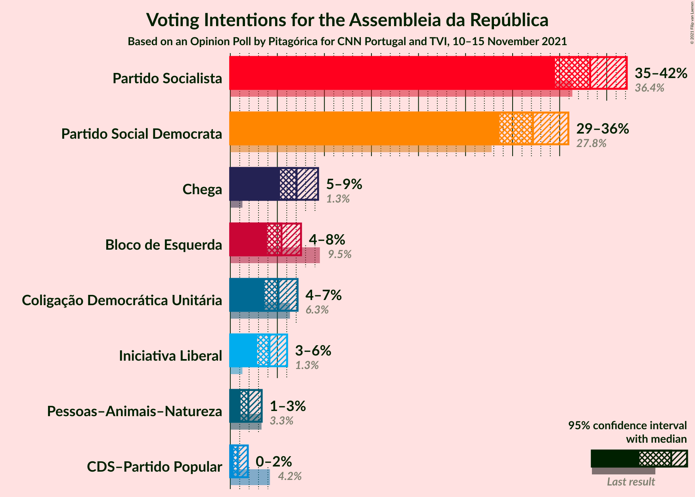

### Confidence Intervals

| Party | Last Result | Poll Result | 80% Confidence Interval | 90% Confidence Interval | 95% Confidence Interval | 99% Confidence Interval |
|:-----:|:-----------:|:-----------:|:-----------------------:|:-----------------------:|:-----------------------:|:-----------------------:|
| Partido Socialista | 36.4% | 38.2% | 35.8–40.8% |35.1–41.5% |34.5–42.1% |33.3–43.3% |
| Partido Social Democrata | 27.8% | 32.2% | 29.8–34.6% |29.2–35.3% |28.6–35.9% |27.5–37.1% |
| Chega | 1.3% | 7.0% | 5.9–8.5% |5.6–8.9% |5.3–9.3% |4.8–10.1% |
| Bloco de Esquerda | 9.5% | 5.4% | 4.4–6.8% |4.1–7.2% |3.9–7.5% |3.5–8.2% |
| Coligação Democrática Unitária | 6.3% | 5.1% | 4.1–6.4% |3.9–6.8% |3.6–7.1% |3.2–7.8% |
| Iniciativa Liberal | 1.3% | 4.2% | 3.3–5.4% |3.0–5.7% |2.9–6.0% |2.5–6.7% |
| Pessoas–Animais–Natureza | 3.3% | 1.9% | 1.4–2.8% |1.2–3.1% |1.1–3.3% |0.9–3.8% |
| CDS–Partido Popular | 4.2% | 0.8% | 0.5–1.5% |0.4–1.7% |0.4–1.9% |0.2–2.3% |

*Note:* The poll result column reflects the actual value used in the calculations. Published results may vary slightly, and in addition be rounded to fewer digits.

## Seats

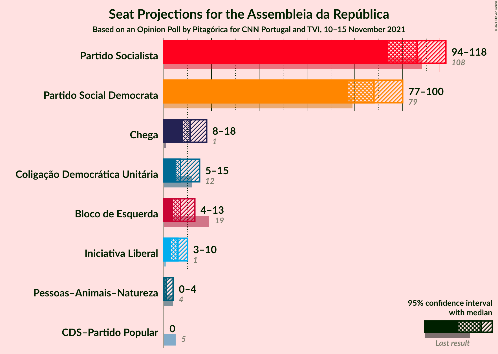

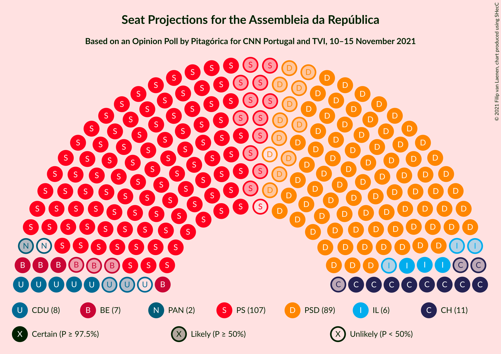

### Confidence Intervals

| Party | Last Result | Median | 80% Confidence Interval | 90% Confidence Interval | 95% Confidence Interval | 99% Confidence Interval |
|:-----:|:-----------:|:------:|:-----------------------:|:-----------------------:|:-----------------------:|:-----------------------:|
| <a href="#partido-socialista">Partido Socialista</a> | 108 | 106 | 98–114 |96–116 |94–118 |90–122 |
| <a href="#partido-social-democrata">Partido Social Democrata</a> | 79 | 88 | 81–97 |79–98 |77–100 |75–104 |
| <a href="#chega">Chega</a> | 1 | 11 | 9–14 |8–15 |8–18 |6–19 |
| <a href="#bloco-de-esquerda">Bloco de Esquerda</a> | 19 | 7 | 5–12 |5–12 |4–13 |3–15 |
| <a href="#coligação-democrática-unitária">Coligação Democrática Unitária</a> | 12 | 7 | 5–10 |5–13 |5–15 |3–15 |
| <a href="#iniciativa-liberal">Iniciativa Liberal</a> | 1 | 6 | 4–8 |4–9 |3–10 |3–12 |
| <a href="#pessoas–animais–natureza">Pessoas–Animais–Natureza</a> | 4 | 1 | 0–2 |0–3 |0–4 |0–4 |
| <a href="#cds–partido-popular">CDS–Partido Popular</a> | 5 | 0 | 0 |0 |0 |0–1 |

### Partido Socialista

*For a full overview of the results for this party, see the [Partido Socialista](party-partidosocialista.html) page.*

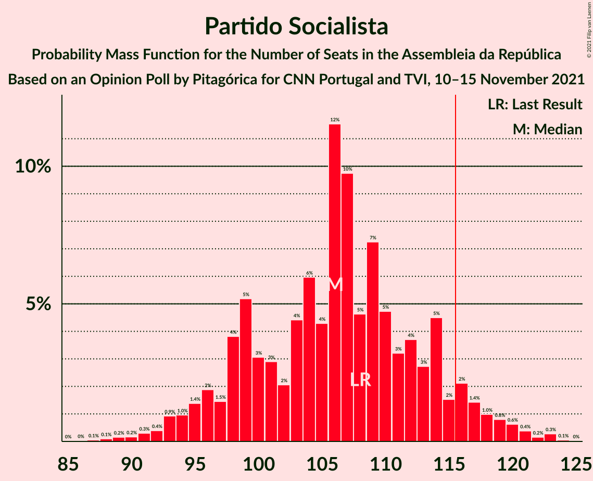

| Number of Seats | Probability | Accumulated | Special Marks |
|:---------------:|:-----------:|:-----------:|:-------------:|
| 86 | 0% | 100% |  |
| 87 | 0.1% | 99.9% |  |
| 88 | 0.1% | 99.9% |  |
| 89 | 0.2% | 99.8% |  |
| 90 | 0.2% | 99.6% |  |
| 91 | 0.3% | 99.5% |  |
| 92 | 0.4% | 99.2% |  |
| 93 | 0.9% | 98.8% |  |
| 94 | 1.0% | 98% |  |
| 95 | 1.4% | 97% |  |
| 96 | 2% | 95% |  |
| 97 | 1.5% | 94% |  |
| 98 | 4% | 92% |  |
| 99 | 5% | 88% |  |
| 100 | 3% | 83% |  |
| 101 | 3% | 80% |  |
| 102 | 2% | 77% |  |
| 103 | 4% | 75% |  |
| 104 | 6% | 71% |  |
| 105 | 4% | 65% |  |
| 106 | 12% | 60% | Median |
| 107 | 10% | 49% |  |
| 108 | 5% | 39% | Last Result |
| 109 | 7% | 35% |  |
| 110 | 5% | 27% |  |
| 111 | 3% | 23% |  |
| 112 | 4% | 19% |  |
| 113 | 3% | 16% |  |
| 114 | 5% | 13% |  |
| 115 | 2% | 8% |  |
| 116 | 2% | 7% | Majority |
| 117 | 1.4% | 5% |  |
| 118 | 1.0% | 3% |  |
| 119 | 0.8% | 2% |  |
| 120 | 0.6% | 2% |  |
| 121 | 0.4% | 0.9% |  |
| 122 | 0.2% | 0.5% |  |
| 123 | 0.3% | 0.4% |  |
| 124 | 0.1% | 0.1% |  |
| 125 | 0% | 0% |  |

### Partido Social Democrata

*For a full overview of the results for this party, see the [Partido Social Democrata](party-partidosocialdemocrata.html) page.*

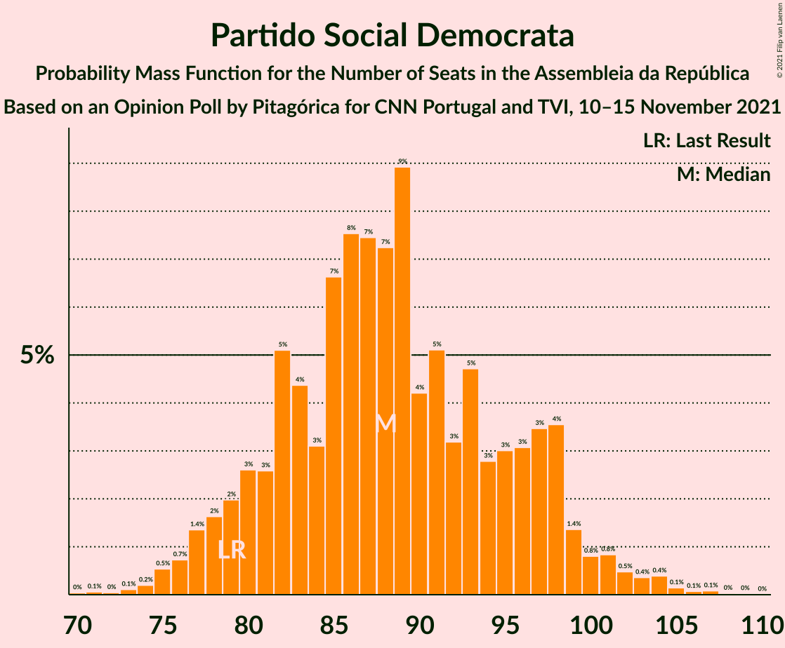

| Number of Seats | Probability | Accumulated | Special Marks |
|:---------------:|:-----------:|:-----------:|:-------------:|
| 70 | 0% | 100% |  |
| 71 | 0.1% | 99.9% |  |
| 72 | 0% | 99.9% |  |
| 73 | 0.1% | 99.8% |  |
| 74 | 0.2% | 99.7% |  |
| 75 | 0.5% | 99.5% |  |
| 76 | 0.7% | 99.0% |  |
| 77 | 1.4% | 98% |  |
| 78 | 2% | 97% |  |
| 79 | 2% | 95% | Last Result |
| 80 | 3% | 93% |  |
| 81 | 3% | 91% |  |
| 82 | 5% | 88% |  |
| 83 | 4% | 83% |  |
| 84 | 3% | 79% |  |
| 85 | 7% | 76% |  |
| 86 | 8% | 69% |  |
| 87 | 7% | 61% |  |
| 88 | 7% | 54% | Median |
| 89 | 9% | 47% |  |
| 90 | 4% | 38% |  |
| 91 | 5% | 34% |  |
| 92 | 3% | 28% |  |
| 93 | 5% | 25% |  |
| 94 | 3% | 20% |  |
| 95 | 3% | 18% |  |
| 96 | 3% | 15% |  |
| 97 | 3% | 12% |  |
| 98 | 4% | 8% |  |
| 99 | 1.4% | 5% |  |
| 100 | 0.8% | 3% |  |
| 101 | 0.8% | 2% |  |
| 102 | 0.5% | 2% |  |
| 103 | 0.4% | 1.1% |  |
| 104 | 0.4% | 0.8% |  |
| 105 | 0.1% | 0.4% |  |
| 106 | 0.1% | 0.2% |  |
| 107 | 0.1% | 0.1% |  |
| 108 | 0% | 0.1% |  |
| 109 | 0% | 0% |  |

### Chega

*For a full overview of the results for this party, see the [Chega](party-chega.html) page.*

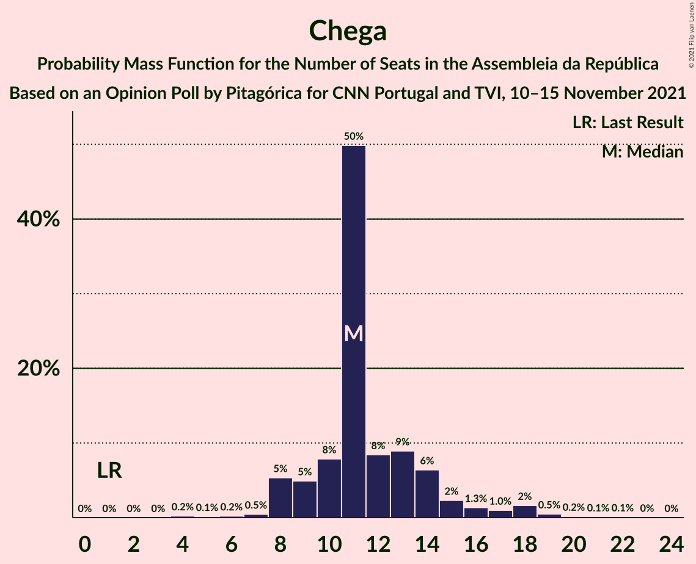

| Number of Seats | Probability | Accumulated | Special Marks |
|:---------------:|:-----------:|:-----------:|:-------------:|
| 1 | 0% | 100% | Last Result |
| 2 | 0% | 100% |  |
| 3 | 0% | 100% |  |
| 4 | 0.2% | 100% |  |
| 5 | 0.1% | 99.8% |  |
| 6 | 0.2% | 99.6% |  |
| 7 | 0.5% | 99.4% |  |
| 8 | 5% | 99.0% |  |
| 9 | 5% | 94% |  |
| 10 | 8% | 89% |  |
| 11 | 50% | 81% | Median |
| 12 | 8% | 31% |  |
| 13 | 9% | 23% |  |
| 14 | 6% | 14% |  |
| 15 | 2% | 7% |  |
| 16 | 1.3% | 5% |  |
| 17 | 1.0% | 4% |  |
| 18 | 2% | 3% |  |
| 19 | 0.5% | 0.9% |  |
| 20 | 0.2% | 0.4% |  |
| 21 | 0.1% | 0.2% |  |
| 22 | 0.1% | 0.1% |  |
| 23 | 0% | 0.1% |  |
| 24 | 0% | 0% |  |

### Bloco de Esquerda

*For a full overview of the results for this party, see the [Bloco de Esquerda](party-blocodeesquerda.html) page.*

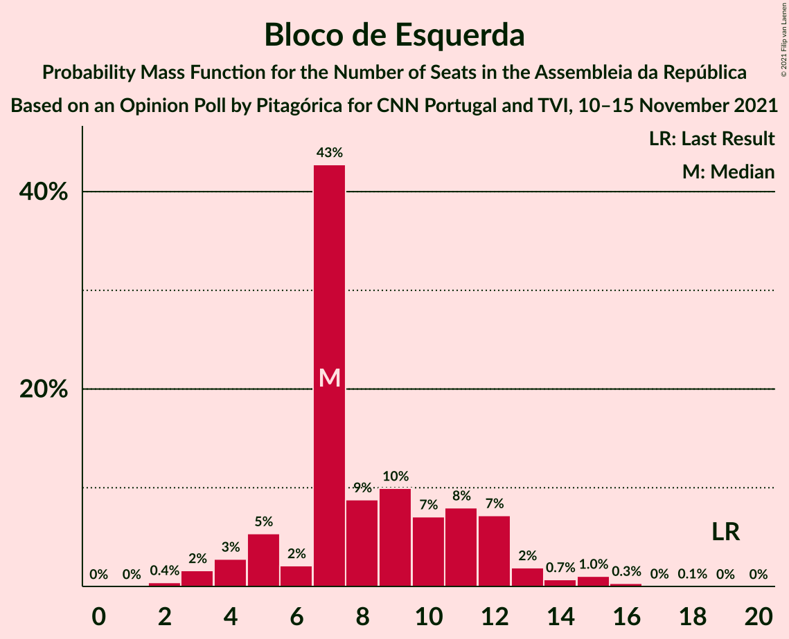

| Number of Seats | Probability | Accumulated | Special Marks |
|:---------------:|:-----------:|:-----------:|:-------------:|
| 2 | 0.4% | 100% |  |
| 3 | 2% | 99.6% |  |
| 4 | 3% | 98% |  |
| 5 | 5% | 95% |  |
| 6 | 2% | 90% |  |
| 7 | 43% | 88% | Median |
| 8 | 9% | 45% |  |
| 9 | 10% | 36% |  |
| 10 | 7% | 26% |  |
| 11 | 8% | 19% |  |
| 12 | 7% | 11% |  |
| 13 | 2% | 4% |  |
| 14 | 0.7% | 2% |  |
| 15 | 1.0% | 1.5% |  |
| 16 | 0.3% | 0.4% |  |
| 17 | 0% | 0.1% |  |
| 18 | 0.1% | 0.1% |  |
| 19 | 0% | 0% | Last Result |

### Coligação Democrática Unitária

*For a full overview of the results for this party, see the [Coligação Democrática Unitária](party-coligaçãodemocráticaunitária.html) page.*

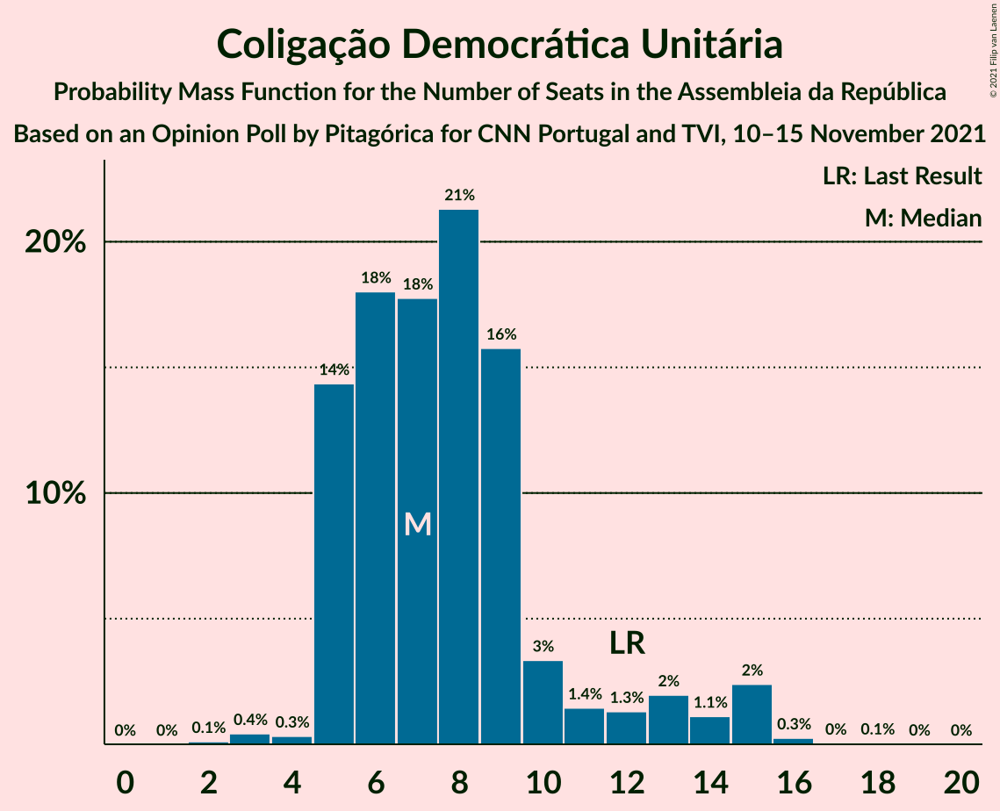

| Number of Seats | Probability | Accumulated | Special Marks |
|:---------------:|:-----------:|:-----------:|:-------------:|
| 2 | 0.1% | 100% |  |
| 3 | 0.4% | 99.9% |  |
| 4 | 0.3% | 99.5% |  |
| 5 | 14% | 99.1% |  |
| 6 | 18% | 85% |  |
| 7 | 18% | 67% | Median |
| 8 | 21% | 49% |  |
| 9 | 16% | 28% |  |
| 10 | 3% | 12% |  |
| 11 | 1.4% | 9% |  |
| 12 | 1.3% | 7% | Last Result |
| 13 | 2% | 6% |  |
| 14 | 1.1% | 4% |  |
| 15 | 2% | 3% |  |
| 16 | 0.3% | 0.4% |  |
| 17 | 0% | 0.1% |  |
| 18 | 0.1% | 0.1% |  |
| 19 | 0% | 0% |  |

### Iniciativa Liberal

*For a full overview of the results for this party, see the [Iniciativa Liberal](party-iniciativaliberal.html) page.*

| Number of Seats | Probability | Accumulated | Special Marks |
|:---------------:|:-----------:|:-----------:|:-------------:|
| 1 | 0% | 100% | Last Result |
| 2 | 0% | 100% |  |
| 3 | 5% | 100% |  |
| 4 | 21% | 95% |  |
| 5 | 18% | 74% |  |
| 6 | 41% | 56% | Median |
| 7 | 4% | 15% |  |
| 8 | 5% | 11% |  |
| 9 | 4% | 6% |  |
| 10 | 1.2% | 3% |  |
| 11 | 0.7% | 1.4% |  |
| 12 | 0.6% | 0.7% |  |
| 13 | 0% | 0.1% |  |
| 14 | 0% | 0% |  |

### Pessoas–Animais–Natureza

*For a full overview of the results for this party, see the [Pessoas–Animais–Natureza](party-pessoas–animais–natureza.html) page.*

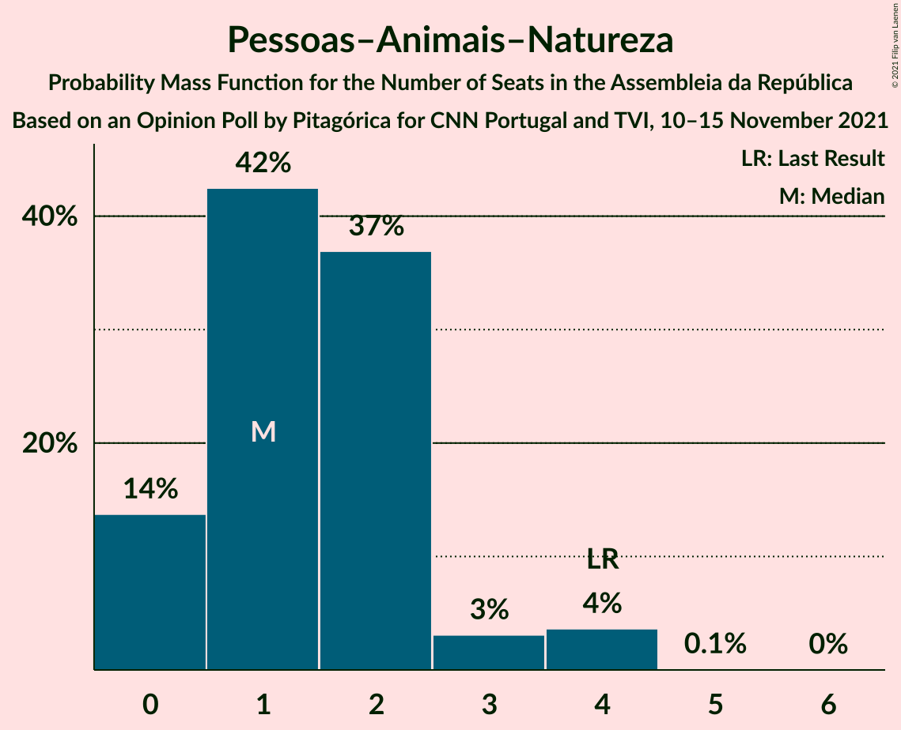

| Number of Seats | Probability | Accumulated | Special Marks |
|:---------------:|:-----------:|:-----------:|:-------------:|
| 0 | 14% | 100% |  |
| 1 | 42% | 86% | Median |
| 2 | 37% | 44% |  |
| 3 | 3% | 7% |  |
| 4 | 4% | 4% | Last Result |
| 5 | 0.1% | 0.1% |  |
| 6 | 0% | 0% |  |

### CDS–Partido Popular

*For a full overview of the results for this party, see the [CDS–Partido Popular](party-cds–partidopopular.html) page.*

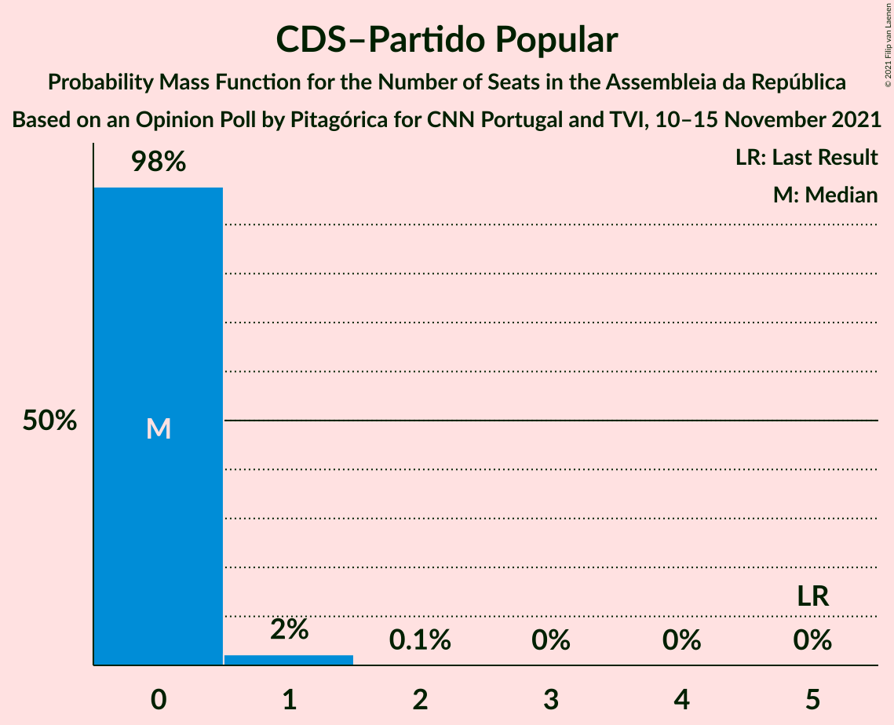

| Number of Seats | Probability | Accumulated | Special Marks |
|:---------------:|:-----------:|:-----------:|:-------------:|
| 0 | 98% | 100% | Median |
| 1 | 2% | 2% |  |
| 2 | 0.1% | 0.1% |  |
| 3 | 0% | 0% |  |
| 4 | 0% | 0% |  |
| 5 | 0% | 0% | Last Result |

## Coalitions

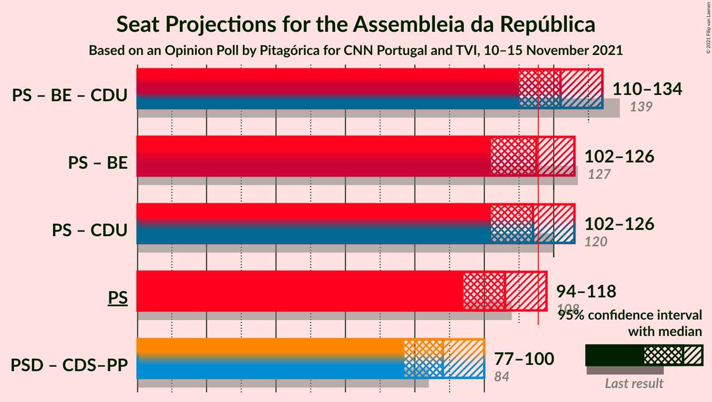

### Confidence Intervals

| Coalition | Last Result | Median | Majority? | 80% Confidence Interval | 90% Confidence Interval | 95% Confidence Interval | 99% Confidence Interval |
|:---------:|:-----------:|:------:|:---------:|:-----------------------:|:-----------------------:|:-----------------------:|:-----------------------:|
| Partido Socialista – Bloco de Esquerda – Coligação Democrática Unitária | 139 | 122 | 83% | 114–129 | 111–132 | 110–134 | 106–137 |
| Partido Socialista – Bloco de Esquerda | 127 | 115 | 45% | 106–122 | 104–124 | 102–126 | 99–130 |
| Partido Socialista – Coligação Democrática Unitária | 120 | 114 | 38% | 105–122 | 103–124 | 102–126 | 98–129 |
| Partido Socialista | 108 | 106 | 7% | 98–114 | 96–116 | 94–118 | 90–122 |
| Partido Social Democrata – CDS–Partido Popular | 84 | 88 | 0% | 81–97 | 79–98 | 77–100 | 75–104 |

### Partido Socialista – Bloco de Esquerda – Coligação Democrática Unitária

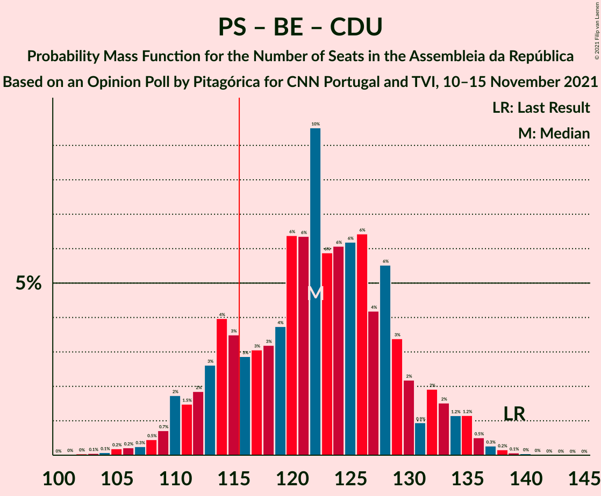

| Number of Seats | Probability | Accumulated | Special Marks |
|:---------------:|:-----------:|:-----------:|:-------------:|
| 102 | 0% | 100% |  |
| 103 | 0.1% | 99.9% |  |
| 104 | 0.1% | 99.9% |  |
| 105 | 0.2% | 99.8% |  |
| 106 | 0.2% | 99.6% |  |
| 107 | 0.3% | 99.4% |  |
| 108 | 0.5% | 99.1% |  |
| 109 | 0.7% | 98.7% |  |
| 110 | 2% | 98% |  |
| 111 | 1.5% | 96% |  |
| 112 | 2% | 95% |  |
| 113 | 3% | 93% |  |
| 114 | 4% | 90% |  |
| 115 | 3% | 86% |  |
| 116 | 3% | 83% | Majority |
| 117 | 3% | 80% |  |
| 118 | 3% | 77% |  |
| 119 | 4% | 74% |  |
| 120 | 6% | 70% | Median |
| 121 | 6% | 64% |  |
| 122 | 10% | 57% |  |
| 123 | 6% | 48% |  |
| 124 | 6% | 42% |  |
| 125 | 6% | 36% |  |
| 126 | 6% | 30% |  |
| 127 | 4% | 23% |  |
| 128 | 6% | 19% |  |
| 129 | 3% | 13% |  |
| 130 | 2% | 10% |  |
| 131 | 0.9% | 8% |  |
| 132 | 2% | 7% |  |
| 133 | 2% | 5% |  |
| 134 | 1.2% | 3% |  |
| 135 | 1.2% | 2% |  |
| 136 | 0.5% | 1.1% |  |
| 137 | 0.3% | 0.6% |  |
| 138 | 0.2% | 0.3% |  |
| 139 | 0.1% | 0.2% | Last Result |
| 140 | 0% | 0.1% |  |
| 141 | 0% | 0% |  |

### Partido Socialista – Bloco de Esquerda

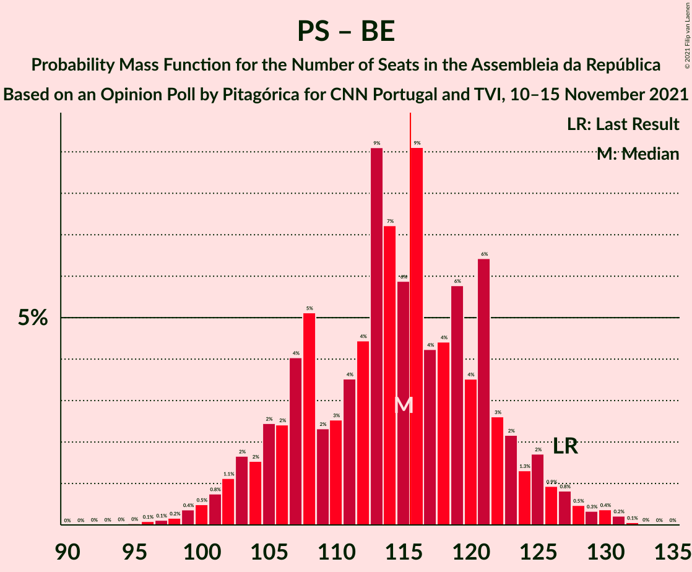

| Number of Seats | Probability | Accumulated | Special Marks |
|:---------------:|:-----------:|:-----------:|:-------------:|
| 94 | 0% | 100% |  |
| 95 | 0% | 99.9% |  |
| 96 | 0.1% | 99.9% |  |
| 97 | 0.1% | 99.8% |  |
| 98 | 0.2% | 99.7% |  |
| 99 | 0.4% | 99.5% |  |
| 100 | 0.5% | 99.2% |  |
| 101 | 0.8% | 98.7% |  |
| 102 | 1.1% | 98% |  |
| 103 | 2% | 97% |  |
| 104 | 2% | 95% |  |
| 105 | 2% | 94% |  |
| 106 | 2% | 91% |  |
| 107 | 4% | 89% |  |
| 108 | 5% | 85% |  |
| 109 | 2% | 80% |  |
| 110 | 3% | 77% |  |
| 111 | 4% | 75% |  |
| 112 | 4% | 71% |  |
| 113 | 9% | 67% | Median |
| 114 | 7% | 58% |  |
| 115 | 6% | 50% |  |
| 116 | 9% | 45% | Majority |
| 117 | 4% | 35% |  |
| 118 | 4% | 31% |  |
| 119 | 6% | 27% |  |
| 120 | 4% | 21% |  |
| 121 | 6% | 17% |  |
| 122 | 3% | 11% |  |
| 123 | 2% | 8% |  |
| 124 | 1.3% | 6% |  |
| 125 | 2% | 5% |  |
| 126 | 0.9% | 3% |  |
| 127 | 0.8% | 2% | Last Result |
| 128 | 0.5% | 1.5% |  |
| 129 | 0.3% | 1.0% |  |
| 130 | 0.4% | 0.7% |  |
| 131 | 0.2% | 0.3% |  |
| 132 | 0.1% | 0.1% |  |
| 133 | 0% | 0% |  |

### Partido Socialista – Coligação Democrática Unitária

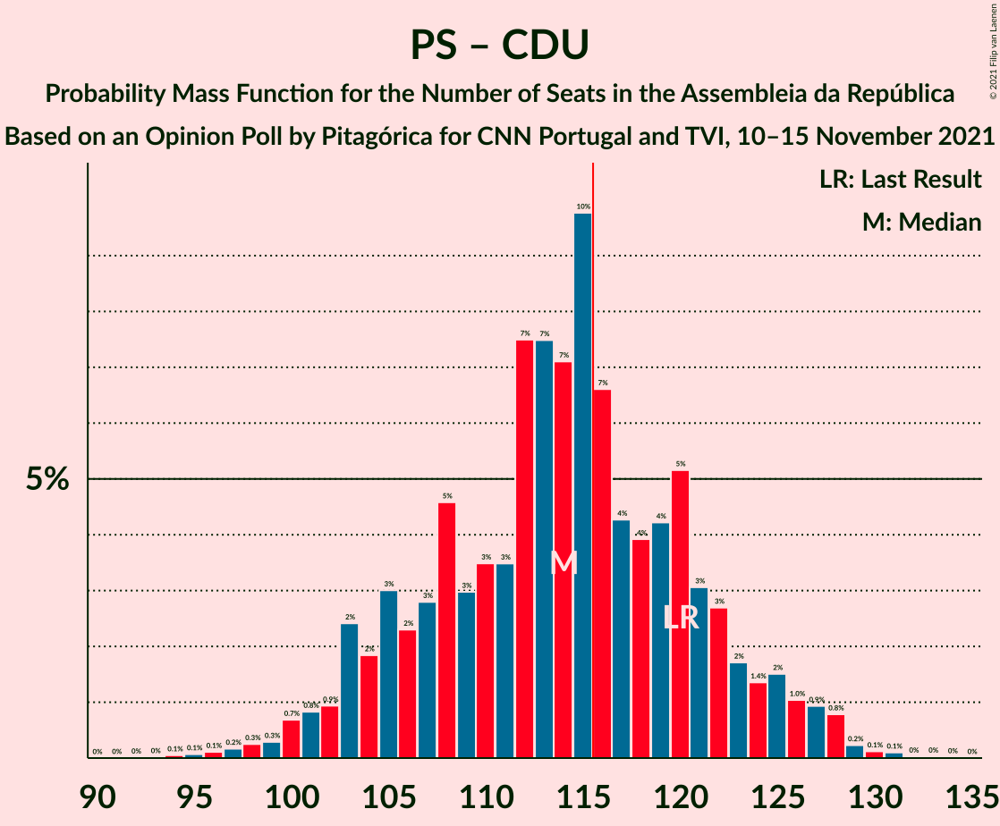

| Number of Seats | Probability | Accumulated | Special Marks |
|:---------------:|:-----------:|:-----------:|:-------------:|
| 94 | 0.1% | 100% |  |
| 95 | 0.1% | 99.9% |  |
| 96 | 0.1% | 99.8% |  |
| 97 | 0.2% | 99.7% |  |
| 98 | 0.3% | 99.6% |  |
| 99 | 0.3% | 99.3% |  |
| 100 | 0.7% | 99.0% |  |
| 101 | 0.8% | 98% |  |
| 102 | 0.9% | 98% |  |
| 103 | 2% | 97% |  |
| 104 | 2% | 94% |  |
| 105 | 3% | 92% |  |
| 106 | 2% | 89% |  |
| 107 | 3% | 87% |  |
| 108 | 5% | 84% |  |
| 109 | 3% | 80% |  |
| 110 | 3% | 77% |  |
| 111 | 3% | 73% |  |
| 112 | 7% | 70% |  |
| 113 | 7% | 62% | Median |
| 114 | 7% | 55% |  |
| 115 | 10% | 48% |  |
| 116 | 7% | 38% | Majority |
| 117 | 4% | 31% |  |
| 118 | 4% | 27% |  |
| 119 | 4% | 23% |  |
| 120 | 5% | 19% | Last Result |
| 121 | 3% | 14% |  |
| 122 | 3% | 11% |  |
| 123 | 2% | 8% |  |
| 124 | 1.4% | 6% |  |
| 125 | 2% | 5% |  |
| 126 | 1.0% | 3% |  |
| 127 | 0.9% | 2% |  |
| 128 | 0.8% | 1.3% |  |
| 129 | 0.2% | 0.5% |  |
| 130 | 0.1% | 0.3% |  |
| 131 | 0.1% | 0.2% |  |
| 132 | 0% | 0.1% |  |
| 133 | 0% | 0.1% |  |
| 134 | 0% | 0% |  |

### Partido Socialista

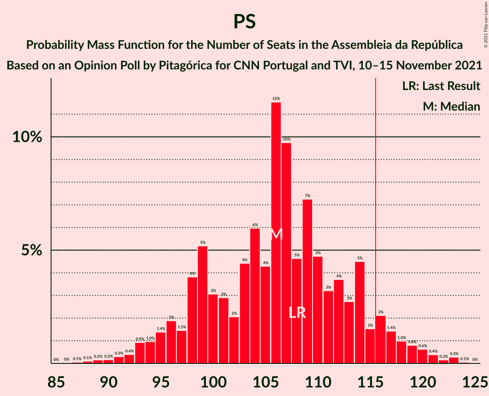

| Number of Seats | Probability | Accumulated | Special Marks |
|:---------------:|:-----------:|:-----------:|:-------------:|
| 86 | 0% | 100% |  |
| 87 | 0.1% | 99.9% |  |
| 88 | 0.1% | 99.9% |  |
| 89 | 0.2% | 99.8% |  |
| 90 | 0.2% | 99.6% |  |
| 91 | 0.3% | 99.5% |  |
| 92 | 0.4% | 99.2% |  |
| 93 | 0.9% | 98.8% |  |
| 94 | 1.0% | 98% |  |
| 95 | 1.4% | 97% |  |
| 96 | 2% | 95% |  |
| 97 | 1.5% | 94% |  |
| 98 | 4% | 92% |  |
| 99 | 5% | 88% |  |
| 100 | 3% | 83% |  |
| 101 | 3% | 80% |  |
| 102 | 2% | 77% |  |
| 103 | 4% | 75% |  |
| 104 | 6% | 71% |  |
| 105 | 4% | 65% |  |
| 106 | 12% | 60% | Median |
| 107 | 10% | 49% |  |
| 108 | 5% | 39% | Last Result |
| 109 | 7% | 35% |  |
| 110 | 5% | 27% |  |
| 111 | 3% | 23% |  |
| 112 | 4% | 19% |  |
| 113 | 3% | 16% |  |
| 114 | 5% | 13% |  |
| 115 | 2% | 8% |  |
| 116 | 2% | 7% | Majority |
| 117 | 1.4% | 5% |  |
| 118 | 1.0% | 3% |  |
| 119 | 0.8% | 2% |  |
| 120 | 0.6% | 2% |  |
| 121 | 0.4% | 0.9% |  |
| 122 | 0.2% | 0.5% |  |
| 123 | 0.3% | 0.4% |  |
| 124 | 0.1% | 0.1% |  |
| 125 | 0% | 0% |  |

### Partido Social Democrata – CDS–Partido Popular

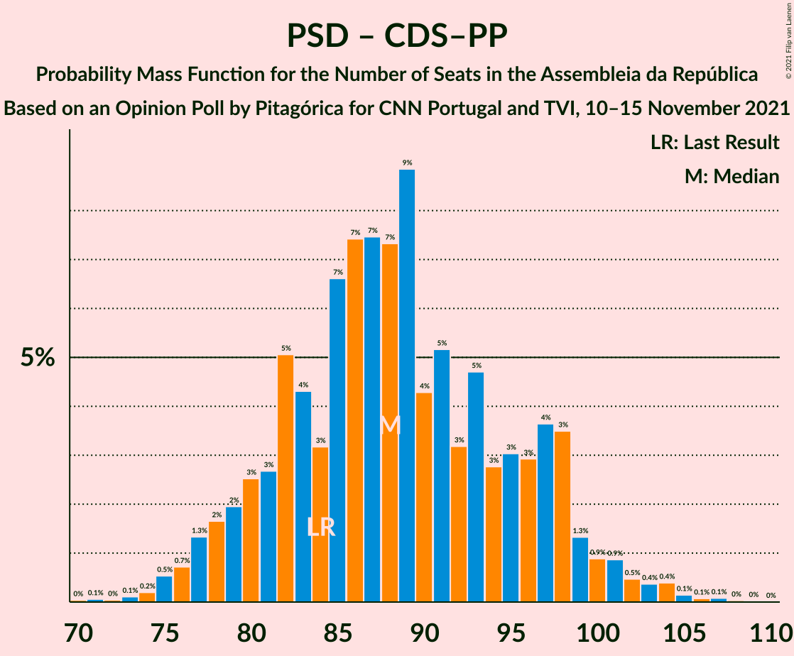

| Number of Seats | Probability | Accumulated | Special Marks |
|:---------------:|:-----------:|:-----------:|:-------------:|
| 70 | 0% | 100% |  |
| 71 | 0.1% | 99.9% |  |
| 72 | 0% | 99.9% |  |
| 73 | 0.1% | 99.8% |  |
| 74 | 0.2% | 99.7% |  |
| 75 | 0.5% | 99.5% |  |
| 76 | 0.7% | 99.0% |  |
| 77 | 1.3% | 98% |  |
| 78 | 2% | 97% |  |
| 79 | 2% | 95% |  |
| 80 | 3% | 93% |  |
| 81 | 3% | 91% |  |
| 82 | 5% | 88% |  |
| 83 | 4% | 83% |  |
| 84 | 3% | 79% | Last Result |
| 85 | 7% | 76% |  |
| 86 | 7% | 69% |  |
| 87 | 7% | 62% |  |
| 88 | 7% | 54% | Median |
| 89 | 9% | 47% |  |
| 90 | 4% | 38% |  |
| 91 | 5% | 34% |  |
| 92 | 3% | 28% |  |
| 93 | 5% | 25% |  |
| 94 | 3% | 21% |  |
| 95 | 3% | 18% |  |
| 96 | 3% | 15% |  |
| 97 | 4% | 12% |  |
| 98 | 3% | 8% |  |
| 99 | 1.3% | 5% |  |
| 100 | 0.9% | 3% |  |
| 101 | 0.9% | 2% |  |
| 102 | 0.5% | 2% |  |
| 103 | 0.4% | 1.1% |  |
| 104 | 0.4% | 0.8% |  |
| 105 | 0.1% | 0.4% |  |
| 106 | 0.1% | 0.2% |  |
| 107 | 0.1% | 0.1% |  |
| 108 | 0% | 0.1% |  |
| 109 | 0% | 0% |  |

## Technical Information

### Opinion Poll

+ **Polling firm:** Pitagórica
+ **Commissioner(s):** CNN Portugal and TVI
+ **Fieldwork period:** 10–15 November 2021

### Calculations

+ **Sample size:** 625
+ **Simulations done:** 1,048,576
+ **Error estimate:** 1.42%

