# Opinion Poll by Pitagórica for CNN Portugal and TVI, 7–12 December 2021

<a href="#voting-intentions">Voting Intentions</a> | <a href="#seats">Seats</a> | <a href="#coalitions">Coalitions</a> | <a href="#technical-information">Technical Information</a>

## Voting Intentions

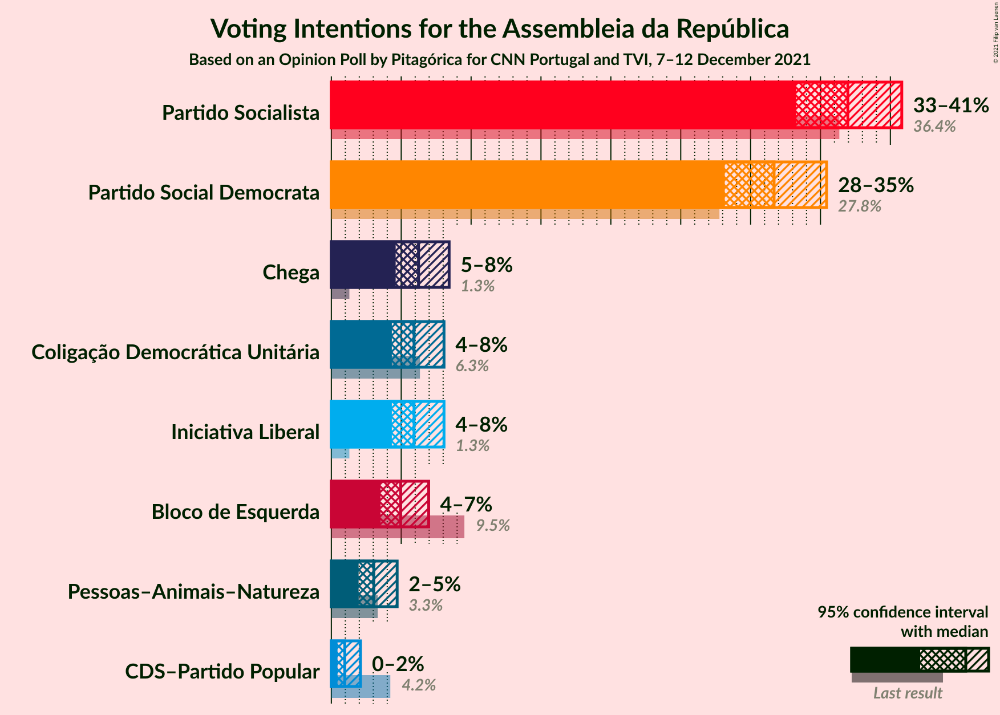

### Confidence Intervals

| Party | Last Result | Poll Result | 80% Confidence Interval | 90% Confidence Interval | 95% Confidence Interval | 99% Confidence Interval |
|:-----:|:-----------:|:-----------:|:-----------------------:|:-----------------------:|:-----------------------:|:-----------------------:|
| Partido Socialista | 36.4% | 37.0% | 34.5–39.5% |33.9–40.2% |33.3–40.8% |32.1–42.0% |
| Partido Social Democrata | 27.8% | 31.7% | 29.4–34.1% |28.7–34.8% |28.2–35.4% |27.1–36.6% |
| Chega | 1.3% | 6.2% | 5.2–7.7% |4.8–8.1% |4.6–8.4% |4.1–9.2% |
| Coligação Democrática Unitária | 6.3% | 5.9% | 4.9–7.3% |4.6–7.7% |4.3–8.1% |3.9–8.8% |
| Iniciativa Liberal | 1.3% | 5.9% | 4.9–7.3% |4.6–7.7% |4.3–8.1% |3.9–8.8% |
| Bloco de Esquerda | 9.5% | 5.0% | 4.0–6.3% |3.7–6.6% |3.5–7.0% |3.1–7.6% |
| Pessoas–Animais–Natureza | 3.3% | 3.0% | 2.3–4.1% |2.1–4.4% |2.0–4.7% |1.7–5.3% |
| CDS–Partido Popular | 4.2% | 1.0% | 0.6–1.7% |0.5–1.9% |0.4–2.1% |0.3–2.5% |

*Note:* The poll result column reflects the actual value used in the calculations. Published results may vary slightly, and in addition be rounded to fewer digits.

## Seats

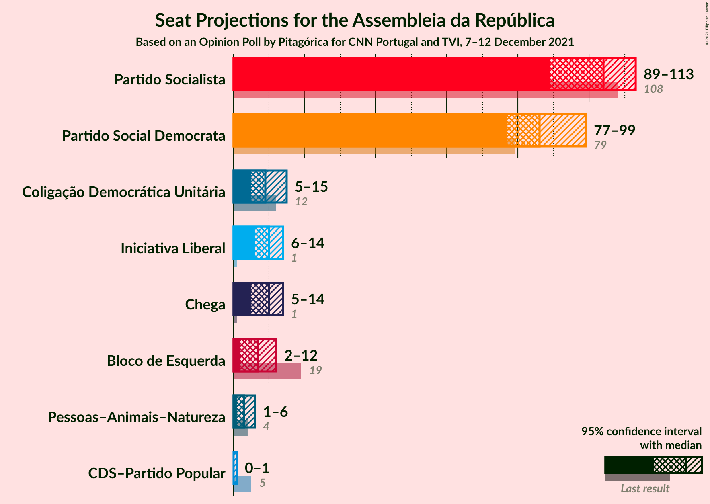

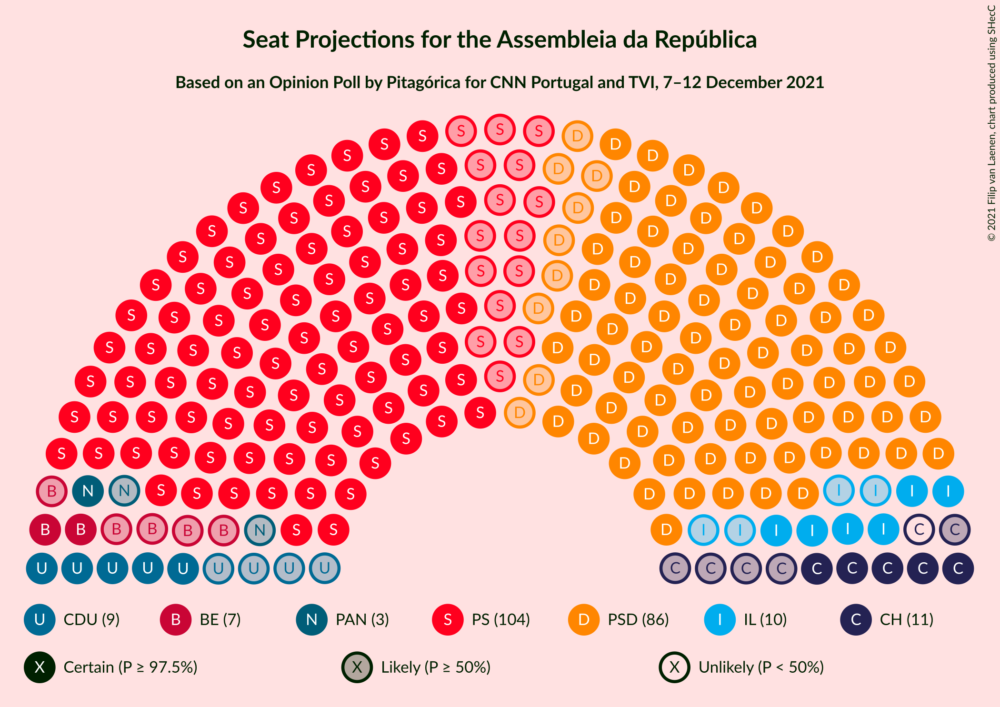

### Confidence Intervals

| Party | Last Result | Median | 80% Confidence Interval | 90% Confidence Interval | 95% Confidence Interval | 99% Confidence Interval |
|:-----:|:-----------:|:------:|:-----------------------:|:-----------------------:|:-----------------------:|:-----------------------:|
| <a href="#partido-socialista">Partido Socialista</a> | 108 | 104 | 93–110 |91–112 |89–113 |87–119 |
| <a href="#partido-social-democrata">Partido Social Democrata</a> | 79 | 86 | 80–95 |78–97 |77–99 |73–103 |
| <a href="#chega">Chega</a> | 1 | 10 | 7–11 |6–13 |5–14 |4–16 |
| <a href="#coligação-democrática-unitária">Coligação Democrática Unitária</a> | 12 | 9 | 6–14 |6–15 |5–15 |5–18 |
| <a href="#iniciativa-liberal">Iniciativa Liberal</a> | 1 | 10 | 6–12 |6–14 |6–14 |5–15 |
| <a href="#bloco-de-esquerda">Bloco de Esquerda</a> | 19 | 7 | 4–10 |3–11 |2–12 |2–14 |
| <a href="#pessoas–animais–natureza">Pessoas–Animais–Natureza</a> | 4 | 3 | 2–4 |1–5 |1–6 |1–8 |
| <a href="#cds–partido-popular">CDS–Partido Popular</a> | 5 | 0 | 0 |0 |0–1 |0–1 |

### Partido Socialista

*For a full overview of the results for this party, see the [Partido Socialista](party-partidosocialista.html) page.*

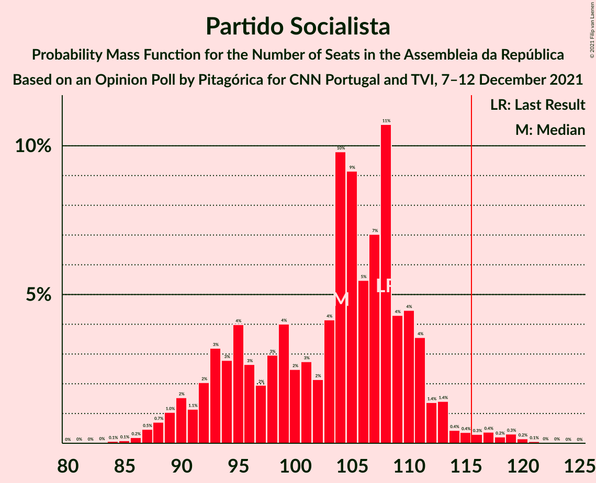

| Number of Seats | Probability | Accumulated | Special Marks |
|:---------------:|:-----------:|:-----------:|:-------------:|
| 83 | 0% | 100% |  |
| 84 | 0.1% | 99.9% |  |
| 85 | 0.1% | 99.9% |  |
| 86 | 0.2% | 99.8% |  |
| 87 | 0.5% | 99.6% |  |
| 88 | 0.7% | 99.1% |  |
| 89 | 1.0% | 98% |  |
| 90 | 2% | 97% |  |
| 91 | 1.1% | 96% |  |
| 92 | 2% | 95% |  |
| 93 | 3% | 93% |  |
| 94 | 3% | 89% |  |
| 95 | 4% | 87% |  |
| 96 | 3% | 83% |  |
| 97 | 2% | 80% |  |
| 98 | 3% | 78% |  |
| 99 | 4% | 75% |  |
| 100 | 2% | 71% |  |
| 101 | 3% | 69% |  |
| 102 | 2% | 66% |  |
| 103 | 4% | 64% |  |
| 104 | 10% | 60% | Median |
| 105 | 9% | 50% |  |
| 106 | 5% | 41% |  |
| 107 | 7% | 35% |  |
| 108 | 11% | 28% | Last Result |
| 109 | 4% | 17% |  |
| 110 | 4% | 13% |  |
| 111 | 4% | 9% |  |
| 112 | 1.4% | 5% |  |
| 113 | 1.4% | 4% |  |
| 114 | 0.4% | 2% |  |
| 115 | 0.4% | 2% |  |
| 116 | 0.3% | 1.5% | Majority |
| 117 | 0.4% | 1.2% |  |
| 118 | 0.2% | 0.8% |  |
| 119 | 0.3% | 0.6% |  |
| 120 | 0.2% | 0.3% |  |
| 121 | 0.1% | 0.1% |  |
| 122 | 0% | 0.1% |  |
| 123 | 0% | 0% |  |

### Partido Social Democrata

*For a full overview of the results for this party, see the [Partido Social Democrata](party-partidosocialdemocrata.html) page.*

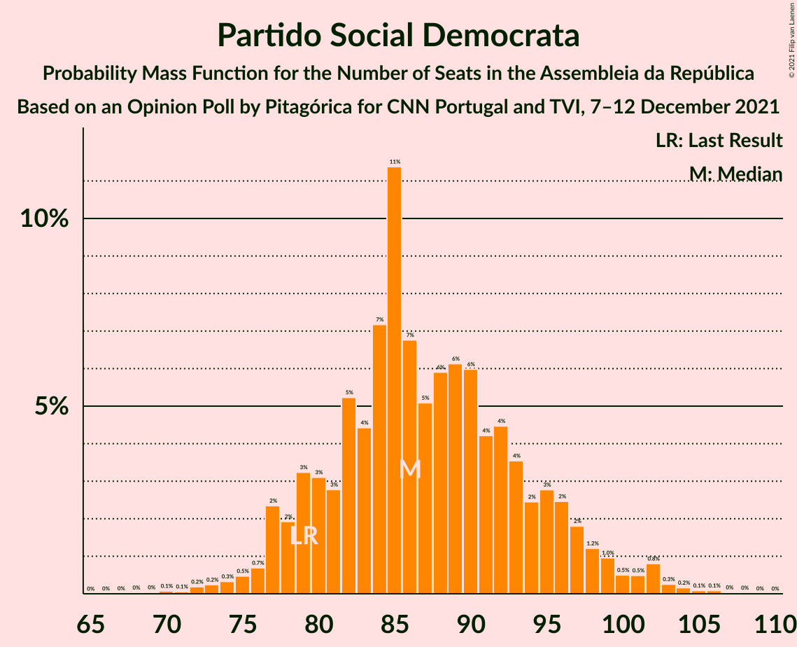

| Number of Seats | Probability | Accumulated | Special Marks |
|:---------------:|:-----------:|:-----------:|:-------------:|
| 68 | 0% | 100% |  |
| 69 | 0% | 99.9% |  |
| 70 | 0.1% | 99.9% |  |
| 71 | 0.1% | 99.8% |  |
| 72 | 0.2% | 99.8% |  |
| 73 | 0.2% | 99.6% |  |
| 74 | 0.3% | 99.3% |  |
| 75 | 0.5% | 99.0% |  |
| 76 | 0.7% | 98.5% |  |
| 77 | 2% | 98% |  |
| 78 | 2% | 96% |  |
| 79 | 3% | 94% | Last Result |
| 80 | 3% | 90% |  |
| 81 | 3% | 87% |  |
| 82 | 5% | 84% |  |
| 83 | 4% | 79% |  |
| 84 | 7% | 75% |  |
| 85 | 11% | 68% |  |
| 86 | 7% | 56% | Median |
| 87 | 5% | 49% |  |
| 88 | 6% | 44% |  |
| 89 | 6% | 38% |  |
| 90 | 6% | 32% |  |
| 91 | 4% | 26% |  |
| 92 | 4% | 22% |  |
| 93 | 4% | 18% |  |
| 94 | 2% | 14% |  |
| 95 | 3% | 12% |  |
| 96 | 2% | 9% |  |
| 97 | 2% | 6% |  |
| 98 | 1.2% | 5% |  |
| 99 | 1.0% | 3% |  |
| 100 | 0.5% | 2% |  |
| 101 | 0.5% | 2% |  |
| 102 | 0.8% | 1.5% |  |
| 103 | 0.3% | 0.7% |  |
| 104 | 0.2% | 0.4% |  |
| 105 | 0.1% | 0.3% |  |
| 106 | 0.1% | 0.2% |  |
| 107 | 0% | 0.1% |  |
| 108 | 0% | 0% |  |

### Chega

*For a full overview of the results for this party, see the [Chega](party-chega.html) page.*

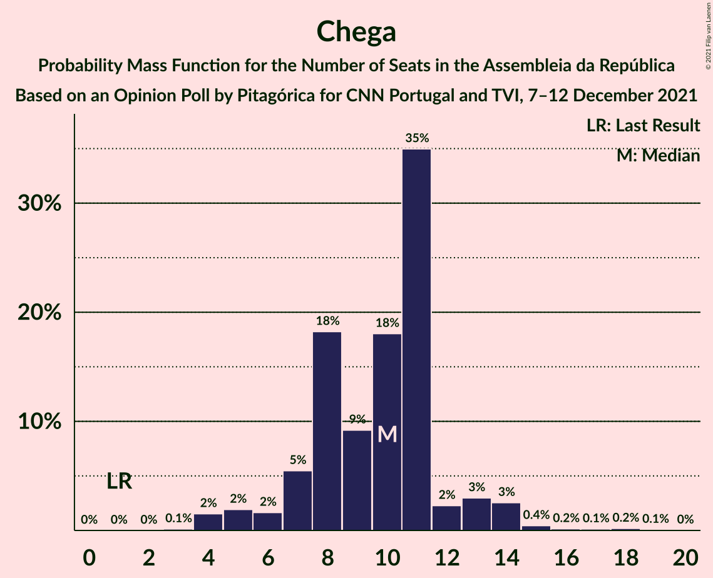

| Number of Seats | Probability | Accumulated | Special Marks |
|:---------------:|:-----------:|:-----------:|:-------------:|
| 1 | 0% | 100% | Last Result |
| 2 | 0% | 100% |  |
| 3 | 0.1% | 100% |  |
| 4 | 2% | 99.9% |  |
| 5 | 2% | 98% |  |
| 6 | 2% | 96% |  |
| 7 | 5% | 95% |  |
| 8 | 18% | 89% |  |
| 9 | 9% | 71% |  |
| 10 | 18% | 62% | Median |
| 11 | 35% | 44% |  |
| 12 | 2% | 9% |  |
| 13 | 3% | 7% |  |
| 14 | 3% | 4% |  |
| 15 | 0.4% | 1.0% |  |
| 16 | 0.2% | 0.6% |  |
| 17 | 0.1% | 0.4% |  |
| 18 | 0.2% | 0.3% |  |
| 19 | 0.1% | 0.1% |  |
| 20 | 0% | 0% |  |

### Coligação Democrática Unitária

*For a full overview of the results for this party, see the [Coligação Democrática Unitária](party-coligaçãodemocráticaunitária.html) page.*

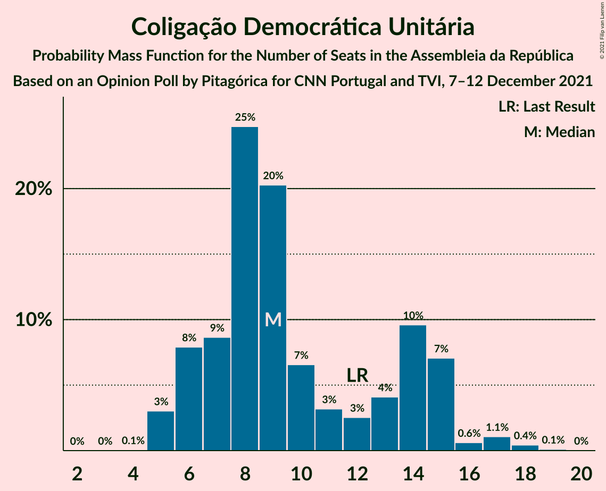

| Number of Seats | Probability | Accumulated | Special Marks |
|:---------------:|:-----------:|:-----------:|:-------------:|
| 4 | 0.1% | 100% |  |
| 5 | 3% | 99.9% |  |
| 6 | 8% | 97% |  |
| 7 | 9% | 89% |  |
| 8 | 25% | 80% |  |
| 9 | 20% | 56% | Median |
| 10 | 7% | 35% |  |
| 11 | 3% | 29% |  |
| 12 | 3% | 26% | Last Result |
| 13 | 4% | 23% |  |
| 14 | 10% | 19% |  |
| 15 | 7% | 9% |  |
| 16 | 0.6% | 2% |  |
| 17 | 1.1% | 2% |  |
| 18 | 0.4% | 0.6% |  |
| 19 | 0.1% | 0.2% |  |
| 20 | 0% | 0% |  |

### Iniciativa Liberal

*For a full overview of the results for this party, see the [Iniciativa Liberal](party-iniciativaliberal.html) page.*

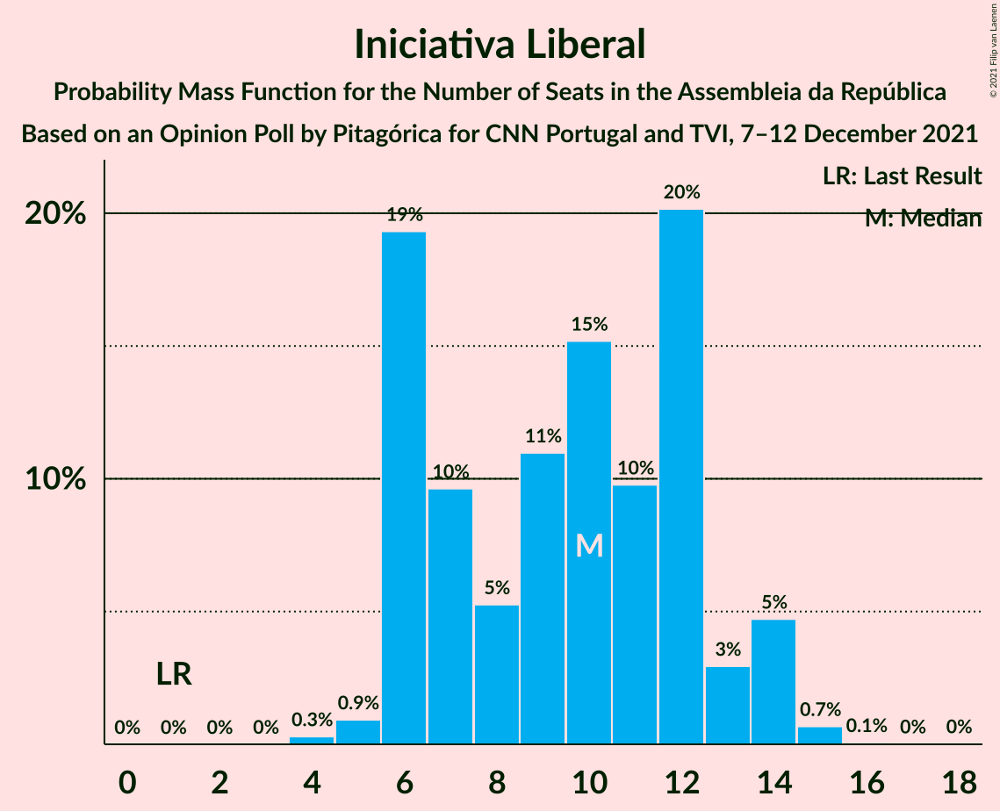

| Number of Seats | Probability | Accumulated | Special Marks |
|:---------------:|:-----------:|:-----------:|:-------------:|
| 1 | 0% | 100% | Last Result |
| 2 | 0% | 100% |  |
| 3 | 0% | 100% |  |
| 4 | 0.3% | 100% |  |
| 5 | 0.9% | 99.7% |  |
| 6 | 19% | 98.8% |  |
| 7 | 10% | 79% |  |
| 8 | 5% | 70% |  |
| 9 | 11% | 65% |  |
| 10 | 15% | 54% | Median |
| 11 | 10% | 38% |  |
| 12 | 20% | 29% |  |
| 13 | 3% | 8% |  |
| 14 | 5% | 6% |  |
| 15 | 0.7% | 0.8% |  |
| 16 | 0.1% | 0.1% |  |
| 17 | 0% | 0.1% |  |
| 18 | 0% | 0% |  |

### Bloco de Esquerda

*For a full overview of the results for this party, see the [Bloco de Esquerda](party-blocodeesquerda.html) page.*

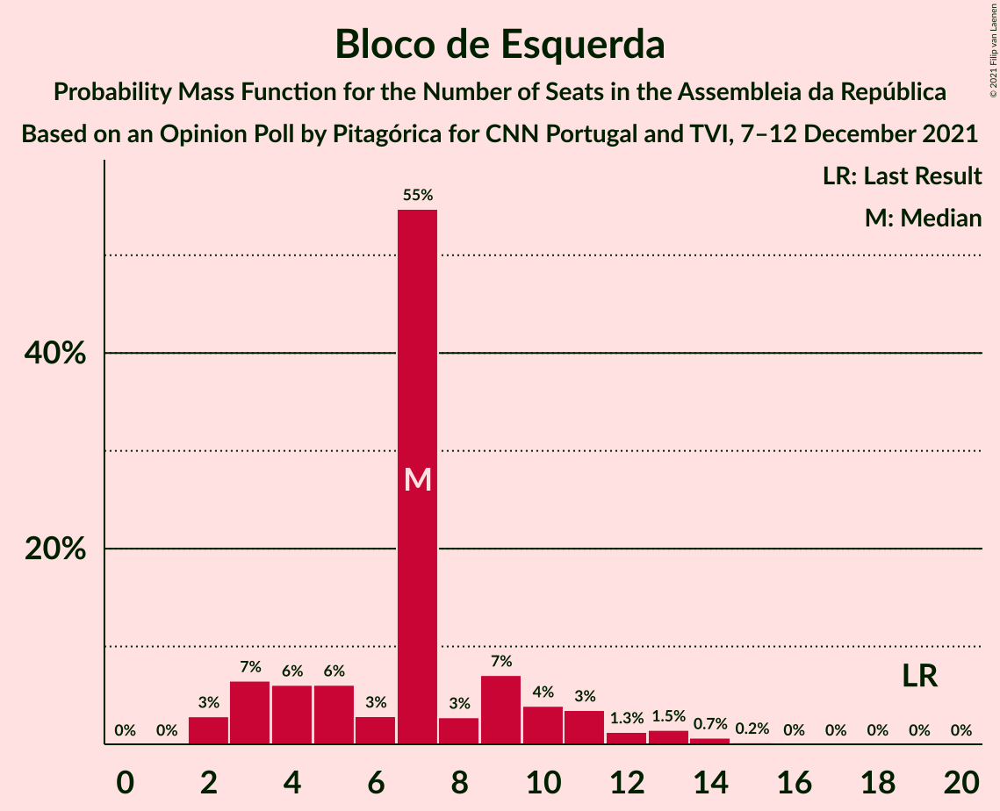

| Number of Seats | Probability | Accumulated | Special Marks |
|:---------------:|:-----------:|:-----------:|:-------------:|
| 2 | 3% | 100% |  |
| 3 | 7% | 97% |  |
| 4 | 6% | 91% |  |
| 5 | 6% | 85% |  |
| 6 | 3% | 78% |  |
| 7 | 55% | 76% | Median |
| 8 | 3% | 21% |  |
| 9 | 7% | 18% |  |
| 10 | 4% | 11% |  |
| 11 | 3% | 7% |  |
| 12 | 1.3% | 4% |  |
| 13 | 1.5% | 2% |  |
| 14 | 0.7% | 0.9% |  |
| 15 | 0.2% | 0.2% |  |
| 16 | 0% | 0% |  |
| 17 | 0% | 0% |  |
| 18 | 0% | 0% |  |
| 19 | 0% | 0% | Last Result |

### Pessoas–Animais–Natureza

*For a full overview of the results for this party, see the [Pessoas–Animais–Natureza](party-pessoas–animais–natureza.html) page.*

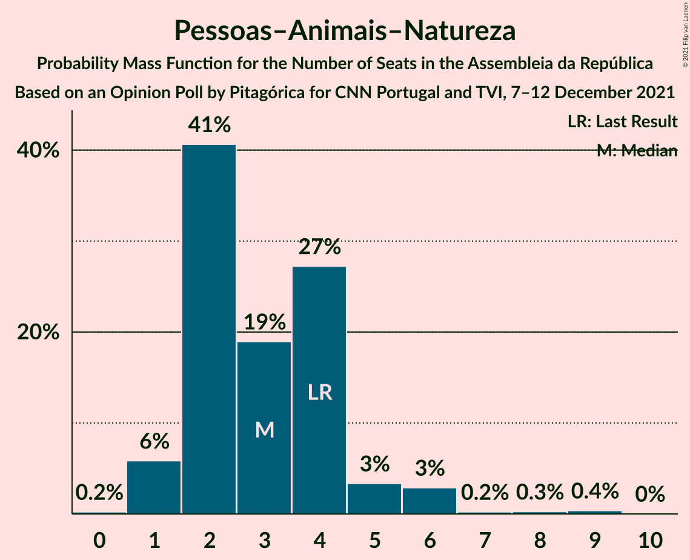

| Number of Seats | Probability | Accumulated | Special Marks |
|:---------------:|:-----------:|:-----------:|:-------------:|
| 0 | 0.2% | 100% |  |
| 1 | 6% | 99.8% |  |
| 2 | 41% | 94% |  |
| 3 | 19% | 53% | Median |
| 4 | 27% | 34% | Last Result |
| 5 | 3% | 7% |  |
| 6 | 3% | 4% |  |
| 7 | 0.2% | 0.9% |  |
| 8 | 0.3% | 0.7% |  |
| 9 | 0.4% | 0.4% |  |
| 10 | 0% | 0% |  |

### CDS–Partido Popular

*For a full overview of the results for this party, see the [CDS–Partido Popular](party-cds–partidopopular.html) page.*

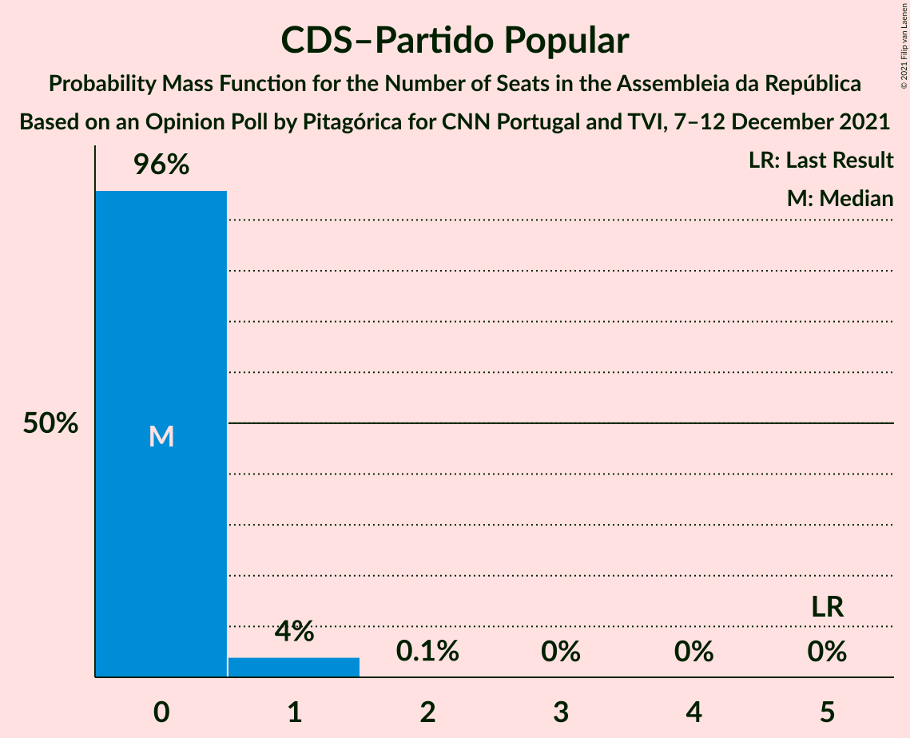

| Number of Seats | Probability | Accumulated | Special Marks |
|:---------------:|:-----------:|:-----------:|:-------------:|
| 0 | 96% | 100% | Median |
| 1 | 4% | 4% |  |
| 2 | 0.1% | 0.1% |  |
| 3 | 0% | 0% |  |
| 4 | 0% | 0% |  |
| 5 | 0% | 0% | Last Result |

## Coalitions

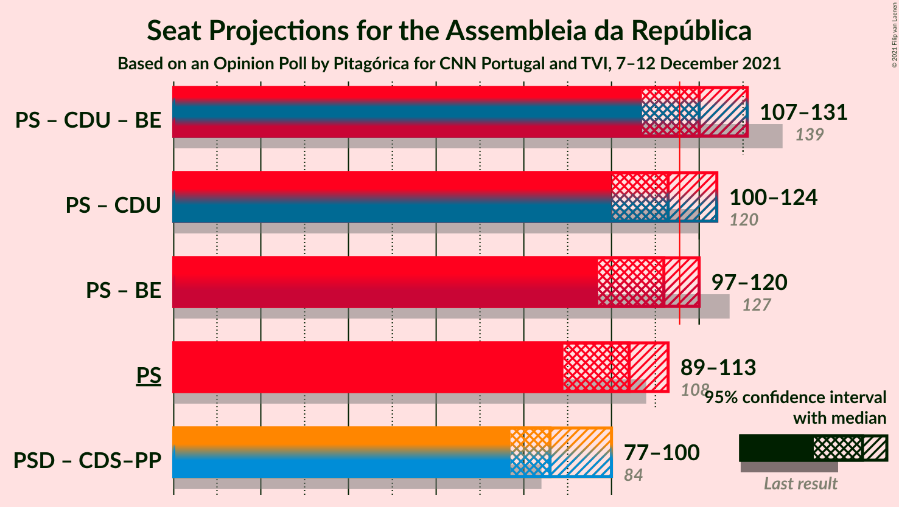

### Confidence Intervals

| Coalition | Last Result | Median | Majority? | 80% Confidence Interval | 90% Confidence Interval | 95% Confidence Interval | 99% Confidence Interval |
|:---------:|:-----------:|:------:|:---------:|:-----------------------:|:-----------------------:|:-----------------------:|:-----------------------:|
| Partido Socialista – Coligação Democrática Unitária – Bloco de Esquerda | 139 | 120 | 76% | 111–127 | 108–129 | 107–131 | 103–135 |
| Partido Socialista – Coligação Democrática Unitária | 120 | 113 | 35% | 104–120 | 101–123 | 100–124 | 96–128 |
| Partido Socialista – Bloco de Esquerda | 127 | 112 | 16% | 100–117 | 98–118 | 97–120 | 94–126 |
| Partido Socialista | 108 | 104 | 1.5% | 93–110 | 91–112 | 89–113 | 87–119 |
| Partido Social Democrata – CDS–Partido Popular | 84 | 86 | 0% | 80–95 | 78–97 | 77–100 | 73–103 |

### Partido Socialista – Coligação Democrática Unitária – Bloco de Esquerda

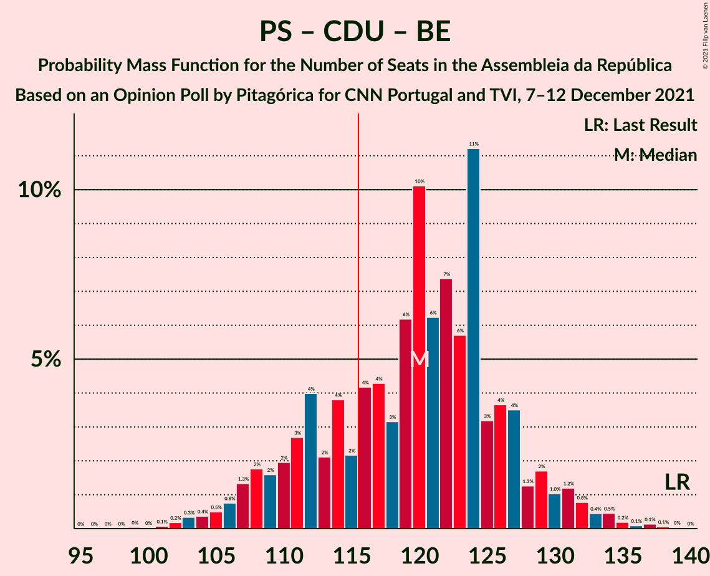

| Number of Seats | Probability | Accumulated | Special Marks |
|:---------------:|:-----------:|:-----------:|:-------------:|
| 99 | 0% | 100% |  |
| 100 | 0% | 99.9% |  |
| 101 | 0.1% | 99.9% |  |
| 102 | 0.2% | 99.8% |  |
| 103 | 0.3% | 99.6% |  |
| 104 | 0.4% | 99.3% |  |
| 105 | 0.5% | 98.9% |  |
| 106 | 0.8% | 98% |  |
| 107 | 1.3% | 98% |  |
| 108 | 2% | 96% |  |
| 109 | 2% | 95% |  |
| 110 | 2% | 93% |  |
| 111 | 3% | 91% |  |
| 112 | 4% | 88% |  |
| 113 | 2% | 84% |  |
| 114 | 4% | 82% |  |
| 115 | 2% | 78% |  |
| 116 | 4% | 76% | Majority |
| 117 | 4% | 72% |  |
| 118 | 3% | 68% |  |
| 119 | 6% | 65% |  |
| 120 | 10% | 58% | Median |
| 121 | 6% | 48% |  |
| 122 | 7% | 42% |  |
| 123 | 6% | 35% |  |
| 124 | 11% | 29% |  |
| 125 | 3% | 18% |  |
| 126 | 4% | 15% |  |
| 127 | 4% | 11% |  |
| 128 | 1.3% | 7% |  |
| 129 | 2% | 6% |  |
| 130 | 1.0% | 4% |  |
| 131 | 1.2% | 3% |  |
| 132 | 0.8% | 2% |  |
| 133 | 0.4% | 1.5% |  |
| 134 | 0.5% | 1.0% |  |
| 135 | 0.2% | 0.6% |  |
| 136 | 0.1% | 0.4% |  |
| 137 | 0.1% | 0.3% |  |
| 138 | 0.1% | 0.1% |  |
| 139 | 0% | 0.1% | Last Result |
| 140 | 0% | 0% |  |

### Partido Socialista – Coligação Democrática Unitária

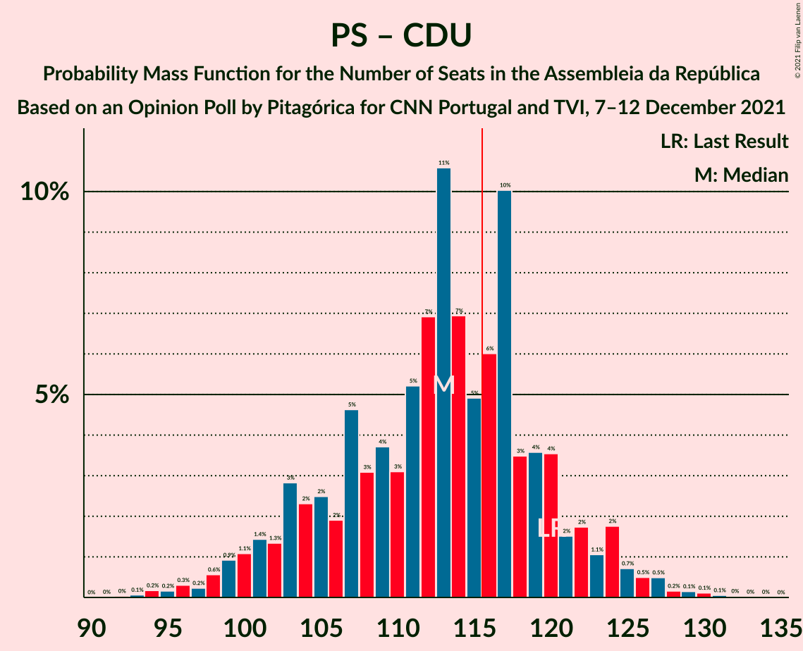

| Number of Seats | Probability | Accumulated | Special Marks |
|:---------------:|:-----------:|:-----------:|:-------------:|
| 92 | 0% | 100% |  |
| 93 | 0.1% | 99.9% |  |
| 94 | 0.2% | 99.9% |  |
| 95 | 0.2% | 99.7% |  |
| 96 | 0.3% | 99.5% |  |
| 97 | 0.2% | 99.2% |  |
| 98 | 0.6% | 99.0% |  |
| 99 | 0.9% | 98% |  |
| 100 | 1.1% | 98% |  |
| 101 | 1.4% | 96% |  |
| 102 | 1.3% | 95% |  |
| 103 | 3% | 94% |  |
| 104 | 2% | 91% |  |
| 105 | 2% | 89% |  |
| 106 | 2% | 86% |  |
| 107 | 5% | 84% |  |
| 108 | 3% | 79% |  |
| 109 | 4% | 76% |  |
| 110 | 3% | 73% |  |
| 111 | 5% | 70% |  |
| 112 | 7% | 64% |  |
| 113 | 11% | 57% | Median |
| 114 | 7% | 47% |  |
| 115 | 5% | 40% |  |
| 116 | 6% | 35% | Majority |
| 117 | 10% | 29% |  |
| 118 | 3% | 19% |  |
| 119 | 4% | 15% |  |
| 120 | 4% | 12% | Last Result |
| 121 | 2% | 8% |  |
| 122 | 2% | 7% |  |
| 123 | 1.1% | 5% |  |
| 124 | 2% | 4% |  |
| 125 | 0.7% | 2% |  |
| 126 | 0.5% | 2% |  |
| 127 | 0.5% | 1.0% |  |
| 128 | 0.2% | 0.6% |  |
| 129 | 0.1% | 0.4% |  |
| 130 | 0.1% | 0.2% |  |
| 131 | 0.1% | 0.1% |  |
| 132 | 0% | 0.1% |  |
| 133 | 0% | 0% |  |

### Partido Socialista – Bloco de Esquerda

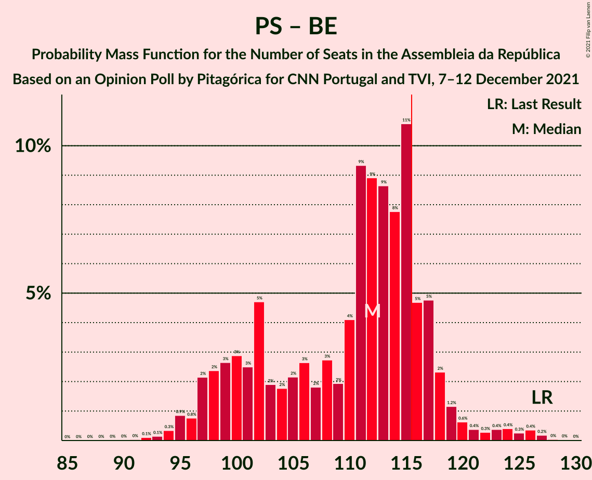

| Number of Seats | Probability | Accumulated | Special Marks |
|:---------------:|:-----------:|:-----------:|:-------------:|
| 89 | 0% | 100% |  |
| 90 | 0% | 99.9% |  |
| 91 | 0% | 99.9% |  |
| 92 | 0.1% | 99.9% |  |
| 93 | 0.1% | 99.8% |  |
| 94 | 0.3% | 99.6% |  |
| 95 | 0.9% | 99.3% |  |
| 96 | 0.8% | 98% |  |
| 97 | 2% | 98% |  |
| 98 | 2% | 96% |  |
| 99 | 3% | 93% |  |
| 100 | 3% | 90% |  |
| 101 | 3% | 88% |  |
| 102 | 5% | 85% |  |
| 103 | 2% | 80% |  |
| 104 | 2% | 78% |  |
| 105 | 2% | 77% |  |
| 106 | 3% | 75% |  |
| 107 | 2% | 72% |  |
| 108 | 3% | 70% |  |
| 109 | 2% | 67% |  |
| 110 | 4% | 65% |  |
| 111 | 9% | 61% | Median |
| 112 | 9% | 52% |  |
| 113 | 9% | 43% |  |
| 114 | 8% | 34% |  |
| 115 | 11% | 27% |  |
| 116 | 5% | 16% | Majority |
| 117 | 5% | 11% |  |
| 118 | 2% | 6% |  |
| 119 | 1.2% | 4% |  |
| 120 | 0.6% | 3% |  |
| 121 | 0.4% | 2% |  |
| 122 | 0.3% | 2% |  |
| 123 | 0.4% | 2% |  |
| 124 | 0.4% | 1.3% |  |
| 125 | 0.3% | 0.9% |  |
| 126 | 0.4% | 0.6% |  |
| 127 | 0.2% | 0.3% | Last Result |
| 128 | 0% | 0.1% |  |
| 129 | 0% | 0.1% |  |
| 130 | 0% | 0% |  |

### Partido Socialista

| Number of Seats | Probability | Accumulated | Special Marks |
|:---------------:|:-----------:|:-----------:|:-------------:|
| 83 | 0% | 100% |  |
| 84 | 0.1% | 99.9% |  |
| 85 | 0.1% | 99.9% |  |
| 86 | 0.2% | 99.8% |  |
| 87 | 0.5% | 99.6% |  |
| 88 | 0.7% | 99.1% |  |
| 89 | 1.0% | 98% |  |
| 90 | 2% | 97% |  |
| 91 | 1.1% | 96% |  |
| 92 | 2% | 95% |  |
| 93 | 3% | 93% |  |
| 94 | 3% | 89% |  |
| 95 | 4% | 87% |  |
| 96 | 3% | 83% |  |
| 97 | 2% | 80% |  |
| 98 | 3% | 78% |  |
| 99 | 4% | 75% |  |
| 100 | 2% | 71% |  |
| 101 | 3% | 69% |  |
| 102 | 2% | 66% |  |
| 103 | 4% | 64% |  |
| 104 | 10% | 60% | Median |
| 105 | 9% | 50% |  |
| 106 | 5% | 41% |  |
| 107 | 7% | 35% |  |
| 108 | 11% | 28% | Last Result |
| 109 | 4% | 17% |  |
| 110 | 4% | 13% |  |
| 111 | 4% | 9% |  |
| 112 | 1.4% | 5% |  |
| 113 | 1.4% | 4% |  |
| 114 | 0.4% | 2% |  |
| 115 | 0.4% | 2% |  |
| 116 | 0.3% | 1.5% | Majority |
| 117 | 0.4% | 1.2% |  |
| 118 | 0.2% | 0.8% |  |
| 119 | 0.3% | 0.6% |  |
| 120 | 0.2% | 0.3% |  |
| 121 | 0.1% | 0.1% |  |
| 122 | 0% | 0.1% |  |
| 123 | 0% | 0% |  |

### Partido Social Democrata – CDS–Partido Popular

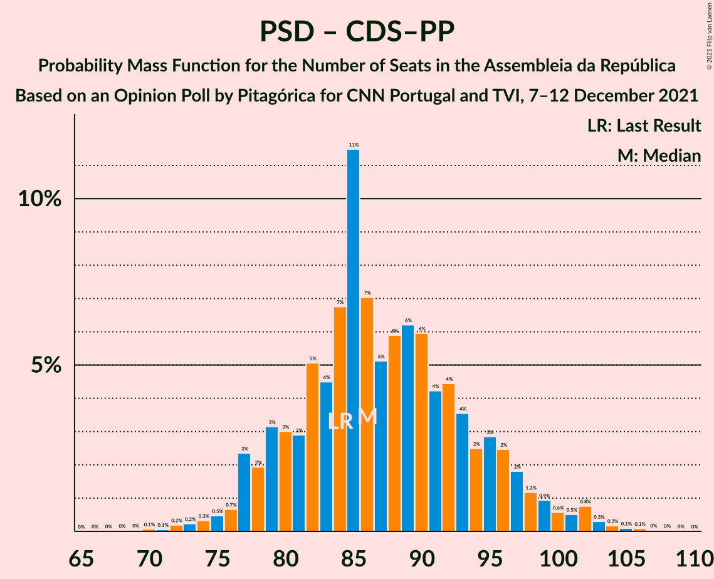

| Number of Seats | Probability | Accumulated | Special Marks |
|:---------------:|:-----------:|:-----------:|:-------------:|
| 68 | 0% | 100% |  |
| 69 | 0% | 99.9% |  |
| 70 | 0.1% | 99.9% |  |
| 71 | 0.1% | 99.8% |  |
| 72 | 0.2% | 99.8% |  |
| 73 | 0.2% | 99.6% |  |
| 74 | 0.3% | 99.4% |  |
| 75 | 0.5% | 99.0% |  |
| 76 | 0.7% | 98.6% |  |
| 77 | 2% | 98% |  |
| 78 | 2% | 96% |  |
| 79 | 3% | 94% |  |
| 80 | 3% | 90% |  |
| 81 | 3% | 87% |  |
| 82 | 5% | 85% |  |
| 83 | 4% | 79% |  |
| 84 | 7% | 75% | Last Result |
| 85 | 11% | 68% |  |
| 86 | 7% | 57% | Median |
| 87 | 5% | 50% |  |
| 88 | 6% | 45% |  |
| 89 | 6% | 39% |  |
| 90 | 6% | 32% |  |
| 91 | 4% | 27% |  |
| 92 | 4% | 22% |  |
| 93 | 4% | 18% |  |
| 94 | 2% | 14% |  |
| 95 | 3% | 12% |  |
| 96 | 2% | 9% |  |
| 97 | 2% | 6% |  |
| 98 | 1.2% | 5% |  |
| 99 | 0.9% | 4% |  |
| 100 | 0.6% | 3% |  |
| 101 | 0.5% | 2% |  |
| 102 | 0.8% | 1.5% |  |
| 103 | 0.3% | 0.7% |  |
| 104 | 0.2% | 0.4% |  |
| 105 | 0.1% | 0.3% |  |
| 106 | 0.1% | 0.2% |  |
| 107 | 0% | 0.1% |  |
| 108 | 0% | 0% |  |

## Technical Information

### Opinion Poll

+ **Polling firm:** Pitagórica
+ **Commissioner(s):** CNN Portugal and TVI
+ **Fieldwork period:** 7–12 December 2021

### Calculations

+ **Sample size:** 625
+ **Simulations done:** 1,048,576
+ **Error estimate:** 0.84%

