# Opinion Poll by Aximage for Diário de Notícias, Jornal de Notícias and TSF Rádio Notícias, 9–13 December 2021

<a href="#voting-intentions">Voting Intentions</a> | <a href="#seats">Seats</a> | <a href="#coalitions">Coalitions</a> | <a href="#technical-information">Technical Information</a>

## Voting Intentions

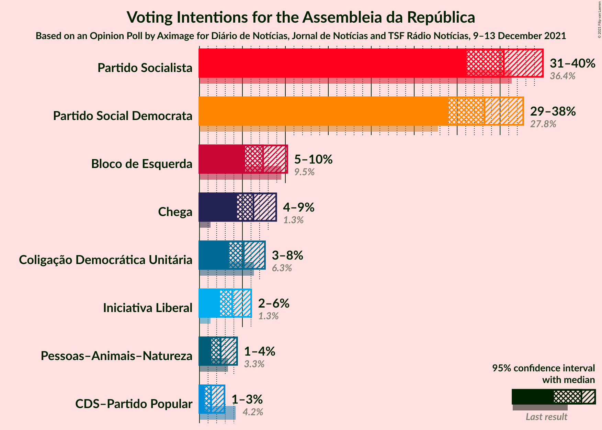

### Confidence Intervals

| Party | Last Result | Poll Result | 80% Confidence Interval | 90% Confidence Interval | 95% Confidence Interval | 99% Confidence Interval |
|:-----:|:-----------:|:-----------:|:-----------------------:|:-----------------------:|:-----------------------:|:-----------------------:|
| Partido Socialista | 36.4% | 35.4% | 32.6–38.4% |31.8–39.2% |31.1–40.0% |29.8–41.4% |
| Partido Social Democrata | 27.8% | 33.2% | 30.4–36.1% |29.6–37.0% |29.0–37.7% |27.7–39.1% |
| Bloco de Esquerda | 9.5% | 7.4% | 6.0–9.2% |5.6–9.8% |5.3–10.2% |4.7–11.2% |
| Chega | 1.3% | 6.3% | 5.0–8.0% |4.7–8.5% |4.4–8.9% |3.8–9.8% |
| Coligação Democrática Unitária | 6.3% | 5.2% | 4.0–6.8% |3.7–7.2% |3.5–7.6% |3.0–8.5% |
| Iniciativa Liberal | 1.3% | 3.8% | 2.9–5.2% |2.6–5.7% |2.4–6.0% |2.0–6.8% |
| Pessoas–Animais–Natureza | 3.3% | 2.5% | 1.8–3.7% |1.6–4.1% |1.4–4.4% |1.1–5.0% |
| CDS–Partido Popular | 4.2% | 1.3% | 0.9–2.3% |0.7–2.6% |0.6–2.9% |0.5–3.5% |

*Note:* The poll result column reflects the actual value used in the calculations. Published results may vary slightly, and in addition be rounded to fewer digits.

## Seats

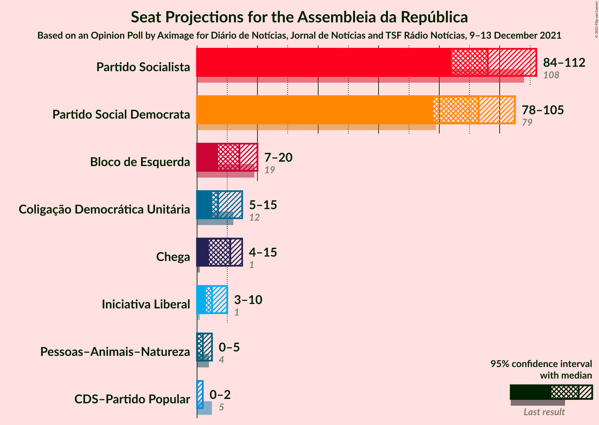

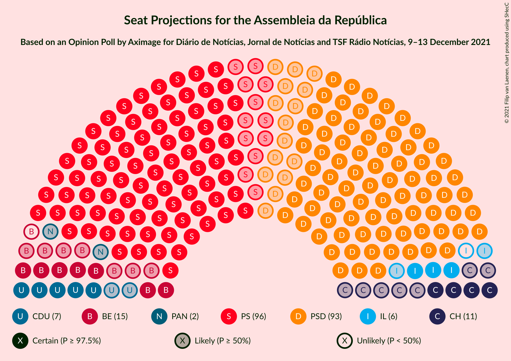

### Confidence Intervals

| Party | Last Result | Median | 80% Confidence Interval | 90% Confidence Interval | 95% Confidence Interval | 99% Confidence Interval |
|:-----:|:-----------:|:------:|:-----------------------:|:-----------------------:|:-----------------------:|:-----------------------:|
| <a href="#partido-socialista">Partido Socialista</a> | 108 | 96 | 88–107 |86–109 |84–112 |81–116 |
| <a href="#partido-social-democrata">Partido Social Democrata</a> | 79 | 93 | 83–102 |80–104 |78–105 |75–108 |
| <a href="#bloco-de-esquerda">Bloco de Esquerda</a> | 19 | 14 | 9–18 |7–19 |7–20 |7–22 |
| <a href="#chega">Chega</a> | 1 | 11 | 7–13 |6–14 |4–15 |4–18 |
| <a href="#coligação-democrática-unitária">Coligação Democrática Unitária</a> | 12 | 7 | 5–12 |5–14 |5–15 |3–16 |
| <a href="#iniciativa-liberal">Iniciativa Liberal</a> | 1 | 5 | 3–7 |3–9 |3–10 |3–12 |
| <a href="#pessoas–animais–natureza">Pessoas–Animais–Natureza</a> | 4 | 2 | 1–4 |0–4 |0–5 |0–6 |
| <a href="#cds–partido-popular">CDS–Partido Popular</a> | 5 | 0 | 0–1 |0–1 |0–2 |0–3 |

### Partido Socialista

*For a full overview of the results for this party, see the [Partido Socialista](party-partidosocialista.html) page.*

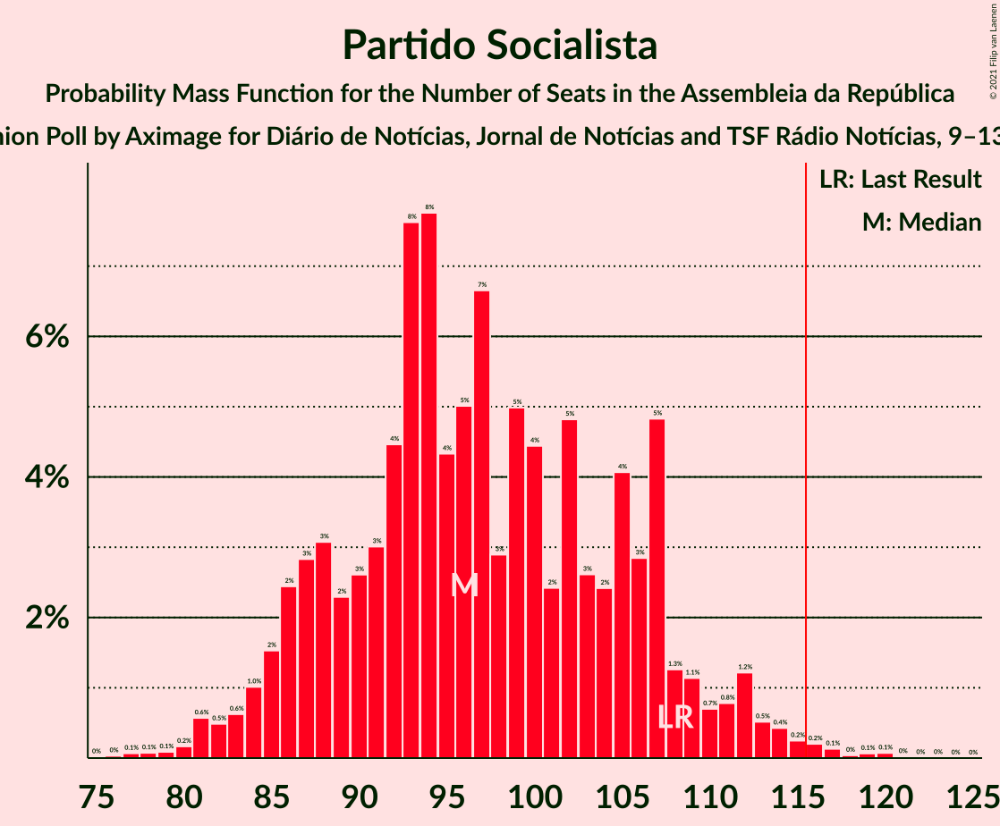

| Number of Seats | Probability | Accumulated | Special Marks |
|:---------------:|:-----------:|:-----------:|:-------------:|
| 76 | 0% | 100% |  |
| 77 | 0.1% | 99.9% |  |
| 78 | 0.1% | 99.9% |  |
| 79 | 0.1% | 99.8% |  |
| 80 | 0.2% | 99.7% |  |
| 81 | 0.6% | 99.5% |  |
| 82 | 0.5% | 99.0% |  |
| 83 | 0.6% | 98% |  |
| 84 | 1.0% | 98% |  |
| 85 | 2% | 97% |  |
| 86 | 2% | 95% |  |
| 87 | 3% | 93% |  |
| 88 | 3% | 90% |  |
| 89 | 2% | 87% |  |
| 90 | 3% | 85% |  |
| 91 | 3% | 82% |  |
| 92 | 4% | 79% |  |
| 93 | 8% | 75% |  |
| 94 | 8% | 67% |  |
| 95 | 4% | 59% |  |
| 96 | 5% | 55% | Median |
| 97 | 7% | 50% |  |
| 98 | 3% | 43% |  |
| 99 | 5% | 40% |  |
| 100 | 4% | 35% |  |
| 101 | 2% | 31% |  |
| 102 | 5% | 28% |  |
| 103 | 3% | 24% |  |
| 104 | 2% | 21% |  |
| 105 | 4% | 19% |  |
| 106 | 3% | 15% |  |
| 107 | 5% | 12% |  |
| 108 | 1.3% | 7% | Last Result |
| 109 | 1.1% | 6% |  |
| 110 | 0.7% | 4% |  |
| 111 | 0.8% | 4% |  |
| 112 | 1.2% | 3% |  |
| 113 | 0.5% | 2% |  |
| 114 | 0.4% | 1.2% |  |
| 115 | 0.2% | 0.8% |  |
| 116 | 0.2% | 0.6% | Majority |
| 117 | 0.1% | 0.4% |  |
| 118 | 0% | 0.2% |  |
| 119 | 0.1% | 0.2% |  |
| 120 | 0.1% | 0.1% |  |
| 121 | 0% | 0% |  |

### Partido Social Democrata

*For a full overview of the results for this party, see the [Partido Social Democrata](party-partidosocialdemocrata.html) page.*

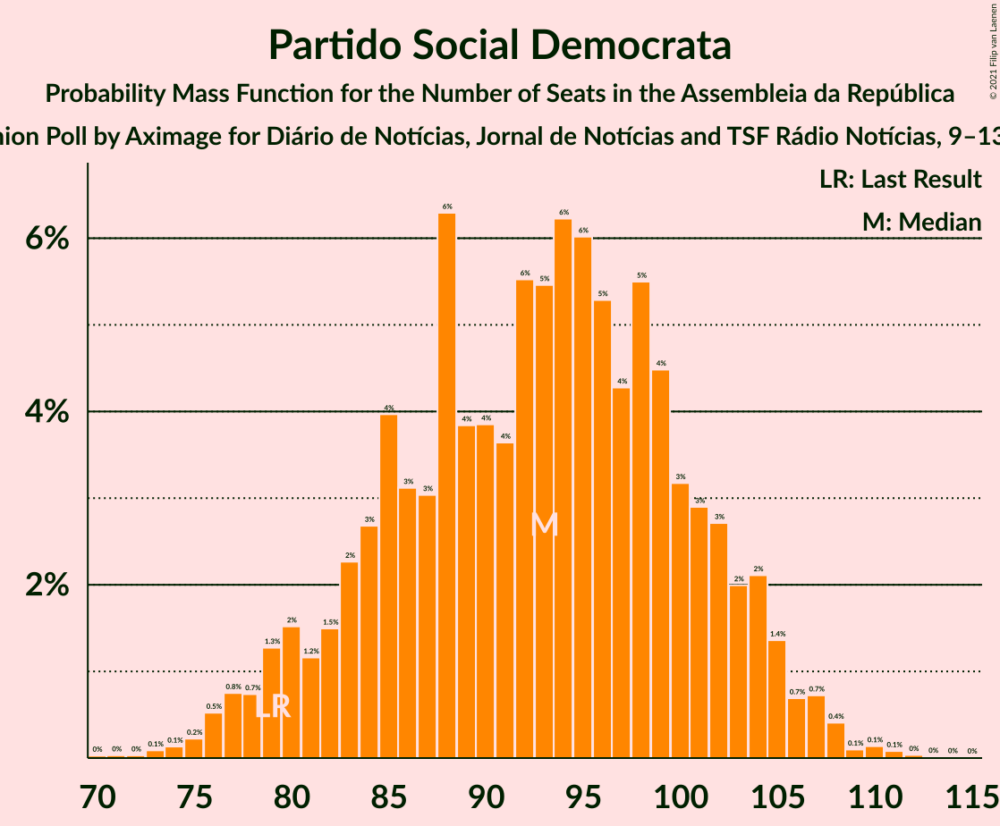

| Number of Seats | Probability | Accumulated | Special Marks |
|:---------------:|:-----------:|:-----------:|:-------------:|
| 70 | 0% | 100% |  |
| 71 | 0% | 99.9% |  |
| 72 | 0% | 99.9% |  |
| 73 | 0.1% | 99.9% |  |
| 74 | 0.1% | 99.8% |  |
| 75 | 0.2% | 99.6% |  |
| 76 | 0.5% | 99.4% |  |
| 77 | 0.8% | 98.9% |  |
| 78 | 0.7% | 98% |  |
| 79 | 1.3% | 97% | Last Result |
| 80 | 2% | 96% |  |
| 81 | 1.2% | 95% |  |
| 82 | 1.5% | 93% |  |
| 83 | 2% | 92% |  |
| 84 | 3% | 90% |  |
| 85 | 4% | 87% |  |
| 86 | 3% | 83% |  |
| 87 | 3% | 80% |  |
| 88 | 6% | 77% |  |
| 89 | 4% | 71% |  |
| 90 | 4% | 67% |  |
| 91 | 4% | 63% |  |
| 92 | 6% | 59% |  |
| 93 | 5% | 54% | Median |
| 94 | 6% | 48% |  |
| 95 | 6% | 42% |  |
| 96 | 5% | 36% |  |
| 97 | 4% | 31% |  |
| 98 | 5% | 26% |  |
| 99 | 4% | 21% |  |
| 100 | 3% | 16% |  |
| 101 | 3% | 13% |  |
| 102 | 3% | 10% |  |
| 103 | 2% | 8% |  |
| 104 | 2% | 6% |  |
| 105 | 1.4% | 4% |  |
| 106 | 0.7% | 2% |  |
| 107 | 0.7% | 2% |  |
| 108 | 0.4% | 0.8% |  |
| 109 | 0.1% | 0.4% |  |
| 110 | 0.1% | 0.3% |  |
| 111 | 0.1% | 0.2% |  |
| 112 | 0% | 0.1% |  |
| 113 | 0% | 0% |  |

### Bloco de Esquerda

*For a full overview of the results for this party, see the [Bloco de Esquerda](party-blocodeesquerda.html) page.*

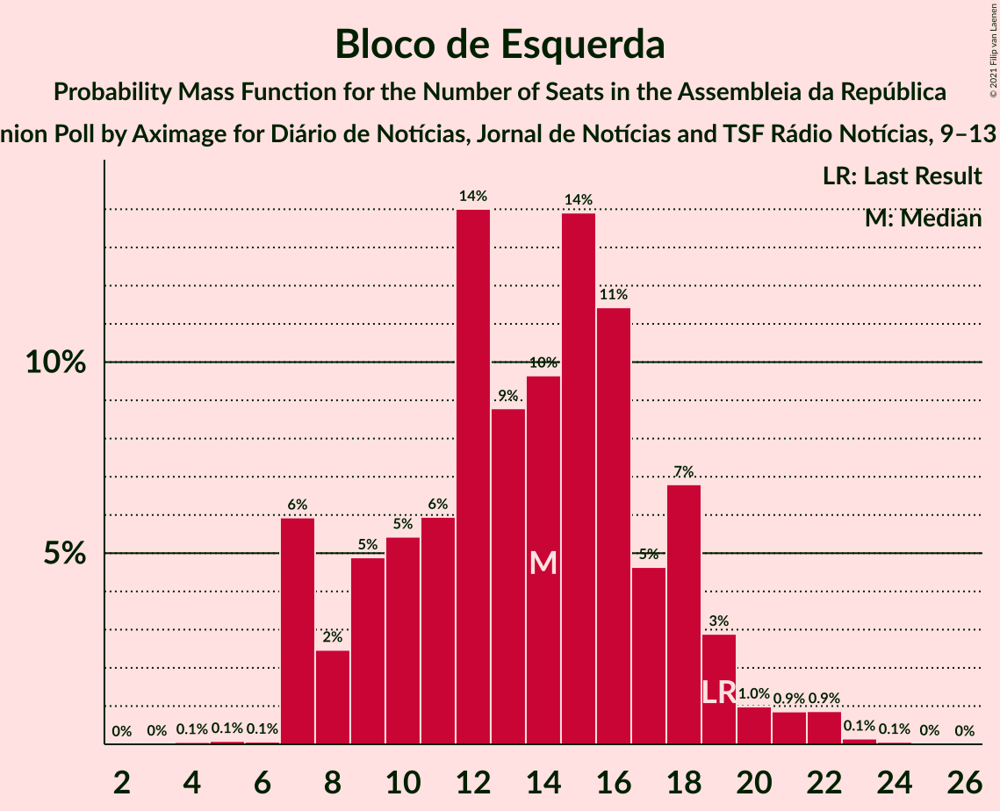

| Number of Seats | Probability | Accumulated | Special Marks |
|:---------------:|:-----------:|:-----------:|:-------------:|
| 4 | 0.1% | 100% |  |
| 5 | 0.1% | 99.9% |  |
| 6 | 0.1% | 99.8% |  |
| 7 | 6% | 99.8% |  |
| 8 | 2% | 94% |  |
| 9 | 5% | 91% |  |
| 10 | 5% | 86% |  |
| 11 | 6% | 81% |  |
| 12 | 14% | 75% |  |
| 13 | 9% | 61% |  |
| 14 | 10% | 52% | Median |
| 15 | 14% | 43% |  |
| 16 | 11% | 29% |  |
| 17 | 5% | 17% |  |
| 18 | 7% | 13% |  |
| 19 | 3% | 6% | Last Result |
| 20 | 1.0% | 3% |  |
| 21 | 0.9% | 2% |  |
| 22 | 0.9% | 1.1% |  |
| 23 | 0.1% | 0.3% |  |
| 24 | 0.1% | 0.1% |  |
| 25 | 0% | 0.1% |  |
| 26 | 0% | 0% |  |

### Chega

*For a full overview of the results for this party, see the [Chega](party-chega.html) page.*

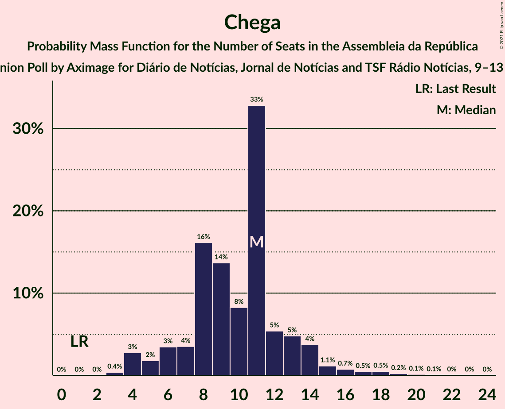

| Number of Seats | Probability | Accumulated | Special Marks |
|:---------------:|:-----------:|:-----------:|:-------------:|
| 1 | 0% | 100% | Last Result |
| 2 | 0% | 100% |  |
| 3 | 0.4% | 100% |  |
| 4 | 3% | 99.6% |  |
| 5 | 2% | 97% |  |
| 6 | 3% | 95% |  |
| 7 | 4% | 92% |  |
| 8 | 16% | 88% |  |
| 9 | 14% | 72% |  |
| 10 | 8% | 58% |  |
| 11 | 33% | 50% | Median |
| 12 | 5% | 17% |  |
| 13 | 5% | 12% |  |
| 14 | 4% | 7% |  |
| 15 | 1.1% | 3% |  |
| 16 | 0.7% | 2% |  |
| 17 | 0.5% | 1.4% |  |
| 18 | 0.5% | 1.0% |  |
| 19 | 0.2% | 0.5% |  |
| 20 | 0.1% | 0.3% |  |
| 21 | 0.1% | 0.1% |  |
| 22 | 0% | 0.1% |  |
| 23 | 0% | 0% |  |

### Coligação Democrática Unitária

*For a full overview of the results for this party, see the [Coligação Democrática Unitária](party-coligaçãodemocráticaunitária.html) page.*

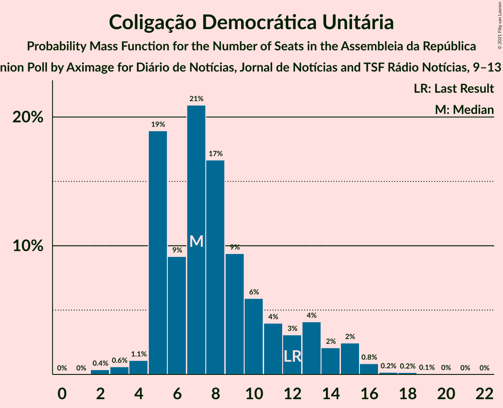

| Number of Seats | Probability | Accumulated | Special Marks |
|:---------------:|:-----------:|:-----------:|:-------------:|
| 2 | 0.4% | 100% |  |
| 3 | 0.6% | 99.6% |  |
| 4 | 1.1% | 99.0% |  |
| 5 | 19% | 98% |  |
| 6 | 9% | 79% |  |
| 7 | 21% | 70% | Median |
| 8 | 17% | 49% |  |
| 9 | 9% | 32% |  |
| 10 | 6% | 23% |  |
| 11 | 4% | 17% |  |
| 12 | 3% | 13% | Last Result |
| 13 | 4% | 10% |  |
| 14 | 2% | 6% |  |
| 15 | 2% | 4% |  |
| 16 | 0.8% | 1.3% |  |
| 17 | 0.2% | 0.4% |  |
| 18 | 0.2% | 0.3% |  |
| 19 | 0.1% | 0.1% |  |
| 20 | 0% | 0.1% |  |
| 21 | 0% | 0% |  |

### Iniciativa Liberal

*For a full overview of the results for this party, see the [Iniciativa Liberal](party-iniciativaliberal.html) page.*

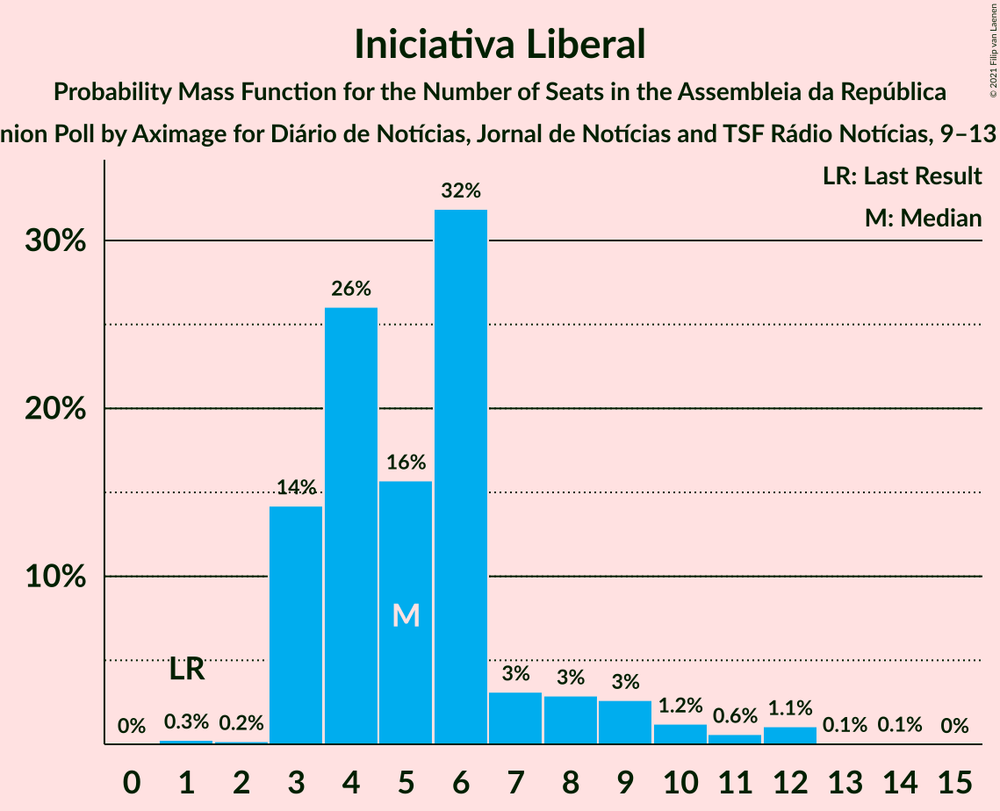

| Number of Seats | Probability | Accumulated | Special Marks |
|:---------------:|:-----------:|:-----------:|:-------------:|
| 1 | 0.3% | 100% | Last Result |
| 2 | 0.2% | 99.7% |  |
| 3 | 14% | 99.6% |  |
| 4 | 26% | 85% |  |
| 5 | 16% | 59% | Median |
| 6 | 32% | 44% |  |
| 7 | 3% | 12% |  |
| 8 | 3% | 9% |  |
| 9 | 3% | 6% |  |
| 10 | 1.2% | 3% |  |
| 11 | 0.6% | 2% |  |
| 12 | 1.1% | 1.2% |  |
| 13 | 0.1% | 0.2% |  |
| 14 | 0.1% | 0.1% |  |
| 15 | 0% | 0% |  |

### Pessoas–Animais–Natureza

*For a full overview of the results for this party, see the [Pessoas–Animais–Natureza](party-pessoas–animais–natureza.html) page.*

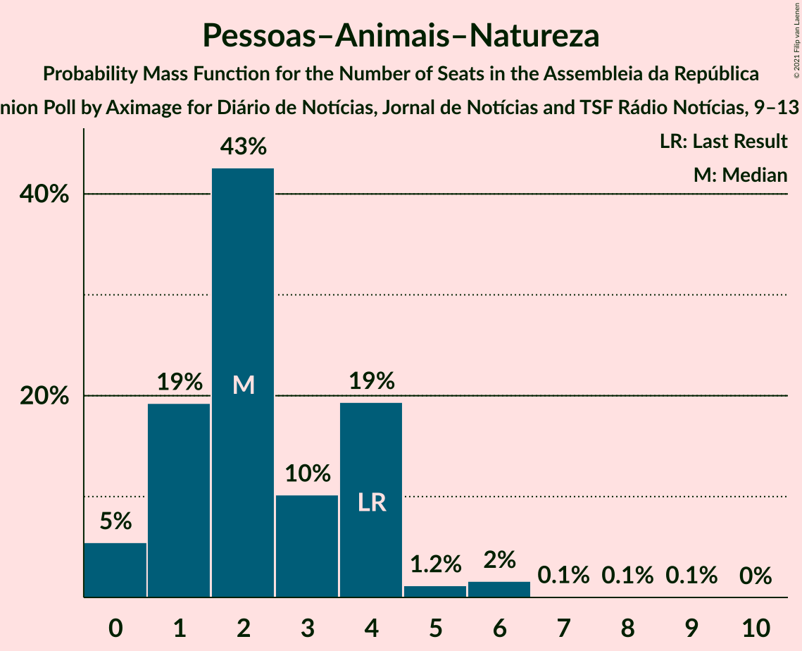

| Number of Seats | Probability | Accumulated | Special Marks |
|:---------------:|:-----------:|:-----------:|:-------------:|
| 0 | 5% | 100% |  |
| 1 | 19% | 95% |  |
| 2 | 43% | 75% | Median |
| 3 | 10% | 33% |  |
| 4 | 19% | 22% | Last Result |
| 5 | 1.2% | 3% |  |
| 6 | 2% | 2% |  |
| 7 | 0.1% | 0.3% |  |
| 8 | 0.1% | 0.2% |  |
| 9 | 0.1% | 0.1% |  |
| 10 | 0% | 0% |  |

### CDS–Partido Popular

*For a full overview of the results for this party, see the [CDS–Partido Popular](party-cds–partidopopular.html) page.*

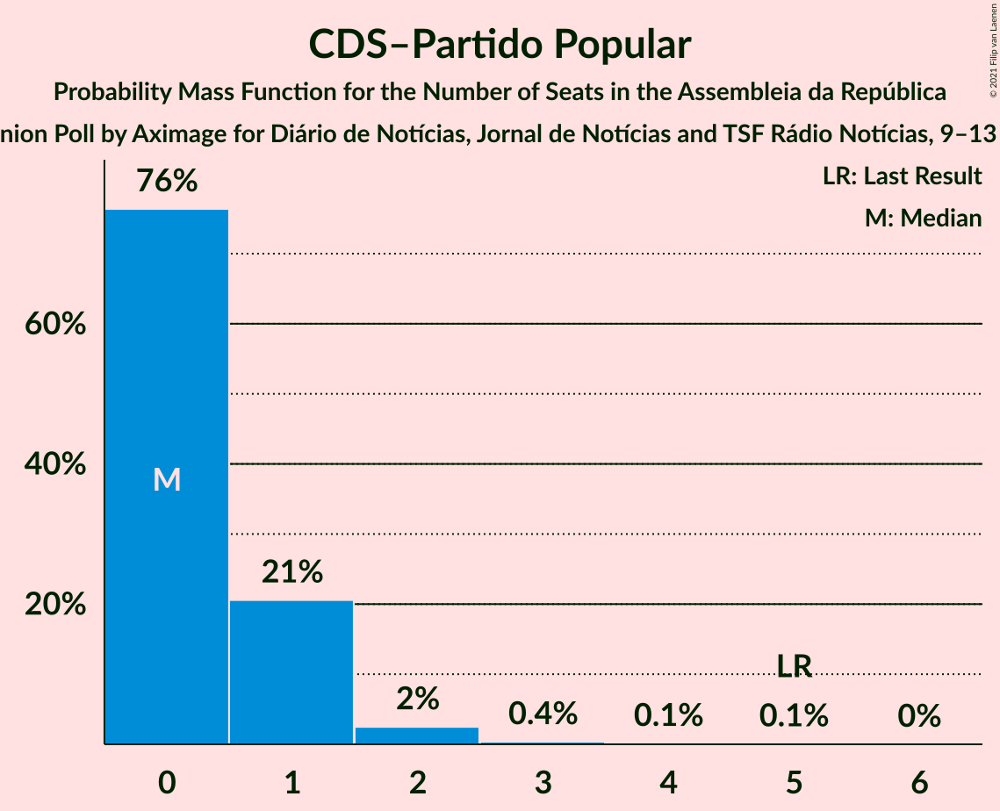

| Number of Seats | Probability | Accumulated | Special Marks |
|:---------------:|:-----------:|:-----------:|:-------------:|
| 0 | 76% | 100% | Median |
| 1 | 21% | 24% |  |
| 2 | 2% | 3% |  |
| 3 | 0.4% | 0.5% |  |
| 4 | 0.1% | 0.2% |  |
| 5 | 0.1% | 0.1% | Last Result |
| 6 | 0% | 0% |  |

## Coalitions

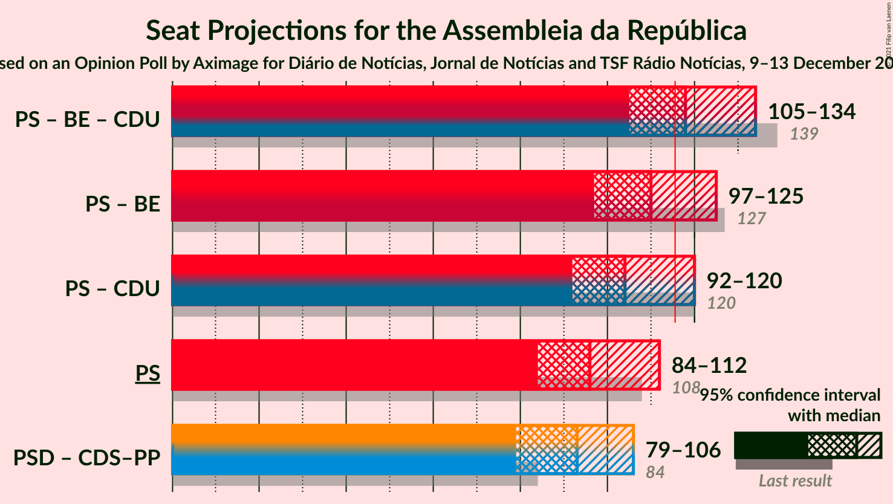

### Confidence Intervals

| Coalition | Last Result | Median | Majority? | 80% Confidence Interval | 90% Confidence Interval | 95% Confidence Interval | 99% Confidence Interval |
|:---------:|:-----------:|:------:|:---------:|:-----------------------:|:-----------------------:|:-----------------------:|:-----------------------:|
| Partido Socialista – Bloco de Esquerda – Coligação Democrática Unitária | 139 | 118 | 64% | 109–128 | 107–131 | 105–134 | 102–137 |
| Partido Socialista – Bloco de Esquerda | 127 | 110 | 28% | 101–120 | 99–123 | 97–125 | 93–129 |
| Partido Socialista – Coligação Democrática Unitária | 120 | 104 | 8% | 95–115 | 94–118 | 92–120 | 89–124 |
| Partido Socialista | 108 | 96 | 0.6% | 88–107 | 86–109 | 84–112 | 81–116 |
| Partido Social Democrata – CDS–Partido Popular | 84 | 93 | 0% | 84–102 | 81–104 | 79–106 | 76–109 |

### Partido Socialista – Bloco de Esquerda – Coligação Democrática Unitária

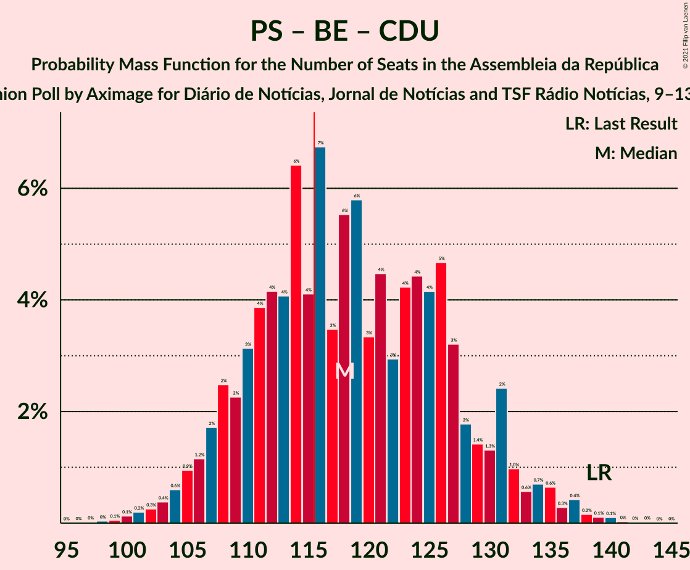

| Number of Seats | Probability | Accumulated | Special Marks |
|:---------------:|:-----------:|:-----------:|:-------------:|
| 98 | 0% | 100% |  |
| 99 | 0.1% | 99.9% |  |
| 100 | 0.1% | 99.9% |  |
| 101 | 0.2% | 99.7% |  |
| 102 | 0.3% | 99.5% |  |
| 103 | 0.4% | 99.3% |  |
| 104 | 0.6% | 98.9% |  |
| 105 | 0.9% | 98% |  |
| 106 | 1.2% | 97% |  |
| 107 | 2% | 96% |  |
| 108 | 2% | 94% |  |
| 109 | 2% | 92% |  |
| 110 | 3% | 90% |  |
| 111 | 4% | 87% |  |
| 112 | 4% | 83% |  |
| 113 | 4% | 79% |  |
| 114 | 6% | 74% |  |
| 115 | 4% | 68% |  |
| 116 | 7% | 64% | Majority |
| 117 | 3% | 57% | Median |
| 118 | 6% | 54% |  |
| 119 | 6% | 48% |  |
| 120 | 3% | 42% |  |
| 121 | 4% | 39% |  |
| 122 | 3% | 35% |  |
| 123 | 4% | 32% |  |
| 124 | 4% | 27% |  |
| 125 | 4% | 23% |  |
| 126 | 5% | 19% |  |
| 127 | 3% | 14% |  |
| 128 | 2% | 11% |  |
| 129 | 1.4% | 9% |  |
| 130 | 1.3% | 8% |  |
| 131 | 2% | 6% |  |
| 132 | 1.0% | 4% |  |
| 133 | 0.6% | 3% |  |
| 134 | 0.7% | 3% |  |
| 135 | 0.6% | 2% |  |
| 136 | 0.3% | 1.2% |  |
| 137 | 0.4% | 0.9% |  |
| 138 | 0.2% | 0.5% |  |
| 139 | 0.1% | 0.3% | Last Result |
| 140 | 0.1% | 0.2% |  |
| 141 | 0% | 0.1% |  |
| 142 | 0% | 0.1% |  |
| 143 | 0% | 0% |  |

### Partido Socialista – Bloco de Esquerda

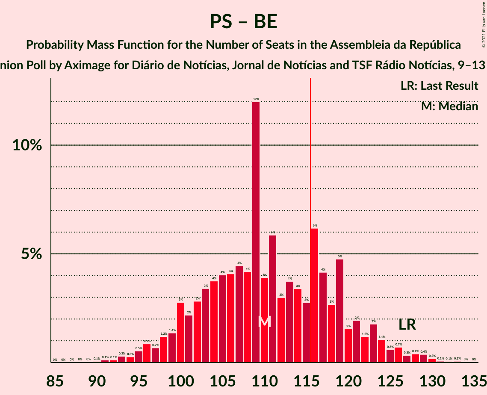

| Number of Seats | Probability | Accumulated | Special Marks |
|:---------------:|:-----------:|:-----------:|:-------------:|
| 89 | 0% | 100% |  |
| 90 | 0.1% | 99.9% |  |
| 91 | 0.1% | 99.9% |  |
| 92 | 0.1% | 99.8% |  |
| 93 | 0.3% | 99.6% |  |
| 94 | 0.3% | 99.3% |  |
| 95 | 0.5% | 99.1% |  |
| 96 | 0.9% | 98.5% |  |
| 97 | 0.7% | 98% |  |
| 98 | 1.2% | 97% |  |
| 99 | 1.4% | 96% |  |
| 100 | 3% | 94% |  |
| 101 | 2% | 92% |  |
| 102 | 3% | 89% |  |
| 103 | 3% | 87% |  |
| 104 | 4% | 83% |  |
| 105 | 4% | 80% |  |
| 106 | 4% | 75% |  |
| 107 | 4% | 71% |  |
| 108 | 4% | 67% |  |
| 109 | 12% | 63% |  |
| 110 | 4% | 51% | Median |
| 111 | 6% | 47% |  |
| 112 | 3% | 41% |  |
| 113 | 4% | 38% |  |
| 114 | 3% | 34% |  |
| 115 | 3% | 31% |  |
| 116 | 6% | 28% | Majority |
| 117 | 4% | 22% |  |
| 118 | 3% | 18% |  |
| 119 | 5% | 15% |  |
| 120 | 2% | 10% |  |
| 121 | 2% | 9% |  |
| 122 | 1.2% | 7% |  |
| 123 | 2% | 6% |  |
| 124 | 1.1% | 4% |  |
| 125 | 0.6% | 3% |  |
| 126 | 0.7% | 2% |  |
| 127 | 0.3% | 2% | Last Result |
| 128 | 0.4% | 1.2% |  |
| 129 | 0.4% | 0.8% |  |
| 130 | 0.2% | 0.4% |  |
| 131 | 0.1% | 0.2% |  |
| 132 | 0.1% | 0.2% |  |
| 133 | 0.1% | 0.1% |  |
| 134 | 0% | 0.1% |  |
| 135 | 0% | 0% |  |

### Partido Socialista – Coligação Democrática Unitária

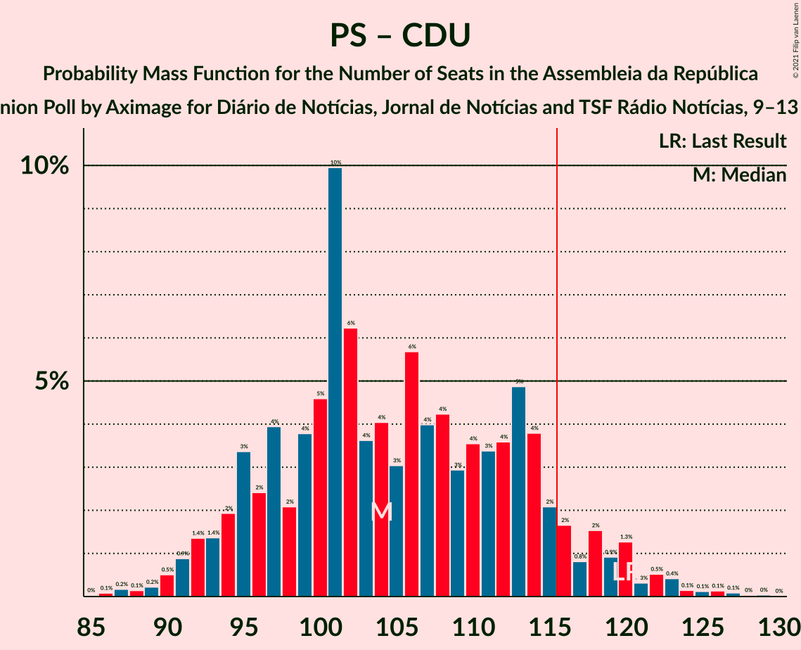

| Number of Seats | Probability | Accumulated | Special Marks |
|:---------------:|:-----------:|:-----------:|:-------------:|
| 85 | 0% | 100% |  |
| 86 | 0.1% | 99.9% |  |
| 87 | 0.2% | 99.8% |  |
| 88 | 0.1% | 99.7% |  |
| 89 | 0.2% | 99.5% |  |
| 90 | 0.5% | 99.3% |  |
| 91 | 0.9% | 98.8% |  |
| 92 | 1.4% | 98% |  |
| 93 | 1.4% | 97% |  |
| 94 | 2% | 95% |  |
| 95 | 3% | 93% |  |
| 96 | 2% | 90% |  |
| 97 | 4% | 87% |  |
| 98 | 2% | 84% |  |
| 99 | 4% | 81% |  |
| 100 | 5% | 78% |  |
| 101 | 10% | 73% |  |
| 102 | 6% | 63% |  |
| 103 | 4% | 57% | Median |
| 104 | 4% | 53% |  |
| 105 | 3% | 49% |  |
| 106 | 6% | 46% |  |
| 107 | 4% | 40% |  |
| 108 | 4% | 36% |  |
| 109 | 3% | 32% |  |
| 110 | 4% | 29% |  |
| 111 | 3% | 26% |  |
| 112 | 4% | 22% |  |
| 113 | 5% | 19% |  |
| 114 | 4% | 14% |  |
| 115 | 2% | 10% |  |
| 116 | 2% | 8% | Majority |
| 117 | 0.8% | 6% |  |
| 118 | 2% | 6% |  |
| 119 | 0.9% | 4% |  |
| 120 | 1.3% | 3% | Last Result |
| 121 | 0.3% | 2% |  |
| 122 | 0.5% | 2% |  |
| 123 | 0.4% | 1.0% |  |
| 124 | 0.1% | 0.6% |  |
| 125 | 0.1% | 0.4% |  |
| 126 | 0.1% | 0.3% |  |
| 127 | 0.1% | 0.2% |  |
| 128 | 0% | 0.1% |  |
| 129 | 0% | 0.1% |  |
| 130 | 0% | 0% |  |

### Partido Socialista

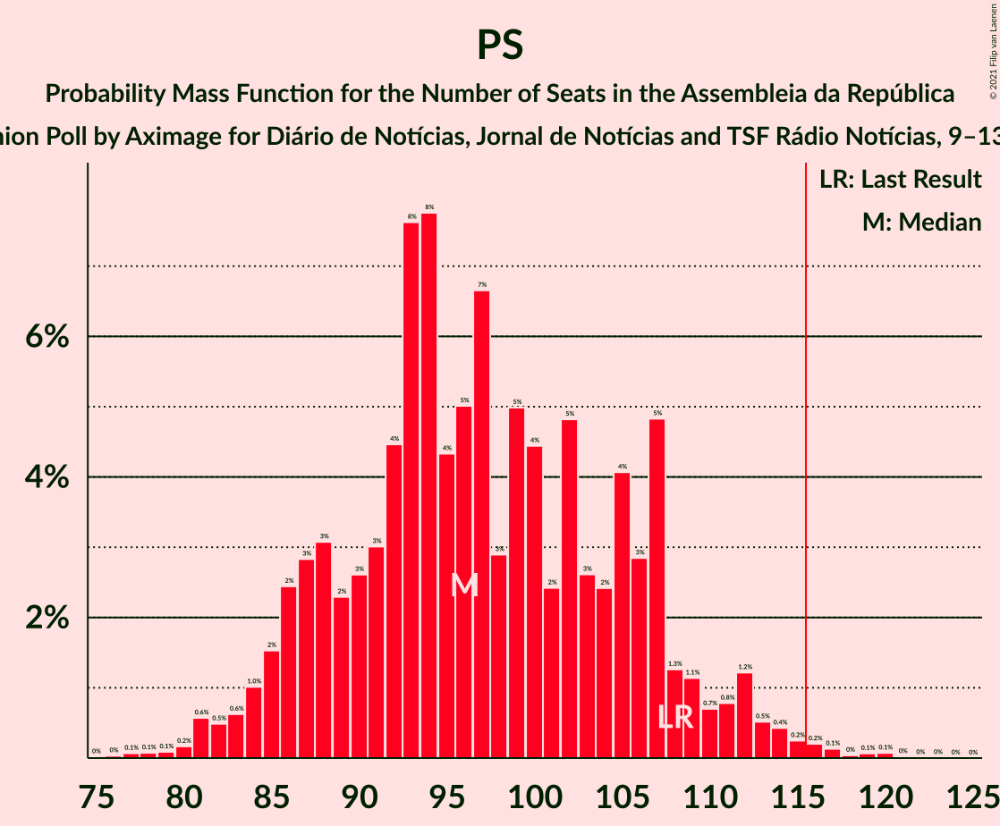

| Number of Seats | Probability | Accumulated | Special Marks |
|:---------------:|:-----------:|:-----------:|:-------------:|
| 76 | 0% | 100% |  |
| 77 | 0.1% | 99.9% |  |
| 78 | 0.1% | 99.9% |  |
| 79 | 0.1% | 99.8% |  |
| 80 | 0.2% | 99.7% |  |
| 81 | 0.6% | 99.5% |  |
| 82 | 0.5% | 99.0% |  |
| 83 | 0.6% | 98% |  |
| 84 | 1.0% | 98% |  |
| 85 | 2% | 97% |  |
| 86 | 2% | 95% |  |
| 87 | 3% | 93% |  |
| 88 | 3% | 90% |  |
| 89 | 2% | 87% |  |
| 90 | 3% | 85% |  |
| 91 | 3% | 82% |  |
| 92 | 4% | 79% |  |
| 93 | 8% | 75% |  |
| 94 | 8% | 67% |  |
| 95 | 4% | 59% |  |
| 96 | 5% | 55% | Median |
| 97 | 7% | 50% |  |
| 98 | 3% | 43% |  |
| 99 | 5% | 40% |  |
| 100 | 4% | 35% |  |
| 101 | 2% | 31% |  |
| 102 | 5% | 28% |  |
| 103 | 3% | 24% |  |
| 104 | 2% | 21% |  |
| 105 | 4% | 19% |  |
| 106 | 3% | 15% |  |
| 107 | 5% | 12% |  |
| 108 | 1.3% | 7% | Last Result |
| 109 | 1.1% | 6% |  |
| 110 | 0.7% | 4% |  |
| 111 | 0.8% | 4% |  |
| 112 | 1.2% | 3% |  |
| 113 | 0.5% | 2% |  |
| 114 | 0.4% | 1.2% |  |
| 115 | 0.2% | 0.8% |  |
| 116 | 0.2% | 0.6% | Majority |
| 117 | 0.1% | 0.4% |  |
| 118 | 0% | 0.2% |  |
| 119 | 0.1% | 0.2% |  |
| 120 | 0.1% | 0.1% |  |
| 121 | 0% | 0% |  |

### Partido Social Democrata – CDS–Partido Popular

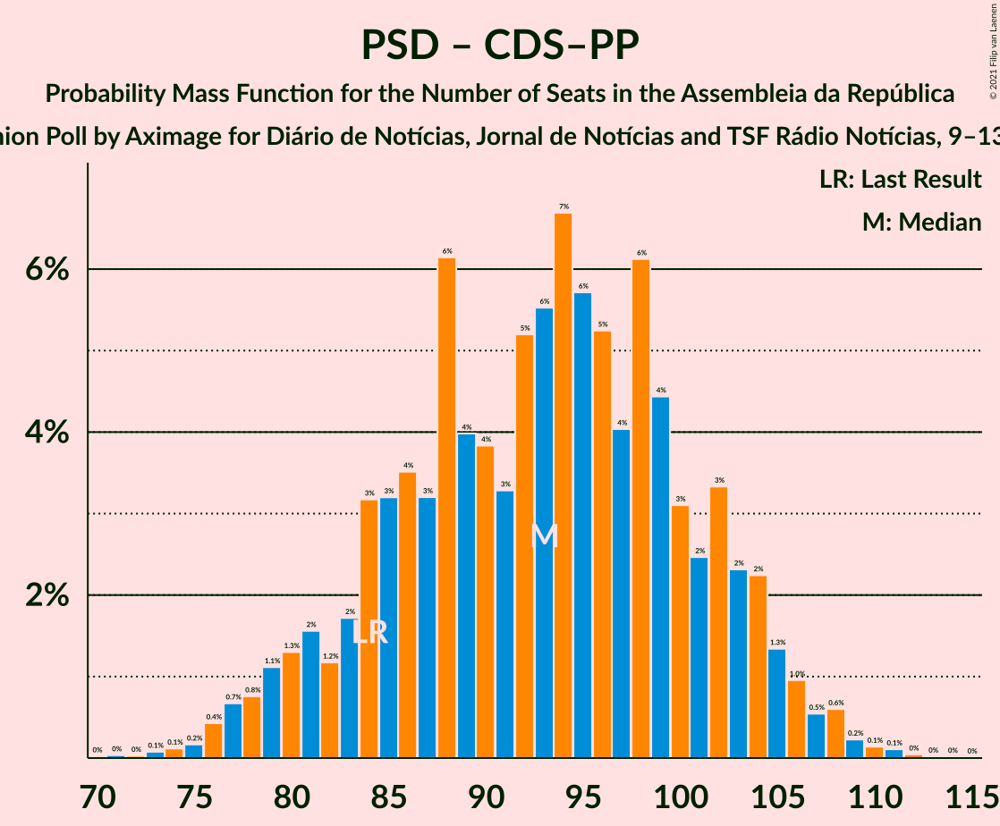

| Number of Seats | Probability | Accumulated | Special Marks |
|:---------------:|:-----------:|:-----------:|:-------------:|
| 70 | 0% | 100% |  |
| 71 | 0% | 99.9% |  |
| 72 | 0% | 99.9% |  |
| 73 | 0.1% | 99.9% |  |
| 74 | 0.1% | 99.8% |  |
| 75 | 0.2% | 99.7% |  |
| 76 | 0.4% | 99.5% |  |
| 77 | 0.7% | 99.1% |  |
| 78 | 0.8% | 98% |  |
| 79 | 1.1% | 98% |  |
| 80 | 1.3% | 97% |  |
| 81 | 2% | 95% |  |
| 82 | 1.2% | 94% |  |
| 83 | 2% | 93% |  |
| 84 | 3% | 91% | Last Result |
| 85 | 3% | 88% |  |
| 86 | 4% | 84% |  |
| 87 | 3% | 81% |  |
| 88 | 6% | 78% |  |
| 89 | 4% | 72% |  |
| 90 | 4% | 68% |  |
| 91 | 3% | 64% |  |
| 92 | 5% | 60% |  |
| 93 | 6% | 55% | Median |
| 94 | 7% | 50% |  |
| 95 | 6% | 43% |  |
| 96 | 5% | 37% |  |
| 97 | 4% | 32% |  |
| 98 | 6% | 28% |  |
| 99 | 4% | 22% |  |
| 100 | 3% | 17% |  |
| 101 | 2% | 14% |  |
| 102 | 3% | 12% |  |
| 103 | 2% | 9% |  |
| 104 | 2% | 6% |  |
| 105 | 1.3% | 4% |  |
| 106 | 1.0% | 3% |  |
| 107 | 0.5% | 2% |  |
| 108 | 0.6% | 1.2% |  |
| 109 | 0.2% | 0.6% |  |
| 110 | 0.1% | 0.3% |  |
| 111 | 0.1% | 0.2% |  |
| 112 | 0% | 0.1% |  |
| 113 | 0% | 0.1% |  |
| 114 | 0% | 0% |  |

## Technical Information

### Opinion Poll

+ **Polling firm:** Aximage
+ **Commissioner(s):** Diário de Notícias, Jornal de Notícias and TSF Rádio Notícias
+ **Fieldwork period:** 9–13 December 2021

### Calculations

+ **Sample size:** 446
+ **Simulations done:** 1,048,576
+ **Error estimate:** 2.24%

