# Opinion Poll by Intercampus for CMTV and Correio da Manhã, 7–14 December 2021

<a href="#voting-intentions">Voting Intentions</a> | <a href="#seats">Seats</a> | <a href="#coalitions">Coalitions</a> | <a href="#technical-information">Technical Information</a>

## Voting Intentions

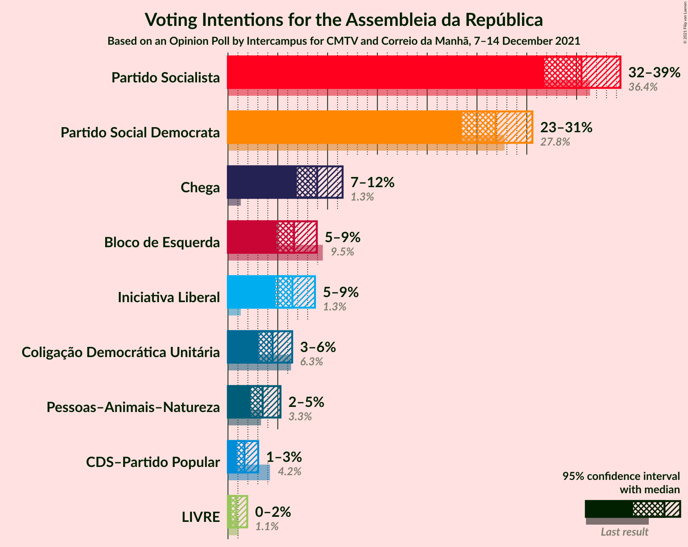

### Confidence Intervals

| Party | Last Result | Poll Result | 80% Confidence Interval | 90% Confidence Interval | 95% Confidence Interval | 99% Confidence Interval |
|:-----:|:-----------:|:-----------:|:-----------------------:|:-----------------------:|:-----------------------:|:-----------------------:|
| Partido Socialista | 36.4% | 35.5% | 33.0–38.0% |32.4–38.8% |31.8–39.4% |30.6–40.6% |
| Partido Social Democrata | 27.8% | 26.9% | 24.6–29.3% |24.0–29.9% |23.5–30.6% |22.4–31.7% |
| Chega | 1.3% | 9.0% | 7.6–10.6% |7.2–11.1% |6.9–11.5% |6.3–12.4% |
| Bloco de Esquerda | 9.5% | 6.6% | 5.5–8.1% |5.2–8.5% |4.9–8.9% |4.4–9.7% |
| Iniciativa Liberal | 1.3% | 6.5% | 5.3–7.9% |5.0–8.4% |4.8–8.7% |4.3–9.5% |
| Coligação Democrática Unitária | 6.3% | 4.5% | 3.6–5.8% |3.3–6.1% |3.1–6.4% |2.7–7.1% |
| Pessoas–Animais–Natureza | 3.3% | 3.5% | 2.7–4.6% |2.5–5.0% |2.3–5.3% |2.0–5.9% |
| CDS–Partido Popular | 4.2% | 1.7% | 1.2–2.5% |1.0–2.8% |0.9–3.0% |0.7–3.5% |
| LIVRE | 1.1% | 0.8% | 0.5–1.5% |0.4–1.7% |0.4–1.9% |0.2–2.3% |

*Note:* The poll result column reflects the actual value used in the calculations. Published results may vary slightly, and in addition be rounded to fewer digits.

## Seats

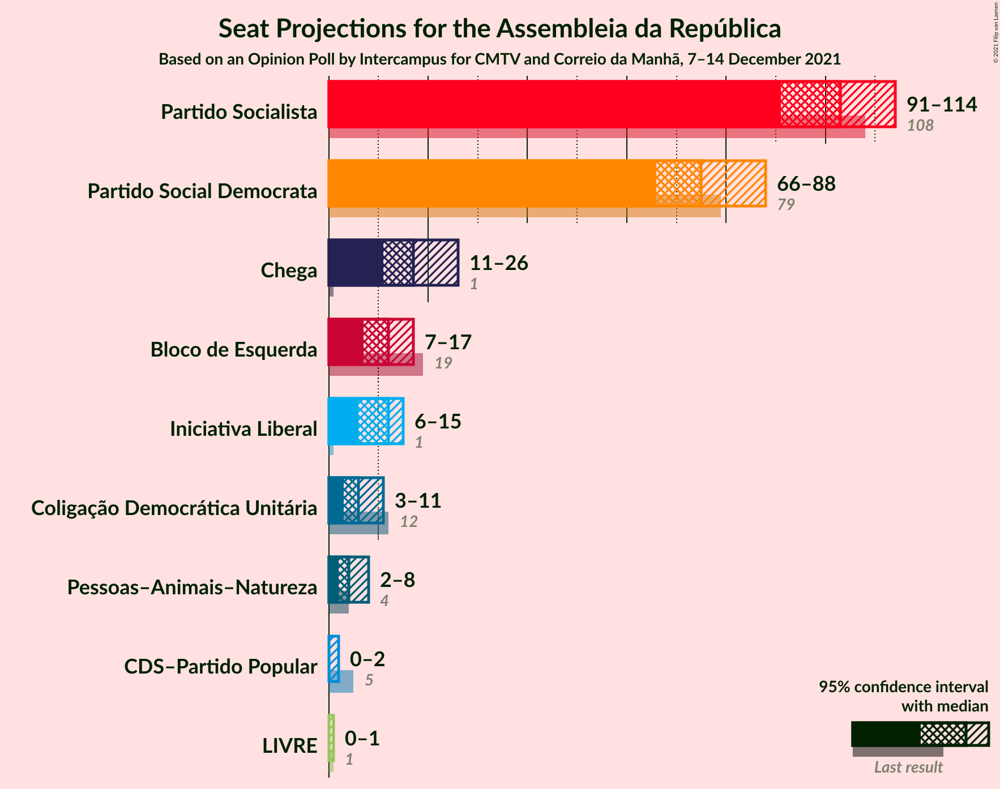

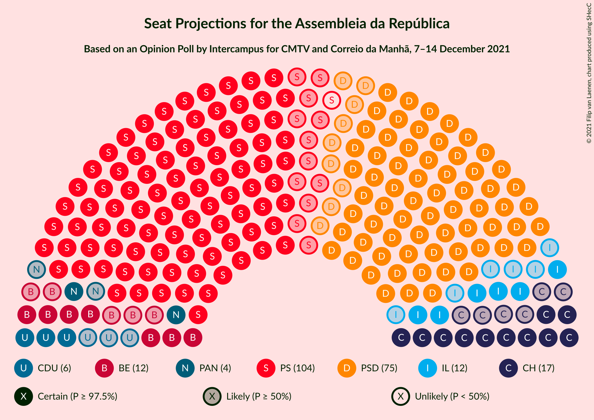

### Confidence Intervals

| Party | Last Result | Median | 80% Confidence Interval | 90% Confidence Interval | 95% Confidence Interval | 99% Confidence Interval |
|:-----:|:-----------:|:------:|:-----------------------:|:-----------------------:|:-----------------------:|:-----------------------:|
| <a href="#partido-socialista">Partido Socialista</a> | 108 | 103 | 96–111 |93–113 |91–114 |86–119 |
| <a href="#partido-social-democrata">Partido Social Democrata</a> | 79 | 75 | 68–83 |66–85 |66–88 |62–92 |
| <a href="#chega">Chega</a> | 1 | 17 | 12–23 |11–25 |11–26 |10–28 |
| <a href="#bloco-de-esquerda">Bloco de Esquerda</a> | 19 | 12 | 7–16 |7–17 |7–17 |6–19 |
| <a href="#iniciativa-liberal">Iniciativa Liberal</a> | 1 | 12 | 8–14 |6–14 |6–15 |6–17 |
| <a href="#coligação-democrática-unitária">Coligação Democrática Unitária</a> | 12 | 6 | 4–9 |3–10 |3–11 |2–14 |
| <a href="#pessoas–animais–natureza">Pessoas–Animais–Natureza</a> | 4 | 4 | 2–6 |2–6 |2–8 |1–9 |
| <a href="#cds–partido-popular">CDS–Partido Popular</a> | 5 | 0 | 0–1 |0–2 |0–2 |0–3 |
| <a href="#livre">LIVRE</a> | 1 | 0 | 0–1 |0–1 |0–1 |0–2 |

### Partido Socialista

*For a full overview of the results for this party, see the [Partido Socialista](party-partidosocialista.html) page.*

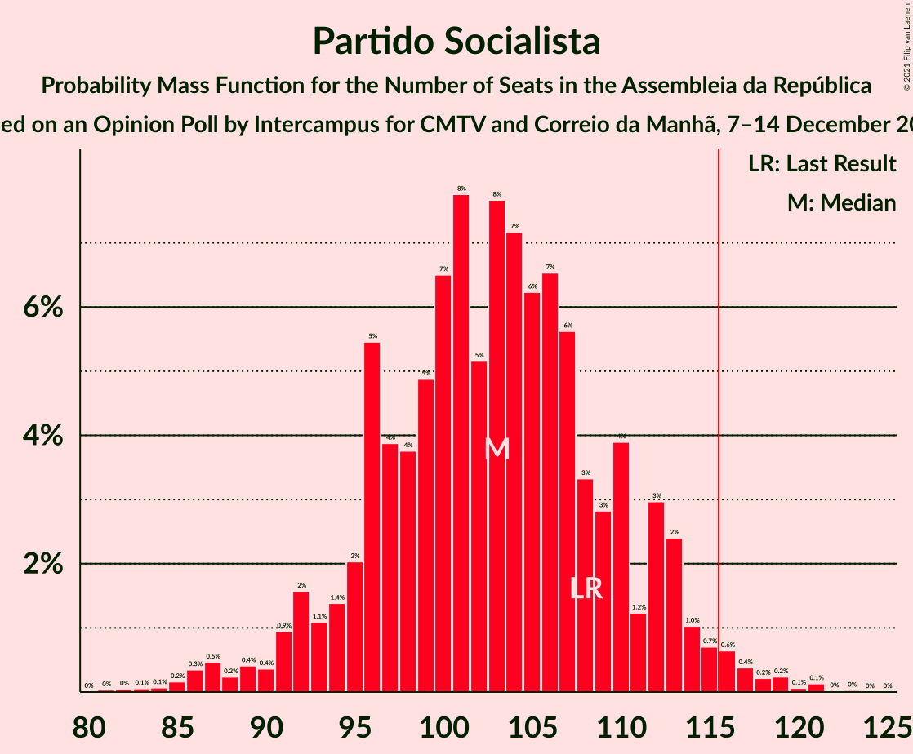

| Number of Seats | Probability | Accumulated | Special Marks |
|:---------------:|:-----------:|:-----------:|:-------------:|
| 81 | 0% | 100% |  |
| 82 | 0% | 99.9% |  |
| 83 | 0.1% | 99.9% |  |
| 84 | 0.1% | 99.8% |  |
| 85 | 0.2% | 99.8% |  |
| 86 | 0.3% | 99.6% |  |
| 87 | 0.5% | 99.3% |  |
| 88 | 0.2% | 98.8% |  |
| 89 | 0.4% | 98.6% |  |
| 90 | 0.4% | 98% |  |
| 91 | 0.9% | 98% |  |
| 92 | 2% | 97% |  |
| 93 | 1.1% | 95% |  |
| 94 | 1.4% | 94% |  |
| 95 | 2% | 93% |  |
| 96 | 5% | 91% |  |
| 97 | 4% | 85% |  |
| 98 | 4% | 81% |  |
| 99 | 5% | 78% |  |
| 100 | 7% | 73% |  |
| 101 | 8% | 66% |  |
| 102 | 5% | 59% |  |
| 103 | 8% | 53% | Median |
| 104 | 7% | 46% |  |
| 105 | 6% | 39% |  |
| 106 | 7% | 32% |  |
| 107 | 6% | 26% |  |
| 108 | 3% | 20% | Last Result |
| 109 | 3% | 17% |  |
| 110 | 4% | 14% |  |
| 111 | 1.2% | 10% |  |
| 112 | 3% | 9% |  |
| 113 | 2% | 6% |  |
| 114 | 1.0% | 3% |  |
| 115 | 0.7% | 2% |  |
| 116 | 0.6% | 2% | Majority |
| 117 | 0.4% | 1.1% |  |
| 118 | 0.2% | 0.7% |  |
| 119 | 0.2% | 0.5% |  |
| 120 | 0.1% | 0.3% |  |
| 121 | 0.1% | 0.2% |  |
| 122 | 0% | 0.1% |  |
| 123 | 0% | 0.1% |  |
| 124 | 0% | 0% |  |

### Partido Social Democrata

*For a full overview of the results for this party, see the [Partido Social Democrata](party-partidosocialdemocrata.html) page.*

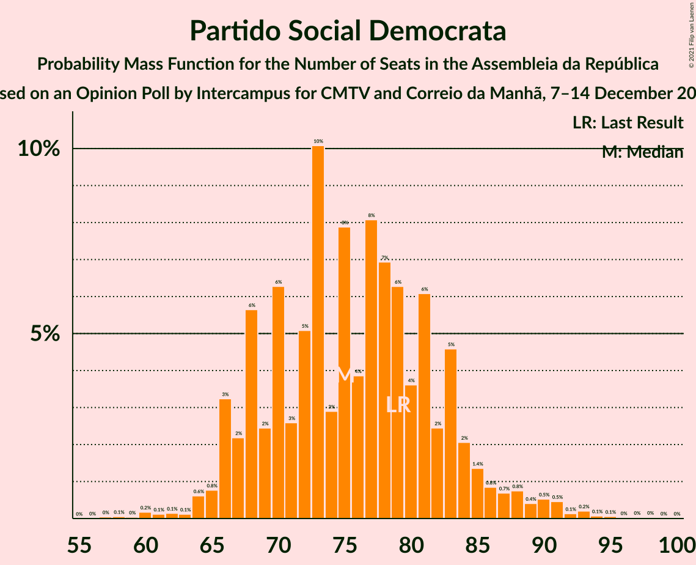

| Number of Seats | Probability | Accumulated | Special Marks |
|:---------------:|:-----------:|:-----------:|:-------------:|
| 57 | 0% | 100% |  |
| 58 | 0.1% | 99.9% |  |
| 59 | 0% | 99.9% |  |
| 60 | 0.2% | 99.8% |  |
| 61 | 0.1% | 99.7% |  |
| 62 | 0.1% | 99.5% |  |
| 63 | 0.1% | 99.4% |  |
| 64 | 0.6% | 99.3% |  |
| 65 | 0.8% | 98.7% |  |
| 66 | 3% | 98% |  |
| 67 | 2% | 95% |  |
| 68 | 6% | 92% |  |
| 69 | 2% | 87% |  |
| 70 | 6% | 84% |  |
| 71 | 3% | 78% |  |
| 72 | 5% | 76% |  |
| 73 | 10% | 70% |  |
| 74 | 3% | 60% |  |
| 75 | 8% | 57% | Median |
| 76 | 4% | 50% |  |
| 77 | 8% | 46% |  |
| 78 | 7% | 38% |  |
| 79 | 6% | 31% | Last Result |
| 80 | 4% | 24% |  |
| 81 | 6% | 21% |  |
| 82 | 2% | 15% |  |
| 83 | 5% | 12% |  |
| 84 | 2% | 8% |  |
| 85 | 1.4% | 6% |  |
| 86 | 0.8% | 4% |  |
| 87 | 0.7% | 3% |  |
| 88 | 0.8% | 3% |  |
| 89 | 0.4% | 2% |  |
| 90 | 0.5% | 2% |  |
| 91 | 0.5% | 1.0% |  |
| 92 | 0.1% | 0.6% |  |
| 93 | 0.2% | 0.4% |  |
| 94 | 0.1% | 0.2% |  |
| 95 | 0.1% | 0.2% |  |
| 96 | 0% | 0.1% |  |
| 97 | 0% | 0.1% |  |
| 98 | 0% | 0.1% |  |
| 99 | 0% | 0% |  |

### Chega

*For a full overview of the results for this party, see the [Chega](party-chega.html) page.*

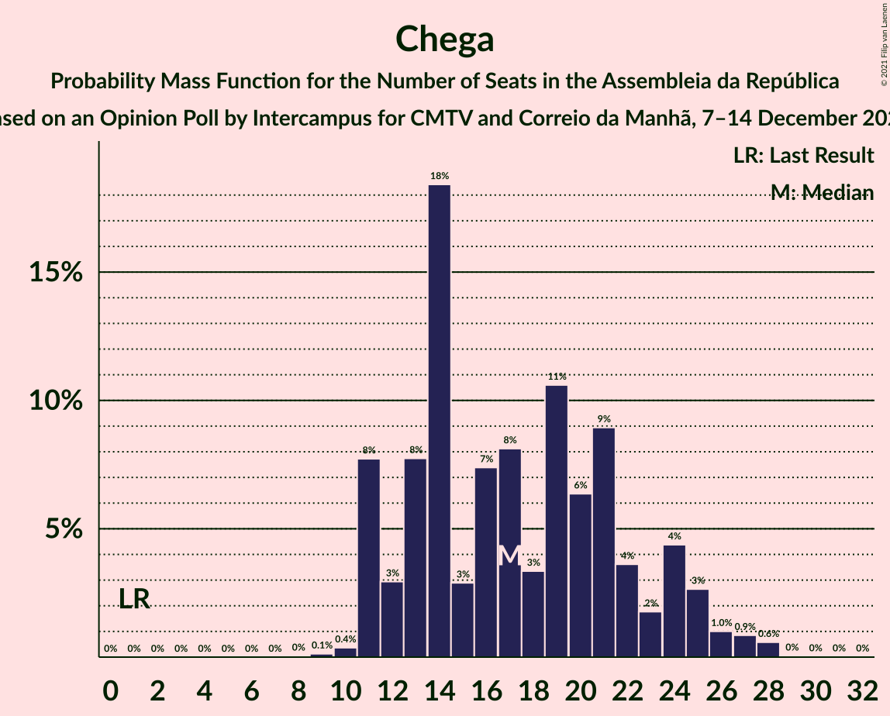

| Number of Seats | Probability | Accumulated | Special Marks |
|:---------------:|:-----------:|:-----------:|:-------------:|
| 1 | 0% | 100% | Last Result |
| 2 | 0% | 100% |  |
| 3 | 0% | 100% |  |
| 4 | 0% | 100% |  |
| 5 | 0% | 100% |  |
| 6 | 0% | 100% |  |
| 7 | 0% | 100% |  |
| 8 | 0% | 100% |  |
| 9 | 0.1% | 99.9% |  |
| 10 | 0.4% | 99.8% |  |
| 11 | 8% | 99.5% |  |
| 12 | 3% | 92% |  |
| 13 | 8% | 89% |  |
| 14 | 18% | 81% |  |
| 15 | 3% | 63% |  |
| 16 | 7% | 60% |  |
| 17 | 8% | 52% | Median |
| 18 | 3% | 44% |  |
| 19 | 11% | 41% |  |
| 20 | 6% | 30% |  |
| 21 | 9% | 24% |  |
| 22 | 4% | 15% |  |
| 23 | 2% | 11% |  |
| 24 | 4% | 10% |  |
| 25 | 3% | 5% |  |
| 26 | 1.0% | 3% |  |
| 27 | 0.9% | 2% |  |
| 28 | 0.6% | 0.7% |  |
| 29 | 0% | 0.1% |  |
| 30 | 0% | 0.1% |  |
| 31 | 0% | 0% |  |

### Bloco de Esquerda

*For a full overview of the results for this party, see the [Bloco de Esquerda](party-blocodeesquerda.html) page.*

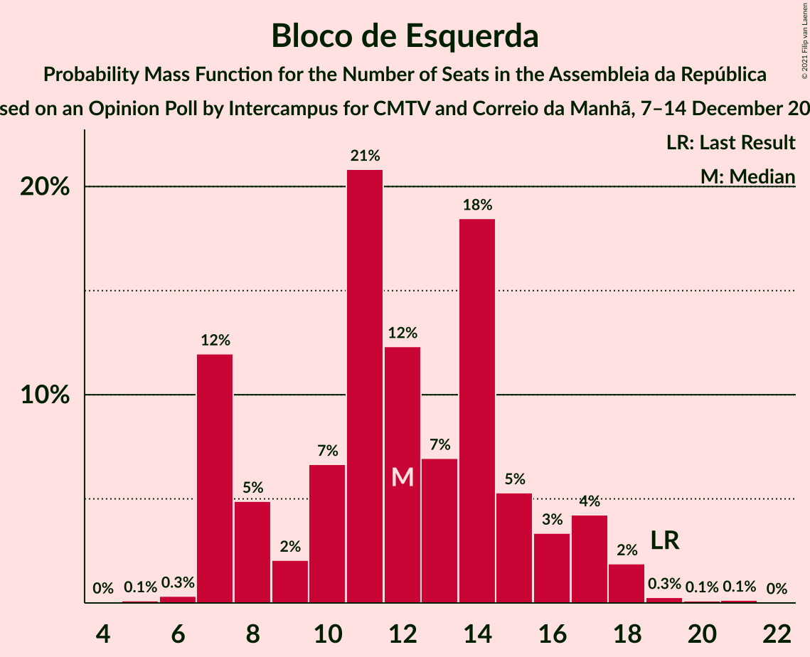

| Number of Seats | Probability | Accumulated | Special Marks |
|:---------------:|:-----------:|:-----------:|:-------------:|
| 4 | 0% | 100% |  |
| 5 | 0.1% | 99.9% |  |
| 6 | 0.3% | 99.8% |  |
| 7 | 12% | 99.5% |  |
| 8 | 5% | 87% |  |
| 9 | 2% | 83% |  |
| 10 | 7% | 81% |  |
| 11 | 21% | 74% |  |
| 12 | 12% | 53% | Median |
| 13 | 7% | 41% |  |
| 14 | 18% | 34% |  |
| 15 | 5% | 15% |  |
| 16 | 3% | 10% |  |
| 17 | 4% | 7% |  |
| 18 | 2% | 2% |  |
| 19 | 0.3% | 0.6% | Last Result |
| 20 | 0.1% | 0.3% |  |
| 21 | 0.1% | 0.2% |  |
| 22 | 0% | 0% |  |

### Iniciativa Liberal

*For a full overview of the results for this party, see the [Iniciativa Liberal](party-iniciativaliberal.html) page.*

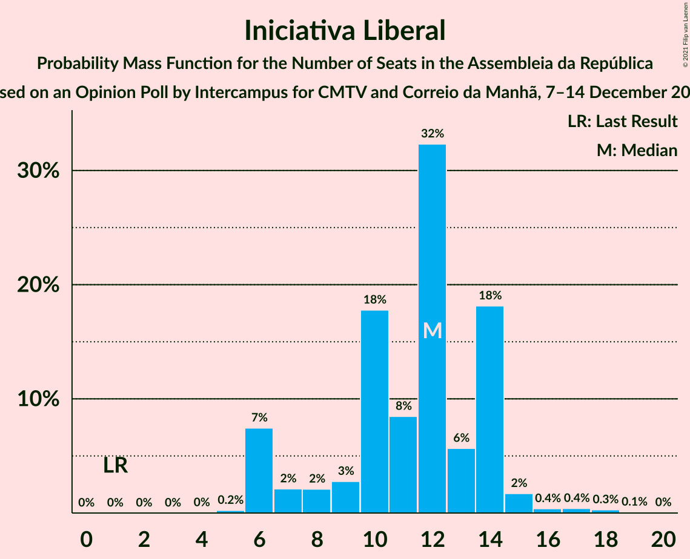

| Number of Seats | Probability | Accumulated | Special Marks |
|:---------------:|:-----------:|:-----------:|:-------------:|
| 1 | 0% | 100% | Last Result |
| 2 | 0% | 100% |  |
| 3 | 0% | 100% |  |
| 4 | 0% | 100% |  |
| 5 | 0.2% | 100% |  |
| 6 | 7% | 99.7% |  |
| 7 | 2% | 92% |  |
| 8 | 2% | 90% |  |
| 9 | 3% | 88% |  |
| 10 | 18% | 85% |  |
| 11 | 8% | 68% |  |
| 12 | 32% | 59% | Median |
| 13 | 6% | 27% |  |
| 14 | 18% | 21% |  |
| 15 | 2% | 3% |  |
| 16 | 0.4% | 1.2% |  |
| 17 | 0.4% | 0.8% |  |
| 18 | 0.3% | 0.4% |  |
| 19 | 0.1% | 0.1% |  |
| 20 | 0% | 0% |  |

### Coligação Democrática Unitária

*For a full overview of the results for this party, see the [Coligação Democrática Unitária](party-coligaçãodemocráticaunitária.html) page.*

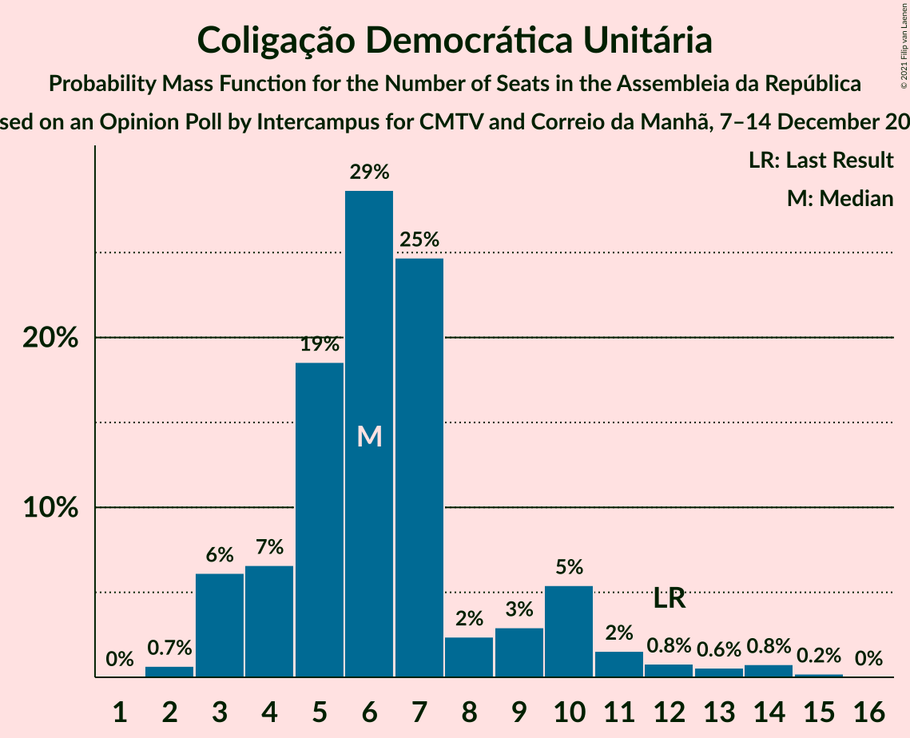

| Number of Seats | Probability | Accumulated | Special Marks |
|:---------------:|:-----------:|:-----------:|:-------------:|
| 2 | 0.7% | 100% |  |
| 3 | 6% | 99.3% |  |
| 4 | 7% | 93% |  |
| 5 | 19% | 87% |  |
| 6 | 29% | 68% | Median |
| 7 | 25% | 39% |  |
| 8 | 2% | 15% |  |
| 9 | 3% | 12% |  |
| 10 | 5% | 9% |  |
| 11 | 2% | 4% |  |
| 12 | 0.8% | 2% | Last Result |
| 13 | 0.6% | 2% |  |
| 14 | 0.8% | 1.0% |  |
| 15 | 0.2% | 0.3% |  |
| 16 | 0% | 0% |  |

### Pessoas–Animais–Natureza

*For a full overview of the results for this party, see the [Pessoas–Animais–Natureza](party-pessoas–animais–natureza.html) page.*

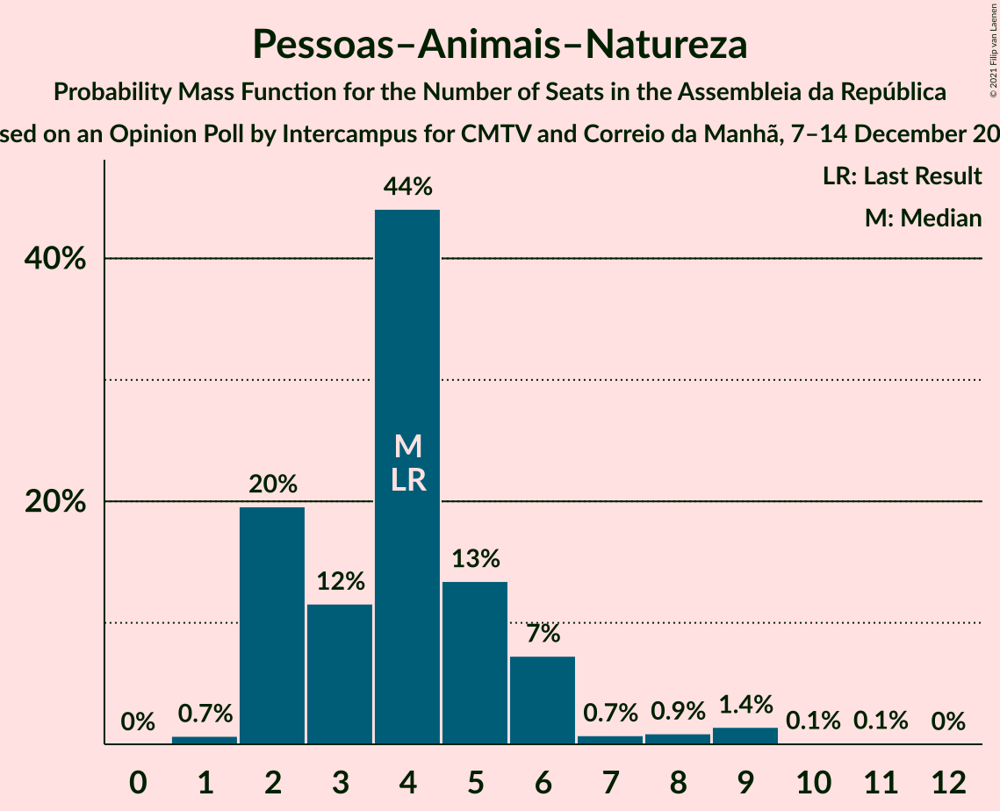

| Number of Seats | Probability | Accumulated | Special Marks |
|:---------------:|:-----------:|:-----------:|:-------------:|
| 1 | 0.7% | 100% |  |
| 2 | 20% | 99.3% |  |
| 3 | 12% | 80% |  |
| 4 | 44% | 68% | Last Result, Median |
| 5 | 13% | 24% |  |
| 6 | 7% | 11% |  |
| 7 | 0.7% | 3% |  |
| 8 | 0.9% | 3% |  |
| 9 | 1.4% | 2% |  |
| 10 | 0.1% | 0.3% |  |
| 11 | 0.1% | 0.2% |  |
| 12 | 0% | 0% |  |

### CDS–Partido Popular

*For a full overview of the results for this party, see the [CDS–Partido Popular](party-cds–partidopopular.html) page.*

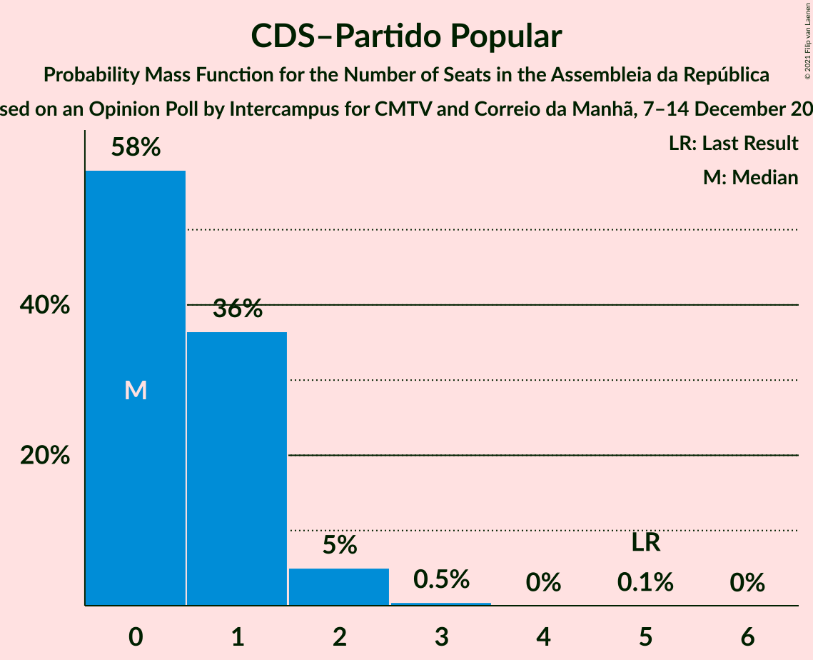

| Number of Seats | Probability | Accumulated | Special Marks |
|:---------------:|:-----------:|:-----------:|:-------------:|
| 0 | 58% | 100% | Median |
| 1 | 36% | 42% |  |
| 2 | 5% | 6% |  |
| 3 | 0.5% | 0.6% |  |
| 4 | 0% | 0.1% |  |
| 5 | 0.1% | 0.1% | Last Result |
| 6 | 0% | 0% |  |

### LIVRE

*For a full overview of the results for this party, see the [LIVRE](party-livre.html) page.*

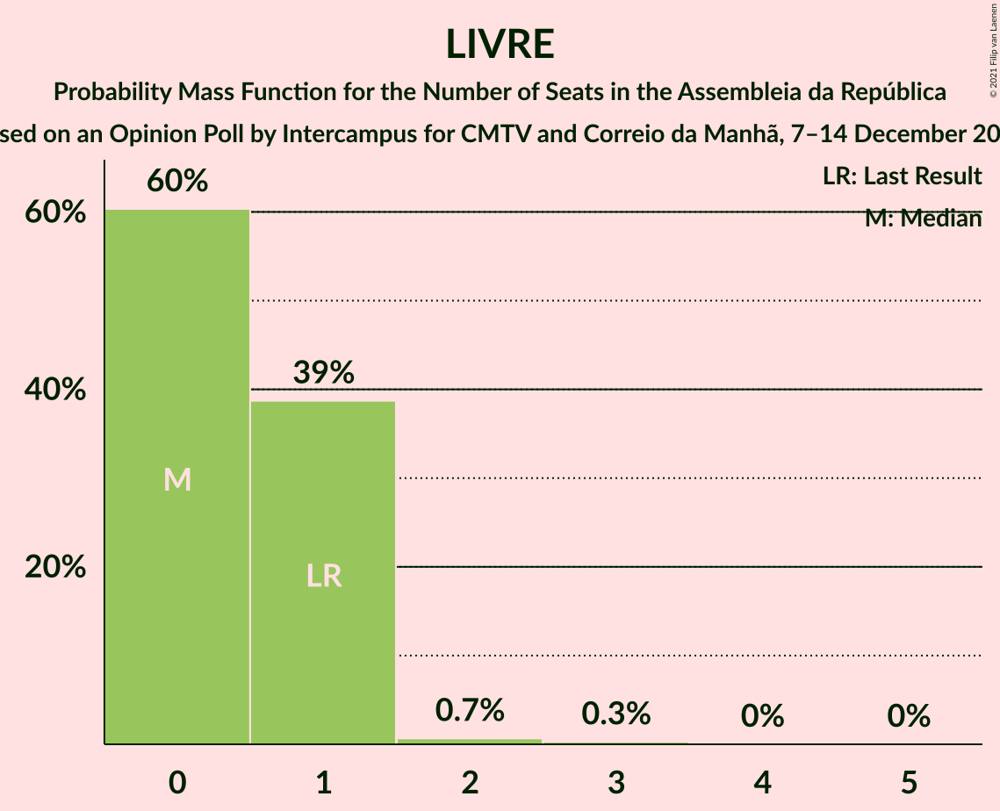

| Number of Seats | Probability | Accumulated | Special Marks |
|:---------------:|:-----------:|:-----------:|:-------------:|
| 0 | 60% | 100% | Median |
| 1 | 39% | 40% | Last Result |
| 2 | 0.7% | 0.9% |  |
| 3 | 0.3% | 0.3% |  |
| 4 | 0% | 0% |  |

## Coalitions

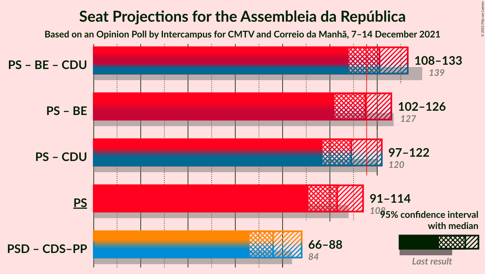

### Confidence Intervals

| Coalition | Last Result | Median | Majority? | 80% Confidence Interval | 90% Confidence Interval | 95% Confidence Interval | 99% Confidence Interval |
|:---------:|:-----------:|:------:|:---------:|:-----------------------:|:-----------------------:|:-----------------------:|:-----------------------:|
| Partido Socialista – Bloco de Esquerda – Coligação Democrática Unitária | 139 | 121 | 81% | 113–129 | 110–131 | 108–133 | 102–137 |
| Partido Socialista – Bloco de Esquerda | 127 | 115 | 48% | 107–122 | 104–124 | 102–126 | 97–130 |
| Partido Socialista – Coligação Democrática Unitária | 120 | 109 | 18% | 102–117 | 99–119 | 97–122 | 92–125 |
| Partido Socialista | 108 | 103 | 2% | 96–111 | 93–113 | 91–114 | 86–119 |
| Partido Social Democrata – CDS–Partido Popular | 84 | 76 | 0% | 69–84 | 67–85 | 66–88 | 63–93 |

### Partido Socialista – Bloco de Esquerda – Coligação Democrática Unitária

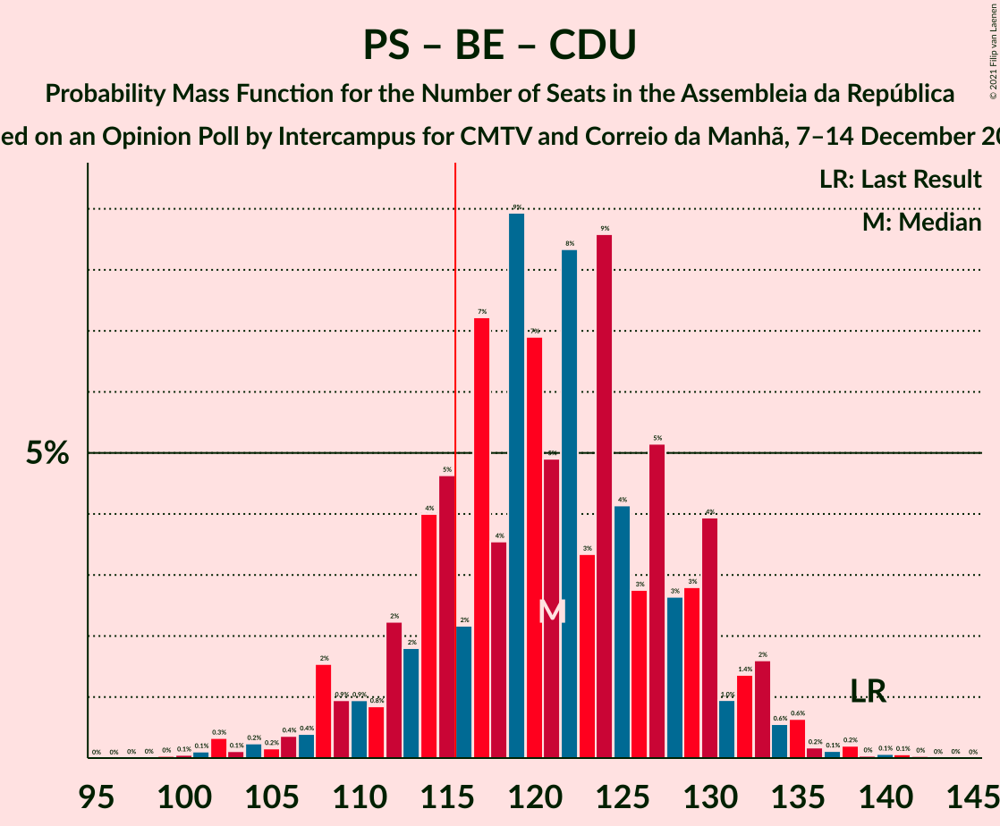

| Number of Seats | Probability | Accumulated | Special Marks |
|:---------------:|:-----------:|:-----------:|:-------------:|
| 99 | 0% | 100% |  |
| 100 | 0.1% | 99.9% |  |
| 101 | 0.1% | 99.9% |  |
| 102 | 0.3% | 99.8% |  |
| 103 | 0.1% | 99.4% |  |
| 104 | 0.2% | 99.3% |  |
| 105 | 0.2% | 99.1% |  |
| 106 | 0.4% | 98.9% |  |
| 107 | 0.4% | 98.6% |  |
| 108 | 2% | 98% |  |
| 109 | 0.9% | 97% |  |
| 110 | 0.9% | 96% |  |
| 111 | 0.8% | 95% |  |
| 112 | 2% | 94% |  |
| 113 | 2% | 92% |  |
| 114 | 4% | 90% |  |
| 115 | 5% | 86% |  |
| 116 | 2% | 81% | Majority |
| 117 | 7% | 79% |  |
| 118 | 4% | 72% |  |
| 119 | 9% | 68% |  |
| 120 | 7% | 59% |  |
| 121 | 5% | 52% | Median |
| 122 | 8% | 48% |  |
| 123 | 3% | 39% |  |
| 124 | 9% | 36% |  |
| 125 | 4% | 27% |  |
| 126 | 3% | 23% |  |
| 127 | 5% | 20% |  |
| 128 | 3% | 15% |  |
| 129 | 3% | 13% |  |
| 130 | 4% | 10% |  |
| 131 | 1.0% | 6% |  |
| 132 | 1.4% | 5% |  |
| 133 | 2% | 4% |  |
| 134 | 0.6% | 2% |  |
| 135 | 0.6% | 1.4% |  |
| 136 | 0.2% | 0.7% |  |
| 137 | 0.1% | 0.6% |  |
| 138 | 0.2% | 0.4% |  |
| 139 | 0% | 0.2% | Last Result |
| 140 | 0.1% | 0.2% |  |
| 141 | 0.1% | 0.1% |  |
| 142 | 0% | 0.1% |  |
| 143 | 0% | 0% |  |

### Partido Socialista – Bloco de Esquerda

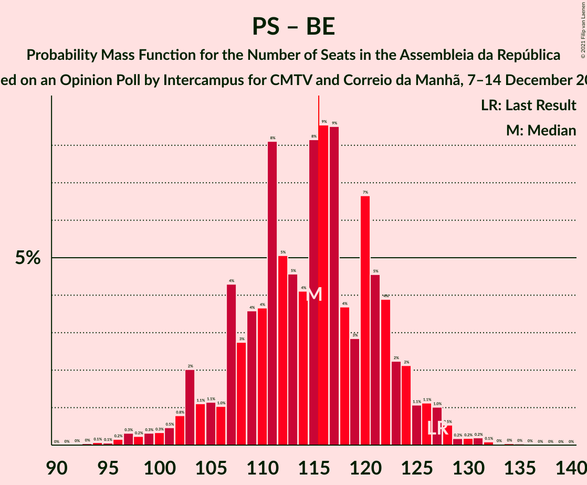

| Number of Seats | Probability | Accumulated | Special Marks |
|:---------------:|:-----------:|:-----------:|:-------------:|
| 93 | 0% | 100% |  |
| 94 | 0.1% | 99.9% |  |
| 95 | 0.1% | 99.8% |  |
| 96 | 0.2% | 99.8% |  |
| 97 | 0.3% | 99.6% |  |
| 98 | 0.2% | 99.3% |  |
| 99 | 0.3% | 99.1% |  |
| 100 | 0.3% | 98.8% |  |
| 101 | 0.5% | 98% |  |
| 102 | 0.8% | 98% |  |
| 103 | 2% | 97% |  |
| 104 | 1.1% | 95% |  |
| 105 | 1.1% | 94% |  |
| 106 | 1.0% | 93% |  |
| 107 | 4% | 92% |  |
| 108 | 3% | 88% |  |
| 109 | 4% | 85% |  |
| 110 | 4% | 81% |  |
| 111 | 8% | 78% |  |
| 112 | 5% | 69% |  |
| 113 | 5% | 64% |  |
| 114 | 4% | 60% |  |
| 115 | 8% | 56% | Median |
| 116 | 9% | 48% | Majority |
| 117 | 9% | 39% |  |
| 118 | 4% | 31% |  |
| 119 | 3% | 27% |  |
| 120 | 7% | 24% |  |
| 121 | 5% | 17% |  |
| 122 | 4% | 13% |  |
| 123 | 2% | 9% |  |
| 124 | 2% | 7% |  |
| 125 | 1.1% | 5% |  |
| 126 | 1.1% | 3% |  |
| 127 | 1.0% | 2% | Last Result |
| 128 | 0.5% | 1.3% |  |
| 129 | 0.2% | 0.8% |  |
| 130 | 0.2% | 0.6% |  |
| 131 | 0.2% | 0.4% |  |
| 132 | 0.1% | 0.2% |  |
| 133 | 0% | 0.2% |  |
| 134 | 0% | 0.1% |  |
| 135 | 0% | 0.1% |  |
| 136 | 0% | 0.1% |  |
| 137 | 0% | 0% |  |

### Partido Socialista – Coligação Democrática Unitária

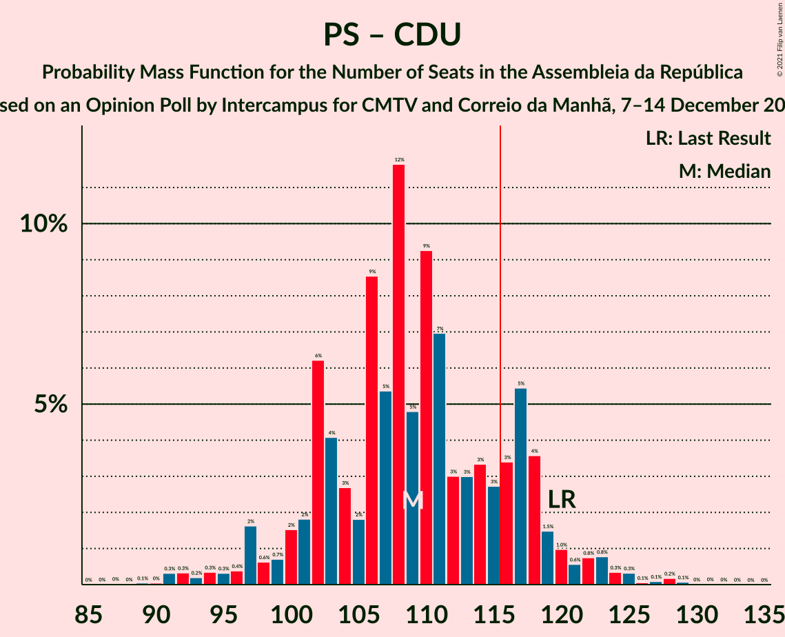

| Number of Seats | Probability | Accumulated | Special Marks |
|:---------------:|:-----------:|:-----------:|:-------------:|
| 87 | 0% | 100% |  |
| 88 | 0% | 99.9% |  |
| 89 | 0.1% | 99.9% |  |
| 90 | 0% | 99.9% |  |
| 91 | 0.3% | 99.8% |  |
| 92 | 0.3% | 99.5% |  |
| 93 | 0.2% | 99.2% |  |
| 94 | 0.3% | 99.0% |  |
| 95 | 0.3% | 98.6% |  |
| 96 | 0.4% | 98% |  |
| 97 | 2% | 98% |  |
| 98 | 0.6% | 96% |  |
| 99 | 0.7% | 96% |  |
| 100 | 2% | 95% |  |
| 101 | 2% | 93% |  |
| 102 | 6% | 92% |  |
| 103 | 4% | 85% |  |
| 104 | 3% | 81% |  |
| 105 | 2% | 79% |  |
| 106 | 9% | 77% |  |
| 107 | 5% | 68% |  |
| 108 | 12% | 63% |  |
| 109 | 5% | 51% | Median |
| 110 | 9% | 46% |  |
| 111 | 7% | 37% |  |
| 112 | 3% | 30% |  |
| 113 | 3% | 27% |  |
| 114 | 3% | 24% |  |
| 115 | 3% | 21% |  |
| 116 | 3% | 18% | Majority |
| 117 | 5% | 15% |  |
| 118 | 4% | 9% |  |
| 119 | 1.5% | 6% |  |
| 120 | 1.0% | 4% | Last Result |
| 121 | 0.6% | 3% |  |
| 122 | 0.8% | 3% |  |
| 123 | 0.8% | 2% |  |
| 124 | 0.3% | 1.1% |  |
| 125 | 0.3% | 0.8% |  |
| 126 | 0.1% | 0.5% |  |
| 127 | 0.1% | 0.4% |  |
| 128 | 0.2% | 0.3% |  |
| 129 | 0.1% | 0.1% |  |
| 130 | 0% | 0.1% |  |
| 131 | 0% | 0% |  |

### Partido Socialista

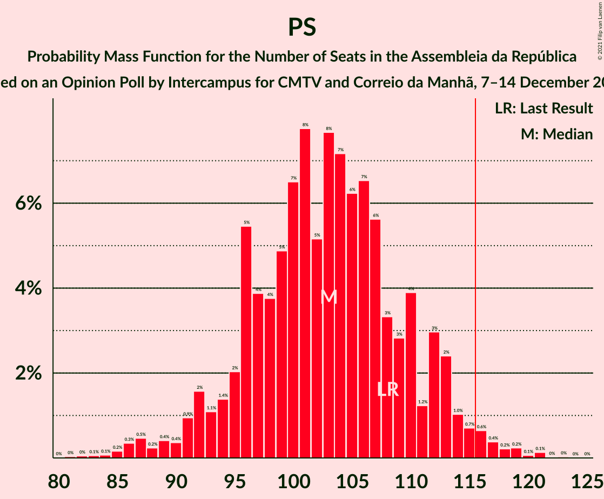

| Number of Seats | Probability | Accumulated | Special Marks |
|:---------------:|:-----------:|:-----------:|:-------------:|
| 81 | 0% | 100% |  |
| 82 | 0% | 99.9% |  |
| 83 | 0.1% | 99.9% |  |
| 84 | 0.1% | 99.8% |  |
| 85 | 0.2% | 99.8% |  |
| 86 | 0.3% | 99.6% |  |
| 87 | 0.5% | 99.3% |  |
| 88 | 0.2% | 98.8% |  |
| 89 | 0.4% | 98.6% |  |
| 90 | 0.4% | 98% |  |
| 91 | 0.9% | 98% |  |
| 92 | 2% | 97% |  |
| 93 | 1.1% | 95% |  |
| 94 | 1.4% | 94% |  |
| 95 | 2% | 93% |  |
| 96 | 5% | 91% |  |
| 97 | 4% | 85% |  |
| 98 | 4% | 81% |  |
| 99 | 5% | 78% |  |
| 100 | 7% | 73% |  |
| 101 | 8% | 66% |  |
| 102 | 5% | 59% |  |
| 103 | 8% | 53% | Median |
| 104 | 7% | 46% |  |
| 105 | 6% | 39% |  |
| 106 | 7% | 32% |  |
| 107 | 6% | 26% |  |
| 108 | 3% | 20% | Last Result |
| 109 | 3% | 17% |  |
| 110 | 4% | 14% |  |
| 111 | 1.2% | 10% |  |
| 112 | 3% | 9% |  |
| 113 | 2% | 6% |  |
| 114 | 1.0% | 3% |  |
| 115 | 0.7% | 2% |  |
| 116 | 0.6% | 2% | Majority |
| 117 | 0.4% | 1.1% |  |
| 118 | 0.2% | 0.7% |  |
| 119 | 0.2% | 0.5% |  |
| 120 | 0.1% | 0.3% |  |
| 121 | 0.1% | 0.2% |  |
| 122 | 0% | 0.1% |  |
| 123 | 0% | 0.1% |  |
| 124 | 0% | 0% |  |

### Partido Social Democrata – CDS–Partido Popular

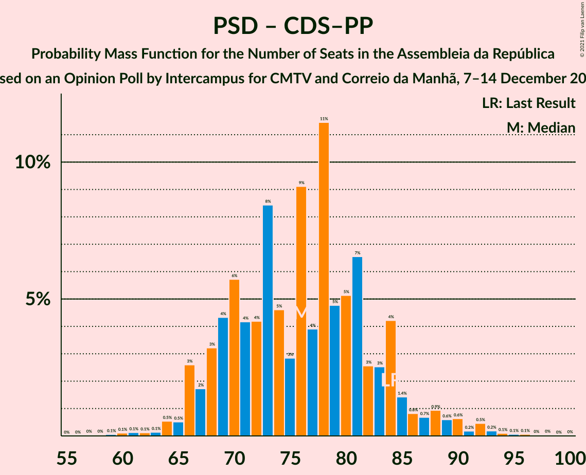

| Number of Seats | Probability | Accumulated | Special Marks |
|:---------------:|:-----------:|:-----------:|:-------------:|
| 57 | 0% | 100% |  |
| 58 | 0% | 99.9% |  |
| 59 | 0.1% | 99.9% |  |
| 60 | 0.1% | 99.9% |  |
| 61 | 0.1% | 99.7% |  |
| 62 | 0.1% | 99.6% |  |
| 63 | 0.1% | 99.5% |  |
| 64 | 0.5% | 99.4% |  |
| 65 | 0.5% | 98.8% |  |
| 66 | 3% | 98% |  |
| 67 | 2% | 96% |  |
| 68 | 3% | 94% |  |
| 69 | 4% | 91% |  |
| 70 | 6% | 86% |  |
| 71 | 4% | 81% |  |
| 72 | 4% | 77% |  |
| 73 | 8% | 72% |  |
| 74 | 5% | 64% |  |
| 75 | 3% | 59% | Median |
| 76 | 9% | 56% |  |
| 77 | 4% | 47% |  |
| 78 | 11% | 43% |  |
| 79 | 5% | 32% |  |
| 80 | 5% | 27% |  |
| 81 | 7% | 22% |  |
| 82 | 3% | 16% |  |
| 83 | 3% | 13% |  |
| 84 | 4% | 10% | Last Result |
| 85 | 1.4% | 6% |  |
| 86 | 0.8% | 5% |  |
| 87 | 0.7% | 4% |  |
| 88 | 0.9% | 3% |  |
| 89 | 0.6% | 2% |  |
| 90 | 0.6% | 2% |  |
| 91 | 0.2% | 1.1% |  |
| 92 | 0.5% | 1.0% |  |
| 93 | 0.2% | 0.5% |  |
| 94 | 0.1% | 0.3% |  |
| 95 | 0.1% | 0.2% |  |
| 96 | 0.1% | 0.2% |  |
| 97 | 0% | 0.1% |  |
| 98 | 0% | 0.1% |  |
| 99 | 0% | 0% |  |

## Technical Information

### Opinion Poll

+ **Polling firm:** Intercampus
+ **Commissioner(s):** CMTV and Correio da Manhã
+ **Fieldwork period:** 7–14 December 2021

### Calculations

+ **Sample size:** 603
+ **Simulations done:** 1,048,576
+ **Error estimate:** 2.07%

