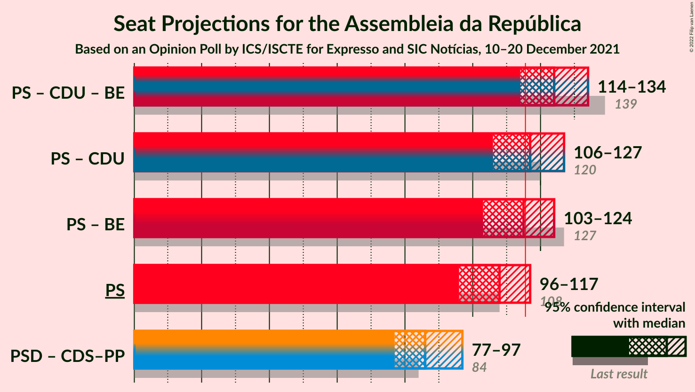

# Opinion Poll by ICS/ISCTE for Expresso and SIC Notícias, 10–20 December 2021

<a href="#voting-intentions">Voting Intentions</a> | <a href="#seats">Seats</a> | <a href="#coalitions">Coalitions</a> | <a href="#technical-information">Technical Information</a>

## Voting Intentions

### Confidence Intervals

| Party | Last Result | Poll Result | 80% Confidence Interval | 90% Confidence Interval | 95% Confidence Interval | 99% Confidence Interval |
|:-----:|:-----------:|:-----------:|:-----------------------:|:-----------------------:|:-----------------------:|:-----------------------:|
| Partido Socialista | 36.4% | 38.0% | 35.9–40.1% |35.3–40.7% |34.8–41.2% |33.9–42.2% |
| Partido Social Democrata | 27.8% | 31.0% | 29.0–33.0% |28.5–33.6% |28.0–34.1% |27.1–35.1% |
| Chega | 1.3% | 7.0% | 6.0–8.2% |5.7–8.6% |5.5–8.9% |5.1–9.5% |
| Coligação Democrática Unitária | 6.3% | 6.0% | 5.1–7.1% |4.8–7.5% |4.6–7.7% |4.2–8.3% |
| Bloco de Esquerda | 9.5% | 5.0% | 4.2–6.1% |3.9–6.4% |3.7–6.6% |3.4–7.2% |
| Iniciativa Liberal | 1.3% | 4.0% | 3.3–5.0% |3.1–5.2% |2.9–5.5% |2.6–6.0% |
| CDS–Partido Popular | 4.2% | 2.0% | 1.5–2.7% |1.4–3.0% |1.3–3.1% |1.1–3.5% |
| Pessoas–Animais–Natureza | 3.3% | 2.0% | 1.5–2.7% |1.4–3.0% |1.3–3.1% |1.1–3.5% |

*Note:* The poll result column reflects the actual value used in the calculations. Published results may vary slightly, and in addition be rounded to fewer digits.

## Seats

### Confidence Intervals

| Party | Last Result | Median | 80% Confidence Interval | 90% Confidence Interval | 95% Confidence Interval | 99% Confidence Interval |
|:-----:|:-----------:|:------:|:-----------------------:|:-----------------------:|:-----------------------:|:-----------------------:|
| <a href="#partido-socialista">Partido Socialista</a> | 108 | 108 | 100–113 |98–116 |96–117 |94–119 |
| <a href="#partido-social-democrata">Partido Social Democrata</a> | 79 | 86 | 80–92 |78–94 |76–97 |74–99 |
| <a href="#chega">Chega</a> | 1 | 11 | 10–14 |9–14 |8–15 |8–18 |
| <a href="#coligação-democrática-unitária">Coligação Democrática Unitária</a> | 12 | 9 | 8–14 |7–15 |6–15 |5–17 |
| <a href="#bloco-de-esquerda">Bloco de Esquerda</a> | 19 | 7 | 5–9 |4–11 |3–11 |2–13 |
| <a href="#iniciativa-liberal">Iniciativa Liberal</a> | 1 | 5 | 4–6 |3–7 |3–8 |3–10 |
| <a href="#cds–partido-popular">CDS–Partido Popular</a> | 5 | 0 | 0–2 |0–2 |0–2 |0–3 |
| <a href="#pessoas–animais–natureza">Pessoas–Animais–Natureza</a> | 4 | 2 | 1–2 |0–2 |0–3 |0–4 |

### Partido Socialista

*For a full overview of the results for this party, see the [Partido Socialista](party-partidosocialista.html) page.*

| Number of Seats | Probability | Accumulated | Special Marks |
|:---------------:|:-----------:|:-----------:|:-------------:|
| 89 | 0% | 100% |  |
| 90 | 0.1% | 99.9% |  |
| 91 | 0% | 99.9% |  |
| 92 | 0.1% | 99.8% |  |
| 93 | 0.2% | 99.8% |  |
| 94 | 0.3% | 99.5% |  |
| 95 | 0.7% | 99.2% |  |
| 96 | 2% | 98.5% |  |
| 97 | 1.1% | 96% |  |
| 98 | 2% | 95% |  |
| 99 | 2% | 93% |  |
| 100 | 2% | 91% |  |
| 101 | 2% | 89% |  |
| 102 | 3% | 88% |  |
| 103 | 5% | 84% |  |
| 104 | 5% | 80% |  |
| 105 | 8% | 75% |  |
| 106 | 9% | 67% |  |
| 107 | 6% | 58% |  |
| 108 | 8% | 52% | Last Result, Median |
| 109 | 7% | 44% |  |
| 110 | 8% | 37% |  |
| 111 | 8% | 29% |  |
| 112 | 8% | 21% |  |
| 113 | 4% | 13% |  |
| 114 | 2% | 10% |  |
| 115 | 2% | 8% |  |
| 116 | 2% | 6% | Majority |
| 117 | 1.5% | 4% |  |
| 118 | 1.1% | 2% |  |
| 119 | 0.8% | 1.2% |  |
| 120 | 0.2% | 0.4% |  |
| 121 | 0.1% | 0.2% |  |
| 122 | 0% | 0.1% |  |
| 123 | 0% | 0% |  |

### Partido Social Democrata

*For a full overview of the results for this party, see the [Partido Social Democrata](party-partidosocialdemocrata.html) page.*

| Number of Seats | Probability | Accumulated | Special Marks |
|:---------------:|:-----------:|:-----------:|:-------------:|
| 70 | 0% | 100% |  |
| 71 | 0.1% | 99.9% |  |
| 72 | 0.1% | 99.9% |  |
| 73 | 0.2% | 99.8% |  |
| 74 | 0.2% | 99.6% |  |
| 75 | 0.8% | 99.3% |  |
| 76 | 1.5% | 98.6% |  |
| 77 | 1.2% | 97% |  |
| 78 | 3% | 96% |  |
| 79 | 2% | 93% | Last Result |
| 80 | 4% | 91% |  |
| 81 | 5% | 87% |  |
| 82 | 6% | 82% |  |
| 83 | 10% | 76% |  |
| 84 | 8% | 66% |  |
| 85 | 6% | 58% |  |
| 86 | 11% | 52% | Median |
| 87 | 7% | 41% |  |
| 88 | 4% | 33% |  |
| 89 | 12% | 29% |  |
| 90 | 3% | 16% |  |
| 91 | 3% | 14% |  |
| 92 | 3% | 10% |  |
| 93 | 2% | 7% |  |
| 94 | 1.0% | 6% |  |
| 95 | 0.9% | 5% |  |
| 96 | 1.1% | 4% |  |
| 97 | 1.2% | 3% |  |
| 98 | 0.7% | 1.4% |  |
| 99 | 0.3% | 0.7% |  |
| 100 | 0.2% | 0.4% |  |
| 101 | 0.1% | 0.3% |  |
| 102 | 0.1% | 0.1% |  |
| 103 | 0% | 0.1% |  |
| 104 | 0% | 0% |  |

### Chega

*For a full overview of the results for this party, see the [Chega](party-chega.html) page.*

| Number of Seats | Probability | Accumulated | Special Marks |
|:---------------:|:-----------:|:-----------:|:-------------:|
| 1 | 0% | 100% | Last Result |
| 2 | 0% | 100% |  |
| 3 | 0% | 100% |  |
| 4 | 0% | 100% |  |
| 5 | 0% | 100% |  |
| 6 | 0.1% | 99.9% |  |
| 7 | 0.2% | 99.8% |  |
| 8 | 4% | 99.6% |  |
| 9 | 2% | 96% |  |
| 10 | 11% | 94% |  |
| 11 | 52% | 83% | Median |
| 12 | 9% | 31% |  |
| 13 | 8% | 22% |  |
| 14 | 10% | 14% |  |
| 15 | 1.3% | 3% |  |
| 16 | 0.5% | 2% |  |
| 17 | 0.5% | 1.3% |  |
| 18 | 0.6% | 0.9% |  |
| 19 | 0.2% | 0.3% |  |
| 20 | 0% | 0.1% |  |
| 21 | 0% | 0% |  |

### Coligação Democrática Unitária

*For a full overview of the results for this party, see the [Coligação Democrática Unitária](party-coligaçãodemocráticaunitária.html) page.*

| Number of Seats | Probability | Accumulated | Special Marks |
|:---------------:|:-----------:|:-----------:|:-------------:|
| 5 | 0.9% | 100% |  |
| 6 | 3% | 99.0% |  |
| 7 | 6% | 97% |  |
| 8 | 20% | 91% |  |
| 9 | 34% | 71% | Median |
| 10 | 8% | 36% |  |
| 11 | 3% | 28% |  |
| 12 | 4% | 25% | Last Result |
| 13 | 4% | 21% |  |
| 14 | 8% | 18% |  |
| 15 | 8% | 10% |  |
| 16 | 1.1% | 2% |  |
| 17 | 0.4% | 0.6% |  |
| 18 | 0.2% | 0.3% |  |
| 19 | 0% | 0% |  |

### Bloco de Esquerda

*For a full overview of the results for this party, see the [Bloco de Esquerda](party-blocodeesquerda.html) page.*

| Number of Seats | Probability | Accumulated | Special Marks |
|:---------------:|:-----------:|:-----------:|:-------------:|
| 2 | 0.6% | 100% |  |
| 3 | 2% | 99.4% |  |
| 4 | 6% | 97% |  |
| 5 | 4% | 91% |  |
| 6 | 4% | 87% |  |
| 7 | 63% | 83% | Median |
| 8 | 6% | 20% |  |
| 9 | 6% | 13% |  |
| 10 | 1.3% | 7% |  |
| 11 | 4% | 6% |  |
| 12 | 0.8% | 2% |  |
| 13 | 0.6% | 0.9% |  |
| 14 | 0.1% | 0.3% |  |
| 15 | 0.1% | 0.1% |  |
| 16 | 0% | 0% |  |
| 17 | 0% | 0% |  |
| 18 | 0% | 0% |  |
| 19 | 0% | 0% | Last Result |

### Iniciativa Liberal

*For a full overview of the results for this party, see the [Iniciativa Liberal](party-iniciativaliberal.html) page.*

| Number of Seats | Probability | Accumulated | Special Marks |
|:---------------:|:-----------:|:-----------:|:-------------:|
| 1 | 0% | 100% | Last Result |
| 2 | 0% | 100% |  |
| 3 | 5% | 100% |  |
| 4 | 20% | 95% |  |
| 5 | 26% | 75% | Median |
| 6 | 43% | 50% |  |
| 7 | 3% | 6% |  |
| 8 | 1.2% | 4% |  |
| 9 | 1.3% | 2% |  |
| 10 | 0.8% | 1.0% |  |
| 11 | 0.1% | 0.2% |  |
| 12 | 0.1% | 0.1% |  |
| 13 | 0% | 0% |  |

### CDS–Partido Popular

*For a full overview of the results for this party, see the [CDS–Partido Popular](party-cds–partidopopular.html) page.*

| Number of Seats | Probability | Accumulated | Special Marks |
|:---------------:|:-----------:|:-----------:|:-------------:|
| 0 | 53% | 100% | Median |
| 1 | 33% | 47% |  |
| 2 | 13% | 14% |  |
| 3 | 0.7% | 0.9% |  |
| 4 | 0.2% | 0.2% |  |
| 5 | 0% | 0% | Last Result |

### Pessoas–Animais–Natureza

*For a full overview of the results for this party, see the [Pessoas–Animais–Natureza](party-pessoas–animais–natureza.html) page.*

| Number of Seats | Probability | Accumulated | Special Marks |
|:---------------:|:-----------:|:-----------:|:-------------:|
| 0 | 9% | 100% |  |
| 1 | 39% | 91% |  |
| 2 | 49% | 53% | Median |
| 3 | 3% | 4% |  |
| 4 | 1.4% | 1.4% | Last Result |
| 5 | 0% | 0% |  |

## Coalitions

### Confidence Intervals

| Coalition | Last Result | Median | Majority? | 80% Confidence Interval | 90% Confidence Interval | 95% Confidence Interval | 99% Confidence Interval |
|:---------:|:-----------:|:------:|:---------:|:-----------------------:|:-----------------------:|:-----------------------:|:-----------------------:|
| Partido Socialista – Coligação Democrática Unitária – Bloco de Esquerda | 139 | 124 | 96% | 118–131 | 116–133 | 114–134 | 111–137 |
| Partido Socialista – Coligação Democrática Unitária | 120 | 117 | 64% | 111–124 | 108–126 | 106–127 | 103–130 |
| Partido Socialista – Bloco de Esquerda | 127 | 115 | 45% | 107–120 | 105–122 | 103–124 | 100–127 |
| Partido Socialista | 108 | 108 | 6% | 100–113 | 98–116 | 96–117 | 94–119 |
| Partido Social Democrata – CDS–Partido Popular | 84 | 86 | 0% | 80–92 | 78–95 | 77–97 | 75–100 |

### Partido Socialista – Coligação Democrática Unitária – Bloco de Esquerda

| Number of Seats | Probability | Accumulated | Special Marks |
|:---------------:|:-----------:|:-----------:|:-------------:|
| 107 | 0% | 100% |  |
| 108 | 0.1% | 99.9% |  |
| 109 | 0.1% | 99.8% |  |
| 110 | 0.1% | 99.7% |  |
| 111 | 0.3% | 99.6% |  |
| 112 | 0.6% | 99.3% |  |
| 113 | 1.0% | 98.6% |  |
| 114 | 1.0% | 98% |  |
| 115 | 0.9% | 97% |  |
| 116 | 2% | 96% | Majority |
| 117 | 2% | 94% |  |
| 118 | 3% | 92% |  |
| 119 | 5% | 89% |  |
| 120 | 4% | 83% |  |
| 121 | 5% | 80% |  |
| 122 | 7% | 74% |  |
| 123 | 6% | 68% |  |
| 124 | 12% | 62% | Median |
| 125 | 7% | 49% |  |
| 126 | 10% | 42% |  |
| 127 | 6% | 32% |  |
| 128 | 5% | 26% |  |
| 129 | 7% | 21% |  |
| 130 | 4% | 14% |  |
| 131 | 2% | 10% |  |
| 132 | 2% | 8% |  |
| 133 | 2% | 6% |  |
| 134 | 1.3% | 4% |  |
| 135 | 1.0% | 2% |  |
| 136 | 0.7% | 1.3% |  |
| 137 | 0.2% | 0.6% |  |
| 138 | 0.2% | 0.4% |  |
| 139 | 0.2% | 0.2% | Last Result |
| 140 | 0% | 0.1% |  |
| 141 | 0% | 0% |  |

### Partido Socialista – Coligação Democrática Unitária

| Number of Seats | Probability | Accumulated | Special Marks |
|:---------------:|:-----------:|:-----------:|:-------------:|
| 100 | 0% | 100% |  |
| 101 | 0.1% | 99.9% |  |
| 102 | 0.1% | 99.8% |  |
| 103 | 0.2% | 99.7% |  |
| 104 | 0.3% | 99.5% |  |
| 105 | 0.3% | 99.1% |  |
| 106 | 1.5% | 98.8% |  |
| 107 | 2% | 97% |  |
| 108 | 0.8% | 96% |  |
| 109 | 1.0% | 95% |  |
| 110 | 1.5% | 94% |  |
| 111 | 3% | 92% |  |
| 112 | 5% | 90% |  |
| 113 | 5% | 84% |  |
| 114 | 5% | 79% |  |
| 115 | 10% | 74% |  |
| 116 | 7% | 64% | Majority |
| 117 | 9% | 57% | Median |
| 118 | 5% | 48% |  |
| 119 | 9% | 43% |  |
| 120 | 8% | 34% | Last Result |
| 121 | 6% | 26% |  |
| 122 | 5% | 20% |  |
| 123 | 4% | 15% |  |
| 124 | 2% | 11% |  |
| 125 | 3% | 9% |  |
| 126 | 2% | 6% |  |
| 127 | 1.5% | 4% |  |
| 128 | 1.1% | 2% |  |
| 129 | 0.6% | 1.3% |  |
| 130 | 0.3% | 0.7% |  |
| 131 | 0.2% | 0.4% |  |
| 132 | 0.1% | 0.2% |  |
| 133 | 0% | 0.1% |  |
| 134 | 0% | 0% |  |

### Partido Socialista – Bloco de Esquerda

| Number of Seats | Probability | Accumulated | Special Marks |
|:---------------:|:-----------:|:-----------:|:-------------:|
| 97 | 0% | 100% |  |
| 98 | 0.1% | 99.9% |  |
| 99 | 0.1% | 99.9% |  |
| 100 | 0.3% | 99.8% |  |
| 101 | 0.3% | 99.4% |  |
| 102 | 0.6% | 99.1% |  |
| 103 | 1.5% | 98% |  |
| 104 | 1.4% | 97% |  |
| 105 | 2% | 96% |  |
| 106 | 2% | 93% |  |
| 107 | 2% | 91% |  |
| 108 | 2% | 90% |  |
| 109 | 4% | 88% |  |
| 110 | 4% | 83% |  |
| 111 | 4% | 79% |  |
| 112 | 6% | 75% |  |
| 113 | 6% | 68% |  |
| 114 | 6% | 62% |  |
| 115 | 11% | 56% | Median |
| 116 | 8% | 45% | Majority |
| 117 | 9% | 37% |  |
| 118 | 8% | 28% |  |
| 119 | 6% | 21% |  |
| 120 | 6% | 15% |  |
| 121 | 2% | 9% |  |
| 122 | 2% | 7% |  |
| 123 | 1.1% | 5% |  |
| 124 | 1.2% | 4% |  |
| 125 | 1.0% | 2% |  |
| 126 | 0.9% | 1.4% |  |
| 127 | 0.2% | 0.5% | Last Result |
| 128 | 0.2% | 0.3% |  |
| 129 | 0.1% | 0.1% |  |
| 130 | 0% | 0.1% |  |
| 131 | 0% | 0% |  |

### Partido Socialista

| Number of Seats | Probability | Accumulated | Special Marks |
|:---------------:|:-----------:|:-----------:|:-------------:|
| 89 | 0% | 100% |  |
| 90 | 0.1% | 99.9% |  |
| 91 | 0% | 99.9% |  |
| 92 | 0.1% | 99.8% |  |
| 93 | 0.2% | 99.8% |  |
| 94 | 0.3% | 99.5% |  |
| 95 | 0.7% | 99.2% |  |
| 96 | 2% | 98.5% |  |
| 97 | 1.1% | 96% |  |
| 98 | 2% | 95% |  |
| 99 | 2% | 93% |  |
| 100 | 2% | 91% |  |
| 101 | 2% | 89% |  |
| 102 | 3% | 88% |  |
| 103 | 5% | 84% |  |
| 104 | 5% | 80% |  |
| 105 | 8% | 75% |  |
| 106 | 9% | 67% |  |
| 107 | 6% | 58% |  |
| 108 | 8% | 52% | Last Result, Median |
| 109 | 7% | 44% |  |
| 110 | 8% | 37% |  |
| 111 | 8% | 29% |  |
| 112 | 8% | 21% |  |
| 113 | 4% | 13% |  |
| 114 | 2% | 10% |  |
| 115 | 2% | 8% |  |
| 116 | 2% | 6% | Majority |
| 117 | 1.5% | 4% |  |
| 118 | 1.1% | 2% |  |
| 119 | 0.8% | 1.2% |  |
| 120 | 0.2% | 0.4% |  |
| 121 | 0.1% | 0.2% |  |
| 122 | 0% | 0.1% |  |
| 123 | 0% | 0% |  |

### Partido Social Democrata – CDS–Partido Popular

| Number of Seats | Probability | Accumulated | Special Marks |
|:---------------:|:-----------:|:-----------:|:-------------:|
| 71 | 0% | 100% |  |
| 72 | 0.1% | 99.9% |  |
| 73 | 0.1% | 99.8% |  |
| 74 | 0.2% | 99.7% |  |
| 75 | 0.7% | 99.5% |  |
| 76 | 0.7% | 98.8% |  |
| 77 | 0.8% | 98% |  |
| 78 | 3% | 97% |  |
| 79 | 2% | 94% |  |
| 80 | 3% | 92% |  |
| 81 | 4% | 89% |  |
| 82 | 6% | 85% |  |
| 83 | 8% | 79% |  |
| 84 | 7% | 71% | Last Result |
| 85 | 8% | 64% |  |
| 86 | 7% | 56% | Median |
| 87 | 12% | 49% |  |
| 88 | 4% | 37% |  |
| 89 | 11% | 33% |  |
| 90 | 7% | 22% |  |
| 91 | 3% | 16% |  |
| 92 | 3% | 12% |  |
| 93 | 2% | 9% |  |
| 94 | 1.4% | 7% |  |
| 95 | 1.4% | 5% |  |
| 96 | 0.6% | 4% |  |
| 97 | 1.3% | 3% |  |
| 98 | 0.8% | 2% |  |
| 99 | 0.7% | 1.3% |  |
| 100 | 0.3% | 0.6% |  |
| 101 | 0.1% | 0.3% |  |
| 102 | 0.1% | 0.2% |  |
| 103 | 0% | 0.1% |  |
| 104 | 0% | 0.1% |  |
| 105 | 0% | 0% |  |

## Technical Information

### Opinion Poll

+ **Polling firm:** ICS/ISCTE
+ **Commissioner(s):** Expresso and SIC Notícias
+ **Fieldwork period:** 10–20 December 2021

### Calculations

+ **Sample size:** 901
+ **Simulations done:** 1,048,576
+ **Error estimate:** 1.52%

