# Opinion Poll by Pitagórica for CNN Portugal and TVI, 30 December 2021–9 January 2022

<a href="#voting-intentions">Voting Intentions</a> | <a href="#seats">Seats</a> | <a href="#coalitions">Coalitions</a> | <a href="#technical-information">Technical Information</a>

## Voting Intentions

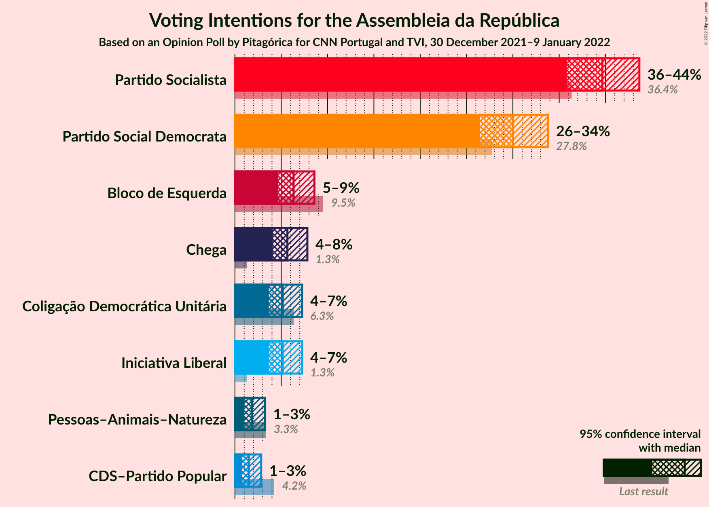

### Confidence Intervals

| Party | Last Result | Poll Result | 80% Confidence Interval | 90% Confidence Interval | 95% Confidence Interval | 99% Confidence Interval |
|:-----:|:-----------:|:-----------:|:-----------------------:|:-----------------------:|:-----------------------:|:-----------------------:|
| Partido Socialista | 36.4% | 39.7% | 37.1–42.3% |36.4–43.0% |35.8–43.7% |34.6–44.9% |
| Partido Social Democrata | 27.8% | 30.0% | 27.7–32.5% |27.0–33.2% |26.5–33.8% |25.4–35.0% |
| Bloco de Esquerda | 9.5% | 6.3% | 5.2–7.8% |4.9–8.2% |4.6–8.6% |4.2–9.3% |
| Chega | 1.3% | 5.7% | 4.6–7.1% |4.3–7.5% |4.1–7.8% |3.6–8.6% |
| Coligação Democrática Unitária | 6.3% | 5.2% | 4.2–6.5% |3.9–6.9% |3.7–7.3% |3.2–8.0% |
| Iniciativa Liberal | 1.3% | 5.2% | 4.2–6.5% |3.9–6.9% |3.7–7.3% |3.2–8.0% |
| Pessoas–Animais–Natureza | 3.3% | 1.8% | 1.3–2.8% |1.1–3.0% |1.0–3.3% |0.8–3.8% |
| CDS–Partido Popular | 4.2% | 1.5% | 1.0–2.4% |0.9–2.6% |0.8–2.8% |0.6–3.3% |

*Note:* The poll result column reflects the actual value used in the calculations. Published results may vary slightly, and in addition be rounded to fewer digits.

## Seats

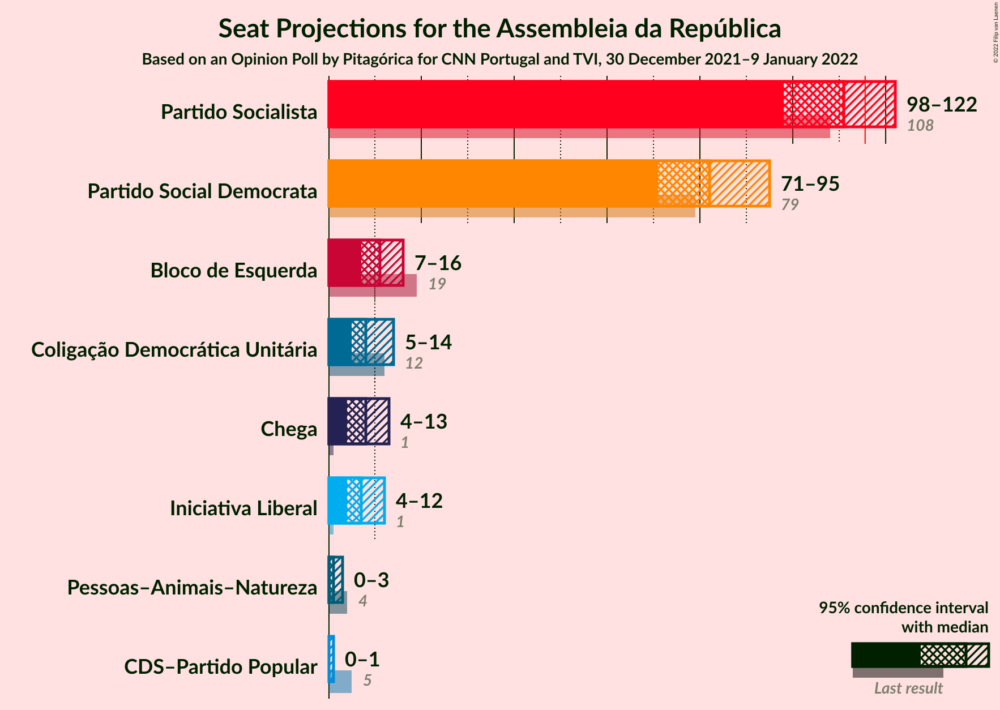

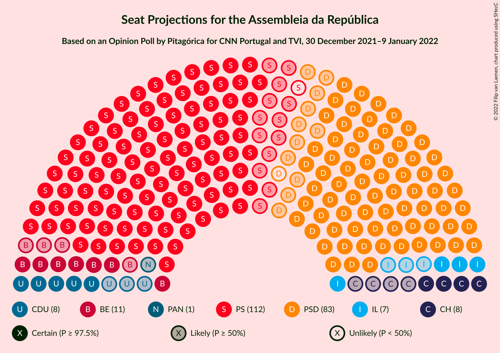

### Confidence Intervals

| Party | Last Result | Median | 80% Confidence Interval | 90% Confidence Interval | 95% Confidence Interval | 99% Confidence Interval |
|:-----:|:-----------:|:------:|:-----------------------:|:-----------------------:|:-----------------------:|:-----------------------:|
| <a href="#partido-socialista">Partido Socialista</a> | 108 | 111 | 103–119 |101–120 |98–122 |95–126 |
| <a href="#partido-social-democrata">Partido Social Democrata</a> | 79 | 82 | 75–88 |72–91 |71–95 |67–98 |
| <a href="#bloco-de-esquerda">Bloco de Esquerda</a> | 19 | 11 | 7–15 |7–15 |7–16 |5–18 |
| <a href="#chega">Chega</a> | 1 | 8 | 5–11 |4–11 |4–13 |3–14 |
| <a href="#coligação-democrática-unitária">Coligação Democrática Unitária</a> | 12 | 8 | 5–12 |5–13 |5–14 |4–15 |
| <a href="#iniciativa-liberal">Iniciativa Liberal</a> | 1 | 7 | 6–12 |5–12 |4–12 |4–14 |
| <a href="#pessoas–animais–natureza">Pessoas–Animais–Natureza</a> | 4 | 1 | 0–2 |0–2 |0–3 |0–4 |
| <a href="#cds–partido-popular">CDS–Partido Popular</a> | 5 | 0 | 0–1 |0–1 |0–1 |0–2 |

### Partido Socialista

*For a full overview of the results for this party, see the [Partido Socialista](party-partidosocialista.html) page.*

| Number of Seats | Probability | Accumulated | Special Marks |
|:---------------:|:-----------:|:-----------:|:-------------:|
| 90 | 0% | 100% |  |
| 91 | 0% | 99.9% |  |
| 92 | 0.1% | 99.9% |  |
| 93 | 0.1% | 99.8% |  |
| 94 | 0.2% | 99.7% |  |
| 95 | 0.5% | 99.5% |  |
| 96 | 0.3% | 99.0% |  |
| 97 | 0.7% | 98.7% |  |
| 98 | 0.5% | 98% |  |
| 99 | 1.0% | 97% |  |
| 100 | 1.4% | 96% |  |
| 101 | 2% | 95% |  |
| 102 | 2% | 93% |  |
| 103 | 2% | 92% |  |
| 104 | 2% | 90% |  |
| 105 | 3% | 88% |  |
| 106 | 5% | 85% |  |
| 107 | 8% | 80% |  |
| 108 | 6% | 73% | Last Result |
| 109 | 7% | 66% |  |
| 110 | 5% | 59% |  |
| 111 | 4% | 54% | Median |
| 112 | 8% | 49% |  |
| 113 | 6% | 42% |  |
| 114 | 7% | 36% |  |
| 115 | 4% | 29% |  |
| 116 | 6% | 25% | Majority |
| 117 | 2% | 19% |  |
| 118 | 5% | 17% |  |
| 119 | 4% | 12% |  |
| 120 | 3% | 8% |  |
| 121 | 1.4% | 5% |  |
| 122 | 1.3% | 3% |  |
| 123 | 0.7% | 2% |  |
| 124 | 0.6% | 1.4% |  |
| 125 | 0.2% | 0.8% |  |
| 126 | 0.1% | 0.6% |  |
| 127 | 0.2% | 0.5% |  |
| 128 | 0.1% | 0.3% |  |
| 129 | 0.1% | 0.2% |  |
| 130 | 0% | 0.1% |  |
| 131 | 0% | 0.1% |  |
| 132 | 0% | 0.1% |  |
| 133 | 0% | 0% |  |

### Partido Social Democrata

*For a full overview of the results for this party, see the [Partido Social Democrata](party-partidosocialdemocrata.html) page.*

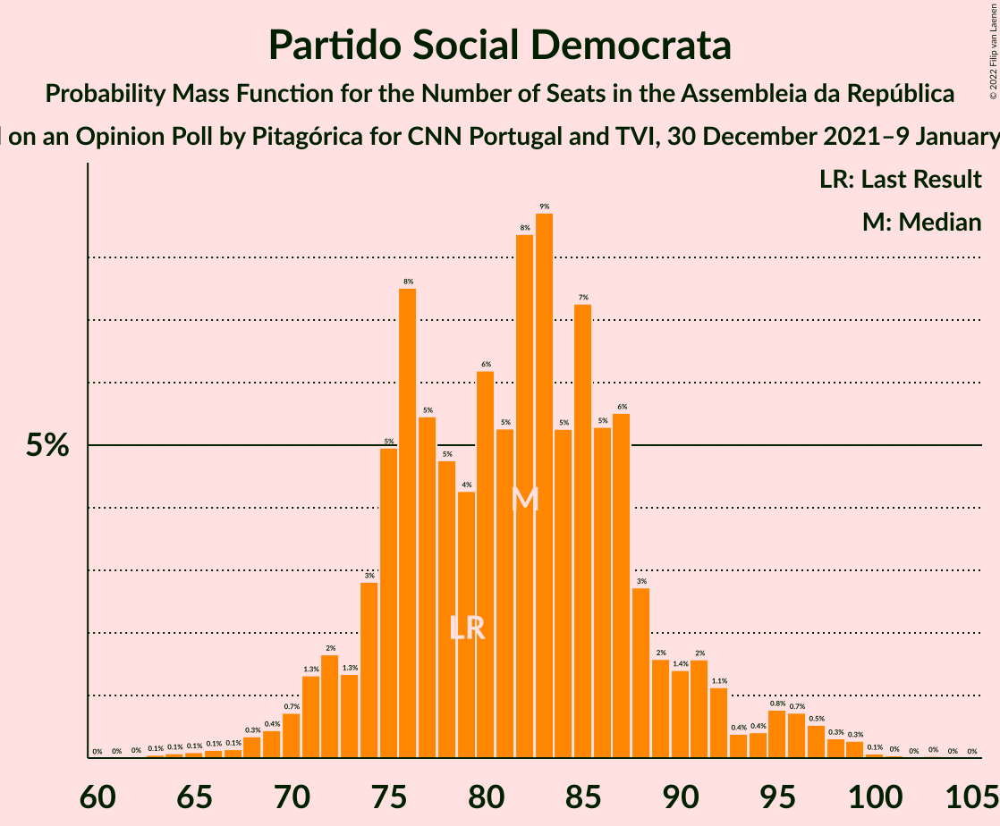

| Number of Seats | Probability | Accumulated | Special Marks |
|:---------------:|:-----------:|:-----------:|:-------------:|
| 63 | 0.1% | 100% |  |
| 64 | 0.1% | 99.9% |  |
| 65 | 0.1% | 99.8% |  |
| 66 | 0.1% | 99.7% |  |
| 67 | 0.1% | 99.6% |  |
| 68 | 0.3% | 99.5% |  |
| 69 | 0.4% | 99.1% |  |
| 70 | 0.7% | 98.7% |  |
| 71 | 1.3% | 98% |  |
| 72 | 2% | 97% |  |
| 73 | 1.3% | 95% |  |
| 74 | 3% | 94% |  |
| 75 | 5% | 91% |  |
| 76 | 8% | 86% |  |
| 77 | 5% | 78% |  |
| 78 | 5% | 73% |  |
| 79 | 4% | 68% | Last Result |
| 80 | 6% | 64% |  |
| 81 | 5% | 58% |  |
| 82 | 8% | 52% | Median |
| 83 | 9% | 44% |  |
| 84 | 5% | 35% |  |
| 85 | 7% | 30% |  |
| 86 | 5% | 23% |  |
| 87 | 6% | 18% |  |
| 88 | 3% | 12% |  |
| 89 | 2% | 9% |  |
| 90 | 1.4% | 8% |  |
| 91 | 2% | 6% |  |
| 92 | 1.1% | 5% |  |
| 93 | 0.4% | 4% |  |
| 94 | 0.4% | 3% |  |
| 95 | 0.8% | 3% |  |
| 96 | 0.7% | 2% |  |
| 97 | 0.5% | 1.3% |  |
| 98 | 0.3% | 0.8% |  |
| 99 | 0.3% | 0.4% |  |
| 100 | 0.1% | 0.2% |  |
| 101 | 0% | 0.1% |  |
| 102 | 0% | 0.1% |  |
| 103 | 0% | 0% |  |

### Bloco de Esquerda

*For a full overview of the results for this party, see the [Bloco de Esquerda](party-blocodeesquerda.html) page.*

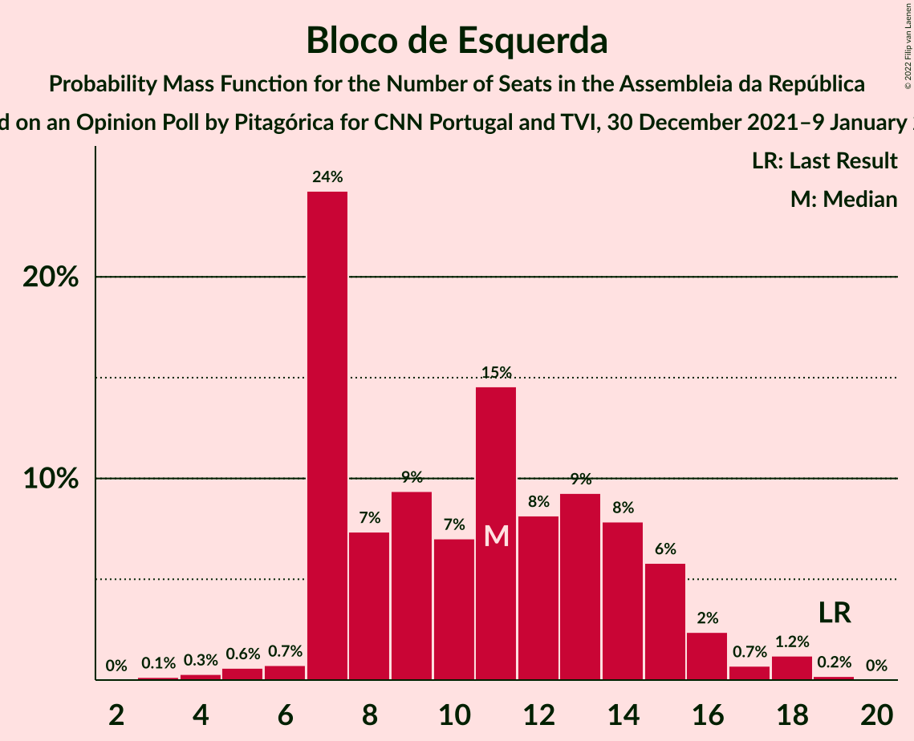

| Number of Seats | Probability | Accumulated | Special Marks |
|:---------------:|:-----------:|:-----------:|:-------------:|
| 3 | 0.1% | 100% |  |
| 4 | 0.3% | 99.8% |  |
| 5 | 0.6% | 99.5% |  |
| 6 | 0.7% | 98.9% |  |
| 7 | 24% | 98% |  |
| 8 | 7% | 74% |  |
| 9 | 9% | 67% |  |
| 10 | 7% | 57% |  |
| 11 | 15% | 50% | Median |
| 12 | 8% | 36% |  |
| 13 | 9% | 27% |  |
| 14 | 8% | 18% |  |
| 15 | 6% | 10% |  |
| 16 | 2% | 5% |  |
| 17 | 0.7% | 2% |  |
| 18 | 1.2% | 1.4% |  |
| 19 | 0.2% | 0.2% | Last Result |
| 20 | 0% | 0% |  |

### Chega

*For a full overview of the results for this party, see the [Chega](party-chega.html) page.*

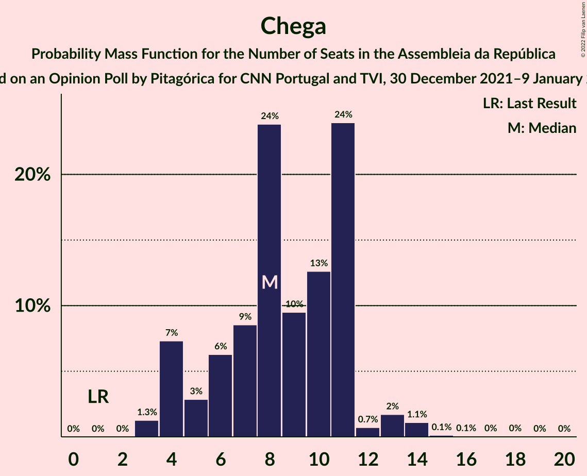

| Number of Seats | Probability | Accumulated | Special Marks |
|:---------------:|:-----------:|:-----------:|:-------------:|
| 1 | 0% | 100% | Last Result |
| 2 | 0% | 100% |  |
| 3 | 1.3% | 100% |  |
| 4 | 7% | 98.7% |  |
| 5 | 3% | 91% |  |
| 6 | 6% | 89% |  |
| 7 | 9% | 82% |  |
| 8 | 24% | 74% | Median |
| 9 | 10% | 50% |  |
| 10 | 13% | 40% |  |
| 11 | 24% | 28% |  |
| 12 | 0.7% | 4% |  |
| 13 | 2% | 3% |  |
| 14 | 1.1% | 1.4% |  |
| 15 | 0.1% | 0.3% |  |
| 16 | 0.1% | 0.2% |  |
| 17 | 0% | 0.1% |  |
| 18 | 0% | 0.1% |  |
| 19 | 0% | 0% |  |

### Coligação Democrática Unitária

*For a full overview of the results for this party, see the [Coligação Democrática Unitária](party-coligaçãodemocráticaunitária.html) page.*

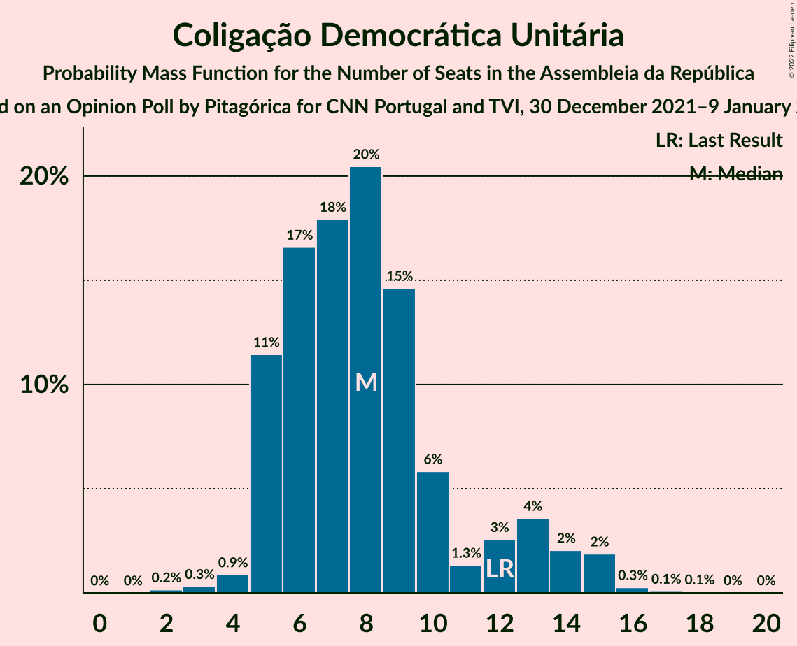

| Number of Seats | Probability | Accumulated | Special Marks |
|:---------------:|:-----------:|:-----------:|:-------------:|
| 2 | 0.2% | 100% |  |
| 3 | 0.3% | 99.8% |  |
| 4 | 0.9% | 99.5% |  |
| 5 | 11% | 98.7% |  |
| 6 | 17% | 87% |  |
| 7 | 18% | 71% |  |
| 8 | 20% | 53% | Median |
| 9 | 15% | 32% |  |
| 10 | 6% | 18% |  |
| 11 | 1.3% | 12% |  |
| 12 | 3% | 10% | Last Result |
| 13 | 4% | 8% |  |
| 14 | 2% | 4% |  |
| 15 | 2% | 2% |  |
| 16 | 0.3% | 0.4% |  |
| 17 | 0.1% | 0.1% |  |
| 18 | 0.1% | 0.1% |  |
| 19 | 0% | 0% |  |

### Iniciativa Liberal

*For a full overview of the results for this party, see the [Iniciativa Liberal](party-iniciativaliberal.html) page.*

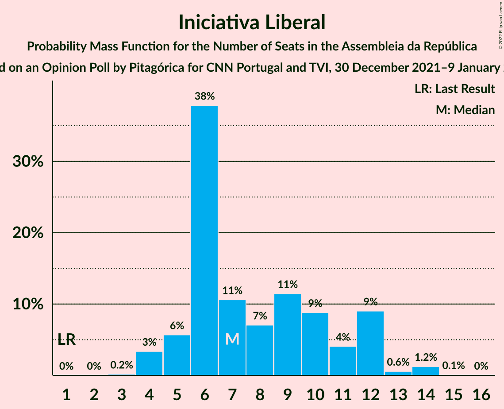

| Number of Seats | Probability | Accumulated | Special Marks |
|:---------------:|:-----------:|:-----------:|:-------------:|
| 1 | 0% | 100% | Last Result |
| 2 | 0% | 100% |  |
| 3 | 0.2% | 100% |  |
| 4 | 3% | 99.8% |  |
| 5 | 6% | 96% |  |
| 6 | 38% | 91% |  |
| 7 | 11% | 53% | Median |
| 8 | 7% | 42% |  |
| 9 | 11% | 35% |  |
| 10 | 9% | 24% |  |
| 11 | 4% | 15% |  |
| 12 | 9% | 11% |  |
| 13 | 0.6% | 2% |  |
| 14 | 1.2% | 1.4% |  |
| 15 | 0.1% | 0.1% |  |
| 16 | 0% | 0% |  |

### Pessoas–Animais–Natureza

*For a full overview of the results for this party, see the [Pessoas–Animais–Natureza](party-pessoas–animais–natureza.html) page.*

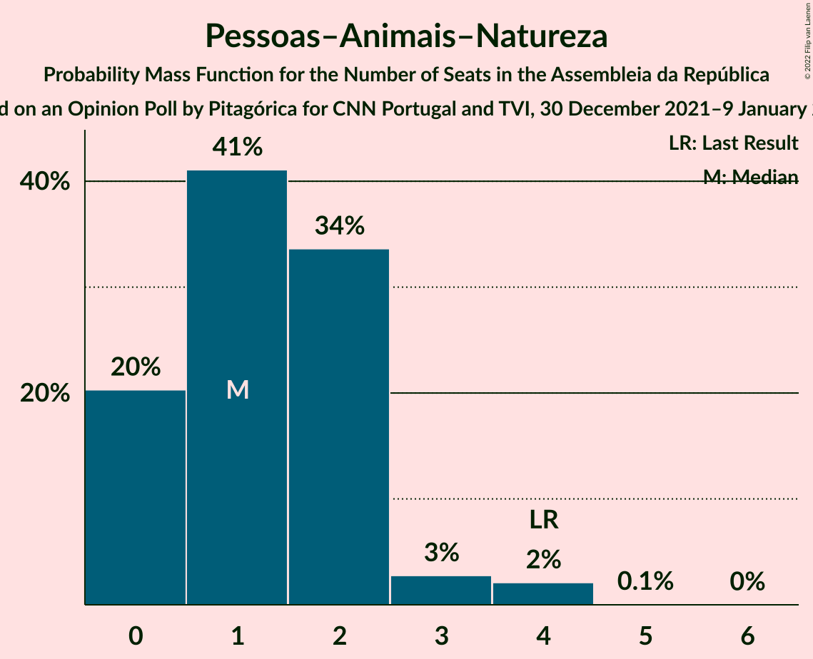

| Number of Seats | Probability | Accumulated | Special Marks |
|:---------------:|:-----------:|:-----------:|:-------------:|
| 0 | 20% | 100% |  |
| 1 | 41% | 80% | Median |
| 2 | 34% | 39% |  |
| 3 | 3% | 5% |  |
| 4 | 2% | 2% | Last Result |
| 5 | 0.1% | 0.1% |  |
| 6 | 0% | 0% |  |

### CDS–Partido Popular

*For a full overview of the results for this party, see the [CDS–Partido Popular](party-cds–partidopopular.html) page.*

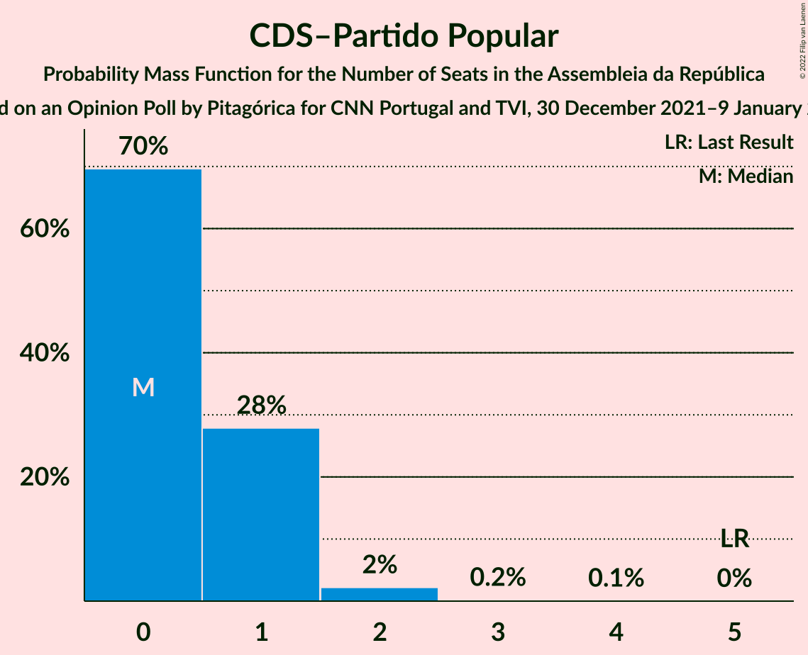

| Number of Seats | Probability | Accumulated | Special Marks |
|:---------------:|:-----------:|:-----------:|:-------------:|
| 0 | 70% | 100% | Median |
| 1 | 28% | 30% |  |
| 2 | 2% | 2% |  |
| 3 | 0.2% | 0.3% |  |
| 4 | 0.1% | 0.1% |  |
| 5 | 0% | 0% | Last Result |

## Coalitions

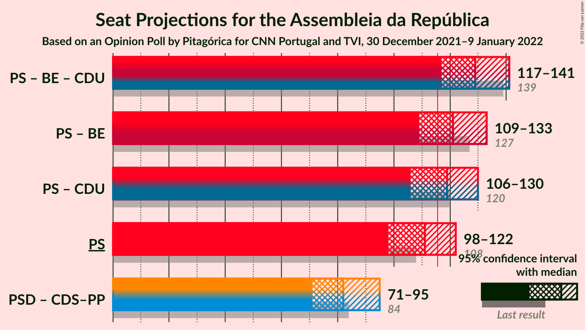

### Confidence Intervals

| Coalition | Last Result | Median | Majority? | 80% Confidence Interval | 90% Confidence Interval | 95% Confidence Interval | 99% Confidence Interval |
|:---------:|:-----------:|:------:|:---------:|:-----------------------:|:-----------------------:|:-----------------------:|:-----------------------:|
| Partido Socialista – Bloco de Esquerda – Coligação Democrática Unitária | 139 | 129 | 98% | 122–138 | 119–139 | 117–141 | 112–144 |
| Partido Socialista – Bloco de Esquerda | 127 | 121 | 85% | 114–130 | 111–131 | 109–133 | 105–136 |
| Partido Socialista – Coligação Democrática Unitária | 120 | 119 | 72% | 111–127 | 108–128 | 106–130 | 102–134 |
| Partido Socialista | 108 | 111 | 25% | 103–119 | 101–120 | 98–122 | 95–126 |
| Partido Social Democrata – CDS–Partido Popular | 84 | 82 | 0% | 75–89 | 73–92 | 71–95 | 68–99 |

### Partido Socialista – Bloco de Esquerda – Coligação Democrática Unitária

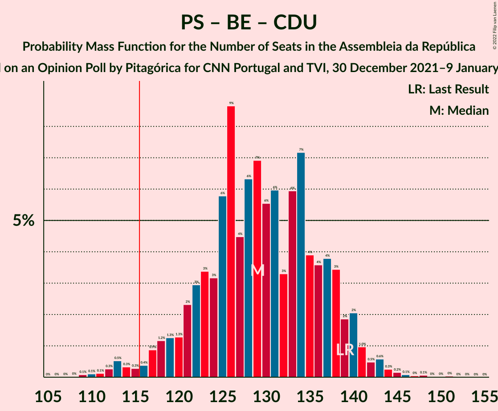

| Number of Seats | Probability | Accumulated | Special Marks |
|:---------------:|:-----------:|:-----------:|:-------------:|
| 109 | 0.1% | 100% |  |
| 110 | 0.1% | 99.9% |  |
| 111 | 0.1% | 99.8% |  |
| 112 | 0.3% | 99.6% |  |
| 113 | 0.5% | 99.4% |  |
| 114 | 0.3% | 98.8% |  |
| 115 | 0.3% | 98.5% |  |
| 116 | 0.4% | 98% | Majority |
| 117 | 0.9% | 98% |  |
| 118 | 1.2% | 97% |  |
| 119 | 1.3% | 96% |  |
| 120 | 1.3% | 95% |  |
| 121 | 2% | 93% |  |
| 122 | 3% | 91% |  |
| 123 | 3% | 88% |  |
| 124 | 3% | 85% |  |
| 125 | 6% | 81% |  |
| 126 | 9% | 76% |  |
| 127 | 4% | 67% |  |
| 128 | 6% | 63% |  |
| 129 | 7% | 56% |  |
| 130 | 6% | 49% | Median |
| 131 | 6% | 44% |  |
| 132 | 3% | 38% |  |
| 133 | 6% | 34% |  |
| 134 | 7% | 29% |  |
| 135 | 4% | 21% |  |
| 136 | 4% | 17% |  |
| 137 | 4% | 14% |  |
| 138 | 3% | 10% |  |
| 139 | 2% | 7% | Last Result |
| 140 | 2% | 5% |  |
| 141 | 1.0% | 3% |  |
| 142 | 0.5% | 2% |  |
| 143 | 0.6% | 1.3% |  |
| 144 | 0.3% | 0.7% |  |
| 145 | 0.2% | 0.4% |  |
| 146 | 0.1% | 0.3% |  |
| 147 | 0% | 0.2% |  |
| 148 | 0.1% | 0.2% |  |
| 149 | 0% | 0.1% |  |
| 150 | 0% | 0.1% |  |
| 151 | 0% | 0.1% |  |
| 152 | 0% | 0% |  |

### Partido Socialista – Bloco de Esquerda

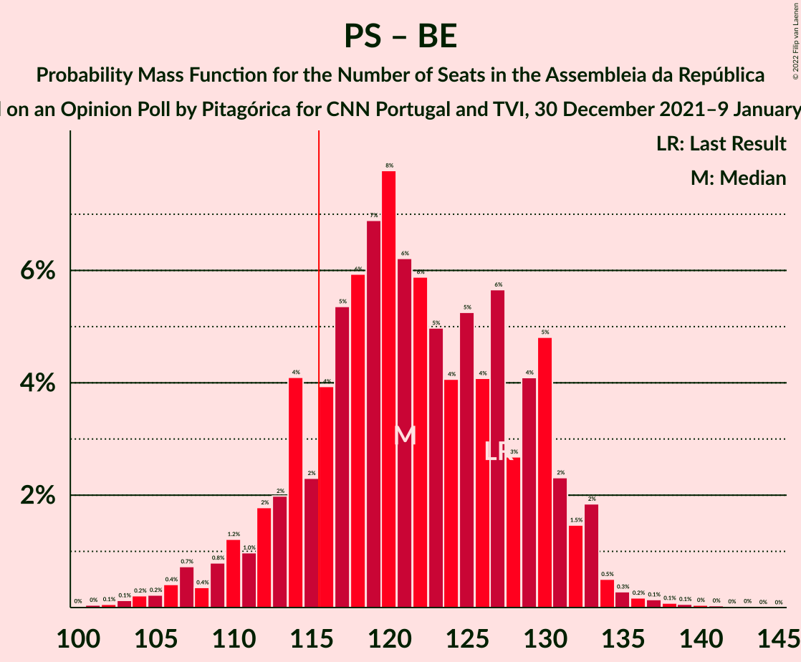

| Number of Seats | Probability | Accumulated | Special Marks |
|:---------------:|:-----------:|:-----------:|:-------------:|
| 100 | 0% | 100% |  |
| 101 | 0% | 99.9% |  |
| 102 | 0.1% | 99.9% |  |
| 103 | 0.1% | 99.8% |  |
| 104 | 0.2% | 99.7% |  |
| 105 | 0.2% | 99.5% |  |
| 106 | 0.4% | 99.3% |  |
| 107 | 0.7% | 98.9% |  |
| 108 | 0.4% | 98% |  |
| 109 | 0.8% | 98% |  |
| 110 | 1.2% | 97% |  |
| 111 | 1.0% | 96% |  |
| 112 | 2% | 95% |  |
| 113 | 2% | 93% |  |
| 114 | 4% | 91% |  |
| 115 | 2% | 87% |  |
| 116 | 4% | 85% | Majority |
| 117 | 5% | 81% |  |
| 118 | 6% | 75% |  |
| 119 | 7% | 69% |  |
| 120 | 8% | 63% |  |
| 121 | 6% | 55% |  |
| 122 | 6% | 49% | Median |
| 123 | 5% | 43% |  |
| 124 | 4% | 38% |  |
| 125 | 5% | 34% |  |
| 126 | 4% | 28% |  |
| 127 | 6% | 24% | Last Result |
| 128 | 3% | 19% |  |
| 129 | 4% | 16% |  |
| 130 | 5% | 12% |  |
| 131 | 2% | 7% |  |
| 132 | 1.5% | 5% |  |
| 133 | 2% | 3% |  |
| 134 | 0.5% | 1.4% |  |
| 135 | 0.3% | 0.9% |  |
| 136 | 0.2% | 0.6% |  |
| 137 | 0.1% | 0.4% |  |
| 138 | 0.1% | 0.3% |  |
| 139 | 0.1% | 0.2% |  |
| 140 | 0% | 0.1% |  |
| 141 | 0% | 0.1% |  |
| 142 | 0% | 0.1% |  |
| 143 | 0% | 0% |  |

### Partido Socialista – Coligação Democrática Unitária

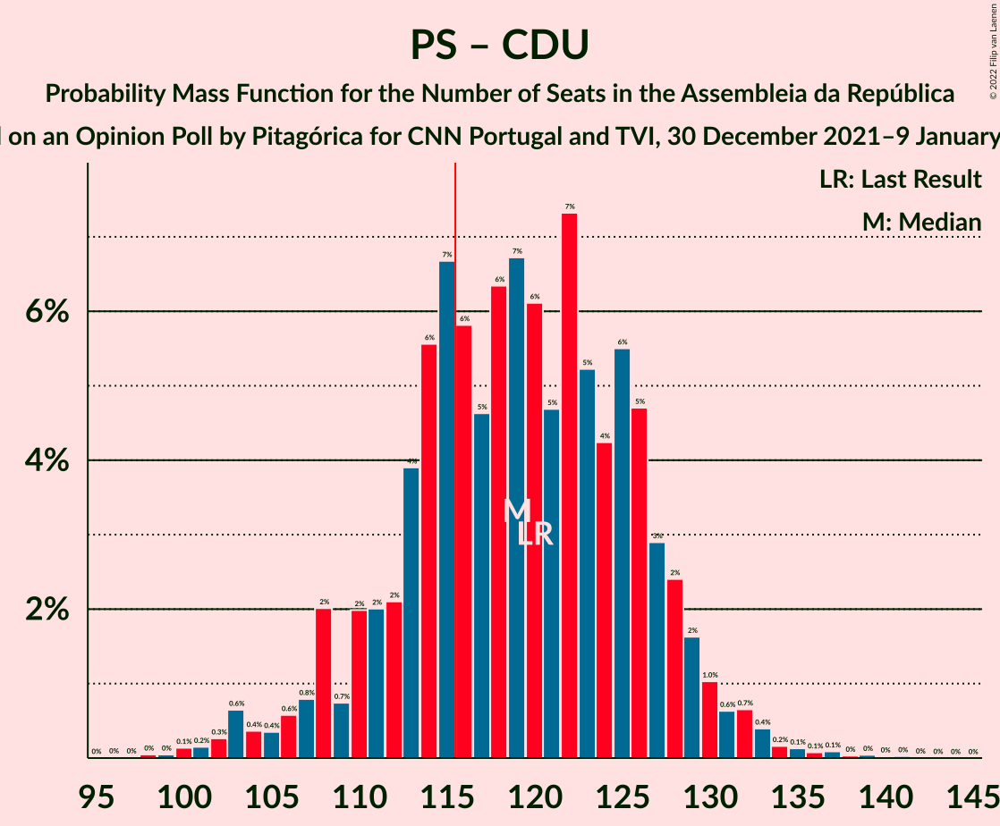

| Number of Seats | Probability | Accumulated | Special Marks |
|:---------------:|:-----------:|:-----------:|:-------------:|
| 98 | 0% | 100% |  |
| 99 | 0% | 99.9% |  |
| 100 | 0.1% | 99.9% |  |
| 101 | 0.2% | 99.7% |  |
| 102 | 0.3% | 99.6% |  |
| 103 | 0.6% | 99.3% |  |
| 104 | 0.4% | 98.7% |  |
| 105 | 0.4% | 98% |  |
| 106 | 0.6% | 98% |  |
| 107 | 0.8% | 97% |  |
| 108 | 2% | 97% |  |
| 109 | 0.7% | 95% |  |
| 110 | 2% | 94% |  |
| 111 | 2% | 92% |  |
| 112 | 2% | 90% |  |
| 113 | 4% | 88% |  |
| 114 | 6% | 84% |  |
| 115 | 7% | 78% |  |
| 116 | 6% | 72% | Majority |
| 117 | 5% | 66% |  |
| 118 | 6% | 61% |  |
| 119 | 7% | 55% | Median |
| 120 | 6% | 48% | Last Result |
| 121 | 5% | 42% |  |
| 122 | 7% | 37% |  |
| 123 | 5% | 30% |  |
| 124 | 4% | 25% |  |
| 125 | 6% | 20% |  |
| 126 | 5% | 15% |  |
| 127 | 3% | 10% |  |
| 128 | 2% | 7% |  |
| 129 | 2% | 5% |  |
| 130 | 1.0% | 3% |  |
| 131 | 0.6% | 2% |  |
| 132 | 0.7% | 2% |  |
| 133 | 0.4% | 1.0% |  |
| 134 | 0.2% | 0.6% |  |
| 135 | 0.1% | 0.4% |  |
| 136 | 0.1% | 0.3% |  |
| 137 | 0.1% | 0.2% |  |
| 138 | 0% | 0.1% |  |
| 139 | 0% | 0.1% |  |
| 140 | 0% | 0.1% |  |
| 141 | 0% | 0% |  |

### Partido Socialista

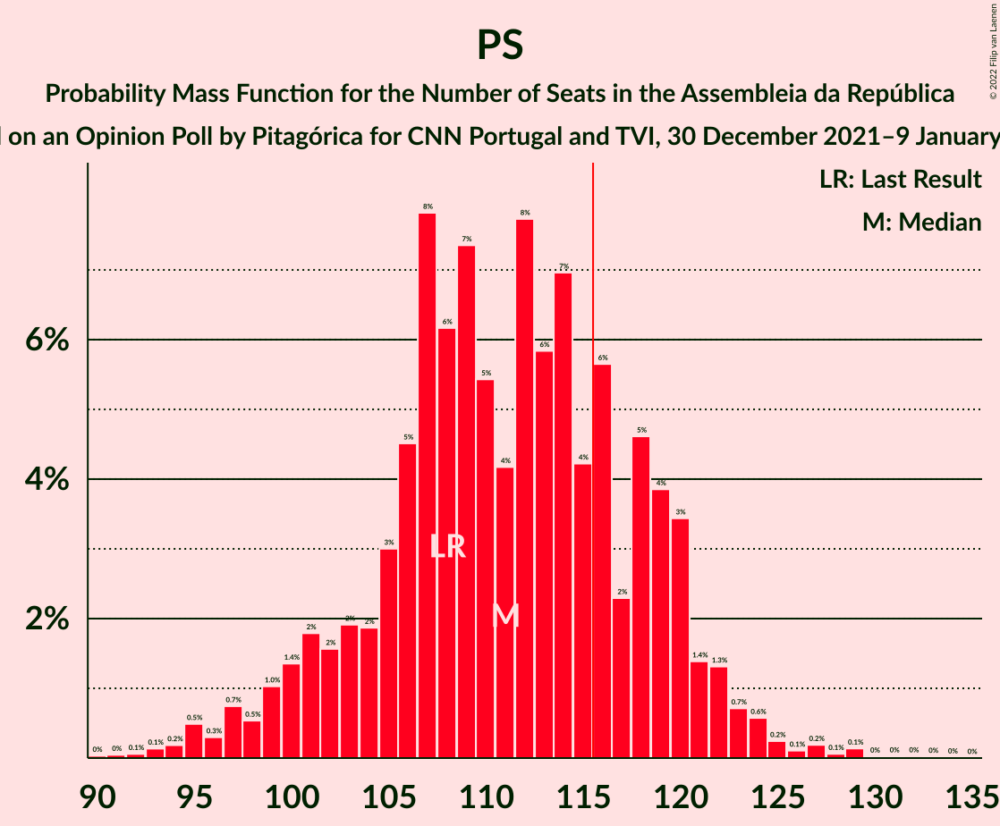

| Number of Seats | Probability | Accumulated | Special Marks |
|:---------------:|:-----------:|:-----------:|:-------------:|
| 90 | 0% | 100% |  |
| 91 | 0% | 99.9% |  |
| 92 | 0.1% | 99.9% |  |
| 93 | 0.1% | 99.8% |  |
| 94 | 0.2% | 99.7% |  |
| 95 | 0.5% | 99.5% |  |
| 96 | 0.3% | 99.0% |  |
| 97 | 0.7% | 98.7% |  |
| 98 | 0.5% | 98% |  |
| 99 | 1.0% | 97% |  |
| 100 | 1.4% | 96% |  |
| 101 | 2% | 95% |  |
| 102 | 2% | 93% |  |
| 103 | 2% | 92% |  |
| 104 | 2% | 90% |  |
| 105 | 3% | 88% |  |
| 106 | 5% | 85% |  |
| 107 | 8% | 80% |  |
| 108 | 6% | 73% | Last Result |
| 109 | 7% | 66% |  |
| 110 | 5% | 59% |  |
| 111 | 4% | 54% | Median |
| 112 | 8% | 49% |  |
| 113 | 6% | 42% |  |
| 114 | 7% | 36% |  |
| 115 | 4% | 29% |  |
| 116 | 6% | 25% | Majority |
| 117 | 2% | 19% |  |
| 118 | 5% | 17% |  |
| 119 | 4% | 12% |  |
| 120 | 3% | 8% |  |
| 121 | 1.4% | 5% |  |
| 122 | 1.3% | 3% |  |
| 123 | 0.7% | 2% |  |
| 124 | 0.6% | 1.4% |  |
| 125 | 0.2% | 0.8% |  |
| 126 | 0.1% | 0.6% |  |
| 127 | 0.2% | 0.5% |  |
| 128 | 0.1% | 0.3% |  |
| 129 | 0.1% | 0.2% |  |
| 130 | 0% | 0.1% |  |
| 131 | 0% | 0.1% |  |
| 132 | 0% | 0.1% |  |
| 133 | 0% | 0% |  |

### Partido Social Democrata – CDS–Partido Popular

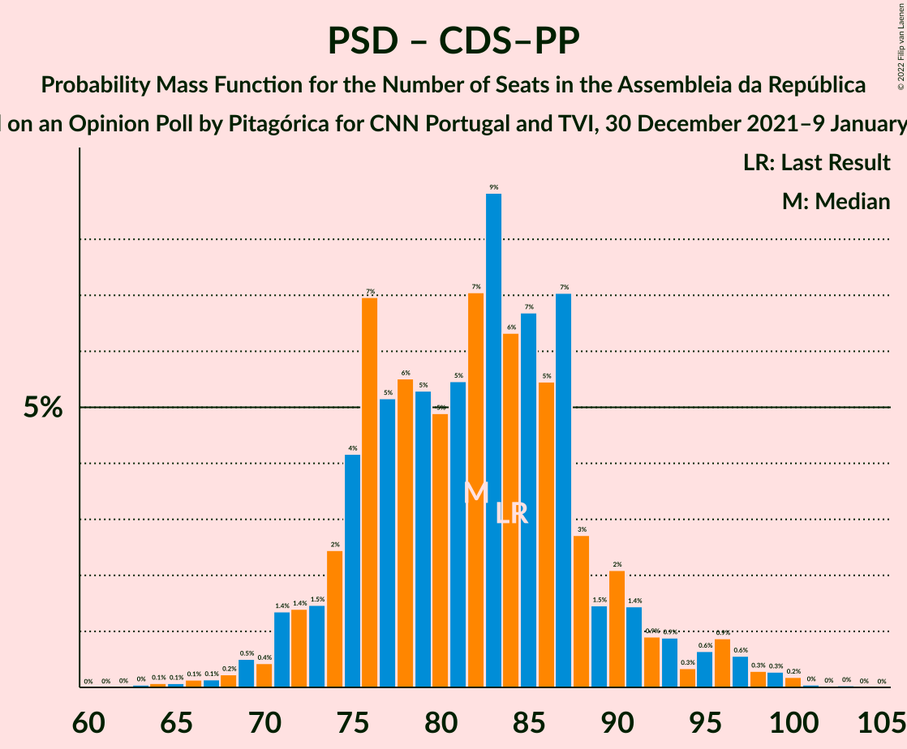

| Number of Seats | Probability | Accumulated | Special Marks |
|:---------------:|:-----------:|:-----------:|:-------------:|
| 63 | 0% | 100% |  |
| 64 | 0.1% | 99.9% |  |
| 65 | 0.1% | 99.9% |  |
| 66 | 0.1% | 99.8% |  |
| 67 | 0.1% | 99.6% |  |
| 68 | 0.2% | 99.5% |  |
| 69 | 0.5% | 99.3% |  |
| 70 | 0.4% | 98.8% |  |
| 71 | 1.4% | 98% |  |
| 72 | 1.4% | 97% |  |
| 73 | 1.5% | 96% |  |
| 74 | 2% | 94% |  |
| 75 | 4% | 92% |  |
| 76 | 7% | 87% |  |
| 77 | 5% | 81% |  |
| 78 | 6% | 75% |  |
| 79 | 5% | 70% |  |
| 80 | 5% | 65% |  |
| 81 | 5% | 60% |  |
| 82 | 7% | 54% | Median |
| 83 | 9% | 47% |  |
| 84 | 6% | 38% | Last Result |
| 85 | 7% | 32% |  |
| 86 | 5% | 25% |  |
| 87 | 7% | 20% |  |
| 88 | 3% | 13% |  |
| 89 | 1.5% | 10% |  |
| 90 | 2% | 9% |  |
| 91 | 1.4% | 7% |  |
| 92 | 0.9% | 5% |  |
| 93 | 0.9% | 4% |  |
| 94 | 0.3% | 3% |  |
| 95 | 0.6% | 3% |  |
| 96 | 0.9% | 2% |  |
| 97 | 0.6% | 1.4% |  |
| 98 | 0.3% | 0.9% |  |
| 99 | 0.3% | 0.6% |  |
| 100 | 0.2% | 0.3% |  |
| 101 | 0% | 0.1% |  |
| 102 | 0% | 0.1% |  |
| 103 | 0% | 0.1% |  |
| 104 | 0% | 0% |  |

## Technical Information

### Opinion Poll

+ **Polling firm:** Pitagórica
+ **Commissioner(s):** CNN Portugal and TVI
+ **Fieldwork period:** 30 December 2021–9 January 2022

### Calculations

+ **Sample size:** 600
+ **Simulations done:** 1,048,576
+ **Error estimate:** 1.59%

