# Opinion Poll by CESOP–UCP for Público and RTP, 6–10 January 2022

<a href="#voting-intentions">Voting Intentions</a> | <a href="#seats">Seats</a> | <a href="#coalitions">Coalitions</a> | <a href="#technical-information">Technical Information</a>

## Voting Intentions

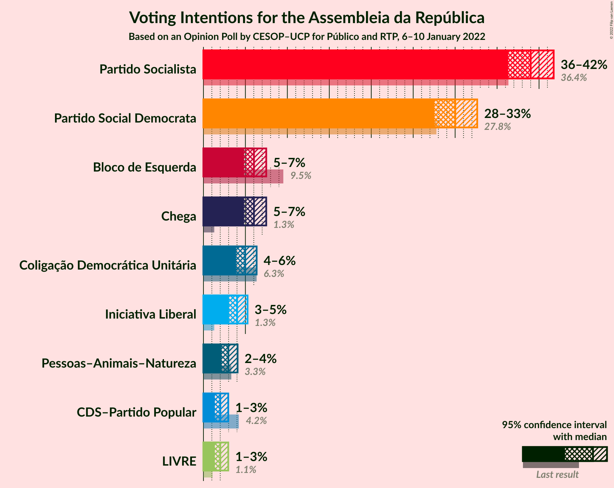

### Confidence Intervals

| Party | Last Result | Poll Result | 80% Confidence Interval | 90% Confidence Interval | 95% Confidence Interval | 99% Confidence Interval |
|:-----:|:-----------:|:-----------:|:-----------------------:|:-----------------------:|:-----------------------:|:-----------------------:|
| Partido Socialista | 36.4% | 39.0% | 37.3–40.8% |36.7–41.3% |36.3–41.7% |35.5–42.6% |
| Partido Social Democrata | 27.8% | 30.0% | 28.4–31.7% |27.9–32.2% |27.5–32.6% |26.8–33.5% |
| Bloco de Esquerda | 9.5% | 6.0% | 5.2–7.0% |5.0–7.3% |4.8–7.5% |4.5–8.0% |
| Chega | 1.3% | 6.0% | 5.2–7.0% |5.0–7.3% |4.8–7.5% |4.5–8.0% |
| Coligação Democrática Unitária | 6.3% | 5.0% | 4.3–5.9% |4.1–6.1% |3.9–6.3% |3.6–6.8% |
| Iniciativa Liberal | 1.3% | 4.0% | 3.4–4.8% |3.2–5.1% |3.0–5.3% |2.8–5.7% |
| Pessoas–Animais–Natureza | 3.3% | 3.0% | 2.4–3.7% |2.3–3.9% |2.2–4.1% |1.9–4.5% |
| CDS–Partido Popular | 4.2% | 2.0% | 1.6–2.6% |1.5–2.8% |1.4–3.0% |1.2–3.3% |
| LIVRE | 1.1% | 2.0% | 1.6–2.6% |1.5–2.8% |1.4–3.0% |1.2–3.3% |

*Note:* The poll result column reflects the actual value used in the calculations. Published results may vary slightly, and in addition be rounded to fewer digits.

## Seats

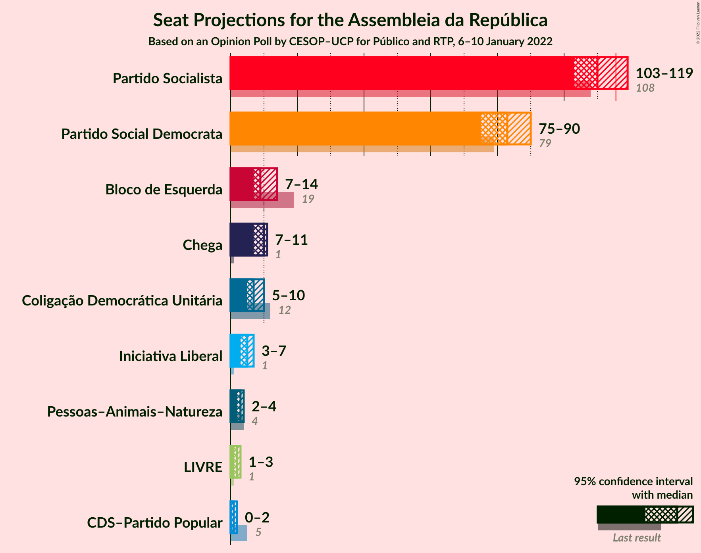

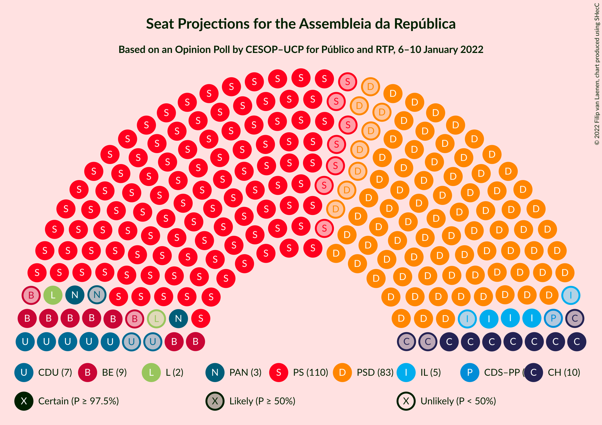

### Confidence Intervals

| Party | Last Result | Median | 80% Confidence Interval | 90% Confidence Interval | 95% Confidence Interval | 99% Confidence Interval |
|:-----:|:-----------:|:------:|:-----------------------:|:-----------------------:|:-----------------------:|:-----------------------:|
| <a href="#partido-socialista">Partido Socialista</a> | 108 | 110 | 106–116 |104–118 |103–119 |99–120 |
| <a href="#partido-social-democrata">Partido Social Democrata</a> | 79 | 83 | 77–87 |76–89 |75–90 |73–93 |
| <a href="#bloco-de-esquerda">Bloco de Esquerda</a> | 19 | 9 | 7–13 |7–13 |7–14 |7–15 |
| <a href="#chega">Chega</a> | 1 | 10 | 8–11 |7–11 |7–11 |4–14 |
| <a href="#coligação-democrática-unitária">Coligação Democrática Unitária</a> | 12 | 7 | 6–9 |5–9 |5–10 |5–13 |
| <a href="#iniciativa-liberal">Iniciativa Liberal</a> | 1 | 5 | 4–6 |4–6 |3–7 |3–9 |
| <a href="#pessoas–animais–natureza">Pessoas–Animais–Natureza</a> | 4 | 3 | 2–4 |2–4 |2–4 |1–5 |
| <a href="#cds–partido-popular">CDS–Partido Popular</a> | 5 | 1 | 0–1 |0–1 |0–2 |0–2 |
| <a href="#livre">LIVRE</a> | 1 | 2 | 1–3 |1–3 |1–3 |1–4 |

### Partido Socialista

*For a full overview of the results for this party, see the [Partido Socialista](party-partidosocialista.html) page.*

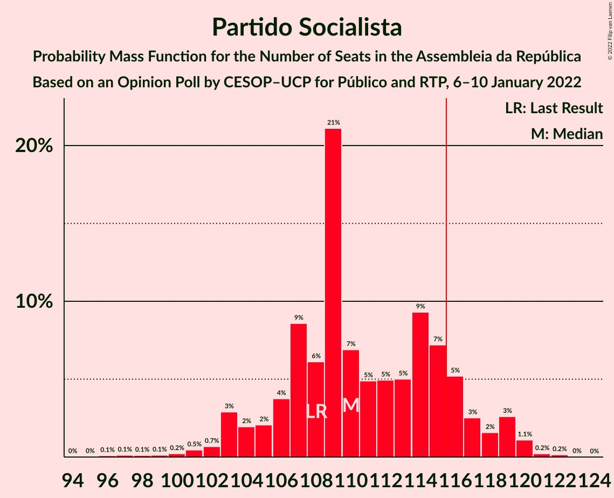

| Number of Seats | Probability | Accumulated | Special Marks |
|:---------------:|:-----------:|:-----------:|:-------------:|
| 95 | 0% | 100% |  |
| 96 | 0.1% | 99.9% |  |
| 97 | 0.1% | 99.8% |  |
| 98 | 0.1% | 99.7% |  |
| 99 | 0.1% | 99.6% |  |
| 100 | 0.2% | 99.5% |  |
| 101 | 0.5% | 99.3% |  |
| 102 | 0.7% | 98.8% |  |
| 103 | 3% | 98% |  |
| 104 | 2% | 95% |  |
| 105 | 2% | 93% |  |
| 106 | 4% | 91% |  |
| 107 | 9% | 87% |  |
| 108 | 6% | 79% | Last Result |
| 109 | 21% | 73% |  |
| 110 | 7% | 52% | Median |
| 111 | 5% | 45% |  |
| 112 | 5% | 40% |  |
| 113 | 5% | 35% |  |
| 114 | 9% | 30% |  |
| 115 | 7% | 21% |  |
| 116 | 5% | 13% | Majority |
| 117 | 3% | 8% |  |
| 118 | 2% | 6% |  |
| 119 | 3% | 4% |  |
| 120 | 1.1% | 2% |  |
| 121 | 0.2% | 0.4% |  |
| 122 | 0.2% | 0.2% |  |
| 123 | 0% | 0% |  |

### Partido Social Democrata

*For a full overview of the results for this party, see the [Partido Social Democrata](party-partidosocialdemocrata.html) page.*

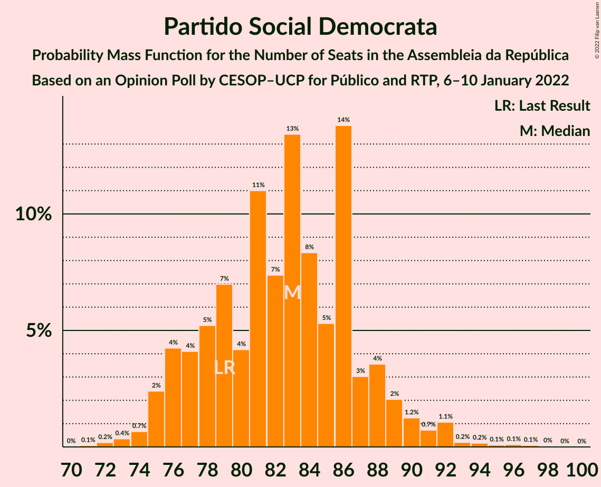

| Number of Seats | Probability | Accumulated | Special Marks |
|:---------------:|:-----------:|:-----------:|:-------------:|
| 71 | 0.1% | 100% |  |
| 72 | 0.2% | 99.9% |  |
| 73 | 0.4% | 99.7% |  |
| 74 | 0.7% | 99.4% |  |
| 75 | 2% | 98.7% |  |
| 76 | 4% | 96% |  |
| 77 | 4% | 92% |  |
| 78 | 5% | 88% |  |
| 79 | 7% | 83% | Last Result |
| 80 | 4% | 76% |  |
| 81 | 11% | 72% |  |
| 82 | 7% | 61% |  |
| 83 | 13% | 53% | Median |
| 84 | 8% | 40% |  |
| 85 | 5% | 31% |  |
| 86 | 14% | 26% |  |
| 87 | 3% | 12% |  |
| 88 | 4% | 9% |  |
| 89 | 2% | 6% |  |
| 90 | 1.2% | 4% |  |
| 91 | 0.7% | 2% |  |
| 92 | 1.1% | 2% |  |
| 93 | 0.2% | 0.7% |  |
| 94 | 0.2% | 0.5% |  |
| 95 | 0.1% | 0.3% |  |
| 96 | 0.1% | 0.2% |  |
| 97 | 0.1% | 0.1% |  |
| 98 | 0% | 0.1% |  |
| 99 | 0% | 0% |  |

### Bloco de Esquerda

*For a full overview of the results for this party, see the [Bloco de Esquerda](party-blocodeesquerda.html) page.*

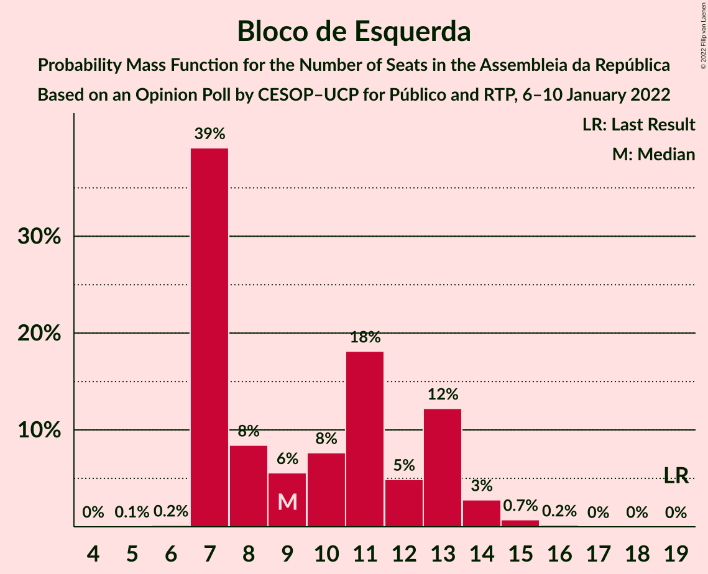

| Number of Seats | Probability | Accumulated | Special Marks |
|:---------------:|:-----------:|:-----------:|:-------------:|
| 4 | 0% | 100% |  |
| 5 | 0.1% | 99.9% |  |
| 6 | 0.2% | 99.9% |  |
| 7 | 39% | 99.7% |  |
| 8 | 8% | 61% |  |
| 9 | 6% | 52% | Median |
| 10 | 8% | 47% |  |
| 11 | 18% | 39% |  |
| 12 | 5% | 21% |  |
| 13 | 12% | 16% |  |
| 14 | 3% | 4% |  |
| 15 | 0.7% | 0.9% |  |
| 16 | 0.2% | 0.2% |  |
| 17 | 0% | 0% |  |
| 18 | 0% | 0% |  |
| 19 | 0% | 0% | Last Result |

### Chega

*For a full overview of the results for this party, see the [Chega](party-chega.html) page.*

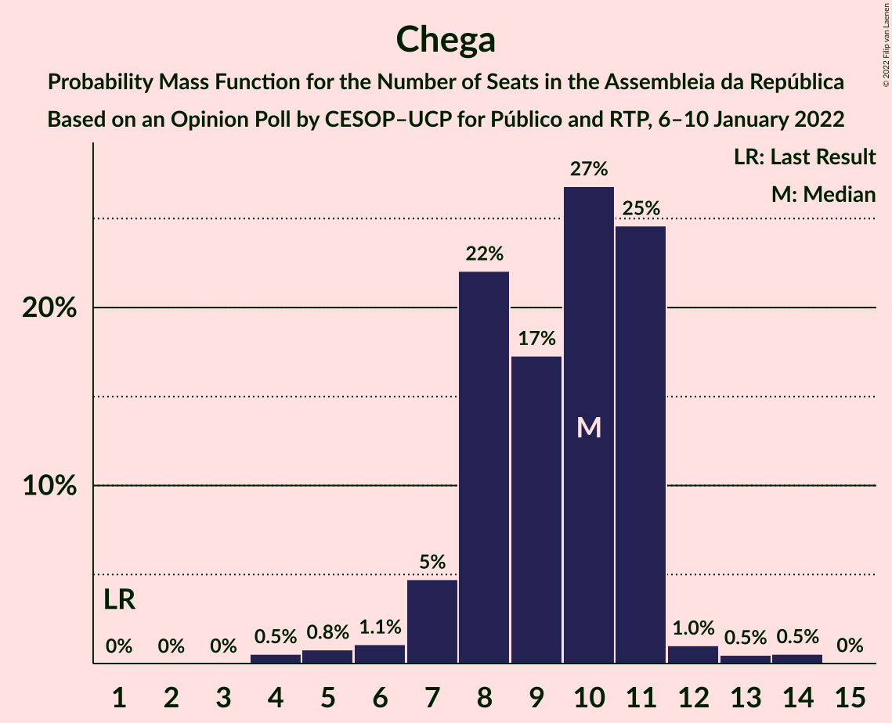

| Number of Seats | Probability | Accumulated | Special Marks |
|:---------------:|:-----------:|:-----------:|:-------------:|
| 1 | 0% | 100% | Last Result |
| 2 | 0% | 100% |  |
| 3 | 0% | 100% |  |
| 4 | 0.5% | 100% |  |
| 5 | 0.8% | 99.5% |  |
| 6 | 1.1% | 98.7% |  |
| 7 | 5% | 98% |  |
| 8 | 22% | 93% |  |
| 9 | 17% | 71% |  |
| 10 | 27% | 54% | Median |
| 11 | 25% | 27% |  |
| 12 | 1.0% | 2% |  |
| 13 | 0.5% | 1.1% |  |
| 14 | 0.5% | 0.6% |  |
| 15 | 0% | 0% |  |

### Coligação Democrática Unitária

*For a full overview of the results for this party, see the [Coligação Democrática Unitária](party-coligaçãodemocráticaunitária.html) page.*

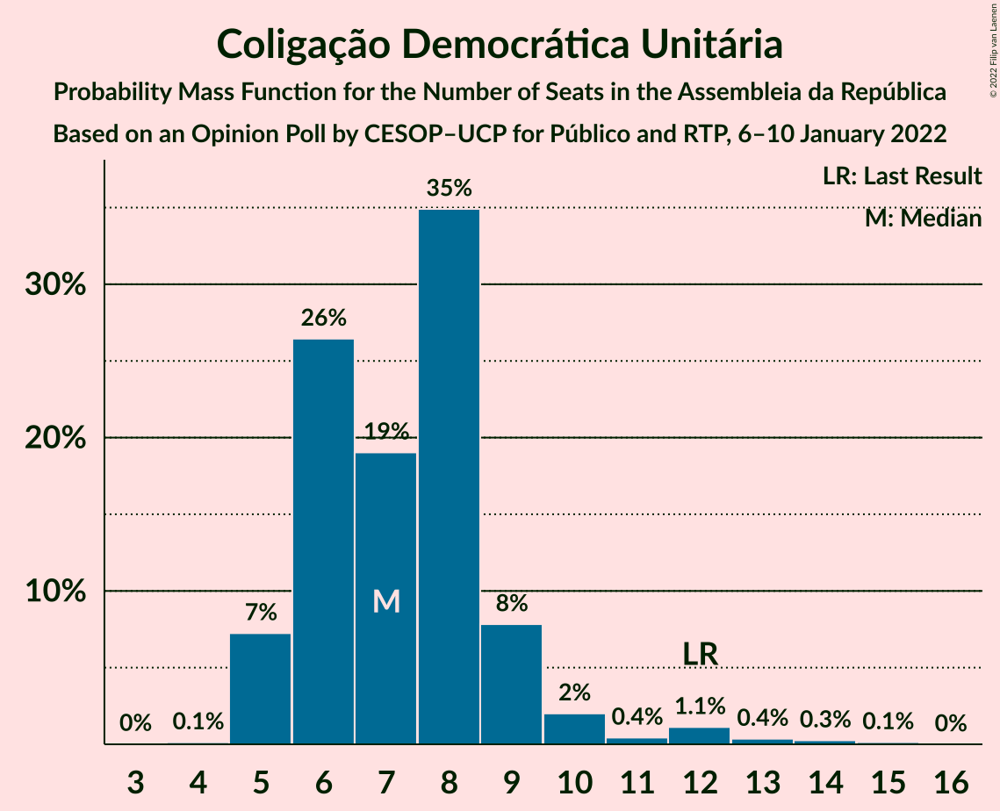

| Number of Seats | Probability | Accumulated | Special Marks |
|:---------------:|:-----------:|:-----------:|:-------------:|
| 4 | 0.1% | 100% |  |
| 5 | 7% | 99.8% |  |
| 6 | 26% | 93% |  |
| 7 | 19% | 66% | Median |
| 8 | 35% | 47% |  |
| 9 | 8% | 12% |  |
| 10 | 2% | 4% |  |
| 11 | 0.4% | 2% |  |
| 12 | 1.1% | 2% | Last Result |
| 13 | 0.4% | 0.8% |  |
| 14 | 0.3% | 0.4% |  |
| 15 | 0.1% | 0.1% |  |
| 16 | 0% | 0% |  |

### Iniciativa Liberal

*For a full overview of the results for this party, see the [Iniciativa Liberal](party-iniciativaliberal.html) page.*

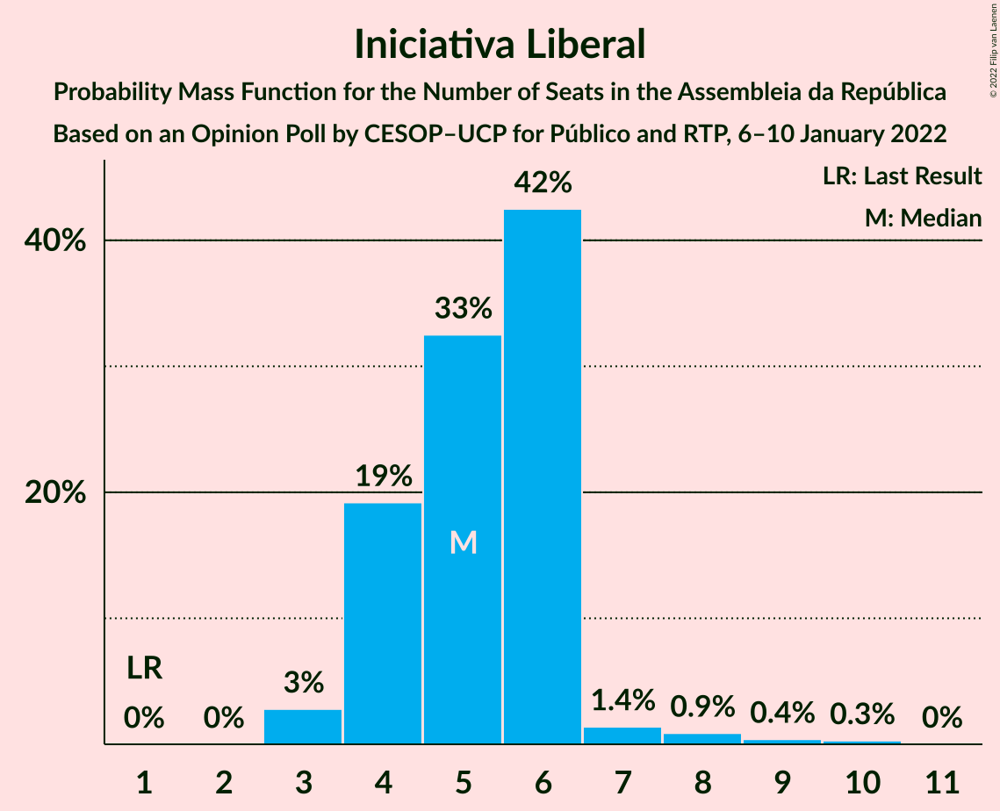

| Number of Seats | Probability | Accumulated | Special Marks |
|:---------------:|:-----------:|:-----------:|:-------------:|
| 1 | 0% | 100% | Last Result |
| 2 | 0% | 100% |  |
| 3 | 3% | 100% |  |
| 4 | 19% | 97% |  |
| 5 | 33% | 78% | Median |
| 6 | 42% | 46% |  |
| 7 | 1.4% | 3% |  |
| 8 | 0.9% | 2% |  |
| 9 | 0.4% | 0.7% |  |
| 10 | 0.3% | 0.3% |  |
| 11 | 0% | 0% |  |

### Pessoas–Animais–Natureza

*For a full overview of the results for this party, see the [Pessoas–Animais–Natureza](party-pessoas–animais–natureza.html) page.*

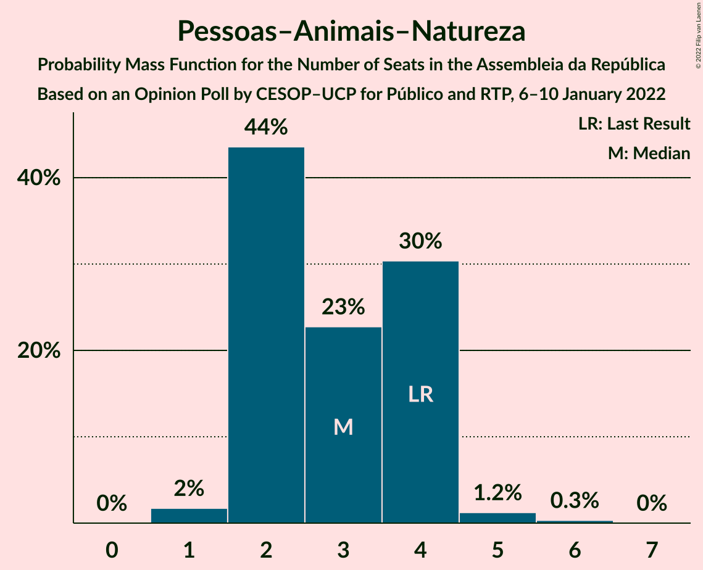

| Number of Seats | Probability | Accumulated | Special Marks |
|:---------------:|:-----------:|:-----------:|:-------------:|
| 1 | 2% | 100% |  |
| 2 | 44% | 98% |  |
| 3 | 23% | 55% | Median |
| 4 | 30% | 32% | Last Result |
| 5 | 1.2% | 2% |  |
| 6 | 0.3% | 0.3% |  |
| 7 | 0% | 0% |  |

### CDS–Partido Popular

*For a full overview of the results for this party, see the [CDS–Partido Popular](party-cds–partidopopular.html) page.*

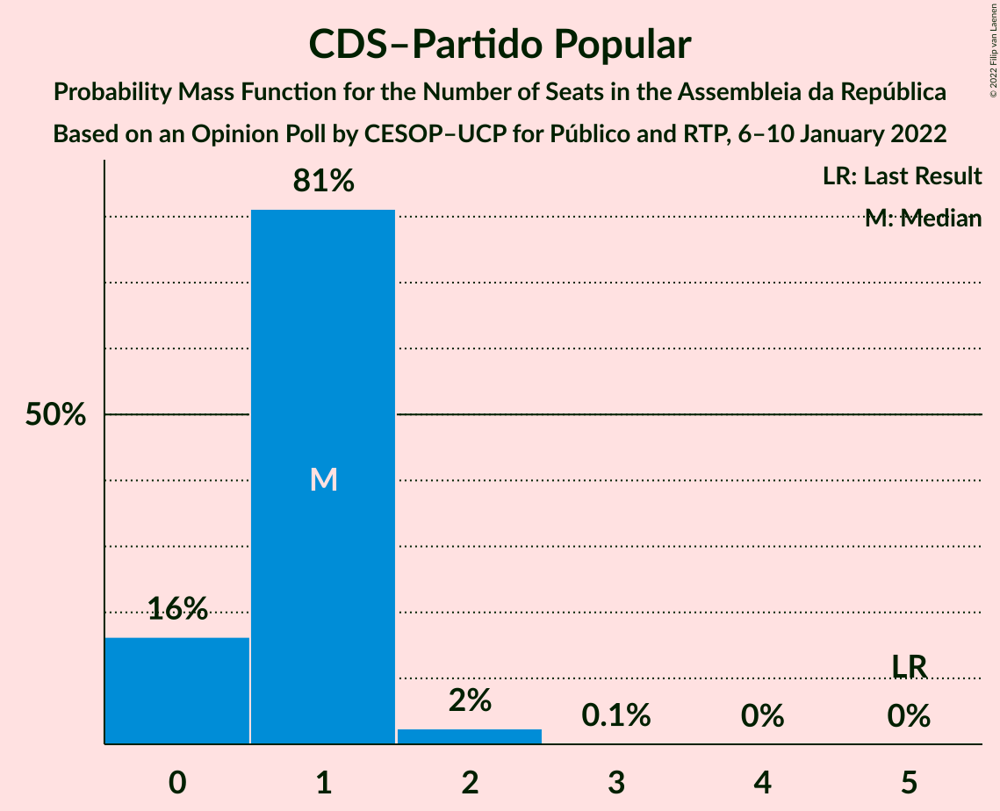

| Number of Seats | Probability | Accumulated | Special Marks |
|:---------------:|:-----------:|:-----------:|:-------------:|
| 0 | 16% | 100% |  |
| 1 | 81% | 84% | Median |
| 2 | 2% | 3% |  |
| 3 | 0.1% | 0.1% |  |
| 4 | 0% | 0% |  |
| 5 | 0% | 0% | Last Result |

### LIVRE

*For a full overview of the results for this party, see the [LIVRE](party-livre.html) page.*

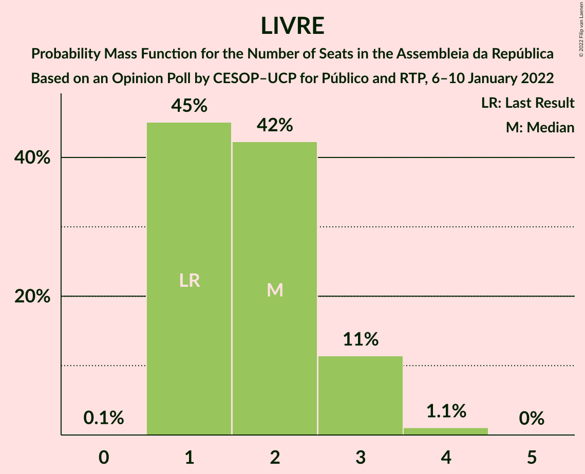

| Number of Seats | Probability | Accumulated | Special Marks |
|:---------------:|:-----------:|:-----------:|:-------------:|
| 0 | 0.1% | 100% |  |
| 1 | 45% | 99.9% | Last Result |
| 2 | 42% | 55% | Median |
| 3 | 11% | 13% |  |
| 4 | 1.1% | 1.1% |  |
| 5 | 0% | 0% |  |

## Coalitions

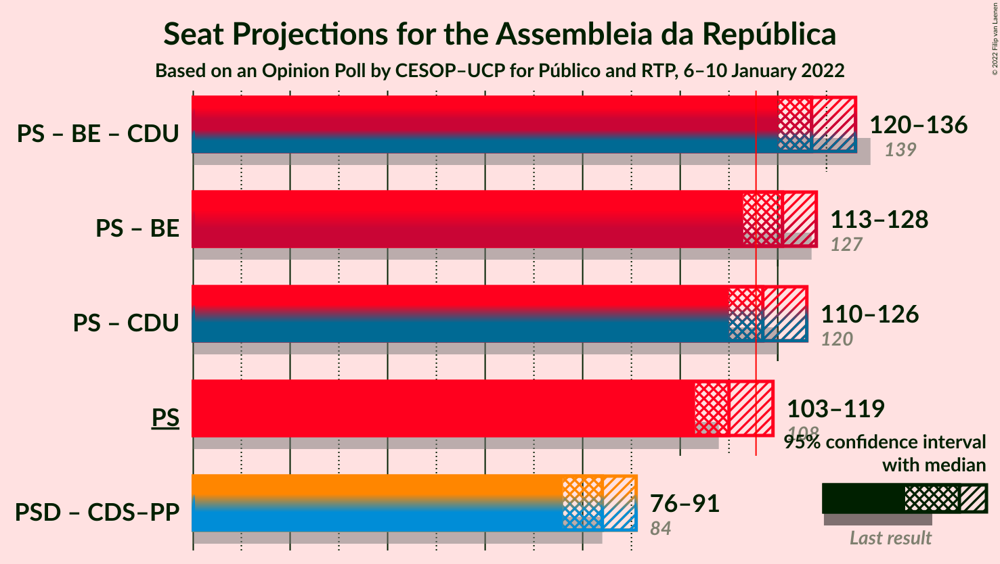

### Confidence Intervals

| Coalition | Last Result | Median | Majority? | 80% Confidence Interval | 90% Confidence Interval | 95% Confidence Interval | 99% Confidence Interval |
|:---------:|:-----------:|:------:|:---------:|:-----------------------:|:-----------------------:|:-----------------------:|:-----------------------:|
| Partido Socialista – Bloco de Esquerda – Coligação Democrática Unitária | 139 | 127 | 99.7% | 122–133 | 121–134 | 120–136 | 116–138 |
| Partido Socialista – Bloco de Esquerda | 127 | 121 | 87% | 115–126 | 114–127 | 113–128 | 109–131 |
| Partido Socialista – Coligação Democrática Unitária | 120 | 117 | 76% | 113–124 | 111–125 | 110–126 | 107–128 |
| Partido Socialista | 108 | 110 | 13% | 106–116 | 104–118 | 103–119 | 99–120 |
| Partido Social Democrata – CDS–Partido Popular | 84 | 84 | 0% | 78–88 | 77–90 | 76–91 | 74–94 |

### Partido Socialista – Bloco de Esquerda – Coligação Democrática Unitária

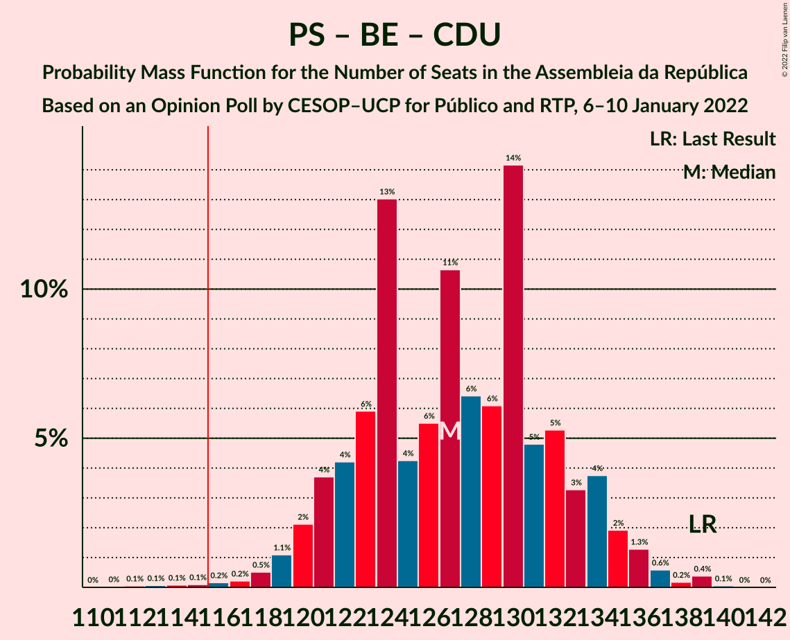

| Number of Seats | Probability | Accumulated | Special Marks |
|:---------------:|:-----------:|:-----------:|:-------------:|
| 112 | 0.1% | 100% |  |
| 113 | 0.1% | 99.9% |  |
| 114 | 0.1% | 99.8% |  |
| 115 | 0.1% | 99.8% |  |
| 116 | 0.2% | 99.7% | Majority |
| 117 | 0.2% | 99.5% |  |
| 118 | 0.5% | 99.3% |  |
| 119 | 1.1% | 98.8% |  |
| 120 | 2% | 98% |  |
| 121 | 4% | 96% |  |
| 122 | 4% | 92% |  |
| 123 | 6% | 88% |  |
| 124 | 13% | 82% |  |
| 125 | 4% | 69% |  |
| 126 | 6% | 64% | Median |
| 127 | 11% | 59% |  |
| 128 | 6% | 48% |  |
| 129 | 6% | 42% |  |
| 130 | 14% | 36% |  |
| 131 | 5% | 22% |  |
| 132 | 5% | 17% |  |
| 133 | 3% | 11% |  |
| 134 | 4% | 8% |  |
| 135 | 2% | 4% |  |
| 136 | 1.3% | 3% |  |
| 137 | 0.6% | 1.2% |  |
| 138 | 0.2% | 0.6% |  |
| 139 | 0.4% | 0.5% | Last Result |
| 140 | 0.1% | 0.1% |  |
| 141 | 0% | 0% |  |

### Partido Socialista – Bloco de Esquerda

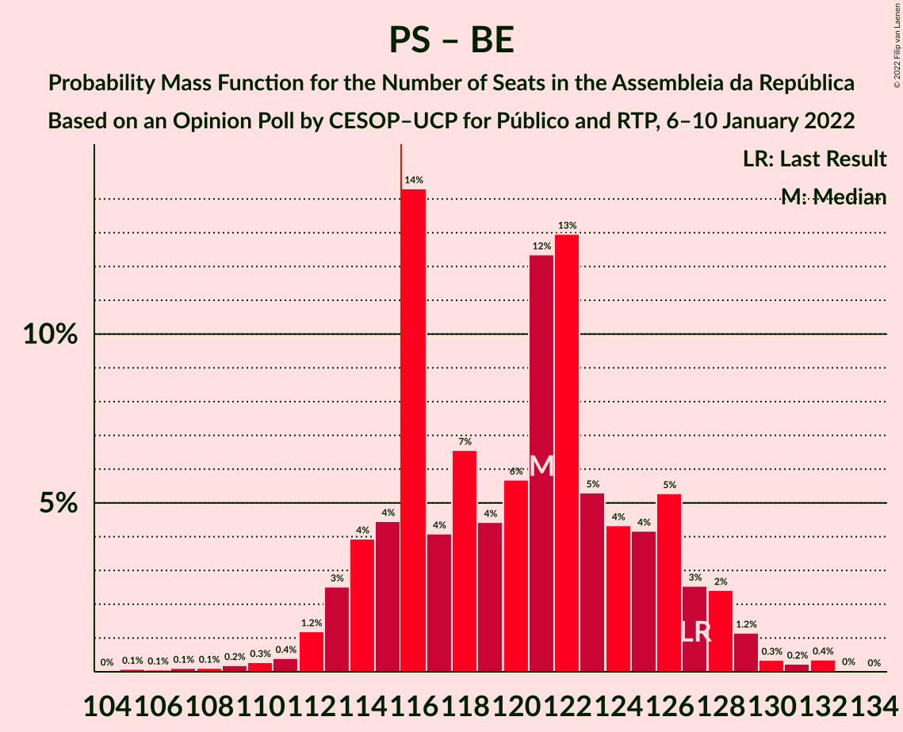

| Number of Seats | Probability | Accumulated | Special Marks |
|:---------------:|:-----------:|:-----------:|:-------------:|
| 105 | 0.1% | 100% |  |
| 106 | 0.1% | 99.9% |  |
| 107 | 0.1% | 99.8% |  |
| 108 | 0.1% | 99.7% |  |
| 109 | 0.2% | 99.6% |  |
| 110 | 0.3% | 99.4% |  |
| 111 | 0.4% | 99.1% |  |
| 112 | 1.2% | 98.7% |  |
| 113 | 3% | 98% |  |
| 114 | 4% | 95% |  |
| 115 | 4% | 91% |  |
| 116 | 14% | 87% | Majority |
| 117 | 4% | 72% |  |
| 118 | 7% | 68% |  |
| 119 | 4% | 62% | Median |
| 120 | 6% | 57% |  |
| 121 | 12% | 52% |  |
| 122 | 13% | 39% |  |
| 123 | 5% | 26% |  |
| 124 | 4% | 21% |  |
| 125 | 4% | 17% |  |
| 126 | 5% | 12% |  |
| 127 | 3% | 7% | Last Result |
| 128 | 2% | 5% |  |
| 129 | 1.2% | 2% |  |
| 130 | 0.3% | 1.0% |  |
| 131 | 0.2% | 0.7% |  |
| 132 | 0.4% | 0.4% |  |
| 133 | 0% | 0.1% |  |
| 134 | 0% | 0% |  |

### Partido Socialista – Coligação Democrática Unitária

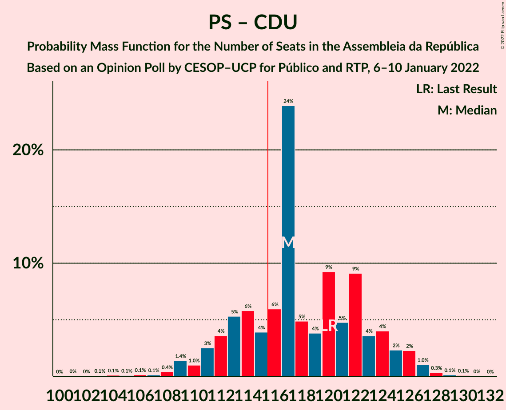

| Number of Seats | Probability | Accumulated | Special Marks |
|:---------------:|:-----------:|:-----------:|:-------------:|
| 101 | 0% | 100% |  |
| 102 | 0% | 99.9% |  |
| 103 | 0.1% | 99.9% |  |
| 104 | 0.1% | 99.9% |  |
| 105 | 0.1% | 99.8% |  |
| 106 | 0.1% | 99.7% |  |
| 107 | 0.1% | 99.5% |  |
| 108 | 0.4% | 99.4% |  |
| 109 | 1.4% | 99.0% |  |
| 110 | 1.0% | 98% |  |
| 111 | 3% | 97% |  |
| 112 | 4% | 94% |  |
| 113 | 5% | 91% |  |
| 114 | 6% | 85% |  |
| 115 | 4% | 79% |  |
| 116 | 6% | 76% | Majority |
| 117 | 24% | 70% | Median |
| 118 | 5% | 46% |  |
| 119 | 4% | 41% |  |
| 120 | 9% | 37% | Last Result |
| 121 | 5% | 28% |  |
| 122 | 9% | 23% |  |
| 123 | 4% | 14% |  |
| 124 | 4% | 10% |  |
| 125 | 2% | 6% |  |
| 126 | 2% | 4% |  |
| 127 | 1.0% | 2% |  |
| 128 | 0.3% | 0.6% |  |
| 129 | 0.1% | 0.3% |  |
| 130 | 0.1% | 0.1% |  |
| 131 | 0% | 0% |  |

### Partido Socialista

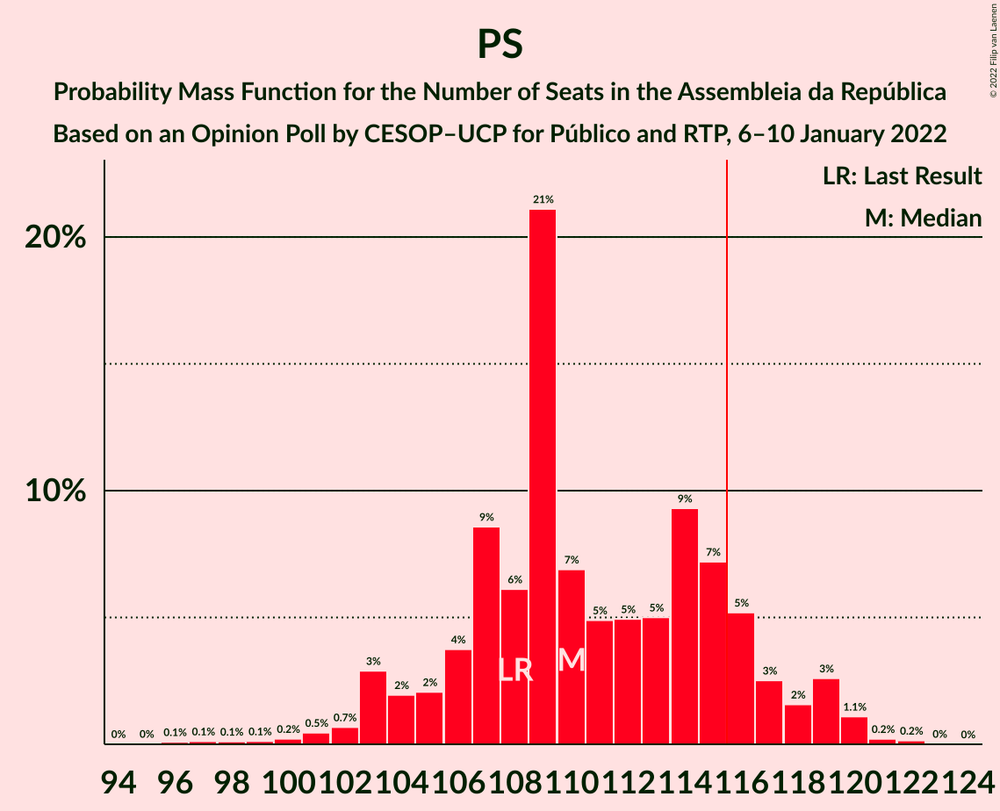

| Number of Seats | Probability | Accumulated | Special Marks |
|:---------------:|:-----------:|:-----------:|:-------------:|
| 95 | 0% | 100% |  |
| 96 | 0.1% | 99.9% |  |
| 97 | 0.1% | 99.8% |  |
| 98 | 0.1% | 99.7% |  |
| 99 | 0.1% | 99.6% |  |
| 100 | 0.2% | 99.5% |  |
| 101 | 0.5% | 99.3% |  |
| 102 | 0.7% | 98.8% |  |
| 103 | 3% | 98% |  |
| 104 | 2% | 95% |  |
| 105 | 2% | 93% |  |
| 106 | 4% | 91% |  |
| 107 | 9% | 87% |  |
| 108 | 6% | 79% | Last Result |
| 109 | 21% | 73% |  |
| 110 | 7% | 52% | Median |
| 111 | 5% | 45% |  |
| 112 | 5% | 40% |  |
| 113 | 5% | 35% |  |
| 114 | 9% | 30% |  |
| 115 | 7% | 21% |  |
| 116 | 5% | 13% | Majority |
| 117 | 3% | 8% |  |
| 118 | 2% | 6% |  |
| 119 | 3% | 4% |  |
| 120 | 1.1% | 2% |  |
| 121 | 0.2% | 0.4% |  |
| 122 | 0.2% | 0.2% |  |
| 123 | 0% | 0% |  |

### Partido Social Democrata – CDS–Partido Popular

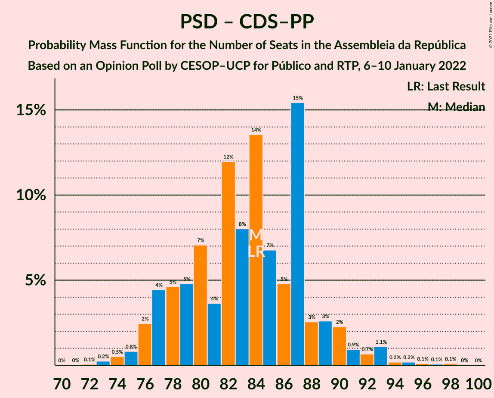

| Number of Seats | Probability | Accumulated | Special Marks |
|:---------------:|:-----------:|:-----------:|:-------------:|
| 72 | 0.1% | 100% |  |
| 73 | 0.2% | 99.9% |  |
| 74 | 0.5% | 99.7% |  |
| 75 | 0.8% | 99.1% |  |
| 76 | 2% | 98% |  |
| 77 | 4% | 96% |  |
| 78 | 5% | 91% |  |
| 79 | 5% | 87% |  |
| 80 | 7% | 82% |  |
| 81 | 4% | 75% |  |
| 82 | 12% | 71% |  |
| 83 | 8% | 59% |  |
| 84 | 14% | 51% | Last Result, Median |
| 85 | 7% | 38% |  |
| 86 | 5% | 31% |  |
| 87 | 15% | 26% |  |
| 88 | 3% | 11% |  |
| 89 | 3% | 8% |  |
| 90 | 2% | 6% |  |
| 91 | 0.9% | 3% |  |
| 92 | 0.7% | 2% |  |
| 93 | 1.1% | 2% |  |
| 94 | 0.2% | 0.7% |  |
| 95 | 0.2% | 0.5% |  |
| 96 | 0.1% | 0.3% |  |
| 97 | 0.1% | 0.2% |  |
| 98 | 0.1% | 0.1% |  |
| 99 | 0% | 0% |  |

## Technical Information

### Opinion Poll

+ **Polling firm:** CESOP–UCP
+ **Commissioner(s):** Público and RTP
+ **Fieldwork period:** 6–10 January 2022

### Calculations

+ **Sample size:** 1246
+ **Simulations done:** 1,048,576
+ **Error estimate:** 1.63%

