# Opinion Poll by Intercampus for CMTV, Correio da Manhã and Negócios, 4–10 January 2022

<a href="#voting-intentions">Voting Intentions</a> | <a href="#seats">Seats</a> | <a href="#coalitions">Coalitions</a> | <a href="#technical-information">Technical Information</a>

## Voting Intentions

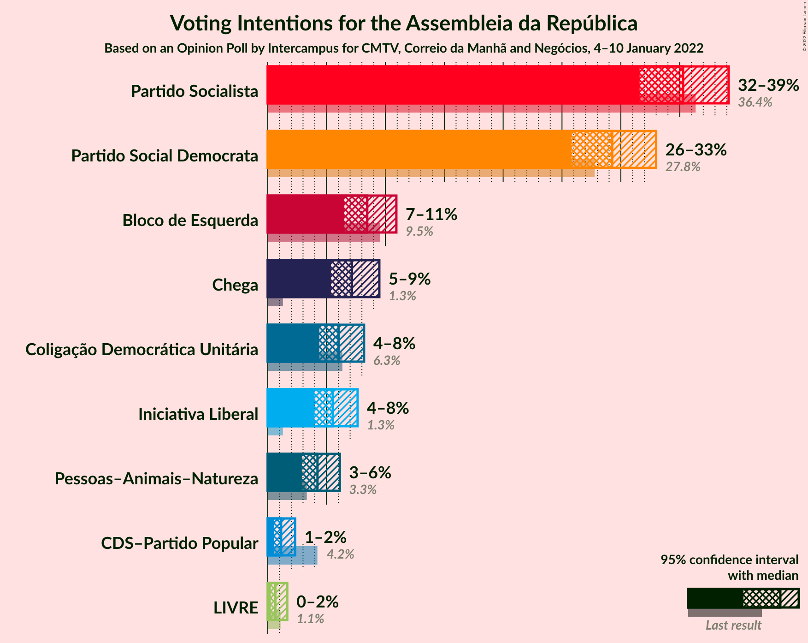

### Confidence Intervals

| Party | Last Result | Poll Result | 80% Confidence Interval | 90% Confidence Interval | 95% Confidence Interval | 99% Confidence Interval |
|:-----:|:-----------:|:-----------:|:-----------------------:|:-----------------------:|:-----------------------:|:-----------------------:|
| Partido Socialista | 36.4% | 35.3% | 32.9–37.8% |32.2–38.5% |31.6–39.2% |30.5–40.4% |
| Partido Social Democrata | 27.8% | 29.3% | 27.0–31.7% |26.4–32.4% |25.8–33.0% |24.7–34.2% |
| Bloco de Esquerda | 9.5% | 8.5% | 7.2–10.1% |6.8–10.5% |6.5–10.9% |5.9–11.8% |
| Chega | 1.3% | 7.2% | 6.0–8.7% |5.7–9.1% |5.4–9.5% |4.9–10.2% |
| Coligação Democrática Unitária | 6.3% | 6.0% | 4.9–7.4% |4.6–7.8% |4.4–8.2% |3.9–8.9% |
| Iniciativa Liberal | 1.3% | 5.5% | 4.5–6.9% |4.2–7.3% |4.0–7.6% |3.5–8.3% |
| Pessoas–Animais–Natureza | 3.3% | 4.2% | 3.4–5.5% |3.1–5.8% |2.9–6.1% |2.5–6.8% |
| CDS–Partido Popular | 4.2% | 1.1% | 0.7–1.9% |0.6–2.1% |0.5–2.3% |0.4–2.8% |
| LIVRE | 1.1% | 0.7% | 0.4–1.3% |0.3–1.5% |0.3–1.7% |0.2–2.0% |

*Note:* The poll result column reflects the actual value used in the calculations. Published results may vary slightly, and in addition be rounded to fewer digits.

## Seats

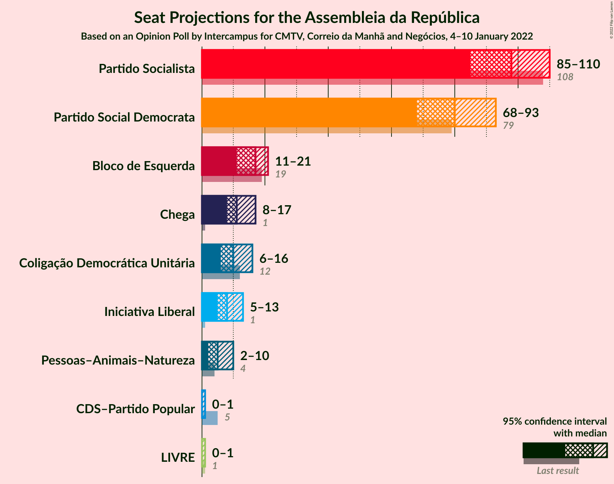

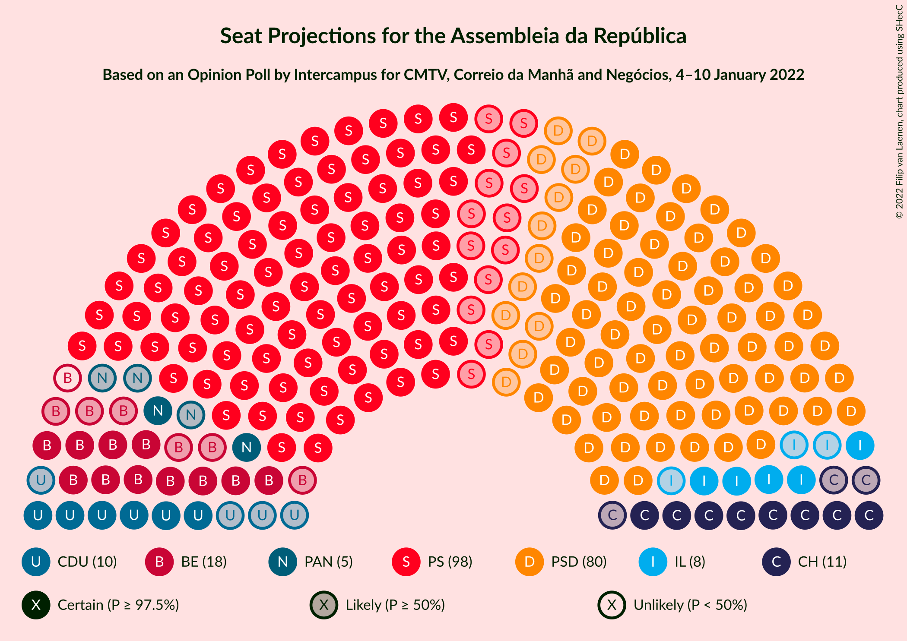

### Confidence Intervals

| Party | Last Result | Median | 80% Confidence Interval | 90% Confidence Interval | 95% Confidence Interval | 99% Confidence Interval |
|:-----:|:-----------:|:------:|:-----------------------:|:-----------------------:|:-----------------------:|:-----------------------:|
| <a href="#partido-socialista">Partido Socialista</a> | 108 | 98 | 89–106 |87–108 |85–110 |82–114 |
| <a href="#partido-social-democrata">Partido Social Democrata</a> | 79 | 80 | 72–90 |71–92 |68–93 |66–97 |
| <a href="#bloco-de-esquerda">Bloco de Esquerda</a> | 19 | 17 | 12–18 |11–20 |11–21 |8–24 |
| <a href="#chega">Chega</a> | 1 | 11 | 8–14 |8–14 |8–17 |6–20 |
| <a href="#coligação-democrática-unitária">Coligação Democrática Unitária</a> | 12 | 10 | 6–14 |6–15 |6–16 |5–18 |
| <a href="#iniciativa-liberal">Iniciativa Liberal</a> | 1 | 8 | 6–12 |6–12 |5–13 |4–14 |
| <a href="#pessoas–animais–natureza">Pessoas–Animais–Natureza</a> | 4 | 5 | 3–9 |3–9 |2–10 |2–11 |
| <a href="#cds–partido-popular">CDS–Partido Popular</a> | 5 | 0 | 0 |0–1 |0–1 |0–1 |
| <a href="#livre">LIVRE</a> | 1 | 0 | 0–1 |0–1 |0–1 |0–1 |

### Partido Socialista

*For a full overview of the results for this party, see the [Partido Socialista](party-partidosocialista.html) page.*

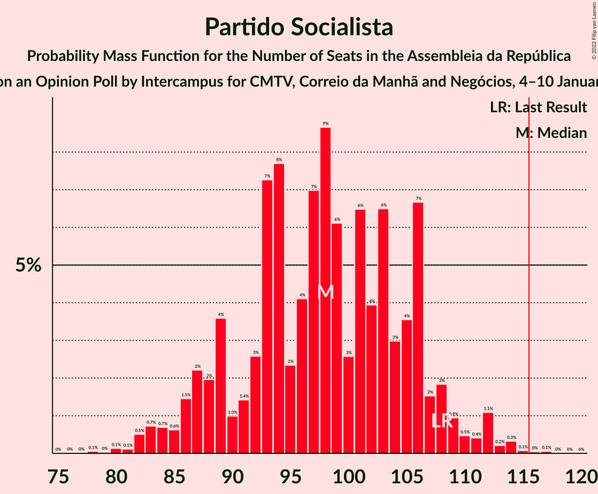

| Number of Seats | Probability | Accumulated | Special Marks |
|:---------------:|:-----------:|:-----------:|:-------------:|
| 78 | 0.1% | 100% |  |
| 79 | 0% | 99.9% |  |
| 80 | 0.1% | 99.9% |  |
| 81 | 0.1% | 99.7% |  |
| 82 | 0.5% | 99.6% |  |
| 83 | 0.7% | 99.1% |  |
| 84 | 0.7% | 98% |  |
| 85 | 0.6% | 98% |  |
| 86 | 1.5% | 97% |  |
| 87 | 2% | 96% |  |
| 88 | 2% | 93% |  |
| 89 | 4% | 91% |  |
| 90 | 1.0% | 88% |  |
| 91 | 1.4% | 87% |  |
| 92 | 3% | 85% |  |
| 93 | 7% | 83% |  |
| 94 | 8% | 76% |  |
| 95 | 2% | 68% |  |
| 96 | 4% | 66% |  |
| 97 | 7% | 61% |  |
| 98 | 9% | 54% | Median |
| 99 | 6% | 46% |  |
| 100 | 3% | 40% |  |
| 101 | 6% | 37% |  |
| 102 | 4% | 31% |  |
| 103 | 6% | 27% |  |
| 104 | 3% | 20% |  |
| 105 | 4% | 17% |  |
| 106 | 7% | 14% |  |
| 107 | 2% | 7% |  |
| 108 | 2% | 5% | Last Result |
| 109 | 0.9% | 4% |  |
| 110 | 0.5% | 3% |  |
| 111 | 0.4% | 2% |  |
| 112 | 1.1% | 2% |  |
| 113 | 0.2% | 0.7% |  |
| 114 | 0.3% | 0.5% |  |
| 115 | 0.1% | 0.2% |  |
| 116 | 0% | 0.1% | Majority |
| 117 | 0.1% | 0.1% |  |
| 118 | 0% | 0% |  |

### Partido Social Democrata

*For a full overview of the results for this party, see the [Partido Social Democrata](party-partidosocialdemocrata.html) page.*

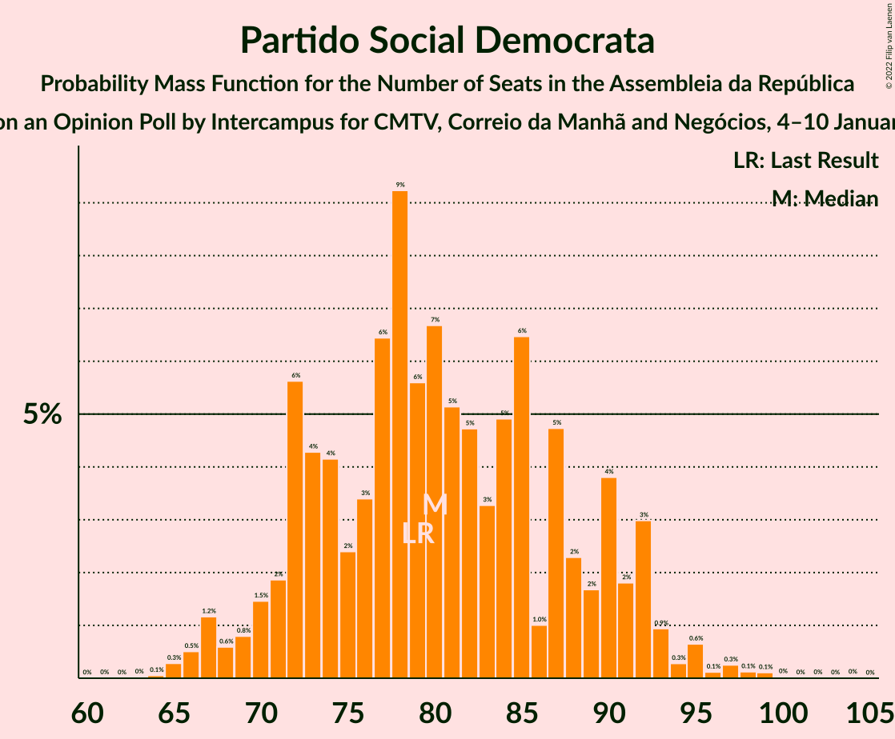

| Number of Seats | Probability | Accumulated | Special Marks |
|:---------------:|:-----------:|:-----------:|:-------------:|
| 63 | 0% | 100% |  |
| 64 | 0.1% | 99.9% |  |
| 65 | 0.3% | 99.9% |  |
| 66 | 0.5% | 99.6% |  |
| 67 | 1.2% | 99.1% |  |
| 68 | 0.6% | 98% |  |
| 69 | 0.8% | 97% |  |
| 70 | 1.5% | 97% |  |
| 71 | 2% | 95% |  |
| 72 | 6% | 93% |  |
| 73 | 4% | 88% |  |
| 74 | 4% | 83% |  |
| 75 | 2% | 79% |  |
| 76 | 3% | 77% |  |
| 77 | 6% | 73% |  |
| 78 | 9% | 67% |  |
| 79 | 6% | 58% | Last Result |
| 80 | 7% | 52% | Median |
| 81 | 5% | 45% |  |
| 82 | 5% | 40% |  |
| 83 | 3% | 36% |  |
| 84 | 5% | 32% |  |
| 85 | 6% | 27% |  |
| 86 | 1.0% | 21% |  |
| 87 | 5% | 20% |  |
| 88 | 2% | 15% |  |
| 89 | 2% | 13% |  |
| 90 | 4% | 11% |  |
| 91 | 2% | 7% |  |
| 92 | 3% | 6% |  |
| 93 | 0.9% | 3% |  |
| 94 | 0.3% | 2% |  |
| 95 | 0.6% | 1.3% |  |
| 96 | 0.1% | 0.7% |  |
| 97 | 0.3% | 0.6% |  |
| 98 | 0.1% | 0.3% |  |
| 99 | 0.1% | 0.2% |  |
| 100 | 0% | 0.1% |  |
| 101 | 0% | 0% |  |

### Bloco de Esquerda

*For a full overview of the results for this party, see the [Bloco de Esquerda](party-blocodeesquerda.html) page.*

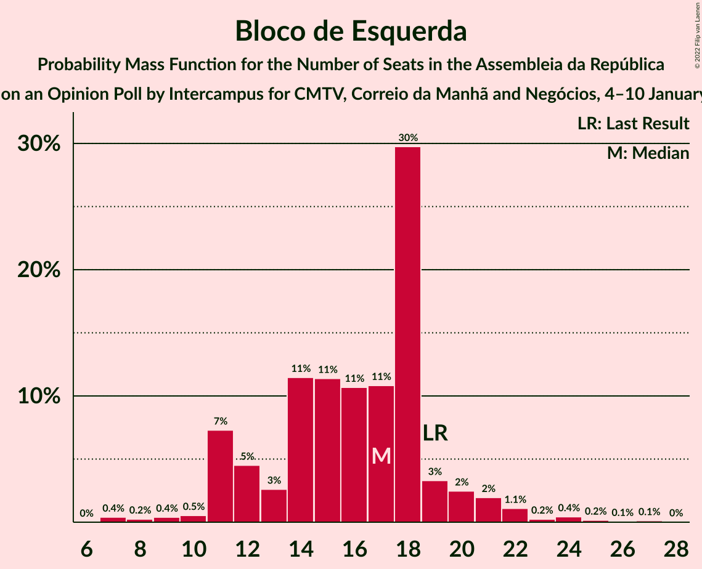

| Number of Seats | Probability | Accumulated | Special Marks |
|:---------------:|:-----------:|:-----------:|:-------------:|
| 7 | 0.4% | 100% |  |
| 8 | 0.2% | 99.6% |  |
| 9 | 0.4% | 99.4% |  |
| 10 | 0.5% | 99.0% |  |
| 11 | 7% | 98% |  |
| 12 | 5% | 91% |  |
| 13 | 3% | 87% |  |
| 14 | 11% | 84% |  |
| 15 | 11% | 73% |  |
| 16 | 11% | 61% |  |
| 17 | 11% | 50% | Median |
| 18 | 30% | 40% |  |
| 19 | 3% | 10% | Last Result |
| 20 | 2% | 7% |  |
| 21 | 2% | 4% |  |
| 22 | 1.1% | 2% |  |
| 23 | 0.2% | 1.1% |  |
| 24 | 0.4% | 0.8% |  |
| 25 | 0.2% | 0.4% |  |
| 26 | 0.1% | 0.2% |  |
| 27 | 0.1% | 0.2% |  |
| 28 | 0% | 0% |  |

### Chega

*For a full overview of the results for this party, see the [Chega](party-chega.html) page.*

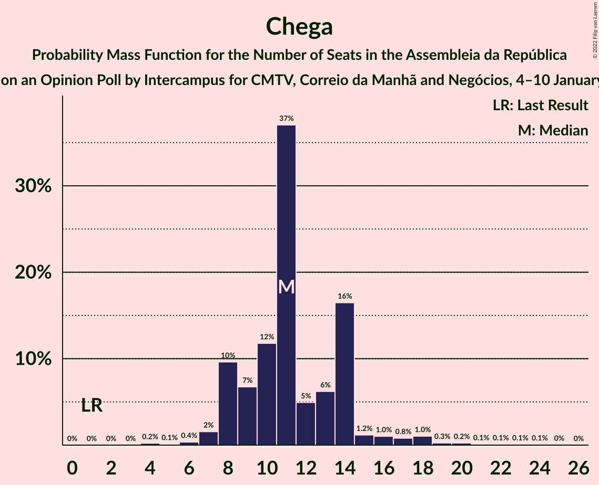

| Number of Seats | Probability | Accumulated | Special Marks |
|:---------------:|:-----------:|:-----------:|:-------------:|
| 1 | 0% | 100% | Last Result |
| 2 | 0% | 100% |  |
| 3 | 0% | 100% |  |
| 4 | 0.2% | 100% |  |
| 5 | 0.1% | 99.8% |  |
| 6 | 0.4% | 99.6% |  |
| 7 | 2% | 99.3% |  |
| 8 | 10% | 98% |  |
| 9 | 7% | 88% |  |
| 10 | 12% | 81% |  |
| 11 | 37% | 70% | Median |
| 12 | 5% | 33% |  |
| 13 | 6% | 28% |  |
| 14 | 16% | 21% |  |
| 15 | 1.2% | 5% |  |
| 16 | 1.0% | 4% |  |
| 17 | 0.8% | 3% |  |
| 18 | 1.0% | 2% |  |
| 19 | 0.3% | 0.9% |  |
| 20 | 0.2% | 0.6% |  |
| 21 | 0.1% | 0.4% |  |
| 22 | 0.1% | 0.3% |  |
| 23 | 0.1% | 0.2% |  |
| 24 | 0.1% | 0.1% |  |
| 25 | 0% | 0% |  |

### Coligação Democrática Unitária

*For a full overview of the results for this party, see the [Coligação Democrática Unitária](party-coligaçãodemocráticaunitária.html) page.*

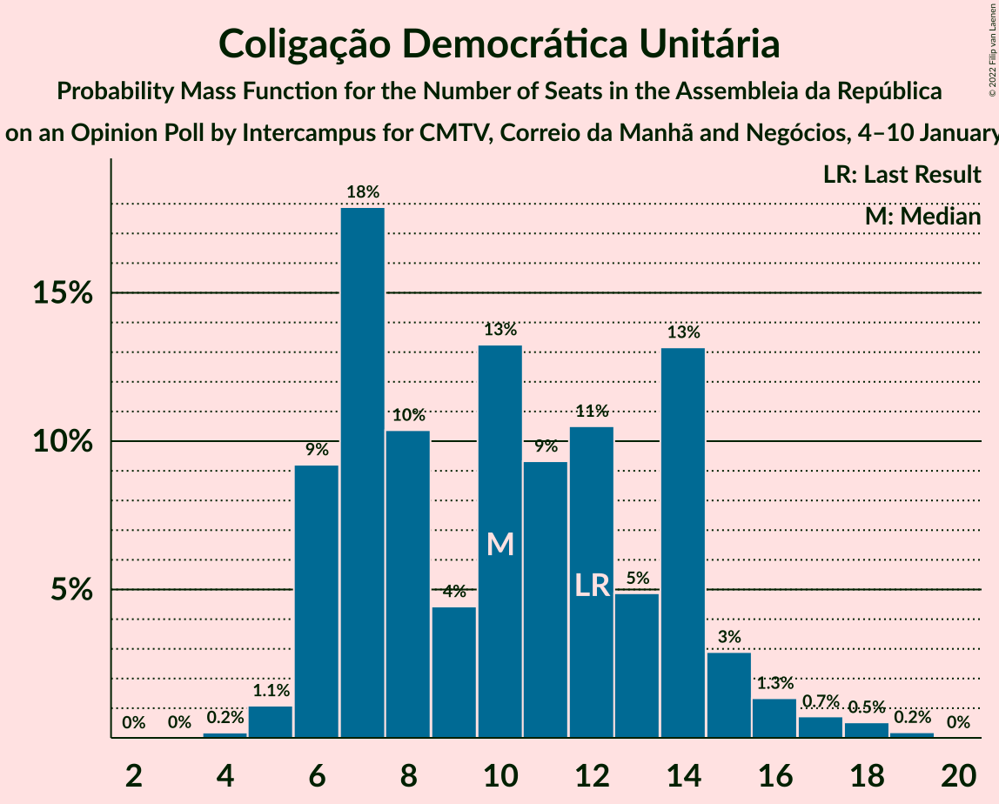

| Number of Seats | Probability | Accumulated | Special Marks |
|:---------------:|:-----------:|:-----------:|:-------------:|
| 4 | 0.2% | 100% |  |
| 5 | 1.1% | 99.8% |  |
| 6 | 9% | 98.7% |  |
| 7 | 18% | 90% |  |
| 8 | 10% | 72% |  |
| 9 | 4% | 61% |  |
| 10 | 13% | 57% | Median |
| 11 | 9% | 44% |  |
| 12 | 11% | 34% | Last Result |
| 13 | 5% | 24% |  |
| 14 | 13% | 19% |  |
| 15 | 3% | 6% |  |
| 16 | 1.3% | 3% |  |
| 17 | 0.7% | 1.5% |  |
| 18 | 0.5% | 0.8% |  |
| 19 | 0.2% | 0.2% |  |
| 20 | 0% | 0% |  |

### Iniciativa Liberal

*For a full overview of the results for this party, see the [Iniciativa Liberal](party-iniciativaliberal.html) page.*

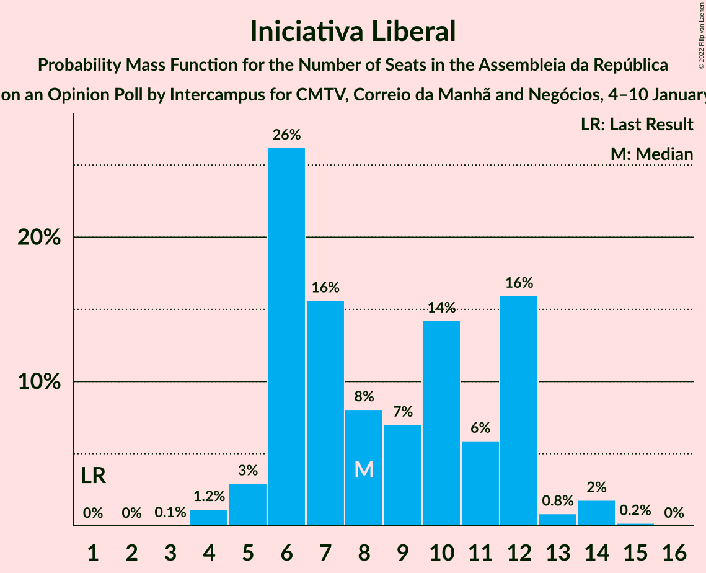

| Number of Seats | Probability | Accumulated | Special Marks |
|:---------------:|:-----------:|:-----------:|:-------------:|
| 1 | 0% | 100% | Last Result |
| 2 | 0% | 100% |  |
| 3 | 0.1% | 100% |  |
| 4 | 1.2% | 99.9% |  |
| 5 | 3% | 98.8% |  |
| 6 | 26% | 96% |  |
| 7 | 16% | 70% |  |
| 8 | 8% | 54% | Median |
| 9 | 7% | 46% |  |
| 10 | 14% | 39% |  |
| 11 | 6% | 25% |  |
| 12 | 16% | 19% |  |
| 13 | 0.8% | 3% |  |
| 14 | 2% | 2% |  |
| 15 | 0.2% | 0.2% |  |
| 16 | 0% | 0% |  |

### Pessoas–Animais–Natureza

*For a full overview of the results for this party, see the [Pessoas–Animais–Natureza](party-pessoas–animais–natureza.html) page.*

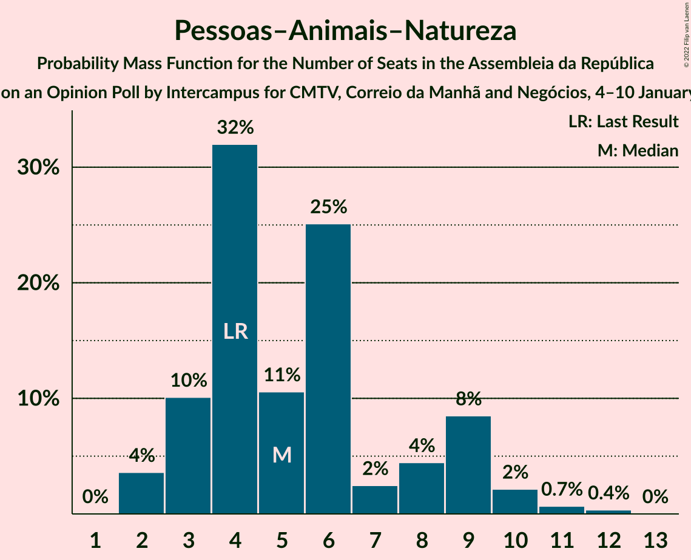

| Number of Seats | Probability | Accumulated | Special Marks |
|:---------------:|:-----------:|:-----------:|:-------------:|
| 2 | 4% | 100% |  |
| 3 | 10% | 96% |  |
| 4 | 32% | 86% | Last Result |
| 5 | 11% | 54% | Median |
| 6 | 25% | 44% |  |
| 7 | 2% | 19% |  |
| 8 | 4% | 16% |  |
| 9 | 8% | 12% |  |
| 10 | 2% | 3% |  |
| 11 | 0.7% | 1.1% |  |
| 12 | 0.4% | 0.4% |  |
| 13 | 0% | 0% |  |

### CDS–Partido Popular

*For a full overview of the results for this party, see the [CDS–Partido Popular](party-cds–partidopopular.html) page.*

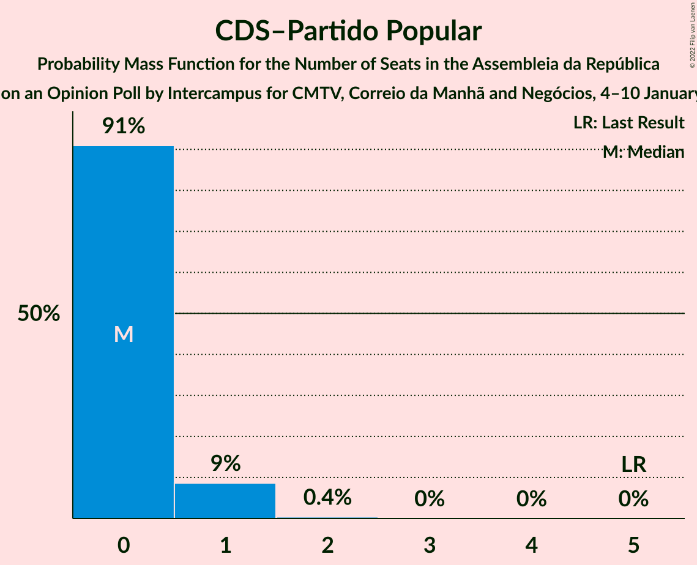

| Number of Seats | Probability | Accumulated | Special Marks |
|:---------------:|:-----------:|:-----------:|:-------------:|
| 0 | 91% | 100% | Median |
| 1 | 9% | 9% |  |
| 2 | 0.4% | 0.4% |  |
| 3 | 0% | 0% |  |
| 4 | 0% | 0% |  |
| 5 | 0% | 0% | Last Result |

### LIVRE

*For a full overview of the results for this party, see the [LIVRE](party-livre.html) page.*

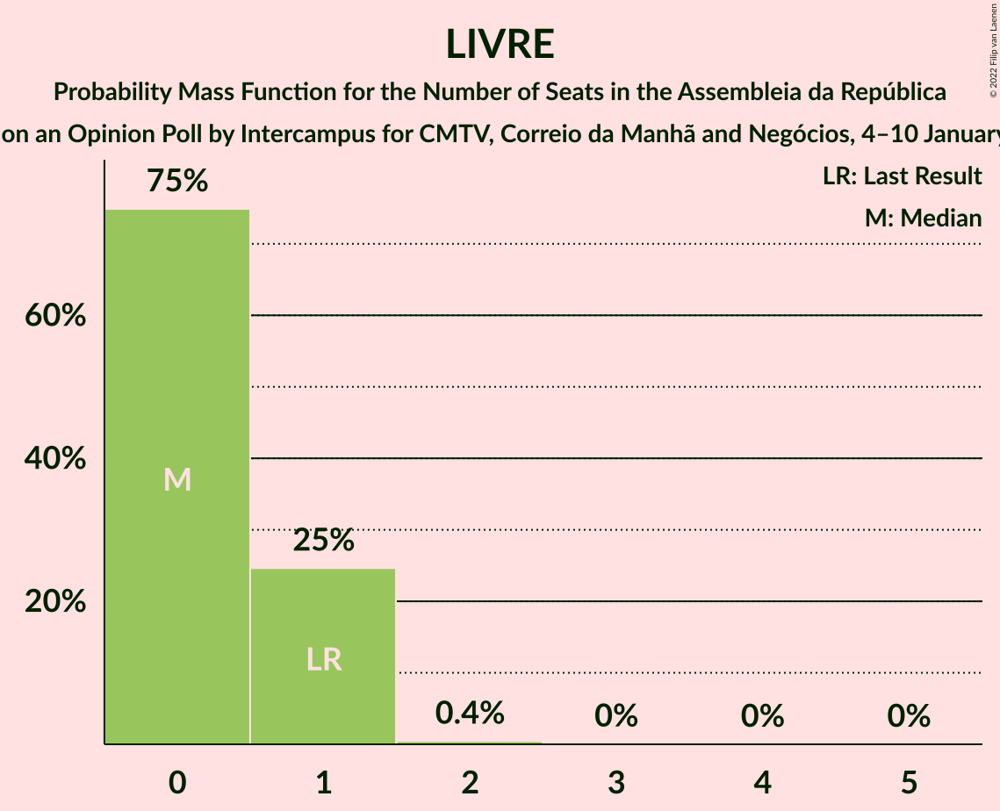

| Number of Seats | Probability | Accumulated | Special Marks |
|:---------------:|:-----------:|:-----------:|:-------------:|
| 0 | 75% | 100% | Median |
| 1 | 25% | 25% | Last Result |
| 2 | 0.4% | 0.5% |  |
| 3 | 0% | 0% |  |

## Coalitions

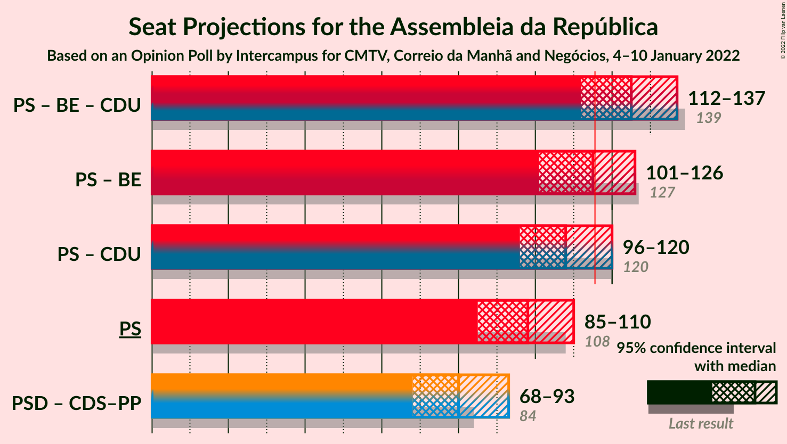

### Confidence Intervals

| Coalition | Last Result | Median | Majority? | 80% Confidence Interval | 90% Confidence Interval | 95% Confidence Interval | 99% Confidence Interval |
|:---------:|:-----------:|:------:|:---------:|:-----------------------:|:-----------------------:|:-----------------------:|:-----------------------:|
| Partido Socialista – Bloco de Esquerda – Coligação Democrática Unitária | 139 | 125 | 88% | 115–134 | 113–135 | 112–137 | 107–140 |
| Partido Socialista – Bloco de Esquerda | 127 | 115 | 41% | 106–123 | 103–124 | 101–126 | 97–130 |
| Partido Socialista – Coligação Democrática Unitária | 120 | 108 | 18% | 99–117 | 97–119 | 96–120 | 92–123 |
| Partido Socialista | 108 | 98 | 0.1% | 89–106 | 87–108 | 85–110 | 82–114 |
| Partido Social Democrata – CDS–Partido Popular | 84 | 80 | 0% | 72–90 | 71–92 | 68–93 | 66–97 |

### Partido Socialista – Bloco de Esquerda – Coligação Democrática Unitária

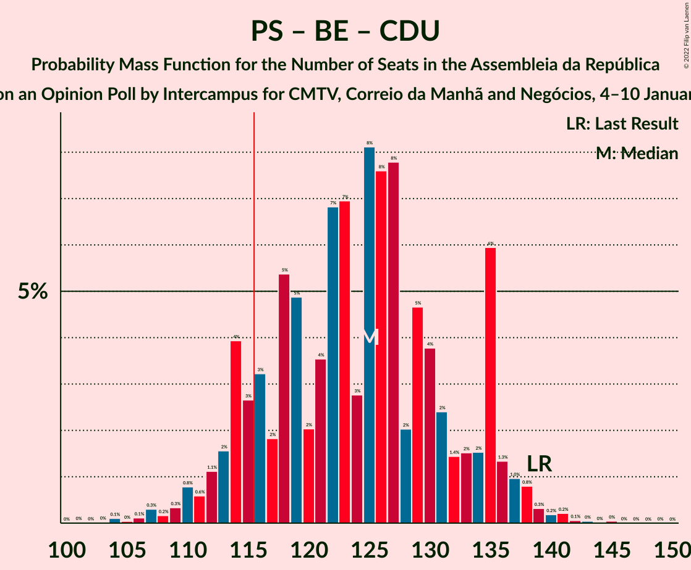

| Number of Seats | Probability | Accumulated | Special Marks |
|:---------------:|:-----------:|:-----------:|:-------------:|
| 103 | 0% | 100% |  |
| 104 | 0.1% | 99.9% |  |
| 105 | 0% | 99.8% |  |
| 106 | 0.1% | 99.8% |  |
| 107 | 0.3% | 99.7% |  |
| 108 | 0.2% | 99.4% |  |
| 109 | 0.3% | 99.2% |  |
| 110 | 0.8% | 98.9% |  |
| 111 | 0.6% | 98% |  |
| 112 | 1.1% | 98% |  |
| 113 | 2% | 96% |  |
| 114 | 4% | 95% |  |
| 115 | 3% | 91% |  |
| 116 | 3% | 88% | Majority |
| 117 | 2% | 85% |  |
| 118 | 5% | 83% |  |
| 119 | 5% | 78% |  |
| 120 | 2% | 73% |  |
| 121 | 4% | 71% |  |
| 122 | 7% | 67% |  |
| 123 | 7% | 61% |  |
| 124 | 3% | 54% |  |
| 125 | 8% | 51% | Median |
| 126 | 8% | 43% |  |
| 127 | 8% | 35% |  |
| 128 | 2% | 27% |  |
| 129 | 5% | 25% |  |
| 130 | 4% | 21% |  |
| 131 | 2% | 17% |  |
| 132 | 1.4% | 14% |  |
| 133 | 2% | 13% |  |
| 134 | 2% | 11% |  |
| 135 | 6% | 10% |  |
| 136 | 1.3% | 4% |  |
| 137 | 1.0% | 3% |  |
| 138 | 0.8% | 2% |  |
| 139 | 0.3% | 0.9% | Last Result |
| 140 | 0.2% | 0.6% |  |
| 141 | 0.2% | 0.4% |  |
| 142 | 0.1% | 0.2% |  |
| 143 | 0% | 0.1% |  |
| 144 | 0% | 0.1% |  |
| 145 | 0% | 0.1% |  |
| 146 | 0% | 0% |  |

### Partido Socialista – Bloco de Esquerda

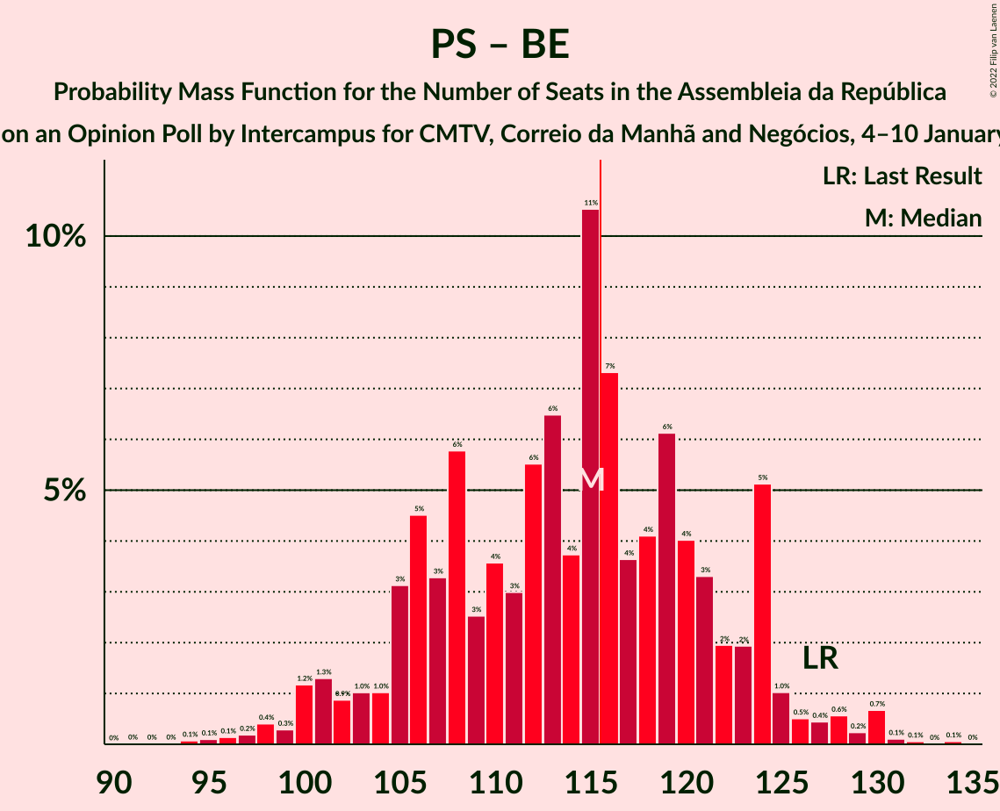

| Number of Seats | Probability | Accumulated | Special Marks |
|:---------------:|:-----------:|:-----------:|:-------------:|
| 93 | 0% | 100% |  |
| 94 | 0.1% | 99.9% |  |
| 95 | 0.1% | 99.9% |  |
| 96 | 0.1% | 99.8% |  |
| 97 | 0.2% | 99.6% |  |
| 98 | 0.4% | 99.4% |  |
| 99 | 0.3% | 99.0% |  |
| 100 | 1.2% | 98.7% |  |
| 101 | 1.3% | 98% |  |
| 102 | 0.9% | 96% |  |
| 103 | 1.0% | 95% |  |
| 104 | 1.0% | 94% |  |
| 105 | 3% | 93% |  |
| 106 | 5% | 90% |  |
| 107 | 3% | 86% |  |
| 108 | 6% | 82% |  |
| 109 | 3% | 77% |  |
| 110 | 4% | 74% |  |
| 111 | 3% | 71% |  |
| 112 | 6% | 68% |  |
| 113 | 6% | 62% |  |
| 114 | 4% | 56% |  |
| 115 | 11% | 52% | Median |
| 116 | 7% | 41% | Majority |
| 117 | 4% | 34% |  |
| 118 | 4% | 30% |  |
| 119 | 6% | 26% |  |
| 120 | 4% | 20% |  |
| 121 | 3% | 16% |  |
| 122 | 2% | 13% |  |
| 123 | 2% | 11% |  |
| 124 | 5% | 9% |  |
| 125 | 1.0% | 4% |  |
| 126 | 0.5% | 3% |  |
| 127 | 0.4% | 2% | Last Result |
| 128 | 0.6% | 2% |  |
| 129 | 0.2% | 1.2% |  |
| 130 | 0.7% | 0.9% |  |
| 131 | 0.1% | 0.3% |  |
| 132 | 0.1% | 0.2% |  |
| 133 | 0% | 0.1% |  |
| 134 | 0.1% | 0.1% |  |
| 135 | 0% | 0% |  |

### Partido Socialista – Coligação Democrática Unitária

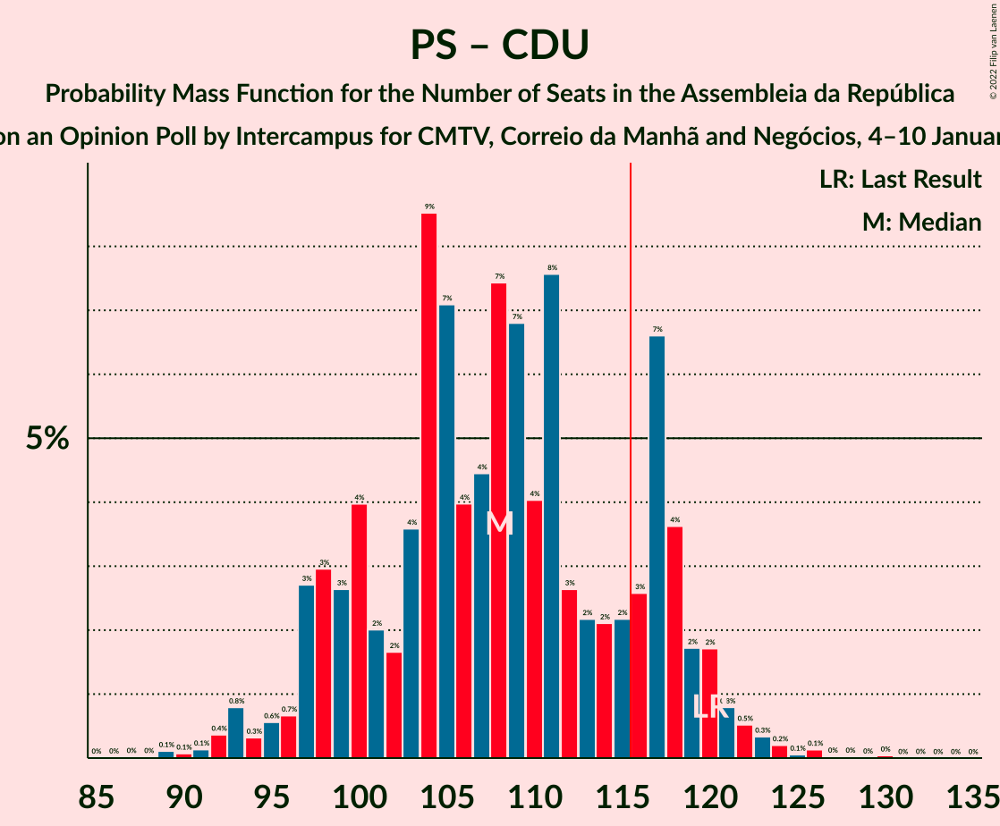

| Number of Seats | Probability | Accumulated | Special Marks |
|:---------------:|:-----------:|:-----------:|:-------------:|
| 88 | 0% | 100% |  |
| 89 | 0.1% | 99.9% |  |
| 90 | 0.1% | 99.8% |  |
| 91 | 0.1% | 99.8% |  |
| 92 | 0.4% | 99.6% |  |
| 93 | 0.8% | 99.3% |  |
| 94 | 0.3% | 98% |  |
| 95 | 0.6% | 98% |  |
| 96 | 0.7% | 98% |  |
| 97 | 3% | 97% |  |
| 98 | 3% | 94% |  |
| 99 | 3% | 91% |  |
| 100 | 4% | 89% |  |
| 101 | 2% | 85% |  |
| 102 | 2% | 83% |  |
| 103 | 4% | 81% |  |
| 104 | 9% | 77% |  |
| 105 | 7% | 69% |  |
| 106 | 4% | 62% |  |
| 107 | 4% | 58% |  |
| 108 | 7% | 53% | Median |
| 109 | 7% | 46% |  |
| 110 | 4% | 39% |  |
| 111 | 8% | 35% |  |
| 112 | 3% | 27% |  |
| 113 | 2% | 25% |  |
| 114 | 2% | 23% |  |
| 115 | 2% | 21% |  |
| 116 | 3% | 18% | Majority |
| 117 | 7% | 16% |  |
| 118 | 4% | 9% |  |
| 119 | 2% | 6% |  |
| 120 | 2% | 4% | Last Result |
| 121 | 0.8% | 2% |  |
| 122 | 0.5% | 1.4% |  |
| 123 | 0.3% | 0.8% |  |
| 124 | 0.2% | 0.5% |  |
| 125 | 0.1% | 0.3% |  |
| 126 | 0.1% | 0.2% |  |
| 127 | 0% | 0.1% |  |
| 128 | 0% | 0.1% |  |
| 129 | 0% | 0.1% |  |
| 130 | 0% | 0.1% |  |
| 131 | 0% | 0% |  |

### Partido Socialista

| Number of Seats | Probability | Accumulated | Special Marks |
|:---------------:|:-----------:|:-----------:|:-------------:|
| 78 | 0.1% | 100% |  |
| 79 | 0% | 99.9% |  |
| 80 | 0.1% | 99.9% |  |
| 81 | 0.1% | 99.7% |  |
| 82 | 0.5% | 99.6% |  |
| 83 | 0.7% | 99.1% |  |
| 84 | 0.7% | 98% |  |
| 85 | 0.6% | 98% |  |
| 86 | 1.5% | 97% |  |
| 87 | 2% | 96% |  |
| 88 | 2% | 93% |  |
| 89 | 4% | 91% |  |
| 90 | 1.0% | 88% |  |
| 91 | 1.4% | 87% |  |
| 92 | 3% | 85% |  |
| 93 | 7% | 83% |  |
| 94 | 8% | 76% |  |
| 95 | 2% | 68% |  |
| 96 | 4% | 66% |  |
| 97 | 7% | 61% |  |
| 98 | 9% | 54% | Median |
| 99 | 6% | 46% |  |
| 100 | 3% | 40% |  |
| 101 | 6% | 37% |  |
| 102 | 4% | 31% |  |
| 103 | 6% | 27% |  |
| 104 | 3% | 20% |  |
| 105 | 4% | 17% |  |
| 106 | 7% | 14% |  |
| 107 | 2% | 7% |  |
| 108 | 2% | 5% | Last Result |
| 109 | 0.9% | 4% |  |
| 110 | 0.5% | 3% |  |
| 111 | 0.4% | 2% |  |
| 112 | 1.1% | 2% |  |
| 113 | 0.2% | 0.7% |  |
| 114 | 0.3% | 0.5% |  |
| 115 | 0.1% | 0.2% |  |
| 116 | 0% | 0.1% | Majority |
| 117 | 0.1% | 0.1% |  |
| 118 | 0% | 0% |  |

### Partido Social Democrata – CDS–Partido Popular

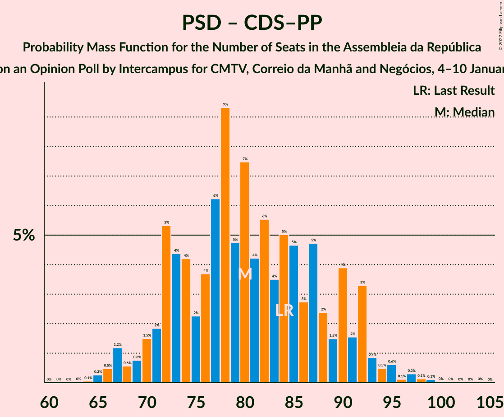

| Number of Seats | Probability | Accumulated | Special Marks |
|:---------------:|:-----------:|:-----------:|:-------------:|
| 63 | 0% | 100% |  |
| 64 | 0.1% | 99.9% |  |
| 65 | 0.3% | 99.9% |  |
| 66 | 0.5% | 99.6% |  |
| 67 | 1.2% | 99.2% |  |
| 68 | 0.6% | 98% |  |
| 69 | 0.8% | 97% |  |
| 70 | 1.5% | 97% |  |
| 71 | 2% | 95% |  |
| 72 | 5% | 93% |  |
| 73 | 4% | 88% |  |
| 74 | 4% | 84% |  |
| 75 | 2% | 79% |  |
| 76 | 4% | 77% |  |
| 77 | 6% | 73% |  |
| 78 | 9% | 67% |  |
| 79 | 5% | 58% |  |
| 80 | 7% | 53% | Median |
| 81 | 4% | 46% |  |
| 82 | 6% | 41% |  |
| 83 | 4% | 36% |  |
| 84 | 5% | 32% | Last Result |
| 85 | 5% | 27% |  |
| 86 | 3% | 23% |  |
| 87 | 5% | 20% |  |
| 88 | 2% | 15% |  |
| 89 | 1.5% | 13% |  |
| 90 | 4% | 11% |  |
| 91 | 2% | 8% |  |
| 92 | 3% | 6% |  |
| 93 | 0.9% | 3% |  |
| 94 | 0.5% | 2% |  |
| 95 | 0.6% | 1.3% |  |
| 96 | 0.1% | 0.7% |  |
| 97 | 0.3% | 0.6% |  |
| 98 | 0.1% | 0.3% |  |
| 99 | 0.1% | 0.2% |  |
| 100 | 0% | 0.1% |  |
| 101 | 0% | 0.1% |  |
| 102 | 0% | 0% |  |

## Technical Information

### Opinion Poll

+ **Polling firm:** Intercampus
+ **Commissioner(s):** CMTV, Correio da Manhã and Negócios
+ **Fieldwork period:** 4–10 January 2022

### Calculations

+ **Sample size:** 615
+ **Simulations done:** 1,048,576
+ **Error estimate:** 3.52%

