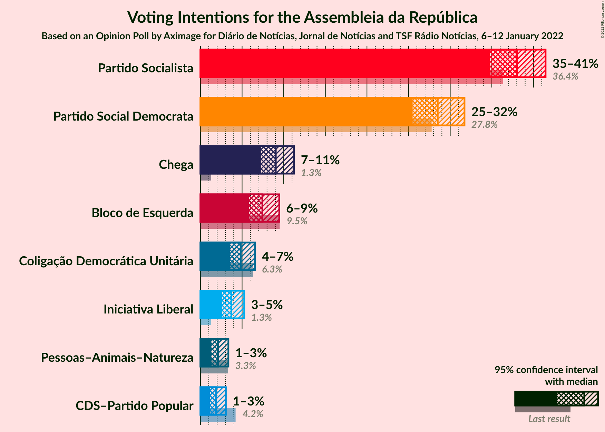
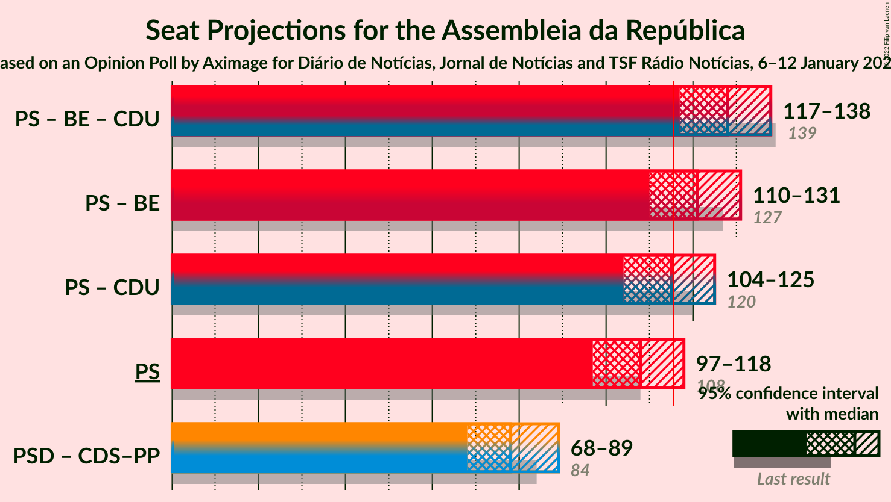

# Opinion Poll by Aximage for Diário de Notícias, Jornal de Notícias and TSF Rádio Notícias, 6–12 January 2022

<a href="#voting-intentions">Voting Intentions</a> | <a href="#seats">Seats</a> | <a href="#coalitions">Coalitions</a> | <a href="#technical-information">Technical Information</a>

## Voting Intentions

### Confidence Intervals

| Party | Last Result | Poll Result | 80% Confidence Interval | 90% Confidence Interval | 95% Confidence Interval | 99% Confidence Interval |
|:-----:|:-----------:|:-----------:|:-----------------------:|:-----------------------:|:-----------------------:|:-----------------------:|
| Partido Socialista | 36.4% | 38.0% | 35.9–40.3% |35.3–40.9% |34.8–41.5% |33.7–42.5% |
| Partido Social Democrata | 27.8% | 28.5% | 26.5–30.6% |26.0–31.2% |25.5–31.7% |24.6–32.7% |
| Chega | 1.3% | 9.0% | 7.9–10.5% |7.5–10.9% |7.3–11.2% |6.7–11.9% |
| Bloco de Esquerda | 9.5% | 7.4% | 6.4–8.8% |6.1–9.1% |5.8–9.5% |5.3–10.1% |
| Coligação Democrática Unitária | 6.3% | 4.8% | 4.0–5.9% |3.7–6.3% |3.6–6.6% |3.2–7.1% |
| Iniciativa Liberal | 1.3% | 3.7% | 3.0–4.7% |2.8–5.0% |2.6–5.3% |2.3–5.8% |
| Pessoas–Animais–Natureza | 3.3% | 2.1% | 1.6–2.9% |1.4–3.1% |1.3–3.4% |1.1–3.8% |
| CDS–Partido Popular | 4.2% | 1.9% | 1.4–2.6% |1.2–2.9% |1.1–3.0% |0.9–3.5% |

*Note:* The poll result column reflects the actual value used in the calculations. Published results may vary slightly, and in addition be rounded to fewer digits.

## Seats

### Confidence Intervals

| Party | Last Result | Median | 80% Confidence Interval | 90% Confidence Interval | 95% Confidence Interval | 99% Confidence Interval |
|:-----:|:-----------:|:------:|:-----------------------:|:-----------------------:|:-----------------------:|:-----------------------:|
| <a href="#partido-socialista">Partido Socialista</a> | 108 | 108 | 101–115 |99–116 |97–118 |93–120 |
| <a href="#partido-social-democrata">Partido Social Democrata</a> | 79 | 77 | 71–84 |69–86 |68–88 |66–92 |
| <a href="#chega">Chega</a> | 1 | 16 | 13–21 |11–22 |11–23 |11–26 |
| <a href="#bloco-de-esquerda">Bloco de Esquerda</a> | 19 | 13 | 11–16 |9–18 |7–18 |7–20 |
| <a href="#coligação-democrática-unitária">Coligação Democrática Unitária</a> | 12 | 6 | 5–10 |5–10 |5–12 |3–14 |
| <a href="#iniciativa-liberal">Iniciativa Liberal</a> | 1 | 5 | 3–6 |3–6 |3–7 |3–9 |
| <a href="#pessoas–animais–natureza">Pessoas–Animais–Natureza</a> | 4 | 2 | 1–2 |0–3 |0–4 |0–4 |
| <a href="#cds–partido-popular">CDS–Partido Popular</a> | 5 | 0 | 0–1 |0–2 |0–2 |0–2 |

### Partido Socialista

*For a full overview of the results for this party, see the [Partido Socialista](party-partidosocialista.html) page.*

| Number of Seats | Probability | Accumulated | Special Marks |
|:---------------:|:-----------:|:-----------:|:-------------:|
| 89 | 0% | 100% |  |
| 90 | 0.1% | 99.9% |  |
| 91 | 0.1% | 99.9% |  |
| 92 | 0.3% | 99.8% |  |
| 93 | 0.3% | 99.5% |  |
| 94 | 0.3% | 99.3% |  |
| 95 | 0.4% | 98.9% |  |
| 96 | 0.6% | 98.6% |  |
| 97 | 0.9% | 98% |  |
| 98 | 1.4% | 97% |  |
| 99 | 2% | 96% |  |
| 100 | 2% | 93% |  |
| 101 | 3% | 91% |  |
| 102 | 3% | 88% |  |
| 103 | 5% | 86% |  |
| 104 | 5% | 81% |  |
| 105 | 7% | 76% |  |
| 106 | 10% | 70% |  |
| 107 | 6% | 60% |  |
| 108 | 8% | 53% | Last Result, Median |
| 109 | 5% | 46% |  |
| 110 | 8% | 40% |  |
| 111 | 6% | 33% |  |
| 112 | 7% | 26% |  |
| 113 | 5% | 20% |  |
| 114 | 4% | 15% |  |
| 115 | 4% | 11% |  |
| 116 | 2% | 6% | Majority |
| 117 | 1.4% | 4% |  |
| 118 | 2% | 3% |  |
| 119 | 0.5% | 1.2% |  |
| 120 | 0.2% | 0.7% |  |
| 121 | 0.2% | 0.5% |  |
| 122 | 0.2% | 0.3% |  |
| 123 | 0.1% | 0.1% |  |
| 124 | 0% | 0.1% |  |
| 125 | 0% | 0% |  |

### Partido Social Democrata

*For a full overview of the results for this party, see the [Partido Social Democrata](party-partidosocialdemocrata.html) page.*

| Number of Seats | Probability | Accumulated | Special Marks |
|:---------------:|:-----------:|:-----------:|:-------------:|
| 62 | 0% | 100% |  |
| 63 | 0.2% | 99.9% |  |
| 64 | 0.1% | 99.8% |  |
| 65 | 0.2% | 99.7% |  |
| 66 | 0.5% | 99.5% |  |
| 67 | 0.5% | 99.0% |  |
| 68 | 2% | 98.6% |  |
| 69 | 2% | 96% |  |
| 70 | 1.4% | 94% |  |
| 71 | 4% | 93% |  |
| 72 | 3% | 89% |  |
| 73 | 3% | 86% |  |
| 74 | 3% | 83% |  |
| 75 | 5% | 79% |  |
| 76 | 17% | 74% |  |
| 77 | 12% | 57% | Median |
| 78 | 6% | 45% |  |
| 79 | 8% | 39% | Last Result |
| 80 | 7% | 31% |  |
| 81 | 6% | 24% |  |
| 82 | 6% | 18% |  |
| 83 | 2% | 12% |  |
| 84 | 3% | 10% |  |
| 85 | 2% | 7% |  |
| 86 | 1.4% | 5% |  |
| 87 | 0.8% | 4% |  |
| 88 | 1.0% | 3% |  |
| 89 | 0.5% | 2% |  |
| 90 | 0.5% | 2% |  |
| 91 | 0.4% | 1.1% |  |
| 92 | 0.2% | 0.7% |  |
| 93 | 0.2% | 0.5% |  |
| 94 | 0.2% | 0.3% |  |
| 95 | 0.1% | 0.1% |  |
| 96 | 0% | 0.1% |  |
| 97 | 0% | 0% |  |

### Chega

*For a full overview of the results for this party, see the [Chega](party-chega.html) page.*

| Number of Seats | Probability | Accumulated | Special Marks |
|:---------------:|:-----------:|:-----------:|:-------------:|
| 1 | 0% | 100% | Last Result |
| 2 | 0% | 100% |  |
| 3 | 0% | 100% |  |
| 4 | 0% | 100% |  |
| 5 | 0% | 100% |  |
| 6 | 0% | 100% |  |
| 7 | 0% | 100% |  |
| 8 | 0% | 100% |  |
| 9 | 0.1% | 100% |  |
| 10 | 0.1% | 99.9% |  |
| 11 | 5% | 99.8% |  |
| 12 | 3% | 94% |  |
| 13 | 7% | 92% |  |
| 14 | 22% | 85% |  |
| 15 | 10% | 63% |  |
| 16 | 9% | 53% | Median |
| 17 | 8% | 44% |  |
| 18 | 12% | 36% |  |
| 19 | 10% | 24% |  |
| 20 | 3% | 14% |  |
| 21 | 4% | 12% |  |
| 22 | 4% | 7% |  |
| 23 | 2% | 4% |  |
| 24 | 0.9% | 2% |  |
| 25 | 0.5% | 1.1% |  |
| 26 | 0.3% | 0.6% |  |
| 27 | 0.1% | 0.3% |  |
| 28 | 0.2% | 0.2% |  |
| 29 | 0% | 0% |  |

### Bloco de Esquerda

*For a full overview of the results for this party, see the [Bloco de Esquerda](party-blocodeesquerda.html) page.*

| Number of Seats | Probability | Accumulated | Special Marks |
|:---------------:|:-----------:|:-----------:|:-------------:|
| 7 | 3% | 100% |  |
| 8 | 2% | 97% |  |
| 9 | 1.1% | 95% |  |
| 10 | 3% | 94% |  |
| 11 | 18% | 91% |  |
| 12 | 11% | 73% |  |
| 13 | 12% | 62% | Median |
| 14 | 17% | 50% |  |
| 15 | 9% | 33% |  |
| 16 | 15% | 24% |  |
| 17 | 3% | 9% |  |
| 18 | 5% | 6% |  |
| 19 | 0.5% | 1.1% | Last Result |
| 20 | 0.3% | 0.6% |  |
| 21 | 0.2% | 0.3% |  |
| 22 | 0.1% | 0.1% |  |
| 23 | 0% | 0% |  |

### Coligação Democrática Unitária

*For a full overview of the results for this party, see the [Coligação Democrática Unitária](party-coligaçãodemocráticaunitária.html) page.*

| Number of Seats | Probability | Accumulated | Special Marks |
|:---------------:|:-----------:|:-----------:|:-------------:|
| 2 | 0.1% | 100% |  |
| 3 | 0.6% | 99.9% |  |
| 4 | 1.2% | 99.4% |  |
| 5 | 23% | 98% |  |
| 6 | 30% | 75% | Median |
| 7 | 20% | 46% |  |
| 8 | 8% | 26% |  |
| 9 | 7% | 18% |  |
| 10 | 6% | 10% |  |
| 11 | 2% | 4% |  |
| 12 | 1.2% | 3% | Last Result |
| 13 | 1.0% | 2% |  |
| 14 | 0.5% | 0.7% |  |
| 15 | 0.2% | 0.2% |  |
| 16 | 0% | 0% |  |

### Iniciativa Liberal

*For a full overview of the results for this party, see the [Iniciativa Liberal](party-iniciativaliberal.html) page.*

| Number of Seats | Probability | Accumulated | Special Marks |
|:---------------:|:-----------:|:-----------:|:-------------:|
| 1 | 0% | 100% | Last Result |
| 2 | 0.1% | 100% |  |
| 3 | 14% | 99.9% |  |
| 4 | 26% | 86% |  |
| 5 | 34% | 60% | Median |
| 6 | 24% | 27% |  |
| 7 | 1.1% | 3% |  |
| 8 | 0.6% | 2% |  |
| 9 | 0.7% | 1.0% |  |
| 10 | 0.3% | 0.4% |  |
| 11 | 0% | 0.1% |  |
| 12 | 0% | 0% |  |

### Pessoas–Animais–Natureza

*For a full overview of the results for this party, see the [Pessoas–Animais–Natureza](party-pessoas–animais–natureza.html) page.*

| Number of Seats | Probability | Accumulated | Special Marks |
|:---------------:|:-----------:|:-----------:|:-------------:|
| 0 | 6% | 100% |  |
| 1 | 33% | 94% |  |
| 2 | 53% | 61% | Median |
| 3 | 5% | 8% |  |
| 4 | 3% | 3% | Last Result |
| 5 | 0.1% | 0.1% |  |
| 6 | 0% | 0% |  |

### CDS–Partido Popular

*For a full overview of the results for this party, see the [CDS–Partido Popular](party-cds–partidopopular.html) page.*

| Number of Seats | Probability | Accumulated | Special Marks |
|:---------------:|:-----------:|:-----------:|:-------------:|
| 0 | 51% | 100% | Median |
| 1 | 42% | 49% |  |
| 2 | 7% | 7% |  |
| 3 | 0.3% | 0.5% |  |
| 4 | 0.1% | 0.1% |  |
| 5 | 0% | 0% | Last Result |

## Coalitions

### Confidence Intervals

| Coalition | Last Result | Median | Majority? | 80% Confidence Interval | 90% Confidence Interval | 95% Confidence Interval | 99% Confidence Interval |
|:---------:|:-----------:|:------:|:---------:|:-----------------------:|:-----------------------:|:-----------------------:|:-----------------------:|
| Partido Socialista – Bloco de Esquerda – Coligação Democrática Unitária | 139 | 128 | 98% | 122–135 | 120–136 | 117–138 | 113–141 |
| Partido Socialista – Bloco de Esquerda | 127 | 121 | 87% | 114–128 | 112–130 | 110–131 | 106–134 |
| Partido Socialista – Coligação Democrática Unitária | 120 | 115 | 45% | 108–121 | 106–123 | 104–125 | 99–128 |
| Partido Socialista | 108 | 108 | 6% | 101–115 | 99–116 | 97–118 | 93–120 |
| Partido Social Democrata – CDS–Partido Popular | 84 | 78 | 0% | 72–84 | 70–86 | 68–89 | 66–93 |

### Partido Socialista – Bloco de Esquerda – Coligação Democrática Unitária

| Number of Seats | Probability | Accumulated | Special Marks |
|:---------------:|:-----------:|:-----------:|:-------------:|
| 109 | 0% | 100% |  |
| 110 | 0.1% | 99.9% |  |
| 111 | 0.1% | 99.9% |  |
| 112 | 0.2% | 99.8% |  |
| 113 | 0.2% | 99.6% |  |
| 114 | 0.3% | 99.3% |  |
| 115 | 0.6% | 99.0% |  |
| 116 | 0.7% | 98% | Majority |
| 117 | 0.8% | 98% |  |
| 118 | 0.9% | 97% |  |
| 119 | 1.0% | 96% |  |
| 120 | 2% | 95% |  |
| 121 | 3% | 93% |  |
| 122 | 3% | 90% |  |
| 123 | 4% | 87% |  |
| 124 | 5% | 83% |  |
| 125 | 9% | 79% |  |
| 126 | 8% | 70% |  |
| 127 | 6% | 62% | Median |
| 128 | 6% | 55% |  |
| 129 | 8% | 49% |  |
| 130 | 9% | 41% |  |
| 131 | 6% | 32% |  |
| 132 | 7% | 26% |  |
| 133 | 5% | 19% |  |
| 134 | 4% | 14% |  |
| 135 | 3% | 10% |  |
| 136 | 3% | 8% |  |
| 137 | 2% | 4% |  |
| 138 | 0.8% | 3% |  |
| 139 | 0.8% | 2% | Last Result |
| 140 | 0.3% | 1.0% |  |
| 141 | 0.3% | 0.7% |  |
| 142 | 0.1% | 0.3% |  |
| 143 | 0.1% | 0.2% |  |
| 144 | 0.1% | 0.1% |  |
| 145 | 0% | 0.1% |  |
| 146 | 0% | 0% |  |

### Partido Socialista – Bloco de Esquerda

| Number of Seats | Probability | Accumulated | Special Marks |
|:---------------:|:-----------:|:-----------:|:-------------:|
| 102 | 0% | 100% |  |
| 103 | 0% | 99.9% |  |
| 104 | 0.1% | 99.9% |  |
| 105 | 0.1% | 99.8% |  |
| 106 | 0.2% | 99.7% |  |
| 107 | 0.4% | 99.5% |  |
| 108 | 0.6% | 99.1% |  |
| 109 | 0.6% | 98% |  |
| 110 | 1.1% | 98% |  |
| 111 | 1.2% | 97% |  |
| 112 | 2% | 96% |  |
| 113 | 2% | 94% |  |
| 114 | 3% | 92% |  |
| 115 | 3% | 90% |  |
| 116 | 3% | 87% | Majority |
| 117 | 6% | 85% |  |
| 118 | 5% | 78% |  |
| 119 | 6% | 73% |  |
| 120 | 9% | 67% |  |
| 121 | 8% | 58% | Median |
| 122 | 7% | 50% |  |
| 123 | 7% | 43% |  |
| 124 | 10% | 36% |  |
| 125 | 7% | 26% |  |
| 126 | 6% | 19% |  |
| 127 | 3% | 14% | Last Result |
| 128 | 3% | 10% |  |
| 129 | 2% | 8% |  |
| 130 | 2% | 5% |  |
| 131 | 1.4% | 3% |  |
| 132 | 0.8% | 2% |  |
| 133 | 0.3% | 1.1% |  |
| 134 | 0.4% | 0.7% |  |
| 135 | 0.2% | 0.4% |  |
| 136 | 0.1% | 0.2% |  |
| 137 | 0% | 0.1% |  |
| 138 | 0.1% | 0.1% |  |
| 139 | 0% | 0% |  |

### Partido Socialista – Coligação Democrática Unitária

| Number of Seats | Probability | Accumulated | Special Marks |
|:---------------:|:-----------:|:-----------:|:-------------:|
| 95 | 0% | 100% |  |
| 96 | 0% | 99.9% |  |
| 97 | 0.2% | 99.9% |  |
| 98 | 0.1% | 99.7% |  |
| 99 | 0.2% | 99.6% |  |
| 100 | 0.3% | 99.4% |  |
| 101 | 0.3% | 99.1% |  |
| 102 | 0.4% | 98.8% |  |
| 103 | 0.5% | 98% |  |
| 104 | 0.7% | 98% |  |
| 105 | 1.3% | 97% |  |
| 106 | 2% | 96% |  |
| 107 | 1.5% | 94% |  |
| 108 | 3% | 92% |  |
| 109 | 3% | 90% |  |
| 110 | 5% | 86% |  |
| 111 | 8% | 81% |  |
| 112 | 8% | 74% |  |
| 113 | 7% | 66% |  |
| 114 | 8% | 59% | Median |
| 115 | 7% | 51% |  |
| 116 | 7% | 45% | Majority |
| 117 | 8% | 38% |  |
| 118 | 8% | 29% |  |
| 119 | 3% | 22% |  |
| 120 | 4% | 19% | Last Result |
| 121 | 5% | 15% |  |
| 122 | 4% | 10% |  |
| 123 | 2% | 6% |  |
| 124 | 1.3% | 4% |  |
| 125 | 1.5% | 3% |  |
| 126 | 0.5% | 1.4% |  |
| 127 | 0.4% | 0.9% |  |
| 128 | 0.2% | 0.5% |  |
| 129 | 0.1% | 0.3% |  |
| 130 | 0.1% | 0.2% |  |
| 131 | 0.1% | 0.1% |  |
| 132 | 0% | 0% |  |

### Partido Socialista

| Number of Seats | Probability | Accumulated | Special Marks |
|:---------------:|:-----------:|:-----------:|:-------------:|
| 89 | 0% | 100% |  |
| 90 | 0.1% | 99.9% |  |
| 91 | 0.1% | 99.9% |  |
| 92 | 0.3% | 99.8% |  |
| 93 | 0.3% | 99.5% |  |
| 94 | 0.3% | 99.3% |  |
| 95 | 0.4% | 98.9% |  |
| 96 | 0.6% | 98.6% |  |
| 97 | 0.9% | 98% |  |
| 98 | 1.4% | 97% |  |
| 99 | 2% | 96% |  |
| 100 | 2% | 93% |  |
| 101 | 3% | 91% |  |
| 102 | 3% | 88% |  |
| 103 | 5% | 86% |  |
| 104 | 5% | 81% |  |
| 105 | 7% | 76% |  |
| 106 | 10% | 70% |  |
| 107 | 6% | 60% |  |
| 108 | 8% | 53% | Last Result, Median |
| 109 | 5% | 46% |  |
| 110 | 8% | 40% |  |
| 111 | 6% | 33% |  |
| 112 | 7% | 26% |  |
| 113 | 5% | 20% |  |
| 114 | 4% | 15% |  |
| 115 | 4% | 11% |  |
| 116 | 2% | 6% | Majority |
| 117 | 1.4% | 4% |  |
| 118 | 2% | 3% |  |
| 119 | 0.5% | 1.2% |  |
| 120 | 0.2% | 0.7% |  |
| 121 | 0.2% | 0.5% |  |
| 122 | 0.2% | 0.3% |  |
| 123 | 0.1% | 0.1% |  |
| 124 | 0% | 0.1% |  |
| 125 | 0% | 0% |  |

### Partido Social Democrata – CDS–Partido Popular

| Number of Seats | Probability | Accumulated | Special Marks |
|:---------------:|:-----------:|:-----------:|:-------------:|
| 62 | 0% | 100% |  |
| 63 | 0.1% | 99.9% |  |
| 64 | 0.1% | 99.9% |  |
| 65 | 0.1% | 99.8% |  |
| 66 | 0.3% | 99.6% |  |
| 67 | 0.4% | 99.3% |  |
| 68 | 2% | 98.9% |  |
| 69 | 1.5% | 97% |  |
| 70 | 2% | 96% |  |
| 71 | 2% | 94% |  |
| 72 | 4% | 92% |  |
| 73 | 2% | 88% |  |
| 74 | 4% | 85% |  |
| 75 | 4% | 81% |  |
| 76 | 15% | 77% |  |
| 77 | 9% | 62% | Median |
| 78 | 9% | 53% |  |
| 79 | 8% | 44% |  |
| 80 | 9% | 36% |  |
| 81 | 6% | 28% |  |
| 82 | 8% | 22% |  |
| 83 | 3% | 14% |  |
| 84 | 3% | 11% | Last Result |
| 85 | 3% | 9% |  |
| 86 | 2% | 6% |  |
| 87 | 1.1% | 5% |  |
| 88 | 0.9% | 4% |  |
| 89 | 0.8% | 3% |  |
| 90 | 0.7% | 2% |  |
| 91 | 0.2% | 1.3% |  |
| 92 | 0.5% | 1.1% |  |
| 93 | 0.2% | 0.6% |  |
| 94 | 0.2% | 0.4% |  |
| 95 | 0.2% | 0.2% |  |
| 96 | 0% | 0.1% |  |
| 97 | 0% | 0% |  |

## Technical Information

### Opinion Poll

+ **Polling firm:** Aximage
+ **Commissioner(s):** Diário de Notícias, Jornal de Notícias and TSF Rádio Notícias
+ **Fieldwork period:** 6–12 January 2022

### Calculations

+ **Sample size:** 807
+ **Simulations done:** 1,048,576
+ **Error estimate:** 1.72%

