# Opinion Poll by Pitagórica for CNN Portugal and TVI, 13–16 January 2022

<a href="#voting-intentions">Voting Intentions</a> | <a href="#seats">Seats</a> | <a href="#coalitions">Coalitions</a> | <a href="#technical-information">Technical Information</a>

## Voting Intentions

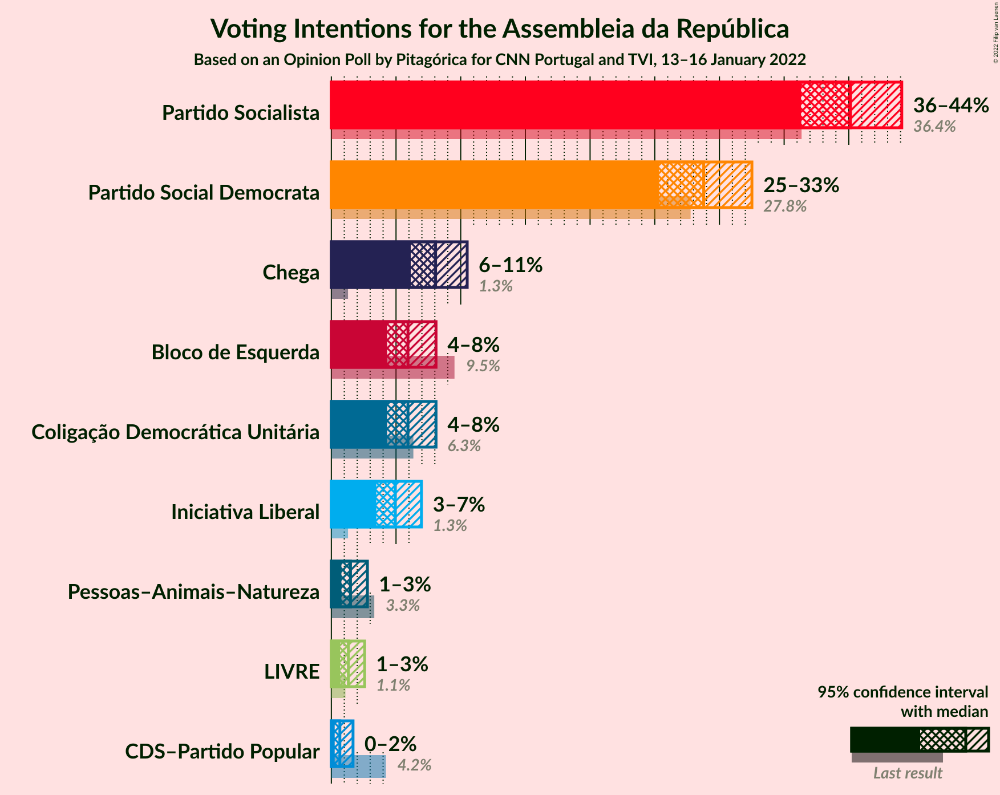

### Confidence Intervals

| Party | Last Result | Poll Result | 80% Confidence Interval | 90% Confidence Interval | 95% Confidence Interval | 99% Confidence Interval |
|:-----:|:-----------:|:-----------:|:-----------------------:|:-----------------------:|:-----------------------:|:-----------------------:|
| Partido Socialista | 36.4% | 40.1% | 37.6–42.7% |36.9–43.5% |36.3–44.1% |35.1–45.3% |
| Partido Social Democrata | 27.8% | 28.8% | 26.5–31.2% |25.9–31.9% |25.3–32.5% |24.3–33.7% |
| Chega | 1.3% | 8.1% | 6.8–9.6% |6.4–10.1% |6.1–10.5% |5.6–11.3% |
| Bloco de Esquerda | 9.5% | 5.9% | 4.9–7.3% |4.6–7.7% |4.3–8.1% |3.8–8.8% |
| Coligação Democrática Unitária | 6.3% | 5.9% | 4.9–7.3% |4.6–7.7% |4.3–8.1% |3.8–8.8% |
| Iniciativa Liberal | 1.3% | 4.9% | 4.0–6.2% |3.7–6.6% |3.5–7.0% |3.1–7.7% |
| Pessoas–Animais–Natureza | 3.3% | 1.5% | 1.0–2.3% |0.9–2.6% |0.8–2.8% |0.6–3.3% |
| LIVRE | 1.1% | 1.3% | 0.9–2.1% |0.8–2.4% |0.7–2.6% |0.5–3.0% |
| CDS–Partido Popular | 4.2% | 0.7% | 0.4–1.3% |0.3–1.5% |0.3–1.7% |0.2–2.1% |

*Note:* The poll result column reflects the actual value used in the calculations. Published results may vary slightly, and in addition be rounded to fewer digits.

## Seats

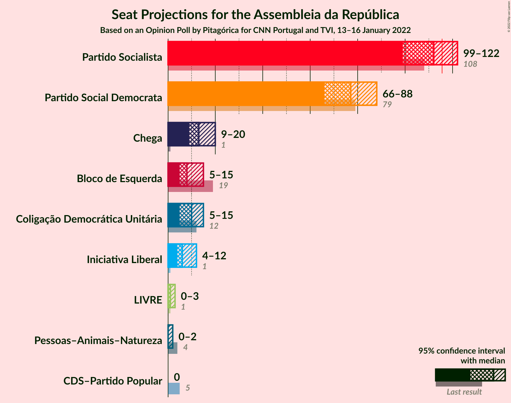

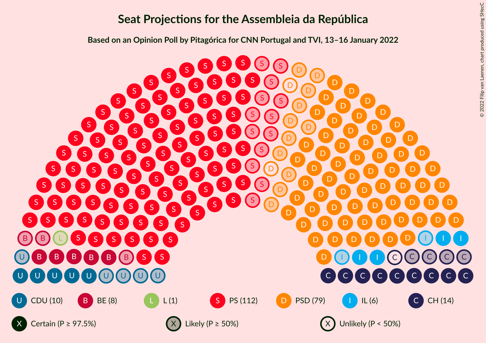

### Confidence Intervals

| Party | Last Result | Median | 80% Confidence Interval | 90% Confidence Interval | 95% Confidence Interval | 99% Confidence Interval |
|:-----:|:-----------:|:------:|:-----------------------:|:-----------------------:|:-----------------------:|:-----------------------:|
| <a href="#partido-socialista">Partido Socialista</a> | 108 | 112 | 105–120 |103–121 |99–122 |96–127 |
| <a href="#partido-social-democrata">Partido Social Democrata</a> | 79 | 77 | 70–84 |68–86 |66–88 |63–92 |
| <a href="#chega">Chega</a> | 1 | 13 | 11–18 |10–19 |9–20 |8–23 |
| <a href="#bloco-de-esquerda">Bloco de Esquerda</a> | 19 | 8 | 7–12 |6–14 |5–15 |3–17 |
| <a href="#coligação-democrática-unitária">Coligação Democrática Unitária</a> | 12 | 10 | 6–14 |6–15 |5–15 |5–18 |
| <a href="#iniciativa-liberal">Iniciativa Liberal</a> | 1 | 6 | 5–11 |4–12 |4–12 |3–13 |
| <a href="#pessoas–animais–natureza">Pessoas–Animais–Natureza</a> | 4 | 0 | 0–2 |0–2 |0–2 |0–3 |
| <a href="#livre">LIVRE</a> | 1 | 1 | 0–1 |0–2 |0–3 |0–3 |
| <a href="#cds–partido-popular">CDS–Partido Popular</a> | 5 | 0 | 0 |0 |0 |0–1 |

### Partido Socialista

*For a full overview of the results for this party, see the [Partido Socialista](party-partidosocialista.html) page.*

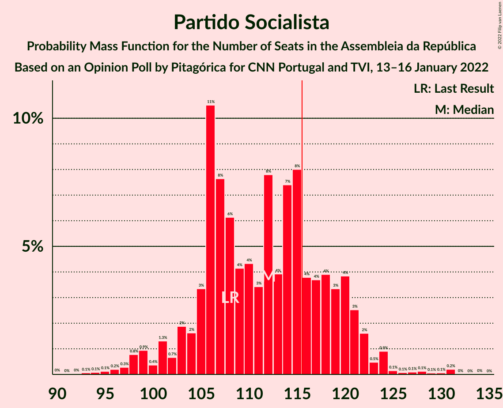

| Number of Seats | Probability | Accumulated | Special Marks |
|:---------------:|:-----------:|:-----------:|:-------------:|
| 90 | 0% | 100% |  |
| 91 | 0% | 99.9% |  |
| 92 | 0% | 99.9% |  |
| 93 | 0.1% | 99.9% |  |
| 94 | 0.1% | 99.8% |  |
| 95 | 0.1% | 99.7% |  |
| 96 | 0.2% | 99.6% |  |
| 97 | 0.3% | 99.4% |  |
| 98 | 0.8% | 99.1% |  |
| 99 | 0.9% | 98% |  |
| 100 | 0.4% | 97% |  |
| 101 | 1.3% | 97% |  |
| 102 | 0.7% | 96% |  |
| 103 | 2% | 95% |  |
| 104 | 2% | 93% |  |
| 105 | 3% | 92% |  |
| 106 | 11% | 88% |  |
| 107 | 8% | 78% |  |
| 108 | 6% | 70% | Last Result |
| 109 | 4% | 64% |  |
| 110 | 4% | 60% |  |
| 111 | 3% | 55% |  |
| 112 | 8% | 52% | Median |
| 113 | 4% | 44% |  |
| 114 | 7% | 40% |  |
| 115 | 8% | 33% |  |
| 116 | 4% | 25% | Majority |
| 117 | 4% | 21% |  |
| 118 | 4% | 17% |  |
| 119 | 3% | 14% |  |
| 120 | 4% | 10% |  |
| 121 | 3% | 6% |  |
| 122 | 2% | 4% |  |
| 123 | 0.5% | 2% |  |
| 124 | 0.9% | 2% |  |
| 125 | 0.1% | 0.8% |  |
| 126 | 0.1% | 0.7% |  |
| 127 | 0.1% | 0.6% |  |
| 128 | 0.1% | 0.5% |  |
| 129 | 0.1% | 0.4% |  |
| 130 | 0.1% | 0.3% |  |
| 131 | 0.2% | 0.2% |  |
| 132 | 0% | 0% |  |

### Partido Social Democrata

*For a full overview of the results for this party, see the [Partido Social Democrata](party-partidosocialdemocrata.html) page.*

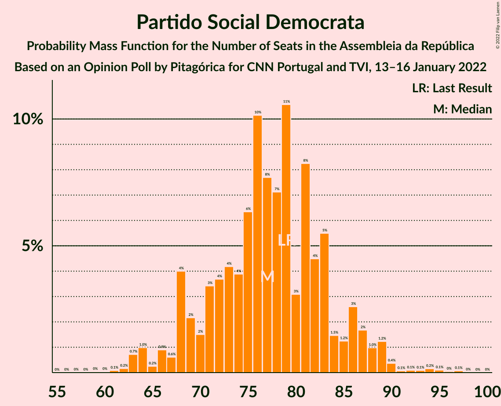

| Number of Seats | Probability | Accumulated | Special Marks |
|:---------------:|:-----------:|:-----------:|:-------------:|
| 59 | 0% | 100% |  |
| 60 | 0% | 99.9% |  |
| 61 | 0.1% | 99.9% |  |
| 62 | 0.2% | 99.8% |  |
| 63 | 0.7% | 99.7% |  |
| 64 | 1.0% | 98.9% |  |
| 65 | 0.2% | 98% |  |
| 66 | 0.9% | 98% |  |
| 67 | 0.6% | 97% |  |
| 68 | 4% | 96% |  |
| 69 | 2% | 92% |  |
| 70 | 2% | 90% |  |
| 71 | 3% | 89% |  |
| 72 | 4% | 85% |  |
| 73 | 4% | 81% |  |
| 74 | 4% | 77% |  |
| 75 | 6% | 73% |  |
| 76 | 10% | 67% |  |
| 77 | 8% | 57% | Median |
| 78 | 7% | 49% |  |
| 79 | 11% | 42% | Last Result |
| 80 | 3% | 32% |  |
| 81 | 8% | 28% |  |
| 82 | 4% | 20% |  |
| 83 | 5% | 16% |  |
| 84 | 1.5% | 10% |  |
| 85 | 1.2% | 9% |  |
| 86 | 3% | 7% |  |
| 87 | 2% | 5% |  |
| 88 | 1.0% | 3% |  |
| 89 | 1.2% | 2% |  |
| 90 | 0.4% | 1.0% |  |
| 91 | 0.1% | 0.6% |  |
| 92 | 0.1% | 0.6% |  |
| 93 | 0.1% | 0.5% |  |
| 94 | 0.2% | 0.4% |  |
| 95 | 0.1% | 0.2% |  |
| 96 | 0% | 0.1% |  |
| 97 | 0.1% | 0.1% |  |
| 98 | 0% | 0% |  |

### Chega

*For a full overview of the results for this party, see the [Chega](party-chega.html) page.*

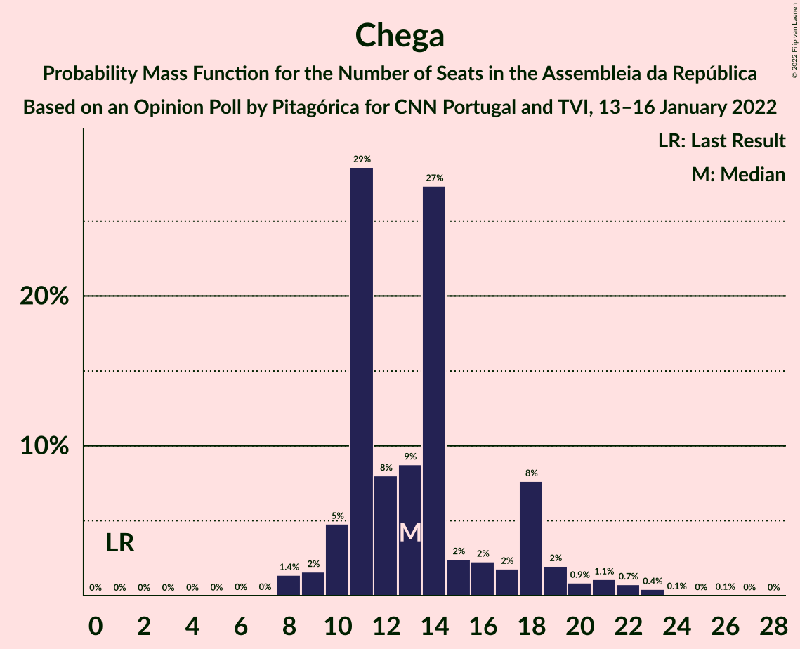

| Number of Seats | Probability | Accumulated | Special Marks |
|:---------------:|:-----------:|:-----------:|:-------------:|
| 1 | 0% | 100% | Last Result |
| 2 | 0% | 100% |  |
| 3 | 0% | 100% |  |
| 4 | 0% | 100% |  |
| 5 | 0% | 100% |  |
| 6 | 0% | 100% |  |
| 7 | 0% | 99.9% |  |
| 8 | 1.4% | 99.9% |  |
| 9 | 2% | 98.5% |  |
| 10 | 5% | 97% |  |
| 11 | 29% | 92% |  |
| 12 | 8% | 64% |  |
| 13 | 9% | 56% | Median |
| 14 | 27% | 47% |  |
| 15 | 2% | 19% |  |
| 16 | 2% | 17% |  |
| 17 | 2% | 15% |  |
| 18 | 8% | 13% |  |
| 19 | 2% | 5% |  |
| 20 | 0.9% | 3% |  |
| 21 | 1.1% | 2% |  |
| 22 | 0.7% | 1.4% |  |
| 23 | 0.4% | 0.7% |  |
| 24 | 0.1% | 0.2% |  |
| 25 | 0% | 0.1% |  |
| 26 | 0.1% | 0.1% |  |
| 27 | 0% | 0% |  |

### Bloco de Esquerda

*For a full overview of the results for this party, see the [Bloco de Esquerda](party-blocodeesquerda.html) page.*

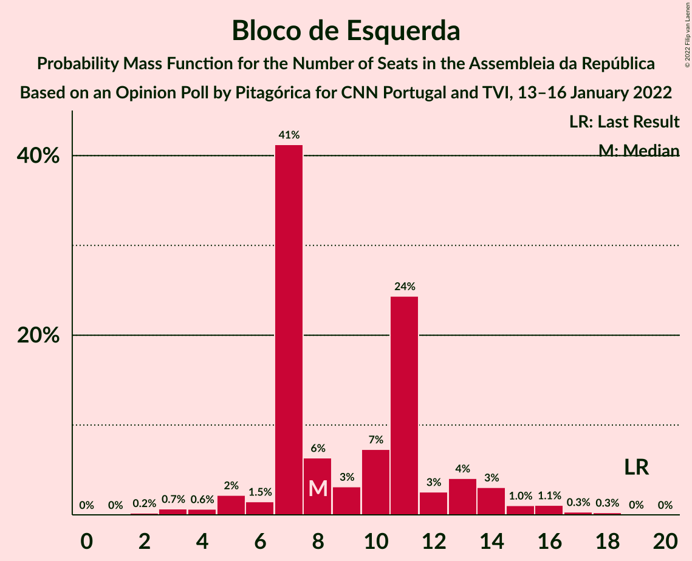

| Number of Seats | Probability | Accumulated | Special Marks |
|:---------------:|:-----------:|:-----------:|:-------------:|
| 2 | 0.2% | 100% |  |
| 3 | 0.7% | 99.8% |  |
| 4 | 0.6% | 99.1% |  |
| 5 | 2% | 98% |  |
| 6 | 1.5% | 96% |  |
| 7 | 41% | 95% |  |
| 8 | 6% | 54% | Median |
| 9 | 3% | 47% |  |
| 10 | 7% | 44% |  |
| 11 | 24% | 37% |  |
| 12 | 3% | 12% |  |
| 13 | 4% | 10% |  |
| 14 | 3% | 6% |  |
| 15 | 1.0% | 3% |  |
| 16 | 1.1% | 2% |  |
| 17 | 0.3% | 0.6% |  |
| 18 | 0.3% | 0.3% |  |
| 19 | 0% | 0% | Last Result |

### Coligação Democrática Unitária

*For a full overview of the results for this party, see the [Coligação Democrática Unitária](party-coligaçãodemocráticaunitária.html) page.*

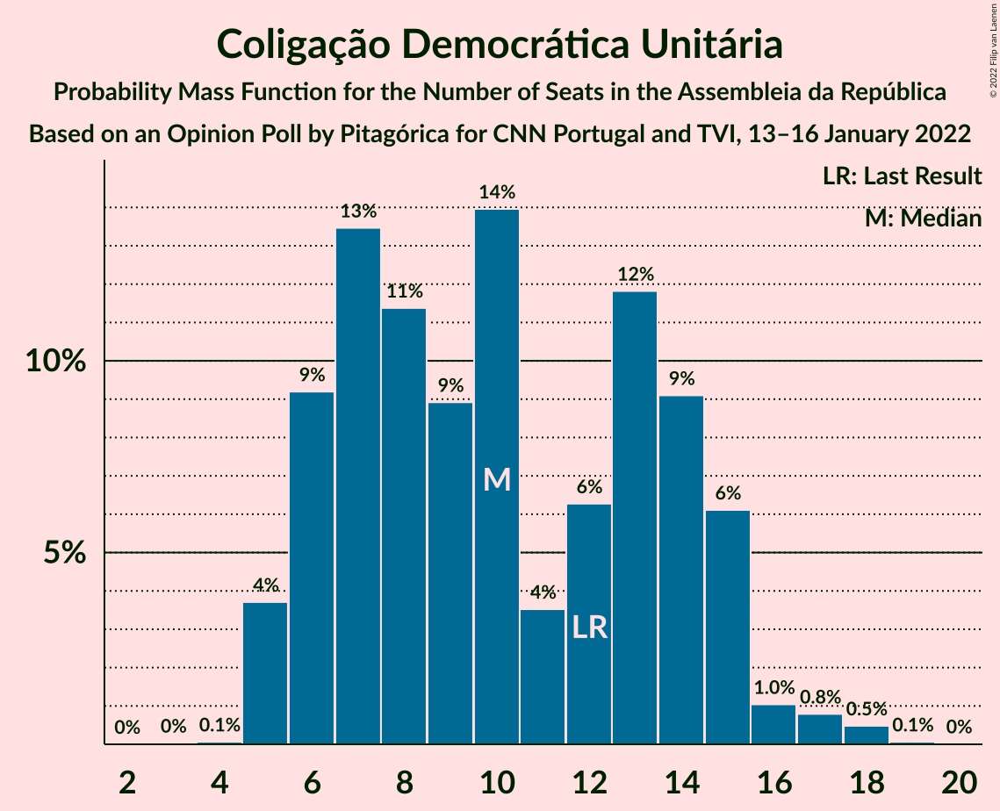

| Number of Seats | Probability | Accumulated | Special Marks |
|:---------------:|:-----------:|:-----------:|:-------------:|
| 4 | 0.1% | 100% |  |
| 5 | 4% | 99.9% |  |
| 6 | 9% | 96% |  |
| 7 | 13% | 87% |  |
| 8 | 11% | 74% |  |
| 9 | 9% | 62% |  |
| 10 | 14% | 53% | Median |
| 11 | 4% | 39% |  |
| 12 | 6% | 36% | Last Result |
| 13 | 12% | 29% |  |
| 14 | 9% | 18% |  |
| 15 | 6% | 9% |  |
| 16 | 1.0% | 2% |  |
| 17 | 0.8% | 1.4% |  |
| 18 | 0.5% | 0.6% |  |
| 19 | 0.1% | 0.1% |  |
| 20 | 0% | 0% |  |

### Iniciativa Liberal

*For a full overview of the results for this party, see the [Iniciativa Liberal](party-iniciativaliberal.html) page.*

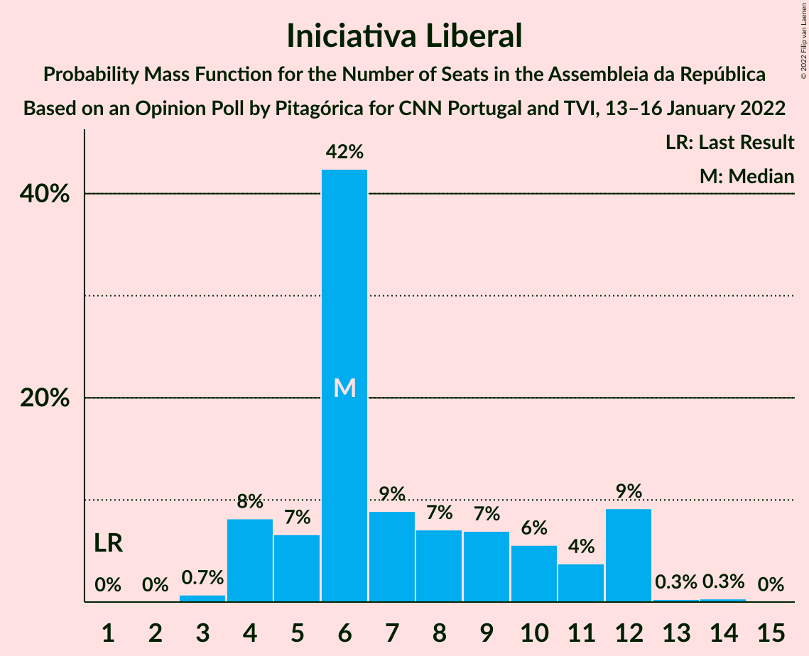

| Number of Seats | Probability | Accumulated | Special Marks |
|:---------------:|:-----------:|:-----------:|:-------------:|
| 1 | 0% | 100% | Last Result |
| 2 | 0% | 100% |  |
| 3 | 0.7% | 100% |  |
| 4 | 8% | 99.3% |  |
| 5 | 7% | 91% |  |
| 6 | 42% | 84% | Median |
| 7 | 9% | 42% |  |
| 8 | 7% | 33% |  |
| 9 | 7% | 26% |  |
| 10 | 6% | 19% |  |
| 11 | 4% | 14% |  |
| 12 | 9% | 10% |  |
| 13 | 0.3% | 0.6% |  |
| 14 | 0.3% | 0.4% |  |
| 15 | 0% | 0% |  |

### Pessoas–Animais–Natureza

*For a full overview of the results for this party, see the [Pessoas–Animais–Natureza](party-pessoas–animais–natureza.html) page.*

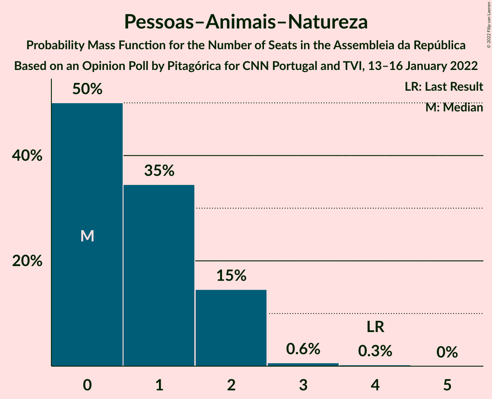

| Number of Seats | Probability | Accumulated | Special Marks |
|:---------------:|:-----------:|:-----------:|:-------------:|
| 0 | 50% | 100% | Median |
| 1 | 35% | 50% |  |
| 2 | 15% | 15% |  |
| 3 | 0.6% | 0.9% |  |
| 4 | 0.3% | 0.3% | Last Result |
| 5 | 0% | 0% |  |

### LIVRE

*For a full overview of the results for this party, see the [LIVRE](party-livre.html) page.*

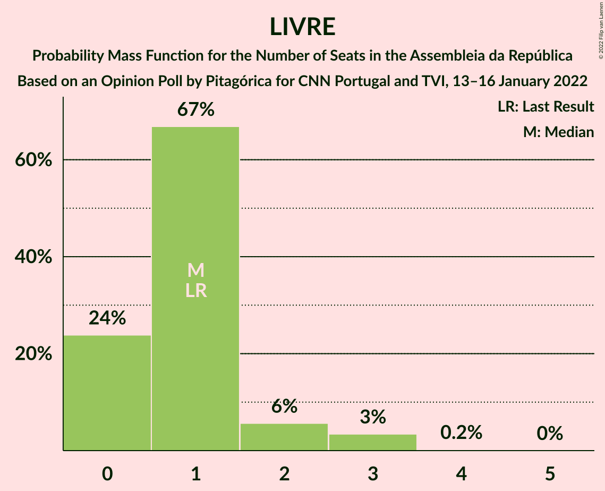

| Number of Seats | Probability | Accumulated | Special Marks |
|:---------------:|:-----------:|:-----------:|:-------------:|
| 0 | 24% | 100% |  |
| 1 | 67% | 76% | Last Result, Median |
| 2 | 6% | 9% |  |
| 3 | 3% | 4% |  |
| 4 | 0.2% | 0.2% |  |
| 5 | 0% | 0% |  |

### CDS–Partido Popular

*For a full overview of the results for this party, see the [CDS–Partido Popular](party-cds–partidopopular.html) page.*

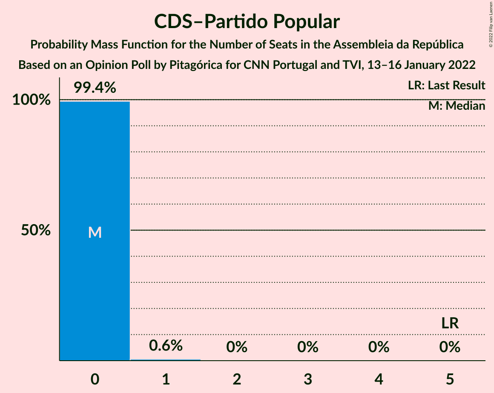

| Number of Seats | Probability | Accumulated | Special Marks |
|:---------------:|:-----------:|:-----------:|:-------------:|
| 0 | 99.4% | 100% | Median |
| 1 | 0.6% | 0.6% |  |
| 2 | 0% | 0% |  |
| 3 | 0% | 0% |  |
| 4 | 0% | 0% |  |
| 5 | 0% | 0% | Last Result |

## Coalitions

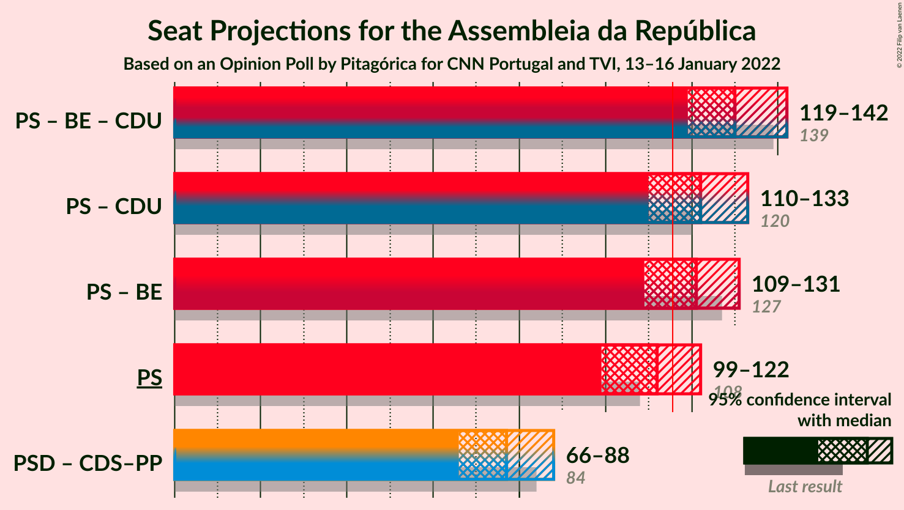

### Confidence Intervals

| Coalition | Last Result | Median | Majority? | 80% Confidence Interval | 90% Confidence Interval | 95% Confidence Interval | 99% Confidence Interval |
|:---------:|:-----------:|:------:|:---------:|:-----------------------:|:-----------------------:|:-----------------------:|:-----------------------:|
| Partido Socialista – Bloco de Esquerda – Coligação Democrática Unitária | 139 | 130 | 99.2% | 123–138 | 121–140 | 119–142 | 113–147 |
| Partido Socialista – Coligação Democrática Unitária | 120 | 122 | 86% | 114–129 | 112–131 | 110–133 | 105–138 |
| Partido Socialista – Bloco de Esquerda | 127 | 121 | 81% | 113–128 | 111–130 | 109–131 | 105–137 |
| Partido Socialista | 108 | 112 | 25% | 105–120 | 103–121 | 99–122 | 96–127 |
| Partido Social Democrata – CDS–Partido Popular | 84 | 77 | 0% | 70–84 | 68–86 | 66–88 | 63–92 |

### Partido Socialista – Bloco de Esquerda – Coligação Democrática Unitária

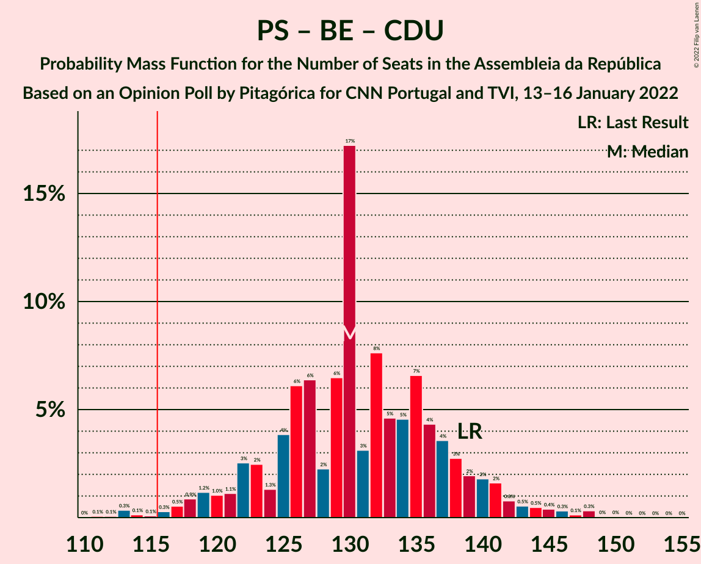

| Number of Seats | Probability | Accumulated | Special Marks |
|:---------------:|:-----------:|:-----------:|:-------------:|
| 110 | 0% | 100% |  |
| 111 | 0.1% | 99.9% |  |
| 112 | 0.1% | 99.9% |  |
| 113 | 0.3% | 99.8% |  |
| 114 | 0.1% | 99.5% |  |
| 115 | 0.1% | 99.3% |  |
| 116 | 0.3% | 99.2% | Majority |
| 117 | 0.5% | 99.0% |  |
| 118 | 0.9% | 98% |  |
| 119 | 1.2% | 98% |  |
| 120 | 1.0% | 96% |  |
| 121 | 1.1% | 95% |  |
| 122 | 3% | 94% |  |
| 123 | 2% | 92% |  |
| 124 | 1.3% | 89% |  |
| 125 | 4% | 88% |  |
| 126 | 6% | 84% |  |
| 127 | 6% | 78% |  |
| 128 | 2% | 72% |  |
| 129 | 6% | 69% |  |
| 130 | 17% | 63% | Median |
| 131 | 3% | 46% |  |
| 132 | 8% | 42% |  |
| 133 | 5% | 35% |  |
| 134 | 5% | 30% |  |
| 135 | 7% | 26% |  |
| 136 | 4% | 19% |  |
| 137 | 4% | 15% |  |
| 138 | 3% | 11% |  |
| 139 | 2% | 8% | Last Result |
| 140 | 2% | 6% |  |
| 141 | 2% | 5% |  |
| 142 | 0.8% | 3% |  |
| 143 | 0.5% | 2% |  |
| 144 | 0.5% | 2% |  |
| 145 | 0.4% | 1.3% |  |
| 146 | 0.3% | 0.9% |  |
| 147 | 0.1% | 0.6% |  |
| 148 | 0.3% | 0.4% |  |
| 149 | 0% | 0.1% |  |
| 150 | 0% | 0.1% |  |
| 151 | 0% | 0% |  |

### Partido Socialista – Coligação Democrática Unitária

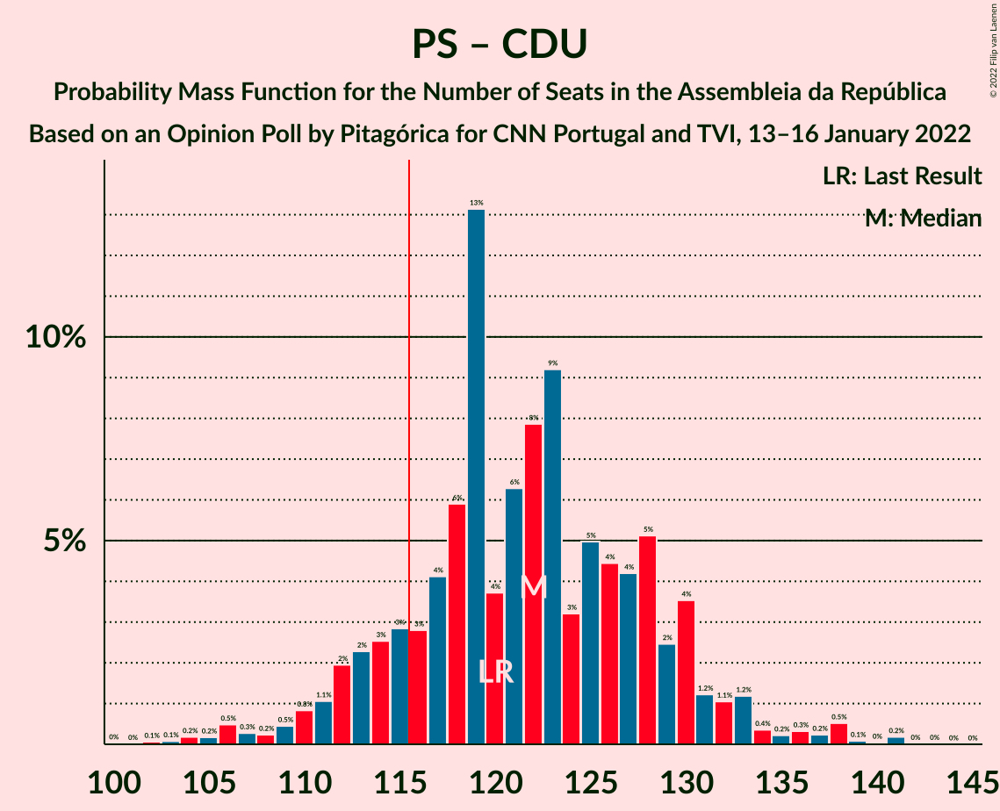

| Number of Seats | Probability | Accumulated | Special Marks |
|:---------------:|:-----------:|:-----------:|:-------------:|
| 100 | 0% | 100% |  |
| 101 | 0% | 99.9% |  |
| 102 | 0.1% | 99.9% |  |
| 103 | 0.1% | 99.9% |  |
| 104 | 0.2% | 99.8% |  |
| 105 | 0.2% | 99.6% |  |
| 106 | 0.5% | 99.4% |  |
| 107 | 0.3% | 99.0% |  |
| 108 | 0.2% | 98.7% |  |
| 109 | 0.5% | 98% |  |
| 110 | 0.8% | 98% |  |
| 111 | 1.1% | 97% |  |
| 112 | 2% | 96% |  |
| 113 | 2% | 94% |  |
| 114 | 3% | 92% |  |
| 115 | 3% | 89% |  |
| 116 | 3% | 86% | Majority |
| 117 | 4% | 84% |  |
| 118 | 6% | 80% |  |
| 119 | 13% | 74% |  |
| 120 | 4% | 61% | Last Result |
| 121 | 6% | 57% |  |
| 122 | 8% | 50% | Median |
| 123 | 9% | 43% |  |
| 124 | 3% | 33% |  |
| 125 | 5% | 30% |  |
| 126 | 4% | 25% |  |
| 127 | 4% | 21% |  |
| 128 | 5% | 17% |  |
| 129 | 2% | 11% |  |
| 130 | 4% | 9% |  |
| 131 | 1.2% | 5% |  |
| 132 | 1.1% | 4% |  |
| 133 | 1.2% | 3% |  |
| 134 | 0.4% | 2% |  |
| 135 | 0.2% | 2% |  |
| 136 | 0.3% | 1.4% |  |
| 137 | 0.2% | 1.1% |  |
| 138 | 0.5% | 0.9% |  |
| 139 | 0.1% | 0.3% |  |
| 140 | 0% | 0.3% |  |
| 141 | 0.2% | 0.2% |  |
| 142 | 0% | 0% |  |

### Partido Socialista – Bloco de Esquerda

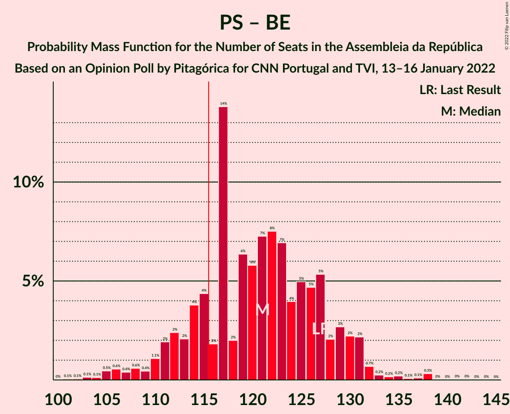

| Number of Seats | Probability | Accumulated | Special Marks |
|:---------------:|:-----------:|:-----------:|:-------------:|
| 100 | 0% | 100% |  |
| 101 | 0.1% | 99.9% |  |
| 102 | 0.1% | 99.9% |  |
| 103 | 0.1% | 99.8% |  |
| 104 | 0.1% | 99.7% |  |
| 105 | 0.5% | 99.6% |  |
| 106 | 0.6% | 99.1% |  |
| 107 | 0.4% | 98.6% |  |
| 108 | 0.6% | 98% |  |
| 109 | 0.4% | 98% |  |
| 110 | 1.1% | 97% |  |
| 111 | 2% | 96% |  |
| 112 | 2% | 94% |  |
| 113 | 2% | 92% |  |
| 114 | 4% | 90% |  |
| 115 | 4% | 86% |  |
| 116 | 2% | 81% | Majority |
| 117 | 14% | 80% |  |
| 118 | 2% | 66% |  |
| 119 | 6% | 64% |  |
| 120 | 6% | 58% | Median |
| 121 | 7% | 52% |  |
| 122 | 8% | 44% |  |
| 123 | 7% | 37% |  |
| 124 | 4% | 30% |  |
| 125 | 5% | 26% |  |
| 126 | 5% | 21% |  |
| 127 | 5% | 16% | Last Result |
| 128 | 2% | 11% |  |
| 129 | 3% | 9% |  |
| 130 | 2% | 6% |  |
| 131 | 2% | 4% |  |
| 132 | 0.7% | 2% |  |
| 133 | 0.2% | 1.2% |  |
| 134 | 0.2% | 1.0% |  |
| 135 | 0.2% | 0.8% |  |
| 136 | 0.1% | 0.6% |  |
| 137 | 0.1% | 0.5% |  |
| 138 | 0.3% | 0.4% |  |
| 139 | 0% | 0.1% |  |
| 140 | 0% | 0.1% |  |
| 141 | 0% | 0.1% |  |
| 142 | 0% | 0.1% |  |
| 143 | 0% | 0% |  |

### Partido Socialista

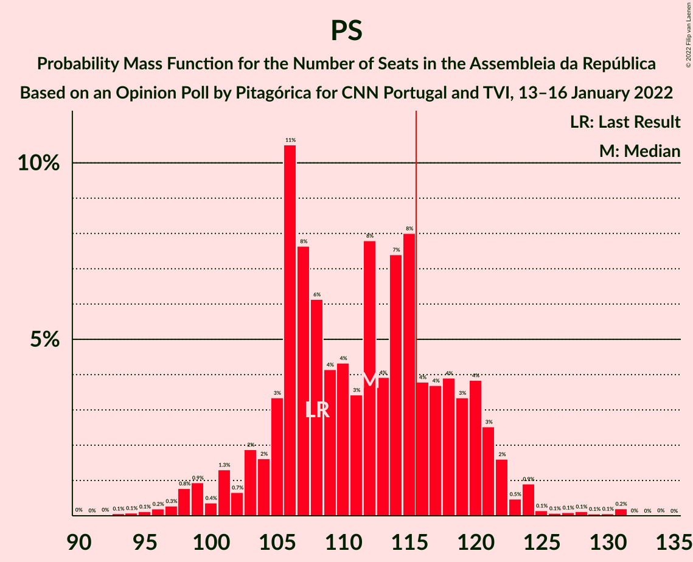

| Number of Seats | Probability | Accumulated | Special Marks |
|:---------------:|:-----------:|:-----------:|:-------------:|
| 90 | 0% | 100% |  |
| 91 | 0% | 99.9% |  |
| 92 | 0% | 99.9% |  |
| 93 | 0.1% | 99.9% |  |
| 94 | 0.1% | 99.8% |  |
| 95 | 0.1% | 99.7% |  |
| 96 | 0.2% | 99.6% |  |
| 97 | 0.3% | 99.4% |  |
| 98 | 0.8% | 99.1% |  |
| 99 | 0.9% | 98% |  |
| 100 | 0.4% | 97% |  |
| 101 | 1.3% | 97% |  |
| 102 | 0.7% | 96% |  |
| 103 | 2% | 95% |  |
| 104 | 2% | 93% |  |
| 105 | 3% | 92% |  |
| 106 | 11% | 88% |  |
| 107 | 8% | 78% |  |
| 108 | 6% | 70% | Last Result |
| 109 | 4% | 64% |  |
| 110 | 4% | 60% |  |
| 111 | 3% | 55% |  |
| 112 | 8% | 52% | Median |
| 113 | 4% | 44% |  |
| 114 | 7% | 40% |  |
| 115 | 8% | 33% |  |
| 116 | 4% | 25% | Majority |
| 117 | 4% | 21% |  |
| 118 | 4% | 17% |  |
| 119 | 3% | 14% |  |
| 120 | 4% | 10% |  |
| 121 | 3% | 6% |  |
| 122 | 2% | 4% |  |
| 123 | 0.5% | 2% |  |
| 124 | 0.9% | 2% |  |
| 125 | 0.1% | 0.8% |  |
| 126 | 0.1% | 0.7% |  |
| 127 | 0.1% | 0.6% |  |
| 128 | 0.1% | 0.5% |  |
| 129 | 0.1% | 0.4% |  |
| 130 | 0.1% | 0.3% |  |
| 131 | 0.2% | 0.2% |  |
| 132 | 0% | 0% |  |

### Partido Social Democrata – CDS–Partido Popular

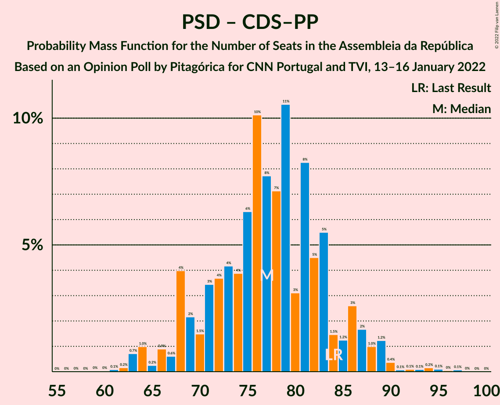

| Number of Seats | Probability | Accumulated | Special Marks |
|:---------------:|:-----------:|:-----------:|:-------------:|
| 59 | 0% | 100% |  |
| 60 | 0% | 99.9% |  |
| 61 | 0.1% | 99.9% |  |
| 62 | 0.2% | 99.8% |  |
| 63 | 0.7% | 99.7% |  |
| 64 | 1.0% | 99.0% |  |
| 65 | 0.2% | 98% |  |
| 66 | 0.9% | 98% |  |
| 67 | 0.6% | 97% |  |
| 68 | 4% | 96% |  |
| 69 | 2% | 92% |  |
| 70 | 1.5% | 90% |  |
| 71 | 3% | 89% |  |
| 72 | 4% | 85% |  |
| 73 | 4% | 81% |  |
| 74 | 4% | 77% |  |
| 75 | 6% | 73% |  |
| 76 | 10% | 67% |  |
| 77 | 8% | 57% | Median |
| 78 | 7% | 49% |  |
| 79 | 11% | 42% |  |
| 80 | 3% | 32% |  |
| 81 | 8% | 28% |  |
| 82 | 5% | 20% |  |
| 83 | 5% | 16% |  |
| 84 | 1.5% | 10% | Last Result |
| 85 | 1.2% | 9% |  |
| 86 | 3% | 7% |  |
| 87 | 2% | 5% |  |
| 88 | 1.0% | 3% |  |
| 89 | 1.2% | 2% |  |
| 90 | 0.4% | 1.0% |  |
| 91 | 0.1% | 0.6% |  |
| 92 | 0.1% | 0.6% |  |
| 93 | 0.1% | 0.5% |  |
| 94 | 0.2% | 0.4% |  |
| 95 | 0.1% | 0.2% |  |
| 96 | 0% | 0.1% |  |
| 97 | 0.1% | 0.1% |  |
| 98 | 0% | 0% |  |

## Technical Information

### Opinion Poll

+ **Polling firm:** Pitagórica
+ **Commissioner(s):** CNN Portugal and TVI
+ **Fieldwork period:** 13–16 January 2022

### Calculations

+ **Sample size:** 608
+ **Simulations done:** 1,048,576
+ **Error estimate:** 2.99%

