# Opinion Poll by CESOP–UCP for Público and RTP, 12–18 January 2022

<a href="#voting-intentions">Voting Intentions</a> | <a href="#seats">Seats</a> | <a href="#coalitions">Coalitions</a> | <a href="#technical-information">Technical Information</a>

## Voting Intentions

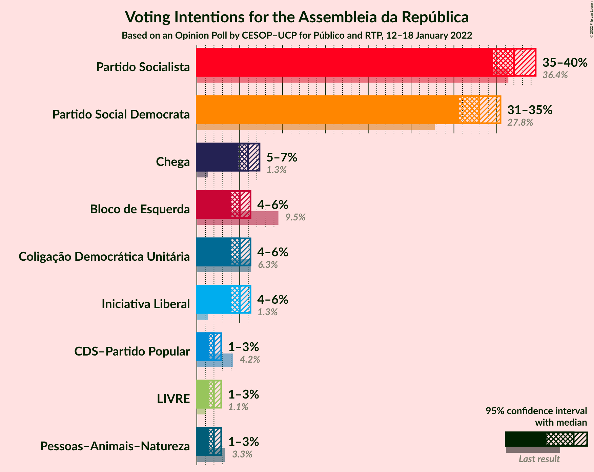

### Confidence Intervals

| Party | Last Result | Poll Result | 80% Confidence Interval | 90% Confidence Interval | 95% Confidence Interval | 99% Confidence Interval |
|:-----:|:-----------:|:-----------:|:-----------------------:|:-----------------------:|:-----------------------:|:-----------------------:|
| Partido Socialista | 36.4% | 37.0% | 35.4–38.7% |35.0–39.1% |34.6–39.5% |33.8–40.3% |
| Partido Social Democrata | 27.8% | 33.0% | 31.4–34.6% |31.0–35.0% |30.6–35.4% |29.9–36.2% |
| Chega | 1.3% | 6.0% | 5.2–6.9% |5.0–7.1% |4.9–7.3% |4.5–7.8% |
| Bloco de Esquerda | 9.5% | 5.0% | 4.3–5.8% |4.2–6.1% |4.0–6.3% |3.7–6.7% |
| Coligação Democrática Unitária | 6.3% | 5.0% | 4.3–5.8% |4.2–6.1% |4.0–6.3% |3.7–6.7% |
| Iniciativa Liberal | 1.3% | 5.0% | 4.3–5.8% |4.2–6.1% |4.0–6.3% |3.7–6.7% |
| CDS–Partido Popular | 4.2% | 2.0% | 1.6–2.6% |1.5–2.7% |1.4–2.9% |1.2–3.1% |
| Pessoas–Animais–Natureza | 3.3% | 2.0% | 1.6–2.6% |1.5–2.7% |1.4–2.9% |1.2–3.1% |
| LIVRE | 1.1% | 2.0% | 1.6–2.6% |1.5–2.7% |1.4–2.9% |1.2–3.1% |

*Note:* The poll result column reflects the actual value used in the calculations. Published results may vary slightly, and in addition be rounded to fewer digits.

## Seats

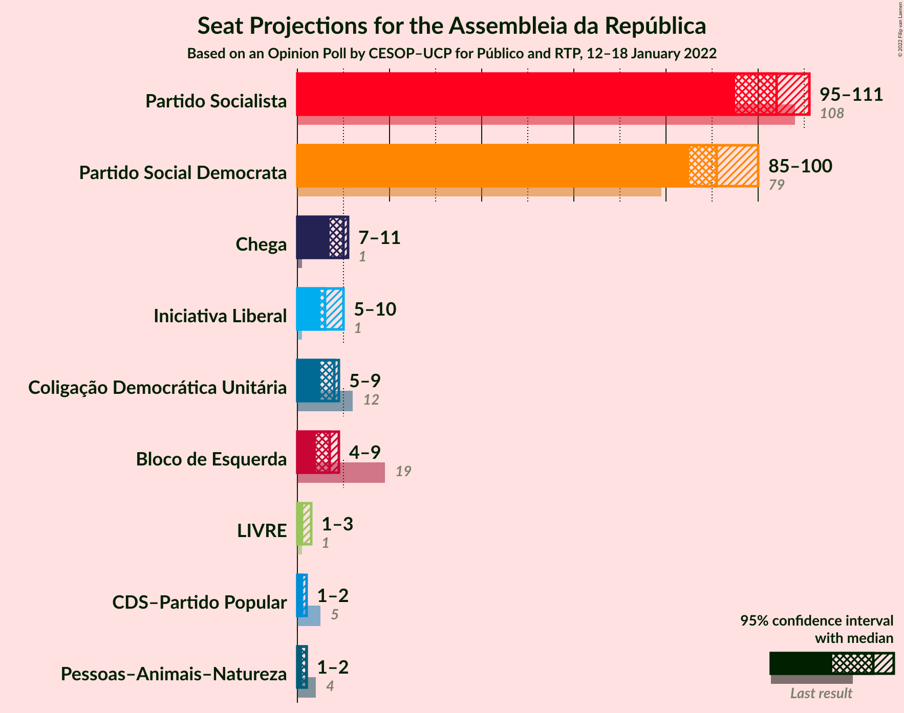

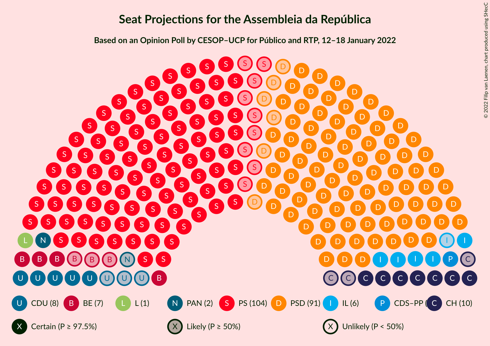

### Confidence Intervals

| Party | Last Result | Median | 80% Confidence Interval | 90% Confidence Interval | 95% Confidence Interval | 99% Confidence Interval |
|:-----:|:-----------:|:------:|:-----------------------:|:-----------------------:|:-----------------------:|:-----------------------:|
| <a href="#partido-socialista">Partido Socialista</a> | 108 | 104 | 97–108 |97–109 |95–111 |93–114 |
| <a href="#partido-social-democrata">Partido Social Democrata</a> | 79 | 91 | 87–98 |85–99 |85–100 |83–102 |
| <a href="#chega">Chega</a> | 1 | 10 | 8–11 |7–11 |7–11 |5–12 |
| <a href="#bloco-de-esquerda">Bloco de Esquerda</a> | 19 | 7 | 6–8 |5–9 |4–9 |3–11 |
| <a href="#coligação-democrática-unitária">Coligação Democrática Unitária</a> | 12 | 8 | 6–8 |5–8 |5–9 |5–14 |
| <a href="#iniciativa-liberal">Iniciativa Liberal</a> | 1 | 6 | 6–9 |6–9 |5–10 |5–11 |
| <a href="#cds–partido-popular">CDS–Partido Popular</a> | 5 | 1 | 1 |1–2 |1–2 |0–2 |
| <a href="#pessoas–animais–natureza">Pessoas–Animais–Natureza</a> | 4 | 2 | 1–2 |1–2 |1–2 |0–4 |
| <a href="#livre">LIVRE</a> | 1 | 1 | 1–2 |1–3 |1–3 |1–3 |

### Partido Socialista

*For a full overview of the results for this party, see the [Partido Socialista](party-partidosocialista.html) page.*

| Number of Seats | Probability | Accumulated | Special Marks |
|:---------------:|:-----------:|:-----------:|:-------------:|
| 90 | 0.1% | 100% |  |
| 91 | 0.1% | 99.9% |  |
| 92 | 0.3% | 99.8% |  |
| 93 | 0.5% | 99.5% |  |
| 94 | 0.6% | 99.0% |  |
| 95 | 1.2% | 98% |  |
| 96 | 2% | 97% |  |
| 97 | 7% | 95% |  |
| 98 | 3% | 89% |  |
| 99 | 5% | 86% |  |
| 100 | 6% | 80% |  |
| 101 | 2% | 74% |  |
| 102 | 6% | 72% |  |
| 103 | 12% | 66% |  |
| 104 | 11% | 54% | Median |
| 105 | 10% | 43% |  |
| 106 | 13% | 33% |  |
| 107 | 7% | 20% |  |
| 108 | 6% | 13% | Last Result |
| 109 | 3% | 7% |  |
| 110 | 1.1% | 4% |  |
| 111 | 1.4% | 3% |  |
| 112 | 0.7% | 2% |  |
| 113 | 0.2% | 0.8% |  |
| 114 | 0.3% | 0.6% |  |
| 115 | 0.2% | 0.3% |  |
| 116 | 0% | 0.1% | Majority |
| 117 | 0.1% | 0.1% |  |
| 118 | 0% | 0% |  |

### Partido Social Democrata

*For a full overview of the results for this party, see the [Partido Social Democrata](party-partidosocialdemocrata.html) page.*

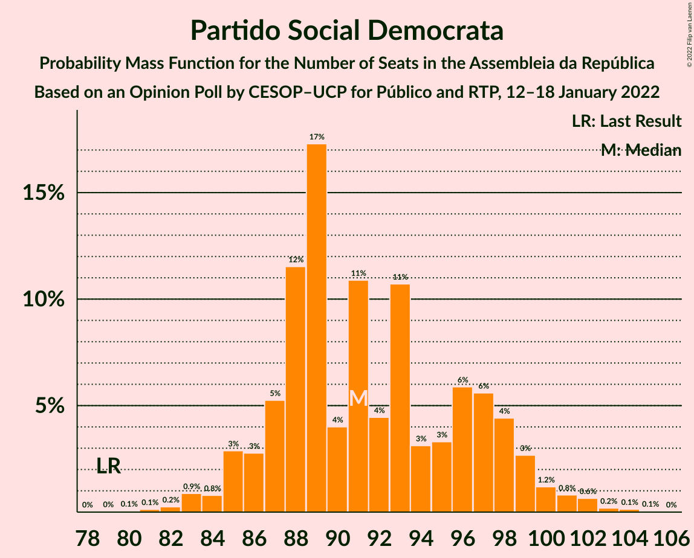

| Number of Seats | Probability | Accumulated | Special Marks |
|:---------------:|:-----------:|:-----------:|:-------------:|
| 79 | 0% | 100% | Last Result |
| 80 | 0.1% | 99.9% |  |
| 81 | 0.1% | 99.9% |  |
| 82 | 0.2% | 99.8% |  |
| 83 | 0.9% | 99.5% |  |
| 84 | 0.8% | 98.6% |  |
| 85 | 3% | 98% |  |
| 86 | 3% | 95% |  |
| 87 | 5% | 92% |  |
| 88 | 12% | 87% |  |
| 89 | 17% | 75% |  |
| 90 | 4% | 58% |  |
| 91 | 11% | 54% | Median |
| 92 | 4% | 43% |  |
| 93 | 11% | 39% |  |
| 94 | 3% | 28% |  |
| 95 | 3% | 25% |  |
| 96 | 6% | 22% |  |
| 97 | 6% | 16% |  |
| 98 | 4% | 10% |  |
| 99 | 3% | 6% |  |
| 100 | 1.2% | 3% |  |
| 101 | 0.8% | 2% |  |
| 102 | 0.6% | 1.1% |  |
| 103 | 0.2% | 0.4% |  |
| 104 | 0.1% | 0.2% |  |
| 105 | 0.1% | 0.1% |  |
| 106 | 0% | 0% |  |

### Chega

*For a full overview of the results for this party, see the [Chega](party-chega.html) page.*

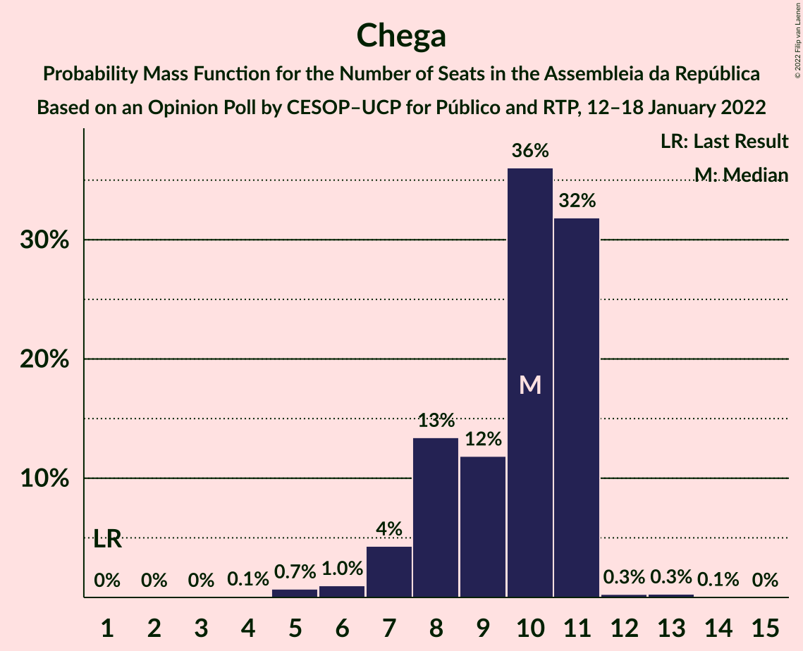

| Number of Seats | Probability | Accumulated | Special Marks |
|:---------------:|:-----------:|:-----------:|:-------------:|
| 1 | 0% | 100% | Last Result |
| 2 | 0% | 100% |  |
| 3 | 0% | 100% |  |
| 4 | 0.1% | 100% |  |
| 5 | 0.7% | 99.9% |  |
| 6 | 1.0% | 99.2% |  |
| 7 | 4% | 98% |  |
| 8 | 13% | 94% |  |
| 9 | 12% | 80% |  |
| 10 | 36% | 69% | Median |
| 11 | 32% | 33% |  |
| 12 | 0.3% | 0.7% |  |
| 13 | 0.3% | 0.4% |  |
| 14 | 0.1% | 0.1% |  |
| 15 | 0% | 0% |  |

### Bloco de Esquerda

*For a full overview of the results for this party, see the [Bloco de Esquerda](party-blocodeesquerda.html) page.*

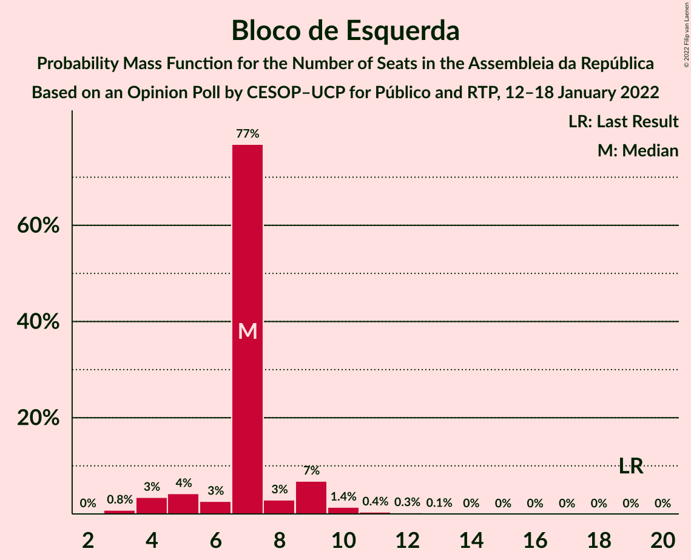

| Number of Seats | Probability | Accumulated | Special Marks |
|:---------------:|:-----------:|:-----------:|:-------------:|
| 3 | 0.8% | 100% |  |
| 4 | 3% | 99.2% |  |
| 5 | 4% | 96% |  |
| 6 | 3% | 91% |  |
| 7 | 77% | 89% | Median |
| 8 | 3% | 12% |  |
| 9 | 7% | 9% |  |
| 10 | 1.4% | 2% |  |
| 11 | 0.4% | 0.8% |  |
| 12 | 0.3% | 0.4% |  |
| 13 | 0.1% | 0.2% |  |
| 14 | 0% | 0% |  |
| 15 | 0% | 0% |  |
| 16 | 0% | 0% |  |
| 17 | 0% | 0% |  |
| 18 | 0% | 0% |  |
| 19 | 0% | 0% | Last Result |

### Coligação Democrática Unitária

*For a full overview of the results for this party, see the [Coligação Democrática Unitária](party-coligaçãodemocráticaunitária.html) page.*

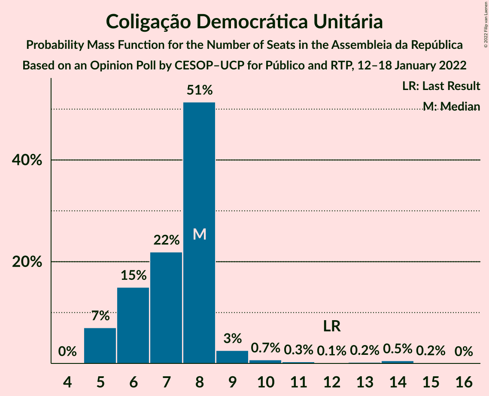

| Number of Seats | Probability | Accumulated | Special Marks |
|:---------------:|:-----------:|:-----------:|:-------------:|
| 5 | 7% | 100% |  |
| 6 | 15% | 93% |  |
| 7 | 22% | 78% |  |
| 8 | 51% | 56% | Median |
| 9 | 3% | 5% |  |
| 10 | 0.7% | 2% |  |
| 11 | 0.3% | 1.4% |  |
| 12 | 0.1% | 1.0% | Last Result |
| 13 | 0.2% | 0.9% |  |
| 14 | 0.5% | 0.7% |  |
| 15 | 0.2% | 0.2% |  |
| 16 | 0% | 0% |  |

### Iniciativa Liberal

*For a full overview of the results for this party, see the [Iniciativa Liberal](party-iniciativaliberal.html) page.*

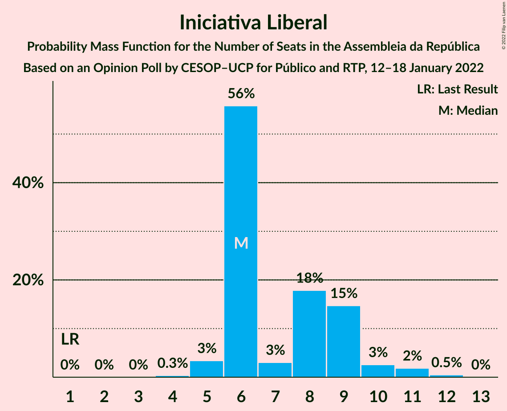

| Number of Seats | Probability | Accumulated | Special Marks |
|:---------------:|:-----------:|:-----------:|:-------------:|
| 1 | 0% | 100% | Last Result |
| 2 | 0% | 100% |  |
| 3 | 0% | 100% |  |
| 4 | 0.3% | 100% |  |
| 5 | 3% | 99.7% |  |
| 6 | 56% | 96% | Median |
| 7 | 3% | 40% |  |
| 8 | 18% | 37% |  |
| 9 | 15% | 20% |  |
| 10 | 3% | 5% |  |
| 11 | 2% | 2% |  |
| 12 | 0.5% | 0.5% |  |
| 13 | 0% | 0% |  |

### CDS–Partido Popular

*For a full overview of the results for this party, see the [CDS–Partido Popular](party-cds–partidopopular.html) page.*

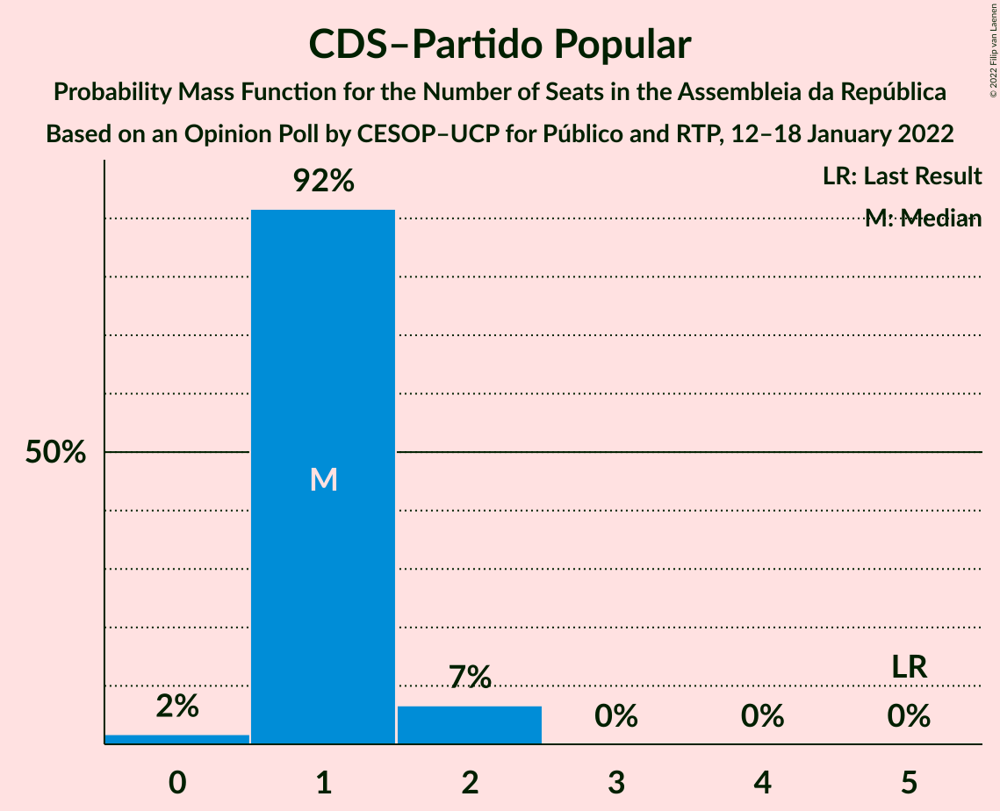

| Number of Seats | Probability | Accumulated | Special Marks |
|:---------------:|:-----------:|:-----------:|:-------------:|
| 0 | 2% | 100% |  |
| 1 | 92% | 98% | Median |
| 2 | 7% | 7% |  |
| 3 | 0% | 0% |  |
| 4 | 0% | 0% |  |
| 5 | 0% | 0% | Last Result |

### Pessoas–Animais–Natureza

*For a full overview of the results for this party, see the [Pessoas–Animais–Natureza](party-pessoas–animais–natureza.html) page.*

| Number of Seats | Probability | Accumulated | Special Marks |
|:---------------:|:-----------:|:-----------:|:-------------:|
| 0 | 2% | 100% |  |
| 1 | 29% | 98% |  |
| 2 | 67% | 70% | Median |
| 3 | 0.9% | 2% |  |
| 4 | 1.4% | 1.4% | Last Result |
| 5 | 0% | 0% |  |

### LIVRE

*For a full overview of the results for this party, see the [LIVRE](party-livre.html) page.*

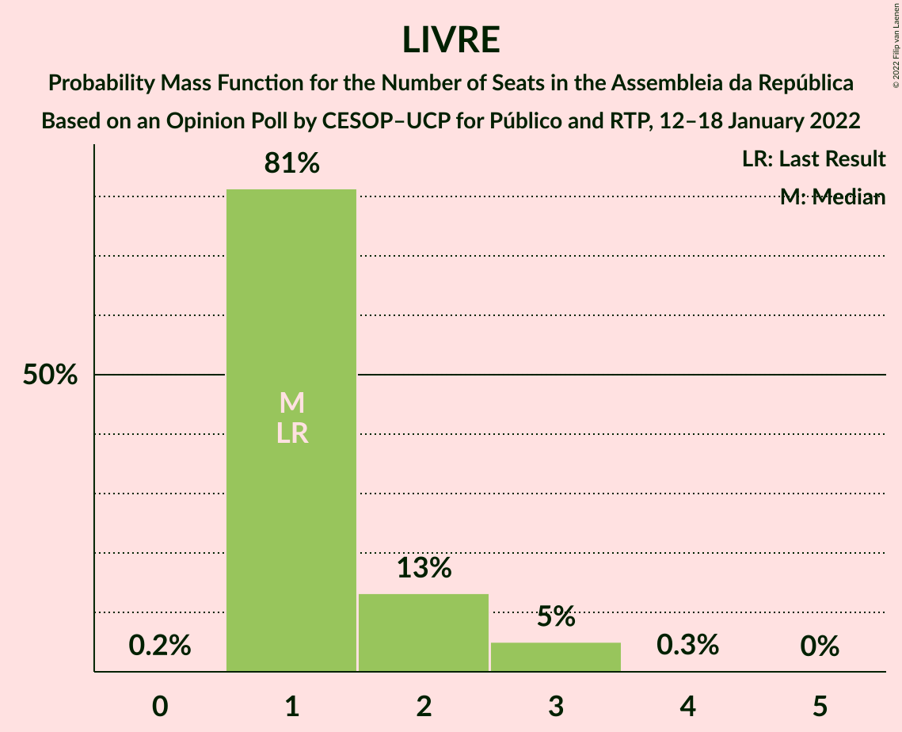

| Number of Seats | Probability | Accumulated | Special Marks |
|:---------------:|:-----------:|:-----------:|:-------------:|
| 0 | 0.2% | 100% |  |
| 1 | 81% | 99.8% | Last Result, Median |
| 2 | 13% | 19% |  |
| 3 | 5% | 5% |  |
| 4 | 0.3% | 0.3% |  |
| 5 | 0% | 0% |  |

## Coalitions

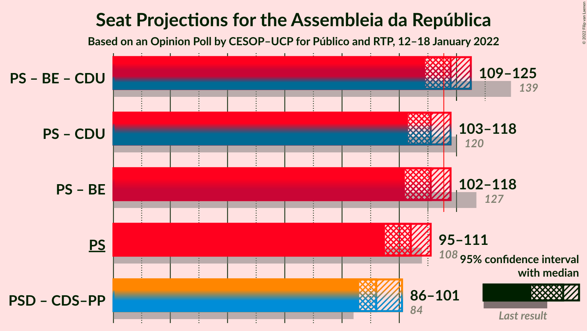

### Confidence Intervals

| Coalition | Last Result | Median | Majority? | 80% Confidence Interval | 90% Confidence Interval | 95% Confidence Interval | 99% Confidence Interval |
|:---------:|:-----------:|:------:|:---------:|:-----------------------:|:-----------------------:|:-----------------------:|:-----------------------:|
| Partido Socialista – Bloco de Esquerda – Coligação Democrática Unitária | 139 | 118 | 72% | 112–122 | 111–123 | 109–125 | 106–128 |
| Partido Socialista – Coligação Democrática Unitária | 120 | 111 | 8% | 105–115 | 104–116 | 103–118 | 99–121 |
| Partido Socialista – Bloco de Esquerda | 127 | 111 | 6% | 105–115 | 104–116 | 102–118 | 99–121 |
| Partido Socialista | 108 | 104 | 0.1% | 97–108 | 97–109 | 95–111 | 93–114 |
| Partido Social Democrata – CDS–Partido Popular | 84 | 92 | 0% | 88–99 | 87–100 | 86–101 | 83–104 |

### Partido Socialista – Bloco de Esquerda – Coligação Democrática Unitária

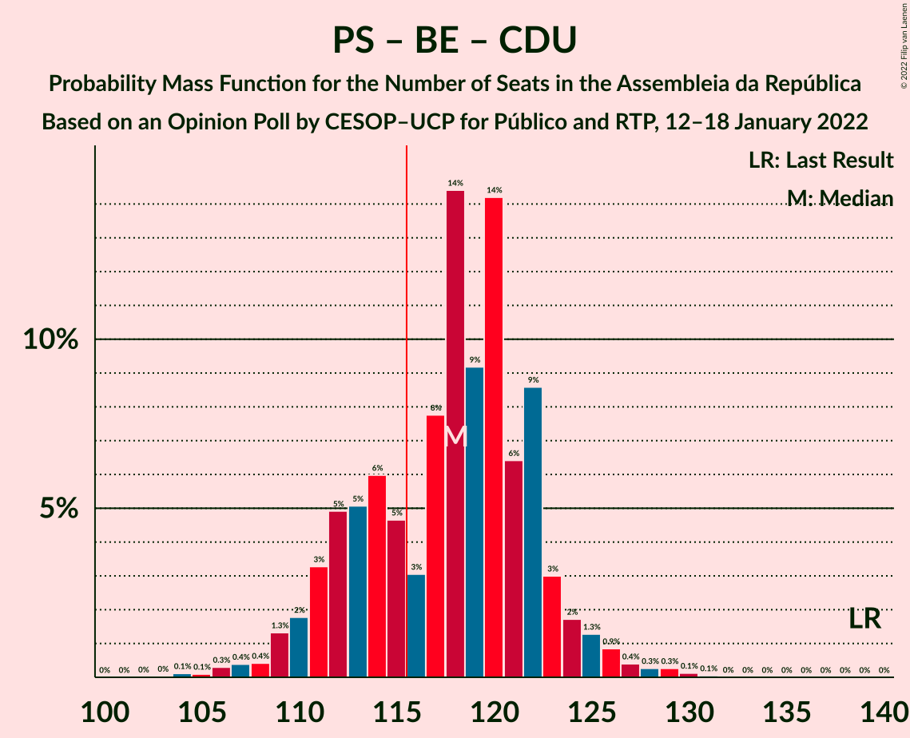

| Number of Seats | Probability | Accumulated | Special Marks |
|:---------------:|:-----------:|:-----------:|:-------------:|
| 103 | 0% | 100% |  |
| 104 | 0.1% | 99.9% |  |
| 105 | 0.1% | 99.8% |  |
| 106 | 0.3% | 99.7% |  |
| 107 | 0.4% | 99.4% |  |
| 108 | 0.4% | 99.0% |  |
| 109 | 1.3% | 98.6% |  |
| 110 | 2% | 97% |  |
| 111 | 3% | 96% |  |
| 112 | 5% | 92% |  |
| 113 | 5% | 87% |  |
| 114 | 6% | 82% |  |
| 115 | 5% | 76% |  |
| 116 | 3% | 72% | Majority |
| 117 | 8% | 69% |  |
| 118 | 14% | 61% |  |
| 119 | 9% | 46% | Median |
| 120 | 14% | 37% |  |
| 121 | 6% | 23% |  |
| 122 | 9% | 17% |  |
| 123 | 3% | 8% |  |
| 124 | 2% | 5% |  |
| 125 | 1.3% | 3% |  |
| 126 | 0.9% | 2% |  |
| 127 | 0.4% | 1.1% |  |
| 128 | 0.3% | 0.7% |  |
| 129 | 0.3% | 0.5% |  |
| 130 | 0.1% | 0.2% |  |
| 131 | 0.1% | 0.1% |  |
| 132 | 0% | 0% |  |
| 133 | 0% | 0% |  |
| 134 | 0% | 0% |  |
| 135 | 0% | 0% |  |
| 136 | 0% | 0% |  |
| 137 | 0% | 0% |  |
| 138 | 0% | 0% |  |
| 139 | 0% | 0% | Last Result |

### Partido Socialista – Coligação Democrática Unitária

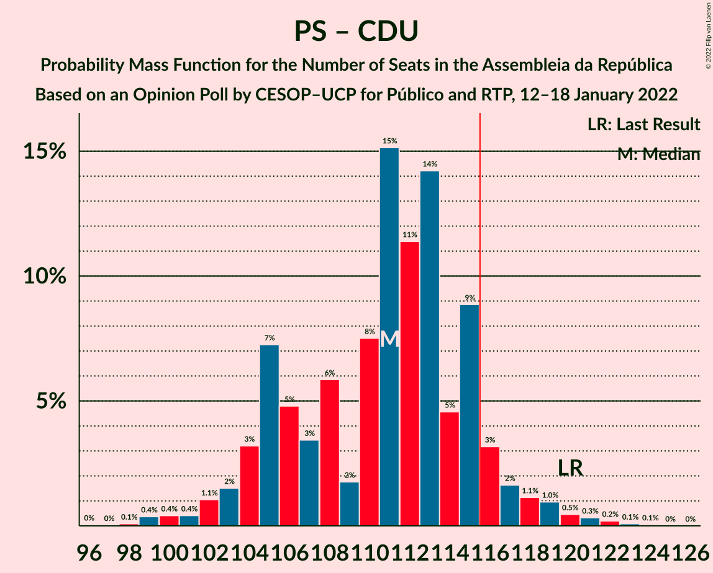

| Number of Seats | Probability | Accumulated | Special Marks |
|:---------------:|:-----------:|:-----------:|:-------------:|
| 96 | 0% | 100% |  |
| 97 | 0% | 99.9% |  |
| 98 | 0.1% | 99.9% |  |
| 99 | 0.4% | 99.8% |  |
| 100 | 0.4% | 99.5% |  |
| 101 | 0.4% | 99.0% |  |
| 102 | 1.1% | 98.6% |  |
| 103 | 2% | 98% |  |
| 104 | 3% | 96% |  |
| 105 | 7% | 93% |  |
| 106 | 5% | 86% |  |
| 107 | 3% | 81% |  |
| 108 | 6% | 77% |  |
| 109 | 2% | 72% |  |
| 110 | 8% | 70% |  |
| 111 | 15% | 62% |  |
| 112 | 11% | 47% | Median |
| 113 | 14% | 36% |  |
| 114 | 5% | 21% |  |
| 115 | 9% | 17% |  |
| 116 | 3% | 8% | Majority |
| 117 | 2% | 5% |  |
| 118 | 1.1% | 3% |  |
| 119 | 1.0% | 2% |  |
| 120 | 0.5% | 1.1% | Last Result |
| 121 | 0.3% | 0.7% |  |
| 122 | 0.2% | 0.4% |  |
| 123 | 0.1% | 0.2% |  |
| 124 | 0.1% | 0.1% |  |
| 125 | 0% | 0% |  |

### Partido Socialista – Bloco de Esquerda

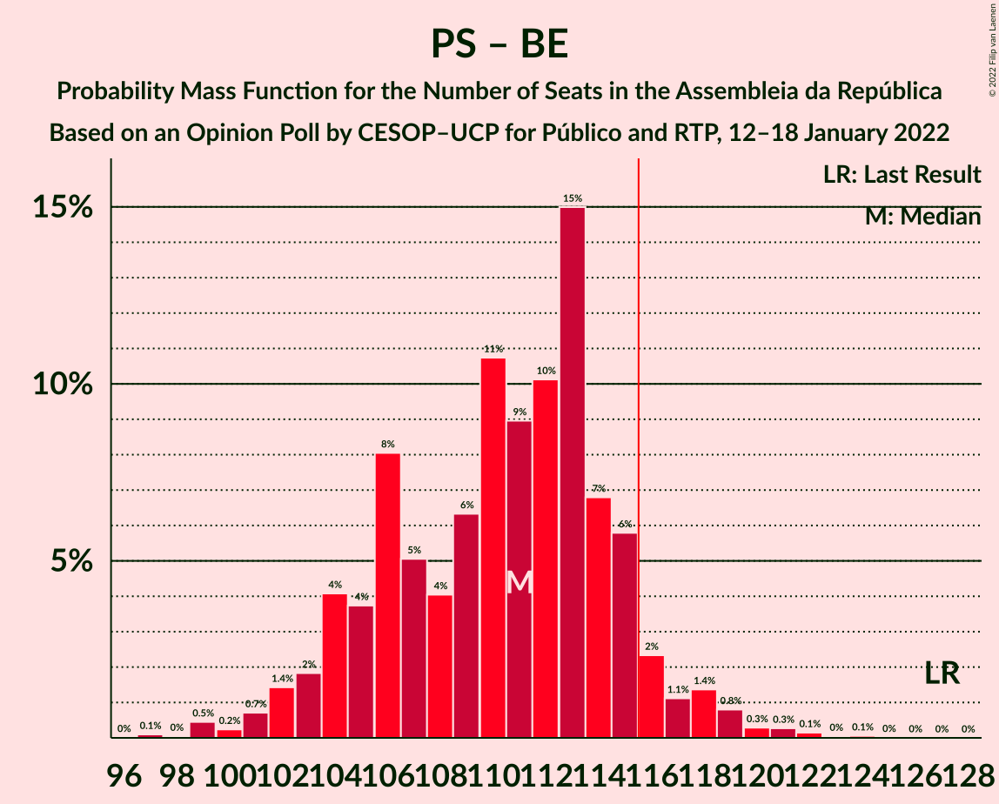

| Number of Seats | Probability | Accumulated | Special Marks |
|:---------------:|:-----------:|:-----------:|:-------------:|
| 97 | 0.1% | 100% |  |
| 98 | 0% | 99.9% |  |
| 99 | 0.5% | 99.8% |  |
| 100 | 0.2% | 99.4% |  |
| 101 | 0.7% | 99.1% |  |
| 102 | 1.4% | 98% |  |
| 103 | 2% | 97% |  |
| 104 | 4% | 95% |  |
| 105 | 4% | 91% |  |
| 106 | 8% | 87% |  |
| 107 | 5% | 79% |  |
| 108 | 4% | 74% |  |
| 109 | 6% | 70% |  |
| 110 | 11% | 64% |  |
| 111 | 9% | 53% | Median |
| 112 | 10% | 44% |  |
| 113 | 15% | 34% |  |
| 114 | 7% | 19% |  |
| 115 | 6% | 12% |  |
| 116 | 2% | 6% | Majority |
| 117 | 1.1% | 4% |  |
| 118 | 1.4% | 3% |  |
| 119 | 0.8% | 2% |  |
| 120 | 0.3% | 0.8% |  |
| 121 | 0.3% | 0.5% |  |
| 122 | 0.1% | 0.3% |  |
| 123 | 0% | 0.1% |  |
| 124 | 0.1% | 0.1% |  |
| 125 | 0% | 0% |  |
| 126 | 0% | 0% |  |
| 127 | 0% | 0% | Last Result |

### Partido Socialista

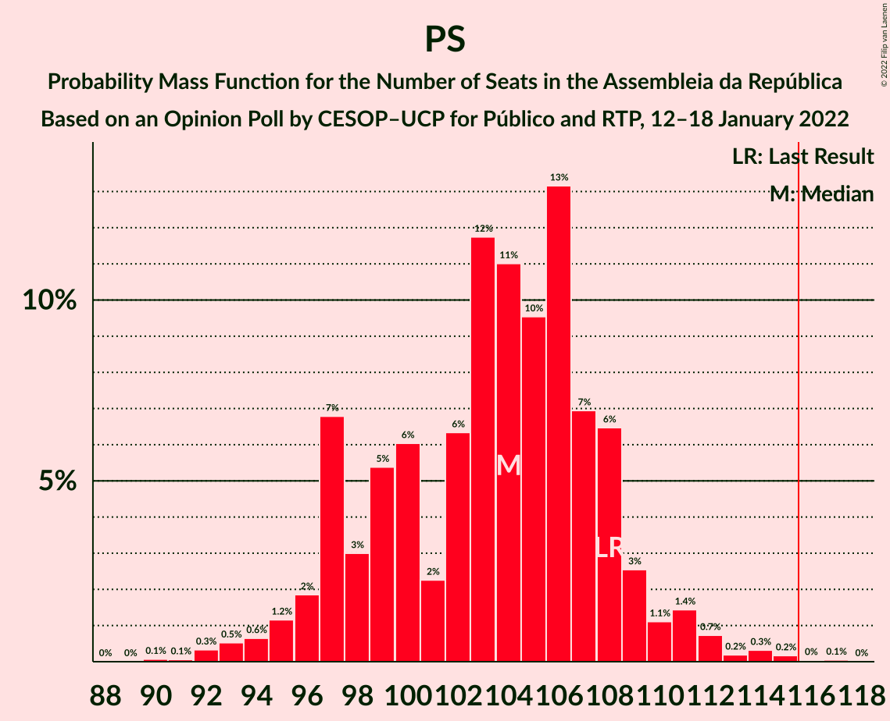

| Number of Seats | Probability | Accumulated | Special Marks |
|:---------------:|:-----------:|:-----------:|:-------------:|
| 90 | 0.1% | 100% |  |
| 91 | 0.1% | 99.9% |  |
| 92 | 0.3% | 99.8% |  |
| 93 | 0.5% | 99.5% |  |
| 94 | 0.6% | 99.0% |  |
| 95 | 1.2% | 98% |  |
| 96 | 2% | 97% |  |
| 97 | 7% | 95% |  |
| 98 | 3% | 89% |  |
| 99 | 5% | 86% |  |
| 100 | 6% | 80% |  |
| 101 | 2% | 74% |  |
| 102 | 6% | 72% |  |
| 103 | 12% | 66% |  |
| 104 | 11% | 54% | Median |
| 105 | 10% | 43% |  |
| 106 | 13% | 33% |  |
| 107 | 7% | 20% |  |
| 108 | 6% | 13% | Last Result |
| 109 | 3% | 7% |  |
| 110 | 1.1% | 4% |  |
| 111 | 1.4% | 3% |  |
| 112 | 0.7% | 2% |  |
| 113 | 0.2% | 0.8% |  |
| 114 | 0.3% | 0.6% |  |
| 115 | 0.2% | 0.3% |  |
| 116 | 0% | 0.1% | Majority |
| 117 | 0.1% | 0.1% |  |
| 118 | 0% | 0% |  |

### Partido Social Democrata – CDS–Partido Popular

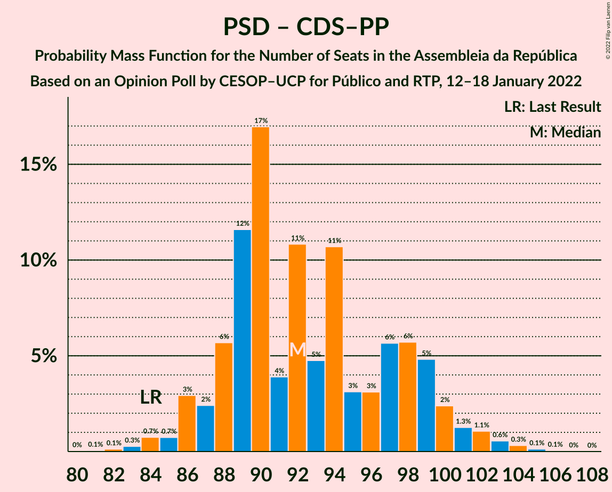

| Number of Seats | Probability | Accumulated | Special Marks |
|:---------------:|:-----------:|:-----------:|:-------------:|
| 80 | 0% | 100% |  |
| 81 | 0.1% | 99.9% |  |
| 82 | 0.1% | 99.9% |  |
| 83 | 0.3% | 99.8% |  |
| 84 | 0.7% | 99.5% | Last Result |
| 85 | 0.7% | 98.7% |  |
| 86 | 3% | 98% |  |
| 87 | 2% | 95% |  |
| 88 | 6% | 93% |  |
| 89 | 12% | 87% |  |
| 90 | 17% | 75% |  |
| 91 | 4% | 58% |  |
| 92 | 11% | 55% | Median |
| 93 | 5% | 44% |  |
| 94 | 11% | 39% |  |
| 95 | 3% | 28% |  |
| 96 | 3% | 25% |  |
| 97 | 6% | 22% |  |
| 98 | 6% | 16% |  |
| 99 | 5% | 11% |  |
| 100 | 2% | 6% |  |
| 101 | 1.3% | 3% |  |
| 102 | 1.1% | 2% |  |
| 103 | 0.6% | 1.1% |  |
| 104 | 0.3% | 0.5% |  |
| 105 | 0.1% | 0.2% |  |
| 106 | 0.1% | 0.1% |  |
| 107 | 0% | 0% |  |

## Technical Information

### Opinion Poll

+ **Polling firm:** CESOP–UCP
+ **Commissioner(s):** Público and RTP
+ **Fieldwork period:** 12–18 January 2022

### Calculations

+ **Sample size:** 1456
+ **Simulations done:** 1,048,576
+ **Error estimate:** 1.23%

