# Opinion Poll by Pitagórica for CNN Portugal and TVI, 16–19 January 2022

<a href="#voting-intentions">Voting Intentions</a> | <a href="#seats">Seats</a> | <a href="#coalitions">Coalitions</a> | <a href="#technical-information">Technical Information</a>

## Voting Intentions

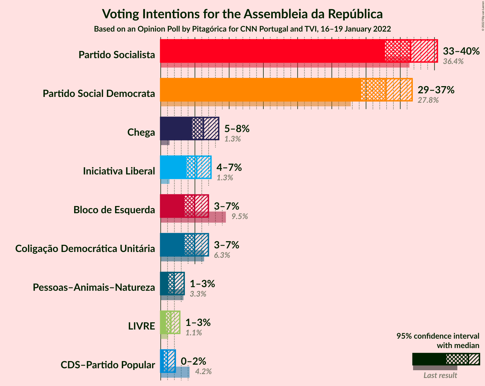

### Confidence Intervals

| Party | Last Result | Poll Result | 80% Confidence Interval | 90% Confidence Interval | 95% Confidence Interval | 99% Confidence Interval |
|:-----:|:-----------:|:-----------:|:-----------------------:|:-----------------------:|:-----------------------:|:-----------------------:|
| Partido Socialista | 36.4% | 36.5% | 34.1–39.1% |33.4–39.8% |32.8–40.4% |31.6–41.7% |
| Partido Social Democrata | 27.8% | 32.9% | 30.5–35.4% |29.8–36.1% |29.3–36.7% |28.2–38.0% |
| Chega | 1.3% | 6.2% | 5.2–7.7% |4.8–8.1% |4.6–8.5% |4.1–9.2% |
| Iniciativa Liberal | 1.3% | 5.3% | 4.3–6.6% |4.0–7.0% |3.7–7.3% |3.3–8.0% |
| Bloco de Esquerda | 9.5% | 4.9% | 4.0–6.2% |3.7–6.6% |3.5–7.0% |3.1–7.7% |
| Coligação Democrática Unitária | 6.3% | 4.9% | 4.0–6.2% |3.7–6.6% |3.5–7.0% |3.1–7.7% |
| Pessoas–Animais–Natureza | 3.3% | 2.0% | 1.4–2.9% |1.3–3.2% |1.1–3.4% |0.9–3.9% |
| LIVRE | 1.1% | 1.5% | 1.0–2.3% |0.9–2.6% |0.8–2.8% |0.6–3.3% |
| CDS–Partido Popular | 4.2% | 1.0% | 0.6–1.7% |0.5–1.9% |0.5–2.1% |0.3–2.6% |

*Note:* The poll result column reflects the actual value used in the calculations. Published results may vary slightly, and in addition be rounded to fewer digits.

## Seats

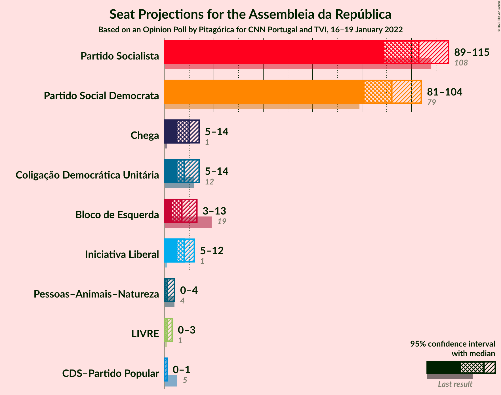

### Confidence Intervals

| Party | Last Result | Median | 80% Confidence Interval | 90% Confidence Interval | 95% Confidence Interval | 99% Confidence Interval |
|:-----:|:-----------:|:------:|:-----------------------:|:-----------------------:|:-----------------------:|:-----------------------:|
| <a href="#partido-socialista">Partido Socialista</a> | 108 | 103 | 94–110 |91–112 |89–115 |87–118 |
| <a href="#partido-social-democrata">Partido Social Democrata</a> | 79 | 92 | 84–99 |82–102 |81–104 |77–109 |
| <a href="#chega">Chega</a> | 1 | 10 | 8–11 |6–13 |5–14 |4–17 |
| <a href="#iniciativa-liberal">Iniciativa Liberal</a> | 1 | 8 | 6–12 |6–12 |5–12 |4–14 |
| <a href="#bloco-de-esquerda">Bloco de Esquerda</a> | 19 | 7 | 4–11 |4–12 |3–13 |2–15 |
| <a href="#coligação-democrática-unitária">Coligação Democrática Unitária</a> | 12 | 8 | 5–11 |5–12 |5–14 |3–15 |
| <a href="#pessoas–animais–natureza">Pessoas–Animais–Natureza</a> | 4 | 1 | 0–2 |0–3 |0–4 |0–4 |
| <a href="#livre">LIVRE</a> | 1 | 1 | 1–2 |0–3 |0–3 |0–4 |
| <a href="#cds–partido-popular">CDS–Partido Popular</a> | 5 | 0 | 0 |0–1 |0–1 |0–1 |

### Partido Socialista

*For a full overview of the results for this party, see the [Partido Socialista](party-partidosocialista.html) page.*

| Number of Seats | Probability | Accumulated | Special Marks |
|:---------------:|:-----------:|:-----------:|:-------------:|
| 82 | 0% | 100% |  |
| 83 | 0% | 99.9% |  |
| 84 | 0.1% | 99.9% |  |
| 85 | 0.2% | 99.8% |  |
| 86 | 0.1% | 99.7% |  |
| 87 | 0.7% | 99.5% |  |
| 88 | 0.9% | 98.8% |  |
| 89 | 0.5% | 98% |  |
| 90 | 2% | 97% |  |
| 91 | 1.3% | 96% |  |
| 92 | 1.4% | 94% |  |
| 93 | 2% | 93% |  |
| 94 | 2% | 91% |  |
| 95 | 5% | 89% |  |
| 96 | 6% | 83% |  |
| 97 | 6% | 78% |  |
| 98 | 5% | 72% |  |
| 99 | 4% | 68% |  |
| 100 | 3% | 63% |  |
| 101 | 3% | 60% |  |
| 102 | 5% | 57% |  |
| 103 | 4% | 52% | Median |
| 104 | 12% | 49% |  |
| 105 | 5% | 36% |  |
| 106 | 8% | 32% |  |
| 107 | 4% | 24% |  |
| 108 | 3% | 20% | Last Result |
| 109 | 5% | 17% |  |
| 110 | 2% | 12% |  |
| 111 | 4% | 10% |  |
| 112 | 1.2% | 6% |  |
| 113 | 1.0% | 4% |  |
| 114 | 0.8% | 3% |  |
| 115 | 0.4% | 3% |  |
| 116 | 1.0% | 2% | Majority |
| 117 | 0.6% | 1.2% |  |
| 118 | 0.1% | 0.5% |  |
| 119 | 0.2% | 0.4% |  |
| 120 | 0.1% | 0.2% |  |
| 121 | 0.1% | 0.1% |  |
| 122 | 0% | 0% |  |

### Partido Social Democrata

*For a full overview of the results for this party, see the [Partido Social Democrata](party-partidosocialdemocrata.html) page.*

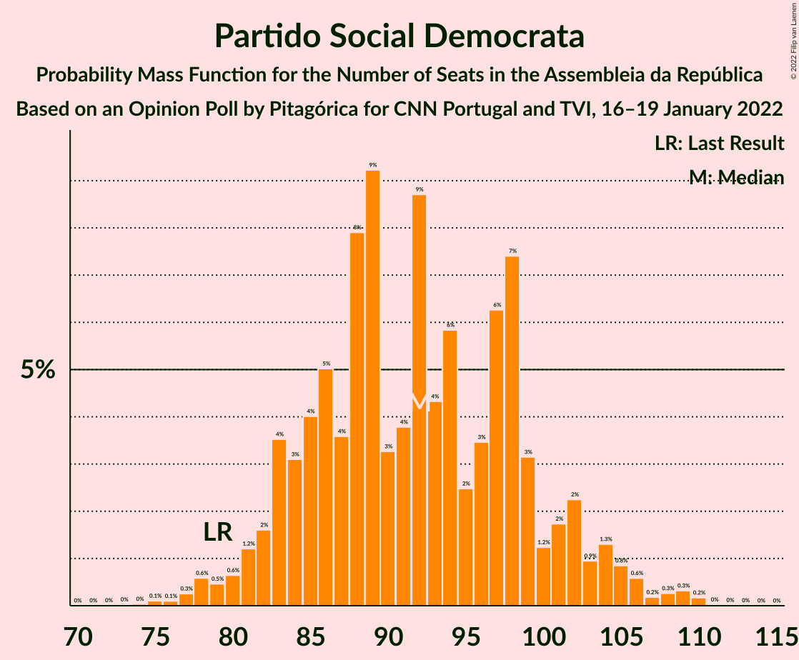

| Number of Seats | Probability | Accumulated | Special Marks |
|:---------------:|:-----------:|:-----------:|:-------------:|
| 74 | 0% | 100% |  |
| 75 | 0.1% | 99.9% |  |
| 76 | 0.1% | 99.8% |  |
| 77 | 0.3% | 99.7% |  |
| 78 | 0.6% | 99.5% |  |
| 79 | 0.5% | 98.9% | Last Result |
| 80 | 0.6% | 98% |  |
| 81 | 1.2% | 98% |  |
| 82 | 2% | 97% |  |
| 83 | 4% | 95% |  |
| 84 | 3% | 91% |  |
| 85 | 4% | 88% |  |
| 86 | 5% | 84% |  |
| 87 | 4% | 79% |  |
| 88 | 8% | 76% |  |
| 89 | 9% | 68% |  |
| 90 | 3% | 59% |  |
| 91 | 4% | 55% |  |
| 92 | 9% | 52% | Median |
| 93 | 4% | 43% |  |
| 94 | 6% | 38% |  |
| 95 | 2% | 33% |  |
| 96 | 3% | 30% |  |
| 97 | 6% | 27% |  |
| 98 | 7% | 20% |  |
| 99 | 3% | 13% |  |
| 100 | 1.2% | 10% |  |
| 101 | 2% | 9% |  |
| 102 | 2% | 7% |  |
| 103 | 0.9% | 5% |  |
| 104 | 1.3% | 4% |  |
| 105 | 0.8% | 2% |  |
| 106 | 0.6% | 2% |  |
| 107 | 0.2% | 1.0% |  |
| 108 | 0.3% | 0.8% |  |
| 109 | 0.3% | 0.5% |  |
| 110 | 0.2% | 0.2% |  |
| 111 | 0% | 0% |  |

### Chega

*For a full overview of the results for this party, see the [Chega](party-chega.html) page.*

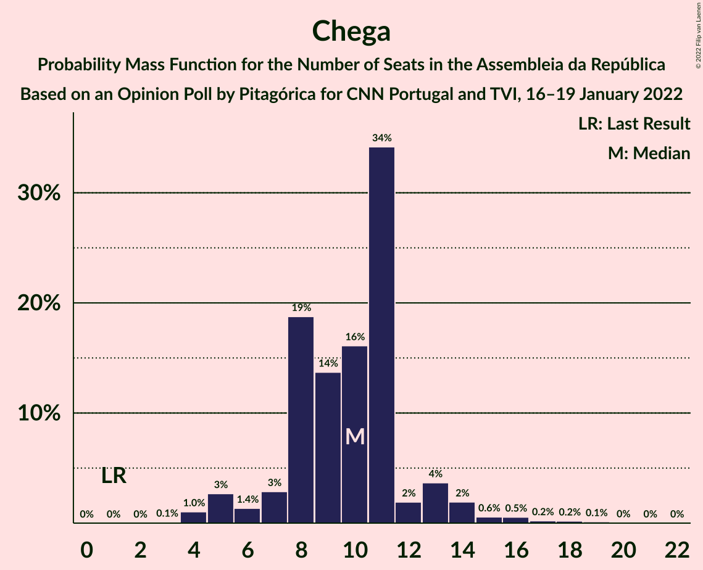

| Number of Seats | Probability | Accumulated | Special Marks |
|:---------------:|:-----------:|:-----------:|:-------------:|
| 1 | 0% | 100% | Last Result |
| 2 | 0% | 100% |  |
| 3 | 0.1% | 100% |  |
| 4 | 1.0% | 99.9% |  |
| 5 | 3% | 98.9% |  |
| 6 | 1.4% | 96% |  |
| 7 | 3% | 95% |  |
| 8 | 19% | 92% |  |
| 9 | 14% | 73% |  |
| 10 | 16% | 60% | Median |
| 11 | 34% | 43% |  |
| 12 | 2% | 9% |  |
| 13 | 4% | 7% |  |
| 14 | 2% | 4% |  |
| 15 | 0.6% | 2% |  |
| 16 | 0.5% | 1.1% |  |
| 17 | 0.2% | 0.6% |  |
| 18 | 0.2% | 0.4% |  |
| 19 | 0.1% | 0.2% |  |
| 20 | 0% | 0.1% |  |
| 21 | 0% | 0% |  |

### Iniciativa Liberal

*For a full overview of the results for this party, see the [Iniciativa Liberal](party-iniciativaliberal.html) page.*

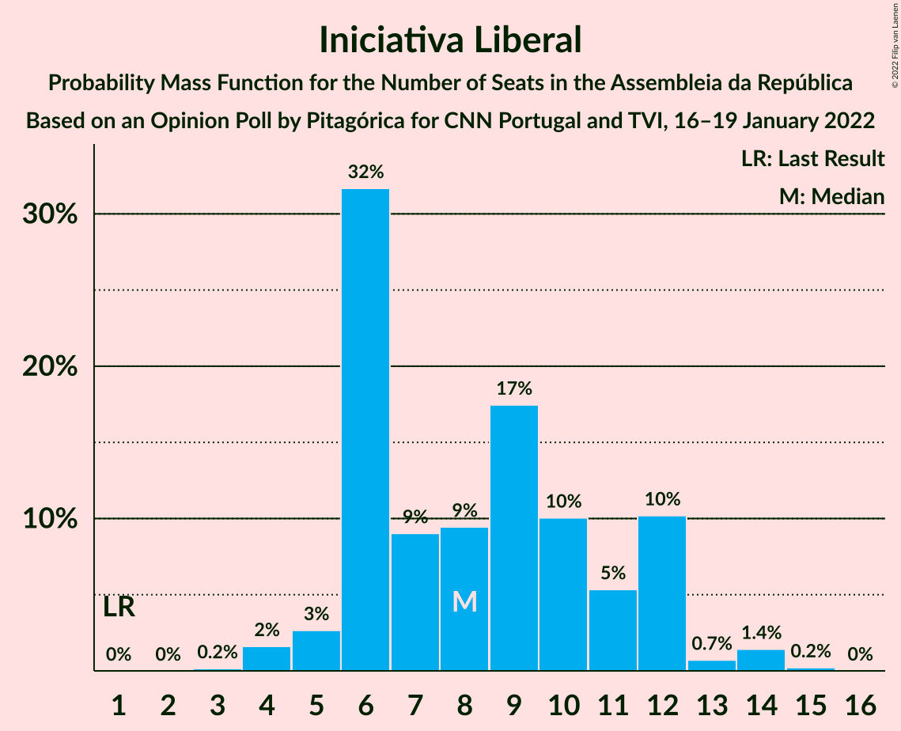

| Number of Seats | Probability | Accumulated | Special Marks |
|:---------------:|:-----------:|:-----------:|:-------------:|
| 1 | 0% | 100% | Last Result |
| 2 | 0% | 100% |  |
| 3 | 0.2% | 100% |  |
| 4 | 2% | 99.8% |  |
| 5 | 3% | 98% |  |
| 6 | 32% | 96% |  |
| 7 | 9% | 64% |  |
| 8 | 9% | 55% | Median |
| 9 | 17% | 45% |  |
| 10 | 10% | 28% |  |
| 11 | 5% | 18% |  |
| 12 | 10% | 13% |  |
| 13 | 0.7% | 2% |  |
| 14 | 1.4% | 2% |  |
| 15 | 0.2% | 0.2% |  |
| 16 | 0% | 0% |  |

### Bloco de Esquerda

*For a full overview of the results for this party, see the [Bloco de Esquerda](party-blocodeesquerda.html) page.*

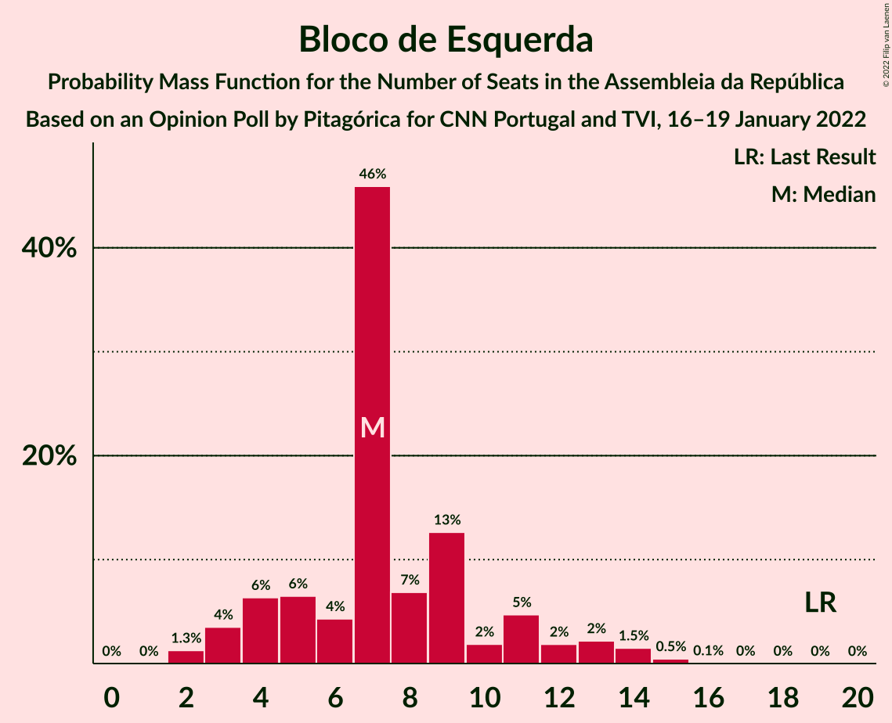

| Number of Seats | Probability | Accumulated | Special Marks |
|:---------------:|:-----------:|:-----------:|:-------------:|
| 2 | 1.3% | 100% |  |
| 3 | 4% | 98.7% |  |
| 4 | 6% | 95% |  |
| 5 | 6% | 89% |  |
| 6 | 4% | 82% |  |
| 7 | 46% | 78% | Median |
| 8 | 7% | 32% |  |
| 9 | 13% | 25% |  |
| 10 | 2% | 13% |  |
| 11 | 5% | 11% |  |
| 12 | 2% | 6% |  |
| 13 | 2% | 4% |  |
| 14 | 1.5% | 2% |  |
| 15 | 0.5% | 0.6% |  |
| 16 | 0.1% | 0.1% |  |
| 17 | 0% | 0% |  |
| 18 | 0% | 0% |  |
| 19 | 0% | 0% | Last Result |

### Coligação Democrática Unitária

*For a full overview of the results for this party, see the [Coligação Democrática Unitária](party-coligaçãodemocráticaunitária.html) page.*

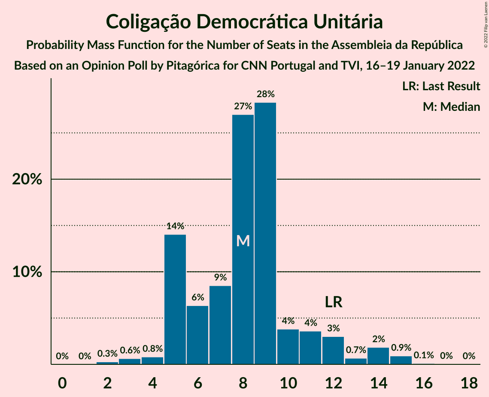

| Number of Seats | Probability | Accumulated | Special Marks |
|:---------------:|:-----------:|:-----------:|:-------------:|
| 2 | 0.3% | 100% |  |
| 3 | 0.6% | 99.7% |  |
| 4 | 0.8% | 99.1% |  |
| 5 | 14% | 98% |  |
| 6 | 6% | 84% |  |
| 7 | 9% | 78% |  |
| 8 | 27% | 69% | Median |
| 9 | 28% | 42% |  |
| 10 | 4% | 14% |  |
| 11 | 4% | 10% |  |
| 12 | 3% | 7% | Last Result |
| 13 | 0.7% | 4% |  |
| 14 | 2% | 3% |  |
| 15 | 0.9% | 1.1% |  |
| 16 | 0.1% | 0.2% |  |
| 17 | 0% | 0.1% |  |
| 18 | 0% | 0% |  |

### Pessoas–Animais–Natureza

*For a full overview of the results for this party, see the [Pessoas–Animais–Natureza](party-pessoas–animais–natureza.html) page.*

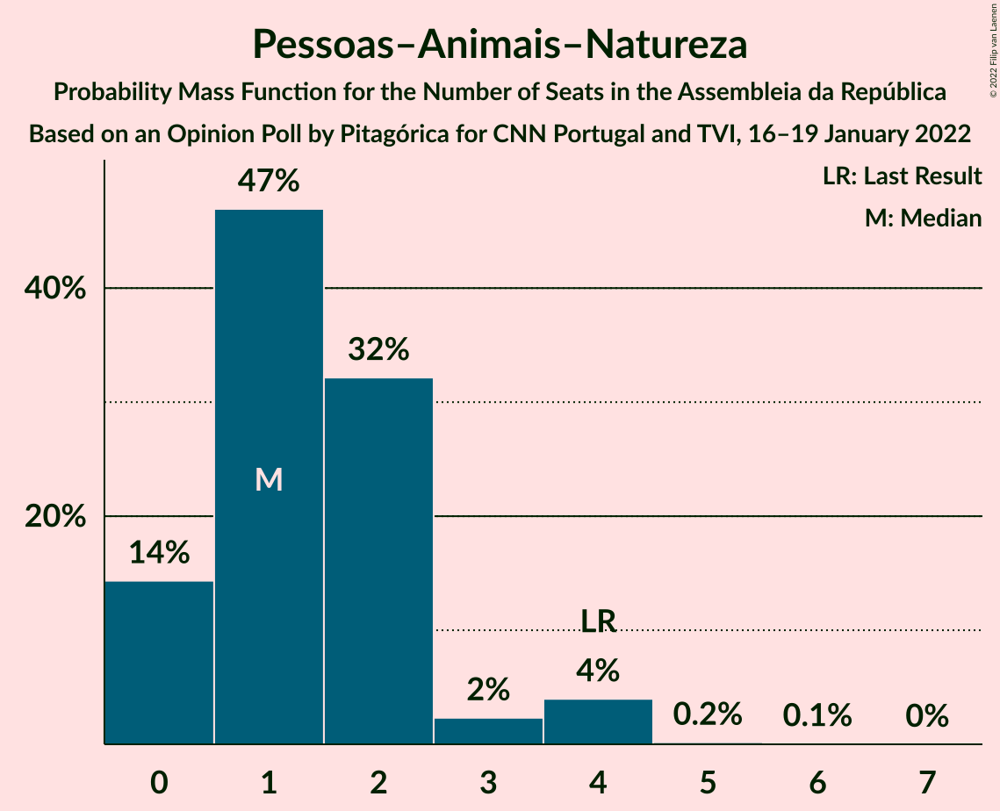

| Number of Seats | Probability | Accumulated | Special Marks |
|:---------------:|:-----------:|:-----------:|:-------------:|
| 0 | 14% | 100% |  |
| 1 | 47% | 86% | Median |
| 2 | 32% | 39% |  |
| 3 | 2% | 7% |  |
| 4 | 4% | 4% | Last Result |
| 5 | 0.2% | 0.2% |  |
| 6 | 0.1% | 0.1% |  |
| 7 | 0% | 0% |  |

### LIVRE

*For a full overview of the results for this party, see the [LIVRE](party-livre.html) page.*

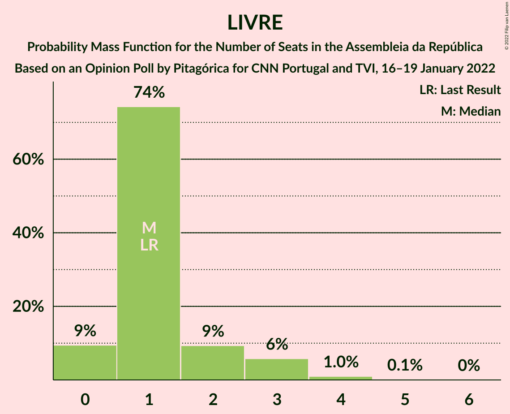

| Number of Seats | Probability | Accumulated | Special Marks |
|:---------------:|:-----------:|:-----------:|:-------------:|
| 0 | 9% | 100% |  |
| 1 | 74% | 91% | Last Result, Median |
| 2 | 9% | 16% |  |
| 3 | 6% | 7% |  |
| 4 | 1.0% | 1.1% |  |
| 5 | 0.1% | 0.1% |  |
| 6 | 0% | 0% |  |

### CDS–Partido Popular

*For a full overview of the results for this party, see the [CDS–Partido Popular](party-cds–partidopopular.html) page.*

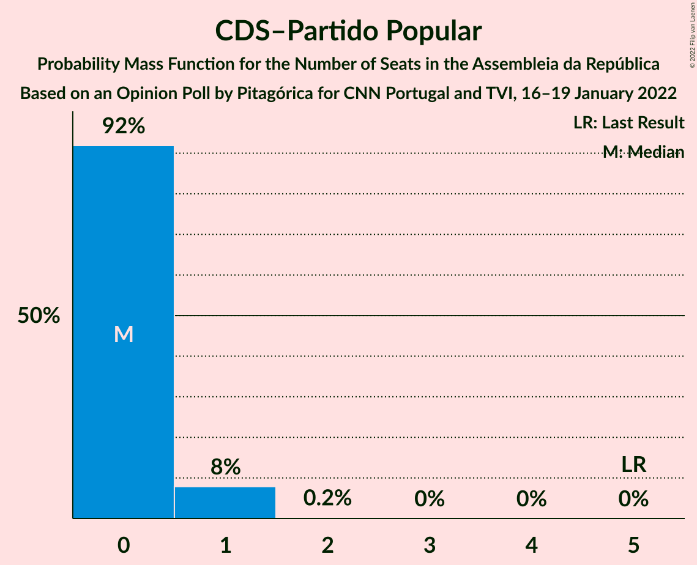

| Number of Seats | Probability | Accumulated | Special Marks |
|:---------------:|:-----------:|:-----------:|:-------------:|
| 0 | 92% | 100% | Median |
| 1 | 8% | 8% |  |
| 2 | 0.2% | 0.3% |  |
| 3 | 0% | 0% |  |
| 4 | 0% | 0% |  |
| 5 | 0% | 0% | Last Result |

## Coalitions

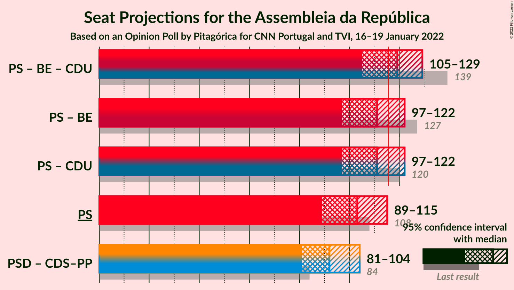

### Confidence Intervals

| Coalition | Last Result | Median | Majority? | 80% Confidence Interval | 90% Confidence Interval | 95% Confidence Interval | 99% Confidence Interval |
|:---------:|:-----------:|:------:|:---------:|:-----------------------:|:-----------------------:|:-----------------------:|:-----------------------:|
| Partido Socialista – Bloco de Esquerda – Coligação Democrática Unitária | 139 | 119 | 60% | 109–126 | 107–127 | 105–129 | 101–133 |
| Partido Socialista – Bloco de Esquerda | 127 | 111 | 20% | 101–118 | 98–120 | 97–122 | 94–126 |
| Partido Socialista – Coligação Democrática Unitária | 120 | 111 | 20% | 102–119 | 99–120 | 97–122 | 94–126 |
| Partido Socialista | 108 | 103 | 2% | 94–110 | 91–112 | 89–115 | 87–118 |
| Partido Social Democrata – CDS–Partido Popular | 84 | 92 | 0% | 84–100 | 83–102 | 81–104 | 77–109 |

### Partido Socialista – Bloco de Esquerda – Coligação Democrática Unitária

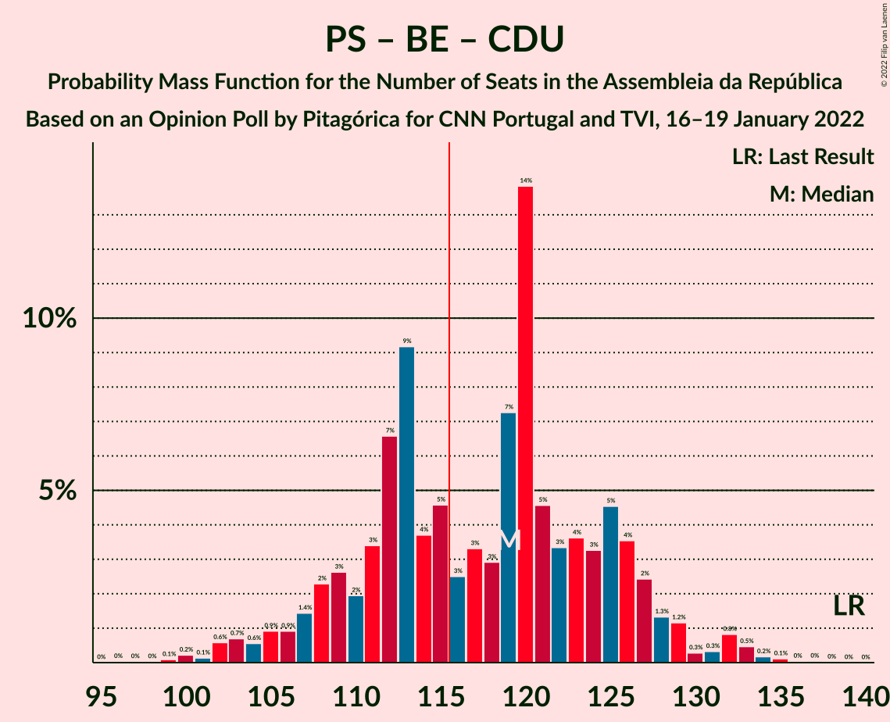

| Number of Seats | Probability | Accumulated | Special Marks |
|:---------------:|:-----------:|:-----------:|:-------------:|
| 97 | 0% | 100% |  |
| 98 | 0% | 99.9% |  |
| 99 | 0.1% | 99.9% |  |
| 100 | 0.2% | 99.8% |  |
| 101 | 0.1% | 99.6% |  |
| 102 | 0.6% | 99.4% |  |
| 103 | 0.7% | 98.8% |  |
| 104 | 0.6% | 98% |  |
| 105 | 0.9% | 98% |  |
| 106 | 0.9% | 97% |  |
| 107 | 1.4% | 96% |  |
| 108 | 2% | 94% |  |
| 109 | 3% | 92% |  |
| 110 | 2% | 89% |  |
| 111 | 3% | 87% |  |
| 112 | 7% | 84% |  |
| 113 | 9% | 77% |  |
| 114 | 4% | 68% |  |
| 115 | 5% | 65% |  |
| 116 | 3% | 60% | Majority |
| 117 | 3% | 57% |  |
| 118 | 3% | 54% | Median |
| 119 | 7% | 51% |  |
| 120 | 14% | 44% |  |
| 121 | 5% | 30% |  |
| 122 | 3% | 26% |  |
| 123 | 4% | 22% |  |
| 124 | 3% | 19% |  |
| 125 | 5% | 15% |  |
| 126 | 4% | 11% |  |
| 127 | 2% | 7% |  |
| 128 | 1.3% | 5% |  |
| 129 | 1.2% | 3% |  |
| 130 | 0.3% | 2% |  |
| 131 | 0.3% | 2% |  |
| 132 | 0.8% | 2% |  |
| 133 | 0.5% | 0.9% |  |
| 134 | 0.2% | 0.4% |  |
| 135 | 0.1% | 0.2% |  |
| 136 | 0% | 0.1% |  |
| 137 | 0% | 0.1% |  |
| 138 | 0% | 0% |  |
| 139 | 0% | 0% | Last Result |

### Partido Socialista – Bloco de Esquerda

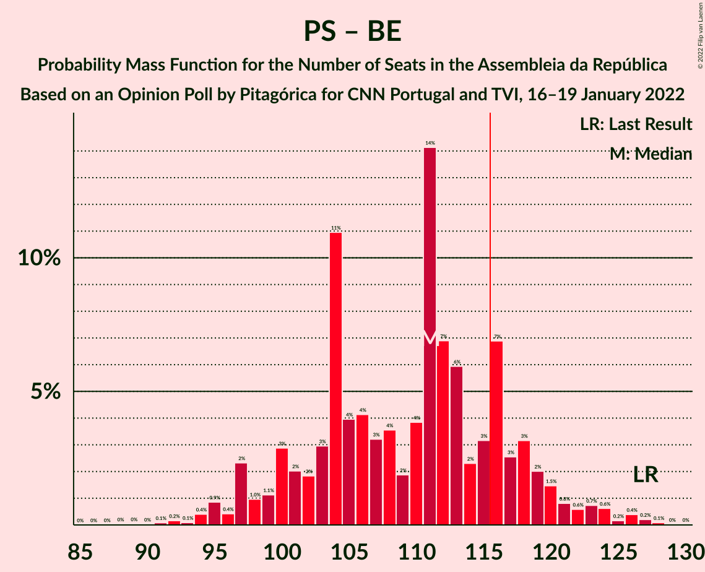

| Number of Seats | Probability | Accumulated | Special Marks |
|:---------------:|:-----------:|:-----------:|:-------------:|
| 89 | 0% | 100% |  |
| 90 | 0% | 99.9% |  |
| 91 | 0.1% | 99.9% |  |
| 92 | 0.2% | 99.8% |  |
| 93 | 0.1% | 99.6% |  |
| 94 | 0.4% | 99.5% |  |
| 95 | 0.9% | 99.1% |  |
| 96 | 0.4% | 98% |  |
| 97 | 2% | 98% |  |
| 98 | 1.0% | 96% |  |
| 99 | 1.1% | 95% |  |
| 100 | 3% | 93% |  |
| 101 | 2% | 91% |  |
| 102 | 2% | 89% |  |
| 103 | 3% | 87% |  |
| 104 | 11% | 84% |  |
| 105 | 4% | 73% |  |
| 106 | 4% | 69% |  |
| 107 | 3% | 65% |  |
| 108 | 4% | 61% |  |
| 109 | 2% | 58% |  |
| 110 | 4% | 56% | Median |
| 111 | 14% | 52% |  |
| 112 | 7% | 38% |  |
| 113 | 6% | 31% |  |
| 114 | 2% | 25% |  |
| 115 | 3% | 23% |  |
| 116 | 7% | 20% | Majority |
| 117 | 3% | 13% |  |
| 118 | 3% | 10% |  |
| 119 | 2% | 7% |  |
| 120 | 1.5% | 5% |  |
| 121 | 0.8% | 4% |  |
| 122 | 0.6% | 3% |  |
| 123 | 0.7% | 2% |  |
| 124 | 0.6% | 2% |  |
| 125 | 0.2% | 0.9% |  |
| 126 | 0.4% | 0.7% |  |
| 127 | 0.2% | 0.3% | Last Result |
| 128 | 0.1% | 0.1% |  |
| 129 | 0% | 0.1% |  |
| 130 | 0% | 0% |  |

### Partido Socialista – Coligação Democrática Unitária

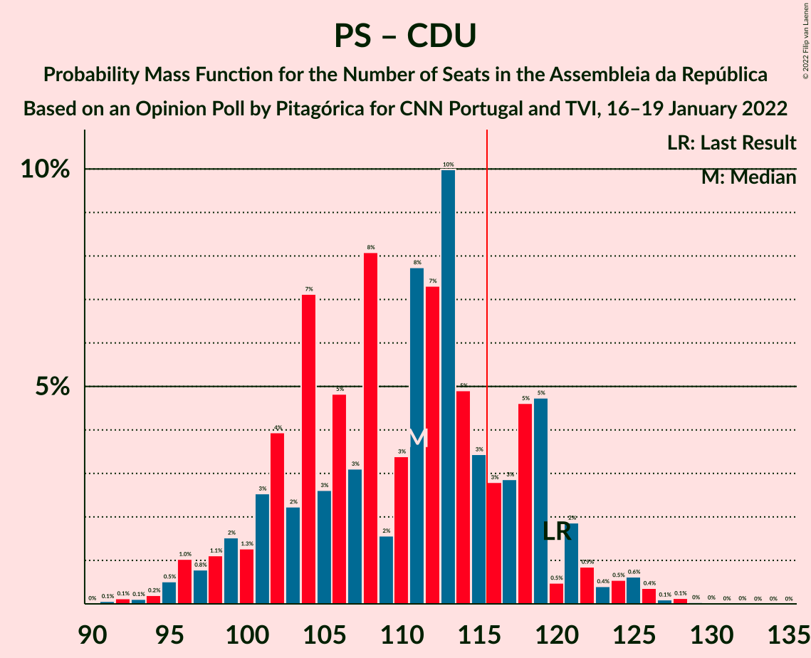

| Number of Seats | Probability | Accumulated | Special Marks |
|:---------------:|:-----------:|:-----------:|:-------------:|
| 91 | 0.1% | 100% |  |
| 92 | 0.1% | 99.9% |  |
| 93 | 0.1% | 99.8% |  |
| 94 | 0.2% | 99.7% |  |
| 95 | 0.5% | 99.5% |  |
| 96 | 1.0% | 99.0% |  |
| 97 | 0.8% | 98% |  |
| 98 | 1.1% | 97% |  |
| 99 | 2% | 96% |  |
| 100 | 1.3% | 95% |  |
| 101 | 3% | 93% |  |
| 102 | 4% | 91% |  |
| 103 | 2% | 87% |  |
| 104 | 7% | 85% |  |
| 105 | 3% | 77% |  |
| 106 | 5% | 75% |  |
| 107 | 3% | 70% |  |
| 108 | 8% | 67% |  |
| 109 | 2% | 59% |  |
| 110 | 3% | 57% |  |
| 111 | 8% | 54% | Median |
| 112 | 7% | 46% |  |
| 113 | 10% | 39% |  |
| 114 | 5% | 29% |  |
| 115 | 3% | 24% |  |
| 116 | 3% | 20% | Majority |
| 117 | 3% | 18% |  |
| 118 | 5% | 15% |  |
| 119 | 5% | 10% |  |
| 120 | 0.5% | 5% | Last Result |
| 121 | 2% | 5% |  |
| 122 | 0.9% | 3% |  |
| 123 | 0.4% | 2% |  |
| 124 | 0.5% | 2% |  |
| 125 | 0.6% | 1.3% |  |
| 126 | 0.4% | 0.7% |  |
| 127 | 0.1% | 0.3% |  |
| 128 | 0.1% | 0.2% |  |
| 129 | 0% | 0.1% |  |
| 130 | 0% | 0.1% |  |
| 131 | 0% | 0% |  |

### Partido Socialista

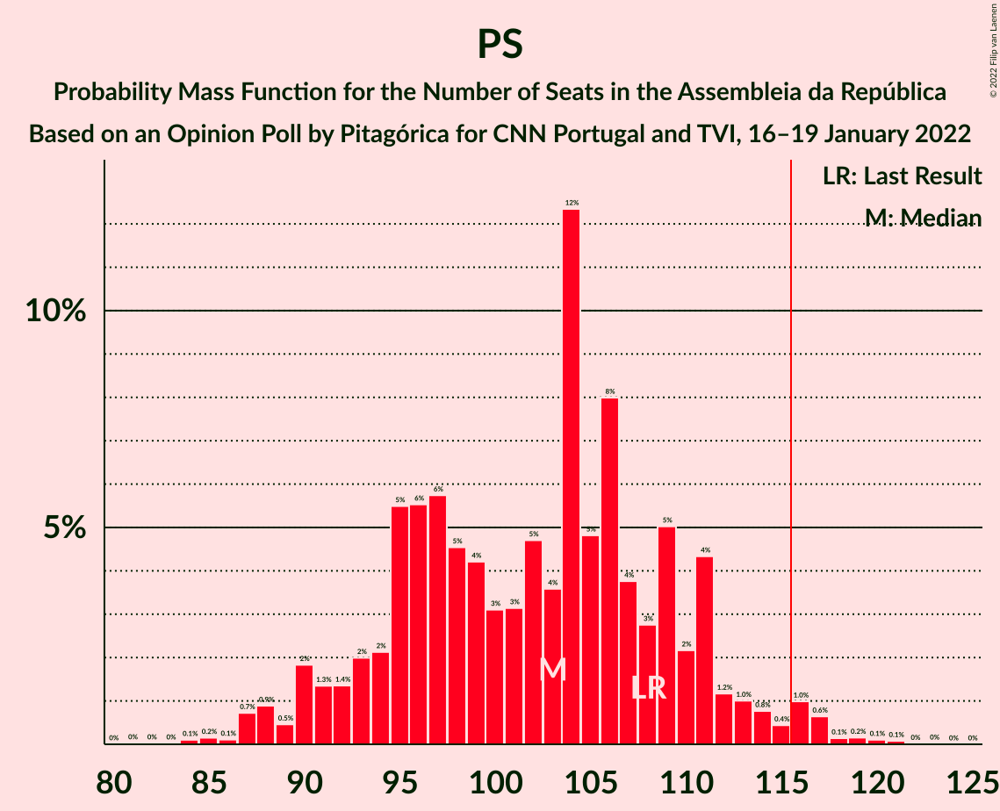

| Number of Seats | Probability | Accumulated | Special Marks |
|:---------------:|:-----------:|:-----------:|:-------------:|
| 82 | 0% | 100% |  |
| 83 | 0% | 99.9% |  |
| 84 | 0.1% | 99.9% |  |
| 85 | 0.2% | 99.8% |  |
| 86 | 0.1% | 99.7% |  |
| 87 | 0.7% | 99.5% |  |
| 88 | 0.9% | 98.8% |  |
| 89 | 0.5% | 98% |  |
| 90 | 2% | 97% |  |
| 91 | 1.3% | 96% |  |
| 92 | 1.4% | 94% |  |
| 93 | 2% | 93% |  |
| 94 | 2% | 91% |  |
| 95 | 5% | 89% |  |
| 96 | 6% | 83% |  |
| 97 | 6% | 78% |  |
| 98 | 5% | 72% |  |
| 99 | 4% | 68% |  |
| 100 | 3% | 63% |  |
| 101 | 3% | 60% |  |
| 102 | 5% | 57% |  |
| 103 | 4% | 52% | Median |
| 104 | 12% | 49% |  |
| 105 | 5% | 36% |  |
| 106 | 8% | 32% |  |
| 107 | 4% | 24% |  |
| 108 | 3% | 20% | Last Result |
| 109 | 5% | 17% |  |
| 110 | 2% | 12% |  |
| 111 | 4% | 10% |  |
| 112 | 1.2% | 6% |  |
| 113 | 1.0% | 4% |  |
| 114 | 0.8% | 3% |  |
| 115 | 0.4% | 3% |  |
| 116 | 1.0% | 2% | Majority |
| 117 | 0.6% | 1.2% |  |
| 118 | 0.1% | 0.5% |  |
| 119 | 0.2% | 0.4% |  |
| 120 | 0.1% | 0.2% |  |
| 121 | 0.1% | 0.1% |  |
| 122 | 0% | 0% |  |

### Partido Social Democrata – CDS–Partido Popular

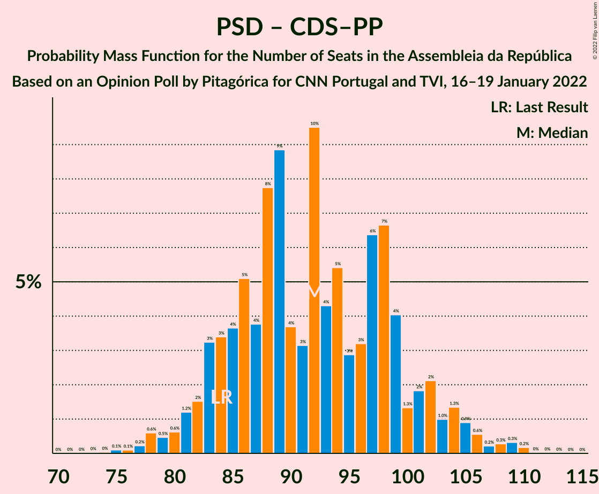

| Number of Seats | Probability | Accumulated | Special Marks |
|:---------------:|:-----------:|:-----------:|:-------------:|
| 74 | 0% | 100% |  |
| 75 | 0.1% | 99.9% |  |
| 76 | 0.1% | 99.8% |  |
| 77 | 0.2% | 99.7% |  |
| 78 | 0.6% | 99.5% |  |
| 79 | 0.5% | 98.9% |  |
| 80 | 0.6% | 98% |  |
| 81 | 1.2% | 98% |  |
| 82 | 2% | 97% |  |
| 83 | 3% | 95% |  |
| 84 | 3% | 92% | Last Result |
| 85 | 4% | 88% |  |
| 86 | 5% | 85% |  |
| 87 | 4% | 80% |  |
| 88 | 8% | 76% |  |
| 89 | 9% | 68% |  |
| 90 | 4% | 59% |  |
| 91 | 3% | 56% |  |
| 92 | 10% | 52% | Median |
| 93 | 4% | 43% |  |
| 94 | 5% | 39% |  |
| 95 | 3% | 33% |  |
| 96 | 3% | 30% |  |
| 97 | 6% | 27% |  |
| 98 | 7% | 21% |  |
| 99 | 4% | 14% |  |
| 100 | 1.3% | 10% |  |
| 101 | 2% | 9% |  |
| 102 | 2% | 7% |  |
| 103 | 1.0% | 5% |  |
| 104 | 1.3% | 4% |  |
| 105 | 0.9% | 2% |  |
| 106 | 0.6% | 2% |  |
| 107 | 0.2% | 1.0% |  |
| 108 | 0.3% | 0.8% |  |
| 109 | 0.3% | 0.5% |  |
| 110 | 0.2% | 0.2% |  |
| 111 | 0% | 0% |  |

## Technical Information

### Opinion Poll

+ **Polling firm:** Pitagórica
+ **Commissioner(s):** CNN Portugal and TVI
+ **Fieldwork period:** 16–19 January 2022

### Calculations

+ **Sample size:** 608
+ **Simulations done:** 1,048,576
+ **Error estimate:** 1.68%

