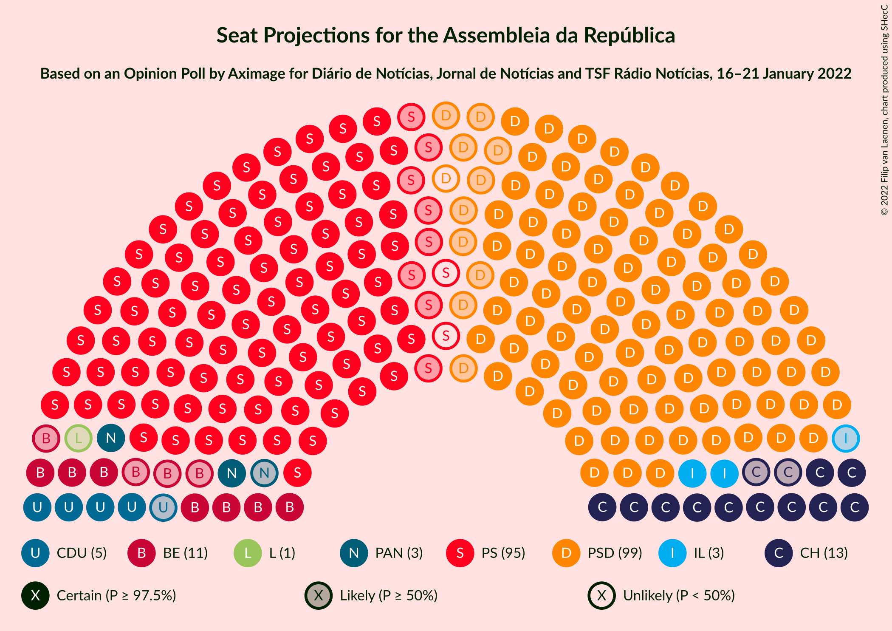

# Opinion Poll by Aximage for Diário de Notícias, Jornal de Notícias and TSF Rádio Notícias, 16–21 January 2022

<a href="#voting-intentions">Voting Intentions</a> | <a href="#seats">Seats</a> | <a href="#coalitions">Coalitions</a> | <a href="#technical-information">Technical Information</a>

## Voting Intentions

### Confidence Intervals

| Party | Last Result | Poll Result | 80% Confidence Interval | 90% Confidence Interval | 95% Confidence Interval | 99% Confidence Interval |
|:-----:|:-----------:|:-----------:|:-----------------------:|:-----------------------:|:-----------------------:|:-----------------------:|
| Partido Social Democrata | 27.8% | 34.4% | 32.5–36.4% |31.9–37.0% |31.5–37.5% |30.6–38.4% |
| Partido Socialista | 36.4% | 33.8% | 31.9–35.8% |31.3–36.3% |30.9–36.8% |30.0–37.8% |
| Chega | 1.3% | 8.0% | 7.0–9.2% |6.7–9.6% |6.4–9.9% |6.0–10.5% |
| Bloco de Esquerda | 9.5% | 6.6% | 5.7–7.8% |5.4–8.1% |5.2–8.4% |4.8–9.0% |
| Coligação Democrática Unitária | 6.3% | 4.5% | 3.7–5.4% |3.5–5.7% |3.3–6.0% |3.0–6.5% |
| Pessoas–Animais–Natureza | 3.3% | 3.2% | 2.6–4.1% |2.4–4.3% |2.3–4.5% |2.0–5.0% |
| Iniciativa Liberal | 1.3% | 2.8% | 2.2–3.6% |2.1–3.8% |1.9–4.1% |1.7–4.5% |
| CDS–Partido Popular | 4.2% | 1.6% | 1.1–2.2% |1.0–2.4% |0.9–2.6% |0.8–2.9% |
| LIVRE | 1.1% | 1.5% | 1.1–2.1% |0.9–2.3% |0.9–2.4% |0.7–2.8% |

*Note:* The poll result column reflects the actual value used in the calculations. Published results may vary slightly, and in addition be rounded to fewer digits.

## Seats

### Confidence Intervals

| Party | Last Result | Median | 80% Confidence Interval | 90% Confidence Interval | 95% Confidence Interval | 99% Confidence Interval |
|:-----:|:-----------:|:------:|:-----------------------:|:-----------------------:|:-----------------------:|:-----------------------:|
| <a href="#partido-social-democrata">Partido Social Democrata</a> | 79 | 98 | 92–104 |89–105 |88–106 |85–108 |
| <a href="#partido-socialista">Partido Socialista</a> | 108 | 93 | 87–98 |86–101 |85–104 |82–107 |
| <a href="#chega">Chega</a> | 1 | 13 | 11–17 |11–17 |11–18 |9–21 |
| <a href="#bloco-de-esquerda">Bloco de Esquerda</a> | 19 | 11 | 9–15 |7–15 |7–16 |7–17 |
| <a href="#coligação-democrática-unitária">Coligação Democrática Unitária</a> | 12 | 5 | 5–8 |5–9 |4–10 |3–12 |
| <a href="#pessoas–animais–natureza">Pessoas–Animais–Natureza</a> | 4 | 3 | 2–4 |2–5 |2–6 |1–6 |
| <a href="#iniciativa-liberal">Iniciativa Liberal</a> | 1 | 3 | 3–4 |3–5 |2–5 |1–6 |
| <a href="#cds–partido-popular">CDS–Partido Popular</a> | 5 | 0 | 0–1 |0–1 |0–1 |0–2 |
| <a href="#livre">LIVRE</a> | 1 | 1 | 1 |1–2 |0–2 |0–3 |

### Partido Social Democrata

*For a full overview of the results for this party, see the [Partido Social Democrata](party-partidosocialdemocrata.html) page.*

| Number of Seats | Probability | Accumulated | Special Marks |
|:---------------:|:-----------:|:-----------:|:-------------:|
| 79 | 0% | 100% | Last Result |
| 80 | 0% | 100% |  |
| 81 | 0% | 100% |  |
| 82 | 0% | 100% |  |
| 83 | 0.1% | 99.9% |  |
| 84 | 0.1% | 99.9% |  |
| 85 | 0.5% | 99.7% |  |
| 86 | 0.9% | 99.3% |  |
| 87 | 0.5% | 98% |  |
| 88 | 2% | 98% |  |
| 89 | 3% | 96% |  |
| 90 | 1.1% | 94% |  |
| 91 | 1.2% | 93% |  |
| 92 | 1.4% | 91% |  |
| 93 | 4% | 90% |  |
| 94 | 5% | 86% |  |
| 95 | 3% | 81% |  |
| 96 | 10% | 78% |  |
| 97 | 11% | 68% |  |
| 98 | 9% | 57% | Median |
| 99 | 15% | 48% |  |
| 100 | 9% | 33% |  |
| 101 | 5% | 24% |  |
| 102 | 5% | 19% |  |
| 103 | 4% | 14% |  |
| 104 | 4% | 10% |  |
| 105 | 3% | 6% |  |
| 106 | 1.5% | 3% |  |
| 107 | 1.3% | 2% |  |
| 108 | 0.3% | 0.6% |  |
| 109 | 0.1% | 0.3% |  |
| 110 | 0.2% | 0.2% |  |
| 111 | 0% | 0.1% |  |
| 112 | 0% | 0% |  |

### Partido Socialista

*For a full overview of the results for this party, see the [Partido Socialista](party-partidosocialista.html) page.*

| Number of Seats | Probability | Accumulated | Special Marks |
|:---------------:|:-----------:|:-----------:|:-------------:|
| 79 | 0% | 100% |  |
| 80 | 0.1% | 99.9% |  |
| 81 | 0.2% | 99.8% |  |
| 82 | 0.2% | 99.6% |  |
| 83 | 0.6% | 99.4% |  |
| 84 | 1.2% | 98.8% |  |
| 85 | 1.4% | 98% |  |
| 86 | 3% | 96% |  |
| 87 | 5% | 93% |  |
| 88 | 5% | 88% |  |
| 89 | 9% | 83% |  |
| 90 | 7% | 75% |  |
| 91 | 5% | 68% |  |
| 92 | 12% | 63% |  |
| 93 | 8% | 51% | Median |
| 94 | 8% | 43% |  |
| 95 | 10% | 35% |  |
| 96 | 8% | 25% |  |
| 97 | 6% | 17% |  |
| 98 | 2% | 11% |  |
| 99 | 1.5% | 10% |  |
| 100 | 2% | 8% |  |
| 101 | 2% | 7% |  |
| 102 | 0.8% | 4% |  |
| 103 | 0.5% | 4% |  |
| 104 | 1.3% | 3% |  |
| 105 | 0.6% | 2% |  |
| 106 | 0.5% | 1.2% |  |
| 107 | 0.6% | 0.7% |  |
| 108 | 0% | 0.1% | Last Result |
| 109 | 0% | 0.1% |  |
| 110 | 0% | 0.1% |  |
| 111 | 0% | 0% |  |

### Chega

*For a full overview of the results for this party, see the [Chega](party-chega.html) page.*

| Number of Seats | Probability | Accumulated | Special Marks |
|:---------------:|:-----------:|:-----------:|:-------------:|
| 1 | 0% | 100% | Last Result |
| 2 | 0% | 100% |  |
| 3 | 0% | 100% |  |
| 4 | 0% | 100% |  |
| 5 | 0% | 100% |  |
| 6 | 0% | 100% |  |
| 7 | 0% | 100% |  |
| 8 | 0.2% | 100% |  |
| 9 | 0.4% | 99.8% |  |
| 10 | 1.1% | 99.4% |  |
| 11 | 22% | 98% |  |
| 12 | 14% | 76% |  |
| 13 | 17% | 62% | Median |
| 14 | 11% | 45% |  |
| 15 | 18% | 34% |  |
| 16 | 4% | 17% |  |
| 17 | 8% | 12% |  |
| 18 | 2% | 4% |  |
| 19 | 1.0% | 2% |  |
| 20 | 0.4% | 1.1% |  |
| 21 | 0.3% | 0.7% |  |
| 22 | 0.3% | 0.4% |  |
| 23 | 0.1% | 0.1% |  |
| 24 | 0% | 0% |  |

### Bloco de Esquerda

*For a full overview of the results for this party, see the [Bloco de Esquerda](party-blocodeesquerda.html) page.*

| Number of Seats | Probability | Accumulated | Special Marks |
|:---------------:|:-----------:|:-----------:|:-------------:|
| 5 | 0.1% | 100% |  |
| 6 | 0% | 99.9% |  |
| 7 | 6% | 99.9% |  |
| 8 | 3% | 94% |  |
| 9 | 8% | 91% |  |
| 10 | 6% | 83% |  |
| 11 | 33% | 77% | Median |
| 12 | 17% | 44% |  |
| 13 | 6% | 27% |  |
| 14 | 6% | 20% |  |
| 15 | 10% | 14% |  |
| 16 | 4% | 4% |  |
| 17 | 0.2% | 0.6% |  |
| 18 | 0.3% | 0.4% |  |
| 19 | 0.1% | 0.1% | Last Result |
| 20 | 0% | 0% |  |

### Coligação Democrática Unitária

*For a full overview of the results for this party, see the [Coligação Democrática Unitária](party-coligaçãodemocráticaunitária.html) page.*

| Number of Seats | Probability | Accumulated | Special Marks |
|:---------------:|:-----------:|:-----------:|:-------------:|
| 2 | 0.2% | 100% |  |
| 3 | 0.9% | 99.8% |  |
| 4 | 2% | 98.9% |  |
| 5 | 52% | 97% | Median |
| 6 | 13% | 45% |  |
| 7 | 16% | 32% |  |
| 8 | 12% | 17% |  |
| 9 | 3% | 5% |  |
| 10 | 2% | 3% |  |
| 11 | 0.2% | 0.7% |  |
| 12 | 0.4% | 0.5% | Last Result |
| 13 | 0.1% | 0.2% |  |
| 14 | 0% | 0.1% |  |
| 15 | 0% | 0% |  |

### Pessoas–Animais–Natureza

*For a full overview of the results for this party, see the [Pessoas–Animais–Natureza](party-pessoas–animais–natureza.html) page.*

| Number of Seats | Probability | Accumulated | Special Marks |
|:---------------:|:-----------:|:-----------:|:-------------:|
| 1 | 0.7% | 100% |  |
| 2 | 25% | 99.3% |  |
| 3 | 25% | 74% | Median |
| 4 | 39% | 49% | Last Result |
| 5 | 6% | 10% |  |
| 6 | 4% | 4% |  |
| 7 | 0.1% | 0.2% |  |
| 8 | 0% | 0.1% |  |
| 9 | 0% | 0% |  |

### Iniciativa Liberal

*For a full overview of the results for this party, see the [Iniciativa Liberal](party-iniciativaliberal.html) page.*

| Number of Seats | Probability | Accumulated | Special Marks |
|:---------------:|:-----------:|:-----------:|:-------------:|
| 1 | 2% | 100% | Last Result |
| 2 | 2% | 98% |  |
| 3 | 53% | 97% | Median |
| 4 | 36% | 44% |  |
| 5 | 6% | 8% |  |
| 6 | 2% | 2% |  |
| 7 | 0% | 0% |  |

### CDS–Partido Popular

*For a full overview of the results for this party, see the [CDS–Partido Popular](party-cds–partidopopular.html) page.*

| Number of Seats | Probability | Accumulated | Special Marks |
|:---------------:|:-----------:|:-----------:|:-------------:|
| 0 | 73% | 100% | Median |
| 1 | 26% | 27% |  |
| 2 | 1.0% | 1.0% |  |
| 3 | 0% | 0% |  |
| 4 | 0% | 0% |  |
| 5 | 0% | 0% | Last Result |

### LIVRE

*For a full overview of the results for this party, see the [LIVRE](party-livre.html) page.*

| Number of Seats | Probability | Accumulated | Special Marks |
|:---------------:|:-----------:|:-----------:|:-------------:|
| 0 | 3% | 100% |  |
| 1 | 89% | 97% | Last Result, Median |
| 2 | 5% | 7% |  |
| 3 | 2% | 2% |  |
| 4 | 0.1% | 0.1% |  |
| 5 | 0% | 0% |  |

## Coalitions

### Confidence Intervals

| Coalition | Last Result | Median | Majority? | 80% Confidence Interval | 90% Confidence Interval | 95% Confidence Interval | 99% Confidence Interval |
|:---------:|:-----------:|:------:|:---------:|:-----------------------:|:-----------------------:|:-----------------------:|:-----------------------:|
| Partido Socialista – Bloco de Esquerda – Coligação Democrática Unitária | 139 | 110 | 12% | 104–118 | 103–120 | 101–122 | 99–123 |
| Partido Socialista – Bloco de Esquerda | 127 | 104 | 1.4% | 98–112 | 97–113 | 96–115 | 93–117 |
| Partido Socialista – Coligação Democrática Unitária | 120 | 99 | 0.1% | 93–105 | 92–108 | 91–110 | 88–113 |
| Partido Social Democrata – CDS–Partido Popular | 84 | 98 | 0% | 93–104 | 89–105 | 88–106 | 86–108 |
| Partido Socialista | 108 | 93 | 0% | 87–98 | 86–101 | 85–104 | 82–107 |

### Partido Socialista – Bloco de Esquerda – Coligação Democrática Unitária

| Number of Seats | Probability | Accumulated | Special Marks |
|:---------------:|:-----------:|:-----------:|:-------------:|
| 96 | 0.1% | 100% |  |
| 97 | 0.1% | 99.9% |  |
| 98 | 0.1% | 99.8% |  |
| 99 | 0.4% | 99.7% |  |
| 100 | 0.5% | 99.2% |  |
| 101 | 1.2% | 98.7% |  |
| 102 | 1.5% | 97% |  |
| 103 | 4% | 96% |  |
| 104 | 3% | 92% |  |
| 105 | 4% | 90% |  |
| 106 | 3% | 86% |  |
| 107 | 4% | 83% |  |
| 108 | 13% | 79% |  |
| 109 | 7% | 66% | Median |
| 110 | 9% | 59% |  |
| 111 | 16% | 50% |  |
| 112 | 13% | 34% |  |
| 113 | 4% | 21% |  |
| 114 | 3% | 17% |  |
| 115 | 2% | 14% |  |
| 116 | 0.7% | 12% | Majority |
| 117 | 2% | 12% |  |
| 118 | 3% | 10% |  |
| 119 | 1.1% | 7% |  |
| 120 | 2% | 6% |  |
| 121 | 0.9% | 4% |  |
| 122 | 2% | 3% |  |
| 123 | 1.0% | 1.4% |  |
| 124 | 0.1% | 0.3% |  |
| 125 | 0.1% | 0.2% |  |
| 126 | 0% | 0.1% |  |
| 127 | 0% | 0.1% |  |
| 128 | 0% | 0.1% |  |
| 129 | 0% | 0% |  |
| 130 | 0% | 0% |  |
| 131 | 0% | 0% |  |
| 132 | 0% | 0% |  |
| 133 | 0% | 0% |  |
| 134 | 0% | 0% |  |
| 135 | 0% | 0% |  |
| 136 | 0% | 0% |  |
| 137 | 0% | 0% |  |
| 138 | 0% | 0% |  |
| 139 | 0% | 0% | Last Result |

### Partido Socialista – Bloco de Esquerda

| Number of Seats | Probability | Accumulated | Special Marks |
|:---------------:|:-----------:|:-----------:|:-------------:|
| 89 | 0% | 100% |  |
| 90 | 0% | 99.9% |  |
| 91 | 0.2% | 99.9% |  |
| 92 | 0.1% | 99.8% |  |
| 93 | 0.2% | 99.6% |  |
| 94 | 0.6% | 99.4% |  |
| 95 | 1.2% | 98.8% |  |
| 96 | 2% | 98% |  |
| 97 | 2% | 95% |  |
| 98 | 4% | 93% |  |
| 99 | 3% | 90% |  |
| 100 | 2% | 86% |  |
| 101 | 3% | 84% |  |
| 102 | 7% | 81% |  |
| 103 | 17% | 74% |  |
| 104 | 13% | 58% | Median |
| 105 | 9% | 45% |  |
| 106 | 15% | 36% |  |
| 107 | 5% | 21% |  |
| 108 | 2% | 15% |  |
| 109 | 2% | 14% |  |
| 110 | 1.0% | 12% |  |
| 111 | 0.7% | 11% |  |
| 112 | 3% | 10% |  |
| 113 | 2% | 7% |  |
| 114 | 2% | 5% |  |
| 115 | 1.5% | 3% |  |
| 116 | 0.9% | 1.4% | Majority |
| 117 | 0.3% | 0.6% |  |
| 118 | 0.1% | 0.3% |  |
| 119 | 0% | 0.1% |  |
| 120 | 0% | 0.1% |  |
| 121 | 0% | 0.1% |  |
| 122 | 0% | 0% |  |
| 123 | 0% | 0% |  |
| 124 | 0% | 0% |  |
| 125 | 0% | 0% |  |
| 126 | 0% | 0% |  |
| 127 | 0% | 0% | Last Result |

### Partido Socialista – Coligação Democrática Unitária

| Number of Seats | Probability | Accumulated | Special Marks |
|:---------------:|:-----------:|:-----------:|:-------------:|
| 85 | 0% | 100% |  |
| 86 | 0.1% | 99.9% |  |
| 87 | 0.1% | 99.8% |  |
| 88 | 0.3% | 99.7% |  |
| 89 | 0.9% | 99.4% |  |
| 90 | 1.0% | 98.5% |  |
| 91 | 2% | 98% |  |
| 92 | 4% | 96% |  |
| 93 | 4% | 92% |  |
| 94 | 6% | 88% |  |
| 95 | 7% | 82% |  |
| 96 | 5% | 75% |  |
| 97 | 15% | 70% |  |
| 98 | 5% | 55% | Median |
| 99 | 7% | 50% |  |
| 100 | 8% | 43% |  |
| 101 | 13% | 36% |  |
| 102 | 5% | 22% |  |
| 103 | 4% | 18% |  |
| 104 | 2% | 14% |  |
| 105 | 3% | 11% |  |
| 106 | 2% | 8% |  |
| 107 | 1.0% | 7% |  |
| 108 | 1.2% | 6% |  |
| 109 | 1.3% | 5% |  |
| 110 | 1.0% | 3% |  |
| 111 | 0.6% | 2% |  |
| 112 | 0.9% | 2% |  |
| 113 | 0.6% | 0.9% |  |
| 114 | 0% | 0.3% |  |
| 115 | 0.2% | 0.3% |  |
| 116 | 0% | 0.1% | Majority |
| 117 | 0% | 0% |  |
| 118 | 0% | 0% |  |
| 119 | 0% | 0% |  |
| 120 | 0% | 0% | Last Result |

### Partido Social Democrata – CDS–Partido Popular

| Number of Seats | Probability | Accumulated | Special Marks |
|:---------------:|:-----------:|:-----------:|:-------------:|
| 82 | 0% | 100% |  |
| 83 | 0.1% | 99.9% |  |
| 84 | 0.1% | 99.9% | Last Result |
| 85 | 0.2% | 99.8% |  |
| 86 | 0.9% | 99.6% |  |
| 87 | 0.5% | 98.7% |  |
| 88 | 2% | 98% |  |
| 89 | 3% | 97% |  |
| 90 | 0.6% | 94% |  |
| 91 | 1.2% | 93% |  |
| 92 | 2% | 92% |  |
| 93 | 3% | 90% |  |
| 94 | 5% | 87% |  |
| 95 | 3% | 82% |  |
| 96 | 10% | 79% |  |
| 97 | 6% | 70% |  |
| 98 | 14% | 63% | Median |
| 99 | 16% | 49% |  |
| 100 | 5% | 34% |  |
| 101 | 8% | 28% |  |
| 102 | 5% | 20% |  |
| 103 | 3% | 15% |  |
| 104 | 4% | 12% |  |
| 105 | 4% | 8% |  |
| 106 | 1.4% | 4% |  |
| 107 | 1.5% | 2% |  |
| 108 | 0.4% | 0.8% |  |
| 109 | 0.1% | 0.4% |  |
| 110 | 0.2% | 0.3% |  |
| 111 | 0% | 0.1% |  |
| 112 | 0% | 0.1% |  |
| 113 | 0% | 0% |  |

### Partido Socialista

| Number of Seats | Probability | Accumulated | Special Marks |
|:---------------:|:-----------:|:-----------:|:-------------:|
| 79 | 0% | 100% |  |
| 80 | 0.1% | 99.9% |  |
| 81 | 0.2% | 99.8% |  |
| 82 | 0.2% | 99.6% |  |
| 83 | 0.6% | 99.4% |  |
| 84 | 1.2% | 98.8% |  |
| 85 | 1.4% | 98% |  |
| 86 | 3% | 96% |  |
| 87 | 5% | 93% |  |
| 88 | 5% | 88% |  |
| 89 | 9% | 83% |  |
| 90 | 7% | 75% |  |
| 91 | 5% | 68% |  |
| 92 | 12% | 63% |  |
| 93 | 8% | 51% | Median |
| 94 | 8% | 43% |  |
| 95 | 10% | 35% |  |
| 96 | 8% | 25% |  |
| 97 | 6% | 17% |  |
| 98 | 2% | 11% |  |
| 99 | 1.5% | 10% |  |
| 100 | 2% | 8% |  |
| 101 | 2% | 7% |  |
| 102 | 0.8% | 4% |  |
| 103 | 0.5% | 4% |  |
| 104 | 1.3% | 3% |  |
| 105 | 0.6% | 2% |  |
| 106 | 0.5% | 1.2% |  |
| 107 | 0.6% | 0.7% |  |
| 108 | 0% | 0.1% | Last Result |
| 109 | 0% | 0.1% |  |
| 110 | 0% | 0.1% |  |
| 111 | 0% | 0% |  |

## Technical Information

### Opinion Poll

+ **Polling firm:** Aximage
+ **Commissioner(s):** Diário de Notícias, Jornal de Notícias and TSF Rádio Notícias
+ **Fieldwork period:** 16–21 January 2022

### Calculations

+ **Sample size:** 965
+ **Simulations done:** 1,048,576
+ **Error estimate:** 0.78%

