# Opinion Poll by ICS/ISCTE for Expresso and SIC Notícias, 18–24 January 2022

<a href="#voting-intentions">Voting Intentions</a> | <a href="#seats">Seats</a> | <a href="#coalitions">Coalitions</a> | <a href="#technical-information">Technical Information</a>

## Voting Intentions

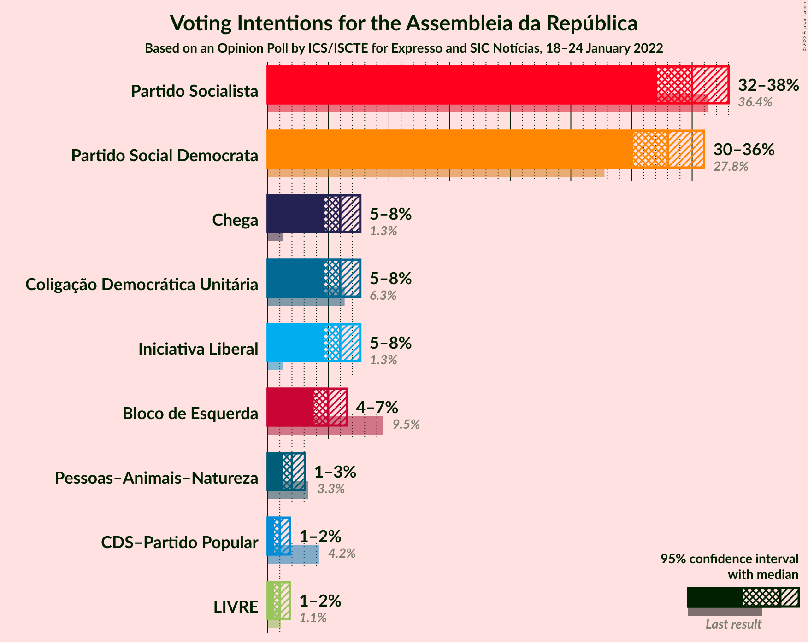

### Confidence Intervals

| Party | Last Result | Poll Result | 80% Confidence Interval | 90% Confidence Interval | 95% Confidence Interval | 99% Confidence Interval |
|:-----:|:-----------:|:-----------:|:-----------------------:|:-----------------------:|:-----------------------:|:-----------------------:|
| Partido Socialista | 36.4% | 35.0% | 33.1–37.0% |32.6–37.5% |32.1–38.0% |31.2–39.0% |
| Partido Social Democrata | 27.8% | 33.0% | 31.1–34.9% |30.6–35.5% |30.1–36.0% |29.3–36.9% |
| Coligação Democrática Unitária | 6.3% | 6.0% | 5.1–7.1% |4.9–7.4% |4.7–7.6% |4.3–8.2% |
| Iniciativa Liberal | 1.3% | 6.0% | 5.1–7.1% |4.9–7.4% |4.7–7.6% |4.3–8.2% |
| Chega | 1.3% | 6.0% | 5.1–7.1% |4.9–7.4% |4.7–7.6% |4.3–8.2% |
| Bloco de Esquerda | 9.5% | 5.0% | 4.2–6.0% |4.0–6.3% |3.8–6.5% |3.5–7.0% |
| Pessoas–Animais–Natureza | 3.3% | 2.0% | 1.5–2.7% |1.4–2.9% |1.3–3.1% |1.1–3.4% |
| CDS–Partido Popular | 4.2% | 1.0% | 0.7–1.5% |0.6–1.7% |0.5–1.8% |0.4–2.1% |
| LIVRE | 1.1% | 1.0% | 0.7–1.5% |0.6–1.7% |0.5–1.8% |0.4–2.1% |

*Note:* The poll result column reflects the actual value used in the calculations. Published results may vary slightly, and in addition be rounded to fewer digits.

## Seats

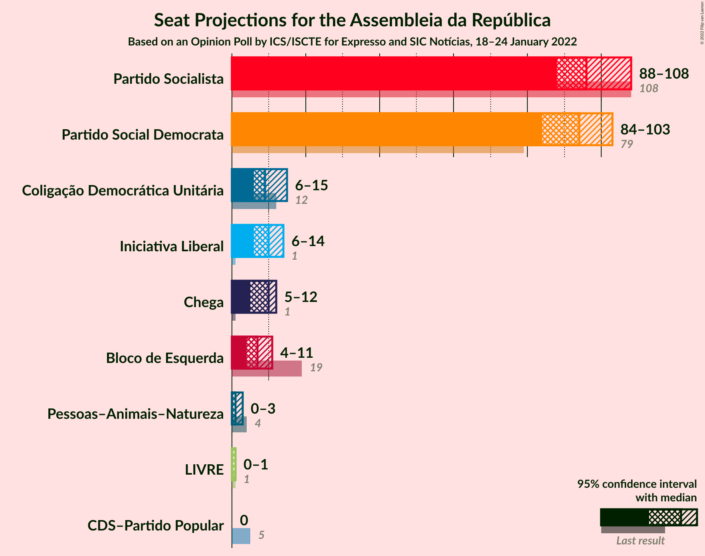

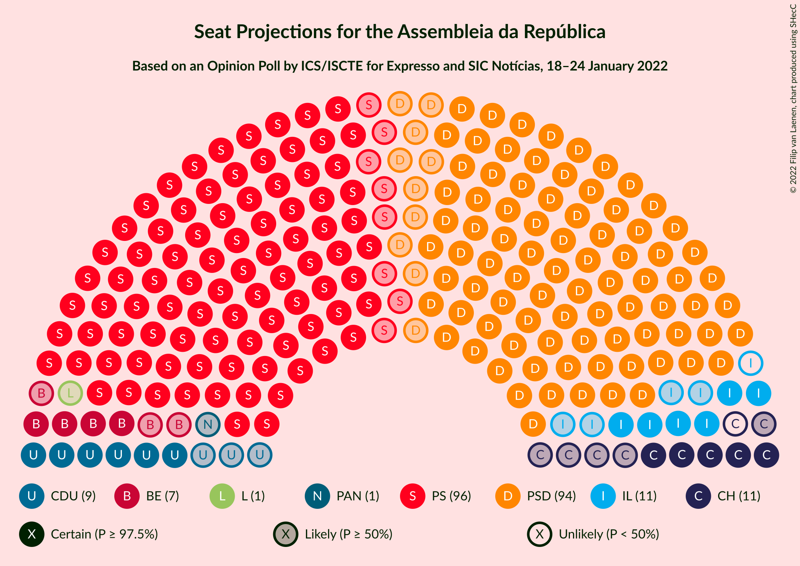

### Confidence Intervals

| Party | Last Result | Median | 80% Confidence Interval | 90% Confidence Interval | 95% Confidence Interval | 99% Confidence Interval |
|:-----:|:-----------:|:------:|:-----------------------:|:-----------------------:|:-----------------------:|:-----------------------:|
| <a href="#partido-socialista">Partido Socialista</a> | 108 | 96 | 91–104 |89–106 |88–108 |85–111 |
| <a href="#partido-social-democrata">Partido Social Democrata</a> | 79 | 94 | 87–101 |85–102 |84–103 |80–106 |
| <a href="#coligação-democrática-unitária">Coligação Democrática Unitária</a> | 12 | 9 | 7–14 |7–15 |6–15 |5–16 |
| <a href="#iniciativa-liberal">Iniciativa Liberal</a> | 1 | 10 | 6–12 |6–13 |6–14 |6–14 |
| <a href="#chega">Chega</a> | 1 | 10 | 8–11 |7–11 |5–12 |4–14 |
| <a href="#bloco-de-esquerda">Bloco de Esquerda</a> | 19 | 7 | 5–9 |4–10 |4–11 |2–13 |
| <a href="#pessoas–animais–natureza">Pessoas–Animais–Natureza</a> | 4 | 1 | 1–2 |0–2 |0–3 |0–4 |
| <a href="#cds–partido-popular">CDS–Partido Popular</a> | 5 | 0 | 0 |0 |0 |0–1 |
| <a href="#livre">LIVRE</a> | 1 | 1 | 0–1 |0–1 |0–1 |0–2 |

### Partido Socialista

*For a full overview of the results for this party, see the [Partido Socialista](party-partidosocialista.html) page.*

| Number of Seats | Probability | Accumulated | Special Marks |
|:---------------:|:-----------:|:-----------:|:-------------:|
| 81 | 0% | 100% |  |
| 82 | 0% | 99.9% |  |
| 83 | 0% | 99.9% |  |
| 84 | 0.3% | 99.9% |  |
| 85 | 0.3% | 99.6% |  |
| 86 | 0.7% | 99.3% |  |
| 87 | 0.5% | 98.6% |  |
| 88 | 2% | 98% |  |
| 89 | 4% | 96% |  |
| 90 | 2% | 93% |  |
| 91 | 2% | 91% |  |
| 92 | 7% | 88% |  |
| 93 | 9% | 82% |  |
| 94 | 8% | 73% |  |
| 95 | 4% | 65% |  |
| 96 | 12% | 61% | Median |
| 97 | 5% | 49% |  |
| 98 | 12% | 44% |  |
| 99 | 7% | 31% |  |
| 100 | 2% | 24% |  |
| 101 | 4% | 22% |  |
| 102 | 3% | 19% |  |
| 103 | 4% | 16% |  |
| 104 | 2% | 12% |  |
| 105 | 3% | 10% |  |
| 106 | 2% | 7% |  |
| 107 | 2% | 5% |  |
| 108 | 0.9% | 3% | Last Result |
| 109 | 0.7% | 2% |  |
| 110 | 0.2% | 1.4% |  |
| 111 | 0.8% | 1.2% |  |
| 112 | 0.2% | 0.4% |  |
| 113 | 0.1% | 0.2% |  |
| 114 | 0.1% | 0.1% |  |
| 115 | 0% | 0.1% |  |
| 116 | 0% | 0% | Majority |

### Partido Social Democrata

*For a full overview of the results for this party, see the [Partido Social Democrata](party-partidosocialdemocrata.html) page.*

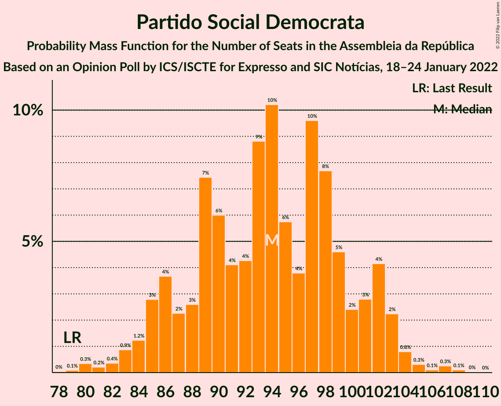

| Number of Seats | Probability | Accumulated | Special Marks |
|:---------------:|:-----------:|:-----------:|:-------------:|
| 78 | 0% | 100% |  |
| 79 | 0.1% | 99.9% | Last Result |
| 80 | 0.3% | 99.8% |  |
| 81 | 0.2% | 99.5% |  |
| 82 | 0.4% | 99.3% |  |
| 83 | 0.9% | 98.9% |  |
| 84 | 1.2% | 98% |  |
| 85 | 3% | 97% |  |
| 86 | 4% | 94% |  |
| 87 | 2% | 90% |  |
| 88 | 3% | 88% |  |
| 89 | 7% | 86% |  |
| 90 | 6% | 78% |  |
| 91 | 4% | 72% |  |
| 92 | 4% | 68% |  |
| 93 | 9% | 64% |  |
| 94 | 10% | 55% | Median |
| 95 | 6% | 45% |  |
| 96 | 4% | 39% |  |
| 97 | 10% | 35% |  |
| 98 | 8% | 26% |  |
| 99 | 5% | 18% |  |
| 100 | 2% | 13% |  |
| 101 | 3% | 11% |  |
| 102 | 4% | 8% |  |
| 103 | 2% | 4% |  |
| 104 | 0.8% | 2% |  |
| 105 | 0.3% | 0.8% |  |
| 106 | 0.1% | 0.5% |  |
| 107 | 0.3% | 0.4% |  |
| 108 | 0.1% | 0.2% |  |
| 109 | 0% | 0.1% |  |
| 110 | 0% | 0% |  |

### Coligação Democrática Unitária

*For a full overview of the results for this party, see the [Coligação Democrática Unitária](party-coligaçãodemocráticaunitária.html) page.*

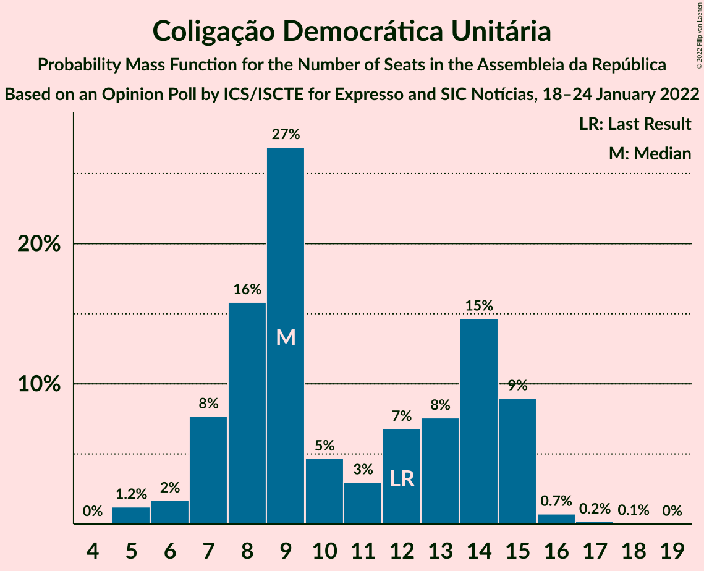

| Number of Seats | Probability | Accumulated | Special Marks |
|:---------------:|:-----------:|:-----------:|:-------------:|
| 5 | 1.2% | 100% |  |
| 6 | 2% | 98.8% |  |
| 7 | 8% | 97% |  |
| 8 | 16% | 89% |  |
| 9 | 27% | 74% | Median |
| 10 | 5% | 47% |  |
| 11 | 3% | 42% |  |
| 12 | 7% | 39% | Last Result |
| 13 | 8% | 32% |  |
| 14 | 15% | 25% |  |
| 15 | 9% | 10% |  |
| 16 | 0.7% | 1.0% |  |
| 17 | 0.2% | 0.3% |  |
| 18 | 0.1% | 0.1% |  |
| 19 | 0% | 0% |  |

### Iniciativa Liberal

*For a full overview of the results for this party, see the [Iniciativa Liberal](party-iniciativaliberal.html) page.*

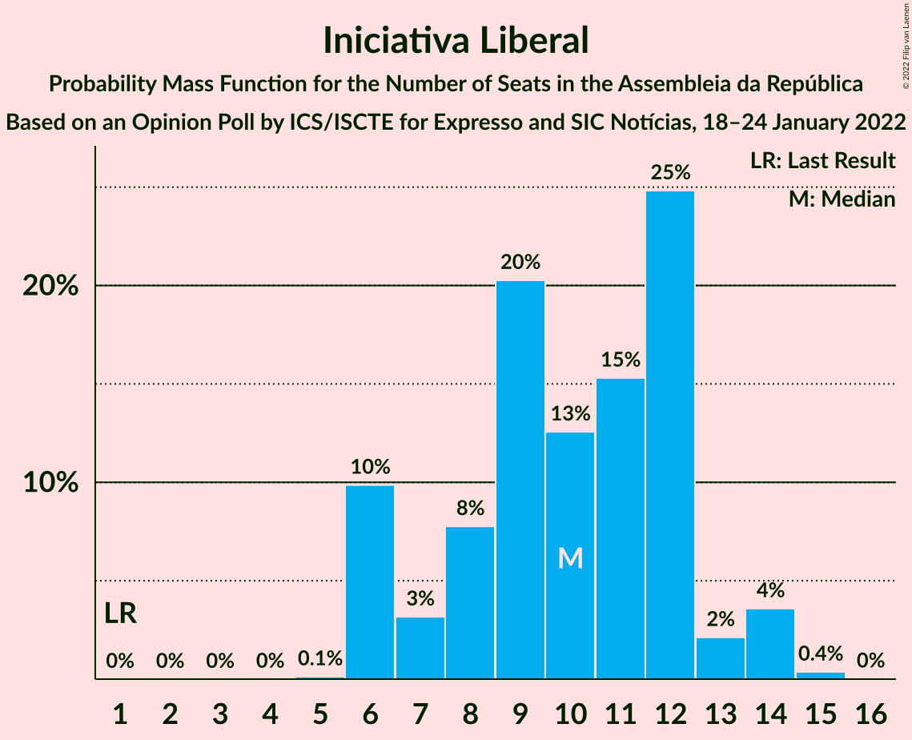

| Number of Seats | Probability | Accumulated | Special Marks |
|:---------------:|:-----------:|:-----------:|:-------------:|
| 1 | 0% | 100% | Last Result |
| 2 | 0% | 100% |  |
| 3 | 0% | 100% |  |
| 4 | 0% | 100% |  |
| 5 | 0.1% | 100% |  |
| 6 | 10% | 99.9% |  |
| 7 | 3% | 90% |  |
| 8 | 8% | 87% |  |
| 9 | 20% | 79% |  |
| 10 | 13% | 59% | Median |
| 11 | 15% | 46% |  |
| 12 | 25% | 31% |  |
| 13 | 2% | 6% |  |
| 14 | 4% | 4% |  |
| 15 | 0.4% | 0.4% |  |
| 16 | 0% | 0% |  |

### Chega

*For a full overview of the results for this party, see the [Chega](party-chega.html) page.*

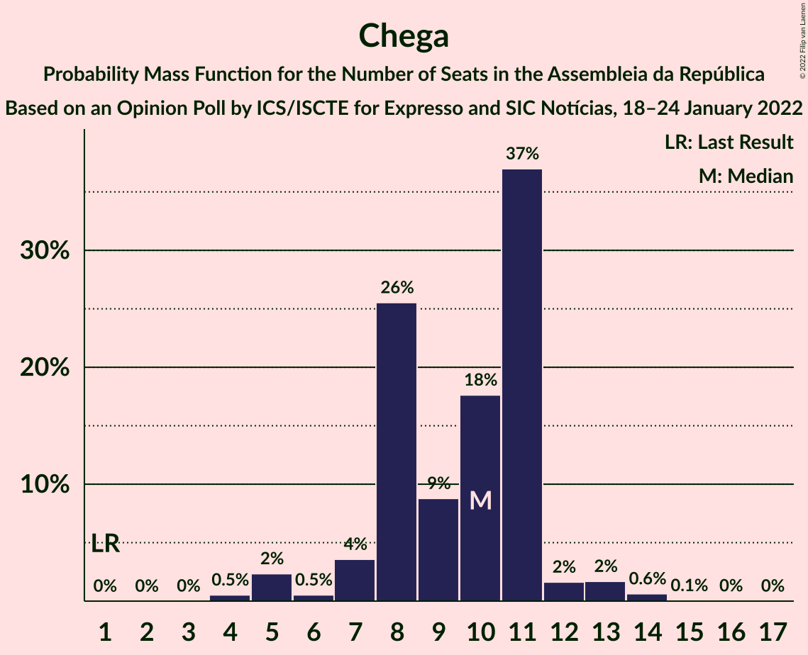

| Number of Seats | Probability | Accumulated | Special Marks |
|:---------------:|:-----------:|:-----------:|:-------------:|
| 1 | 0% | 100% | Last Result |
| 2 | 0% | 100% |  |
| 3 | 0% | 100% |  |
| 4 | 0.5% | 100% |  |
| 5 | 2% | 99.5% |  |
| 6 | 0.5% | 97% |  |
| 7 | 4% | 97% |  |
| 8 | 26% | 93% |  |
| 9 | 9% | 67% |  |
| 10 | 18% | 59% | Median |
| 11 | 37% | 41% |  |
| 12 | 2% | 4% |  |
| 13 | 2% | 2% |  |
| 14 | 0.6% | 0.7% |  |
| 15 | 0.1% | 0.1% |  |
| 16 | 0% | 0.1% |  |
| 17 | 0% | 0% |  |

### Bloco de Esquerda

*For a full overview of the results for this party, see the [Bloco de Esquerda](party-blocodeesquerda.html) page.*

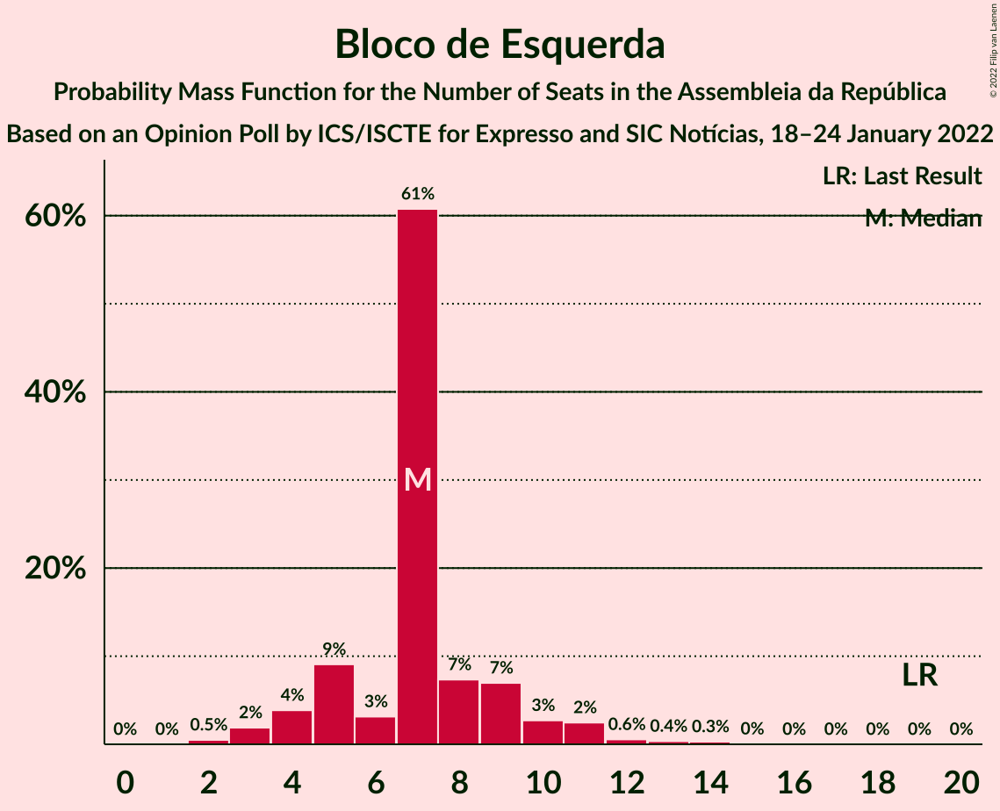

| Number of Seats | Probability | Accumulated | Special Marks |
|:---------------:|:-----------:|:-----------:|:-------------:|
| 2 | 0.5% | 100% |  |
| 3 | 2% | 99.5% |  |
| 4 | 4% | 98% |  |
| 5 | 9% | 94% |  |
| 6 | 3% | 85% |  |
| 7 | 61% | 82% | Median |
| 8 | 7% | 21% |  |
| 9 | 7% | 13% |  |
| 10 | 3% | 6% |  |
| 11 | 2% | 4% |  |
| 12 | 0.6% | 1.3% |  |
| 13 | 0.4% | 0.7% |  |
| 14 | 0.3% | 0.4% |  |
| 15 | 0% | 0.1% |  |
| 16 | 0% | 0% |  |
| 17 | 0% | 0% |  |
| 18 | 0% | 0% |  |
| 19 | 0% | 0% | Last Result |

### Pessoas–Animais–Natureza

*For a full overview of the results for this party, see the [Pessoas–Animais–Natureza](party-pessoas–animais–natureza.html) page.*

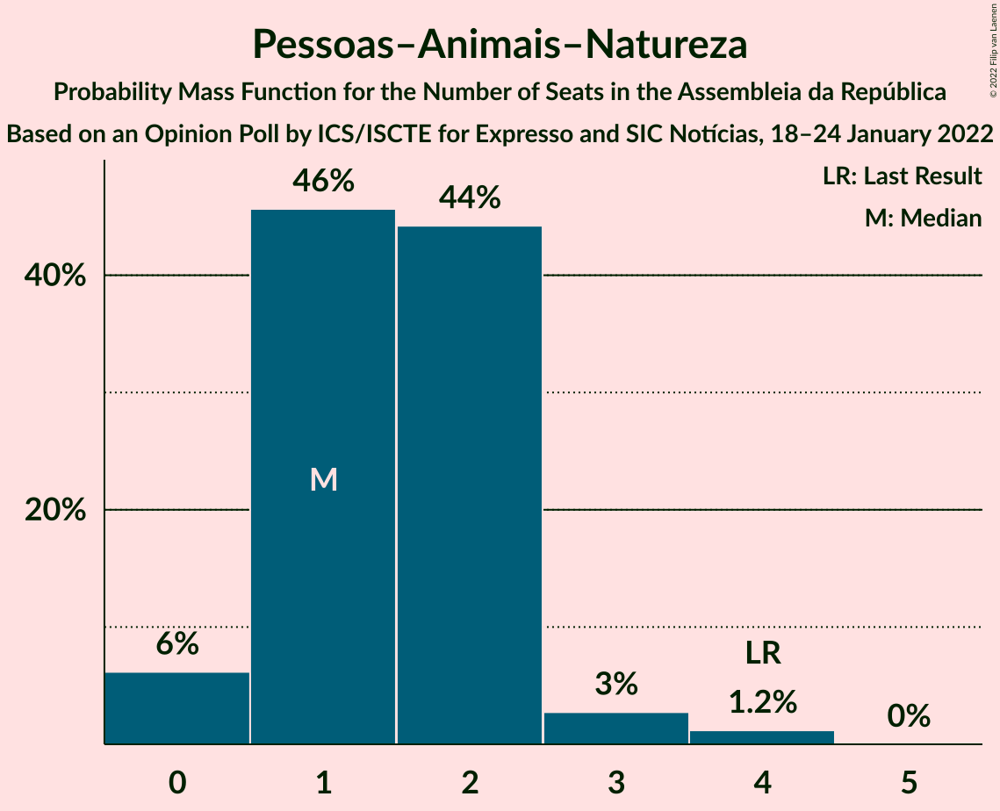

| Number of Seats | Probability | Accumulated | Special Marks |
|:---------------:|:-----------:|:-----------:|:-------------:|
| 0 | 6% | 100% |  |
| 1 | 46% | 94% | Median |
| 2 | 44% | 48% |  |
| 3 | 3% | 4% |  |
| 4 | 1.2% | 1.2% | Last Result |
| 5 | 0% | 0% |  |

### CDS–Partido Popular

*For a full overview of the results for this party, see the [CDS–Partido Popular](party-cds–partidopopular.html) page.*

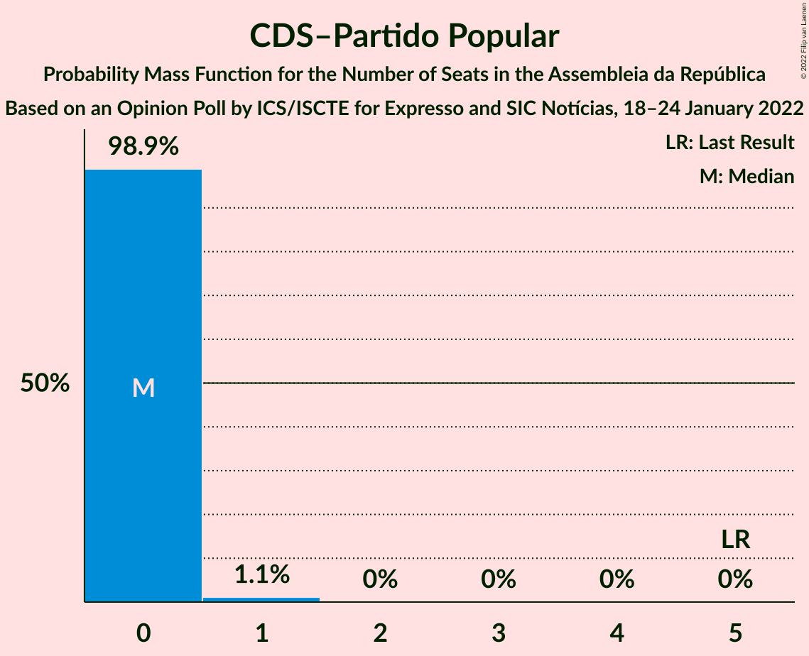

| Number of Seats | Probability | Accumulated | Special Marks |
|:---------------:|:-----------:|:-----------:|:-------------:|
| 0 | 98.9% | 100% | Median |
| 1 | 1.1% | 1.1% |  |
| 2 | 0% | 0% |  |
| 3 | 0% | 0% |  |
| 4 | 0% | 0% |  |
| 5 | 0% | 0% | Last Result |

### LIVRE

*For a full overview of the results for this party, see the [LIVRE](party-livre.html) page.*

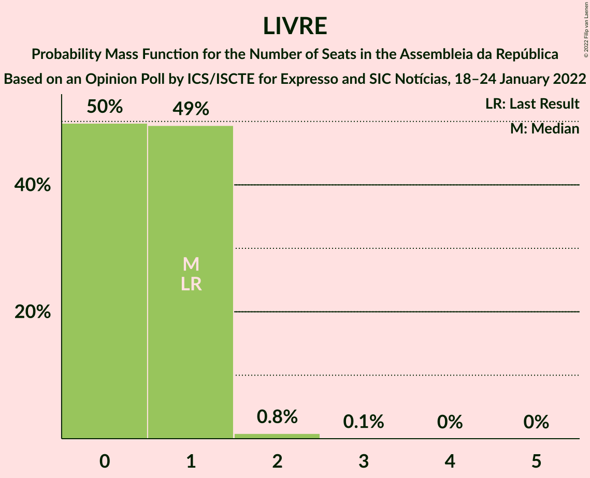

| Number of Seats | Probability | Accumulated | Special Marks |
|:---------------:|:-----------:|:-----------:|:-------------:|
| 0 | 50% | 100% |  |
| 1 | 49% | 50% | Last Result, Median |
| 2 | 0.8% | 0.9% |  |
| 3 | 0.1% | 0.1% |  |
| 4 | 0% | 0% |  |

## Coalitions

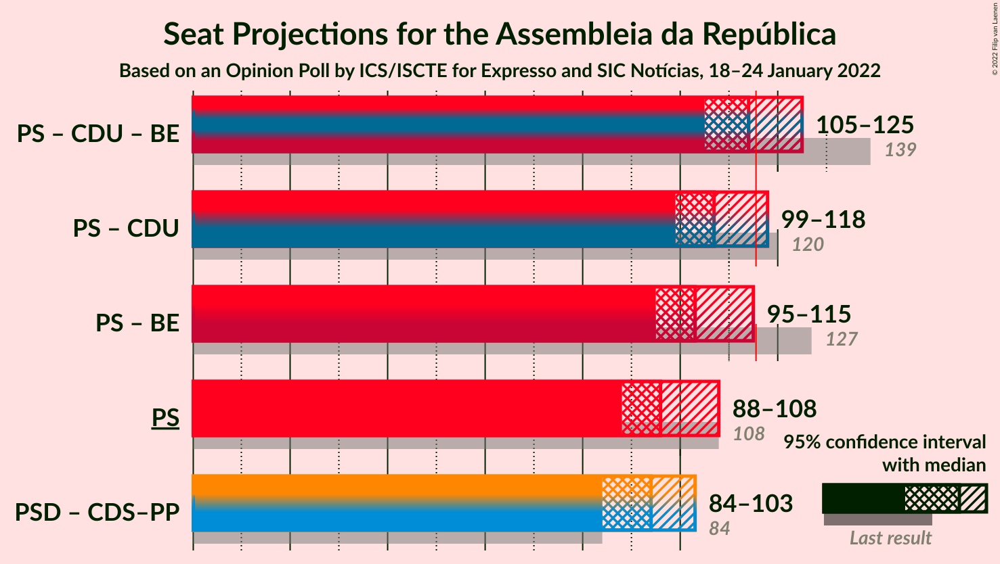

### Confidence Intervals

| Coalition | Last Result | Median | Majority? | 80% Confidence Interval | 90% Confidence Interval | 95% Confidence Interval | 99% Confidence Interval |
|:---------:|:-----------:|:------:|:---------:|:-----------------------:|:-----------------------:|:-----------------------:|:-----------------------:|
| Partido Socialista – Coligação Democrática Unitária – Bloco de Esquerda | 139 | 114 | 38% | 108–122 | 107–123 | 105–125 | 102–128 |
| Partido Socialista – Coligação Democrática Unitária | 120 | 107 | 7% | 100–115 | 100–116 | 99–118 | 95–121 |
| Partido Socialista – Bloco de Esquerda | 127 | 103 | 2% | 97–111 | 96–114 | 95–115 | 92–118 |
| Partido Socialista | 108 | 96 | 0% | 91–104 | 89–106 | 88–108 | 85–111 |
| Partido Social Democrata – CDS–Partido Popular | 84 | 94 | 0% | 87–101 | 85–102 | 84–103 | 80–106 |

### Partido Socialista – Coligação Democrática Unitária – Bloco de Esquerda

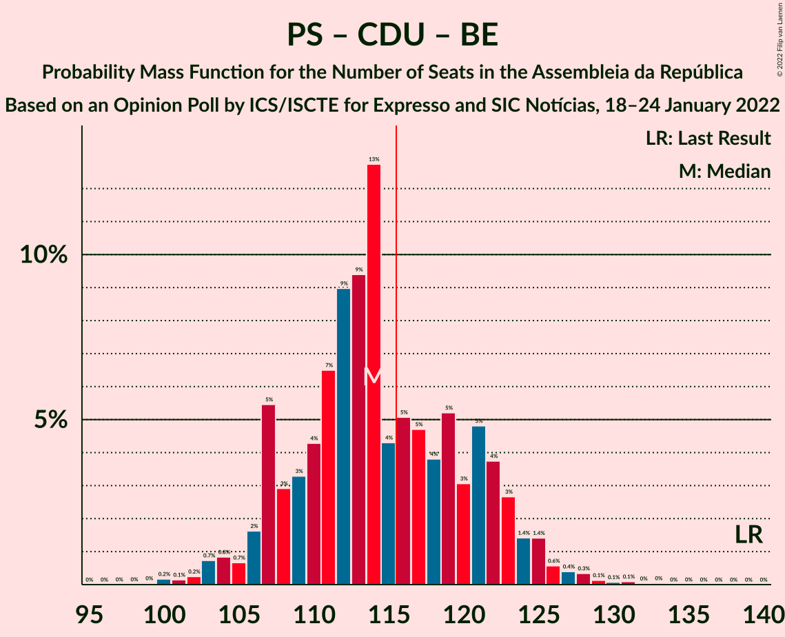

| Number of Seats | Probability | Accumulated | Special Marks |
|:---------------:|:-----------:|:-----------:|:-------------:|
| 99 | 0% | 100% |  |
| 100 | 0.2% | 99.9% |  |
| 101 | 0.1% | 99.8% |  |
| 102 | 0.2% | 99.6% |  |
| 103 | 0.7% | 99.4% |  |
| 104 | 0.8% | 98.6% |  |
| 105 | 0.7% | 98% |  |
| 106 | 2% | 97% |  |
| 107 | 5% | 96% |  |
| 108 | 3% | 90% |  |
| 109 | 3% | 87% |  |
| 110 | 4% | 84% |  |
| 111 | 7% | 80% |  |
| 112 | 9% | 73% | Median |
| 113 | 9% | 64% |  |
| 114 | 13% | 55% |  |
| 115 | 4% | 42% |  |
| 116 | 5% | 38% | Majority |
| 117 | 5% | 33% |  |
| 118 | 4% | 28% |  |
| 119 | 5% | 24% |  |
| 120 | 3% | 19% |  |
| 121 | 5% | 16% |  |
| 122 | 4% | 11% |  |
| 123 | 3% | 7% |  |
| 124 | 1.4% | 5% |  |
| 125 | 1.4% | 3% |  |
| 126 | 0.6% | 2% |  |
| 127 | 0.4% | 1.1% |  |
| 128 | 0.3% | 0.7% |  |
| 129 | 0.1% | 0.4% |  |
| 130 | 0.1% | 0.3% |  |
| 131 | 0.1% | 0.2% |  |
| 132 | 0% | 0.1% |  |
| 133 | 0% | 0.1% |  |
| 134 | 0% | 0% |  |
| 135 | 0% | 0% |  |
| 136 | 0% | 0% |  |
| 137 | 0% | 0% |  |
| 138 | 0% | 0% |  |
| 139 | 0% | 0% | Last Result |

### Partido Socialista – Coligação Democrática Unitária

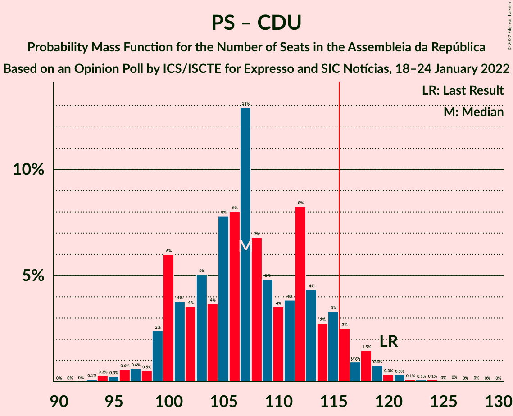

| Number of Seats | Probability | Accumulated | Special Marks |
|:---------------:|:-----------:|:-----------:|:-------------:|
| 93 | 0.1% | 100% |  |
| 94 | 0.3% | 99.9% |  |
| 95 | 0.3% | 99.6% |  |
| 96 | 0.6% | 99.3% |  |
| 97 | 0.6% | 98.7% |  |
| 98 | 0.5% | 98% |  |
| 99 | 2% | 98% |  |
| 100 | 6% | 95% |  |
| 101 | 4% | 89% |  |
| 102 | 4% | 85% |  |
| 103 | 5% | 82% |  |
| 104 | 4% | 77% |  |
| 105 | 8% | 73% | Median |
| 106 | 8% | 65% |  |
| 107 | 13% | 57% |  |
| 108 | 7% | 44% |  |
| 109 | 5% | 38% |  |
| 110 | 4% | 33% |  |
| 111 | 4% | 29% |  |
| 112 | 8% | 25% |  |
| 113 | 4% | 17% |  |
| 114 | 3% | 13% |  |
| 115 | 3% | 10% |  |
| 116 | 3% | 7% | Majority |
| 117 | 0.9% | 4% |  |
| 118 | 1.5% | 3% |  |
| 119 | 0.8% | 2% |  |
| 120 | 0.3% | 1.0% | Last Result |
| 121 | 0.3% | 0.7% |  |
| 122 | 0.1% | 0.4% |  |
| 123 | 0.1% | 0.2% |  |
| 124 | 0.1% | 0.2% |  |
| 125 | 0% | 0.1% |  |
| 126 | 0% | 0.1% |  |
| 127 | 0% | 0% |  |

### Partido Socialista – Bloco de Esquerda

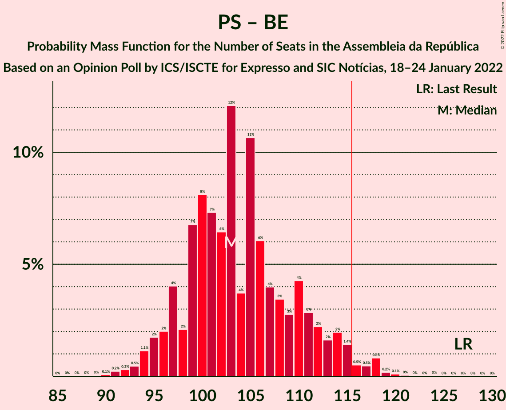

| Number of Seats | Probability | Accumulated | Special Marks |
|:---------------:|:-----------:|:-----------:|:-------------:|
| 88 | 0% | 100% |  |
| 89 | 0% | 99.9% |  |
| 90 | 0.1% | 99.9% |  |
| 91 | 0.2% | 99.8% |  |
| 92 | 0.3% | 99.6% |  |
| 93 | 0.5% | 99.3% |  |
| 94 | 1.1% | 98.9% |  |
| 95 | 2% | 98% |  |
| 96 | 2% | 96% |  |
| 97 | 4% | 94% |  |
| 98 | 2% | 90% |  |
| 99 | 7% | 88% |  |
| 100 | 8% | 81% |  |
| 101 | 7% | 73% |  |
| 102 | 6% | 66% |  |
| 103 | 12% | 59% | Median |
| 104 | 4% | 47% |  |
| 105 | 11% | 43% |  |
| 106 | 6% | 33% |  |
| 107 | 4% | 27% |  |
| 108 | 3% | 23% |  |
| 109 | 3% | 19% |  |
| 110 | 4% | 17% |  |
| 111 | 3% | 12% |  |
| 112 | 2% | 9% |  |
| 113 | 2% | 7% |  |
| 114 | 2% | 6% |  |
| 115 | 1.4% | 4% |  |
| 116 | 0.5% | 2% | Majority |
| 117 | 0.5% | 2% |  |
| 118 | 0.8% | 1.2% |  |
| 119 | 0.2% | 0.4% |  |
| 120 | 0.1% | 0.2% |  |
| 121 | 0% | 0.1% |  |
| 122 | 0% | 0.1% |  |
| 123 | 0% | 0% |  |
| 124 | 0% | 0% |  |
| 125 | 0% | 0% |  |
| 126 | 0% | 0% |  |
| 127 | 0% | 0% | Last Result |

### Partido Socialista

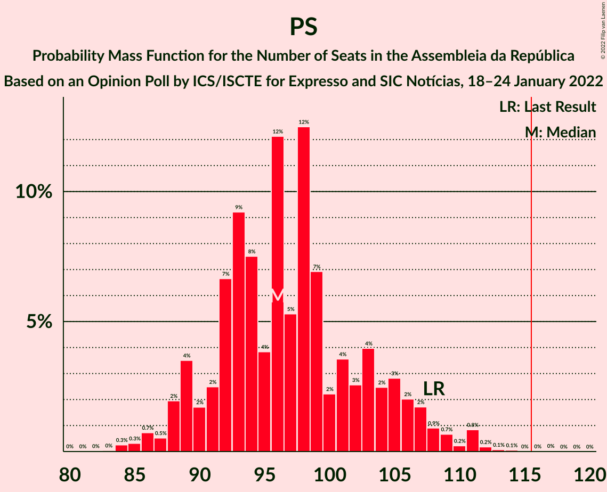

| Number of Seats | Probability | Accumulated | Special Marks |
|:---------------:|:-----------:|:-----------:|:-------------:|
| 81 | 0% | 100% |  |
| 82 | 0% | 99.9% |  |
| 83 | 0% | 99.9% |  |
| 84 | 0.3% | 99.9% |  |
| 85 | 0.3% | 99.6% |  |
| 86 | 0.7% | 99.3% |  |
| 87 | 0.5% | 98.6% |  |
| 88 | 2% | 98% |  |
| 89 | 4% | 96% |  |
| 90 | 2% | 93% |  |
| 91 | 2% | 91% |  |
| 92 | 7% | 88% |  |
| 93 | 9% | 82% |  |
| 94 | 8% | 73% |  |
| 95 | 4% | 65% |  |
| 96 | 12% | 61% | Median |
| 97 | 5% | 49% |  |
| 98 | 12% | 44% |  |
| 99 | 7% | 31% |  |
| 100 | 2% | 24% |  |
| 101 | 4% | 22% |  |
| 102 | 3% | 19% |  |
| 103 | 4% | 16% |  |
| 104 | 2% | 12% |  |
| 105 | 3% | 10% |  |
| 106 | 2% | 7% |  |
| 107 | 2% | 5% |  |
| 108 | 0.9% | 3% | Last Result |
| 109 | 0.7% | 2% |  |
| 110 | 0.2% | 1.4% |  |
| 111 | 0.8% | 1.2% |  |
| 112 | 0.2% | 0.4% |  |
| 113 | 0.1% | 0.2% |  |
| 114 | 0.1% | 0.1% |  |
| 115 | 0% | 0.1% |  |
| 116 | 0% | 0% | Majority |

### Partido Social Democrata – CDS–Partido Popular

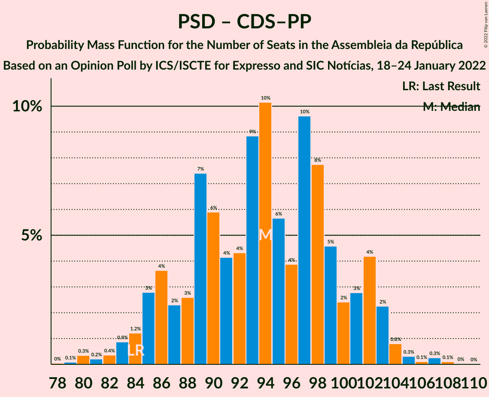

| Number of Seats | Probability | Accumulated | Special Marks |
|:---------------:|:-----------:|:-----------:|:-------------:|
| 78 | 0% | 100% |  |
| 79 | 0.1% | 99.9% |  |
| 80 | 0.3% | 99.8% |  |
| 81 | 0.2% | 99.5% |  |
| 82 | 0.4% | 99.3% |  |
| 83 | 0.9% | 98.9% |  |
| 84 | 1.2% | 98% | Last Result |
| 85 | 3% | 97% |  |
| 86 | 4% | 94% |  |
| 87 | 2% | 90% |  |
| 88 | 3% | 88% |  |
| 89 | 7% | 86% |  |
| 90 | 6% | 78% |  |
| 91 | 4% | 72% |  |
| 92 | 4% | 68% |  |
| 93 | 9% | 64% |  |
| 94 | 10% | 55% | Median |
| 95 | 6% | 45% |  |
| 96 | 4% | 39% |  |
| 97 | 10% | 35% |  |
| 98 | 8% | 26% |  |
| 99 | 5% | 18% |  |
| 100 | 2% | 13% |  |
| 101 | 3% | 11% |  |
| 102 | 4% | 8% |  |
| 103 | 2% | 4% |  |
| 104 | 0.8% | 2% |  |
| 105 | 0.3% | 0.8% |  |
| 106 | 0.1% | 0.5% |  |
| 107 | 0.3% | 0.4% |  |
| 108 | 0.1% | 0.2% |  |
| 109 | 0% | 0.1% |  |
| 110 | 0% | 0% |  |

## Technical Information

### Opinion Poll

+ **Polling firm:** ICS/ISCTE
+ **Commissioner(s):** Expresso and SIC Notícias
+ **Fieldwork period:** 18–24 January 2022

### Calculations

+ **Sample size:** 1003
+ **Simulations done:** 1,048,576
+ **Error estimate:** 1.27%

