# Opinion Poll by Pitagórica for CNN Portugal and TVI, 21–24 January 2022

<a href="#voting-intentions">Voting Intentions</a> | <a href="#seats">Seats</a> | <a href="#coalitions">Coalitions</a> | <a href="#technical-information">Technical Information</a>

## Voting Intentions

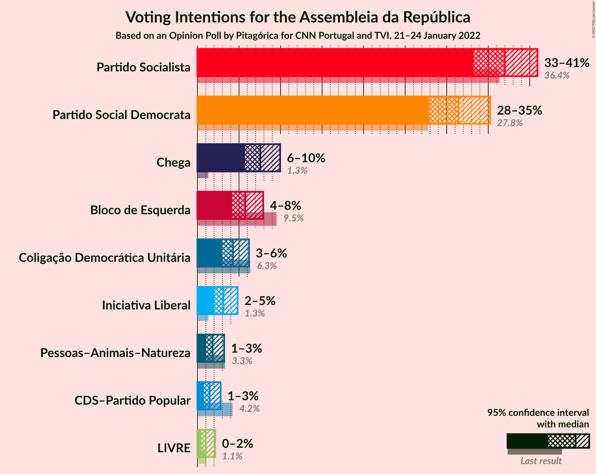

### Confidence Intervals

| Party | Last Result | Poll Result | 80% Confidence Interval | 90% Confidence Interval | 95% Confidence Interval | 99% Confidence Interval |
|:-----:|:-----------:|:-----------:|:-----------------------:|:-----------------------:|:-----------------------:|:-----------------------:|
| Partido Socialista | 36.4% | 37.0% | 34.6–39.6% |33.9–40.3% |33.3–40.9% |32.1–42.2% |
| Partido Social Democrata | 27.8% | 31.4% | 29.1–33.9% |28.4–34.6% |27.8–35.2% |26.7–36.4% |
| Chega | 1.3% | 7.6% | 6.3–9.1% |6.0–9.6% |5.7–10.0% |5.2–10.7% |
| Bloco de Esquerda | 9.5% | 5.8% | 4.7–7.2% |4.4–7.6% |4.2–7.9% |3.7–8.6% |
| Coligação Democrática Unitária | 6.3% | 4.3% | 3.4–5.5% |3.1–5.9% |2.9–6.2% |2.6–6.9% |
| Iniciativa Liberal | 1.3% | 3.1% | 2.4–4.2% |2.2–4.6% |2.0–4.8% |1.7–5.4% |
| Pessoas–Animais–Natureza | 3.3% | 1.8% | 1.3–2.7% |1.1–3.0% |1.0–3.2% |0.8–3.7% |
| CDS–Partido Popular | 4.2% | 1.5% | 1.0–2.3% |0.9–2.6% |0.8–2.8% |0.6–3.3% |
| LIVRE | 1.1% | 1.0% | 0.6–1.7% |0.5–1.9% |0.5–2.1% |0.3–2.6% |

*Note:* The poll result column reflects the actual value used in the calculations. Published results may vary slightly, and in addition be rounded to fewer digits.

## Seats

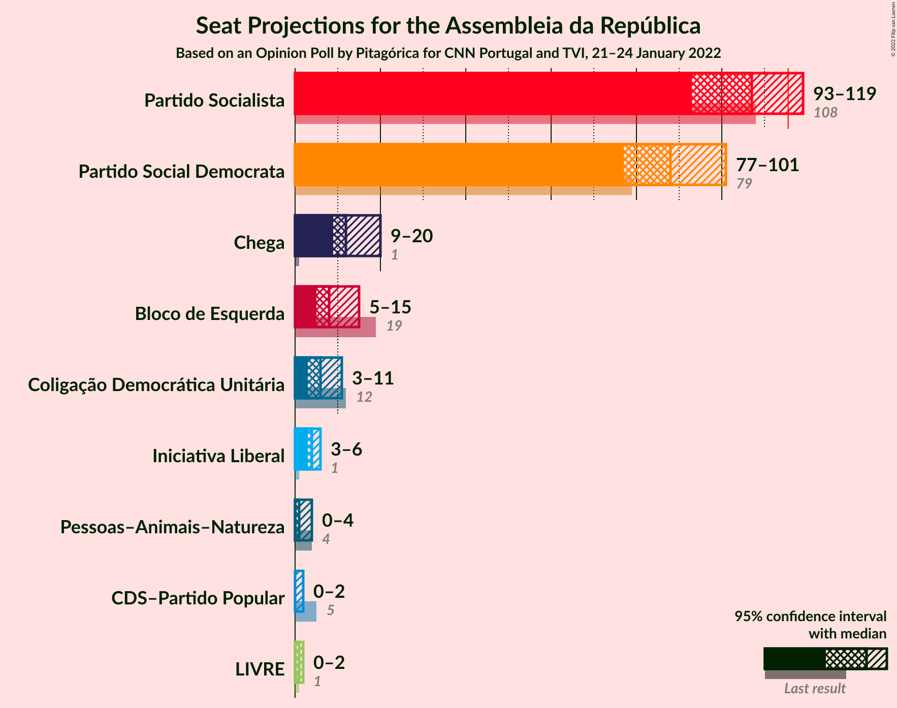

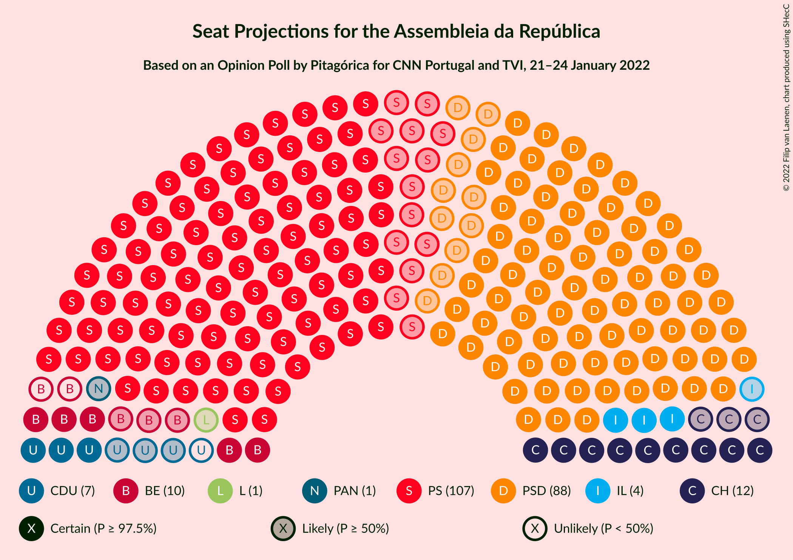

### Confidence Intervals

| Party | Last Result | Median | 80% Confidence Interval | 90% Confidence Interval | 95% Confidence Interval | 99% Confidence Interval |
|:-----:|:-----------:|:------:|:-----------------------:|:-----------------------:|:-----------------------:|:-----------------------:|
| <a href="#partido-socialista">Partido Socialista</a> | 108 | 107 | 97–115 |95–118 |93–119 |89–122 |
| <a href="#partido-social-democrata">Partido Social Democrata</a> | 79 | 88 | 81–98 |79–99 |77–101 |74–105 |
| <a href="#chega">Chega</a> | 1 | 12 | 11–17 |10–19 |9–20 |8–24 |
| <a href="#bloco-de-esquerda">Bloco de Esquerda</a> | 19 | 8 | 7–13 |5–14 |5–15 |3–17 |
| <a href="#coligação-democrática-unitária">Coligação Democrática Unitária</a> | 12 | 6 | 5–9 |4–9 |3–11 |2–14 |
| <a href="#iniciativa-liberal">Iniciativa Liberal</a> | 1 | 4 | 3–6 |3–6 |3–6 |1–9 |
| <a href="#pessoas–animais–natureza">Pessoas–Animais–Natureza</a> | 4 | 1 | 0–2 |0–4 |0–4 |0–4 |
| <a href="#cds–partido-popular">CDS–Partido Popular</a> | 5 | 0 | 0–1 |0–1 |0–2 |0–2 |
| <a href="#livre">LIVRE</a> | 1 | 1 | 0–1 |0–1 |0–2 |0–3 |

### Partido Socialista

*For a full overview of the results for this party, see the [Partido Socialista](party-partidosocialista.html) page.*

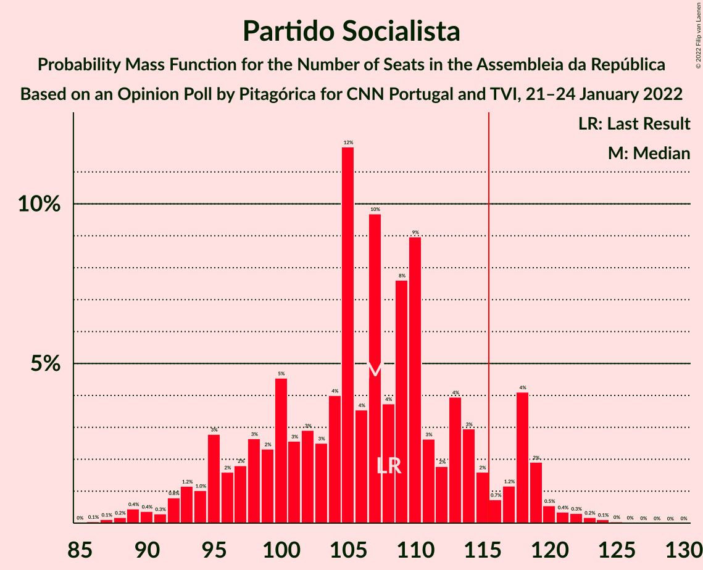

| Number of Seats | Probability | Accumulated | Special Marks |
|:---------------:|:-----------:|:-----------:|:-------------:|
| 85 | 0% | 100% |  |
| 86 | 0.1% | 99.9% |  |
| 87 | 0.1% | 99.9% |  |
| 88 | 0.2% | 99.8% |  |
| 89 | 0.4% | 99.6% |  |
| 90 | 0.4% | 99.1% |  |
| 91 | 0.3% | 98.8% |  |
| 92 | 0.8% | 98% |  |
| 93 | 1.2% | 98% |  |
| 94 | 1.0% | 97% |  |
| 95 | 3% | 96% |  |
| 96 | 2% | 93% |  |
| 97 | 2% | 91% |  |
| 98 | 3% | 89% |  |
| 99 | 2% | 87% |  |
| 100 | 5% | 84% |  |
| 101 | 3% | 80% |  |
| 102 | 3% | 77% |  |
| 103 | 3% | 74% |  |
| 104 | 4% | 72% |  |
| 105 | 12% | 68% |  |
| 106 | 4% | 56% |  |
| 107 | 10% | 52% | Median |
| 108 | 4% | 43% | Last Result |
| 109 | 8% | 39% |  |
| 110 | 9% | 31% |  |
| 111 | 3% | 22% |  |
| 112 | 2% | 20% |  |
| 113 | 4% | 18% |  |
| 114 | 3% | 14% |  |
| 115 | 2% | 11% |  |
| 116 | 0.7% | 10% | Majority |
| 117 | 1.2% | 9% |  |
| 118 | 4% | 8% |  |
| 119 | 2% | 4% |  |
| 120 | 0.5% | 2% |  |
| 121 | 0.4% | 1.1% |  |
| 122 | 0.3% | 0.7% |  |
| 123 | 0.2% | 0.4% |  |
| 124 | 0.1% | 0.2% |  |
| 125 | 0% | 0.1% |  |
| 126 | 0% | 0.1% |  |
| 127 | 0% | 0% |  |

### Partido Social Democrata

*For a full overview of the results for this party, see the [Partido Social Democrata](party-partidosocialdemocrata.html) page.*

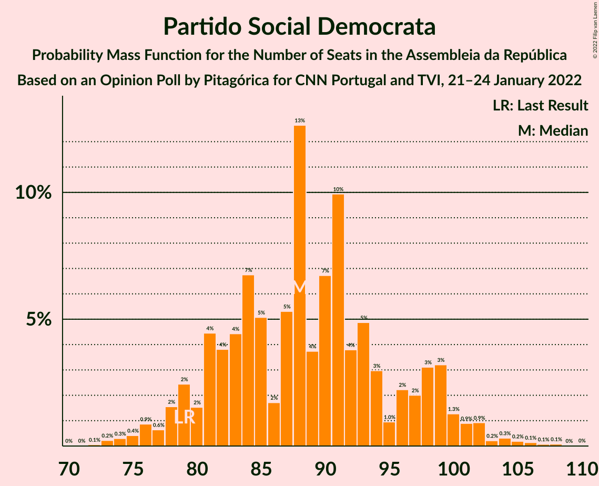

| Number of Seats | Probability | Accumulated | Special Marks |
|:---------------:|:-----------:|:-----------:|:-------------:|
| 70 | 0% | 100% |  |
| 71 | 0% | 99.9% |  |
| 72 | 0.1% | 99.9% |  |
| 73 | 0.2% | 99.9% |  |
| 74 | 0.3% | 99.6% |  |
| 75 | 0.4% | 99.3% |  |
| 76 | 0.9% | 98.9% |  |
| 77 | 0.6% | 98% |  |
| 78 | 2% | 97% |  |
| 79 | 2% | 96% | Last Result |
| 80 | 2% | 93% |  |
| 81 | 4% | 92% |  |
| 82 | 4% | 87% |  |
| 83 | 4% | 84% |  |
| 84 | 7% | 79% |  |
| 85 | 5% | 72% |  |
| 86 | 2% | 67% |  |
| 87 | 5% | 66% |  |
| 88 | 13% | 60% | Median |
| 89 | 4% | 48% |  |
| 90 | 7% | 44% |  |
| 91 | 10% | 37% |  |
| 92 | 4% | 27% |  |
| 93 | 5% | 23% |  |
| 94 | 3% | 19% |  |
| 95 | 1.0% | 16% |  |
| 96 | 2% | 15% |  |
| 97 | 2% | 12% |  |
| 98 | 3% | 10% |  |
| 99 | 3% | 7% |  |
| 100 | 1.3% | 4% |  |
| 101 | 0.9% | 3% |  |
| 102 | 0.9% | 2% |  |
| 103 | 0.2% | 1.1% |  |
| 104 | 0.3% | 0.8% |  |
| 105 | 0.2% | 0.5% |  |
| 106 | 0.1% | 0.3% |  |
| 107 | 0.1% | 0.2% |  |
| 108 | 0.1% | 0.1% |  |
| 109 | 0% | 0% |  |

### Chega

*For a full overview of the results for this party, see the [Chega](party-chega.html) page.*

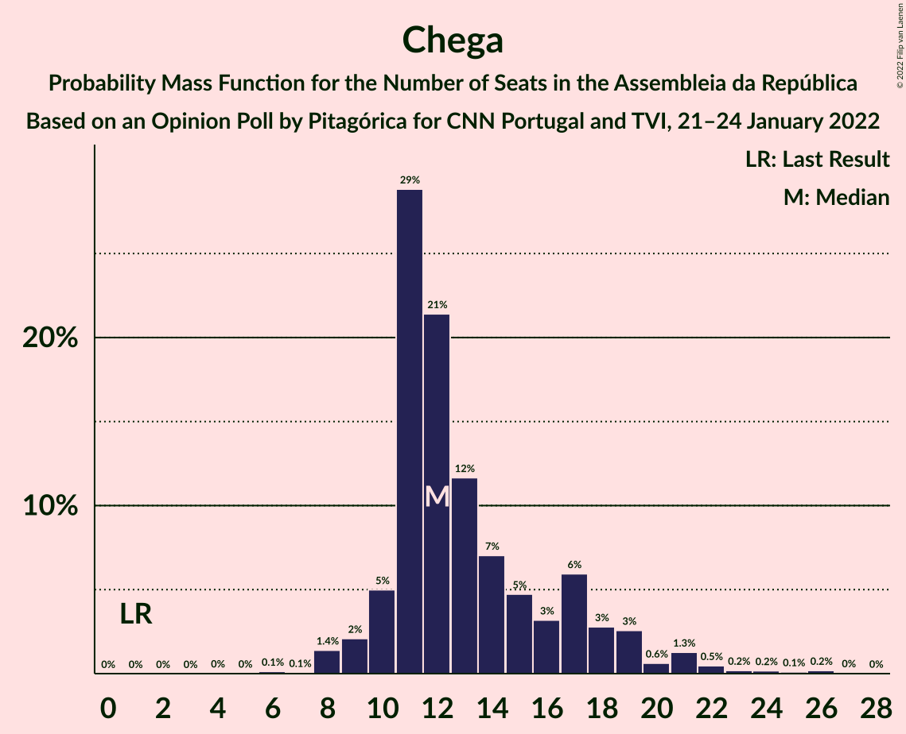

| Number of Seats | Probability | Accumulated | Special Marks |
|:---------------:|:-----------:|:-----------:|:-------------:|
| 1 | 0% | 100% | Last Result |
| 2 | 0% | 100% |  |
| 3 | 0% | 100% |  |
| 4 | 0% | 100% |  |
| 5 | 0% | 100% |  |
| 6 | 0.1% | 99.9% |  |
| 7 | 0.1% | 99.8% |  |
| 8 | 1.4% | 99.8% |  |
| 9 | 2% | 98% |  |
| 10 | 5% | 96% |  |
| 11 | 29% | 91% |  |
| 12 | 21% | 62% | Median |
| 13 | 12% | 41% |  |
| 14 | 7% | 29% |  |
| 15 | 5% | 22% |  |
| 16 | 3% | 18% |  |
| 17 | 6% | 14% |  |
| 18 | 3% | 8% |  |
| 19 | 3% | 6% |  |
| 20 | 0.6% | 3% |  |
| 21 | 1.3% | 2% |  |
| 22 | 0.5% | 1.2% |  |
| 23 | 0.2% | 0.7% |  |
| 24 | 0.2% | 0.5% |  |
| 25 | 0.1% | 0.4% |  |
| 26 | 0.2% | 0.3% |  |
| 27 | 0% | 0.1% |  |
| 28 | 0% | 0% |  |

### Bloco de Esquerda

*For a full overview of the results for this party, see the [Bloco de Esquerda](party-blocodeesquerda.html) page.*

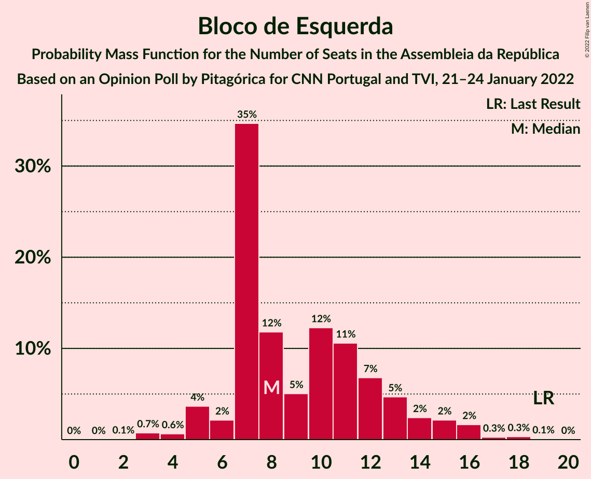

| Number of Seats | Probability | Accumulated | Special Marks |
|:---------------:|:-----------:|:-----------:|:-------------:|
| 2 | 0.1% | 100% |  |
| 3 | 0.7% | 99.9% |  |
| 4 | 0.6% | 99.2% |  |
| 5 | 4% | 98.6% |  |
| 6 | 2% | 95% |  |
| 7 | 35% | 93% |  |
| 8 | 12% | 58% | Median |
| 9 | 5% | 46% |  |
| 10 | 12% | 41% |  |
| 11 | 11% | 29% |  |
| 12 | 7% | 18% |  |
| 13 | 5% | 12% |  |
| 14 | 2% | 7% |  |
| 15 | 2% | 4% |  |
| 16 | 2% | 2% |  |
| 17 | 0.3% | 0.7% |  |
| 18 | 0.3% | 0.4% |  |
| 19 | 0.1% | 0.1% | Last Result |
| 20 | 0% | 0% |  |

### Coligação Democrática Unitária

*For a full overview of the results for this party, see the [Coligação Democrática Unitária](party-coligaçãodemocráticaunitária.html) page.*

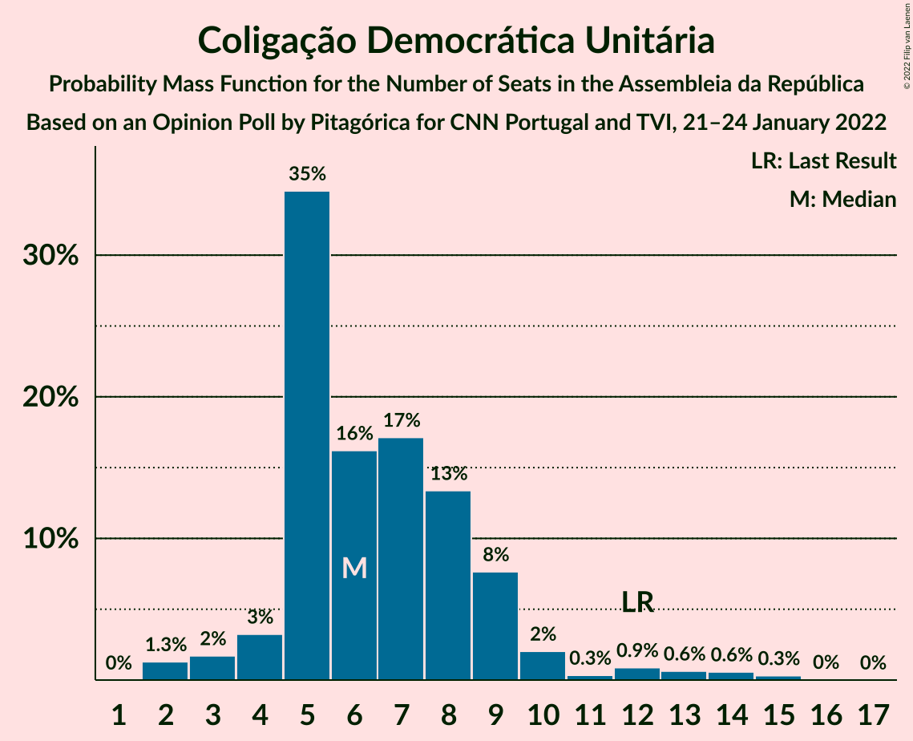

| Number of Seats | Probability | Accumulated | Special Marks |
|:---------------:|:-----------:|:-----------:|:-------------:|
| 2 | 1.3% | 100% |  |
| 3 | 2% | 98.7% |  |
| 4 | 3% | 97% |  |
| 5 | 35% | 94% |  |
| 6 | 16% | 59% | Median |
| 7 | 17% | 43% |  |
| 8 | 13% | 26% |  |
| 9 | 8% | 12% |  |
| 10 | 2% | 5% |  |
| 11 | 0.3% | 3% |  |
| 12 | 0.9% | 2% | Last Result |
| 13 | 0.6% | 2% |  |
| 14 | 0.6% | 0.9% |  |
| 15 | 0.3% | 0.4% |  |
| 16 | 0% | 0.1% |  |
| 17 | 0% | 0% |  |

### Iniciativa Liberal

*For a full overview of the results for this party, see the [Iniciativa Liberal](party-iniciativaliberal.html) page.*

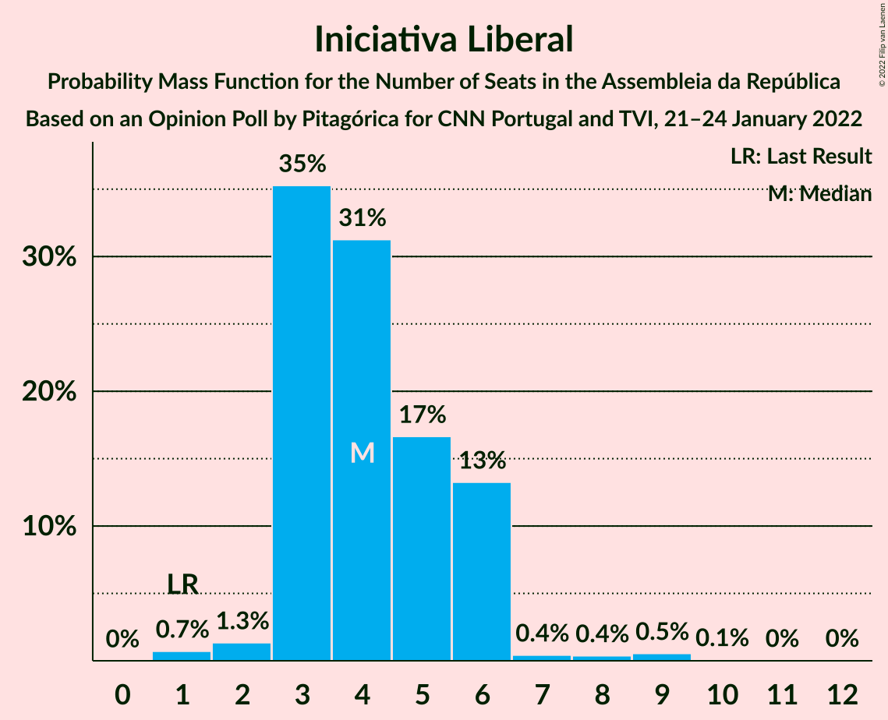

| Number of Seats | Probability | Accumulated | Special Marks |
|:---------------:|:-----------:|:-----------:|:-------------:|
| 1 | 0.7% | 100% | Last Result |
| 2 | 1.3% | 99.3% |  |
| 3 | 35% | 98% |  |
| 4 | 31% | 63% | Median |
| 5 | 17% | 31% |  |
| 6 | 13% | 15% |  |
| 7 | 0.4% | 2% |  |
| 8 | 0.4% | 1.1% |  |
| 9 | 0.5% | 0.7% |  |
| 10 | 0.1% | 0.2% |  |
| 11 | 0% | 0.1% |  |
| 12 | 0% | 0% |  |

### Pessoas–Animais–Natureza

*For a full overview of the results for this party, see the [Pessoas–Animais–Natureza](party-pessoas–animais–natureza.html) page.*

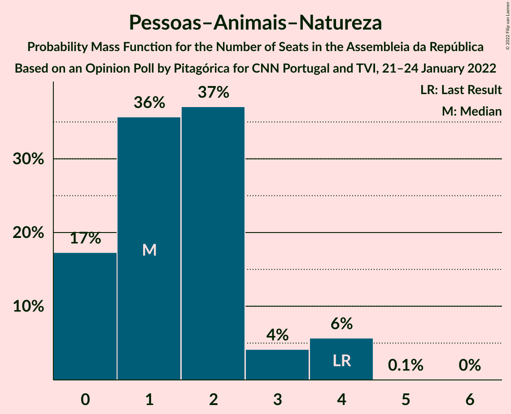

| Number of Seats | Probability | Accumulated | Special Marks |
|:---------------:|:-----------:|:-----------:|:-------------:|
| 0 | 17% | 100% |  |
| 1 | 36% | 83% | Median |
| 2 | 37% | 47% |  |
| 3 | 4% | 10% |  |
| 4 | 6% | 6% | Last Result |
| 5 | 0.1% | 0.1% |  |
| 6 | 0% | 0% |  |

### CDS–Partido Popular

*For a full overview of the results for this party, see the [CDS–Partido Popular](party-cds–partidopopular.html) page.*

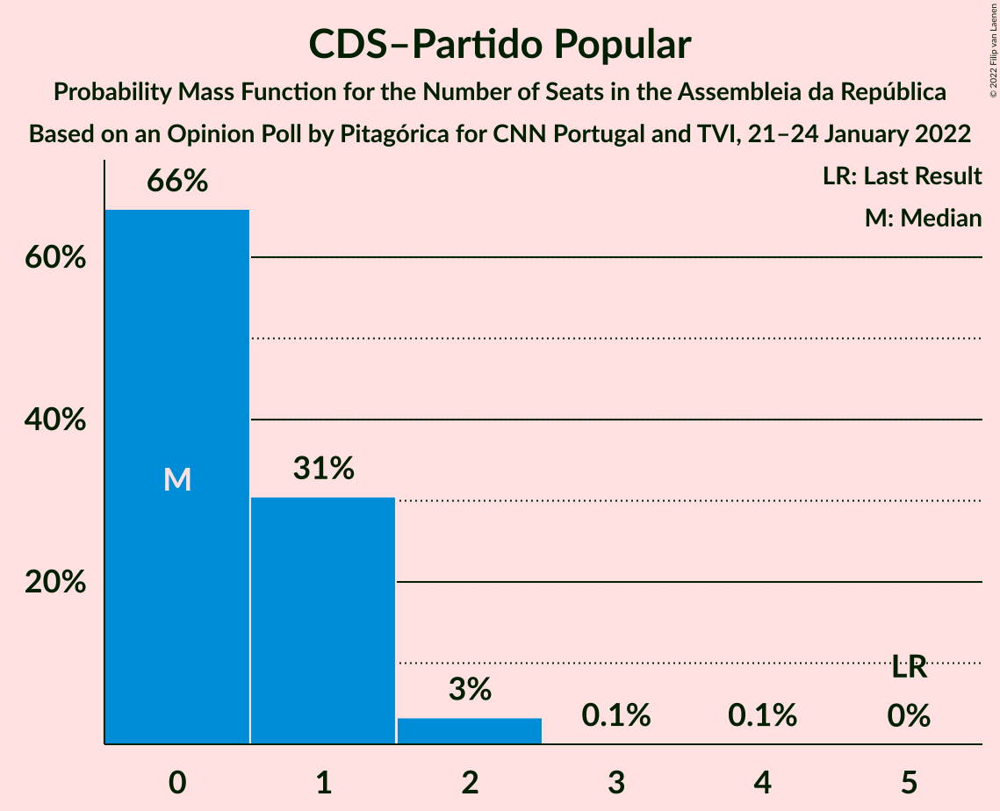

| Number of Seats | Probability | Accumulated | Special Marks |
|:---------------:|:-----------:|:-----------:|:-------------:|
| 0 | 66% | 100% | Median |
| 1 | 31% | 34% |  |
| 2 | 3% | 4% |  |
| 3 | 0.1% | 0.2% |  |
| 4 | 0.1% | 0.1% |  |
| 5 | 0% | 0% | Last Result |

### LIVRE

*For a full overview of the results for this party, see the [LIVRE](party-livre.html) page.*

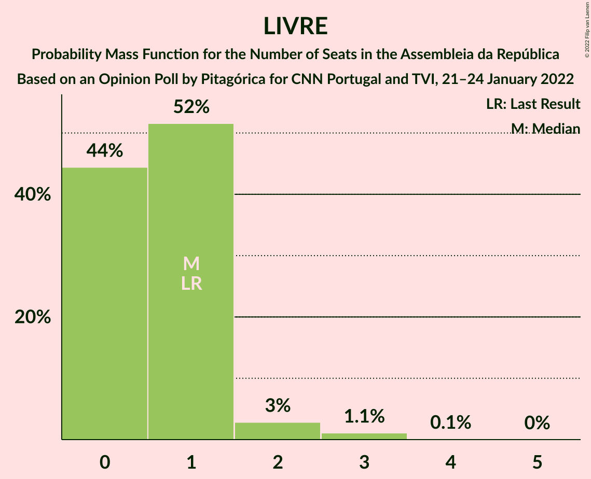

| Number of Seats | Probability | Accumulated | Special Marks |
|:---------------:|:-----------:|:-----------:|:-------------:|
| 0 | 44% | 100% |  |
| 1 | 52% | 56% | Last Result, Median |
| 2 | 3% | 4% |  |
| 3 | 1.1% | 1.2% |  |
| 4 | 0.1% | 0.1% |  |
| 5 | 0% | 0% |  |

## Coalitions

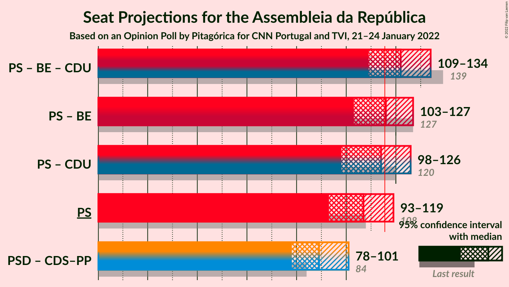

### Confidence Intervals

| Coalition | Last Result | Median | Majority? | 80% Confidence Interval | 90% Confidence Interval | 95% Confidence Interval | 99% Confidence Interval |
|:---------:|:-----------:|:------:|:---------:|:-----------------------:|:-----------------------:|:-----------------------:|:-----------------------:|
| Partido Socialista – Bloco de Esquerda – Coligação Democrática Unitária | 139 | 122 | 80% | 113–130 | 111–132 | 109–134 | 103–138 |
| Partido Socialista – Bloco de Esquerda | 127 | 116 | 50% | 107–125 | 105–126 | 103–127 | 98–131 |
| Partido Socialista – Coligação Democrática Unitária | 120 | 114 | 35% | 103–122 | 100–123 | 98–126 | 94–128 |
| Partido Socialista | 108 | 107 | 10% | 97–115 | 95–118 | 93–119 | 89–122 |
| Partido Social Democrata – CDS–Partido Popular | 84 | 89 | 0% | 81–98 | 79–100 | 78–101 | 74–105 |

### Partido Socialista – Bloco de Esquerda – Coligação Democrática Unitária

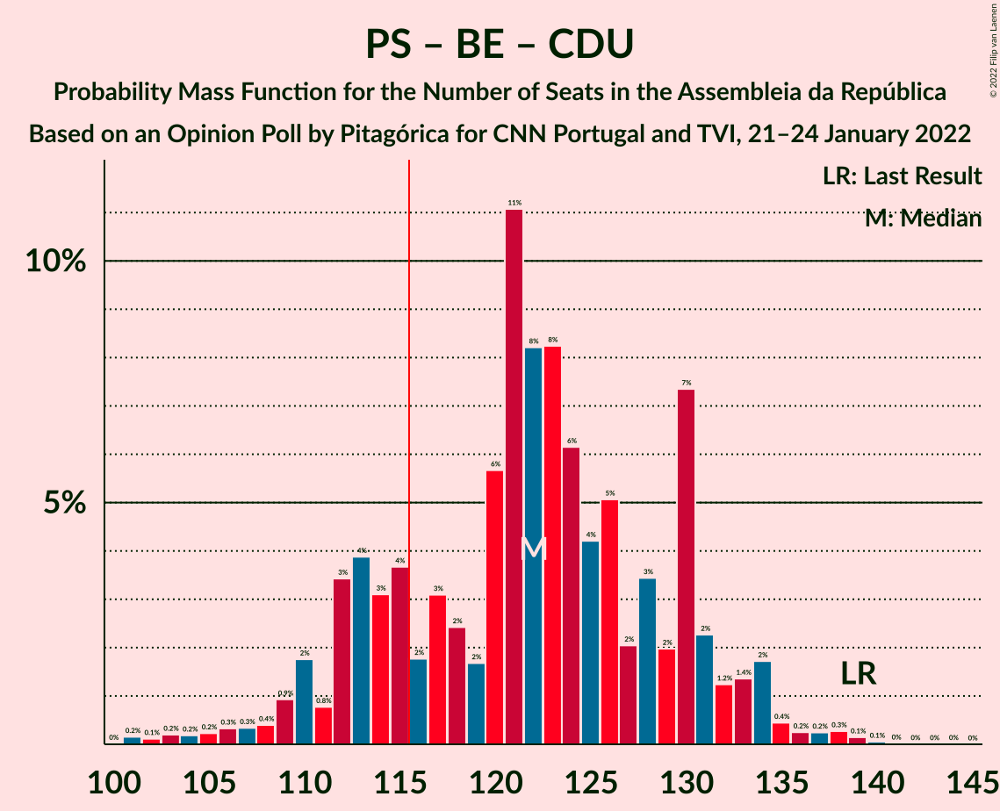

| Number of Seats | Probability | Accumulated | Special Marks |
|:---------------:|:-----------:|:-----------:|:-------------:|
| 101 | 0.2% | 100% |  |
| 102 | 0.1% | 99.8% |  |
| 103 | 0.2% | 99.7% |  |
| 104 | 0.2% | 99.5% |  |
| 105 | 0.2% | 99.3% |  |
| 106 | 0.3% | 99.1% |  |
| 107 | 0.3% | 98.8% |  |
| 108 | 0.4% | 98% |  |
| 109 | 0.9% | 98% |  |
| 110 | 2% | 97% |  |
| 111 | 0.8% | 95% |  |
| 112 | 3% | 95% |  |
| 113 | 4% | 91% |  |
| 114 | 3% | 87% |  |
| 115 | 4% | 84% |  |
| 116 | 2% | 80% | Majority |
| 117 | 3% | 79% |  |
| 118 | 2% | 76% |  |
| 119 | 2% | 73% |  |
| 120 | 6% | 72% |  |
| 121 | 11% | 66% | Median |
| 122 | 8% | 55% |  |
| 123 | 8% | 47% |  |
| 124 | 6% | 38% |  |
| 125 | 4% | 32% |  |
| 126 | 5% | 28% |  |
| 127 | 2% | 23% |  |
| 128 | 3% | 21% |  |
| 129 | 2% | 17% |  |
| 130 | 7% | 15% |  |
| 131 | 2% | 8% |  |
| 132 | 1.2% | 6% |  |
| 133 | 1.4% | 5% |  |
| 134 | 2% | 3% |  |
| 135 | 0.4% | 1.5% |  |
| 136 | 0.2% | 1.0% |  |
| 137 | 0.2% | 0.8% |  |
| 138 | 0.3% | 0.5% |  |
| 139 | 0.1% | 0.2% | Last Result |
| 140 | 0.1% | 0.1% |  |
| 141 | 0% | 0% |  |

### Partido Socialista – Bloco de Esquerda

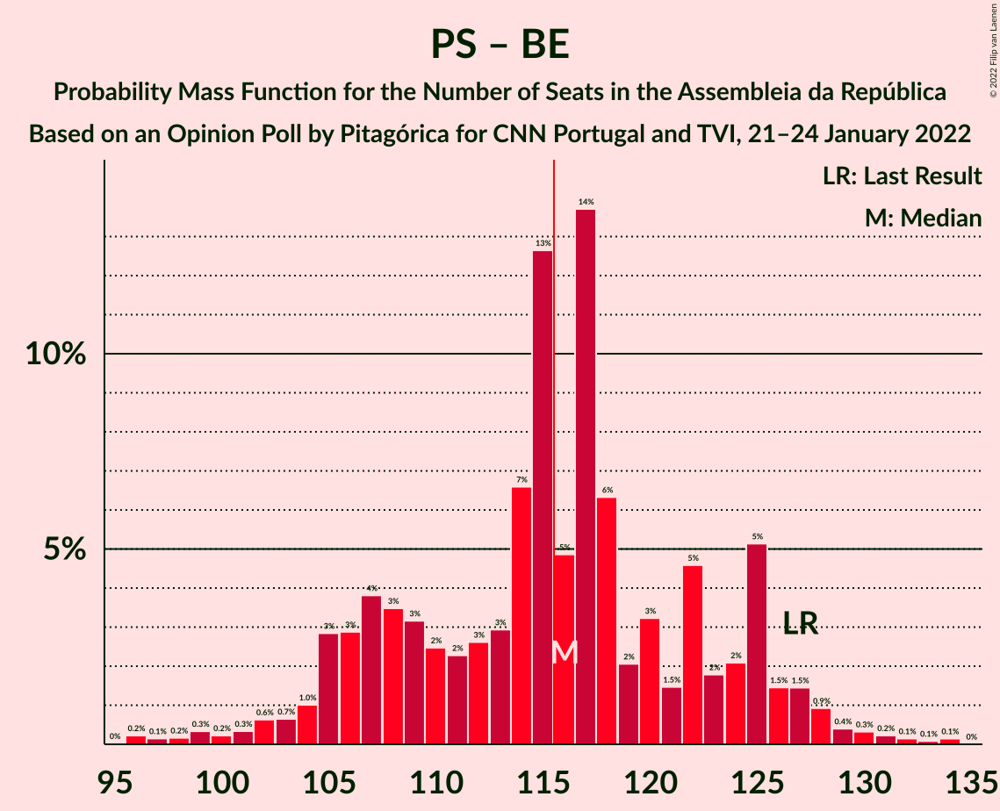

| Number of Seats | Probability | Accumulated | Special Marks |
|:---------------:|:-----------:|:-----------:|:-------------:|
| 95 | 0% | 100% |  |
| 96 | 0.2% | 99.9% |  |
| 97 | 0.1% | 99.7% |  |
| 98 | 0.2% | 99.6% |  |
| 99 | 0.3% | 99.4% |  |
| 100 | 0.2% | 99.1% |  |
| 101 | 0.3% | 98.8% |  |
| 102 | 0.6% | 98% |  |
| 103 | 0.7% | 98% |  |
| 104 | 1.0% | 97% |  |
| 105 | 3% | 96% |  |
| 106 | 3% | 93% |  |
| 107 | 4% | 90% |  |
| 108 | 3% | 87% |  |
| 109 | 3% | 83% |  |
| 110 | 2% | 80% |  |
| 111 | 2% | 78% |  |
| 112 | 3% | 75% |  |
| 113 | 3% | 73% |  |
| 114 | 7% | 70% |  |
| 115 | 13% | 63% | Median |
| 116 | 5% | 50% | Majority |
| 117 | 14% | 46% |  |
| 118 | 6% | 32% |  |
| 119 | 2% | 26% |  |
| 120 | 3% | 23% |  |
| 121 | 1.5% | 20% |  |
| 122 | 5% | 19% |  |
| 123 | 2% | 14% |  |
| 124 | 2% | 12% |  |
| 125 | 5% | 10% |  |
| 126 | 1.5% | 5% |  |
| 127 | 1.5% | 4% | Last Result |
| 128 | 0.9% | 2% |  |
| 129 | 0.4% | 1.4% |  |
| 130 | 0.3% | 1.0% |  |
| 131 | 0.2% | 0.6% |  |
| 132 | 0.1% | 0.4% |  |
| 133 | 0.1% | 0.3% |  |
| 134 | 0.1% | 0.2% |  |
| 135 | 0% | 0% |  |

### Partido Socialista – Coligação Democrática Unitária

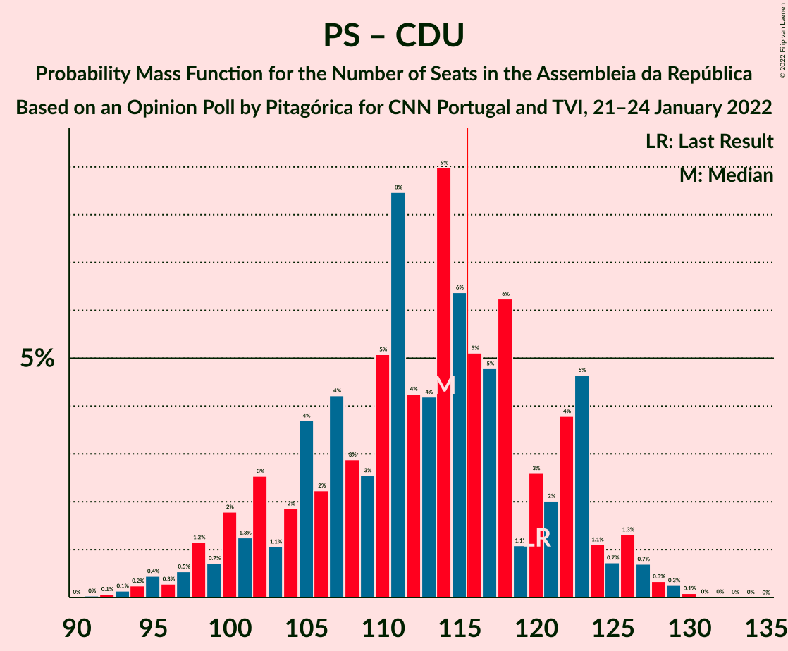

| Number of Seats | Probability | Accumulated | Special Marks |
|:---------------:|:-----------:|:-----------:|:-------------:|
| 91 | 0% | 100% |  |
| 92 | 0.1% | 99.9% |  |
| 93 | 0.1% | 99.9% |  |
| 94 | 0.2% | 99.7% |  |
| 95 | 0.4% | 99.5% |  |
| 96 | 0.3% | 99.0% |  |
| 97 | 0.5% | 98.8% |  |
| 98 | 1.2% | 98% |  |
| 99 | 0.7% | 97% |  |
| 100 | 2% | 96% |  |
| 101 | 1.3% | 95% |  |
| 102 | 3% | 93% |  |
| 103 | 1.1% | 91% |  |
| 104 | 2% | 90% |  |
| 105 | 4% | 88% |  |
| 106 | 2% | 84% |  |
| 107 | 4% | 82% |  |
| 108 | 3% | 78% |  |
| 109 | 3% | 75% |  |
| 110 | 5% | 72% |  |
| 111 | 8% | 67% |  |
| 112 | 4% | 59% |  |
| 113 | 4% | 54% | Median |
| 114 | 9% | 50% |  |
| 115 | 6% | 41% |  |
| 116 | 5% | 35% | Majority |
| 117 | 5% | 30% |  |
| 118 | 6% | 25% |  |
| 119 | 1.1% | 19% |  |
| 120 | 3% | 18% | Last Result |
| 121 | 2% | 15% |  |
| 122 | 4% | 13% |  |
| 123 | 5% | 9% |  |
| 124 | 1.1% | 5% |  |
| 125 | 0.7% | 3% |  |
| 126 | 1.3% | 3% |  |
| 127 | 0.7% | 1.5% |  |
| 128 | 0.3% | 0.8% |  |
| 129 | 0.3% | 0.4% |  |
| 130 | 0.1% | 0.2% |  |
| 131 | 0% | 0.1% |  |
| 132 | 0% | 0.1% |  |
| 133 | 0% | 0% |  |

### Partido Socialista

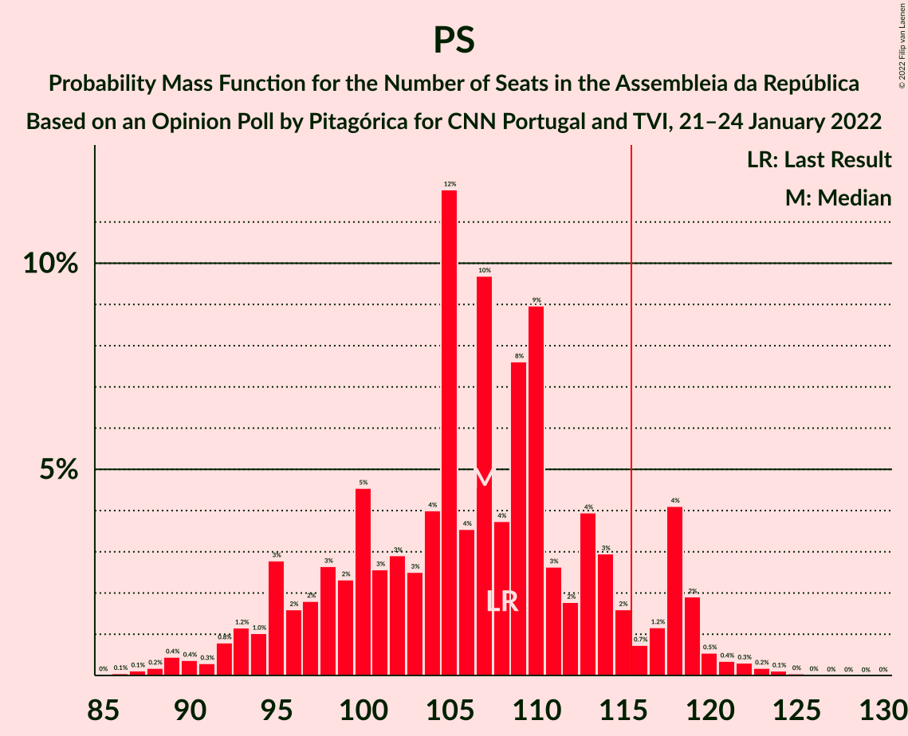

| Number of Seats | Probability | Accumulated | Special Marks |
|:---------------:|:-----------:|:-----------:|:-------------:|
| 85 | 0% | 100% |  |
| 86 | 0.1% | 99.9% |  |
| 87 | 0.1% | 99.9% |  |
| 88 | 0.2% | 99.8% |  |
| 89 | 0.4% | 99.6% |  |
| 90 | 0.4% | 99.1% |  |
| 91 | 0.3% | 98.8% |  |
| 92 | 0.8% | 98% |  |
| 93 | 1.2% | 98% |  |
| 94 | 1.0% | 97% |  |
| 95 | 3% | 96% |  |
| 96 | 2% | 93% |  |
| 97 | 2% | 91% |  |
| 98 | 3% | 89% |  |
| 99 | 2% | 87% |  |
| 100 | 5% | 84% |  |
| 101 | 3% | 80% |  |
| 102 | 3% | 77% |  |
| 103 | 3% | 74% |  |
| 104 | 4% | 72% |  |
| 105 | 12% | 68% |  |
| 106 | 4% | 56% |  |
| 107 | 10% | 52% | Median |
| 108 | 4% | 43% | Last Result |
| 109 | 8% | 39% |  |
| 110 | 9% | 31% |  |
| 111 | 3% | 22% |  |
| 112 | 2% | 20% |  |
| 113 | 4% | 18% |  |
| 114 | 3% | 14% |  |
| 115 | 2% | 11% |  |
| 116 | 0.7% | 10% | Majority |
| 117 | 1.2% | 9% |  |
| 118 | 4% | 8% |  |
| 119 | 2% | 4% |  |
| 120 | 0.5% | 2% |  |
| 121 | 0.4% | 1.1% |  |
| 122 | 0.3% | 0.7% |  |
| 123 | 0.2% | 0.4% |  |
| 124 | 0.1% | 0.2% |  |
| 125 | 0% | 0.1% |  |
| 126 | 0% | 0.1% |  |
| 127 | 0% | 0% |  |

### Partido Social Democrata – CDS–Partido Popular

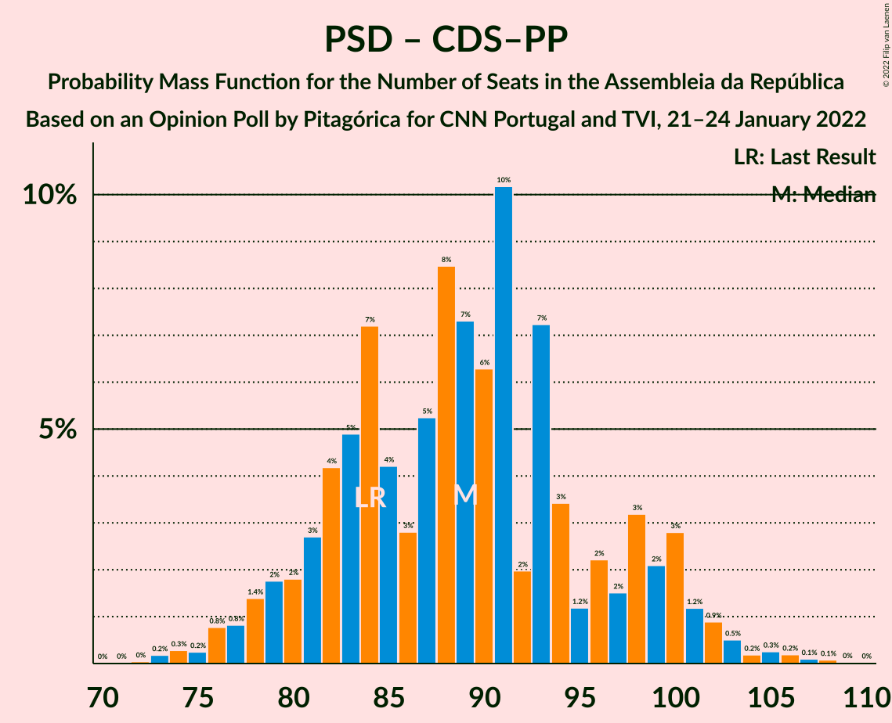

| Number of Seats | Probability | Accumulated | Special Marks |
|:---------------:|:-----------:|:-----------:|:-------------:|
| 71 | 0% | 100% |  |
| 72 | 0% | 99.9% |  |
| 73 | 0.2% | 99.9% |  |
| 74 | 0.3% | 99.7% |  |
| 75 | 0.2% | 99.4% |  |
| 76 | 0.8% | 99.2% |  |
| 77 | 0.8% | 98% |  |
| 78 | 1.4% | 98% |  |
| 79 | 2% | 96% |  |
| 80 | 2% | 94% |  |
| 81 | 3% | 93% |  |
| 82 | 4% | 90% |  |
| 83 | 5% | 86% |  |
| 84 | 7% | 81% | Last Result |
| 85 | 4% | 74% |  |
| 86 | 3% | 69% |  |
| 87 | 5% | 67% |  |
| 88 | 8% | 61% | Median |
| 89 | 7% | 53% |  |
| 90 | 6% | 46% |  |
| 91 | 10% | 39% |  |
| 92 | 2% | 29% |  |
| 93 | 7% | 27% |  |
| 94 | 3% | 20% |  |
| 95 | 1.2% | 16% |  |
| 96 | 2% | 15% |  |
| 97 | 2% | 13% |  |
| 98 | 3% | 12% |  |
| 99 | 2% | 8% |  |
| 100 | 3% | 6% |  |
| 101 | 1.2% | 3% |  |
| 102 | 0.9% | 2% |  |
| 103 | 0.5% | 1.4% |  |
| 104 | 0.2% | 0.9% |  |
| 105 | 0.3% | 0.7% |  |
| 106 | 0.2% | 0.4% |  |
| 107 | 0.1% | 0.2% |  |
| 108 | 0.1% | 0.2% |  |
| 109 | 0% | 0.1% |  |
| 110 | 0% | 0% |  |

## Technical Information

### Opinion Poll

+ **Polling firm:** Pitagórica
+ **Commissioner(s):** CNN Portugal and TVI
+ **Fieldwork period:** 21–24 January 2022

### Calculations

+ **Sample size:** 608
+ **Simulations done:** 1,048,576
+ **Error estimate:** 4.53%

