# Opinion Poll by Pitagórica for CNN Portugal and TVI, 22–25 January 2022

<a href="#voting-intentions">Voting Intentions</a> | <a href="#seats">Seats</a> | <a href="#coalitions">Coalitions</a> | <a href="#technical-information">Technical Information</a>

## Voting Intentions

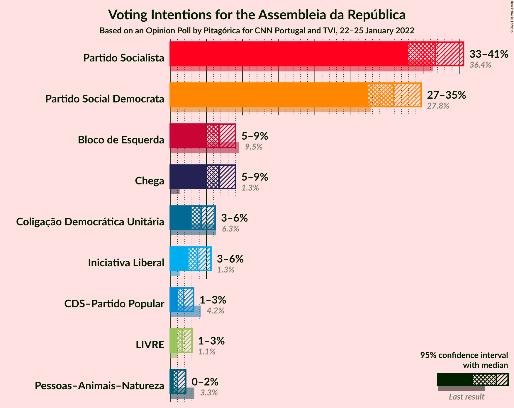

### Confidence Intervals

| Party | Last Result | Poll Result | 80% Confidence Interval | 90% Confidence Interval | 95% Confidence Interval | 99% Confidence Interval |
|:-----:|:-----------:|:-----------:|:-----------------------:|:-----------------------:|:-----------------------:|:-----------------------:|
| Partido Socialista | 36.4% | 36.7% | 34.2–39.2% |33.5–40.0% |32.9–40.6% |31.8–41.8% |
| Partido Social Democrata | 27.8% | 30.9% | 28.6–33.4% |27.9–34.1% |27.4–34.7% |26.3–35.9% |
| Bloco de Esquerda | 9.5% | 6.7% | 5.6–8.2% |5.3–8.7% |5.0–9.0% |4.5–9.8% |
| Chega | 1.3% | 6.7% | 5.6–8.2% |5.3–8.7% |5.0–9.0% |4.5–9.8% |
| Coligação Democrática Unitária | 6.3% | 4.3% | 3.4–5.5% |3.1–5.9% |2.9–6.2% |2.6–6.9% |
| Iniciativa Liberal | 1.3% | 3.8% | 3.0–5.0% |2.7–5.3% |2.5–5.6% |2.2–6.2% |
| CDS–Partido Popular | 4.2% | 1.8% | 1.3–2.7% |1.1–3.0% |1.0–3.2% |0.8–3.7% |
| LIVRE | 1.1% | 1.6% | 1.1–2.5% |1.0–2.8% |0.9–3.0% |0.7–3.5% |
| Pessoas–Animais–Natureza | 3.3% | 1.0% | 0.6–1.7% |0.5–1.9% |0.5–2.1% |0.3–2.6% |

*Note:* The poll result column reflects the actual value used in the calculations. Published results may vary slightly, and in addition be rounded to fewer digits.

## Seats

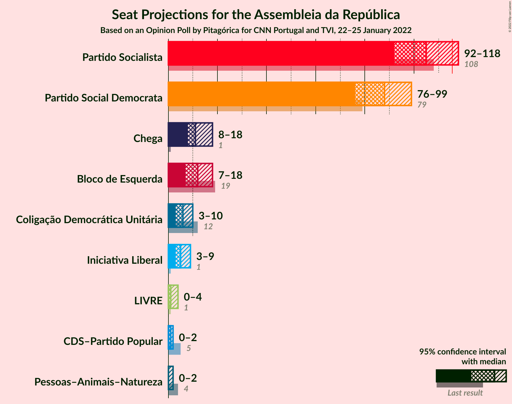

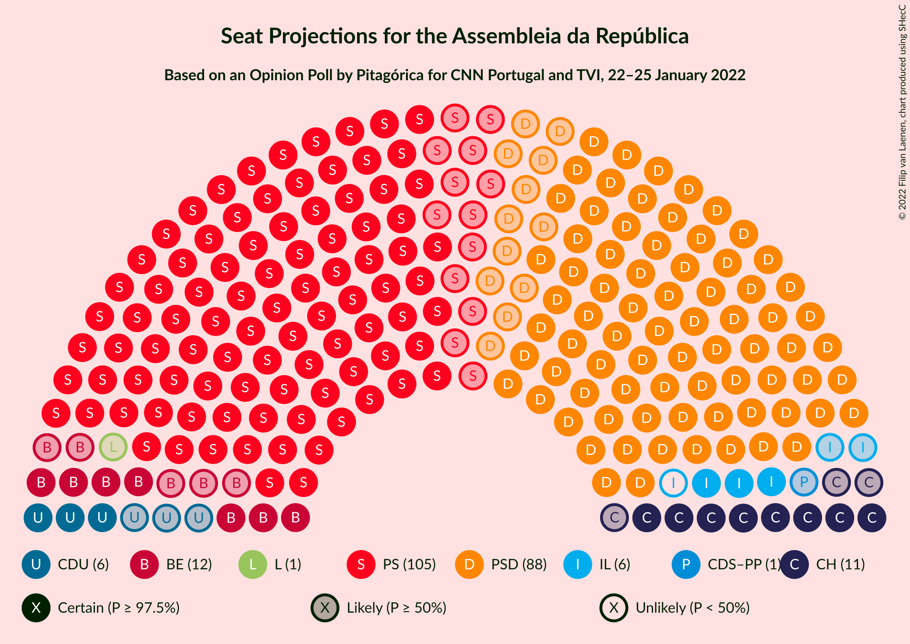

### Confidence Intervals

| Party | Last Result | Median | 80% Confidence Interval | 90% Confidence Interval | 95% Confidence Interval | 99% Confidence Interval |
|:-----:|:-----------:|:------:|:-----------------------:|:-----------------------:|:-----------------------:|:-----------------------:|
| <a href="#partido-socialista">Partido Socialista</a> | 108 | 105 | 96–114 |94–117 |92–118 |89–122 |
| <a href="#partido-social-democrata">Partido Social Democrata</a> | 79 | 88 | 79–98 |78–98 |76–99 |73–104 |
| <a href="#bloco-de-esquerda">Bloco de Esquerda</a> | 19 | 12 | 8–16 |7–17 |7–18 |7–20 |
| <a href="#chega">Chega</a> | 1 | 11 | 9–14 |8–15 |8–18 |5–19 |
| <a href="#coligação-democrática-unitária">Coligação Democrática Unitária</a> | 12 | 6 | 5–8 |4–9 |3–10 |2–13 |
| <a href="#iniciativa-liberal">Iniciativa Liberal</a> | 1 | 5 | 3–6 |3–8 |3–9 |3–11 |
| <a href="#cds–partido-popular">CDS–Partido Popular</a> | 5 | 1 | 0–2 |0–2 |0–2 |0–4 |
| <a href="#livre">LIVRE</a> | 1 | 1 | 1–3 |0–3 |0–4 |0–4 |
| <a href="#pessoas–animais–natureza">Pessoas–Animais–Natureza</a> | 4 | 0 | 0–1 |0–1 |0–2 |0–2 |

### Partido Socialista

*For a full overview of the results for this party, see the [Partido Socialista](party-partidosocialista.html) page.*

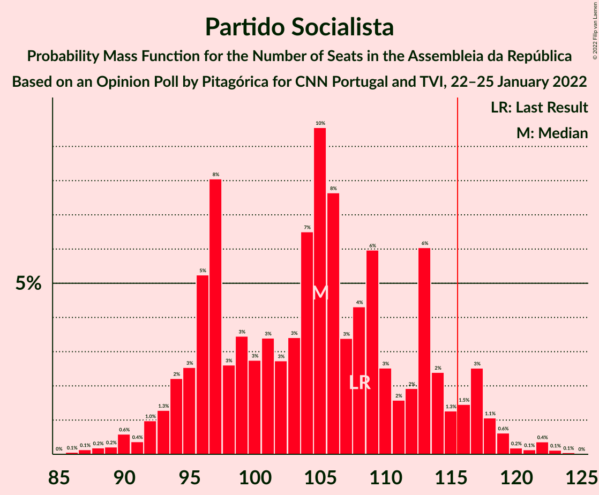

| Number of Seats | Probability | Accumulated | Special Marks |
|:---------------:|:-----------:|:-----------:|:-------------:|
| 85 | 0% | 100% |  |
| 86 | 0.1% | 99.9% |  |
| 87 | 0.1% | 99.9% |  |
| 88 | 0.2% | 99.7% |  |
| 89 | 0.2% | 99.6% |  |
| 90 | 0.6% | 99.3% |  |
| 91 | 0.4% | 98.7% |  |
| 92 | 1.0% | 98% |  |
| 93 | 1.3% | 97% |  |
| 94 | 2% | 96% |  |
| 95 | 3% | 94% |  |
| 96 | 5% | 91% |  |
| 97 | 8% | 86% |  |
| 98 | 3% | 78% |  |
| 99 | 3% | 75% |  |
| 100 | 3% | 72% |  |
| 101 | 3% | 69% |  |
| 102 | 3% | 66% |  |
| 103 | 3% | 63% |  |
| 104 | 7% | 60% |  |
| 105 | 10% | 53% | Median |
| 106 | 8% | 44% |  |
| 107 | 3% | 36% |  |
| 108 | 4% | 33% | Last Result |
| 109 | 6% | 28% |  |
| 110 | 3% | 22% |  |
| 111 | 2% | 20% |  |
| 112 | 2% | 18% |  |
| 113 | 6% | 16% |  |
| 114 | 2% | 10% |  |
| 115 | 1.3% | 8% |  |
| 116 | 1.5% | 7% | Majority |
| 117 | 3% | 5% |  |
| 118 | 1.1% | 3% |  |
| 119 | 0.6% | 2% |  |
| 120 | 0.2% | 0.9% |  |
| 121 | 0.1% | 0.7% |  |
| 122 | 0.4% | 0.6% |  |
| 123 | 0.1% | 0.2% |  |
| 124 | 0.1% | 0.1% |  |
| 125 | 0% | 0% |  |

### Partido Social Democrata

*For a full overview of the results for this party, see the [Partido Social Democrata](party-partidosocialdemocrata.html) page.*

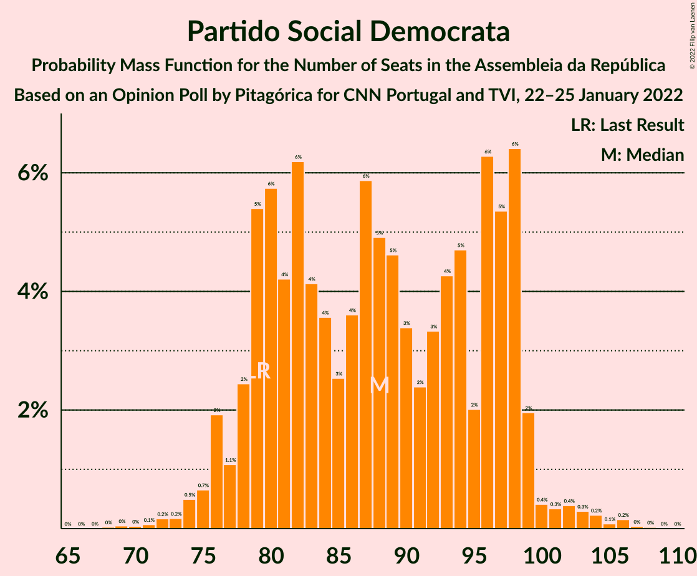

| Number of Seats | Probability | Accumulated | Special Marks |
|:---------------:|:-----------:|:-----------:|:-------------:|
| 69 | 0% | 100% |  |
| 70 | 0% | 99.9% |  |
| 71 | 0.1% | 99.9% |  |
| 72 | 0.2% | 99.8% |  |
| 73 | 0.2% | 99.6% |  |
| 74 | 0.5% | 99.5% |  |
| 75 | 0.7% | 99.0% |  |
| 76 | 2% | 98% |  |
| 77 | 1.1% | 96% |  |
| 78 | 2% | 95% |  |
| 79 | 5% | 93% | Last Result |
| 80 | 6% | 87% |  |
| 81 | 4% | 82% |  |
| 82 | 6% | 78% |  |
| 83 | 4% | 71% |  |
| 84 | 4% | 67% |  |
| 85 | 3% | 64% |  |
| 86 | 4% | 61% |  |
| 87 | 6% | 57% |  |
| 88 | 5% | 52% | Median |
| 89 | 5% | 47% |  |
| 90 | 3% | 42% |  |
| 91 | 2% | 39% |  |
| 92 | 3% | 36% |  |
| 93 | 4% | 33% |  |
| 94 | 5% | 29% |  |
| 95 | 2% | 24% |  |
| 96 | 6% | 22% |  |
| 97 | 5% | 16% |  |
| 98 | 6% | 10% |  |
| 99 | 2% | 4% |  |
| 100 | 0.4% | 2% |  |
| 101 | 0.3% | 2% |  |
| 102 | 0.4% | 1.2% |  |
| 103 | 0.3% | 0.8% |  |
| 104 | 0.2% | 0.5% |  |
| 105 | 0.1% | 0.3% |  |
| 106 | 0.2% | 0.2% |  |
| 107 | 0% | 0.1% |  |
| 108 | 0% | 0% |  |

### Bloco de Esquerda

*For a full overview of the results for this party, see the [Bloco de Esquerda](party-blocodeesquerda.html) page.*

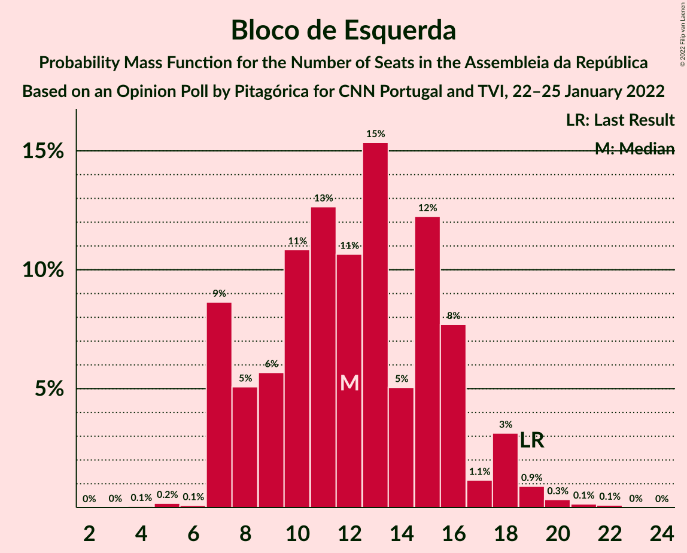

| Number of Seats | Probability | Accumulated | Special Marks |
|:---------------:|:-----------:|:-----------:|:-------------:|
| 4 | 0.1% | 100% |  |
| 5 | 0.2% | 99.9% |  |
| 6 | 0.1% | 99.8% |  |
| 7 | 9% | 99.7% |  |
| 8 | 5% | 91% |  |
| 9 | 6% | 86% |  |
| 10 | 11% | 80% |  |
| 11 | 13% | 69% |  |
| 12 | 11% | 57% | Median |
| 13 | 15% | 46% |  |
| 14 | 5% | 31% |  |
| 15 | 12% | 26% |  |
| 16 | 8% | 13% |  |
| 17 | 1.1% | 6% |  |
| 18 | 3% | 5% |  |
| 19 | 0.9% | 1.5% | Last Result |
| 20 | 0.3% | 0.6% |  |
| 21 | 0.1% | 0.3% |  |
| 22 | 0.1% | 0.1% |  |
| 23 | 0% | 0% |  |

### Chega

*For a full overview of the results for this party, see the [Chega](party-chega.html) page.*

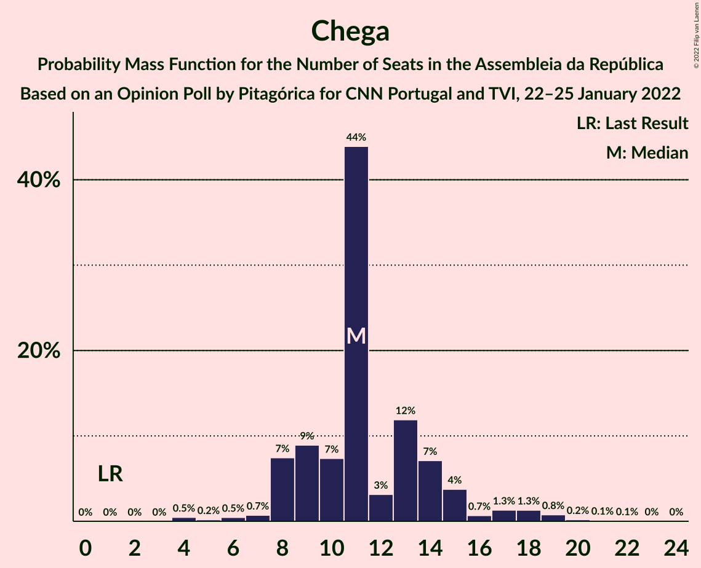

| Number of Seats | Probability | Accumulated | Special Marks |
|:---------------:|:-----------:|:-----------:|:-------------:|
| 1 | 0% | 100% | Last Result |
| 2 | 0% | 100% |  |
| 3 | 0% | 100% |  |
| 4 | 0.5% | 100% |  |
| 5 | 0.2% | 99.5% |  |
| 6 | 0.5% | 99.3% |  |
| 7 | 0.7% | 98.9% |  |
| 8 | 7% | 98% |  |
| 9 | 9% | 91% |  |
| 10 | 7% | 82% |  |
| 11 | 44% | 74% | Median |
| 12 | 3% | 30% |  |
| 13 | 12% | 27% |  |
| 14 | 7% | 15% |  |
| 15 | 4% | 8% |  |
| 16 | 0.7% | 5% |  |
| 17 | 1.3% | 4% |  |
| 18 | 1.3% | 3% |  |
| 19 | 0.8% | 1.2% |  |
| 20 | 0.2% | 0.5% |  |
| 21 | 0.1% | 0.3% |  |
| 22 | 0.1% | 0.1% |  |
| 23 | 0% | 0.1% |  |
| 24 | 0% | 0% |  |

### Coligação Democrática Unitária

*For a full overview of the results for this party, see the [Coligação Democrática Unitária](party-coligaçãodemocráticaunitária.html) page.*

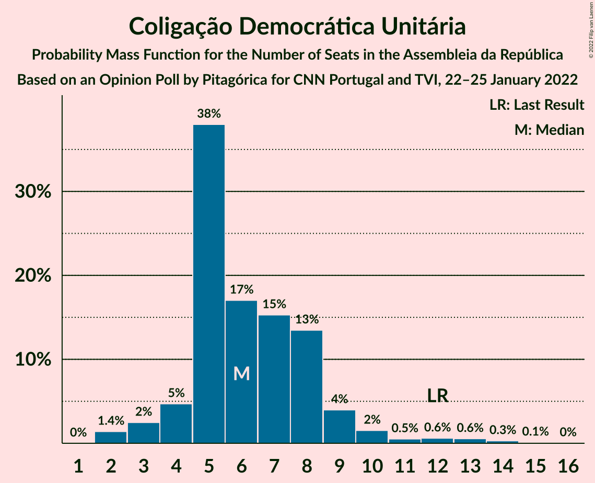

| Number of Seats | Probability | Accumulated | Special Marks |
|:---------------:|:-----------:|:-----------:|:-------------:|
| 2 | 1.4% | 100% |  |
| 3 | 2% | 98.6% |  |
| 4 | 5% | 96% |  |
| 5 | 38% | 91% |  |
| 6 | 17% | 53% | Median |
| 7 | 15% | 36% |  |
| 8 | 13% | 21% |  |
| 9 | 4% | 8% |  |
| 10 | 2% | 4% |  |
| 11 | 0.5% | 2% |  |
| 12 | 0.6% | 2% | Last Result |
| 13 | 0.6% | 1.0% |  |
| 14 | 0.3% | 0.5% |  |
| 15 | 0.1% | 0.2% |  |
| 16 | 0% | 0% |  |

### Iniciativa Liberal

*For a full overview of the results for this party, see the [Iniciativa Liberal](party-iniciativaliberal.html) page.*

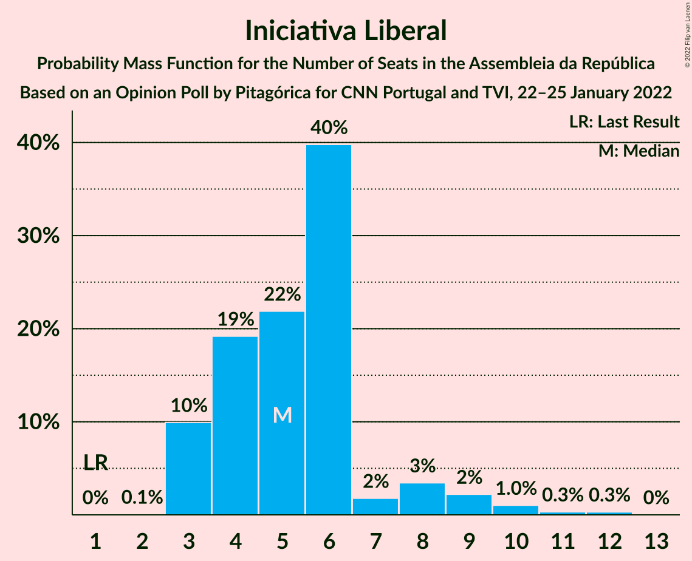

| Number of Seats | Probability | Accumulated | Special Marks |
|:---------------:|:-----------:|:-----------:|:-------------:|
| 1 | 0% | 100% | Last Result |
| 2 | 0.1% | 100% |  |
| 3 | 10% | 99.9% |  |
| 4 | 19% | 90% |  |
| 5 | 22% | 71% | Median |
| 6 | 40% | 49% |  |
| 7 | 2% | 9% |  |
| 8 | 3% | 7% |  |
| 9 | 2% | 4% |  |
| 10 | 1.0% | 2% |  |
| 11 | 0.3% | 0.7% |  |
| 12 | 0.3% | 0.4% |  |
| 13 | 0% | 0% |  |

### CDS–Partido Popular

*For a full overview of the results for this party, see the [CDS–Partido Popular](party-cds–partidopopular.html) page.*

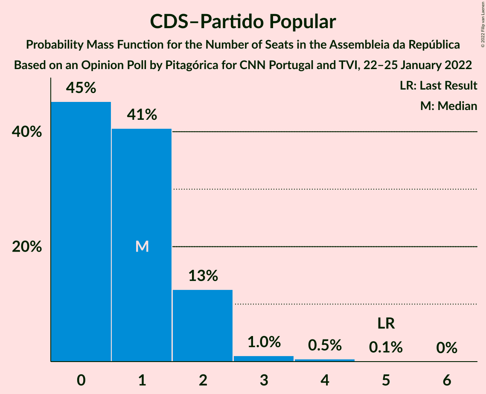

| Number of Seats | Probability | Accumulated | Special Marks |
|:---------------:|:-----------:|:-----------:|:-------------:|
| 0 | 45% | 100% |  |
| 1 | 41% | 55% | Median |
| 2 | 13% | 14% |  |
| 3 | 1.0% | 2% |  |
| 4 | 0.5% | 0.6% |  |
| 5 | 0.1% | 0.1% | Last Result |
| 6 | 0% | 0% |  |

### LIVRE

*For a full overview of the results for this party, see the [LIVRE](party-livre.html) page.*

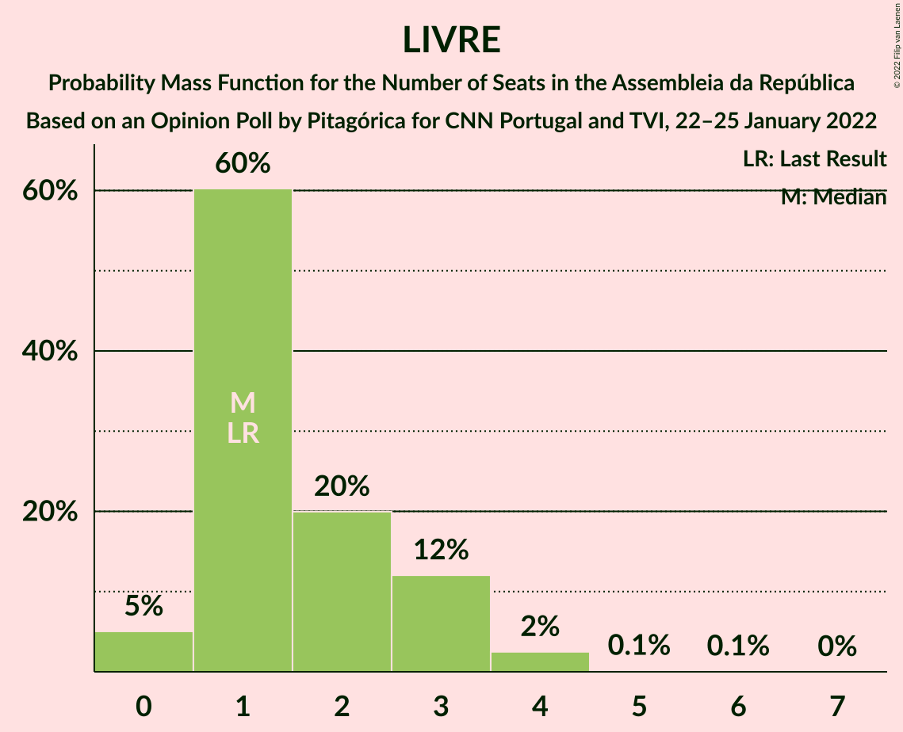

| Number of Seats | Probability | Accumulated | Special Marks |
|:---------------:|:-----------:|:-----------:|:-------------:|
| 0 | 5% | 100% |  |
| 1 | 60% | 95% | Last Result, Median |
| 2 | 20% | 35% |  |
| 3 | 12% | 15% |  |
| 4 | 2% | 3% |  |
| 5 | 0.1% | 0.2% |  |
| 6 | 0.1% | 0.1% |  |
| 7 | 0% | 0% |  |

### Pessoas–Animais–Natureza

*For a full overview of the results for this party, see the [Pessoas–Animais–Natureza](party-pessoas–animais–natureza.html) page.*

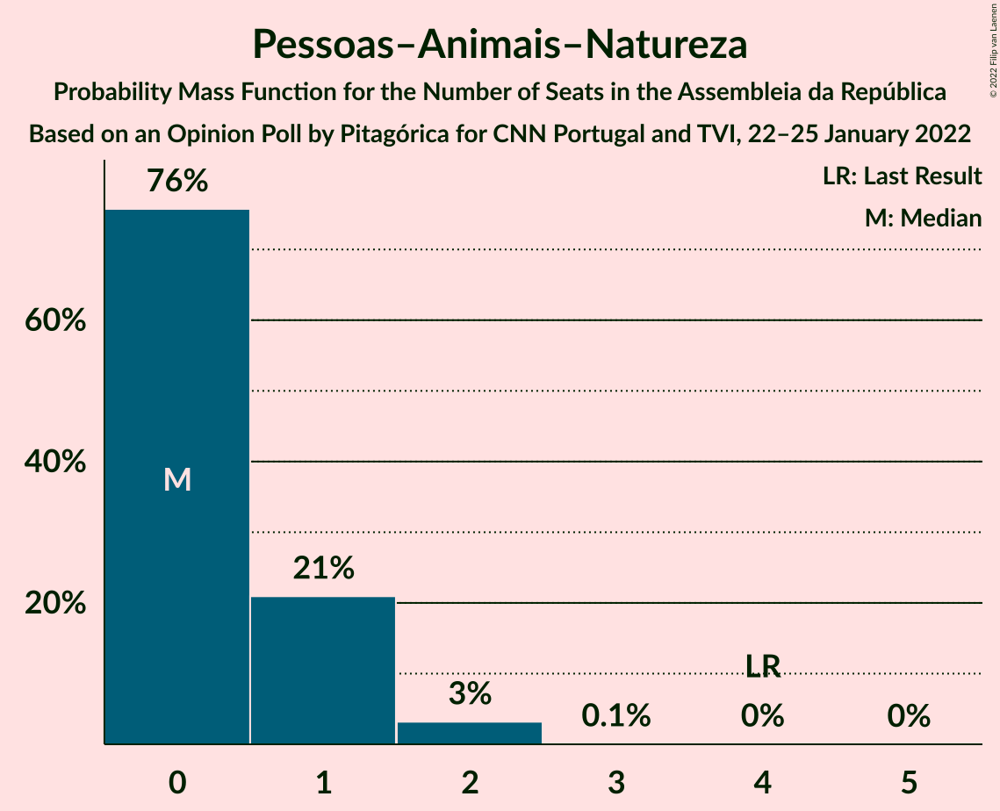

| Number of Seats | Probability | Accumulated | Special Marks |
|:---------------:|:-----------:|:-----------:|:-------------:|
| 0 | 76% | 100% | Median |
| 1 | 21% | 24% |  |
| 2 | 3% | 3% |  |
| 3 | 0.1% | 0.1% |  |
| 4 | 0% | 0% | Last Result |

## Coalitions

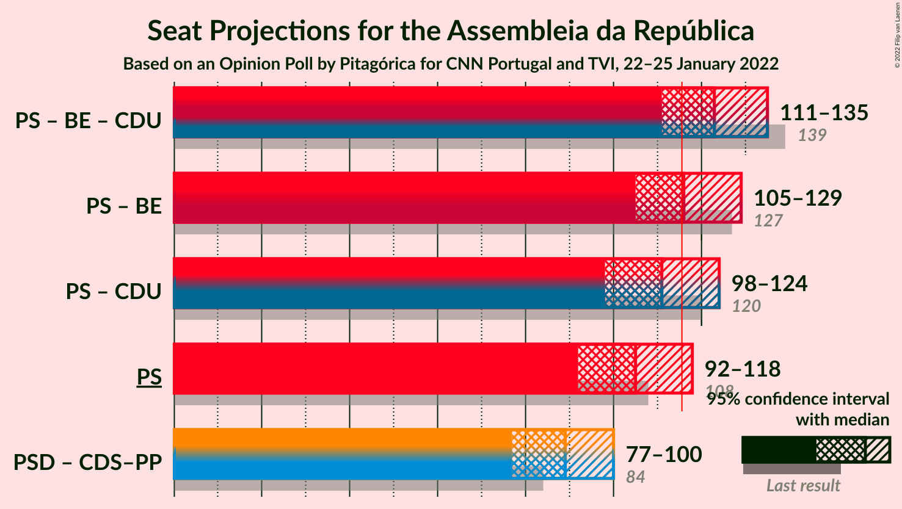

### Confidence Intervals

| Coalition | Last Result | Median | Majority? | 80% Confidence Interval | 90% Confidence Interval | 95% Confidence Interval | 99% Confidence Interval |
|:---------:|:-----------:|:------:|:---------:|:-----------------------:|:-----------------------:|:-----------------------:|:-----------------------:|
| Partido Socialista – Bloco de Esquerda – Coligação Democrática Unitária | 139 | 123 | 79% | 114–133 | 113–134 | 111–135 | 107–138 |
| Partido Socialista – Bloco de Esquerda | 127 | 116 | 56% | 108–127 | 107–128 | 105–129 | 101–132 |
| Partido Socialista – Coligação Democrática Unitária | 120 | 111 | 25% | 101–120 | 100–123 | 98–124 | 95–127 |
| Partido Socialista | 108 | 105 | 7% | 96–114 | 94–117 | 92–118 | 89–122 |
| Partido Social Democrata – CDS–Partido Popular | 84 | 89 | 0% | 80–98 | 79–99 | 77–100 | 74–104 |

### Partido Socialista – Bloco de Esquerda – Coligação Democrática Unitária

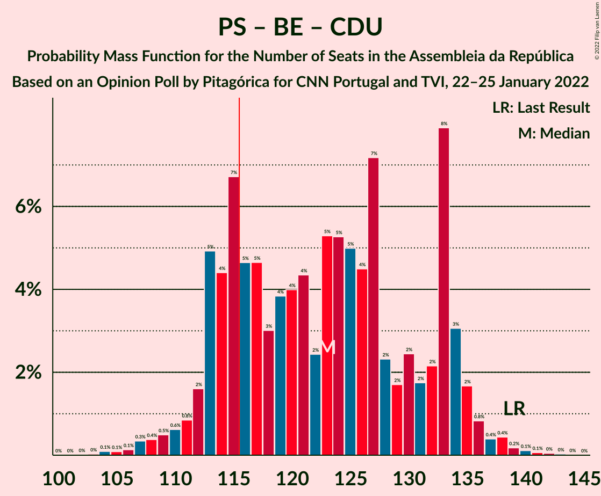

| Number of Seats | Probability | Accumulated | Special Marks |
|:---------------:|:-----------:|:-----------:|:-------------:|
| 103 | 0% | 100% |  |
| 104 | 0.1% | 99.9% |  |
| 105 | 0.1% | 99.8% |  |
| 106 | 0.1% | 99.8% |  |
| 107 | 0.3% | 99.6% |  |
| 108 | 0.4% | 99.3% |  |
| 109 | 0.5% | 98.9% |  |
| 110 | 0.6% | 98% |  |
| 111 | 0.8% | 98% |  |
| 112 | 2% | 97% |  |
| 113 | 5% | 95% |  |
| 114 | 4% | 90% |  |
| 115 | 7% | 86% |  |
| 116 | 5% | 79% | Majority |
| 117 | 5% | 75% |  |
| 118 | 3% | 70% |  |
| 119 | 4% | 67% |  |
| 120 | 4% | 63% |  |
| 121 | 4% | 59% |  |
| 122 | 2% | 55% |  |
| 123 | 5% | 52% | Median |
| 124 | 5% | 47% |  |
| 125 | 5% | 42% |  |
| 126 | 4% | 37% |  |
| 127 | 7% | 32% |  |
| 128 | 2% | 25% |  |
| 129 | 2% | 23% |  |
| 130 | 2% | 21% |  |
| 131 | 2% | 19% |  |
| 132 | 2% | 17% |  |
| 133 | 8% | 15% |  |
| 134 | 3% | 7% |  |
| 135 | 2% | 4% |  |
| 136 | 0.8% | 2% |  |
| 137 | 0.4% | 1.3% |  |
| 138 | 0.4% | 0.9% |  |
| 139 | 0.2% | 0.5% | Last Result |
| 140 | 0.1% | 0.3% |  |
| 141 | 0.1% | 0.2% |  |
| 142 | 0% | 0.1% |  |
| 143 | 0% | 0.1% |  |
| 144 | 0% | 0% |  |

### Partido Socialista – Bloco de Esquerda

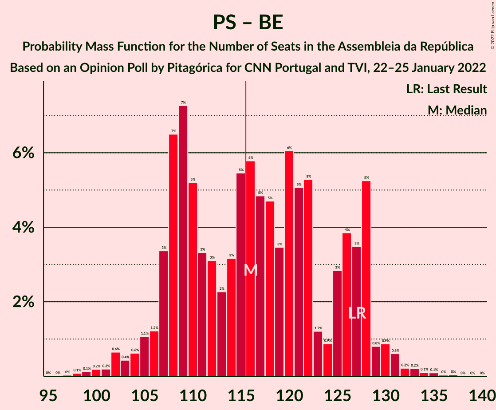

| Number of Seats | Probability | Accumulated | Special Marks |
|:---------------:|:-----------:|:-----------:|:-------------:|
| 97 | 0% | 100% |  |
| 98 | 0.1% | 99.9% |  |
| 99 | 0.1% | 99.9% |  |
| 100 | 0.2% | 99.7% |  |
| 101 | 0.2% | 99.5% |  |
| 102 | 0.6% | 99.4% |  |
| 103 | 0.4% | 98.7% |  |
| 104 | 0.6% | 98% |  |
| 105 | 1.1% | 98% |  |
| 106 | 1.2% | 97% |  |
| 107 | 3% | 95% |  |
| 108 | 7% | 92% |  |
| 109 | 7% | 85% |  |
| 110 | 5% | 78% |  |
| 111 | 3% | 73% |  |
| 112 | 3% | 70% |  |
| 113 | 2% | 67% |  |
| 114 | 3% | 64% |  |
| 115 | 5% | 61% |  |
| 116 | 6% | 56% | Majority |
| 117 | 5% | 50% | Median |
| 118 | 5% | 45% |  |
| 119 | 3% | 40% |  |
| 120 | 6% | 37% |  |
| 121 | 5% | 31% |  |
| 122 | 5% | 26% |  |
| 123 | 1.2% | 21% |  |
| 124 | 0.9% | 19% |  |
| 125 | 3% | 18% |  |
| 126 | 4% | 16% |  |
| 127 | 3% | 12% | Last Result |
| 128 | 5% | 8% |  |
| 129 | 0.8% | 3% |  |
| 130 | 0.9% | 2% |  |
| 131 | 0.6% | 1.3% |  |
| 132 | 0.2% | 0.7% |  |
| 133 | 0.2% | 0.5% |  |
| 134 | 0.1% | 0.3% |  |
| 135 | 0.1% | 0.2% |  |
| 136 | 0% | 0.1% |  |
| 137 | 0% | 0.1% |  |
| 138 | 0% | 0% |  |

### Partido Socialista – Coligação Democrática Unitária

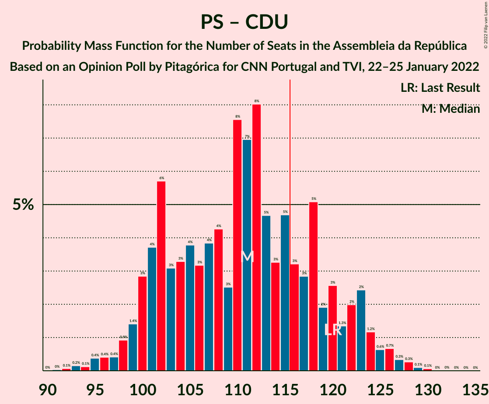

| Number of Seats | Probability | Accumulated | Special Marks |
|:---------------:|:-----------:|:-----------:|:-------------:|
| 91 | 0% | 100% |  |
| 92 | 0.1% | 99.9% |  |
| 93 | 0.2% | 99.9% |  |
| 94 | 0.1% | 99.7% |  |
| 95 | 0.4% | 99.6% |  |
| 96 | 0.4% | 99.2% |  |
| 97 | 0.4% | 98.8% |  |
| 98 | 0.9% | 98% |  |
| 99 | 1.4% | 97% |  |
| 100 | 3% | 96% |  |
| 101 | 4% | 93% |  |
| 102 | 6% | 89% |  |
| 103 | 3% | 84% |  |
| 104 | 3% | 81% |  |
| 105 | 4% | 77% |  |
| 106 | 3% | 74% |  |
| 107 | 4% | 70% |  |
| 108 | 4% | 67% |  |
| 109 | 3% | 62% |  |
| 110 | 8% | 60% |  |
| 111 | 7% | 52% | Median |
| 112 | 8% | 45% |  |
| 113 | 5% | 37% |  |
| 114 | 3% | 33% |  |
| 115 | 5% | 29% |  |
| 116 | 3% | 25% | Majority |
| 117 | 3% | 21% |  |
| 118 | 5% | 19% |  |
| 119 | 2% | 14% |  |
| 120 | 3% | 12% | Last Result |
| 121 | 1.3% | 9% |  |
| 122 | 2% | 8% |  |
| 123 | 2% | 6% |  |
| 124 | 1.2% | 3% |  |
| 125 | 0.6% | 2% |  |
| 126 | 0.7% | 1.5% |  |
| 127 | 0.3% | 0.8% |  |
| 128 | 0.3% | 0.5% |  |
| 129 | 0.1% | 0.2% |  |
| 130 | 0.1% | 0.1% |  |
| 131 | 0% | 0% |  |

### Partido Socialista

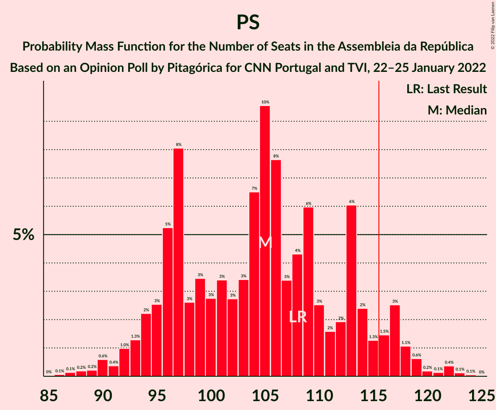

| Number of Seats | Probability | Accumulated | Special Marks |
|:---------------:|:-----------:|:-----------:|:-------------:|
| 85 | 0% | 100% |  |
| 86 | 0.1% | 99.9% |  |
| 87 | 0.1% | 99.9% |  |
| 88 | 0.2% | 99.7% |  |
| 89 | 0.2% | 99.6% |  |
| 90 | 0.6% | 99.3% |  |
| 91 | 0.4% | 98.7% |  |
| 92 | 1.0% | 98% |  |
| 93 | 1.3% | 97% |  |
| 94 | 2% | 96% |  |
| 95 | 3% | 94% |  |
| 96 | 5% | 91% |  |
| 97 | 8% | 86% |  |
| 98 | 3% | 78% |  |
| 99 | 3% | 75% |  |
| 100 | 3% | 72% |  |
| 101 | 3% | 69% |  |
| 102 | 3% | 66% |  |
| 103 | 3% | 63% |  |
| 104 | 7% | 60% |  |
| 105 | 10% | 53% | Median |
| 106 | 8% | 44% |  |
| 107 | 3% | 36% |  |
| 108 | 4% | 33% | Last Result |
| 109 | 6% | 28% |  |
| 110 | 3% | 22% |  |
| 111 | 2% | 20% |  |
| 112 | 2% | 18% |  |
| 113 | 6% | 16% |  |
| 114 | 2% | 10% |  |
| 115 | 1.3% | 8% |  |
| 116 | 1.5% | 7% | Majority |
| 117 | 3% | 5% |  |
| 118 | 1.1% | 3% |  |
| 119 | 0.6% | 2% |  |
| 120 | 0.2% | 0.9% |  |
| 121 | 0.1% | 0.7% |  |
| 122 | 0.4% | 0.6% |  |
| 123 | 0.1% | 0.2% |  |
| 124 | 0.1% | 0.1% |  |
| 125 | 0% | 0% |  |

### Partido Social Democrata – CDS–Partido Popular

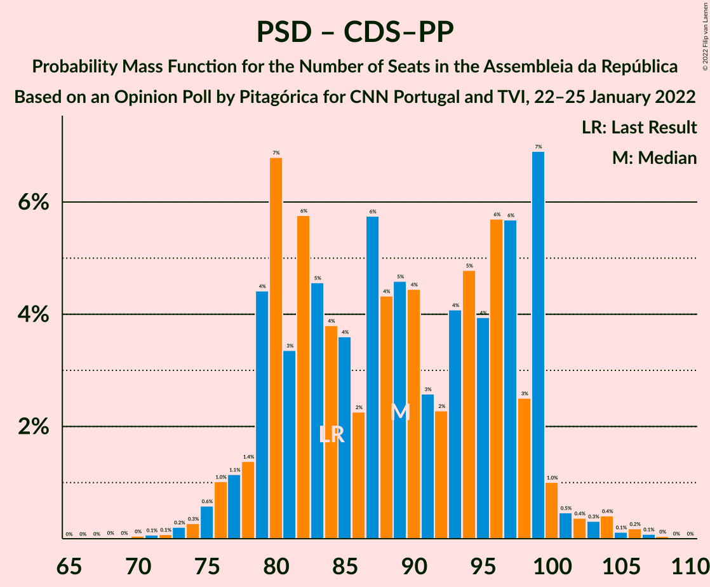

| Number of Seats | Probability | Accumulated | Special Marks |
|:---------------:|:-----------:|:-----------:|:-------------:|
| 69 | 0% | 100% |  |
| 70 | 0% | 99.9% |  |
| 71 | 0.1% | 99.9% |  |
| 72 | 0.1% | 99.8% |  |
| 73 | 0.2% | 99.8% |  |
| 74 | 0.3% | 99.5% |  |
| 75 | 0.6% | 99.3% |  |
| 76 | 1.0% | 98.7% |  |
| 77 | 1.1% | 98% |  |
| 78 | 1.4% | 97% |  |
| 79 | 4% | 95% |  |
| 80 | 7% | 91% |  |
| 81 | 3% | 84% |  |
| 82 | 6% | 81% |  |
| 83 | 5% | 75% |  |
| 84 | 4% | 70% | Last Result |
| 85 | 4% | 66% |  |
| 86 | 2% | 63% |  |
| 87 | 6% | 61% |  |
| 88 | 4% | 55% |  |
| 89 | 5% | 51% | Median |
| 90 | 4% | 46% |  |
| 91 | 3% | 41% |  |
| 92 | 2% | 39% |  |
| 93 | 4% | 37% |  |
| 94 | 5% | 33% |  |
| 95 | 4% | 28% |  |
| 96 | 6% | 24% |  |
| 97 | 6% | 18% |  |
| 98 | 3% | 12% |  |
| 99 | 7% | 10% |  |
| 100 | 1.0% | 3% |  |
| 101 | 0.5% | 2% |  |
| 102 | 0.4% | 2% |  |
| 103 | 0.3% | 1.2% |  |
| 104 | 0.4% | 0.9% |  |
| 105 | 0.1% | 0.4% |  |
| 106 | 0.2% | 0.3% |  |
| 107 | 0.1% | 0.1% |  |
| 108 | 0% | 0.1% |  |
| 109 | 0% | 0% |  |

## Technical Information

### Opinion Poll

+ **Polling firm:** Pitagórica
+ **Commissioner(s):** CNN Portugal and TVI
+ **Fieldwork period:** 22–25 January 2022

### Calculations

+ **Sample size:** 608
+ **Simulations done:** 1,048,576
+ **Error estimate:** 4.47%

