# Opinion Poll by CESOP–UCP for Público and RTP, 19–26 January 2022

<a href="#voting-intentions">Voting Intentions</a> | <a href="#seats">Seats</a> | <a href="#coalitions">Coalitions</a> | <a href="#technical-information">Technical Information</a>

## Voting Intentions

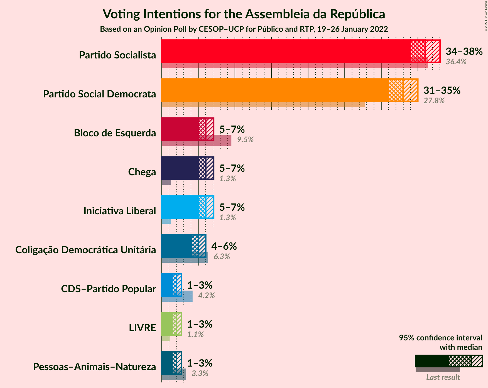

### Confidence Intervals

| Party | Last Result | Poll Result | 80% Confidence Interval | 90% Confidence Interval | 95% Confidence Interval | 99% Confidence Interval |
|:-----:|:-----------:|:-----------:|:-----------------------:|:-----------------------:|:-----------------------:|:-----------------------:|
| Partido Socialista | 36.4% | 36.0% | 34.7–37.3% |34.3–37.7% |34.0–38.0% |33.4–38.7% |
| Partido Social Democrata | 27.8% | 33.0% | 31.7–34.3% |31.4–34.7% |31.0–35.0% |30.4–35.6% |
| Bloco de Esquerda | 9.5% | 6.0% | 5.4–6.7% |5.2–6.9% |5.1–7.1% |4.8–7.5% |
| Iniciativa Liberal | 1.3% | 6.0% | 5.4–6.7% |5.2–6.9% |5.1–7.1% |4.8–7.5% |
| Chega | 1.3% | 6.0% | 5.4–6.7% |5.2–6.9% |5.1–7.1% |4.8–7.5% |
| Coligação Democrática Unitária | 6.3% | 5.0% | 4.5–5.7% |4.3–5.9% |4.2–6.0% |3.9–6.3% |
| CDS–Partido Popular | 4.2% | 2.0% | 1.7–2.5% |1.6–2.6% |1.5–2.7% |1.3–2.9% |
| Pessoas–Animais–Natureza | 3.3% | 2.0% | 1.7–2.5% |1.6–2.6% |1.5–2.7% |1.3–2.9% |
| LIVRE | 1.1% | 2.0% | 1.7–2.5% |1.6–2.6% |1.5–2.7% |1.3–2.9% |

*Note:* The poll result column reflects the actual value used in the calculations. Published results may vary slightly, and in addition be rounded to fewer digits.

## Seats

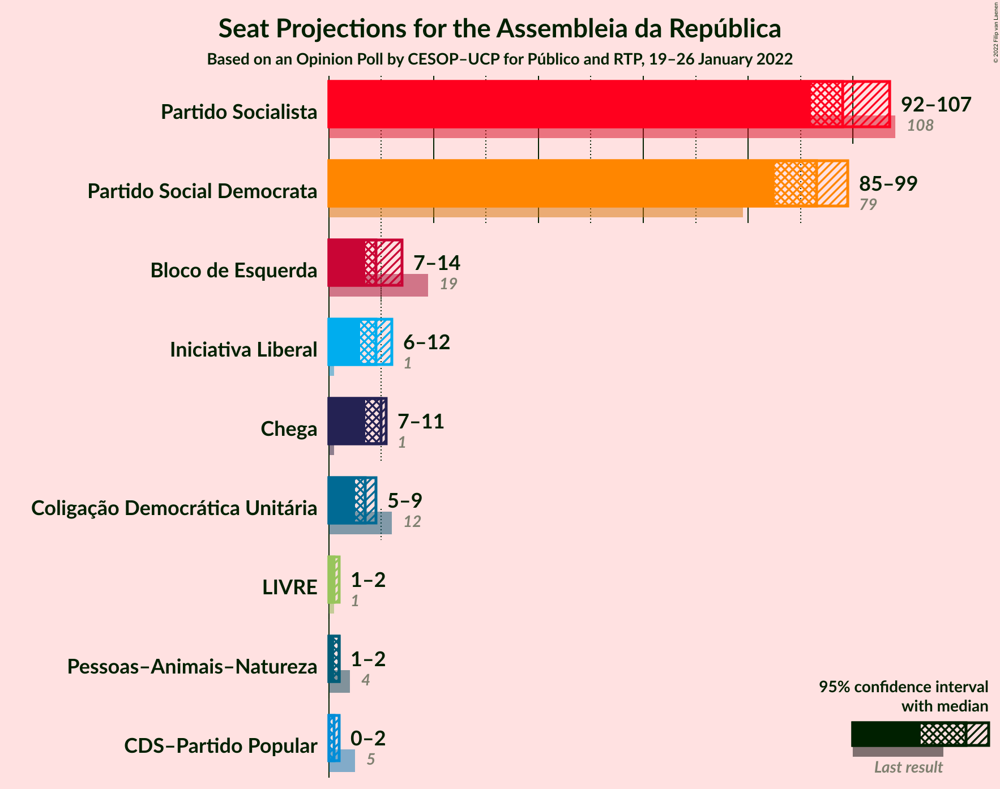

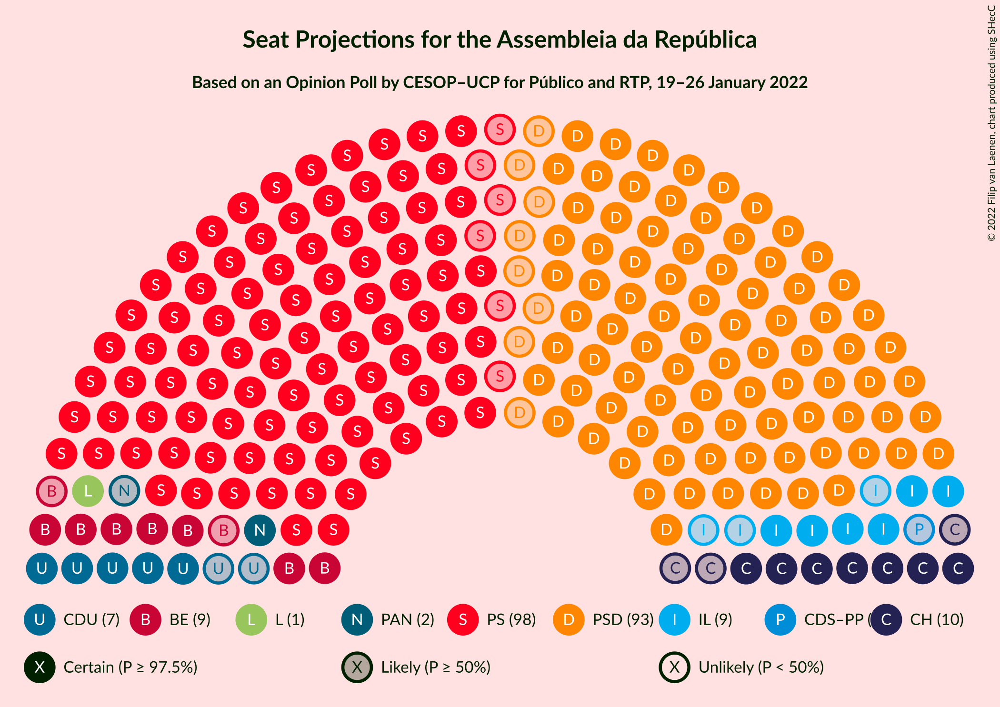

### Confidence Intervals

| Party | Last Result | Median | 80% Confidence Interval | 90% Confidence Interval | 95% Confidence Interval | 99% Confidence Interval |
|:-----:|:-----------:|:------:|:-----------------------:|:-----------------------:|:-----------------------:|:-----------------------:|
| <a href="#partido-socialista">Partido Socialista</a> | 108 | 98 | 94–104 |93–106 |92–107 |90–109 |
| <a href="#partido-social-democrata">Partido Social Democrata</a> | 79 | 93 | 87–97 |85–98 |85–99 |83–100 |
| <a href="#bloco-de-esquerda">Bloco de Esquerda</a> | 19 | 9 | 7–12 |7–13 |7–14 |7–14 |
| <a href="#iniciativa-liberal">Iniciativa Liberal</a> | 1 | 9 | 8–12 |7–12 |6–12 |6–13 |
| <a href="#chega">Chega</a> | 1 | 10 | 8–11 |8–11 |7–11 |7–11 |
| <a href="#coligação-democrática-unitária">Coligação Democrática Unitária</a> | 12 | 7 | 6–8 |5–8 |5–9 |5–11 |
| <a href="#cds–partido-popular">CDS–Partido Popular</a> | 5 | 1 | 0–1 |0–2 |0–2 |0–2 |
| <a href="#pessoas–animais–natureza">Pessoas–Animais–Natureza</a> | 4 | 2 | 1–2 |1–2 |1–2 |0–2 |
| <a href="#livre">LIVRE</a> | 1 | 1 | 1–2 |1–2 |1–2 |1–3 |

### Partido Socialista

*For a full overview of the results for this party, see the [Partido Socialista](party-partidosocialista.html) page.*

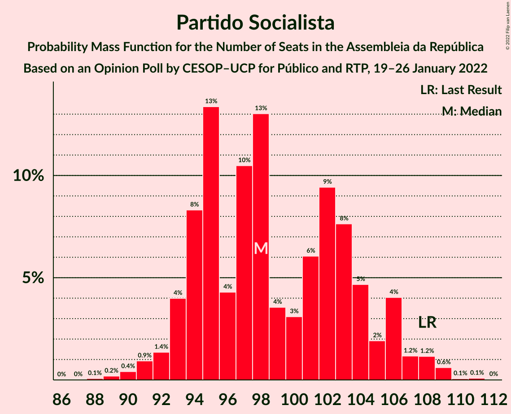

| Number of Seats | Probability | Accumulated | Special Marks |
|:---------------:|:-----------:|:-----------:|:-------------:|
| 88 | 0.1% | 100% |  |
| 89 | 0.2% | 99.9% |  |
| 90 | 0.4% | 99.7% |  |
| 91 | 0.9% | 99.3% |  |
| 92 | 1.4% | 98% |  |
| 93 | 4% | 97% |  |
| 94 | 8% | 93% |  |
| 95 | 13% | 85% |  |
| 96 | 4% | 71% |  |
| 97 | 10% | 67% |  |
| 98 | 13% | 57% | Median |
| 99 | 4% | 44% |  |
| 100 | 3% | 40% |  |
| 101 | 6% | 37% |  |
| 102 | 9% | 31% |  |
| 103 | 8% | 21% |  |
| 104 | 5% | 14% |  |
| 105 | 2% | 9% |  |
| 106 | 4% | 7% |  |
| 107 | 1.2% | 3% |  |
| 108 | 1.2% | 2% | Last Result |
| 109 | 0.6% | 0.8% |  |
| 110 | 0.1% | 0.2% |  |
| 111 | 0.1% | 0.1% |  |
| 112 | 0% | 0% |  |

### Partido Social Democrata

*For a full overview of the results for this party, see the [Partido Social Democrata](party-partidosocialdemocrata.html) page.*

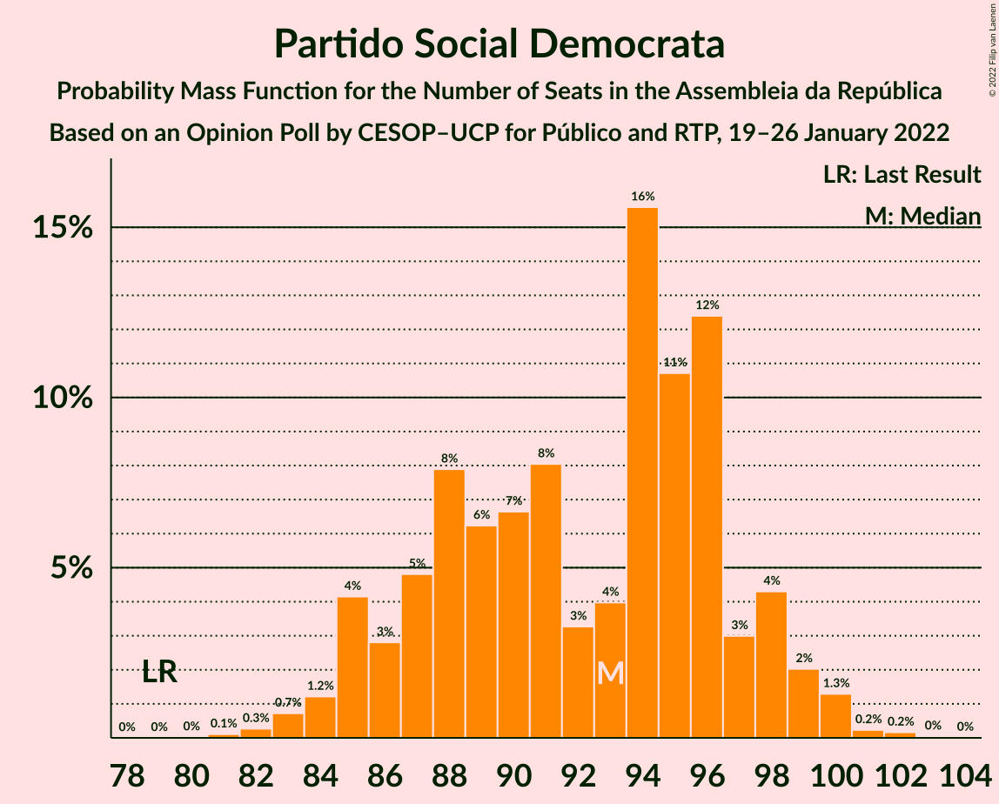

| Number of Seats | Probability | Accumulated | Special Marks |
|:---------------:|:-----------:|:-----------:|:-------------:|
| 79 | 0% | 100% | Last Result |
| 80 | 0% | 100% |  |
| 81 | 0.1% | 100% |  |
| 82 | 0.3% | 99.9% |  |
| 83 | 0.7% | 99.6% |  |
| 84 | 1.2% | 98.9% |  |
| 85 | 4% | 98% |  |
| 86 | 3% | 93% |  |
| 87 | 5% | 91% |  |
| 88 | 8% | 86% |  |
| 89 | 6% | 78% |  |
| 90 | 7% | 72% |  |
| 91 | 8% | 65% |  |
| 92 | 3% | 57% |  |
| 93 | 4% | 54% | Median |
| 94 | 16% | 50% |  |
| 95 | 11% | 34% |  |
| 96 | 12% | 23% |  |
| 97 | 3% | 11% |  |
| 98 | 4% | 8% |  |
| 99 | 2% | 4% |  |
| 100 | 1.3% | 2% |  |
| 101 | 0.2% | 0.5% |  |
| 102 | 0.2% | 0.2% |  |
| 103 | 0% | 0.1% |  |
| 104 | 0% | 0% |  |

### Bloco de Esquerda

*For a full overview of the results for this party, see the [Bloco de Esquerda](party-blocodeesquerda.html) page.*

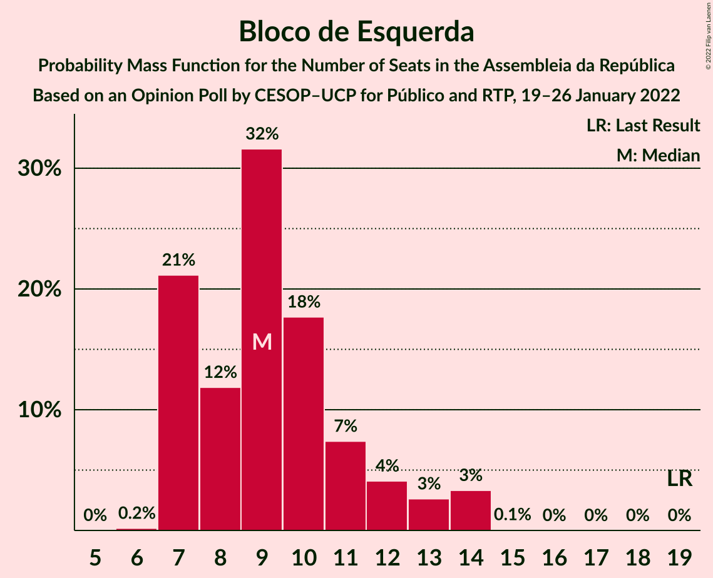

| Number of Seats | Probability | Accumulated | Special Marks |
|:---------------:|:-----------:|:-----------:|:-------------:|
| 6 | 0.2% | 100% |  |
| 7 | 21% | 99.8% |  |
| 8 | 12% | 79% |  |
| 9 | 32% | 67% | Median |
| 10 | 18% | 35% |  |
| 11 | 7% | 18% |  |
| 12 | 4% | 10% |  |
| 13 | 3% | 6% |  |
| 14 | 3% | 3% |  |
| 15 | 0.1% | 0.1% |  |
| 16 | 0% | 0% |  |
| 17 | 0% | 0% |  |
| 18 | 0% | 0% |  |
| 19 | 0% | 0% | Last Result |

### Iniciativa Liberal

*For a full overview of the results for this party, see the [Iniciativa Liberal](party-iniciativaliberal.html) page.*

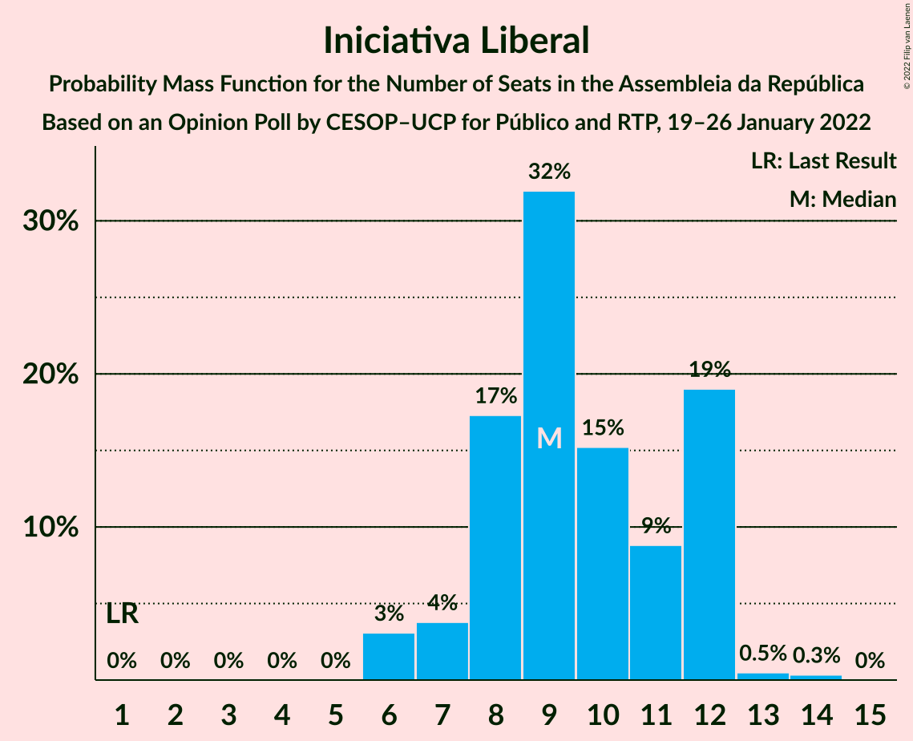

| Number of Seats | Probability | Accumulated | Special Marks |
|:---------------:|:-----------:|:-----------:|:-------------:|
| 1 | 0% | 100% | Last Result |
| 2 | 0% | 100% |  |
| 3 | 0% | 100% |  |
| 4 | 0% | 100% |  |
| 5 | 0% | 100% |  |
| 6 | 3% | 100% |  |
| 7 | 4% | 97% |  |
| 8 | 17% | 93% |  |
| 9 | 32% | 76% | Median |
| 10 | 15% | 44% |  |
| 11 | 9% | 29% |  |
| 12 | 19% | 20% |  |
| 13 | 0.5% | 0.8% |  |
| 14 | 0.3% | 0.3% |  |
| 15 | 0% | 0% |  |

### Chega

*For a full overview of the results for this party, see the [Chega](party-chega.html) page.*

| Number of Seats | Probability | Accumulated | Special Marks |
|:---------------:|:-----------:|:-----------:|:-------------:|
| 1 | 0% | 100% | Last Result |
| 2 | 0% | 100% |  |
| 3 | 0% | 100% |  |
| 4 | 0% | 100% |  |
| 5 | 0.1% | 100% |  |
| 6 | 0% | 99.9% |  |
| 7 | 3% | 99.8% |  |
| 8 | 19% | 97% |  |
| 9 | 9% | 77% |  |
| 10 | 47% | 68% | Median |
| 11 | 21% | 22% |  |
| 12 | 0.1% | 0.1% |  |
| 13 | 0.1% | 0.1% |  |
| 14 | 0% | 0% |  |

### Coligação Democrática Unitária

*For a full overview of the results for this party, see the [Coligação Democrática Unitária](party-coligaçãodemocráticaunitária.html) page.*

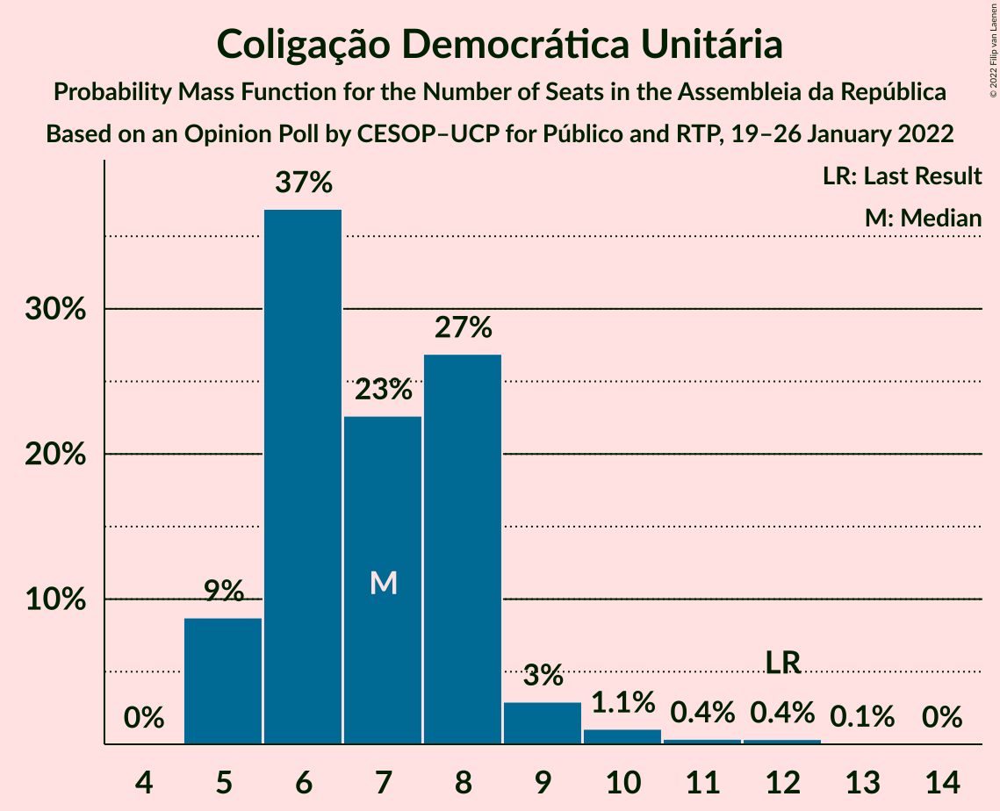

| Number of Seats | Probability | Accumulated | Special Marks |
|:---------------:|:-----------:|:-----------:|:-------------:|
| 5 | 9% | 100% |  |
| 6 | 37% | 91% |  |
| 7 | 23% | 54% | Median |
| 8 | 27% | 32% |  |
| 9 | 3% | 5% |  |
| 10 | 1.1% | 2% |  |
| 11 | 0.4% | 0.9% |  |
| 12 | 0.4% | 0.5% | Last Result |
| 13 | 0.1% | 0.1% |  |
| 14 | 0% | 0% |  |

### CDS–Partido Popular

*For a full overview of the results for this party, see the [CDS–Partido Popular](party-cds–partidopopular.html) page.*

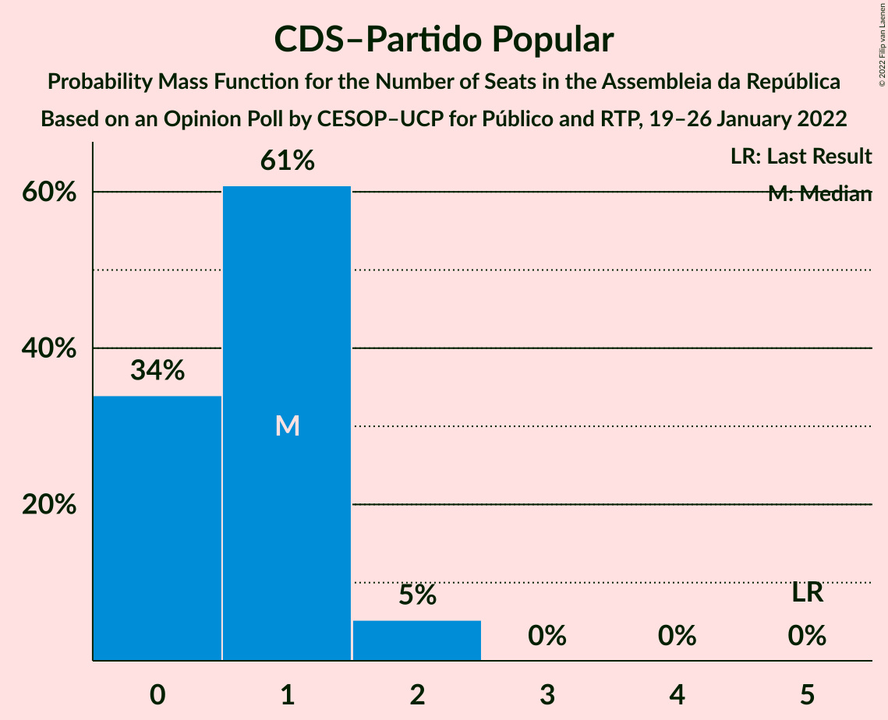

| Number of Seats | Probability | Accumulated | Special Marks |
|:---------------:|:-----------:|:-----------:|:-------------:|
| 0 | 34% | 100% |  |
| 1 | 61% | 66% | Median |
| 2 | 5% | 5% |  |
| 3 | 0% | 0% |  |
| 4 | 0% | 0% |  |
| 5 | 0% | 0% | Last Result |

### Pessoas–Animais–Natureza

*For a full overview of the results for this party, see the [Pessoas–Animais–Natureza](party-pessoas–animais–natureza.html) page.*

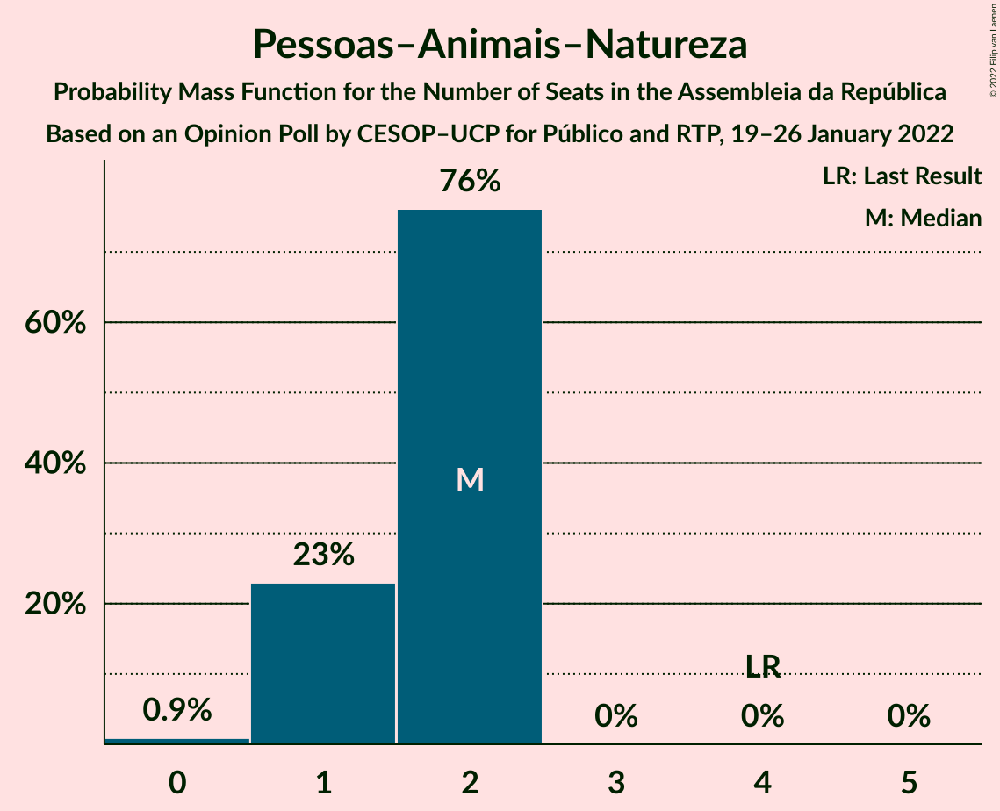

| Number of Seats | Probability | Accumulated | Special Marks |
|:---------------:|:-----------:|:-----------:|:-------------:|
| 0 | 0.9% | 100% |  |
| 1 | 23% | 99.1% |  |
| 2 | 76% | 76% | Median |
| 3 | 0% | 0% |  |
| 4 | 0% | 0% | Last Result |

### LIVRE

*For a full overview of the results for this party, see the [LIVRE](party-livre.html) page.*

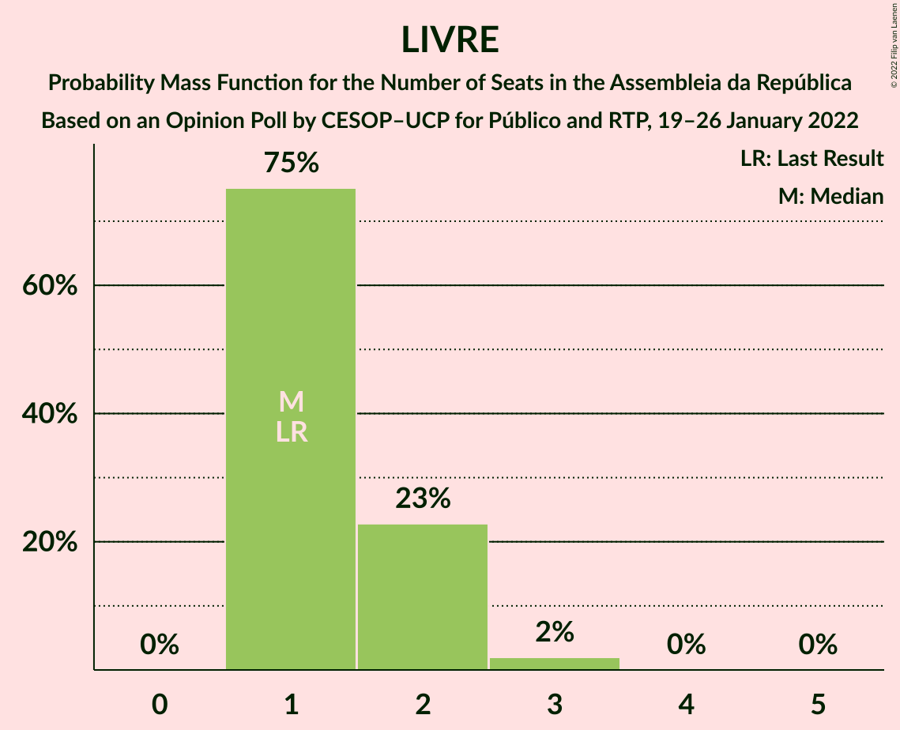

| Number of Seats | Probability | Accumulated | Special Marks |
|:---------------:|:-----------:|:-----------:|:-------------:|
| 1 | 75% | 100% | Last Result, Median |
| 2 | 23% | 25% |  |
| 3 | 2% | 2% |  |
| 4 | 0% | 0% |  |

## Coalitions

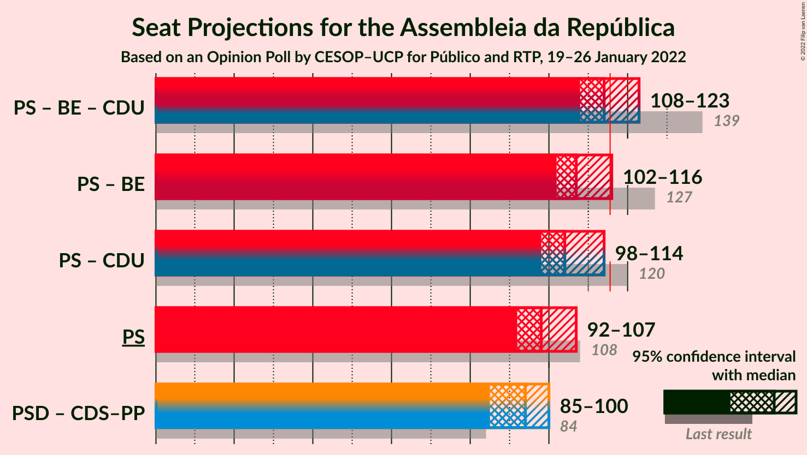

### Confidence Intervals

| Coalition | Last Result | Median | Majority? | 80% Confidence Interval | 90% Confidence Interval | 95% Confidence Interval | 99% Confidence Interval |
|:---------:|:-----------:|:------:|:---------:|:-----------------------:|:-----------------------:|:-----------------------:|:-----------------------:|
| Partido Socialista – Bloco de Esquerda – Coligação Democrática Unitária | 139 | 114 | 41% | 110–120 | 109–122 | 108–123 | 107–125 |
| Partido Socialista – Bloco de Esquerda | 127 | 107 | 3% | 103–114 | 102–115 | 102–116 | 99–118 |
| Partido Socialista – Coligação Democrática Unitária | 120 | 104 | 0.7% | 101–112 | 100–113 | 98–114 | 97–116 |
| Partido Socialista | 108 | 98 | 0% | 94–104 | 93–106 | 92–107 | 90–109 |
| Partido Social Democrata – CDS–Partido Popular | 84 | 94 | 0% | 87–98 | 85–99 | 85–100 | 83–101 |

### Partido Socialista – Bloco de Esquerda – Coligação Democrática Unitária

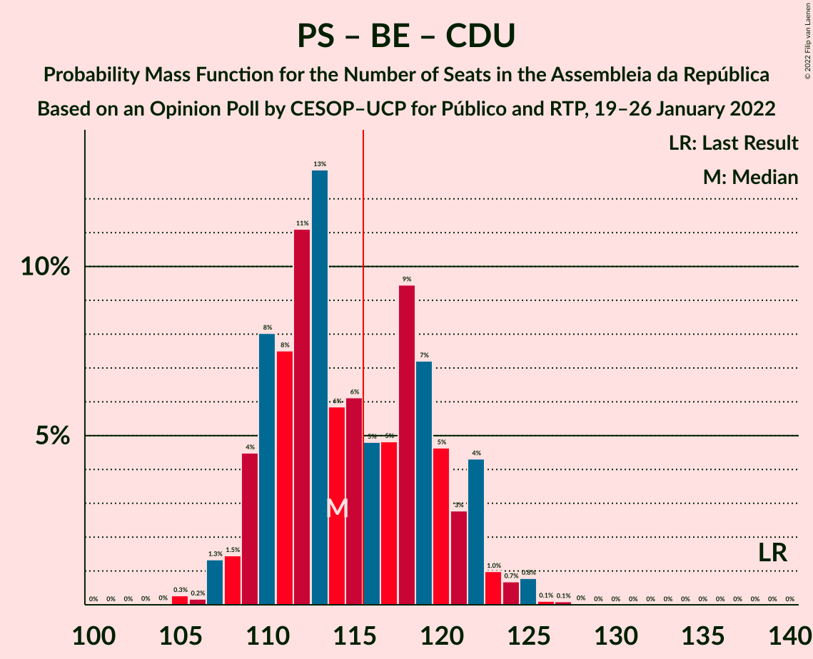

| Number of Seats | Probability | Accumulated | Special Marks |
|:---------------:|:-----------:|:-----------:|:-------------:|
| 104 | 0% | 100% |  |
| 105 | 0.3% | 99.9% |  |
| 106 | 0.2% | 99.7% |  |
| 107 | 1.3% | 99.5% |  |
| 108 | 1.5% | 98% |  |
| 109 | 4% | 97% |  |
| 110 | 8% | 92% |  |
| 111 | 8% | 84% |  |
| 112 | 11% | 77% |  |
| 113 | 13% | 66% |  |
| 114 | 6% | 53% | Median |
| 115 | 6% | 47% |  |
| 116 | 5% | 41% | Majority |
| 117 | 5% | 36% |  |
| 118 | 9% | 31% |  |
| 119 | 7% | 22% |  |
| 120 | 5% | 14% |  |
| 121 | 3% | 10% |  |
| 122 | 4% | 7% |  |
| 123 | 1.0% | 3% |  |
| 124 | 0.7% | 2% |  |
| 125 | 0.8% | 1.0% |  |
| 126 | 0.1% | 0.2% |  |
| 127 | 0.1% | 0.1% |  |
| 128 | 0% | 0% |  |
| 129 | 0% | 0% |  |
| 130 | 0% | 0% |  |
| 131 | 0% | 0% |  |
| 132 | 0% | 0% |  |
| 133 | 0% | 0% |  |
| 134 | 0% | 0% |  |
| 135 | 0% | 0% |  |
| 136 | 0% | 0% |  |
| 137 | 0% | 0% |  |
| 138 | 0% | 0% |  |
| 139 | 0% | 0% | Last Result |

### Partido Socialista – Bloco de Esquerda

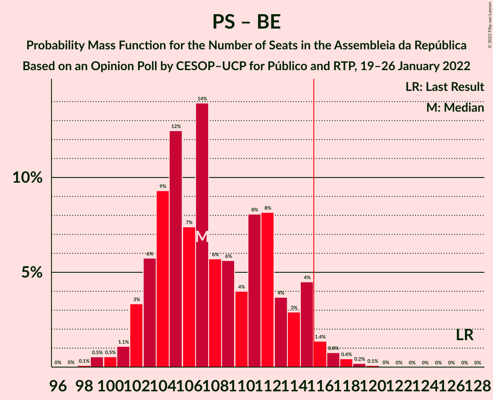

| Number of Seats | Probability | Accumulated | Special Marks |
|:---------------:|:-----------:|:-----------:|:-------------:|
| 98 | 0.1% | 100% |  |
| 99 | 0.5% | 99.9% |  |
| 100 | 0.5% | 99.3% |  |
| 101 | 1.1% | 98.8% |  |
| 102 | 3% | 98% |  |
| 103 | 6% | 94% |  |
| 104 | 9% | 89% |  |
| 105 | 12% | 79% |  |
| 106 | 7% | 67% |  |
| 107 | 14% | 59% | Median |
| 108 | 6% | 46% |  |
| 109 | 6% | 40% |  |
| 110 | 4% | 34% |  |
| 111 | 8% | 30% |  |
| 112 | 8% | 22% |  |
| 113 | 4% | 14% |  |
| 114 | 3% | 10% |  |
| 115 | 4% | 7% |  |
| 116 | 1.4% | 3% | Majority |
| 117 | 0.8% | 2% |  |
| 118 | 0.4% | 0.7% |  |
| 119 | 0.2% | 0.3% |  |
| 120 | 0.1% | 0.1% |  |
| 121 | 0% | 0% |  |
| 122 | 0% | 0% |  |
| 123 | 0% | 0% |  |
| 124 | 0% | 0% |  |
| 125 | 0% | 0% |  |
| 126 | 0% | 0% |  |
| 127 | 0% | 0% | Last Result |

### Partido Socialista – Coligação Democrática Unitária

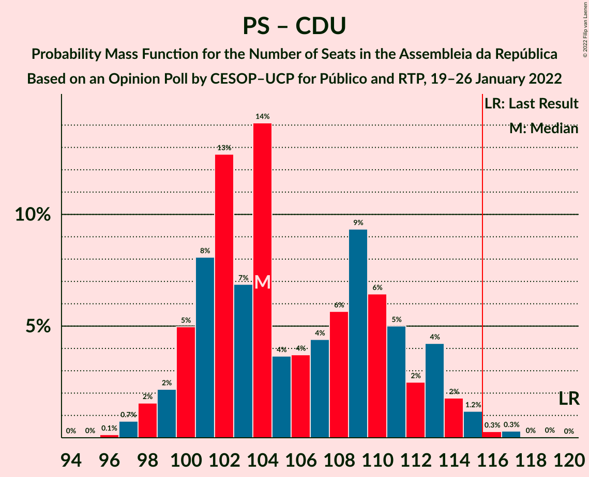

| Number of Seats | Probability | Accumulated | Special Marks |
|:---------------:|:-----------:|:-----------:|:-------------:|
| 95 | 0% | 100% |  |
| 96 | 0.1% | 99.9% |  |
| 97 | 0.7% | 99.8% |  |
| 98 | 2% | 99.0% |  |
| 99 | 2% | 97% |  |
| 100 | 5% | 95% |  |
| 101 | 8% | 90% |  |
| 102 | 13% | 82% |  |
| 103 | 7% | 70% |  |
| 104 | 14% | 63% |  |
| 105 | 4% | 49% | Median |
| 106 | 4% | 45% |  |
| 107 | 4% | 41% |  |
| 108 | 6% | 37% |  |
| 109 | 9% | 31% |  |
| 110 | 6% | 22% |  |
| 111 | 5% | 15% |  |
| 112 | 2% | 10% |  |
| 113 | 4% | 8% |  |
| 114 | 2% | 4% |  |
| 115 | 1.2% | 2% |  |
| 116 | 0.3% | 0.7% | Majority |
| 117 | 0.3% | 0.4% |  |
| 118 | 0% | 0.1% |  |
| 119 | 0% | 0.1% |  |
| 120 | 0% | 0% | Last Result |

### Partido Socialista

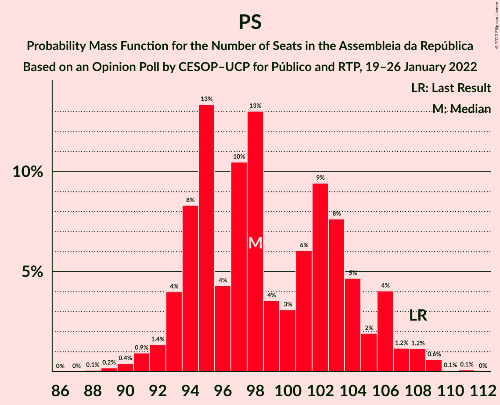

| Number of Seats | Probability | Accumulated | Special Marks |
|:---------------:|:-----------:|:-----------:|:-------------:|
| 88 | 0.1% | 100% |  |
| 89 | 0.2% | 99.9% |  |
| 90 | 0.4% | 99.7% |  |
| 91 | 0.9% | 99.3% |  |
| 92 | 1.4% | 98% |  |
| 93 | 4% | 97% |  |
| 94 | 8% | 93% |  |
| 95 | 13% | 85% |  |
| 96 | 4% | 71% |  |
| 97 | 10% | 67% |  |
| 98 | 13% | 57% | Median |
| 99 | 4% | 44% |  |
| 100 | 3% | 40% |  |
| 101 | 6% | 37% |  |
| 102 | 9% | 31% |  |
| 103 | 8% | 21% |  |
| 104 | 5% | 14% |  |
| 105 | 2% | 9% |  |
| 106 | 4% | 7% |  |
| 107 | 1.2% | 3% |  |
| 108 | 1.2% | 2% | Last Result |
| 109 | 0.6% | 0.8% |  |
| 110 | 0.1% | 0.2% |  |
| 111 | 0.1% | 0.1% |  |
| 112 | 0% | 0% |  |

### Partido Social Democrata – CDS–Partido Popular

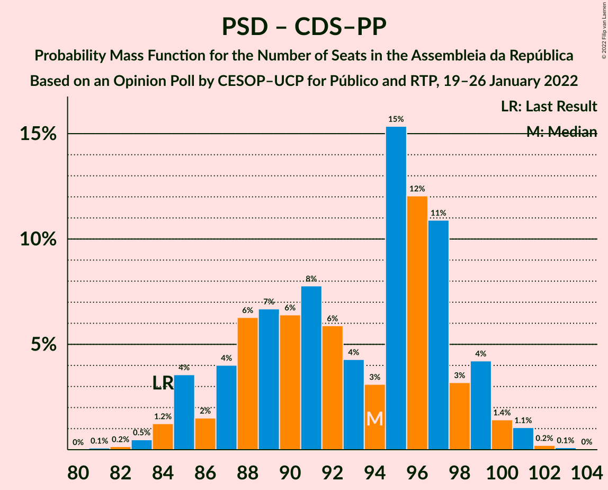

| Number of Seats | Probability | Accumulated | Special Marks |
|:---------------:|:-----------:|:-----------:|:-------------:|
| 81 | 0.1% | 100% |  |
| 82 | 0.2% | 99.9% |  |
| 83 | 0.5% | 99.7% |  |
| 84 | 1.2% | 99.3% | Last Result |
| 85 | 4% | 98% |  |
| 86 | 2% | 94% |  |
| 87 | 4% | 93% |  |
| 88 | 6% | 89% |  |
| 89 | 7% | 83% |  |
| 90 | 6% | 76% |  |
| 91 | 8% | 70% |  |
| 92 | 6% | 62% |  |
| 93 | 4% | 56% |  |
| 94 | 3% | 52% | Median |
| 95 | 15% | 49% |  |
| 96 | 12% | 33% |  |
| 97 | 11% | 21% |  |
| 98 | 3% | 10% |  |
| 99 | 4% | 7% |  |
| 100 | 1.4% | 3% |  |
| 101 | 1.1% | 1.4% |  |
| 102 | 0.2% | 0.4% |  |
| 103 | 0.1% | 0.2% |  |
| 104 | 0% | 0% |  |

## Technical Information

### Opinion Poll

+ **Polling firm:** CESOP–UCP
+ **Commissioner(s):** Público and RTP
+ **Fieldwork period:** 19–26 January 2022

### Calculations

+ **Sample size:** 2192
+ **Simulations done:** 1,048,576
+ **Error estimate:** 0.61%

