# Opinion Poll by Pitagórica for CNN Portugal and TVI, 23–26 January 2022

<a href="#voting-intentions">Voting Intentions</a> | <a href="#seats">Seats</a> | <a href="#coalitions">Coalitions</a> | <a href="#technical-information">Technical Information</a>

## Voting Intentions

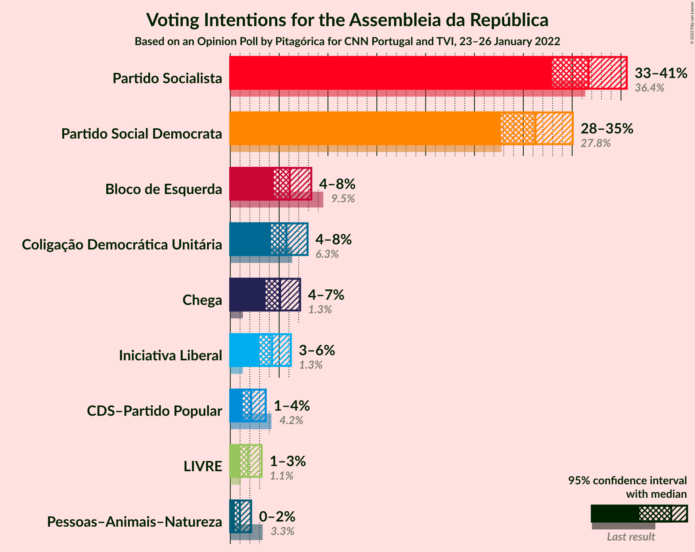

### Confidence Intervals

| Party | Last Result | Poll Result | 80% Confidence Interval | 90% Confidence Interval | 95% Confidence Interval | 99% Confidence Interval |
|:-----:|:-----------:|:-----------:|:-----------------------:|:-----------------------:|:-----------------------:|:-----------------------:|
| Partido Socialista | 36.4% | 36.7% | 34.2–39.2% |33.5–40.0% |32.9–40.6% |31.8–41.8% |
| Partido Social Democrata | 27.8% | 31.2% | 28.9–33.7% |28.3–34.4% |27.7–35.1% |26.6–36.3% |
| Bloco de Esquerda | 9.5% | 6.1% | 5.0–7.5% |4.7–7.9% |4.5–8.3% |4.0–9.0% |
| Coligação Democrática Unitária | 6.3% | 5.8% | 4.7–7.2% |4.4–7.6% |4.2–7.9% |3.7–8.6% |
| Chega | 1.3% | 5.1% | 4.1–6.4% |3.8–6.8% |3.6–7.1% |3.2–7.8% |
| Iniciativa Liberal | 1.3% | 4.3% | 3.4–5.5% |3.1–5.9% |2.9–6.2% |2.6–6.9% |
| CDS–Partido Popular | 4.2% | 2.1% | 1.6–3.1% |1.4–3.4% |1.2–3.6% |1.0–4.1% |
| LIVRE | 1.1% | 1.8% | 1.3–2.7% |1.1–3.0% |1.0–3.2% |0.8–3.7% |
| Pessoas–Animais–Natureza | 3.3% | 1.0% | 0.6–1.7% |0.5–1.9% |0.5–2.1% |0.3–2.6% |

*Note:* The poll result column reflects the actual value used in the calculations. Published results may vary slightly, and in addition be rounded to fewer digits.

## Seats

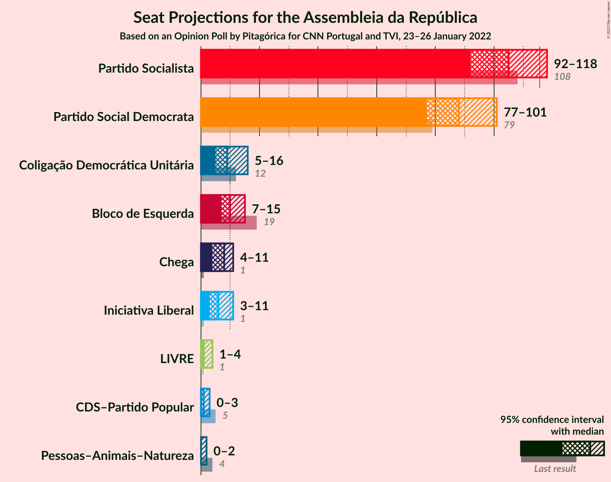

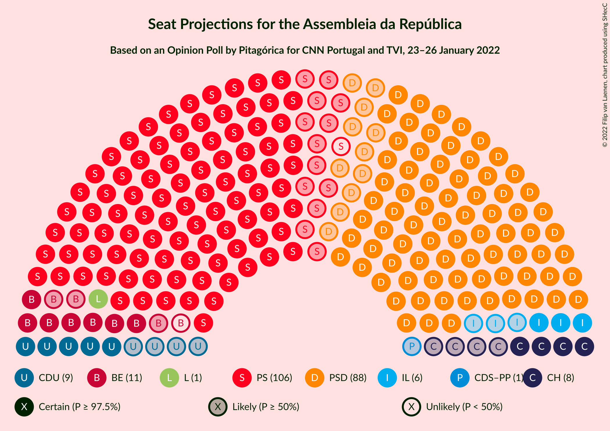

### Confidence Intervals

| Party | Last Result | Median | 80% Confidence Interval | 90% Confidence Interval | 95% Confidence Interval | 99% Confidence Interval |
|:-----:|:-----------:|:------:|:-----------------------:|:-----------------------:|:-----------------------:|:-----------------------:|
| <a href="#partido-socialista">Partido Socialista</a> | 108 | 105 | 95–113 |93–115 |92–118 |88–121 |
| <a href="#partido-social-democrata">Partido Social Democrata</a> | 79 | 88 | 80–97 |78–99 |77–101 |74–104 |
| <a href="#bloco-de-esquerda">Bloco de Esquerda</a> | 19 | 10 | 7–15 |7–15 |7–15 |5–18 |
| <a href="#coligação-democrática-unitária">Coligação Democrática Unitária</a> | 12 | 9 | 7–15 |6–15 |5–16 |5–18 |
| <a href="#chega">Chega</a> | 1 | 8 | 4–11 |4–11 |4–11 |3–13 |
| <a href="#iniciativa-liberal">Iniciativa Liberal</a> | 1 | 6 | 4–8 |4–10 |3–11 |3–12 |
| <a href="#cds–partido-popular">CDS–Partido Popular</a> | 5 | 1 | 0–2 |0–2 |0–3 |0–4 |
| <a href="#livre">LIVRE</a> | 1 | 1 | 1–3 |1–3 |1–4 |0–4 |
| <a href="#pessoas–animais–natureza">Pessoas–Animais–Natureza</a> | 4 | 0 | 0–1 |0–1 |0–2 |0–2 |

### Partido Socialista

*For a full overview of the results for this party, see the [Partido Socialista](party-partidosocialista.html) page.*

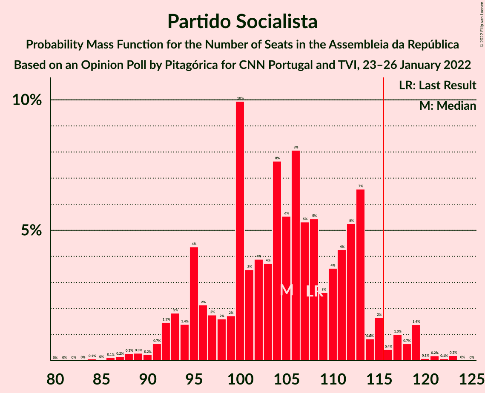

| Number of Seats | Probability | Accumulated | Special Marks |
|:---------------:|:-----------:|:-----------:|:-------------:|
| 84 | 0.1% | 100% |  |
| 85 | 0% | 99.9% |  |
| 86 | 0.1% | 99.9% |  |
| 87 | 0.2% | 99.7% |  |
| 88 | 0.3% | 99.6% |  |
| 89 | 0.3% | 99.3% |  |
| 90 | 0.2% | 99.0% |  |
| 91 | 0.7% | 98.8% |  |
| 92 | 1.5% | 98% |  |
| 93 | 2% | 97% |  |
| 94 | 1.4% | 95% |  |
| 95 | 4% | 93% |  |
| 96 | 2% | 89% |  |
| 97 | 2% | 87% |  |
| 98 | 2% | 85% |  |
| 99 | 2% | 84% |  |
| 100 | 10% | 82% |  |
| 101 | 3% | 72% |  |
| 102 | 4% | 68% |  |
| 103 | 4% | 65% |  |
| 104 | 8% | 61% |  |
| 105 | 6% | 53% | Median |
| 106 | 8% | 48% |  |
| 107 | 5% | 40% |  |
| 108 | 5% | 34% | Last Result |
| 109 | 3% | 29% |  |
| 110 | 4% | 26% |  |
| 111 | 4% | 23% |  |
| 112 | 5% | 18% |  |
| 113 | 7% | 13% |  |
| 114 | 0.8% | 7% |  |
| 115 | 2% | 6% |  |
| 116 | 0.4% | 4% | Majority |
| 117 | 1.0% | 4% |  |
| 118 | 0.7% | 3% |  |
| 119 | 1.4% | 2% |  |
| 120 | 0.1% | 0.6% |  |
| 121 | 0.2% | 0.5% |  |
| 122 | 0.1% | 0.3% |  |
| 123 | 0.2% | 0.2% |  |
| 124 | 0% | 0% |  |

### Partido Social Democrata

*For a full overview of the results for this party, see the [Partido Social Democrata](party-partidosocialdemocrata.html) page.*

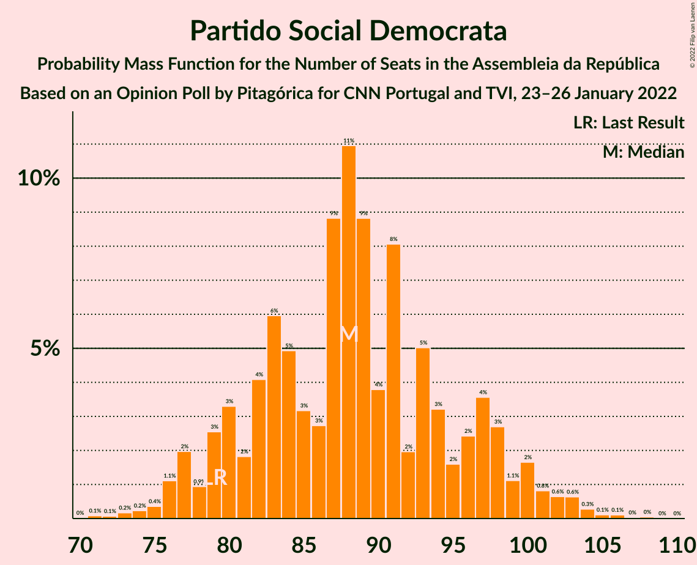

| Number of Seats | Probability | Accumulated | Special Marks |
|:---------------:|:-----------:|:-----------:|:-------------:|
| 70 | 0% | 100% |  |
| 71 | 0.1% | 99.9% |  |
| 72 | 0.1% | 99.9% |  |
| 73 | 0.2% | 99.8% |  |
| 74 | 0.2% | 99.6% |  |
| 75 | 0.4% | 99.4% |  |
| 76 | 1.1% | 99.0% |  |
| 77 | 2% | 98% |  |
| 78 | 0.9% | 96% |  |
| 79 | 3% | 95% | Last Result |
| 80 | 3% | 92% |  |
| 81 | 2% | 89% |  |
| 82 | 4% | 87% |  |
| 83 | 6% | 83% |  |
| 84 | 5% | 77% |  |
| 85 | 3% | 72% |  |
| 86 | 3% | 69% |  |
| 87 | 9% | 66% |  |
| 88 | 11% | 58% | Median |
| 89 | 9% | 47% |  |
| 90 | 4% | 38% |  |
| 91 | 8% | 34% |  |
| 92 | 2% | 26% |  |
| 93 | 5% | 24% |  |
| 94 | 3% | 19% |  |
| 95 | 2% | 16% |  |
| 96 | 2% | 14% |  |
| 97 | 4% | 12% |  |
| 98 | 3% | 8% |  |
| 99 | 1.1% | 5% |  |
| 100 | 2% | 4% |  |
| 101 | 0.8% | 3% |  |
| 102 | 0.6% | 2% |  |
| 103 | 0.6% | 1.2% |  |
| 104 | 0.3% | 0.6% |  |
| 105 | 0.1% | 0.3% |  |
| 106 | 0.1% | 0.2% |  |
| 107 | 0% | 0.1% |  |
| 108 | 0% | 0.1% |  |
| 109 | 0% | 0% |  |

### Bloco de Esquerda

*For a full overview of the results for this party, see the [Bloco de Esquerda](party-blocodeesquerda.html) page.*

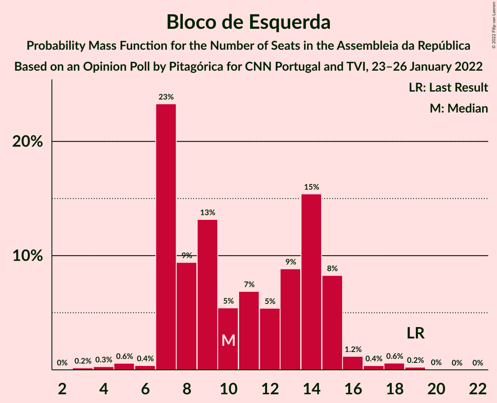

| Number of Seats | Probability | Accumulated | Special Marks |
|:---------------:|:-----------:|:-----------:|:-------------:|
| 3 | 0.2% | 100% |  |
| 4 | 0.3% | 99.8% |  |
| 5 | 0.6% | 99.5% |  |
| 6 | 0.4% | 98.9% |  |
| 7 | 23% | 98.6% |  |
| 8 | 9% | 75% |  |
| 9 | 13% | 66% |  |
| 10 | 5% | 53% | Median |
| 11 | 7% | 47% |  |
| 12 | 5% | 40% |  |
| 13 | 9% | 35% |  |
| 14 | 15% | 26% |  |
| 15 | 8% | 11% |  |
| 16 | 1.2% | 2% |  |
| 17 | 0.4% | 1.3% |  |
| 18 | 0.6% | 0.9% |  |
| 19 | 0.2% | 0.3% | Last Result |
| 20 | 0% | 0.1% |  |
| 21 | 0% | 0% |  |

### Coligação Democrática Unitária

*For a full overview of the results for this party, see the [Coligação Democrática Unitária](party-coligaçãodemocráticaunitária.html) page.*

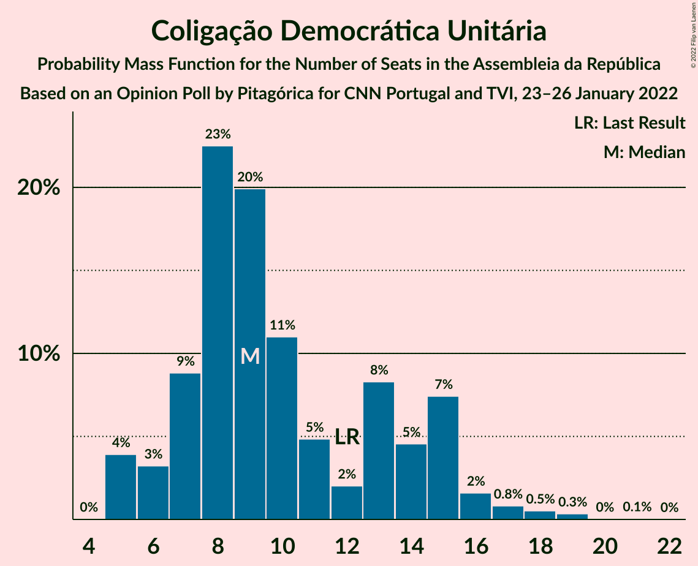

| Number of Seats | Probability | Accumulated | Special Marks |
|:---------------:|:-----------:|:-----------:|:-------------:|
| 4 | 0% | 100% |  |
| 5 | 4% | 99.9% |  |
| 6 | 3% | 96% |  |
| 7 | 9% | 93% |  |
| 8 | 23% | 84% |  |
| 9 | 20% | 61% | Median |
| 10 | 11% | 42% |  |
| 11 | 5% | 31% |  |
| 12 | 2% | 26% | Last Result |
| 13 | 8% | 24% |  |
| 14 | 5% | 15% |  |
| 15 | 7% | 11% |  |
| 16 | 2% | 3% |  |
| 17 | 0.8% | 2% |  |
| 18 | 0.5% | 1.0% |  |
| 19 | 0.3% | 0.4% |  |
| 20 | 0% | 0.1% |  |
| 21 | 0.1% | 0.1% |  |
| 22 | 0% | 0% |  |

### Chega

*For a full overview of the results for this party, see the [Chega](party-chega.html) page.*

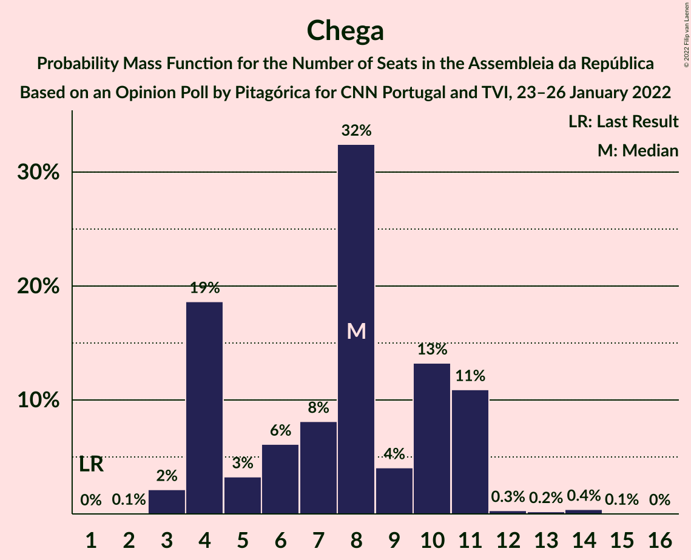

| Number of Seats | Probability | Accumulated | Special Marks |
|:---------------:|:-----------:|:-----------:|:-------------:|
| 1 | 0% | 100% | Last Result |
| 2 | 0.1% | 100% |  |
| 3 | 2% | 99.9% |  |
| 4 | 19% | 98% |  |
| 5 | 3% | 79% |  |
| 6 | 6% | 76% |  |
| 7 | 8% | 70% |  |
| 8 | 32% | 62% | Median |
| 9 | 4% | 29% |  |
| 10 | 13% | 25% |  |
| 11 | 11% | 12% |  |
| 12 | 0.3% | 1.0% |  |
| 13 | 0.2% | 0.7% |  |
| 14 | 0.4% | 0.5% |  |
| 15 | 0.1% | 0.1% |  |
| 16 | 0% | 0% |  |

### Iniciativa Liberal

*For a full overview of the results for this party, see the [Iniciativa Liberal](party-iniciativaliberal.html) page.*

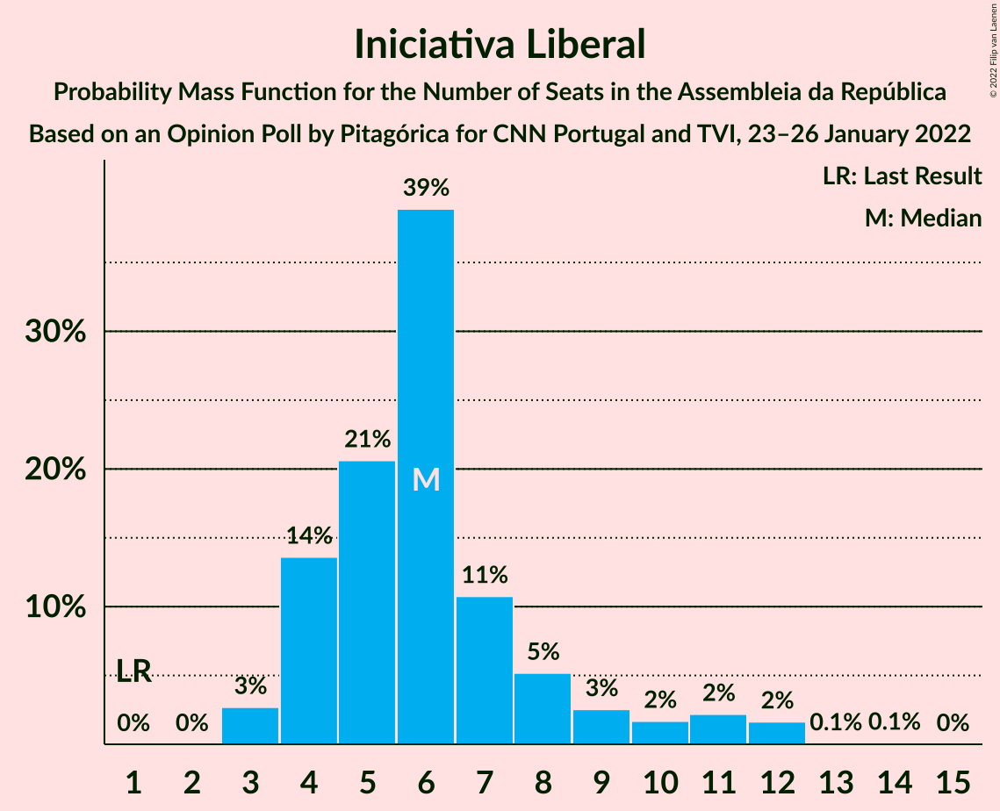

| Number of Seats | Probability | Accumulated | Special Marks |
|:---------------:|:-----------:|:-----------:|:-------------:|
| 1 | 0% | 100% | Last Result |
| 2 | 0% | 100% |  |
| 3 | 3% | 100% |  |
| 4 | 14% | 97% |  |
| 5 | 21% | 84% |  |
| 6 | 39% | 63% | Median |
| 7 | 11% | 24% |  |
| 8 | 5% | 13% |  |
| 9 | 3% | 8% |  |
| 10 | 2% | 6% |  |
| 11 | 2% | 4% |  |
| 12 | 2% | 2% |  |
| 13 | 0.1% | 0.2% |  |
| 14 | 0.1% | 0.1% |  |
| 15 | 0% | 0% |  |

### CDS–Partido Popular

*For a full overview of the results for this party, see the [CDS–Partido Popular](party-cds–partidopopular.html) page.*

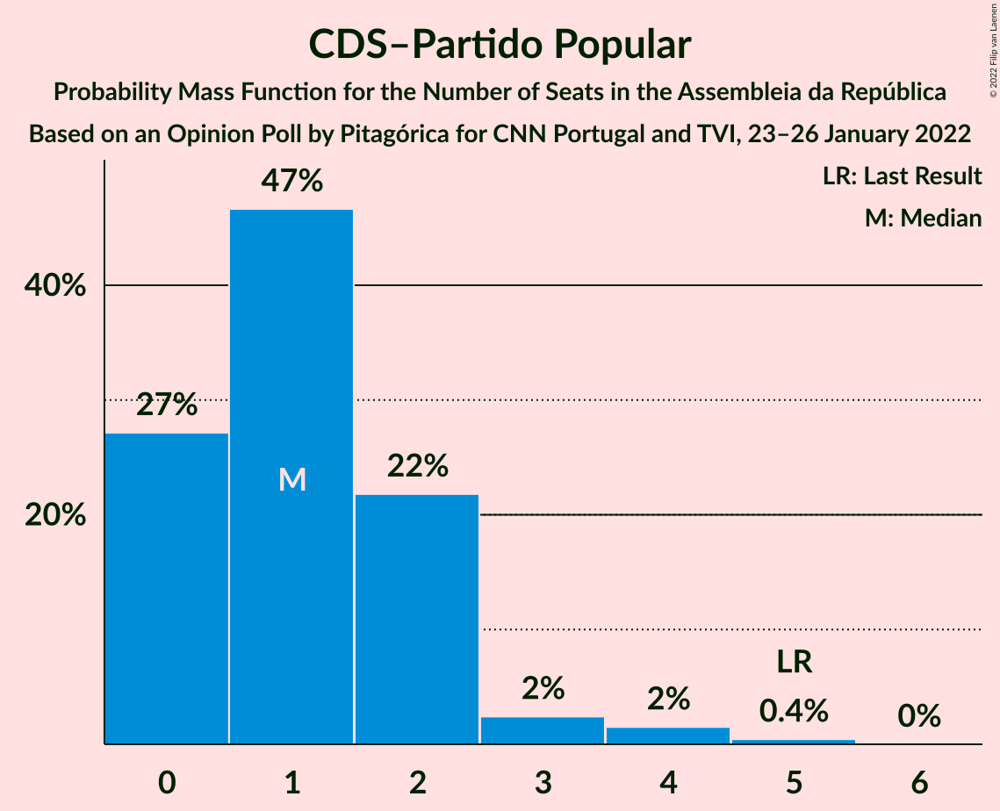

| Number of Seats | Probability | Accumulated | Special Marks |
|:---------------:|:-----------:|:-----------:|:-------------:|
| 0 | 27% | 100% |  |
| 1 | 47% | 73% | Median |
| 2 | 22% | 26% |  |
| 3 | 2% | 4% |  |
| 4 | 2% | 2% |  |
| 5 | 0.4% | 0.5% | Last Result |
| 6 | 0% | 0% |  |

### LIVRE

*For a full overview of the results for this party, see the [LIVRE](party-livre.html) page.*

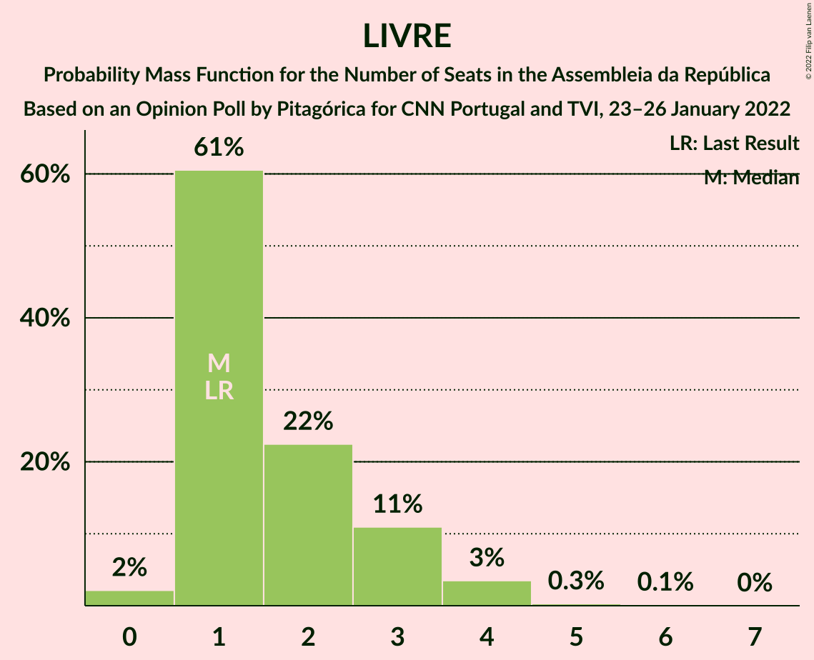

| Number of Seats | Probability | Accumulated | Special Marks |
|:---------------:|:-----------:|:-----------:|:-------------:|
| 0 | 2% | 100% |  |
| 1 | 61% | 98% | Last Result, Median |
| 2 | 22% | 37% |  |
| 3 | 11% | 15% |  |
| 4 | 3% | 4% |  |
| 5 | 0.3% | 0.4% |  |
| 6 | 0.1% | 0.1% |  |
| 7 | 0% | 0% |  |

### Pessoas–Animais–Natureza

*For a full overview of the results for this party, see the [Pessoas–Animais–Natureza](party-pessoas–animais–natureza.html) page.*

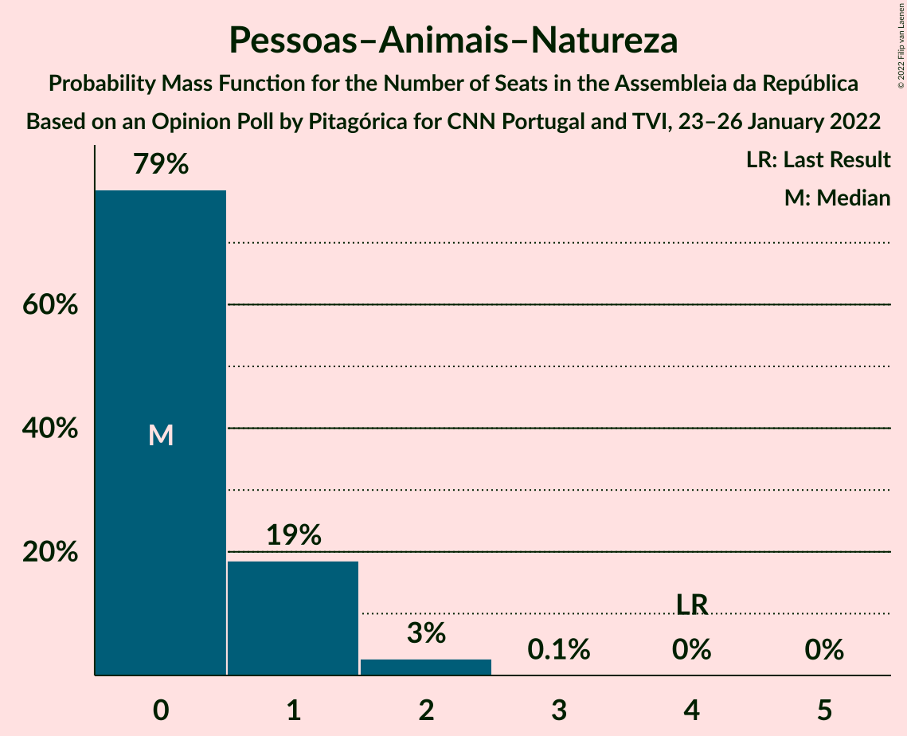

| Number of Seats | Probability | Accumulated | Special Marks |
|:---------------:|:-----------:|:-----------:|:-------------:|
| 0 | 79% | 100% | Median |
| 1 | 19% | 21% |  |
| 2 | 3% | 3% |  |
| 3 | 0.1% | 0.1% |  |
| 4 | 0% | 0% | Last Result |

## Coalitions

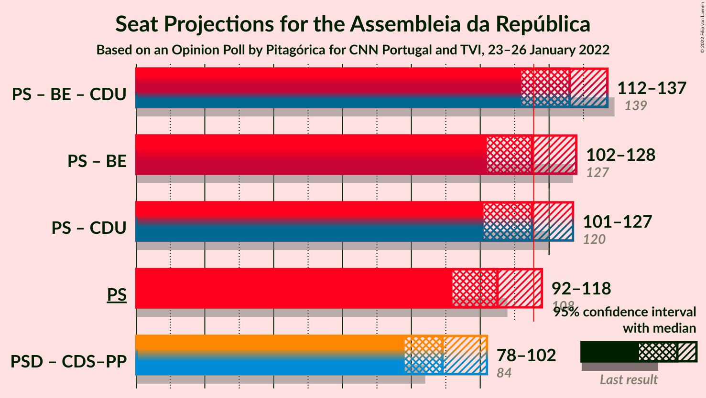

### Confidence Intervals

| Coalition | Last Result | Median | Majority? | 80% Confidence Interval | 90% Confidence Interval | 95% Confidence Interval | 99% Confidence Interval |
|:---------:|:-----------:|:------:|:---------:|:-----------------------:|:-----------------------:|:-----------------------:|:-----------------------:|
| Partido Socialista – Bloco de Esquerda – Coligação Democrática Unitária | 139 | 126 | 94% | 117–133 | 114–136 | 112–137 | 108–141 |
| Partido Socialista – Bloco de Esquerda | 127 | 115 | 50% | 106–123 | 103–126 | 102–128 | 98–131 |
| Partido Socialista – Coligação Democrática Unitária | 120 | 115 | 45% | 106–122 | 103–125 | 101–127 | 98–131 |
| Partido Socialista | 108 | 105 | 4% | 95–113 | 93–115 | 92–118 | 88–121 |
| Partido Social Democrata – CDS–Partido Popular | 84 | 89 | 0% | 81–97 | 80–100 | 78–102 | 75–105 |

### Partido Socialista – Bloco de Esquerda – Coligação Democrática Unitária

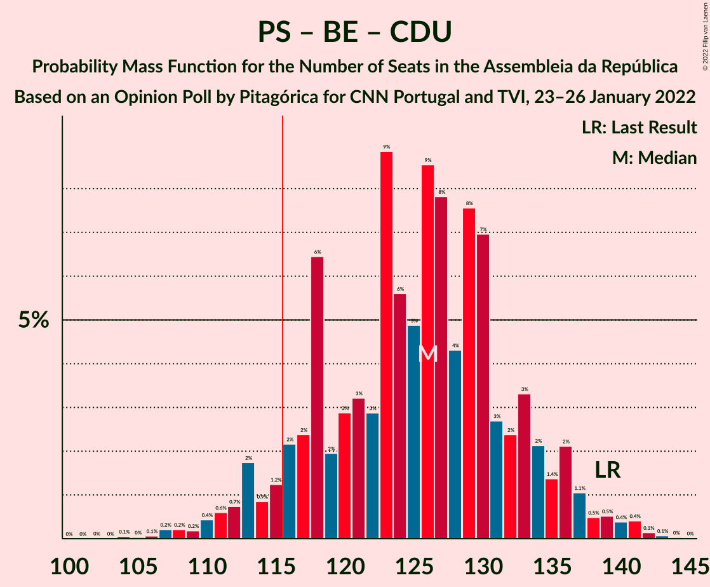

| Number of Seats | Probability | Accumulated | Special Marks |
|:---------------:|:-----------:|:-----------:|:-------------:|
| 104 | 0.1% | 100% |  |
| 105 | 0% | 99.9% |  |
| 106 | 0.1% | 99.9% |  |
| 107 | 0.2% | 99.8% |  |
| 108 | 0.2% | 99.6% |  |
| 109 | 0.2% | 99.4% |  |
| 110 | 0.4% | 99.2% |  |
| 111 | 0.6% | 98.8% |  |
| 112 | 0.7% | 98% |  |
| 113 | 2% | 97% |  |
| 114 | 0.9% | 96% |  |
| 115 | 1.2% | 95% |  |
| 116 | 2% | 94% | Majority |
| 117 | 2% | 91% |  |
| 118 | 6% | 89% |  |
| 119 | 2% | 83% |  |
| 120 | 3% | 81% |  |
| 121 | 3% | 78% |  |
| 122 | 3% | 75% |  |
| 123 | 9% | 72% |  |
| 124 | 6% | 63% | Median |
| 125 | 5% | 57% |  |
| 126 | 9% | 52% |  |
| 127 | 8% | 44% |  |
| 128 | 4% | 36% |  |
| 129 | 8% | 32% |  |
| 130 | 7% | 24% |  |
| 131 | 3% | 17% |  |
| 132 | 2% | 14% |  |
| 133 | 3% | 12% |  |
| 134 | 2% | 9% |  |
| 135 | 1.4% | 7% |  |
| 136 | 2% | 5% |  |
| 137 | 1.1% | 3% |  |
| 138 | 0.5% | 2% |  |
| 139 | 0.5% | 2% | Last Result |
| 140 | 0.4% | 1.1% |  |
| 141 | 0.4% | 0.7% |  |
| 142 | 0.1% | 0.3% |  |
| 143 | 0.1% | 0.1% |  |
| 144 | 0% | 0.1% |  |
| 145 | 0% | 0% |  |

### Partido Socialista – Bloco de Esquerda

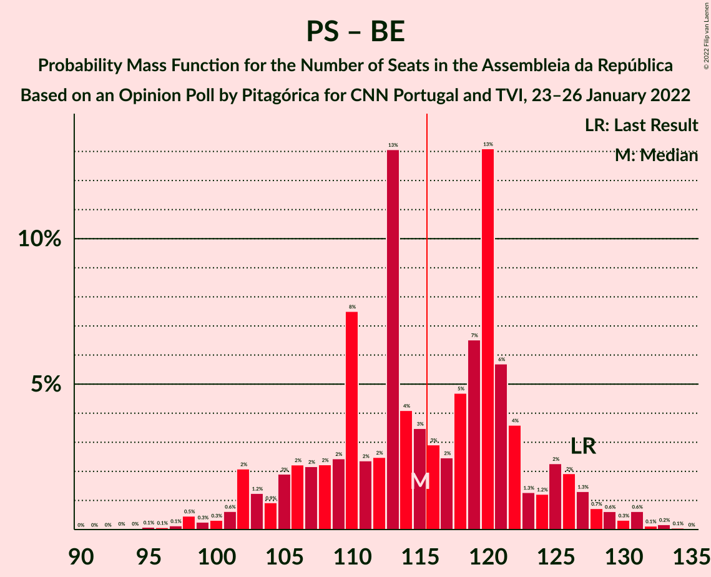

| Number of Seats | Probability | Accumulated | Special Marks |
|:---------------:|:-----------:|:-----------:|:-------------:|
| 93 | 0% | 100% |  |
| 94 | 0% | 99.9% |  |
| 95 | 0.1% | 99.9% |  |
| 96 | 0.1% | 99.8% |  |
| 97 | 0.1% | 99.7% |  |
| 98 | 0.5% | 99.6% |  |
| 99 | 0.3% | 99.1% |  |
| 100 | 0.3% | 98.9% |  |
| 101 | 0.6% | 98.6% |  |
| 102 | 2% | 98% |  |
| 103 | 1.2% | 96% |  |
| 104 | 0.9% | 95% |  |
| 105 | 2% | 94% |  |
| 106 | 2% | 92% |  |
| 107 | 2% | 90% |  |
| 108 | 2% | 87% |  |
| 109 | 2% | 85% |  |
| 110 | 8% | 83% |  |
| 111 | 2% | 75% |  |
| 112 | 2% | 73% |  |
| 113 | 13% | 70% |  |
| 114 | 4% | 57% |  |
| 115 | 3% | 53% | Median |
| 116 | 3% | 50% | Majority |
| 117 | 2% | 47% |  |
| 118 | 5% | 44% |  |
| 119 | 7% | 40% |  |
| 120 | 13% | 33% |  |
| 121 | 6% | 20% |  |
| 122 | 4% | 14% |  |
| 123 | 1.3% | 11% |  |
| 124 | 1.2% | 9% |  |
| 125 | 2% | 8% |  |
| 126 | 2% | 6% |  |
| 127 | 1.3% | 4% | Last Result |
| 128 | 0.7% | 3% |  |
| 129 | 0.6% | 2% |  |
| 130 | 0.3% | 1.3% |  |
| 131 | 0.6% | 1.0% |  |
| 132 | 0.1% | 0.4% |  |
| 133 | 0.2% | 0.3% |  |
| 134 | 0.1% | 0.1% |  |
| 135 | 0% | 0% |  |

### Partido Socialista – Coligação Democrática Unitária

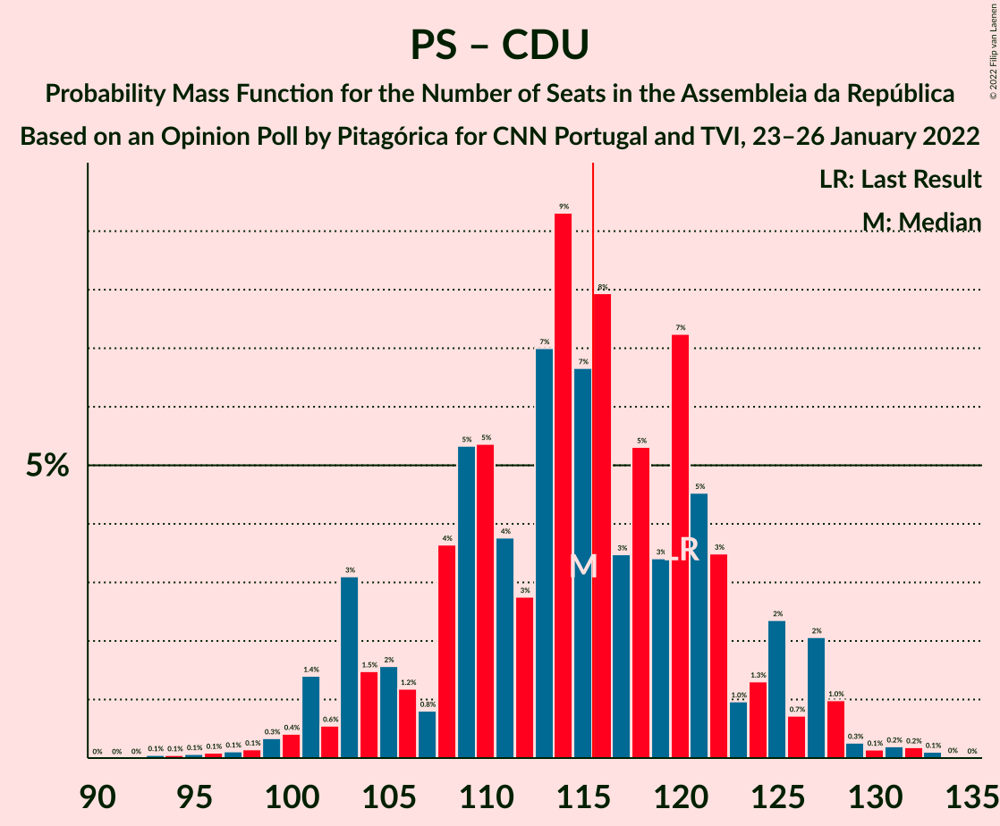

| Number of Seats | Probability | Accumulated | Special Marks |
|:---------------:|:-----------:|:-----------:|:-------------:|
| 93 | 0.1% | 100% |  |
| 94 | 0.1% | 99.9% |  |
| 95 | 0.1% | 99.9% |  |
| 96 | 0.1% | 99.8% |  |
| 97 | 0.1% | 99.7% |  |
| 98 | 0.1% | 99.6% |  |
| 99 | 0.3% | 99.5% |  |
| 100 | 0.4% | 99.1% |  |
| 101 | 1.4% | 98.7% |  |
| 102 | 0.6% | 97% |  |
| 103 | 3% | 97% |  |
| 104 | 1.5% | 94% |  |
| 105 | 2% | 92% |  |
| 106 | 1.2% | 91% |  |
| 107 | 0.8% | 89% |  |
| 108 | 4% | 89% |  |
| 109 | 5% | 85% |  |
| 110 | 5% | 80% |  |
| 111 | 4% | 74% |  |
| 112 | 3% | 71% |  |
| 113 | 7% | 68% |  |
| 114 | 9% | 61% | Median |
| 115 | 7% | 51% |  |
| 116 | 8% | 45% | Majority |
| 117 | 3% | 37% |  |
| 118 | 5% | 33% |  |
| 119 | 3% | 28% |  |
| 120 | 7% | 25% | Last Result |
| 121 | 5% | 17% |  |
| 122 | 3% | 13% |  |
| 123 | 1.0% | 9% |  |
| 124 | 1.3% | 8% |  |
| 125 | 2% | 7% |  |
| 126 | 0.7% | 5% |  |
| 127 | 2% | 4% |  |
| 128 | 1.0% | 2% |  |
| 129 | 0.3% | 1.0% |  |
| 130 | 0.1% | 0.7% |  |
| 131 | 0.2% | 0.5% |  |
| 132 | 0.2% | 0.3% |  |
| 133 | 0.1% | 0.2% |  |
| 134 | 0% | 0.1% |  |
| 135 | 0% | 0% |  |

### Partido Socialista

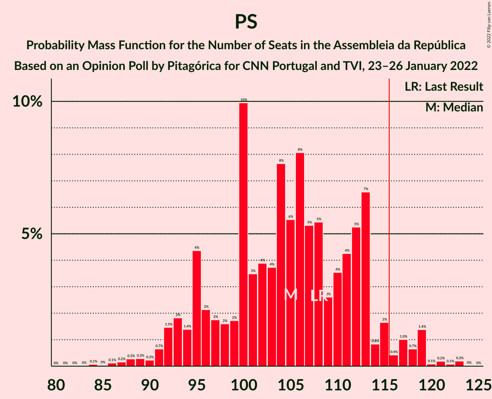

| Number of Seats | Probability | Accumulated | Special Marks |
|:---------------:|:-----------:|:-----------:|:-------------:|
| 84 | 0.1% | 100% |  |
| 85 | 0% | 99.9% |  |
| 86 | 0.1% | 99.9% |  |
| 87 | 0.2% | 99.7% |  |
| 88 | 0.3% | 99.6% |  |
| 89 | 0.3% | 99.3% |  |
| 90 | 0.2% | 99.0% |  |
| 91 | 0.7% | 98.8% |  |
| 92 | 1.5% | 98% |  |
| 93 | 2% | 97% |  |
| 94 | 1.4% | 95% |  |
| 95 | 4% | 93% |  |
| 96 | 2% | 89% |  |
| 97 | 2% | 87% |  |
| 98 | 2% | 85% |  |
| 99 | 2% | 84% |  |
| 100 | 10% | 82% |  |
| 101 | 3% | 72% |  |
| 102 | 4% | 68% |  |
| 103 | 4% | 65% |  |
| 104 | 8% | 61% |  |
| 105 | 6% | 53% | Median |
| 106 | 8% | 48% |  |
| 107 | 5% | 40% |  |
| 108 | 5% | 34% | Last Result |
| 109 | 3% | 29% |  |
| 110 | 4% | 26% |  |
| 111 | 4% | 23% |  |
| 112 | 5% | 18% |  |
| 113 | 7% | 13% |  |
| 114 | 0.8% | 7% |  |
| 115 | 2% | 6% |  |
| 116 | 0.4% | 4% | Majority |
| 117 | 1.0% | 4% |  |
| 118 | 0.7% | 3% |  |
| 119 | 1.4% | 2% |  |
| 120 | 0.1% | 0.6% |  |
| 121 | 0.2% | 0.5% |  |
| 122 | 0.1% | 0.3% |  |
| 123 | 0.2% | 0.2% |  |
| 124 | 0% | 0% |  |

### Partido Social Democrata – CDS–Partido Popular

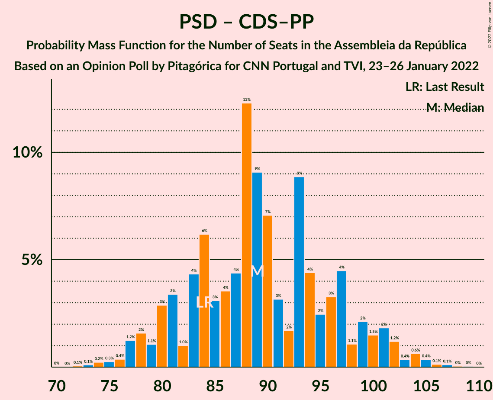

| Number of Seats | Probability | Accumulated | Special Marks |
|:---------------:|:-----------:|:-----------:|:-------------:|
| 71 | 0% | 100% |  |
| 72 | 0.1% | 99.9% |  |
| 73 | 0.1% | 99.9% |  |
| 74 | 0.2% | 99.8% |  |
| 75 | 0.3% | 99.6% |  |
| 76 | 0.4% | 99.3% |  |
| 77 | 1.2% | 98.9% |  |
| 78 | 2% | 98% |  |
| 79 | 1.1% | 96% |  |
| 80 | 3% | 95% |  |
| 81 | 3% | 92% |  |
| 82 | 1.0% | 89% |  |
| 83 | 4% | 88% |  |
| 84 | 6% | 83% | Last Result |
| 85 | 3% | 77% |  |
| 86 | 4% | 74% |  |
| 87 | 4% | 71% |  |
| 88 | 12% | 66% |  |
| 89 | 9% | 54% | Median |
| 90 | 7% | 45% |  |
| 91 | 3% | 38% |  |
| 92 | 2% | 35% |  |
| 93 | 9% | 33% |  |
| 94 | 4% | 24% |  |
| 95 | 2% | 20% |  |
| 96 | 3% | 17% |  |
| 97 | 4% | 14% |  |
| 98 | 1.1% | 9% |  |
| 99 | 2% | 8% |  |
| 100 | 1.5% | 6% |  |
| 101 | 2% | 5% |  |
| 102 | 1.2% | 3% |  |
| 103 | 0.4% | 2% |  |
| 104 | 0.6% | 1.3% |  |
| 105 | 0.4% | 0.7% |  |
| 106 | 0.1% | 0.4% |  |
| 107 | 0.1% | 0.2% |  |
| 108 | 0% | 0.1% |  |
| 109 | 0% | 0.1% |  |
| 110 | 0% | 0% |  |

## Technical Information

### Opinion Poll

+ **Polling firm:** Pitagórica
+ **Commissioner(s):** CNN Portugal and TVI
+ **Fieldwork period:** 23–26 January 2022

### Calculations

+ **Sample size:** 608
+ **Simulations done:** 1,048,576
+ **Error estimate:** 1.39%

