# Opinion Poll by Pitagórica for CNN Portugal and TVI, 24–28 January 2022

<a href="#voting-intentions">Voting Intentions</a> | <a href="#seats">Seats</a> | <a href="#coalitions">Coalitions</a> | <a href="#technical-information">Technical Information</a>

## Voting Intentions

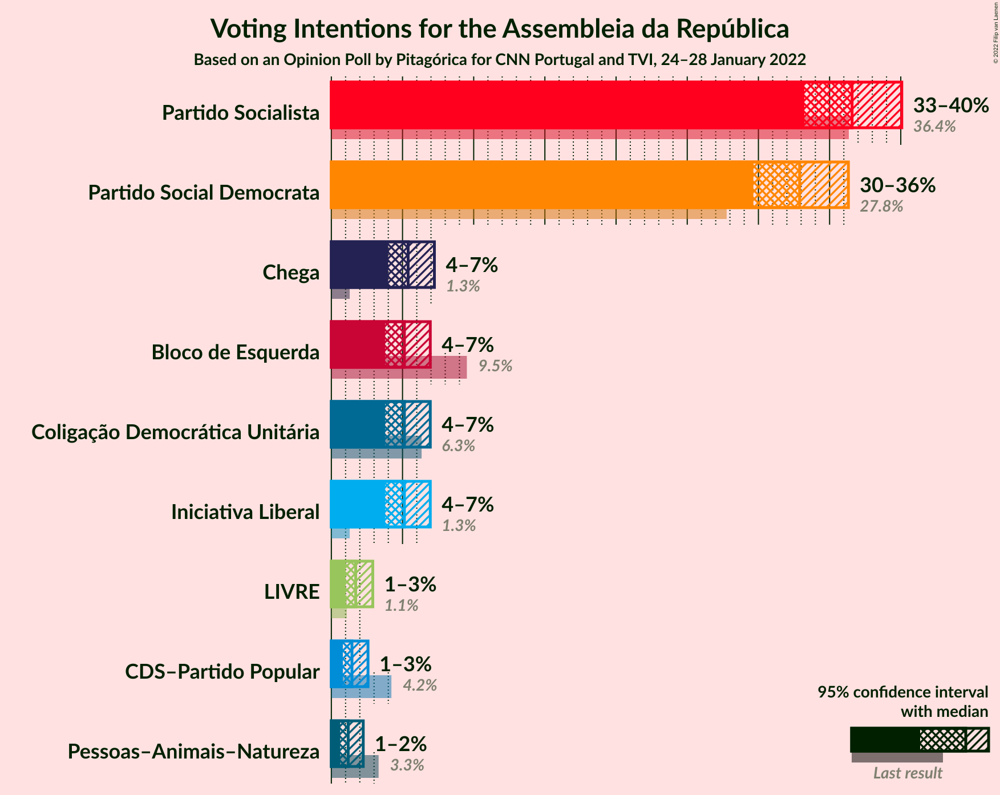

### Confidence Intervals

| Party | Last Result | Poll Result | 80% Confidence Interval | 90% Confidence Interval | 95% Confidence Interval | 99% Confidence Interval |
|:-----:|:-----------:|:-----------:|:-----------------------:|:-----------------------:|:-----------------------:|:-----------------------:|
| Partido Socialista | 36.4% | 36.6% | 34.4–38.9% |33.8–39.5% |33.2–40.1% |32.2–41.2% |
| Partido Social Democrata | 27.8% | 32.9% | 30.8–35.1% |30.2–35.8% |29.6–36.3% |28.6–37.4% |
| Chega | 1.3% | 5.4% | 4.5–6.6% |4.2–6.9% |4.0–7.2% |3.6–7.9% |
| Bloco de Esquerda | 9.5% | 5.1% | 4.2–6.3% |4.0–6.6% |3.8–7.0% |3.4–7.6% |
| Coligação Democrática Unitária | 6.3% | 5.1% | 4.2–6.3% |4.0–6.6% |3.8–7.0% |3.4–7.6% |
| Iniciativa Liberal | 1.3% | 5.1% | 4.2–6.3% |4.0–6.6% |3.8–7.0% |3.4–7.6% |
| LIVRE | 1.1% | 1.7% | 1.2–2.5% |1.1–2.7% |1.0–2.9% |0.8–3.3% |
| CDS–Partido Popular | 4.2% | 1.4% | 1.0–2.2% |0.9–2.4% |0.8–2.6% |0.6–3.0% |
| Pessoas–Animais–Natureza | 3.3% | 1.2% | 0.8–1.9% |0.7–2.1% |0.6–2.2% |0.5–2.6% |

*Note:* The poll result column reflects the actual value used in the calculations. Published results may vary slightly, and in addition be rounded to fewer digits.

## Seats

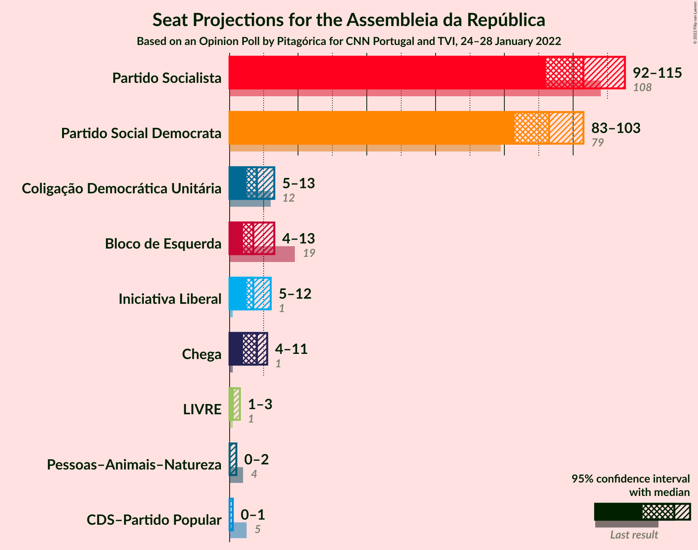

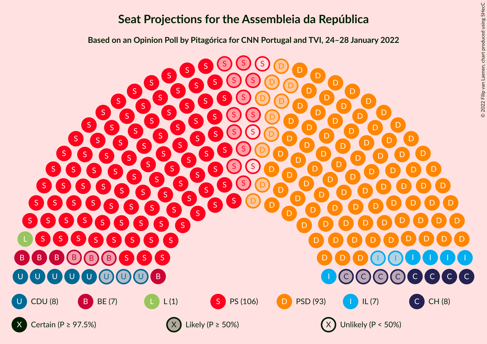

### Confidence Intervals

| Party | Last Result | Median | 80% Confidence Interval | 90% Confidence Interval | 95% Confidence Interval | 99% Confidence Interval |
|:-----:|:-----------:|:------:|:-----------------------:|:-----------------------:|:-----------------------:|:-----------------------:|
| <a href="#partido-socialista">Partido Socialista</a> | 108 | 103 | 96–112 |94–112 |92–115 |89–118 |
| <a href="#partido-social-democrata">Partido Social Democrata</a> | 79 | 93 | 86–100 |84–103 |83–103 |80–106 |
| <a href="#chega">Chega</a> | 1 | 8 | 6–11 |4–11 |4–11 |4–13 |
| <a href="#bloco-de-esquerda">Bloco de Esquerda</a> | 19 | 7 | 5–10 |4–11 |4–13 |3–15 |
| <a href="#coligação-democrática-unitária">Coligação Democrática Unitária</a> | 12 | 8 | 6–10 |5–11 |5–13 |5–15 |
| <a href="#iniciativa-liberal">Iniciativa Liberal</a> | 1 | 7 | 6–10 |6–12 |5–12 |4–14 |
| <a href="#livre">LIVRE</a> | 1 | 1 | 1–2 |1–3 |1–3 |0–4 |
| <a href="#cds–partido-popular">CDS–Partido Popular</a> | 5 | 0 | 0–1 |0–1 |0–1 |0–2 |
| <a href="#pessoas–animais–natureza">Pessoas–Animais–Natureza</a> | 4 | 0 | 0–1 |0–1 |0–2 |0–2 |

### Partido Socialista

*For a full overview of the results for this party, see the [Partido Socialista](party-partidosocialista.html) page.*

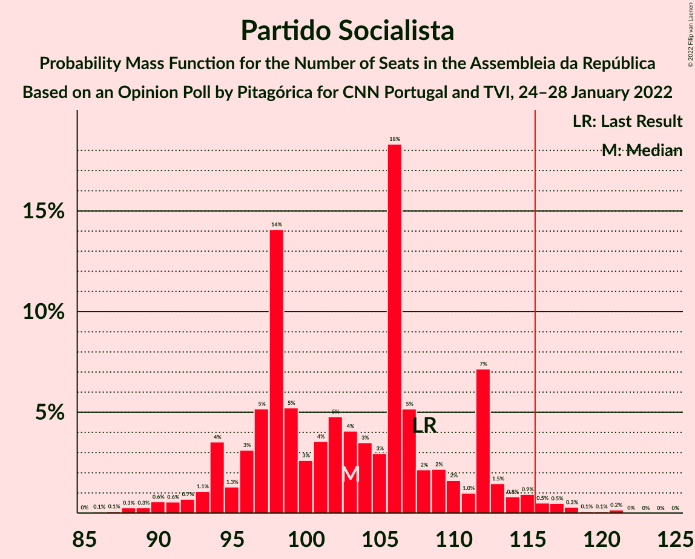

| Number of Seats | Probability | Accumulated | Special Marks |
|:---------------:|:-----------:|:-----------:|:-------------:|
| 85 | 0% | 100% |  |
| 86 | 0.1% | 99.9% |  |
| 87 | 0.1% | 99.9% |  |
| 88 | 0.3% | 99.8% |  |
| 89 | 0.3% | 99.5% |  |
| 90 | 0.6% | 99.3% |  |
| 91 | 0.6% | 98.7% |  |
| 92 | 0.7% | 98% |  |
| 93 | 1.1% | 97% |  |
| 94 | 4% | 96% |  |
| 95 | 1.3% | 93% |  |
| 96 | 3% | 92% |  |
| 97 | 5% | 88% |  |
| 98 | 14% | 83% |  |
| 99 | 5% | 69% |  |
| 100 | 3% | 64% |  |
| 101 | 4% | 61% |  |
| 102 | 5% | 58% |  |
| 103 | 4% | 53% | Median |
| 104 | 3% | 49% |  |
| 105 | 3% | 45% |  |
| 106 | 18% | 42% |  |
| 107 | 5% | 24% |  |
| 108 | 2% | 19% | Last Result |
| 109 | 2% | 17% |  |
| 110 | 2% | 15% |  |
| 111 | 1.0% | 13% |  |
| 112 | 7% | 12% |  |
| 113 | 1.5% | 5% |  |
| 114 | 0.8% | 3% |  |
| 115 | 0.9% | 3% |  |
| 116 | 0.5% | 2% | Majority |
| 117 | 0.5% | 1.1% |  |
| 118 | 0.3% | 0.6% |  |
| 119 | 0.1% | 0.3% |  |
| 120 | 0.1% | 0.3% |  |
| 121 | 0.2% | 0.2% |  |
| 122 | 0% | 0% |  |

### Partido Social Democrata

*For a full overview of the results for this party, see the [Partido Social Democrata](party-partidosocialdemocrata.html) page.*

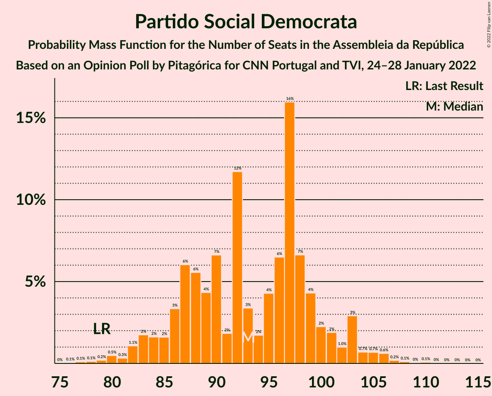

| Number of Seats | Probability | Accumulated | Special Marks |
|:---------------:|:-----------:|:-----------:|:-------------:|
| 76 | 0.1% | 100% |  |
| 77 | 0.1% | 99.9% |  |
| 78 | 0.1% | 99.8% |  |
| 79 | 0.2% | 99.7% | Last Result |
| 80 | 0.5% | 99.5% |  |
| 81 | 0.3% | 99.0% |  |
| 82 | 1.1% | 98.7% |  |
| 83 | 2% | 98% |  |
| 84 | 2% | 96% |  |
| 85 | 2% | 94% |  |
| 86 | 3% | 93% |  |
| 87 | 6% | 89% |  |
| 88 | 6% | 83% |  |
| 89 | 4% | 78% |  |
| 90 | 7% | 73% |  |
| 91 | 2% | 67% |  |
| 92 | 12% | 65% |  |
| 93 | 3% | 53% | Median |
| 94 | 2% | 50% |  |
| 95 | 4% | 48% |  |
| 96 | 6% | 44% |  |
| 97 | 16% | 37% |  |
| 98 | 7% | 21% |  |
| 99 | 4% | 15% |  |
| 100 | 2% | 10% |  |
| 101 | 2% | 8% |  |
| 102 | 1.0% | 6% |  |
| 103 | 3% | 5% |  |
| 104 | 0.7% | 2% |  |
| 105 | 0.7% | 2% |  |
| 106 | 0.6% | 1.1% |  |
| 107 | 0.2% | 0.4% |  |
| 108 | 0.1% | 0.3% |  |
| 109 | 0% | 0.1% |  |
| 110 | 0.1% | 0.1% |  |
| 111 | 0% | 0% |  |

### Chega

*For a full overview of the results for this party, see the [Chega](party-chega.html) page.*

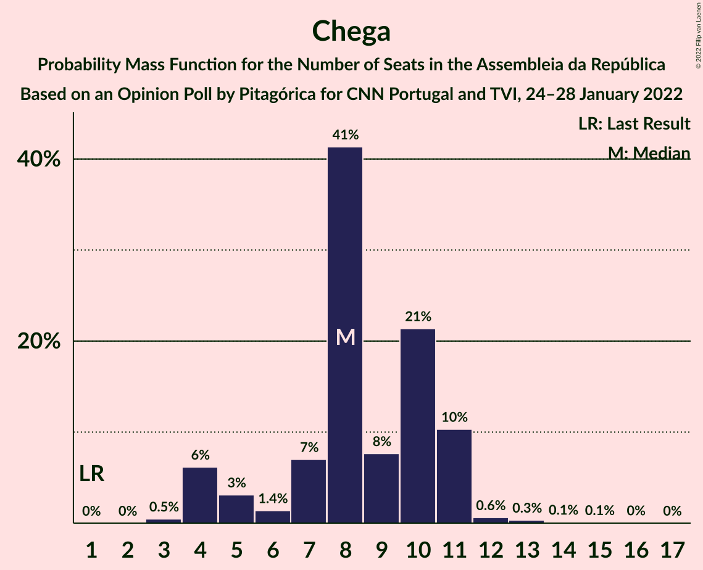

| Number of Seats | Probability | Accumulated | Special Marks |
|:---------------:|:-----------:|:-----------:|:-------------:|
| 1 | 0% | 100% | Last Result |
| 2 | 0% | 100% |  |
| 3 | 0.5% | 100% |  |
| 4 | 6% | 99.5% |  |
| 5 | 3% | 93% |  |
| 6 | 1.4% | 90% |  |
| 7 | 7% | 89% |  |
| 8 | 41% | 82% | Median |
| 9 | 8% | 41% |  |
| 10 | 21% | 33% |  |
| 11 | 10% | 12% |  |
| 12 | 0.6% | 1.2% |  |
| 13 | 0.3% | 0.6% |  |
| 14 | 0.1% | 0.2% |  |
| 15 | 0.1% | 0.1% |  |
| 16 | 0% | 0.1% |  |
| 17 | 0% | 0% |  |

### Bloco de Esquerda

*For a full overview of the results for this party, see the [Bloco de Esquerda](party-blocodeesquerda.html) page.*

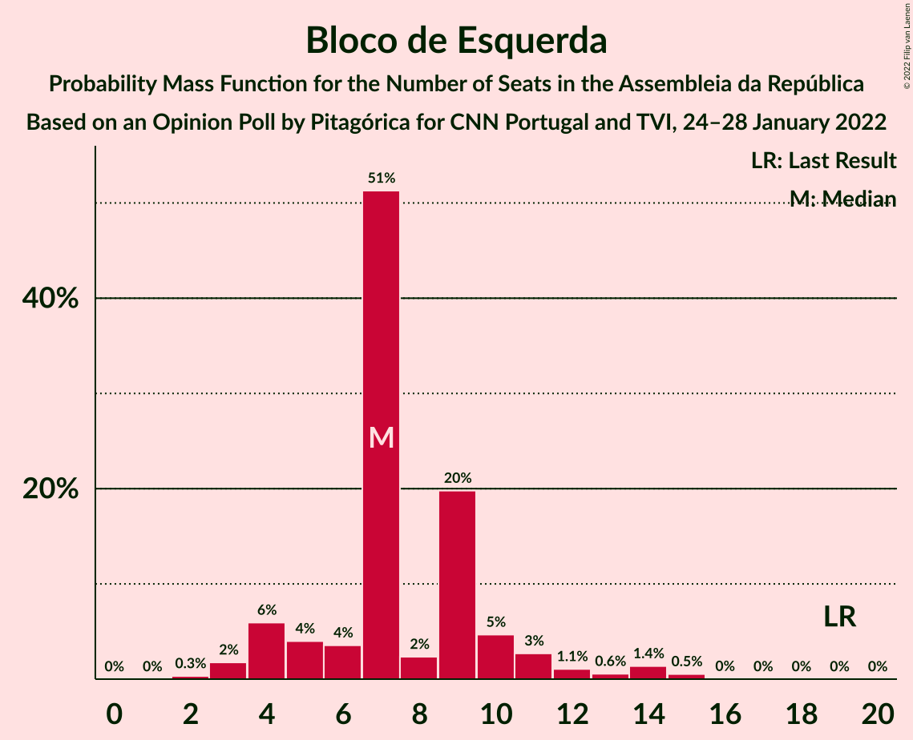

| Number of Seats | Probability | Accumulated | Special Marks |
|:---------------:|:-----------:|:-----------:|:-------------:|
| 2 | 0.3% | 100% |  |
| 3 | 2% | 99.7% |  |
| 4 | 6% | 98% |  |
| 5 | 4% | 92% |  |
| 6 | 4% | 88% |  |
| 7 | 51% | 84% | Median |
| 8 | 2% | 33% |  |
| 9 | 20% | 31% |  |
| 10 | 5% | 11% |  |
| 11 | 3% | 6% |  |
| 12 | 1.1% | 4% |  |
| 13 | 0.6% | 3% |  |
| 14 | 1.4% | 2% |  |
| 15 | 0.5% | 0.6% |  |
| 16 | 0% | 0% |  |
| 17 | 0% | 0% |  |
| 18 | 0% | 0% |  |
| 19 | 0% | 0% | Last Result |

### Coligação Democrática Unitária

*For a full overview of the results for this party, see the [Coligação Democrática Unitária](party-coligaçãodemocráticaunitária.html) page.*

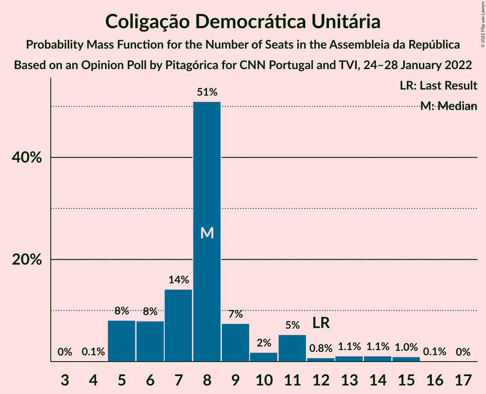

| Number of Seats | Probability | Accumulated | Special Marks |
|:---------------:|:-----------:|:-----------:|:-------------:|
| 3 | 0% | 100% |  |
| 4 | 0.1% | 99.9% |  |
| 5 | 8% | 99.9% |  |
| 6 | 8% | 92% |  |
| 7 | 14% | 84% |  |
| 8 | 51% | 70% | Median |
| 9 | 7% | 19% |  |
| 10 | 2% | 11% |  |
| 11 | 5% | 9% |  |
| 12 | 0.8% | 4% | Last Result |
| 13 | 1.1% | 3% |  |
| 14 | 1.1% | 2% |  |
| 15 | 1.0% | 1.1% |  |
| 16 | 0.1% | 0.2% |  |
| 17 | 0% | 0% |  |

### Iniciativa Liberal

*For a full overview of the results for this party, see the [Iniciativa Liberal](party-iniciativaliberal.html) page.*

| Number of Seats | Probability | Accumulated | Special Marks |
|:---------------:|:-----------:|:-----------:|:-------------:|
| 1 | 0% | 100% | Last Result |
| 2 | 0% | 100% |  |
| 3 | 0% | 100% |  |
| 4 | 1.2% | 100% |  |
| 5 | 2% | 98.7% |  |
| 6 | 42% | 97% |  |
| 7 | 7% | 55% | Median |
| 8 | 8% | 47% |  |
| 9 | 25% | 39% |  |
| 10 | 4% | 14% |  |
| 11 | 3% | 10% |  |
| 12 | 5% | 7% |  |
| 13 | 0.7% | 2% |  |
| 14 | 0.8% | 0.9% |  |
| 15 | 0.1% | 0.1% |  |
| 16 | 0% | 0% |  |

### LIVRE

*For a full overview of the results for this party, see the [LIVRE](party-livre.html) page.*

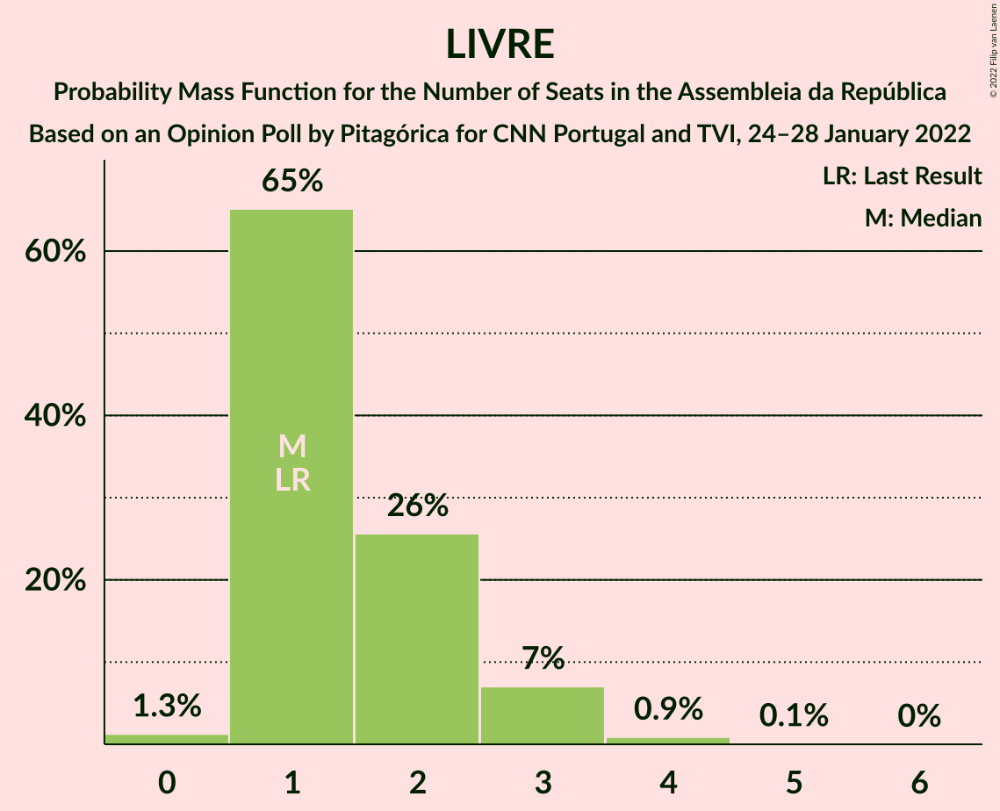

| Number of Seats | Probability | Accumulated | Special Marks |
|:---------------:|:-----------:|:-----------:|:-------------:|
| 0 | 1.3% | 100% |  |
| 1 | 65% | 98.7% | Last Result, Median |
| 2 | 26% | 34% |  |
| 3 | 7% | 8% |  |
| 4 | 0.9% | 1.0% |  |
| 5 | 0.1% | 0.1% |  |
| 6 | 0% | 0% |  |

### CDS–Partido Popular

*For a full overview of the results for this party, see the [CDS–Partido Popular](party-cds–partidopopular.html) page.*

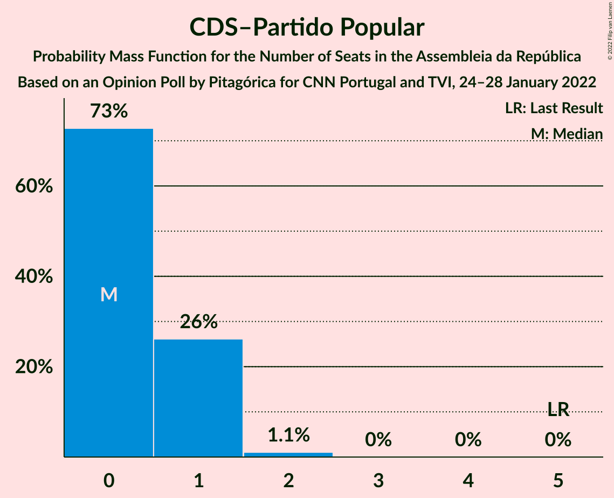

| Number of Seats | Probability | Accumulated | Special Marks |
|:---------------:|:-----------:|:-----------:|:-------------:|
| 0 | 73% | 100% | Median |
| 1 | 26% | 27% |  |
| 2 | 1.1% | 1.1% |  |
| 3 | 0% | 0% |  |
| 4 | 0% | 0% |  |
| 5 | 0% | 0% | Last Result |

### Pessoas–Animais–Natureza

*For a full overview of the results for this party, see the [Pessoas–Animais–Natureza](party-pessoas–animais–natureza.html) page.*

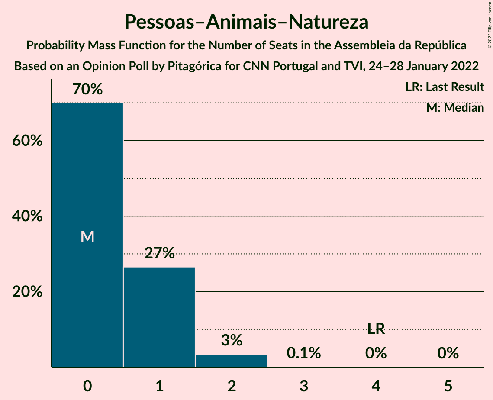

| Number of Seats | Probability | Accumulated | Special Marks |
|:---------------:|:-----------:|:-----------:|:-------------:|
| 0 | 70% | 100% | Median |
| 1 | 27% | 30% |  |
| 2 | 3% | 4% |  |
| 3 | 0.1% | 0.1% |  |
| 4 | 0% | 0% | Last Result |

## Coalitions

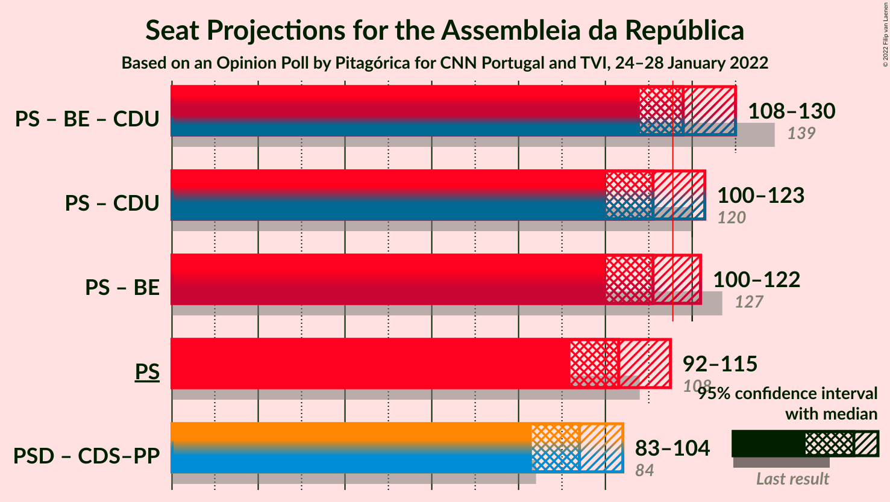

### Confidence Intervals

| Coalition | Last Result | Median | Majority? | 80% Confidence Interval | 90% Confidence Interval | 95% Confidence Interval | 99% Confidence Interval |
|:---------:|:-----------:|:------:|:---------:|:-----------------------:|:-----------------------:|:-----------------------:|:-----------------------:|
| Partido Socialista – Bloco de Esquerda – Coligação Democrática Unitária | 139 | 118 | 62% | 112–127 | 110–127 | 108–130 | 104–134 |
| Partido Socialista – Coligação Democrática Unitária | 120 | 111 | 19% | 105–120 | 102–120 | 100–123 | 97–126 |
| Partido Socialista – Bloco de Esquerda | 127 | 111 | 19% | 104–119 | 101–120 | 100–122 | 96–126 |
| Partido Socialista | 108 | 103 | 2% | 96–112 | 94–112 | 92–115 | 89–118 |
| Partido Social Democrata – CDS–Partido Popular | 84 | 94 | 0% | 86–100 | 85–103 | 83–104 | 80–107 |

### Partido Socialista – Bloco de Esquerda – Coligação Democrática Unitária

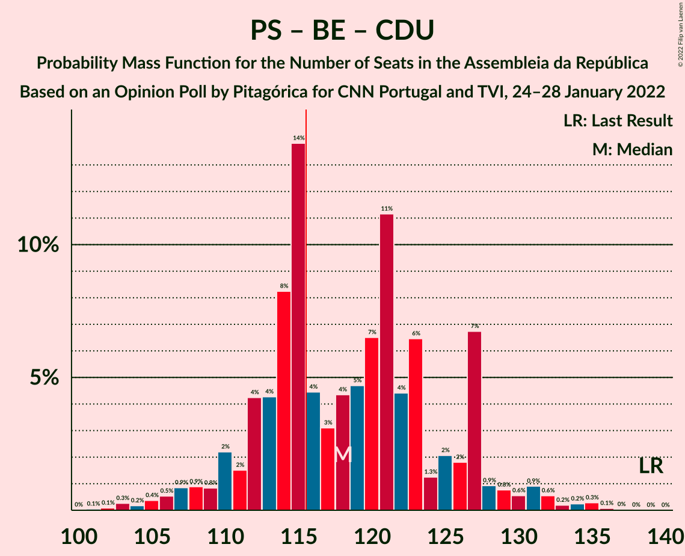

| Number of Seats | Probability | Accumulated | Special Marks |
|:---------------:|:-----------:|:-----------:|:-------------:|
| 101 | 0.1% | 100% |  |
| 102 | 0.1% | 99.9% |  |
| 103 | 0.3% | 99.8% |  |
| 104 | 0.2% | 99.6% |  |
| 105 | 0.4% | 99.4% |  |
| 106 | 0.5% | 99.0% |  |
| 107 | 0.9% | 98% |  |
| 108 | 0.9% | 98% |  |
| 109 | 0.8% | 97% |  |
| 110 | 2% | 96% |  |
| 111 | 2% | 94% |  |
| 112 | 4% | 92% |  |
| 113 | 4% | 88% |  |
| 114 | 8% | 84% |  |
| 115 | 14% | 75% |  |
| 116 | 4% | 62% | Majority |
| 117 | 3% | 57% |  |
| 118 | 4% | 54% | Median |
| 119 | 5% | 50% |  |
| 120 | 7% | 45% |  |
| 121 | 11% | 38% |  |
| 122 | 4% | 27% |  |
| 123 | 6% | 23% |  |
| 124 | 1.3% | 16% |  |
| 125 | 2% | 15% |  |
| 126 | 2% | 13% |  |
| 127 | 7% | 11% |  |
| 128 | 0.9% | 5% |  |
| 129 | 0.8% | 4% |  |
| 130 | 0.6% | 3% |  |
| 131 | 0.9% | 2% |  |
| 132 | 0.6% | 1.4% |  |
| 133 | 0.2% | 0.9% |  |
| 134 | 0.2% | 0.7% |  |
| 135 | 0.3% | 0.4% |  |
| 136 | 0.1% | 0.1% |  |
| 137 | 0% | 0.1% |  |
| 138 | 0% | 0% |  |
| 139 | 0% | 0% | Last Result |

### Partido Socialista – Coligação Democrática Unitária

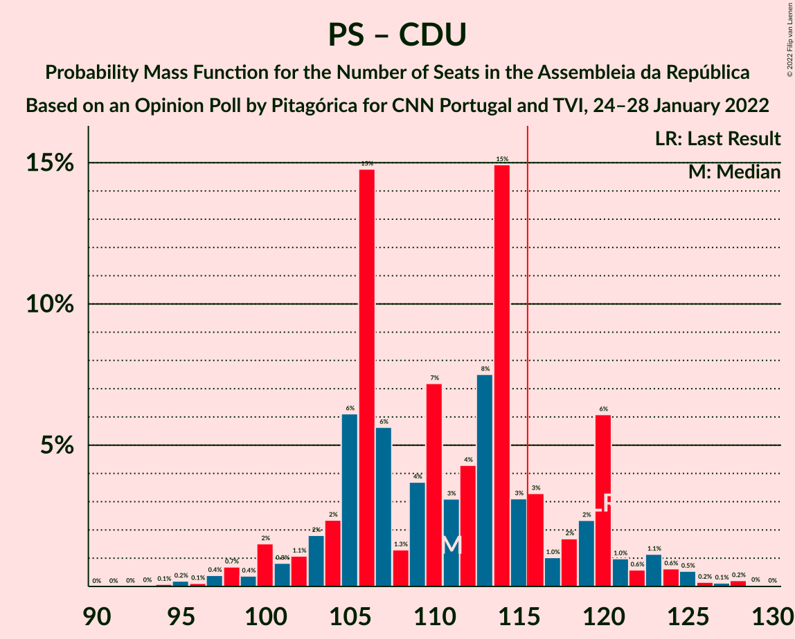

| Number of Seats | Probability | Accumulated | Special Marks |
|:---------------:|:-----------:|:-----------:|:-------------:|
| 93 | 0% | 100% |  |
| 94 | 0.1% | 99.9% |  |
| 95 | 0.2% | 99.9% |  |
| 96 | 0.1% | 99.7% |  |
| 97 | 0.4% | 99.6% |  |
| 98 | 0.7% | 99.2% |  |
| 99 | 0.4% | 98% |  |
| 100 | 2% | 98% |  |
| 101 | 0.8% | 97% |  |
| 102 | 1.1% | 96% |  |
| 103 | 2% | 95% |  |
| 104 | 2% | 93% |  |
| 105 | 6% | 91% |  |
| 106 | 15% | 84% |  |
| 107 | 6% | 70% |  |
| 108 | 1.3% | 64% |  |
| 109 | 4% | 63% |  |
| 110 | 7% | 59% |  |
| 111 | 3% | 52% | Median |
| 112 | 4% | 49% |  |
| 113 | 8% | 44% |  |
| 114 | 15% | 37% |  |
| 115 | 3% | 22% |  |
| 116 | 3% | 19% | Majority |
| 117 | 1.0% | 16% |  |
| 118 | 2% | 15% |  |
| 119 | 2% | 13% |  |
| 120 | 6% | 11% | Last Result |
| 121 | 1.0% | 4% |  |
| 122 | 0.6% | 3% |  |
| 123 | 1.1% | 3% |  |
| 124 | 0.6% | 2% |  |
| 125 | 0.5% | 1.1% |  |
| 126 | 0.2% | 0.6% |  |
| 127 | 0.1% | 0.4% |  |
| 128 | 0.2% | 0.3% |  |
| 129 | 0% | 0.1% |  |
| 130 | 0% | 0% |  |

### Partido Socialista – Bloco de Esquerda

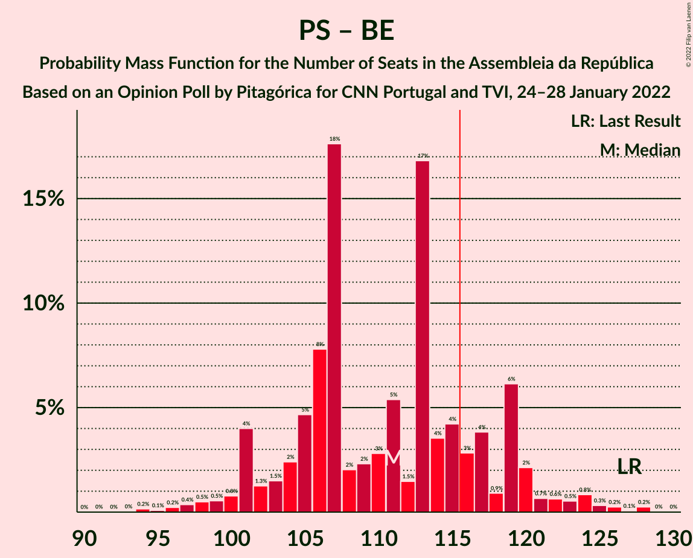

| Number of Seats | Probability | Accumulated | Special Marks |
|:---------------:|:-----------:|:-----------:|:-------------:|
| 92 | 0% | 100% |  |
| 93 | 0% | 99.9% |  |
| 94 | 0.2% | 99.9% |  |
| 95 | 0.1% | 99.8% |  |
| 96 | 0.2% | 99.7% |  |
| 97 | 0.4% | 99.4% |  |
| 98 | 0.5% | 99.1% |  |
| 99 | 0.5% | 98.6% |  |
| 100 | 0.8% | 98% |  |
| 101 | 4% | 97% |  |
| 102 | 1.3% | 93% |  |
| 103 | 1.5% | 92% |  |
| 104 | 2% | 91% |  |
| 105 | 5% | 88% |  |
| 106 | 8% | 83% |  |
| 107 | 18% | 76% |  |
| 108 | 2% | 58% |  |
| 109 | 2% | 56% |  |
| 110 | 3% | 54% | Median |
| 111 | 5% | 51% |  |
| 112 | 1.5% | 45% |  |
| 113 | 17% | 44% |  |
| 114 | 4% | 27% |  |
| 115 | 4% | 24% |  |
| 116 | 3% | 19% | Majority |
| 117 | 4% | 17% |  |
| 118 | 0.9% | 13% |  |
| 119 | 6% | 12% |  |
| 120 | 2% | 6% |  |
| 121 | 0.7% | 4% |  |
| 122 | 0.6% | 3% |  |
| 123 | 0.5% | 2% |  |
| 124 | 0.8% | 2% |  |
| 125 | 0.3% | 0.9% |  |
| 126 | 0.2% | 0.6% |  |
| 127 | 0.1% | 0.4% | Last Result |
| 128 | 0.2% | 0.3% |  |
| 129 | 0% | 0.1% |  |
| 130 | 0% | 0% |  |

### Partido Socialista

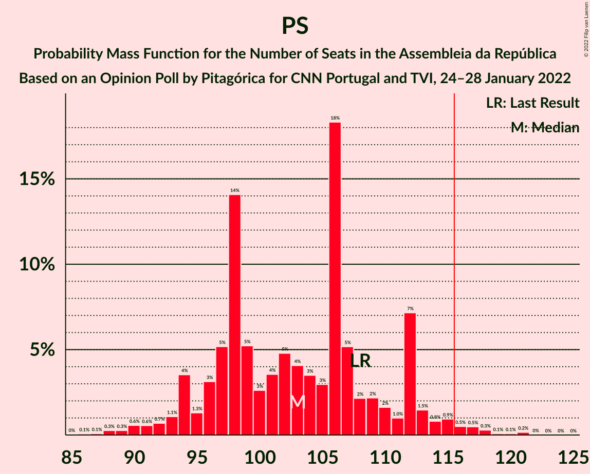

| Number of Seats | Probability | Accumulated | Special Marks |
|:---------------:|:-----------:|:-----------:|:-------------:|
| 85 | 0% | 100% |  |
| 86 | 0.1% | 99.9% |  |
| 87 | 0.1% | 99.9% |  |
| 88 | 0.3% | 99.8% |  |
| 89 | 0.3% | 99.5% |  |
| 90 | 0.6% | 99.3% |  |
| 91 | 0.6% | 98.7% |  |
| 92 | 0.7% | 98% |  |
| 93 | 1.1% | 97% |  |
| 94 | 4% | 96% |  |
| 95 | 1.3% | 93% |  |
| 96 | 3% | 92% |  |
| 97 | 5% | 88% |  |
| 98 | 14% | 83% |  |
| 99 | 5% | 69% |  |
| 100 | 3% | 64% |  |
| 101 | 4% | 61% |  |
| 102 | 5% | 58% |  |
| 103 | 4% | 53% | Median |
| 104 | 3% | 49% |  |
| 105 | 3% | 45% |  |
| 106 | 18% | 42% |  |
| 107 | 5% | 24% |  |
| 108 | 2% | 19% | Last Result |
| 109 | 2% | 17% |  |
| 110 | 2% | 15% |  |
| 111 | 1.0% | 13% |  |
| 112 | 7% | 12% |  |
| 113 | 1.5% | 5% |  |
| 114 | 0.8% | 3% |  |
| 115 | 0.9% | 3% |  |
| 116 | 0.5% | 2% | Majority |
| 117 | 0.5% | 1.1% |  |
| 118 | 0.3% | 0.6% |  |
| 119 | 0.1% | 0.3% |  |
| 120 | 0.1% | 0.3% |  |
| 121 | 0.2% | 0.2% |  |
| 122 | 0% | 0% |  |

### Partido Social Democrata – CDS–Partido Popular

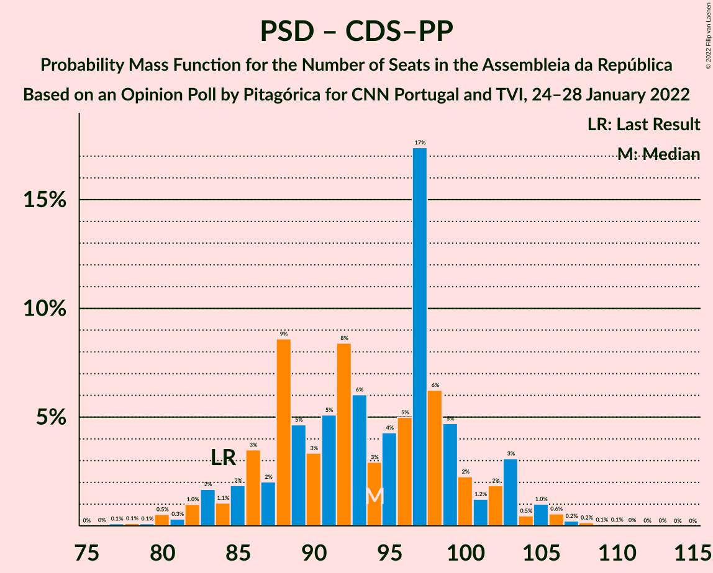

| Number of Seats | Probability | Accumulated | Special Marks |
|:---------------:|:-----------:|:-----------:|:-------------:|
| 76 | 0% | 100% |  |
| 77 | 0.1% | 99.9% |  |
| 78 | 0.1% | 99.8% |  |
| 79 | 0.1% | 99.7% |  |
| 80 | 0.5% | 99.6% |  |
| 81 | 0.3% | 99.1% |  |
| 82 | 1.0% | 98.8% |  |
| 83 | 2% | 98% |  |
| 84 | 1.1% | 96% | Last Result |
| 85 | 2% | 95% |  |
| 86 | 3% | 93% |  |
| 87 | 2% | 90% |  |
| 88 | 9% | 88% |  |
| 89 | 5% | 79% |  |
| 90 | 3% | 74% |  |
| 91 | 5% | 71% |  |
| 92 | 8% | 66% |  |
| 93 | 6% | 58% | Median |
| 94 | 3% | 52% |  |
| 95 | 4% | 49% |  |
| 96 | 5% | 44% |  |
| 97 | 17% | 39% |  |
| 98 | 6% | 22% |  |
| 99 | 5% | 16% |  |
| 100 | 2% | 11% |  |
| 101 | 1.2% | 9% |  |
| 102 | 2% | 8% |  |
| 103 | 3% | 6% |  |
| 104 | 0.5% | 3% |  |
| 105 | 1.0% | 2% |  |
| 106 | 0.6% | 1.1% |  |
| 107 | 0.2% | 0.5% |  |
| 108 | 0.2% | 0.3% |  |
| 109 | 0.1% | 0.2% |  |
| 110 | 0.1% | 0.1% |  |
| 111 | 0% | 0.1% |  |
| 112 | 0% | 0% |  |

## Technical Information

### Opinion Poll

+ **Polling firm:** Pitagórica
+ **Commissioner(s):** CNN Portugal and TVI
+ **Fieldwork period:** 24–28 January 2022

### Calculations

+ **Sample size:** 760
+ **Simulations done:** 1,048,576
+ **Error estimate:** 0.78%

