# Poll Average

<a href="#voting-intentions">Voting Intentions</a> | <a href="#seats">Seats</a> | <a href="#coalitions">Coalitions</a> | <a href="#technical-information">Technical Information</a>

## Summary

The table below lists the polls on which the average is based. They are the most recent polls (less than 90 days old) registered and analyzed so far.

| Period     | Polling firm/Commissioner(s) | PSD | CDS–PP | PS | BE | CDU | PAN | A |
|:----------:|:----------------------------:|:--:|:--:|:--:|:--:|:--:|:--:|:--:|
| 4 October 2015 | General Election | 36.9%   89 | 36.9%   18 | 32.3%   86 | 10.2%   19 | 8.2%   17 | 1.4%   1 | 0.0%   0 |
| N/A | Poll Average | 19–29%   53–79 | 3–8%   2–15 | 34–45%   99–132 | 8–16%   15–40 | 5–9%   6–20 | 2–9%   2–18 | 0–2%   0–2 |
| [18–28 July 2019](2019-07-28-Multidados.html) | Multidados   TVI | 18–23%   50–68 | 2–5%   2–6 | 32–39%   97–116 | 12–17%   28–44 | 4–7%   5–13 | 6–10%   10–22 | N/A   N/A |
| [12–15 July 2019](2019-07-15-Aximage.html) | Aximage   Correio da Manhã and Negócios | 20–27%   58–81 | 3–7%   4–12 | 34–41%   102–126 | 7–12%   15–27 | 5–9%   7–20 | 3–6%   3–9 | N/A   N/A |
| [8–14 July 2019](2019-07-14-Pitagórica.html) | Pitagórica   Jornal de Notícias | 19–25%   51–69 | 5–8%   6–15 | 40–47%   115–136 | 7–11%   15–24 | 5–9%   6–18 | 3–5%   2–6 | 1–2%   0–2 |
| [7–11 July 2019](2019-07-11-Eurosondagem.html) | Eurosondagem   Associação Mutualista Montepio | 21–26%   60–77 | 5–8%   7–18 | 34–40%   103–121 | 7–11%   15–24 | 5–9%   8–18 | 3–6%   4–9 | 1–2%   0–2 |
| [15–27 June 2019](2019-06-27-ICSISCTE.html) | ICS/ISCTE   Expresso and SIC Notícias | 20–26%   56–75 | 4–7%   4–11 | 35–41%   102–122 | 9–13%   18–29 | 6–10%   12–21 | 3–6%   3–8 | 0–1%   0 |
| [16–19 May 2019](2019-05-19-CESOP–UCP.html) | CESOP–UCP | 26–30%   70–82 | 6–8%   8–14 | 37–41%   101–114 | 8–10%   14–20 | 7–9%   13–18 | 2–4%   2–4 | 1–2%   0 |
| 4 October 2015 | General Election | 36.9%   89 | 36.9%   18 | 32.3%   86 | 10.2%   19 | 8.2%   17 | 1.4%   1 | 0.0%   0 |

Only polls for which at least the sample size has been published are included in the table above.

**Legend:**
+ **Top half of each row:** Voting intentions (95% confidence interval)
+ **Bottom half of each row:** Seat projections for the Assembleia da República (95% confidence interval)
+ **PSD:** Partido Social Democrata
+ **CDS–PP:** CDS–Partido Popular
+ **PS:** Partido Socialista
+ **BE:** Bloco de Esquerda
+ **CDU:** Coligação Democrática Unitária
+ **PAN:** Pessoas–Animais–Natureza
+ **A:** Aliança
+ **N/A (single party):** Party not included the published results
+ **N/A (entire row):** Calculation for this opinion poll not started yet

## Voting Intentions

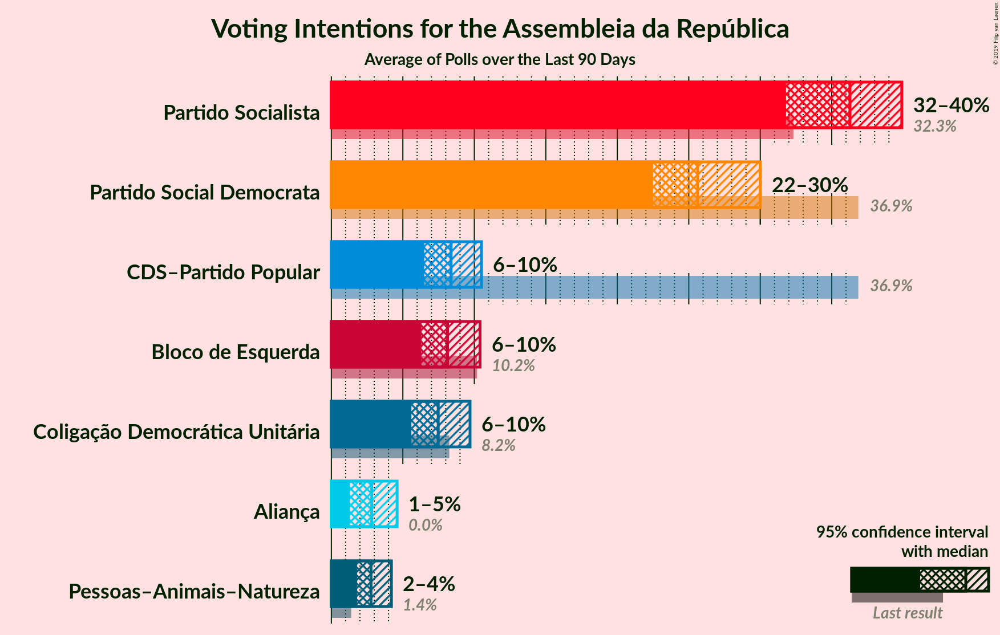

### Confidence Intervals

| Party | Last Result | Median | 80% Confidence Interval | 90% Confidence Interval | 95% Confidence Interval | 99% Confidence Interval |
|:-----:|:-----------:|:------:|:-----------------------:|:-----------------------:|:-----------------------:|:-----------------------:|
| <a href="#partido-social-democrata">Partido Social Democrata</a> | 36.9% | 23.1% | 20.1–27.8% |19.3–28.6% | 18.7–29.1% | 17.7–30.0% |
| <a href="#cds–partido-popular">CDS–Partido Popular</a> | 36.9% | 5.7% | 3.4–7.3% |3.0–7.6% | 2.7–7.9% | 2.3–8.4% |
| <a href="#partido-socialista">Partido Socialista</a> | 32.3% | 38.1% | 35.0–42.9% |34.2–44.2% | 33.5–45.1% | 32.3–46.6% |
| <a href="#bloco-de-esquerda">Bloco de Esquerda</a> | 10.2% | 9.7% | 8.3–14.5% |7.9–15.5% | 7.6–16.1% | 7.0–17.3% |
| <a href="#coligação-democrática-unitária">Coligação Democrática Unitária</a> | 8.2% | 7.1% | 5.5–8.6% |5.1–9.0% | 4.8–9.3% | 4.3–10.1% |
| <a href="#pessoas–animais–natureza">Pessoas–Animais–Natureza</a> | 1.4% | 4.1% | 2.9–7.7% |2.7–8.5% | 2.5–9.0% | 2.3–9.9% |
| <a href="#aliança">Aliança</a> | 0.0% | 1.1% | 0.3–1.8% |0.2–2.0% | 0.1–2.2% | 0.1–2.6% |

### Partido Social Democrata

*For a full overview of the results for this party, see the [Partido Social Democrata](party-partidosocialdemocrata.html) page.*

| Voting Intentions | Probability | Accumulated | Special Marks |
|:-----------------:|:-----------:|:-----------:|:-------------:|
| 15.5–16.5% | 0% | 100% |  |
| 16.5–17.5% | 0.3% | 100% |  |
| 17.5–18.5% | 2% | 99.6% |  |
| 18.5–19.5% | 4% | 98% |  |
| 19.5–20.5% | 8% | 94% |  |
| 20.5–21.5% | 12% | 86% |  |
| 21.5–22.5% | 15% | 74% |  |
| 22.5–23.5% | 16% | 58% | Median |
| 23.5–24.5% | 13% | 42% |  |
| 24.5–25.5% | 8% | 29% |  |
| 25.5–26.5% | 4% | 21% |  |
| 26.5–27.5% | 5% | 17% |  |
| 27.5–28.5% | 6% | 12% |  |
| 28.5–29.5% | 4% | 5% |  |
| 29.5–30.5% | 1.1% | 1.2% |  |
| 30.5–31.5% | 0.1% | 0.1% |  |
| 31.5–32.5% | 0% | 0% |  |
| 32.5–33.5% | 0% | 0% |  |
| 33.5–34.5% | 0% | 0% |  |
| 34.5–35.5% | 0% | 0% |  |
| 35.5–36.5% | 0% | 0% |  |
| 36.5–37.5% | 0% | 0% | Last Result |

### CDS–Partido Popular

*For a full overview of the results for this party, see the [CDS–Partido Popular](party-cds–partidopopular.html) page.*

| Voting Intentions | Probability | Accumulated | Special Marks |
|:-----------------:|:-----------:|:-----------:|:-------------:|
| 0.5–1.5% | 0% | 100% |  |
| 1.5–2.5% | 1.5% | 100% |  |
| 2.5–3.5% | 10% | 98.5% |  |
| 3.5–4.5% | 15% | 88% |  |
| 4.5–5.5% | 21% | 74% |  |
| 5.5–6.5% | 25% | 53% | Median |
| 6.5–7.5% | 21% | 27% |  |
| 7.5–8.5% | 6% | 6% |  |
| 8.5–9.5% | 0.3% | 0.3% |  |
| 9.5–10.5% | 0% | 0% |  |
| 10.5–11.5% | 0% | 0% |  |
| 11.5–12.5% | 0% | 0% |  |
| 12.5–13.5% | 0% | 0% |  |
| 13.5–14.5% | 0% | 0% |  |
| 14.5–15.5% | 0% | 0% |  |
| 15.5–16.5% | 0% | 0% |  |
| 16.5–17.5% | 0% | 0% |  |
| 17.5–18.5% | 0% | 0% |  |
| 18.5–19.5% | 0% | 0% |  |
| 19.5–20.5% | 0% | 0% |  |
| 20.5–21.5% | 0% | 0% |  |
| 21.5–22.5% | 0% | 0% |  |
| 22.5–23.5% | 0% | 0% |  |
| 23.5–24.5% | 0% | 0% |  |
| 24.5–25.5% | 0% | 0% |  |
| 25.5–26.5% | 0% | 0% |  |
| 26.5–27.5% | 0% | 0% |  |
| 27.5–28.5% | 0% | 0% |  |
| 28.5–29.5% | 0% | 0% |  |
| 29.5–30.5% | 0% | 0% |  |
| 30.5–31.5% | 0% | 0% |  |
| 31.5–32.5% | 0% | 0% |  |
| 32.5–33.5% | 0% | 0% |  |
| 33.5–34.5% | 0% | 0% |  |
| 34.5–35.5% | 0% | 0% |  |
| 35.5–36.5% | 0% | 0% |  |
| 36.5–37.5% | 0% | 0% | Last Result |

### Partido Socialista

*For a full overview of the results for this party, see the [Partido Socialista](party-partidosocialista.html) page.*

| Voting Intentions | Probability | Accumulated | Special Marks |
|:-----------------:|:-----------:|:-----------:|:-------------:|
| 29.5–30.5% | 0% | 100% |  |
| 30.5–31.5% | 0.1% | 100% |  |
| 31.5–32.5% | 0.6% | 99.8% | Last Result |
| 32.5–33.5% | 2% | 99.3% |  |
| 33.5–34.5% | 4% | 97% |  |
| 34.5–35.5% | 8% | 93% |  |
| 35.5–36.5% | 12% | 86% |  |
| 36.5–37.5% | 15% | 74% |  |
| 37.5–38.5% | 16% | 59% | Median |
| 38.5–39.5% | 14% | 43% |  |
| 39.5–40.5% | 9% | 28% |  |
| 40.5–41.5% | 5% | 20% |  |
| 41.5–42.5% | 4% | 15% |  |
| 42.5–43.5% | 4% | 11% |  |
| 43.5–44.5% | 3% | 7% |  |
| 44.5–45.5% | 2% | 4% |  |
| 45.5–46.5% | 1.1% | 2% |  |
| 46.5–47.5% | 0.4% | 0.5% |  |
| 47.5–48.5% | 0.1% | 0.1% |  |
| 48.5–49.5% | 0% | 0% |  |

### Bloco de Esquerda

*For a full overview of the results for this party, see the [Bloco de Esquerda](party-blocodeesquerda.html) page.*

| Voting Intentions | Probability | Accumulated | Special Marks |
|:-----------------:|:-----------:|:-----------:|:-------------:|
| 4.5–5.5% | 0% | 100% |  |
| 5.5–6.5% | 0.1% | 100% |  |
| 6.5–7.5% | 2% | 99.9% |  |
| 7.5–8.5% | 14% | 98% |  |
| 8.5–9.5% | 29% | 84% |  |
| 9.5–10.5% | 20% | 55% | Last Result, Median |
| 10.5–11.5% | 11% | 34% |  |
| 11.5–12.5% | 5% | 23% |  |
| 12.5–13.5% | 4% | 18% |  |
| 13.5–14.5% | 5% | 14% |  |
| 14.5–15.5% | 5% | 10% |  |
| 15.5–16.5% | 3% | 5% |  |
| 16.5–17.5% | 1.2% | 1.5% |  |
| 17.5–18.5% | 0.3% | 0.3% |  |
| 18.5–19.5% | 0% | 0% |  |

### Coligação Democrática Unitária

*For a full overview of the results for this party, see the [Coligação Democrática Unitária](party-coligaçãodemocráticaunitária.html) page.*

| Voting Intentions | Probability | Accumulated | Special Marks |
|:-----------------:|:-----------:|:-----------:|:-------------:|
| 2.5–3.5% | 0% | 100% |  |
| 3.5–4.5% | 1.2% | 100% |  |
| 4.5–5.5% | 9% | 98.8% |  |
| 5.5–6.5% | 23% | 90% |  |
| 6.5–7.5% | 30% | 67% | Median |
| 7.5–8.5% | 26% | 37% | Last Result |
| 8.5–9.5% | 9% | 11% |  |
| 9.5–10.5% | 1.4% | 2% |  |
| 10.5–11.5% | 0.2% | 0.2% |  |
| 11.5–12.5% | 0% | 0% |  |

### Pessoas–Animais–Natureza

*For a full overview of the results for this party, see the [Pessoas–Animais–Natureza](party-pessoas–animais–natureza.html) page.*

| Voting Intentions | Probability | Accumulated | Special Marks |
|:-----------------:|:-----------:|:-----------:|:-------------:|
| 0.5–1.5% | 0% | 100% | Last Result |
| 1.5–2.5% | 3% | 100% |  |
| 2.5–3.5% | 29% | 97% |  |
| 3.5–4.5% | 35% | 69% | Median |
| 4.5–5.5% | 15% | 34% |  |
| 5.5–6.5% | 3% | 19% |  |
| 6.5–7.5% | 5% | 16% |  |
| 7.5–8.5% | 7% | 11% |  |
| 8.5–9.5% | 4% | 4% |  |
| 9.5–10.5% | 0.8% | 0.9% |  |
| 10.5–11.5% | 0.1% | 0.1% |  |
| 11.5–12.5% | 0% | 0% |  |

### Aliança

*For a full overview of the results for this party, see the [Aliança](party-aliança.html) page.*

| Voting Intentions | Probability | Accumulated | Special Marks |
|:-----------------:|:-----------:|:-----------:|:-------------:|
| 0.0–0.5% | 21% | 100% | Last Result |
| 0.5–1.5% | 59% | 79% | Median |
| 1.5–2.5% | 20% | 21% |  |
| 2.5–3.5% | 0.6% | 0.6% |  |
| 3.5–4.5% | 0% | 0% |  |

## Seats

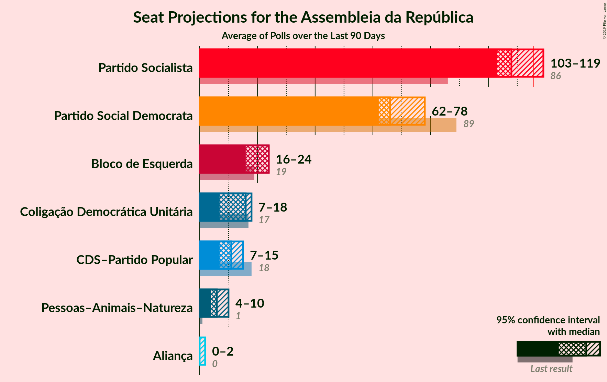

### Confidence Intervals

| Party | Last Result | Median | 80% Confidence Interval | 90% Confidence Interval | 95% Confidence Interval | 99% Confidence Interval |
|:-----:|:-----------:|:------:|:-----------------------:|:-----------------------:|:-----------------------:|:-----------------------:|
| <a href="#partido-social-democrata">Partido Social Democrata</a> | 89 | 66 | 55–76 |54–78 | 53–79 | 50–83 |
| <a href="#cds–partido-popular">CDS–Partido Popular</a> | 18 | 8 | 4–12 |2–13 | 2–15 | 2–18 |
| <a href="#partido-socialista">Partido Socialista</a> | 86 | 111 | 104–125 |102–129 | 99–132 | 97–136 |
| <a href="#bloco-de-esquerda">Bloco de Esquerda</a> | 19 | 20 | 17–36 |16–38 | 15–40 | 13–43 |
| <a href="#coligação-democrática-unitária">Coligação Democrática Unitária</a> | 17 | 14 | 9–18 |7–19 | 6–20 | 5–21 |
| <a href="#pessoas–animais–natureza">Pessoas–Animais–Natureza</a> | 1 | 6 | 3–16 |3–18 | 2–18 | 2–21 |
| <a href="#aliança">Aliança</a> | 0 | 0 | 0 |0–1 | 0–2 | 0–2 |

### Partido Social Democrata

*For a full overview of the results for this party, see the [Partido Social Democrata](party-partidosocialdemocrata.html) page.*

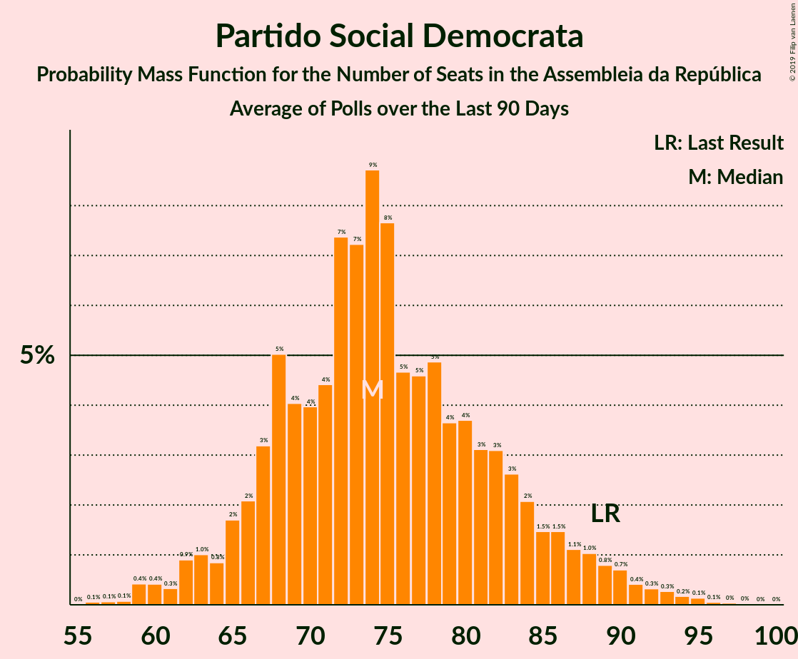

| Number of Seats | Probability | Accumulated | Special Marks |
|:---------------:|:-----------:|:-----------:|:-------------:|
| 47 | 0% | 100% |  |
| 48 | 0% | 99.9% |  |
| 49 | 0.1% | 99.9% |  |
| 50 | 0.5% | 99.8% |  |
| 51 | 0.9% | 99.3% |  |
| 52 | 0.9% | 98% |  |
| 53 | 2% | 98% |  |
| 54 | 3% | 96% |  |
| 55 | 3% | 93% |  |
| 56 | 4% | 90% |  |
| 57 | 3% | 86% |  |
| 58 | 3% | 83% |  |
| 59 | 5% | 79% |  |
| 60 | 5% | 74% |  |
| 61 | 4% | 70% |  |
| 62 | 3% | 66% |  |
| 63 | 3% | 63% |  |
| 64 | 3% | 59% |  |
| 65 | 4% | 57% |  |
| 66 | 4% | 53% | Median |
| 67 | 6% | 49% |  |
| 68 | 4% | 43% |  |
| 69 | 4% | 39% |  |
| 70 | 3% | 36% |  |
| 71 | 3% | 33% |  |
| 72 | 3% | 29% |  |
| 73 | 4% | 26% |  |
| 74 | 6% | 22% |  |
| 75 | 5% | 16% |  |
| 76 | 3% | 11% |  |
| 77 | 2% | 8% |  |
| 78 | 2% | 5% |  |
| 79 | 1.3% | 4% |  |
| 80 | 0.7% | 2% |  |
| 81 | 0.7% | 2% |  |
| 82 | 0.3% | 0.8% |  |
| 83 | 0.3% | 0.5% |  |
| 84 | 0.1% | 0.2% |  |
| 85 | 0.1% | 0.1% |  |
| 86 | 0% | 0.1% |  |
| 87 | 0% | 0% |  |
| 88 | 0% | 0% |  |
| 89 | 0% | 0% | Last Result |

### CDS–Partido Popular

*For a full overview of the results for this party, see the [CDS–Partido Popular](party-cds–partidopopular.html) page.*

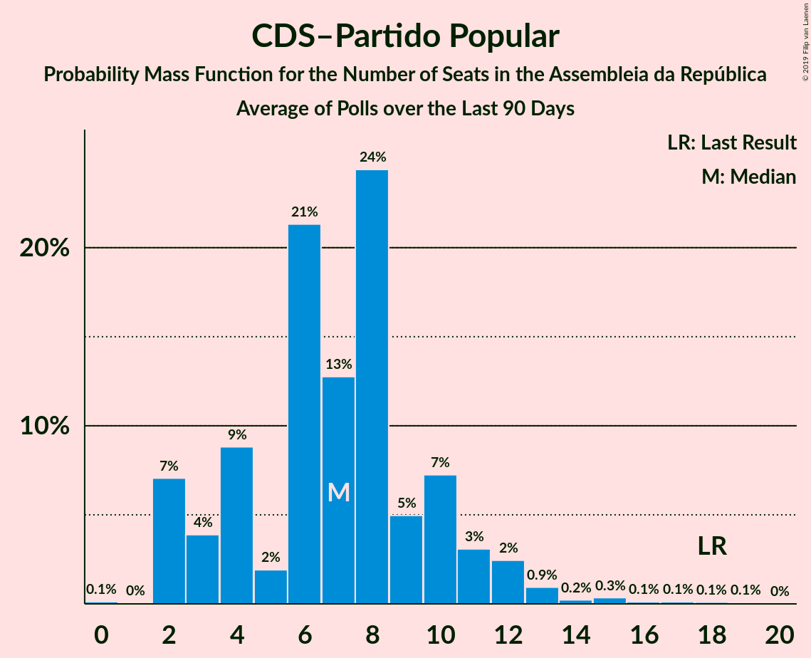

| Number of Seats | Probability | Accumulated | Special Marks |
|:---------------:|:-----------:|:-----------:|:-------------:|
| 0 | 0.1% | 100% |  |
| 1 | 0% | 99.9% |  |
| 2 | 6% | 99.9% |  |
| 3 | 3% | 94% |  |
| 4 | 7% | 91% |  |
| 5 | 1.4% | 84% |  |
| 6 | 12% | 82% |  |
| 7 | 9% | 70% |  |
| 8 | 17% | 61% | Median |
| 9 | 6% | 44% |  |
| 10 | 14% | 38% |  |
| 11 | 10% | 24% |  |
| 12 | 6% | 14% |  |
| 13 | 4% | 8% |  |
| 14 | 1.1% | 4% |  |
| 15 | 1.0% | 3% |  |
| 16 | 0.5% | 2% |  |
| 17 | 0.4% | 1.2% |  |
| 18 | 0.5% | 0.8% | Last Result |
| 19 | 0.2% | 0.3% |  |
| 20 | 0.1% | 0.1% |  |
| 21 | 0% | 0% |  |

### Partido Socialista

*For a full overview of the results for this party, see the [Partido Socialista](party-partidosocialista.html) page.*

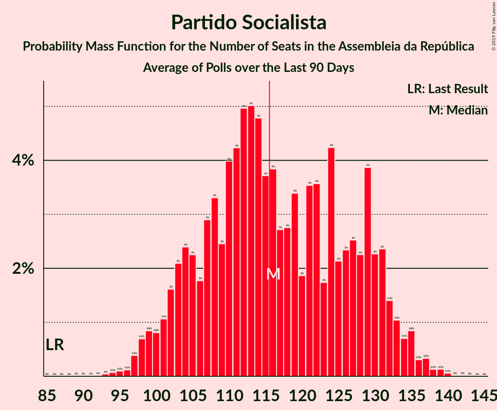

| Number of Seats | Probability | Accumulated | Special Marks |
|:---------------:|:-----------:|:-----------:|:-------------:|
| 86 | 0% | 100% | Last Result |
| 87 | 0% | 100% |  |
| 88 | 0% | 100% |  |
| 89 | 0% | 100% |  |
| 90 | 0% | 100% |  |
| 91 | 0% | 100% |  |
| 92 | 0% | 100% |  |
| 93 | 0% | 100% |  |
| 94 | 0.1% | 99.9% |  |
| 95 | 0.1% | 99.9% |  |
| 96 | 0.1% | 99.8% |  |
| 97 | 0.4% | 99.6% |  |
| 98 | 0.8% | 99.2% |  |
| 99 | 0.9% | 98% |  |
| 100 | 1.0% | 97% |  |
| 101 | 1.4% | 97% |  |
| 102 | 2% | 95% |  |
| 103 | 3% | 93% |  |
| 104 | 4% | 90% |  |
| 105 | 4% | 87% |  |
| 106 | 4% | 83% |  |
| 107 | 5% | 78% |  |
| 108 | 5% | 73% |  |
| 109 | 7% | 68% |  |
| 110 | 6% | 61% |  |
| 111 | 5% | 55% | Median |
| 112 | 6% | 49% |  |
| 113 | 5% | 44% |  |
| 114 | 4% | 38% |  |
| 115 | 4% | 34% |  |
| 116 | 3% | 30% | Majority |
| 117 | 3% | 27% |  |
| 118 | 2% | 24% |  |
| 119 | 2% | 22% |  |
| 120 | 2% | 19% |  |
| 121 | 1.3% | 17% |  |
| 122 | 2% | 16% |  |
| 123 | 1.4% | 14% |  |
| 124 | 1.2% | 13% |  |
| 125 | 2% | 12% |  |
| 126 | 2% | 10% |  |
| 127 | 1.2% | 8% |  |
| 128 | 2% | 7% |  |
| 129 | 1.5% | 6% |  |
| 130 | 1.0% | 4% |  |
| 131 | 0.7% | 3% |  |
| 132 | 0.8% | 3% |  |
| 133 | 0.5% | 2% |  |
| 134 | 0.3% | 1.2% |  |
| 135 | 0.3% | 0.9% |  |
| 136 | 0.2% | 0.6% |  |
| 137 | 0.2% | 0.3% |  |
| 138 | 0.1% | 0.2% |  |
| 139 | 0% | 0.1% |  |
| 140 | 0% | 0.1% |  |
| 141 | 0% | 0% |  |

### Bloco de Esquerda

*For a full overview of the results for this party, see the [Bloco de Esquerda](party-blocodeesquerda.html) page.*

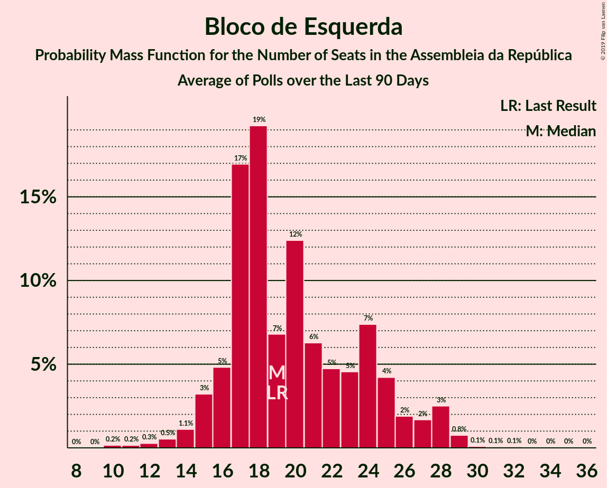

| Number of Seats | Probability | Accumulated | Special Marks |
|:---------------:|:-----------:|:-----------:|:-------------:|
| 10 | 0.1% | 100% |  |
| 11 | 0.1% | 99.9% |  |
| 12 | 0.2% | 99.7% |  |
| 13 | 0.4% | 99.5% |  |
| 14 | 0.9% | 99.1% |  |
| 15 | 3% | 98% |  |
| 16 | 4% | 95% |  |
| 17 | 14% | 91% |  |
| 18 | 16% | 77% |  |
| 19 | 6% | 61% | Last Result |
| 20 | 10% | 56% | Median |
| 21 | 5% | 45% |  |
| 22 | 4% | 40% |  |
| 23 | 4% | 36% |  |
| 24 | 6% | 32% |  |
| 25 | 4% | 26% |  |
| 26 | 2% | 23% |  |
| 27 | 1.5% | 21% |  |
| 28 | 3% | 19% |  |
| 29 | 1.2% | 16% |  |
| 30 | 0.6% | 15% |  |
| 31 | 0.7% | 14% |  |
| 32 | 0.5% | 14% |  |
| 33 | 0.6% | 13% |  |
| 34 | 0.7% | 13% |  |
| 35 | 0.9% | 12% |  |
| 36 | 2% | 11% |  |
| 37 | 0.6% | 9% |  |
| 38 | 4% | 9% |  |
| 39 | 1.1% | 5% |  |
| 40 | 2% | 4% |  |
| 41 | 0.9% | 2% |  |
| 42 | 0.4% | 1.0% |  |
| 43 | 0.2% | 0.6% |  |
| 44 | 0.1% | 0.4% |  |
| 45 | 0.1% | 0.3% |  |
| 46 | 0.1% | 0.2% |  |
| 47 | 0.1% | 0.2% |  |
| 48 | 0% | 0.1% |  |
| 49 | 0% | 0.1% |  |
| 50 | 0% | 0% |  |

### Coligação Democrática Unitária

*For a full overview of the results for this party, see the [Coligação Democrática Unitária](party-coligaçãodemocráticaunitária.html) page.*

| Number of Seats | Probability | Accumulated | Special Marks |
|:---------------:|:-----------:|:-----------:|:-------------:|
| 4 | 0.1% | 100% |  |
| 5 | 1.1% | 99.9% |  |
| 6 | 1.5% | 98.8% |  |
| 7 | 3% | 97% |  |
| 8 | 4% | 94% |  |
| 9 | 8% | 90% |  |
| 10 | 4% | 82% |  |
| 11 | 3% | 78% |  |
| 12 | 4% | 75% |  |
| 13 | 14% | 72% |  |
| 14 | 24% | 58% | Median |
| 15 | 5% | 34% |  |
| 16 | 5% | 29% |  |
| 17 | 14% | 24% | Last Result |
| 18 | 5% | 11% |  |
| 19 | 3% | 6% |  |
| 20 | 2% | 3% |  |
| 21 | 0.4% | 0.8% |  |
| 22 | 0.2% | 0.3% |  |
| 23 | 0.1% | 0.2% |  |
| 24 | 0.1% | 0.1% |  |
| 25 | 0% | 0% |  |

### Pessoas–Animais–Natureza

*For a full overview of the results for this party, see the [Pessoas–Animais–Natureza](party-pessoas–animais–natureza.html) page.*

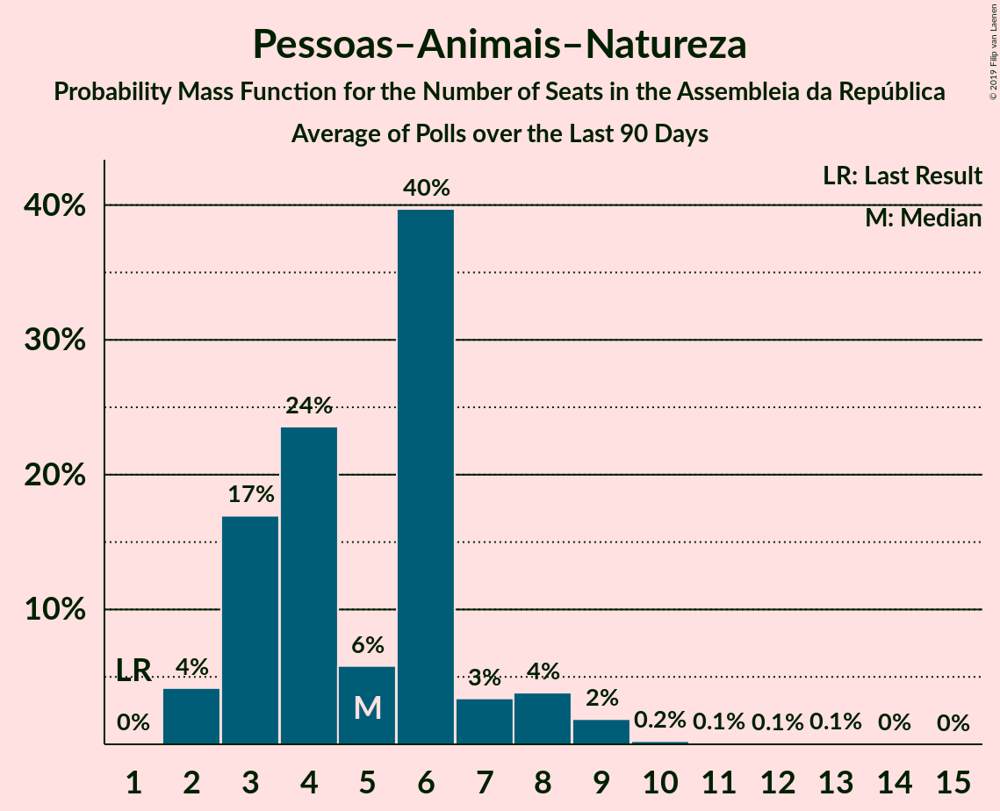

| Number of Seats | Probability | Accumulated | Special Marks |
|:---------------:|:-----------:|:-----------:|:-------------:|
| 1 | 0% | 100% | Last Result |
| 2 | 3% | 100% |  |
| 3 | 14% | 97% |  |
| 4 | 22% | 82% |  |
| 5 | 5% | 60% |  |
| 6 | 32% | 55% | Median |
| 7 | 2% | 24% |  |
| 8 | 3% | 21% |  |
| 9 | 2% | 18% |  |
| 10 | 0.4% | 17% |  |
| 11 | 0.3% | 16% |  |
| 12 | 0.4% | 16% |  |
| 13 | 0.9% | 16% |  |
| 14 | 2% | 15% |  |
| 15 | 2% | 13% |  |
| 16 | 2% | 11% |  |
| 17 | 4% | 9% |  |
| 18 | 3% | 5% |  |
| 19 | 0.6% | 2% |  |
| 20 | 0.5% | 1.2% |  |
| 21 | 0.3% | 0.7% |  |
| 22 | 0.3% | 0.5% |  |
| 23 | 0% | 0.1% |  |
| 24 | 0% | 0.1% |  |
| 25 | 0% | 0% |  |

### Aliança

*For a full overview of the results for this party, see the [Aliança](party-aliança.html) page.*

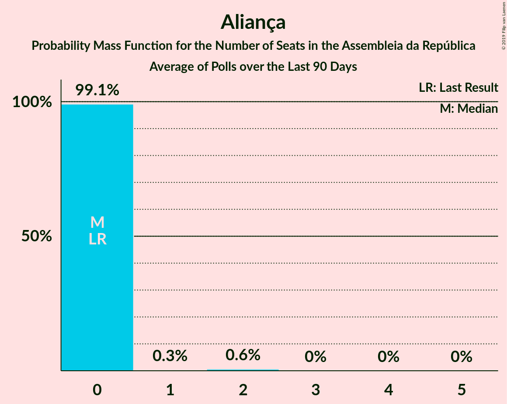

| Number of Seats | Probability | Accumulated | Special Marks |
|:---------------:|:-----------:|:-----------:|:-------------:|
| 0 | 95% | 100% | Last Result, Median |
| 1 | 1.3% | 5% |  |
| 2 | 4% | 4% |  |
| 3 | 0% | 0% |  |

## Coalitions

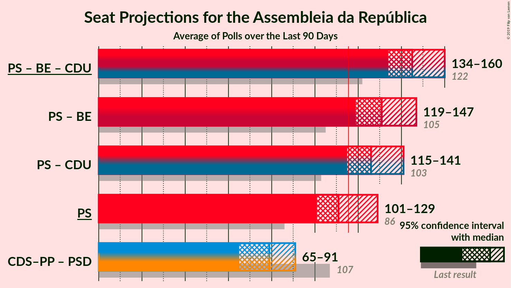

### Confidence Intervals

| Coalition | Last Result | Median | Majority? | 80% Confidence Interval | 90% Confidence Interval | 95% Confidence Interval | 99% Confidence Interval |
|:---------:|:-----------:|:------:|:---------:|:-----------------------:|:-----------------------:|:-----------------------:|:-----------------------:|
| Partido Socialista – Bloco de Esquerda – Coligação Democrática Unitária | 122 | 149 | 100% | 140–159 | 138–161 | 136–163 | 133–166 |
| Partido Socialista – Bloco de Esquerda | 105 | 135 | 99.9% | 125–147 | 123–149 | 121–151 | 118–155 |
| Partido Socialista – Coligação Democrática Unitária | 103 | 126 | 91% | 116–139 | 112–142 | 110–143 | 106–147 |
| Partido Socialista | 86 | 111 | 30% | 104–125 | 102–129 | 99–132 | 97–136 |
| CDS–Partido Popular – Partido Social Democrata | 107 | 74 | 0% | 61–86 | 58–88 | 57–90 | 54–93 |

### Partido Socialista – Bloco de Esquerda – Coligação Democrática Unitária

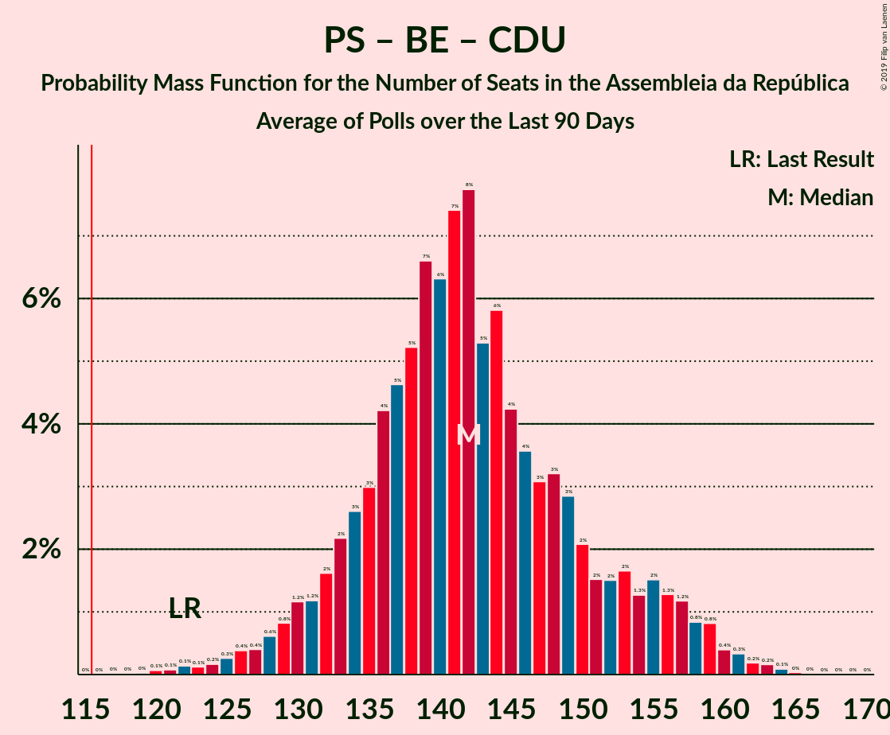

| Number of Seats | Probability | Accumulated | Special Marks |
|:---------------:|:-----------:|:-----------:|:-------------:|
| 122 | 0% | 100% | Last Result |
| 123 | 0% | 100% |  |
| 124 | 0% | 100% |  |
| 125 | 0% | 100% |  |
| 126 | 0% | 100% |  |
| 127 | 0% | 100% |  |
| 128 | 0% | 100% |  |
| 129 | 0% | 100% |  |
| 130 | 0% | 99.9% |  |
| 131 | 0.1% | 99.9% |  |
| 132 | 0.2% | 99.8% |  |
| 133 | 0.2% | 99.7% |  |
| 134 | 0.5% | 99.4% |  |
| 135 | 0.7% | 98.9% |  |
| 136 | 1.3% | 98% |  |
| 137 | 2% | 97% |  |
| 138 | 2% | 95% |  |
| 139 | 3% | 93% |  |
| 140 | 4% | 90% |  |
| 141 | 5% | 86% |  |
| 142 | 5% | 81% |  |
| 143 | 4% | 76% |  |
| 144 | 5% | 72% |  |
| 145 | 4% | 68% | Median |
| 146 | 4% | 64% |  |
| 147 | 4% | 60% |  |
| 148 | 4% | 55% |  |
| 149 | 4% | 51% |  |
| 150 | 4% | 47% |  |
| 151 | 5% | 43% |  |
| 152 | 4% | 38% |  |
| 153 | 4% | 34% |  |
| 154 | 4% | 30% |  |
| 155 | 4% | 26% |  |
| 156 | 4% | 22% |  |
| 157 | 4% | 18% |  |
| 158 | 3% | 14% |  |
| 159 | 3% | 11% |  |
| 160 | 2% | 8% |  |
| 161 | 2% | 6% |  |
| 162 | 2% | 4% |  |
| 163 | 0.7% | 3% |  |
| 164 | 0.8% | 2% |  |
| 165 | 0.5% | 1.1% |  |
| 166 | 0.4% | 0.6% |  |
| 167 | 0.1% | 0.2% |  |
| 168 | 0% | 0.1% |  |
| 169 | 0% | 0% |  |

### Partido Socialista – Bloco de Esquerda

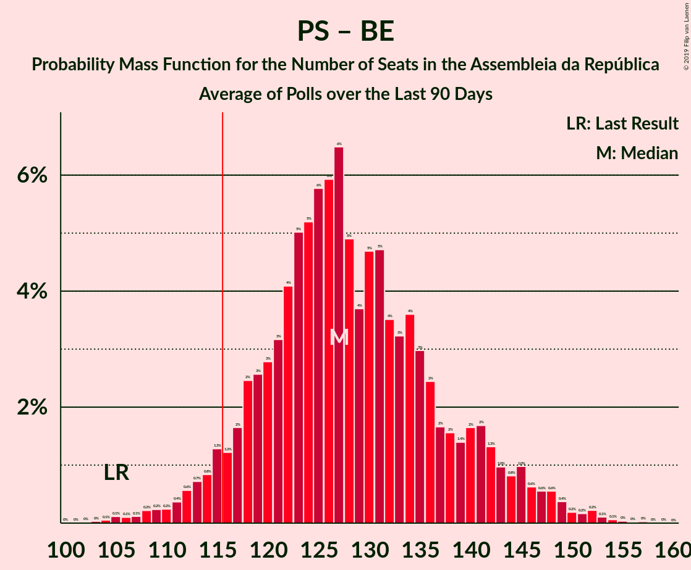

| Number of Seats | Probability | Accumulated | Special Marks |
|:---------------:|:-----------:|:-----------:|:-------------:|
| 105 | 0% | 100% | Last Result |
| 106 | 0% | 100% |  |
| 107 | 0% | 100% |  |
| 108 | 0% | 100% |  |
| 109 | 0% | 100% |  |
| 110 | 0% | 100% |  |
| 111 | 0% | 100% |  |
| 112 | 0% | 100% |  |
| 113 | 0% | 100% |  |
| 114 | 0% | 100% |  |
| 115 | 0.1% | 100% |  |
| 116 | 0.1% | 99.9% | Majority |
| 117 | 0.2% | 99.8% |  |
| 118 | 0.3% | 99.7% |  |
| 119 | 0.6% | 99.4% |  |
| 120 | 0.7% | 98.7% |  |
| 121 | 1.4% | 98% |  |
| 122 | 1.5% | 97% |  |
| 123 | 3% | 95% |  |
| 124 | 3% | 93% |  |
| 125 | 4% | 90% |  |
| 126 | 4% | 86% |  |
| 127 | 4% | 82% |  |
| 128 | 3% | 78% |  |
| 129 | 3% | 74% |  |
| 130 | 3% | 71% |  |
| 131 | 4% | 68% | Median |
| 132 | 3% | 64% |  |
| 133 | 4% | 60% |  |
| 134 | 4% | 57% |  |
| 135 | 4% | 53% |  |
| 136 | 4% | 48% |  |
| 137 | 3% | 45% |  |
| 138 | 4% | 41% |  |
| 139 | 4% | 37% |  |
| 140 | 4% | 34% |  |
| 141 | 3% | 30% |  |
| 142 | 4% | 27% |  |
| 143 | 4% | 23% |  |
| 144 | 4% | 20% |  |
| 145 | 3% | 16% |  |
| 146 | 2% | 13% |  |
| 147 | 2% | 11% |  |
| 148 | 2% | 8% |  |
| 149 | 2% | 6% |  |
| 150 | 1.3% | 5% |  |
| 151 | 1.0% | 3% |  |
| 152 | 0.7% | 2% |  |
| 153 | 0.8% | 2% |  |
| 154 | 0.5% | 1.0% |  |
| 155 | 0.2% | 0.5% |  |
| 156 | 0.1% | 0.4% |  |
| 157 | 0.1% | 0.2% |  |
| 158 | 0.1% | 0.1% |  |
| 159 | 0% | 0.1% |  |
| 160 | 0% | 0% |  |

### Partido Socialista – Coligação Democrática Unitária

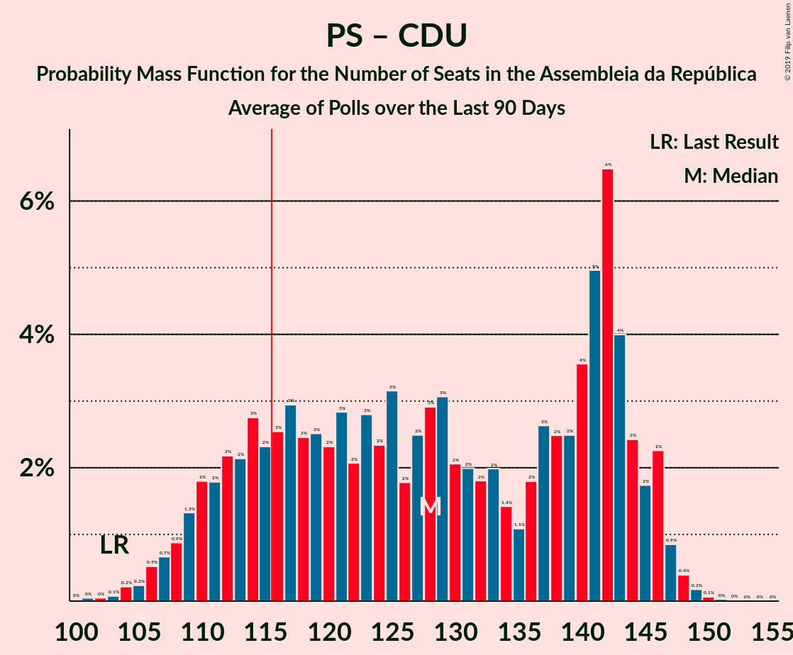

| Number of Seats | Probability | Accumulated | Special Marks |
|:---------------:|:-----------:|:-----------:|:-------------:|
| 102 | 0% | 100% |  |
| 103 | 0% | 99.9% | Last Result |
| 104 | 0.1% | 99.9% |  |
| 105 | 0.1% | 99.8% |  |
| 106 | 0.3% | 99.7% |  |
| 107 | 0.3% | 99.4% |  |
| 108 | 0.4% | 99.1% |  |
| 109 | 0.7% | 98.6% |  |
| 110 | 0.9% | 98% |  |
| 111 | 0.9% | 97% |  |
| 112 | 1.2% | 96% |  |
| 113 | 1.2% | 95% |  |
| 114 | 2% | 94% |  |
| 115 | 1.5% | 92% |  |
| 116 | 2% | 91% | Majority |
| 117 | 3% | 89% |  |
| 118 | 3% | 86% |  |
| 119 | 3% | 84% |  |
| 120 | 4% | 81% |  |
| 121 | 4% | 77% |  |
| 122 | 4% | 73% |  |
| 123 | 6% | 68% |  |
| 124 | 6% | 62% |  |
| 125 | 5% | 56% | Median |
| 126 | 5% | 50% |  |
| 127 | 5% | 45% |  |
| 128 | 4% | 40% |  |
| 129 | 4% | 36% |  |
| 130 | 3% | 31% |  |
| 131 | 3% | 28% |  |
| 132 | 3% | 25% |  |
| 133 | 3% | 23% |  |
| 134 | 2% | 20% |  |
| 135 | 2% | 18% |  |
| 136 | 2% | 16% |  |
| 137 | 2% | 14% |  |
| 138 | 2% | 12% |  |
| 139 | 2% | 10% |  |
| 140 | 2% | 8% |  |
| 141 | 1.3% | 6% |  |
| 142 | 2% | 5% |  |
| 143 | 1.0% | 3% |  |
| 144 | 0.7% | 2% |  |
| 145 | 0.6% | 2% |  |
| 146 | 0.4% | 1.0% |  |
| 147 | 0.2% | 0.6% |  |
| 148 | 0.2% | 0.3% |  |
| 149 | 0.1% | 0.2% |  |
| 150 | 0% | 0.1% |  |
| 151 | 0% | 0% |  |

### Partido Socialista

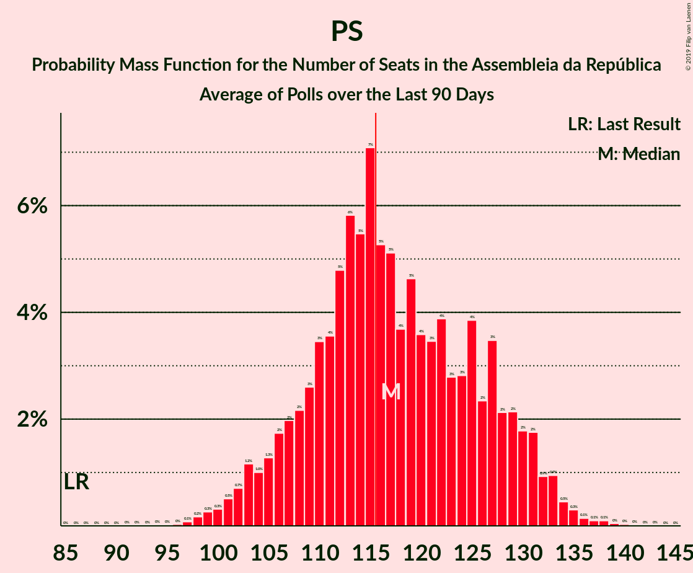

| Number of Seats | Probability | Accumulated | Special Marks |
|:---------------:|:-----------:|:-----------:|:-------------:|
| 86 | 0% | 100% | Last Result |
| 87 | 0% | 100% |  |
| 88 | 0% | 100% |  |
| 89 | 0% | 100% |  |
| 90 | 0% | 100% |  |
| 91 | 0% | 100% |  |
| 92 | 0% | 100% |  |
| 93 | 0% | 100% |  |
| 94 | 0.1% | 99.9% |  |
| 95 | 0.1% | 99.9% |  |
| 96 | 0.1% | 99.8% |  |
| 97 | 0.4% | 99.6% |  |
| 98 | 0.8% | 99.2% |  |
| 99 | 0.9% | 98% |  |
| 100 | 1.0% | 97% |  |
| 101 | 1.4% | 97% |  |
| 102 | 2% | 95% |  |
| 103 | 3% | 93% |  |
| 104 | 4% | 90% |  |
| 105 | 4% | 87% |  |
| 106 | 4% | 83% |  |
| 107 | 5% | 78% |  |
| 108 | 5% | 73% |  |
| 109 | 7% | 68% |  |
| 110 | 6% | 61% |  |
| 111 | 5% | 55% | Median |
| 112 | 6% | 49% |  |
| 113 | 5% | 44% |  |
| 114 | 4% | 38% |  |
| 115 | 4% | 34% |  |
| 116 | 3% | 30% | Majority |
| 117 | 3% | 27% |  |
| 118 | 2% | 24% |  |
| 119 | 2% | 22% |  |
| 120 | 2% | 19% |  |
| 121 | 1.3% | 17% |  |
| 122 | 2% | 16% |  |
| 123 | 1.4% | 14% |  |
| 124 | 1.2% | 13% |  |
| 125 | 2% | 12% |  |
| 126 | 2% | 10% |  |
| 127 | 1.2% | 8% |  |
| 128 | 2% | 7% |  |
| 129 | 1.5% | 6% |  |
| 130 | 1.0% | 4% |  |
| 131 | 0.7% | 3% |  |
| 132 | 0.8% | 3% |  |
| 133 | 0.5% | 2% |  |
| 134 | 0.3% | 1.2% |  |
| 135 | 0.3% | 0.9% |  |
| 136 | 0.2% | 0.6% |  |
| 137 | 0.2% | 0.3% |  |
| 138 | 0.1% | 0.2% |  |
| 139 | 0% | 0.1% |  |
| 140 | 0% | 0.1% |  |
| 141 | 0% | 0% |  |

### CDS–Partido Popular – Partido Social Democrata

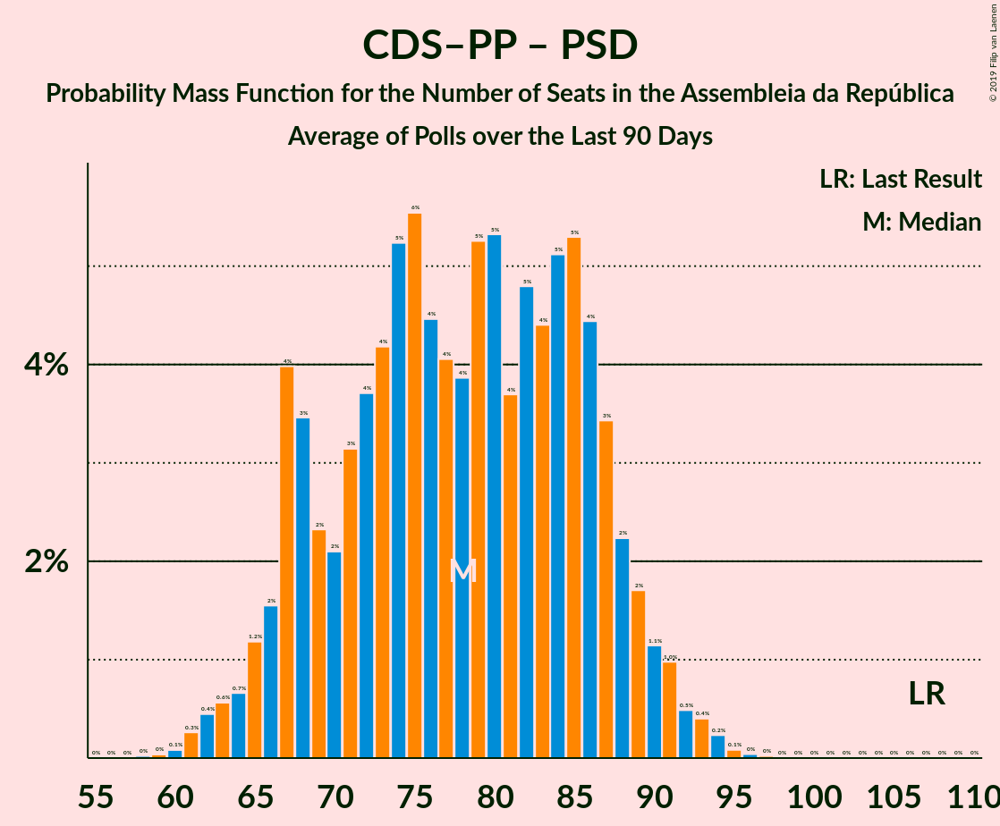

| Number of Seats | Probability | Accumulated | Special Marks |
|:---------------:|:-----------:|:-----------:|:-------------:|
| 51 | 0% | 100% |  |
| 52 | 0.1% | 99.9% |  |
| 53 | 0.3% | 99.8% |  |
| 54 | 0.5% | 99.5% |  |
| 55 | 0.5% | 99.1% |  |
| 56 | 0.7% | 98.6% |  |
| 57 | 1.5% | 98% |  |
| 58 | 2% | 96% |  |
| 59 | 1.5% | 95% |  |
| 60 | 2% | 93% |  |
| 61 | 2% | 91% |  |
| 62 | 2% | 89% |  |
| 63 | 2% | 87% |  |
| 64 | 3% | 85% |  |
| 65 | 3% | 82% |  |
| 66 | 3% | 79% |  |
| 67 | 5% | 76% |  |
| 68 | 3% | 71% |  |
| 69 | 3% | 68% |  |
| 70 | 2% | 65% |  |
| 71 | 3% | 63% |  |
| 72 | 3% | 60% |  |
| 73 | 3% | 57% |  |
| 74 | 4% | 54% | Median |
| 75 | 3% | 50% |  |
| 76 | 3% | 46% |  |
| 77 | 4% | 43% |  |
| 78 | 3% | 39% |  |
| 79 | 3% | 36% |  |
| 80 | 3% | 33% |  |
| 81 | 3% | 30% |  |
| 82 | 3% | 27% |  |
| 83 | 3% | 24% |  |
| 84 | 4% | 20% |  |
| 85 | 4% | 16% |  |
| 86 | 4% | 12% |  |
| 87 | 3% | 9% |  |
| 88 | 2% | 6% |  |
| 89 | 1.3% | 4% |  |
| 90 | 0.9% | 3% |  |
| 91 | 0.8% | 2% |  |
| 92 | 0.4% | 1.0% |  |
| 93 | 0.3% | 0.6% |  |
| 94 | 0.2% | 0.3% |  |
| 95 | 0.1% | 0.1% |  |
| 96 | 0% | 0.1% |  |
| 97 | 0% | 0% |  |
| 98 | 0% | 0% |  |
| 99 | 0% | 0% |  |
| 100 | 0% | 0% |  |
| 101 | 0% | 0% |  |
| 102 | 0% | 0% |  |
| 103 | 0% | 0% |  |
| 104 | 0% | 0% |  |
| 105 | 0% | 0% |  |
| 106 | 0% | 0% |  |
| 107 | 0% | 0% | Last Result |

## Technical Information

+ **Number of polls included in this average:** 6
+ **Lowest number of simulations done in a poll included in this average:** 1,048,576
+ **Total number of simulations done in the polls included in this average:** 6,291,456
+ **Error estimate:** 1.05%
