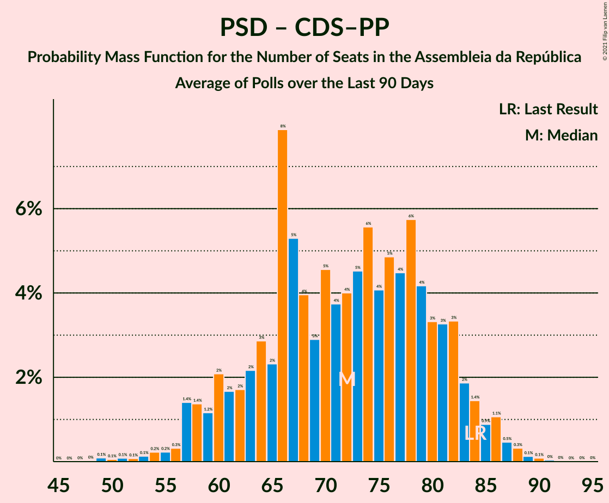

# Poll Average

<a href="#voting-intentions">Voting Intentions</a> | <a href="#seats">Seats</a> | <a href="#coalitions">Coalitions</a> | <a href="#technical-information">Technical Information</a>

## Summary

The table below lists the polls on which the average is based. They are the most recent polls (less than 90 days old) registered and analyzed so far.

| Period     | Polling firm/Commissioner(s) | PS | PSD | BE | CDU | CDS–PP | PAN | CH | IL | L | A |
|:----------:|:----------------------------:|:--:|:--:|:--:|:--:|:--:|:--:|:--:|:--:|:--:|:--:|
| 6 October 2019 | General Election | 36.4%   108 | 27.8%   79 | 9.5%   19 | 6.3%   12 | 4.2%   5 | 3.3%   4 | 1.3%   1 | 1.3%   1 | 1.1%   1 | 0.8%   0 |
| N/A | Poll Average | 33–42%   95–123 | 23–34%   61–96 | 4–10%   5–21 | 4–7%   4–14 | 0–3%   0–2 | 1–5%   0–6 | 4–12%   4–25 | 2–8%   1–14 | 0–2%   0–1 | N/A   N/A |
| [7–14 December 2021](2021-12-14-Intercampus.html) | Intercampus   CMTV and Correio da Manhã | 32–39%   91–114 | 23–31%   66–88 | 5–9%   7–17 | 3–6%   3–11 | 1–3%   0–2 | 2–5%   2–8 | 7–12%   11–26 | 5–9%   6–15 | 0–2%   0–1 | N/A   N/A |
| [10–15 November 2021](2021-11-15-Pitagórica.html) | Pitagórica   CNN Portugal and TVI | 35–42%   94–118 | 29–36%   77–100 | 4–8%   4–13 | 4–7%   5–15 | 0–2%   0 | 1–3%   0–4 | 5–9%   8–18 | 3–6%   3–10 | N/A   N/A | N/A   N/A |
| [29 October–4 November 2021](2021-11-04-CESOP–UCP.html) | CESOP–UCP | 36–42%   99–119 | 27–33%   73–92 | 5–9%   7–17 | 4–7%   5–13 | 1–3%   0–2 | 2–4%   1–5 | 4–7%   3–11 | 4–7%   4–12 | N/A   N/A | N/A   N/A |
| [21 October–1 November 2021](2021-11-01-ICSISCTE.html) | ICS/ISCTE   Expresso and SIC Notícias | 37–43%   105–126 | 23–29%   62–81 | 4–7%   3–11 | 5–8%   6–16 | 1–2%   0–1 | 1–3%   0–3 | 8–12%   14–27 | 1–3%   1–4 | N/A   N/A | N/A   N/A |
| [28–31 October 2021](2021-10-31-Aximage.html) | Aximage   Diário de Notícias, Jornal de Notícias and TSF Rádio Notícias | 35–42%   103–125 | 22–28%   57–77 | 7–11%   13–23 | 3–6%   4–10 | 1–3%   0–2 | 2–4%   1–5 | 6–10%   10–20 | 3–6%   4–12 | N/A   N/A | N/A   N/A |
| 6 October 2019 | General Election | 36.4%   108 | 27.8%   79 | 9.5%   19 | 6.3%   12 | 4.2%   5 | 3.3%   4 | 1.3%   1 | 1.3%   1 | 1.1%   1 | 0.8%   0 |

Only polls for which at least the sample size has been published are included in the table above.

**Legend:**
+ **Top half of each row:** Voting intentions (95% confidence interval)
+ **Bottom half of each row:** Seat projections for the Assembleia da República (95% confidence interval)
+ **PS:** Partido Socialista
+ **PSD:** Partido Social Democrata
+ **BE:** Bloco de Esquerda
+ **CDU:** Coligação Democrática Unitária
+ **CDS–PP:** CDS–Partido Popular
+ **PAN:** Pessoas–Animais–Natureza
+ **CH:** Chega
+ **IL:** Iniciativa Liberal
+ **L:** LIVRE
+ **A:** Aliança
+ **N/A (single party):** Party not included the published results
+ **N/A (entire row):** Calculation for this opinion poll not started yet

## Voting Intentions

### Confidence Intervals

| Party | Last Result | Median | 80% Confidence Interval | 90% Confidence Interval | 95% Confidence Interval | 99% Confidence Interval |
|:-----:|:-----------:|:------:|:-----------------------:|:-----------------------:|:-----------------------:|:-----------------------:|
| <a href="#partido-socialista">Partido Socialista</a> | 36.4% | 38.4% | 35.1–41.1% |34.1–41.8% | 33.2–42.5% | 31.8–43.7% |
| <a href="#partido-social-democrata">Partido Social Democrata</a> | 27.8% | 27.5% | 24.0–32.5% |23.2–33.5% | 22.6–34.4% | 21.5–35.9% |
| <a href="#bloco-de-esquerda">Bloco de Esquerda</a> | 9.5% | 6.5% | 4.7–9.0% |4.4–9.6% | 4.1–10.1% | 3.6–11.0% |
| <a href="#coligação-democrática-unitária">Coligação Democrática Unitária</a> | 6.3% | 5.1% | 4.0–6.5% |3.7–6.9% | 3.5–7.2% | 3.0–7.9% |
| <a href="#cds–partido-popular">CDS–Partido Popular</a> | 4.2% | 1.6% | 0.8–2.5% |0.6–2.8% | 0.5–3.0% | 0.3–3.5% |
| <a href="#pessoas–animais–natureza">Pessoas–Animais–Natureza</a> | 3.3% | 2.7% | 1.7–3.9% |1.5–4.3% | 1.3–4.6% | 1.1–5.3% |
| <a href="#chega">Chega</a> | 1.3% | 7.9% | 5.1–10.4% |4.6–11.0% | 4.3–11.5% | 3.8–12.4% |
| <a href="#iniciativa-liberal">Iniciativa Liberal</a> | 1.3% | 4.7% | 2.1–6.7% |1.8–7.3% | 1.5–7.8% | 1.2–8.7% |
| <a href="#livre">LIVRE</a> | 1.1% | 0.9% | 0.5–1.5% |0.4–1.7% | 0.4–1.9% | 0.3–2.3% |
| <a href="#aliança">Aliança</a> | 0.8% | N/A | N/A |N/A | N/A | N/A |

### Partido Socialista

*For a full overview of the results for this party, see the [Partido Socialista](party-partidosocialista.html) page.*

| Voting Intentions | Probability | Accumulated | Special Marks |
|:-----------------:|:-----------:|:-----------:|:-------------:|
| 28.5–29.5% | 0% | 100% |  |
| 29.5–30.5% | 0.1% | 100% |  |
| 30.5–31.5% | 0.3% | 99.9% |  |
| 31.5–32.5% | 0.9% | 99.6% |  |
| 32.5–33.5% | 2% | 98.7% |  |
| 33.5–34.5% | 4% | 97% |  |
| 34.5–35.5% | 6% | 93% |  |
| 35.5–36.5% | 9% | 87% | Last Result |
| 36.5–37.5% | 13% | 78% |  |
| 37.5–38.5% | 17% | 65% | Median |
| 38.5–39.5% | 18% | 48% |  |
| 39.5–40.5% | 14% | 30% |  |
| 40.5–41.5% | 9% | 16% |  |
| 41.5–42.5% | 4% | 7% |  |
| 42.5–43.5% | 2% | 2% |  |
| 43.5–44.5% | 0.5% | 0.6% |  |
| 44.5–45.5% | 0.1% | 0.1% |  |
| 45.5–46.5% | 0% | 0% |  |

### Partido Social Democrata

*For a full overview of the results for this party, see the [Partido Social Democrata](party-partidosocialdemocrata.html) page.*

| Voting Intentions | Probability | Accumulated | Special Marks |
|:-----------------:|:-----------:|:-----------:|:-------------:|
| 18.5–19.5% | 0% | 100% |  |
| 19.5–20.5% | 0.1% | 100% |  |
| 20.5–21.5% | 0.5% | 99.9% |  |
| 21.5–22.5% | 2% | 99.5% |  |
| 22.5–23.5% | 5% | 98% |  |
| 23.5–24.5% | 9% | 93% |  |
| 24.5–25.5% | 12% | 84% |  |
| 25.5–26.5% | 12% | 73% |  |
| 26.5–27.5% | 11% | 61% |  |
| 27.5–28.5% | 9% | 50% | Last Result, Median |
| 28.5–29.5% | 8% | 41% |  |
| 29.5–30.5% | 8% | 33% |  |
| 30.5–31.5% | 8% | 24% |  |
| 31.5–32.5% | 6% | 16% |  |
| 32.5–33.5% | 5% | 10% |  |
| 33.5–34.5% | 3% | 5% |  |
| 34.5–35.5% | 1.4% | 2% |  |
| 35.5–36.5% | 0.6% | 0.8% |  |
| 36.5–37.5% | 0.2% | 0.2% |  |
| 37.5–38.5% | 0% | 0.1% |  |
| 38.5–39.5% | 0% | 0% |  |

### Bloco de Esquerda

*For a full overview of the results for this party, see the [Bloco de Esquerda](party-blocodeesquerda.html) page.*

| Voting Intentions | Probability | Accumulated | Special Marks |
|:-----------------:|:-----------:|:-----------:|:-------------:|
| 1.5–2.5% | 0% | 100% |  |
| 2.5–3.5% | 0.4% | 100% |  |
| 3.5–4.5% | 7% | 99.6% |  |
| 4.5–5.5% | 20% | 92% |  |
| 5.5–6.5% | 23% | 73% |  |
| 6.5–7.5% | 20% | 49% | Median |
| 7.5–8.5% | 14% | 29% |  |
| 8.5–9.5% | 9% | 15% |  |
| 9.5–10.5% | 4% | 5% | Last Result |
| 10.5–11.5% | 1.1% | 1.2% |  |
| 11.5–12.5% | 0.1% | 0.2% |  |
| 12.5–13.5% | 0% | 0% |  |

### Coligação Democrática Unitária

*For a full overview of the results for this party, see the [Coligação Democrática Unitária](party-coligaçãodemocráticaunitária.html) page.*

| Voting Intentions | Probability | Accumulated | Special Marks |
|:-----------------:|:-----------:|:-----------:|:-------------:|
| 1.5–2.5% | 0% | 100% |  |
| 2.5–3.5% | 3% | 100% |  |
| 3.5–4.5% | 25% | 97% |  |
| 4.5–5.5% | 39% | 72% | Median |
| 5.5–6.5% | 24% | 33% | Last Result |
| 6.5–7.5% | 7% | 9% |  |
| 7.5–8.5% | 1.2% | 1.3% |  |
| 8.5–9.5% | 0.1% | 0.1% |  |
| 9.5–10.5% | 0% | 0% |  |

### CDS–Partido Popular

*For a full overview of the results for this party, see the [CDS–Partido Popular](party-cds–partidopopular.html) page.*

| Voting Intentions | Probability | Accumulated | Special Marks |
|:-----------------:|:-----------:|:-----------:|:-------------:|
| 0.0–0.5% | 3% | 100% |  |
| 0.5–1.5% | 44% | 97% |  |
| 1.5–2.5% | 43% | 53% | Median |
| 2.5–3.5% | 10% | 10% |  |
| 3.5–4.5% | 0.4% | 0.4% | Last Result |
| 4.5–5.5% | 0% | 0% |  |

### Pessoas–Animais–Natureza

*For a full overview of the results for this party, see the [Pessoas–Animais–Natureza](party-pessoas–animais–natureza.html) page.*

| Voting Intentions | Probability | Accumulated | Special Marks |
|:-----------------:|:-----------:|:-----------:|:-------------:|
| 0.0–0.5% | 0% | 100% |  |
| 0.5–1.5% | 6% | 100% |  |
| 1.5–2.5% | 36% | 94% |  |
| 2.5–3.5% | 40% | 58% | Last Result, Median |
| 3.5–4.5% | 15% | 18% |  |
| 4.5–5.5% | 2% | 3% |  |
| 5.5–6.5% | 0.2% | 0.3% |  |
| 6.5–7.5% | 0% | 0% |  |

### Iniciativa Liberal

*For a full overview of the results for this party, see the [Iniciativa Liberal](party-iniciativaliberal.html) page.*

| Voting Intentions | Probability | Accumulated | Special Marks |
|:-----------------:|:-----------:|:-----------:|:-------------:|
| 0.0–0.5% | 0% | 100% |  |
| 0.5–1.5% | 3% | 100% | Last Result |
| 1.5–2.5% | 14% | 97% |  |
| 2.5–3.5% | 8% | 84% |  |
| 3.5–4.5% | 21% | 76% |  |
| 4.5–5.5% | 27% | 55% | Median |
| 5.5–6.5% | 16% | 27% |  |
| 6.5–7.5% | 8% | 11% |  |
| 7.5–8.5% | 3% | 4% |  |
| 8.5–9.5% | 0.6% | 0.7% |  |
| 9.5–10.5% | 0.1% | 0.1% |  |
| 10.5–11.5% | 0% | 0% |  |

### Chega

*For a full overview of the results for this party, see the [Chega](party-chega.html) page.*

| Voting Intentions | Probability | Accumulated | Special Marks |
|:-----------------:|:-----------:|:-----------:|:-------------:|
| 0.5–1.5% | 0% | 100% | Last Result |
| 1.5–2.5% | 0% | 100% |  |
| 2.5–3.5% | 0.2% | 100% |  |
| 3.5–4.5% | 4% | 99.8% |  |
| 4.5–5.5% | 11% | 95% |  |
| 5.5–6.5% | 11% | 84% |  |
| 6.5–7.5% | 16% | 73% |  |
| 7.5–8.5% | 19% | 57% | Median |
| 8.5–9.5% | 17% | 38% |  |
| 9.5–10.5% | 13% | 22% |  |
| 10.5–11.5% | 7% | 9% |  |
| 11.5–12.5% | 2% | 2% |  |
| 12.5–13.5% | 0.3% | 0.4% |  |
| 13.5–14.5% | 0% | 0% |  |

### LIVRE

*For a full overview of the results for this party, see the [LIVRE](party-livre.html) page.*

| Voting Intentions | Probability | Accumulated | Special Marks |
|:-----------------:|:-----------:|:-----------:|:-------------:|
| 0.0–0.5% | 12% | 100% |  |
| 0.5–1.5% | 79% | 88% | Last Result, Median |
| 1.5–2.5% | 9% | 9% |  |
| 2.5–3.5% | 0.2% | 0.2% |  |
| 3.5–4.5% | 0% | 0% |  |

## Seats

### Confidence Intervals

| Party | Last Result | Median | 80% Confidence Interval | 90% Confidence Interval | 95% Confidence Interval | 99% Confidence Interval |
|:-----:|:-----------:|:------:|:-----------------------:|:-----------------------:|:-----------------------:|:-----------------------:|
| <a href="#partido-socialista">Partido Socialista</a> | 108 | 110 | 100–119 |97–121 | 95–123 | 90–127 |
| <a href="#partido-social-democrata">Partido Social Democrata</a> | 79 | 77 | 66–89 |64–93 | 61–96 | 57–100 |
| <a href="#bloco-de-esquerda">Bloco de Esquerda</a> | 19 | 11 | 7–18 |5–19 | 5–21 | 3–23 |
| <a href="#coligação-democrática-unitária">Coligação Democrática Unitária</a> | 12 | 7 | 5–12 |5–13 | 4–14 | 3–16 |
| <a href="#cds–partido-popular">CDS–Partido Popular</a> | 5 | 0 | 0–1 |0–2 | 0–2 | 0–3 |
| <a href="#pessoas–animais–natureza">Pessoas–Animais–Natureza</a> | 4 | 2 | 1–4 |1–5 | 0–6 | 0–8 |
| <a href="#chega">Chega</a> | 1 | 13 | 7–21 |5–23 | 4–25 | 3–28 |
| <a href="#iniciativa-liberal">Iniciativa Liberal</a> | 1 | 6 | 3–12 |1–13 | 1–14 | 1–15 |
| <a href="#livre">LIVRE</a> | 1 | 0 | 0–1 |0–1 | 0–1 | 0–2 |
| <a href="#aliança">Aliança</a> | 0 | N/A | N/A |N/A | N/A | N/A |

### Partido Socialista

*For a full overview of the results for this party, see the [Partido Socialista](party-partidosocialista.html) page.*

| Number of Seats | Probability | Accumulated | Special Marks |
|:---------------:|:-----------:|:-----------:|:-------------:|
| 85 | 0% | 100% |  |
| 86 | 0.1% | 99.9% |  |
| 87 | 0.1% | 99.8% |  |
| 88 | 0.1% | 99.7% |  |
| 89 | 0.1% | 99.7% |  |
| 90 | 0.1% | 99.6% |  |
| 91 | 0.3% | 99.4% |  |
| 92 | 0.4% | 99.2% |  |
| 93 | 0.4% | 98.8% |  |
| 94 | 0.5% | 98% |  |
| 95 | 0.8% | 98% |  |
| 96 | 2% | 97% |  |
| 97 | 1.2% | 96% |  |
| 98 | 2% | 94% |  |
| 99 | 2% | 93% |  |
| 100 | 2% | 91% |  |
| 101 | 3% | 88% |  |
| 102 | 2% | 86% |  |
| 103 | 3% | 84% |  |
| 104 | 4% | 80% |  |
| 105 | 4% | 77% |  |
| 106 | 6% | 73% |  |
| 107 | 6% | 68% |  |
| 108 | 5% | 61% | Last Result |
| 109 | 5% | 57% |  |
| 110 | 5% | 52% | Median |
| 111 | 5% | 46% |  |
| 112 | 5% | 41% |  |
| 113 | 4% | 37% |  |
| 114 | 5% | 32% |  |
| 115 | 4% | 28% |  |
| 116 | 4% | 24% | Majority |
| 117 | 3% | 19% |  |
| 118 | 3% | 16% |  |
| 119 | 4% | 13% |  |
| 120 | 2% | 9% |  |
| 121 | 2% | 7% |  |
| 122 | 1.0% | 5% |  |
| 123 | 1.1% | 4% |  |
| 124 | 0.6% | 2% |  |
| 125 | 0.8% | 2% |  |
| 126 | 0.4% | 1.1% |  |
| 127 | 0.1% | 0.6% |  |
| 128 | 0.2% | 0.5% |  |
| 129 | 0.1% | 0.3% |  |
| 130 | 0.1% | 0.1% |  |
| 131 | 0% | 0.1% |  |
| 132 | 0% | 0% |  |

### Partido Social Democrata

*For a full overview of the results for this party, see the [Partido Social Democrata](party-partidosocialdemocrata.html) page.*

| Number of Seats | Probability | Accumulated | Special Marks |
|:---------------:|:-----------:|:-----------:|:-------------:|
| 54 | 0% | 100% |  |
| 55 | 0.1% | 99.9% |  |
| 56 | 0.1% | 99.8% |  |
| 57 | 0.4% | 99.7% |  |
| 58 | 0.4% | 99.3% |  |
| 59 | 0.5% | 98.9% |  |
| 60 | 0.4% | 98% |  |
| 61 | 1.0% | 98% |  |
| 62 | 0.9% | 97% |  |
| 63 | 0.9% | 96% |  |
| 64 | 2% | 95% |  |
| 65 | 3% | 94% |  |
| 66 | 3% | 91% |  |
| 67 | 4% | 87% |  |
| 68 | 5% | 84% |  |
| 69 | 5% | 79% |  |
| 70 | 5% | 74% |  |
| 71 | 3% | 69% |  |
| 72 | 3% | 67% |  |
| 73 | 4% | 64% |  |
| 74 | 2% | 61% |  |
| 75 | 5% | 58% |  |
| 76 | 4% | 54% |  |
| 77 | 5% | 50% | Median |
| 78 | 4% | 45% |  |
| 79 | 4% | 41% | Last Result |
| 80 | 3% | 38% |  |
| 81 | 3% | 34% |  |
| 82 | 4% | 31% |  |
| 83 | 3% | 28% |  |
| 84 | 3% | 25% |  |
| 85 | 3% | 21% |  |
| 86 | 3% | 19% |  |
| 87 | 2% | 16% |  |
| 88 | 3% | 14% |  |
| 89 | 2% | 11% |  |
| 90 | 1.2% | 9% |  |
| 91 | 1.3% | 8% |  |
| 92 | 0.9% | 6% |  |
| 93 | 1.2% | 6% |  |
| 94 | 0.6% | 4% |  |
| 95 | 0.7% | 4% |  |
| 96 | 0.7% | 3% |  |
| 97 | 0.7% | 2% |  |
| 98 | 0.8% | 2% |  |
| 99 | 0.3% | 0.9% |  |
| 100 | 0.2% | 0.7% |  |
| 101 | 0.2% | 0.5% |  |
| 102 | 0.1% | 0.3% |  |
| 103 | 0.1% | 0.2% |  |
| 104 | 0.1% | 0.2% |  |
| 105 | 0% | 0.1% |  |
| 106 | 0% | 0% |  |

### Bloco de Esquerda

*For a full overview of the results for this party, see the [Bloco de Esquerda](party-blocodeesquerda.html) page.*

| Number of Seats | Probability | Accumulated | Special Marks |
|:---------------:|:-----------:|:-----------:|:-------------:|
| 2 | 0.4% | 100% |  |
| 3 | 0.6% | 99.6% |  |
| 4 | 0.8% | 99.0% |  |
| 5 | 3% | 98% |  |
| 6 | 1.2% | 95% |  |
| 7 | 24% | 94% |  |
| 8 | 5% | 70% |  |
| 9 | 4% | 65% |  |
| 10 | 5% | 61% |  |
| 11 | 10% | 56% | Median |
| 12 | 7% | 46% |  |
| 13 | 5% | 39% |  |
| 14 | 10% | 35% |  |
| 15 | 5% | 25% |  |
| 16 | 4% | 20% |  |
| 17 | 3% | 16% |  |
| 18 | 8% | 13% |  |
| 19 | 2% | 5% | Last Result |
| 20 | 0.9% | 4% |  |
| 21 | 0.8% | 3% |  |
| 22 | 1.3% | 2% |  |
| 23 | 0.4% | 0.6% |  |
| 24 | 0.1% | 0.2% |  |
| 25 | 0% | 0.1% |  |
| 26 | 0% | 0.1% |  |
| 27 | 0% | 0% |  |

### Coligação Democrática Unitária

*For a full overview of the results for this party, see the [Coligação Democrática Unitária](party-coligaçãodemocráticaunitária.html) page.*

| Number of Seats | Probability | Accumulated | Special Marks |
|:---------------:|:-----------:|:-----------:|:-------------:|
| 2 | 0.2% | 100% |  |
| 3 | 2% | 99.8% |  |
| 4 | 2% | 98% |  |
| 5 | 13% | 96% |  |
| 6 | 21% | 84% |  |
| 7 | 17% | 63% | Median |
| 8 | 17% | 46% |  |
| 9 | 8% | 29% |  |
| 10 | 8% | 21% |  |
| 11 | 3% | 13% |  |
| 12 | 3% | 10% | Last Result |
| 13 | 3% | 7% |  |
| 14 | 3% | 5% |  |
| 15 | 1.4% | 2% |  |
| 16 | 0.3% | 0.7% |  |
| 17 | 0.2% | 0.3% |  |
| 18 | 0.2% | 0.2% |  |
| 19 | 0% | 0% |  |

### CDS–Partido Popular

*For a full overview of the results for this party, see the [CDS–Partido Popular](party-cds–partidopopular.html) page.*

| Number of Seats | Probability | Accumulated | Special Marks |
|:---------------:|:-----------:|:-----------:|:-------------:|
| 0 | 64% | 100% | Median |
| 1 | 30% | 36% |  |
| 2 | 5% | 6% |  |
| 3 | 0.6% | 0.7% |  |
| 4 | 0.1% | 0.1% |  |
| 5 | 0.1% | 0.1% | Last Result |
| 6 | 0% | 0% |  |

### Pessoas–Animais–Natureza

*For a full overview of the results for this party, see the [Pessoas–Animais–Natureza](party-pessoas–animais–natureza.html) page.*

| Number of Seats | Probability | Accumulated | Special Marks |
|:---------------:|:-----------:|:-----------:|:-------------:|
| 0 | 4% | 100% |  |
| 1 | 17% | 96% |  |
| 2 | 40% | 79% | Median |
| 3 | 11% | 39% |  |
| 4 | 22% | 28% | Last Result |
| 5 | 4% | 6% |  |
| 6 | 2% | 3% |  |
| 7 | 0.2% | 0.7% |  |
| 8 | 0.2% | 0.6% |  |
| 9 | 0.3% | 0.4% |  |
| 10 | 0% | 0.1% |  |
| 11 | 0% | 0% |  |

### Chega

*For a full overview of the results for this party, see the [Chega](party-chega.html) page.*

| Number of Seats | Probability | Accumulated | Special Marks |
|:---------------:|:-----------:|:-----------:|:-------------:|
| 1 | 0% | 100% | Last Result |
| 2 | 0% | 100% |  |
| 3 | 0.6% | 100% |  |
| 4 | 4% | 99.4% |  |
| 5 | 1.2% | 95% |  |
| 6 | 2% | 94% |  |
| 7 | 3% | 92% |  |
| 8 | 6% | 89% |  |
| 9 | 3% | 83% |  |
| 10 | 4% | 80% |  |
| 11 | 18% | 76% |  |
| 12 | 5% | 58% |  |
| 13 | 6% | 54% | Median |
| 14 | 12% | 48% |  |
| 15 | 3% | 36% |  |
| 16 | 3% | 34% |  |
| 17 | 4% | 30% |  |
| 18 | 5% | 27% |  |
| 19 | 5% | 22% |  |
| 20 | 4% | 17% |  |
| 21 | 4% | 13% |  |
| 22 | 3% | 9% |  |
| 23 | 1.3% | 6% |  |
| 24 | 2% | 5% |  |
| 25 | 1.2% | 3% |  |
| 26 | 0.9% | 2% |  |
| 27 | 0.3% | 0.8% |  |
| 28 | 0.3% | 0.5% |  |
| 29 | 0.1% | 0.2% |  |
| 30 | 0.1% | 0.1% |  |
| 31 | 0% | 0% |  |

### Iniciativa Liberal

*For a full overview of the results for this party, see the [Iniciativa Liberal](party-iniciativaliberal.html) page.*

| Number of Seats | Probability | Accumulated | Special Marks |
|:---------------:|:-----------:|:-----------:|:-------------:|
| 0 | 0.1% | 100% |  |
| 1 | 5% | 99.9% | Last Result |
| 2 | 3% | 94% |  |
| 3 | 11% | 91% |  |
| 4 | 6% | 80% |  |
| 5 | 8% | 74% |  |
| 6 | 30% | 66% | Median |
| 7 | 4% | 36% |  |
| 8 | 4% | 32% |  |
| 9 | 4% | 28% |  |
| 10 | 7% | 23% |  |
| 11 | 3% | 16% |  |
| 12 | 8% | 14% |  |
| 13 | 1.2% | 5% |  |
| 14 | 4% | 4% |  |
| 15 | 0.3% | 0.6% |  |
| 16 | 0.1% | 0.2% |  |
| 17 | 0.1% | 0.2% |  |
| 18 | 0.1% | 0.1% |  |
| 19 | 0% | 0% |  |

### LIVRE

*For a full overview of the results for this party, see the [LIVRE](party-livre.html) page.*

| Number of Seats | Probability | Accumulated | Special Marks |
|:---------------:|:-----------:|:-----------:|:-------------:|
| 0 | 60% | 100% | Median |
| 1 | 39% | 40% | Last Result |
| 2 | 0.7% | 0.9% |  |
| 3 | 0.3% | 0.3% |  |
| 4 | 0% | 0% |  |

### Aliança

*For a full overview of the results for this party, see the [Aliança](party-aliança.html) page.*

## Coalitions

### Confidence Intervals

| Coalition | Last Result | Median | Majority? | 80% Confidence Interval | 90% Confidence Interval | 95% Confidence Interval | 99% Confidence Interval |
|:---------:|:-----------:|:------:|:---------:|:-----------------------:|:-----------------------:|:-----------------------:|:-----------------------:|
| Partido Socialista – Bloco de Esquerda – Coligação Democrática Unitária | 139 | 129 | 93% | 117–140 | 114–143 | 112–145 | 107–149 |
| Partido Socialista – Bloco de Esquerda | 127 | 121 | 75% | 110–132 | 107–135 | 105–138 | 100–142 |
| Partido Socialista – Coligação Democrática Unitária | 120 | 117 | 59% | 107–129 | 103–131 | 102–134 | 97–138 |
| Partido Socialista | 108 | 110 | 24% | 100–119 | 97–121 | 95–123 | 90–127 |
| Partido Social Democrata – CDS–Partido Popular | 84 | 77 | 0% | 66–89 | 64–93 | 61–97 | 58–101 |

### Partido Socialista – Bloco de Esquerda – Coligação Democrática Unitária

| Number of Seats | Probability | Accumulated | Special Marks |
|:---------------:|:-----------:|:-----------:|:-------------:|
| 101 | 0% | 100% |  |
| 102 | 0.1% | 99.9% |  |
| 103 | 0% | 99.9% |  |
| 104 | 0.1% | 99.8% |  |
| 105 | 0.1% | 99.8% |  |
| 106 | 0.1% | 99.7% |  |
| 107 | 0.1% | 99.6% |  |
| 108 | 0.4% | 99.5% |  |
| 109 | 0.3% | 99.1% |  |
| 110 | 0.5% | 98.7% |  |
| 111 | 0.5% | 98% |  |
| 112 | 0.8% | 98% |  |
| 113 | 0.9% | 97% |  |
| 114 | 2% | 96% |  |
| 115 | 2% | 94% |  |
| 116 | 1.1% | 93% | Majority |
| 117 | 2% | 92% |  |
| 118 | 1.5% | 89% |  |
| 119 | 3% | 88% |  |
| 120 | 3% | 85% |  |
| 121 | 3% | 82% |  |
| 122 | 4% | 79% |  |
| 123 | 3% | 75% |  |
| 124 | 4% | 73% |  |
| 125 | 4% | 69% |  |
| 126 | 4% | 65% |  |
| 127 | 4% | 61% |  |
| 128 | 4% | 57% | Median |
| 129 | 4% | 53% |  |
| 130 | 5% | 49% |  |
| 131 | 3% | 44% |  |
| 132 | 3% | 41% |  |
| 133 | 5% | 38% |  |
| 134 | 3% | 33% |  |
| 135 | 4% | 30% |  |
| 136 | 5% | 26% |  |
| 137 | 4% | 21% |  |
| 138 | 3% | 17% |  |
| 139 | 3% | 13% | Last Result |
| 140 | 2% | 10% |  |
| 141 | 2% | 8% |  |
| 142 | 1.2% | 7% |  |
| 143 | 1.1% | 5% |  |
| 144 | 1.3% | 4% |  |
| 145 | 1.0% | 3% |  |
| 146 | 0.5% | 2% |  |
| 147 | 0.6% | 2% |  |
| 148 | 0.3% | 1.0% |  |
| 149 | 0.3% | 0.7% |  |
| 150 | 0.1% | 0.3% |  |
| 151 | 0.1% | 0.2% |  |
| 152 | 0.1% | 0.1% |  |
| 153 | 0% | 0.1% |  |
| 154 | 0.1% | 0.1% |  |
| 155 | 0% | 0% |  |

### Partido Socialista – Bloco de Esquerda

| Number of Seats | Probability | Accumulated | Special Marks |
|:---------------:|:-----------:|:-----------:|:-------------:|
| 95 | 0% | 100% |  |
| 96 | 0% | 99.9% |  |
| 97 | 0.1% | 99.9% |  |
| 98 | 0.1% | 99.8% |  |
| 99 | 0.1% | 99.7% |  |
| 100 | 0.2% | 99.6% |  |
| 101 | 0.2% | 99.4% |  |
| 102 | 0.4% | 99.2% |  |
| 103 | 0.7% | 98.8% |  |
| 104 | 0.5% | 98% |  |
| 105 | 0.7% | 98% |  |
| 106 | 0.7% | 97% |  |
| 107 | 2% | 96% |  |
| 108 | 2% | 94% |  |
| 109 | 1.3% | 93% |  |
| 110 | 1.4% | 91% |  |
| 111 | 3% | 90% |  |
| 112 | 2% | 87% |  |
| 113 | 3% | 85% |  |
| 114 | 3% | 82% |  |
| 115 | 4% | 79% |  |
| 116 | 5% | 75% | Majority |
| 117 | 4% | 71% |  |
| 118 | 4% | 66% |  |
| 119 | 4% | 62% |  |
| 120 | 5% | 58% |  |
| 121 | 5% | 54% | Median |
| 122 | 5% | 49% |  |
| 123 | 4% | 44% |  |
| 124 | 4% | 40% |  |
| 125 | 5% | 37% |  |
| 126 | 5% | 32% |  |
| 127 | 3% | 27% | Last Result |
| 128 | 4% | 24% |  |
| 129 | 3% | 19% |  |
| 130 | 3% | 16% |  |
| 131 | 2% | 13% |  |
| 132 | 2% | 10% |  |
| 133 | 2% | 9% |  |
| 134 | 0.9% | 6% |  |
| 135 | 0.9% | 6% |  |
| 136 | 0.9% | 5% |  |
| 137 | 0.9% | 4% |  |
| 138 | 1.0% | 3% |  |
| 139 | 0.5% | 2% |  |
| 140 | 0.4% | 1.3% |  |
| 141 | 0.3% | 0.9% |  |
| 142 | 0.2% | 0.6% |  |
| 143 | 0.1% | 0.3% |  |
| 144 | 0.1% | 0.2% |  |
| 145 | 0% | 0.2% |  |
| 146 | 0.1% | 0.1% |  |
| 147 | 0% | 0.1% |  |
| 148 | 0% | 0% |  |

### Partido Socialista – Coligação Democrática Unitária

| Number of Seats | Probability | Accumulated | Special Marks |
|:---------------:|:-----------:|:-----------:|:-------------:|
| 91 | 0.1% | 100% |  |
| 92 | 0.1% | 99.9% |  |
| 93 | 0% | 99.8% |  |
| 94 | 0.1% | 99.8% |  |
| 95 | 0.1% | 99.7% |  |
| 96 | 0.1% | 99.6% |  |
| 97 | 0.4% | 99.5% |  |
| 98 | 0.2% | 99.2% |  |
| 99 | 0.2% | 99.0% |  |
| 100 | 0.5% | 98.8% |  |
| 101 | 0.6% | 98% |  |
| 102 | 1.5% | 98% |  |
| 103 | 1.4% | 96% |  |
| 104 | 1.0% | 95% |  |
| 105 | 1.1% | 94% |  |
| 106 | 2% | 93% |  |
| 107 | 2% | 91% |  |
| 108 | 4% | 89% |  |
| 109 | 2% | 85% |  |
| 110 | 3% | 83% |  |
| 111 | 3% | 80% |  |
| 112 | 3% | 76% |  |
| 113 | 4% | 73% |  |
| 114 | 5% | 69% |  |
| 115 | 5% | 64% |  |
| 116 | 5% | 59% | Majority |
| 117 | 5% | 54% | Median |
| 118 | 5% | 49% |  |
| 119 | 4% | 44% |  |
| 120 | 4% | 40% | Last Result |
| 121 | 4% | 36% |  |
| 122 | 4% | 32% |  |
| 123 | 4% | 28% |  |
| 124 | 3% | 24% |  |
| 125 | 3% | 21% |  |
| 126 | 3% | 18% |  |
| 127 | 2% | 15% |  |
| 128 | 2% | 13% |  |
| 129 | 3% | 11% |  |
| 130 | 2% | 8% |  |
| 131 | 2% | 6% |  |
| 132 | 1.3% | 4% |  |
| 133 | 0.4% | 3% |  |
| 134 | 1.0% | 3% |  |
| 135 | 0.5% | 2% |  |
| 136 | 0.2% | 1.1% |  |
| 137 | 0.3% | 0.9% |  |
| 138 | 0.2% | 0.6% |  |
| 139 | 0.2% | 0.4% |  |
| 140 | 0.1% | 0.2% |  |
| 141 | 0% | 0.1% |  |
| 142 | 0% | 0.1% |  |
| 143 | 0% | 0% |  |

### Partido Socialista

| Number of Seats | Probability | Accumulated | Special Marks |
|:---------------:|:-----------:|:-----------:|:-------------:|
| 85 | 0% | 100% |  |
| 86 | 0.1% | 99.9% |  |
| 87 | 0.1% | 99.8% |  |
| 88 | 0.1% | 99.7% |  |
| 89 | 0.1% | 99.7% |  |
| 90 | 0.1% | 99.6% |  |
| 91 | 0.3% | 99.4% |  |
| 92 | 0.4% | 99.2% |  |
| 93 | 0.4% | 98.8% |  |
| 94 | 0.5% | 98% |  |
| 95 | 0.8% | 98% |  |
| 96 | 2% | 97% |  |
| 97 | 1.2% | 96% |  |
| 98 | 2% | 94% |  |
| 99 | 2% | 93% |  |
| 100 | 2% | 91% |  |
| 101 | 3% | 88% |  |
| 102 | 2% | 86% |  |
| 103 | 3% | 84% |  |
| 104 | 4% | 80% |  |
| 105 | 4% | 77% |  |
| 106 | 6% | 73% |  |
| 107 | 6% | 68% |  |
| 108 | 5% | 61% | Last Result |
| 109 | 5% | 57% |  |
| 110 | 5% | 52% | Median |
| 111 | 5% | 46% |  |
| 112 | 5% | 41% |  |
| 113 | 4% | 37% |  |
| 114 | 5% | 32% |  |
| 115 | 4% | 28% |  |
| 116 | 4% | 24% | Majority |
| 117 | 3% | 19% |  |
| 118 | 3% | 16% |  |
| 119 | 4% | 13% |  |
| 120 | 2% | 9% |  |
| 121 | 2% | 7% |  |
| 122 | 1.0% | 5% |  |
| 123 | 1.1% | 4% |  |
| 124 | 0.6% | 2% |  |
| 125 | 0.8% | 2% |  |
| 126 | 0.4% | 1.1% |  |
| 127 | 0.1% | 0.6% |  |
| 128 | 0.2% | 0.5% |  |
| 129 | 0.1% | 0.3% |  |
| 130 | 0.1% | 0.1% |  |
| 131 | 0% | 0.1% |  |
| 132 | 0% | 0% |  |

### Partido Social Democrata – CDS–Partido Popular

| Number of Seats | Probability | Accumulated | Special Marks |
|:---------------:|:-----------:|:-----------:|:-------------:|
| 55 | 0.1% | 100% |  |
| 56 | 0.1% | 99.9% |  |
| 57 | 0.2% | 99.8% |  |
| 58 | 0.4% | 99.6% |  |
| 59 | 0.4% | 99.2% |  |
| 60 | 0.5% | 98.8% |  |
| 61 | 0.9% | 98% |  |
| 62 | 0.9% | 97% |  |
| 63 | 0.7% | 96% |  |
| 64 | 1.5% | 96% |  |
| 65 | 2% | 94% |  |
| 66 | 2% | 92% |  |
| 67 | 5% | 90% |  |
| 68 | 4% | 85% |  |
| 69 | 5% | 81% |  |
| 70 | 5% | 76% |  |
| 71 | 3% | 71% |  |
| 72 | 3% | 68% |  |
| 73 | 3% | 65% |  |
| 74 | 3% | 62% |  |
| 75 | 3% | 59% |  |
| 76 | 5% | 56% |  |
| 77 | 4% | 52% | Median |
| 78 | 5% | 48% |  |
| 79 | 4% | 43% |  |
| 80 | 3% | 39% |  |
| 81 | 4% | 36% |  |
| 82 | 3% | 33% |  |
| 83 | 3% | 29% |  |
| 84 | 3% | 26% | Last Result |
| 85 | 3% | 23% |  |
| 86 | 3% | 20% |  |
| 87 | 2% | 17% |  |
| 88 | 2% | 15% |  |
| 89 | 3% | 12% |  |
| 90 | 1.3% | 9% |  |
| 91 | 1.2% | 8% |  |
| 92 | 0.8% | 7% |  |
| 93 | 1.2% | 6% |  |
| 94 | 0.8% | 5% |  |
| 95 | 0.7% | 4% |  |
| 96 | 0.6% | 3% |  |
| 97 | 0.8% | 3% |  |
| 98 | 0.8% | 2% |  |
| 99 | 0.3% | 1.0% |  |
| 100 | 0.2% | 0.7% |  |
| 101 | 0.2% | 0.5% |  |
| 102 | 0.1% | 0.3% |  |
| 103 | 0.1% | 0.2% |  |
| 104 | 0.1% | 0.2% |  |
| 105 | 0% | 0.1% |  |
| 106 | 0% | 0% |  |

## Technical Information

+ **Number of polls included in this average:** 5
+ **Lowest number of simulations done in a poll included in this average:** 1,048,576
+ **Total number of simulations done in the polls included in this average:** 5,242,880
+ **Error estimate:** 2.07%
