# Poll Average

<a href="#voting-intentions">Voting Intentions</a> | <a href="#seats">Seats</a> | <a href="#coalitions">Coalitions</a> | <a href="#technical-information">Technical Information</a>

## Summary

The table below lists the polls on which the average is based. They are the most recent polls (less than 90 days old) registered and analyzed so far.

| Period     | Polling firm/Commissioner(s) | PSD | CDS–PP | PS | BE | CDU | PAN | L | IL | A | CH |
|:----------:|:----------------------------:|:--:|:--:|:--:|:--:|:--:|:--:|:--:|:--:|:--:|:--:|
| 4 October 2015 | General Election | 36.9%   89 | 36.9%   18 | 32.3%   86 | 10.2%   19 | 8.2%   17 | 1.4%   1 | 0.7%   0 | 0.0%   0 | 0.0%   0 | 0.0%   0 |
| N/A | Poll Average | 21–29%   59–79 | 3–8%   2–13 | 34–44%   101–120 | 8–12%   17–26 | 5–10%   11–20 | 2–6%   3–10 | 0–2%   0–1 | 0–3%   0–2 | 0–2%   0 | 0–2%   0–2 |
| [24–27 September 2019](2019-09-27-Pitagórica.html) | Pitagórica   Jornal de Notícias | 23–30%   66–88 | 2–6%   2–7 | 33–41%   97–118 | 8–13%   17–28 | 5–9%   8–18 | 2–5%   2–6 | 1–3%   0–2 | 1–3%   0–2 | 0–2%   0 | 1–2%   0–2 |
| [21–25 September 2019](2019-09-25-Aximage.html) | Aximage   Jornal Económico | N/A   N/A | N/A   N/A | N/A   N/A | N/A   N/A | N/A   N/A | N/A   N/A | N/A   N/A | N/A   N/A | N/A   N/A | N/A   N/A |
| [7–12 September 2019](2019-09-12-Eurosondagem.html) | Eurosondagem | 22–25%   60–74 | 5–7%   6–11 | 36–40%   107–121 | 8–11%   17–24 | 6–8%   10–18 | 4–5%   4–8 | N/A   N/A | N/A   N/A | N/A   N/A | N/A   N/A |
| [2–11 September 2019](2019-09-11-Intercampus.html) | Intercampus   Correio da Manhã and Negócios | 21–27%   56–75 | 5–8%   6–17 | 35–41%   100–120 | 8–12%   15–26 | 7–11%   13–22 | 4–7%   5–13 | N/A   N/A | N/A   N/A | N/A   N/A | N/A   N/A |
| [24 August–5 September 2019](2019-09-05-GfKMetris.html) | GfK Metris   Expresso and SIC Notícias | 20–26%   61–65 | 4–7%   9–12 | 38–45%   115–119 | 7–11%   18–21 | 5–8%   14 | 3–6%   6 | 0–1%   0 | 0–1%   0 | 0–1%   0 | 0–1%   0 |
| 4 October 2015 | General Election | 36.9%   89 | 36.9%   18 | 32.3%   86 | 10.2%   19 | 8.2%   17 | 1.4%   1 | 0.7%   0 | 0.0%   0 | 0.0%   0 | 0.0%   0 |

Only polls for which at least the sample size has been published are included in the table above.

**Legend:**
+ **Top half of each row:** Voting intentions (95% confidence interval)
+ **Bottom half of each row:** Seat projections for the Assembleia da República (95% confidence interval)
+ **PSD:** Partido Social Democrata
+ **CDS–PP:** CDS–Partido Popular
+ **PS:** Partido Socialista
+ **BE:** Bloco de Esquerda
+ **CDU:** Coligação Democrática Unitária
+ **PAN:** Pessoas–Animais–Natureza
+ **L:** LIVRE
+ **IL:** Iniciativa Liberal
+ **A:** Aliança
+ **CH:** Chega
+ **N/A (single party):** Party not included the published results
+ **N/A (entire row):** Calculation for this opinion poll not started yet

## Voting Intentions

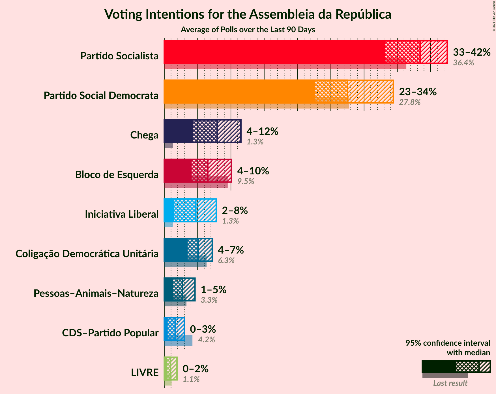

### Confidence Intervals

| Party | Last Result | Median | 80% Confidence Interval | 90% Confidence Interval | 95% Confidence Interval | 99% Confidence Interval |
|:-----:|:-----------:|:------:|:-----------------------:|:-----------------------:|:-----------------------:|:-----------------------:|
| <a href="#partido-social-democrata">Partido Social Democrata</a> | 36.9% | 23.7% | 21.8–27.1% |21.2–28.1% | 20.7–28.9% | 19.7–30.4% |
| <a href="#cds–partido-popular">CDS–Partido Popular</a> | 36.9% | 5.3% | 3.5–6.7% |3.1–7.1% | 2.9–7.5% | 2.4–8.2% |
| <a href="#partido-socialista">Partido Socialista</a> | 32.3% | 38.5% | 36.0–42.1% |35.2–43.1% | 34.5–43.8% | 33.1–45.2% |
| <a href="#bloco-de-esquerda">Bloco de Esquerda</a> | 10.2% | 9.6% | 8.3–11.2% |7.9–11.7% | 7.6–12.2% | 7.0–13.2% |
| <a href="#coligação-democrática-unitária">Coligação Democrática Unitária</a> | 8.2% | 7.0% | 5.5–9.0% |5.1–9.5% | 4.8–10.0% | 4.3–10.9% |
| <a href="#pessoas–animais–natureza">Pessoas–Animais–Natureza</a> | 1.4% | 4.3% | 3.0–5.6% |2.7–6.0% | 2.4–6.4% | 2.0–7.1% |
| <a href="#livre">LIVRE</a> | 0.7% | 0.8% | 0.2–1.9% |0.1–2.2% | 0.1–2.4% | 0.1–2.9% |
| <a href="#iniciativa-liberal">Iniciativa Liberal</a> | 0.0% | 1.0% | 0.2–2.6% |0.1–2.9% | 0.1–3.2% | 0.1–3.8% |
| <a href="#aliança">Aliança</a> | 0.0% | 0.5% | 0.2–1.1% |0.1–1.3% | 0.1–1.5% | 0.1–1.9% |
| <a href="#chega">Chega</a> | 0.0% | 0.7% | 0.2–1.7% |0.1–1.9% | 0.1–2.2% | 0.1–2.6% |

### Partido Social Democrata

*For a full overview of the results for this party, see the [Partido Social Democrata](party-partidosocialdemocrata.html) page.*

| Voting Intentions | Probability | Accumulated | Special Marks |
|:-----------------:|:-----------:|:-----------:|:-------------:|
| 17.5–18.5% | 0% | 100% |  |
| 18.5–19.5% | 0.3% | 100% |  |
| 19.5–20.5% | 2% | 99.6% |  |
| 20.5–21.5% | 6% | 98% |  |
| 21.5–22.5% | 15% | 92% |  |
| 22.5–23.5% | 23% | 78% |  |
| 23.5–24.5% | 21% | 54% | Median |
| 24.5–25.5% | 12% | 34% |  |
| 25.5–26.5% | 8% | 22% |  |
| 26.5–27.5% | 6% | 13% |  |
| 27.5–28.5% | 4% | 7% |  |
| 28.5–29.5% | 2% | 3% |  |
| 29.5–30.5% | 0.9% | 1.3% |  |
| 30.5–31.5% | 0.3% | 0.4% |  |
| 31.5–32.5% | 0.1% | 0.1% |  |
| 32.5–33.5% | 0% | 0% |  |
| 33.5–34.5% | 0% | 0% |  |
| 34.5–35.5% | 0% | 0% |  |
| 35.5–36.5% | 0% | 0% |  |
| 36.5–37.5% | 0% | 0% | Last Result |

### CDS–Partido Popular

*For a full overview of the results for this party, see the [CDS–Partido Popular](party-cds–partidopopular.html) page.*

| Voting Intentions | Probability | Accumulated | Special Marks |
|:-----------------:|:-----------:|:-----------:|:-------------:|
| 0.5–1.5% | 0% | 100% |  |
| 1.5–2.5% | 0.9% | 100% |  |
| 2.5–3.5% | 9% | 99.1% |  |
| 3.5–4.5% | 18% | 90% |  |
| 4.5–5.5% | 32% | 72% | Median |
| 5.5–6.5% | 29% | 40% |  |
| 6.5–7.5% | 9% | 12% |  |
| 7.5–8.5% | 2% | 2% |  |
| 8.5–9.5% | 0.2% | 0.2% |  |
| 9.5–10.5% | 0% | 0% |  |
| 10.5–11.5% | 0% | 0% |  |
| 11.5–12.5% | 0% | 0% |  |
| 12.5–13.5% | 0% | 0% |  |
| 13.5–14.5% | 0% | 0% |  |
| 14.5–15.5% | 0% | 0% |  |
| 15.5–16.5% | 0% | 0% |  |
| 16.5–17.5% | 0% | 0% |  |
| 17.5–18.5% | 0% | 0% |  |
| 18.5–19.5% | 0% | 0% |  |
| 19.5–20.5% | 0% | 0% |  |
| 20.5–21.5% | 0% | 0% |  |
| 21.5–22.5% | 0% | 0% |  |
| 22.5–23.5% | 0% | 0% |  |
| 23.5–24.5% | 0% | 0% |  |
| 24.5–25.5% | 0% | 0% |  |
| 25.5–26.5% | 0% | 0% |  |
| 26.5–27.5% | 0% | 0% |  |
| 27.5–28.5% | 0% | 0% |  |
| 28.5–29.5% | 0% | 0% |  |
| 29.5–30.5% | 0% | 0% |  |
| 30.5–31.5% | 0% | 0% |  |
| 31.5–32.5% | 0% | 0% |  |
| 32.5–33.5% | 0% | 0% |  |
| 33.5–34.5% | 0% | 0% |  |
| 34.5–35.5% | 0% | 0% |  |
| 35.5–36.5% | 0% | 0% |  |
| 36.5–37.5% | 0% | 0% | Last Result |

### Partido Socialista

*For a full overview of the results for this party, see the [Partido Socialista](party-partidosocialista.html) page.*

| Voting Intentions | Probability | Accumulated | Special Marks |
|:-----------------:|:-----------:|:-----------:|:-------------:|
| 30.5–31.5% | 0% | 100% |  |
| 31.5–32.5% | 0.2% | 100% | Last Result |
| 32.5–33.5% | 0.6% | 99.8% |  |
| 33.5–34.5% | 2% | 99.1% |  |
| 34.5–35.5% | 4% | 97% |  |
| 35.5–36.5% | 9% | 93% |  |
| 36.5–37.5% | 15% | 84% |  |
| 37.5–38.5% | 20% | 69% |  |
| 38.5–39.5% | 17% | 50% | Median |
| 39.5–40.5% | 11% | 32% |  |
| 40.5–41.5% | 8% | 21% |  |
| 41.5–42.5% | 6% | 14% |  |
| 42.5–43.5% | 4% | 7% |  |
| 43.5–44.5% | 2% | 3% |  |
| 44.5–45.5% | 0.8% | 1.1% |  |
| 45.5–46.5% | 0.2% | 0.3% |  |
| 46.5–47.5% | 0.1% | 0.1% |  |
| 47.5–48.5% | 0% | 0% |  |

### Bloco de Esquerda

*For a full overview of the results for this party, see the [Bloco de Esquerda](party-blocodeesquerda.html) page.*

| Voting Intentions | Probability | Accumulated | Special Marks |
|:-----------------:|:-----------:|:-----------:|:-------------:|
| 4.5–5.5% | 0% | 100% |  |
| 5.5–6.5% | 0.1% | 100% |  |
| 6.5–7.5% | 2% | 99.9% |  |
| 7.5–8.5% | 12% | 98% |  |
| 8.5–9.5% | 33% | 86% |  |
| 9.5–10.5% | 32% | 53% | Last Result, Median |
| 10.5–11.5% | 15% | 21% |  |
| 11.5–12.5% | 5% | 6% |  |
| 12.5–13.5% | 1.3% | 2% |  |
| 13.5–14.5% | 0.2% | 0.3% |  |
| 14.5–15.5% | 0% | 0% |  |

### Coligação Democrática Unitária

*For a full overview of the results for this party, see the [Coligação Democrática Unitária](party-coligaçãodemocráticaunitária.html) page.*

| Voting Intentions | Probability | Accumulated | Special Marks |
|:-----------------:|:-----------:|:-----------:|:-------------:|
| 2.5–3.5% | 0% | 100% |  |
| 3.5–4.5% | 1.1% | 100% |  |
| 4.5–5.5% | 10% | 98.9% |  |
| 5.5–6.5% | 25% | 89% |  |
| 6.5–7.5% | 32% | 64% | Median |
| 7.5–8.5% | 18% | 33% | Last Result |
| 8.5–9.5% | 10% | 15% |  |
| 9.5–10.5% | 4% | 5% |  |
| 10.5–11.5% | 0.9% | 1.0% |  |
| 11.5–12.5% | 0.1% | 0.1% |  |
| 12.5–13.5% | 0% | 0% |  |

### Pessoas–Animais–Natureza

*For a full overview of the results for this party, see the [Pessoas–Animais–Natureza](party-pessoas–animais–natureza.html) page.*

| Voting Intentions | Probability | Accumulated | Special Marks |
|:-----------------:|:-----------:|:-----------:|:-------------:|
| 0.5–1.5% | 0% | 100% | Last Result |
| 1.5–2.5% | 4% | 100% |  |
| 2.5–3.5% | 18% | 96% |  |
| 3.5–4.5% | 37% | 78% | Median |
| 4.5–5.5% | 30% | 40% |  |
| 5.5–6.5% | 9% | 11% |  |
| 6.5–7.5% | 2% | 2% |  |
| 7.5–8.5% | 0.1% | 0.1% |  |
| 8.5–9.5% | 0% | 0% |  |

### LIVRE

*For a full overview of the results for this party, see the [LIVRE](party-livre.html) page.*

| Voting Intentions | Probability | Accumulated | Special Marks |
|:-----------------:|:-----------:|:-----------:|:-------------:|
| 0.0–0.5% | 41% | 100% |  |
| 0.5–1.5% | 38% | 59% | Last Result, Median |
| 1.5–2.5% | 19% | 21% |  |
| 2.5–3.5% | 1.5% | 2% |  |
| 3.5–4.5% | 0% | 0% |  |

### Iniciativa Liberal

*For a full overview of the results for this party, see the [Iniciativa Liberal](party-iniciativaliberal.html) page.*

| Voting Intentions | Probability | Accumulated | Special Marks |
|:-----------------:|:-----------:|:-----------:|:-------------:|
| 0.0–0.5% | 41% | 100% | Last Result |
| 0.5–1.5% | 17% | 59% | Median |
| 1.5–2.5% | 31% | 43% |  |
| 2.5–3.5% | 11% | 12% |  |
| 3.5–4.5% | 0.9% | 1.0% |  |
| 4.5–5.5% | 0% | 0% |  |

### Aliança

*For a full overview of the results for this party, see the [Aliança](party-aliança.html) page.*

| Voting Intentions | Probability | Accumulated | Special Marks |
|:-----------------:|:-----------:|:-----------:|:-------------:|
| 0.0–0.5% | 53% | 100% | Last Result |
| 0.5–1.5% | 45% | 47% | Median |
| 1.5–2.5% | 2% | 2% |  |
| 2.5–3.5% | 0% | 0% |  |

### Chega

*For a full overview of the results for this party, see the [Chega](party-chega.html) page.*

| Voting Intentions | Probability | Accumulated | Special Marks |
|:-----------------:|:-----------:|:-----------:|:-------------:|
| 0.0–0.5% | 42% | 100% | Last Result |
| 0.5–1.5% | 44% | 58% | Median |
| 1.5–2.5% | 13% | 14% |  |
| 2.5–3.5% | 0.7% | 0.7% |  |
| 3.5–4.5% | 0% | 0% |  |

## Seats

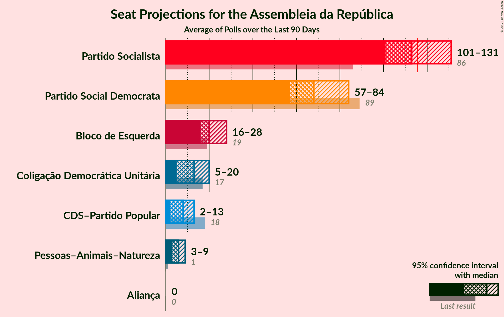

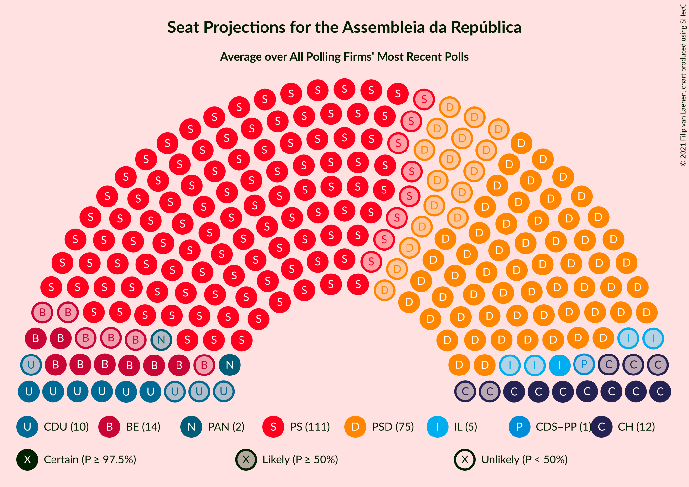

### Confidence Intervals

| Party | Last Result | Median | 80% Confidence Interval | 90% Confidence Interval | 95% Confidence Interval | 99% Confidence Interval |
|:-----:|:-----------:|:------:|:-----------------------:|:-----------------------:|:-----------------------:|:-----------------------:|
| <a href="#partido-social-democrata">Partido Social Democrata</a> | 89 | 67 | 61–77 |60–77 | 59–79 | 56–90 |
| <a href="#cds–partido-popular">CDS–Partido Popular</a> | 18 | 8 | 4–11 |2–12 | 2–13 | 2–17 |
| <a href="#partido-socialista">Partido Socialista</a> | 86 | 115 | 105–119 |103–119 | 101–120 | 95–123 |
| <a href="#bloco-de-esquerda">Bloco de Esquerda</a> | 19 | 21 | 18–25 |17–26 | 17–26 | 15–28 |
| <a href="#coligação-democrática-unitária">Coligação Democrática Unitária</a> | 17 | 14 | 13–19 |11–19 | 11–20 | 7–22 |
| <a href="#pessoas–animais–natureza">Pessoas–Animais–Natureza</a> | 1 | 6 | 3–8 |3–9 | 3–10 | 2–13 |
| <a href="#livre">LIVRE</a> | 0 | 0 | 0–1 |0–1 | 0–1 | 0–2 |
| <a href="#iniciativa-liberal">Iniciativa Liberal</a> | 0 | 0 | 0–2 |0–2 | 0–2 | 0–2 |
| <a href="#aliança">Aliança</a> | 0 | 0 | 0 |0 | 0 | 0 |
| <a href="#chega">Chega</a> | 0 | 0 | 0 |0 | 0–2 | 0–2 |

### Partido Social Democrata

*For a full overview of the results for this party, see the [Partido Social Democrata](party-partidosocialdemocrata.html) page.*

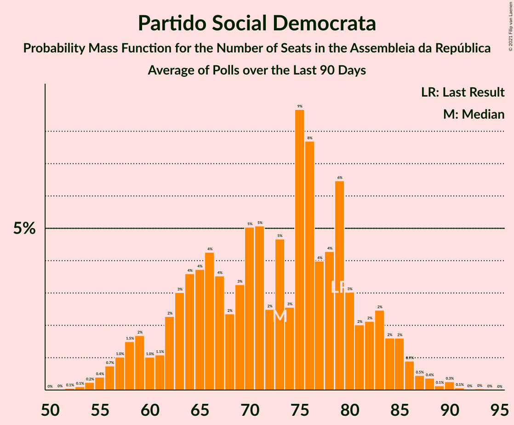

| Number of Seats | Probability | Accumulated | Special Marks |
|:---------------:|:-----------:|:-----------:|:-------------:|
| 54 | 0.1% | 100% |  |
| 55 | 0.2% | 99.9% |  |
| 56 | 0.6% | 99.6% |  |
| 57 | 0.6% | 99.0% |  |
| 58 | 0.5% | 98% |  |
| 59 | 1.1% | 98% |  |
| 60 | 2% | 97% |  |
| 61 | 26% | 95% |  |
| 62 | 3% | 69% |  |
| 63 | 3% | 66% |  |
| 64 | 3% | 63% |  |
| 65 | 4% | 59% |  |
| 66 | 4% | 55% |  |
| 67 | 7% | 51% | Median |
| 68 | 6% | 44% |  |
| 69 | 4% | 38% |  |
| 70 | 2% | 34% |  |
| 71 | 12% | 32% |  |
| 72 | 2% | 20% |  |
| 73 | 4% | 18% |  |
| 74 | 2% | 14% |  |
| 75 | 0.8% | 12% |  |
| 76 | 0.5% | 11% |  |
| 77 | 7% | 11% |  |
| 78 | 0.7% | 3% |  |
| 79 | 0.3% | 3% |  |
| 80 | 0.2% | 2% |  |
| 81 | 0.5% | 2% |  |
| 82 | 0.3% | 2% |  |
| 83 | 0.2% | 1.4% |  |
| 84 | 0.1% | 1.2% |  |
| 85 | 0.2% | 1.2% |  |
| 86 | 0.3% | 1.0% |  |
| 87 | 0% | 0.7% |  |
| 88 | 0.2% | 0.7% |  |
| 89 | 0% | 0.5% | Last Result |
| 90 | 0.1% | 0.5% |  |
| 91 | 0.1% | 0.4% |  |
| 92 | 0% | 0.4% |  |
| 93 | 0% | 0.4% |  |
| 94 | 0.2% | 0.3% |  |
| 95 | 0.1% | 0.2% |  |
| 96 | 0% | 0% |  |

### CDS–Partido Popular

*For a full overview of the results for this party, see the [CDS–Partido Popular](party-cds–partidopopular.html) page.*

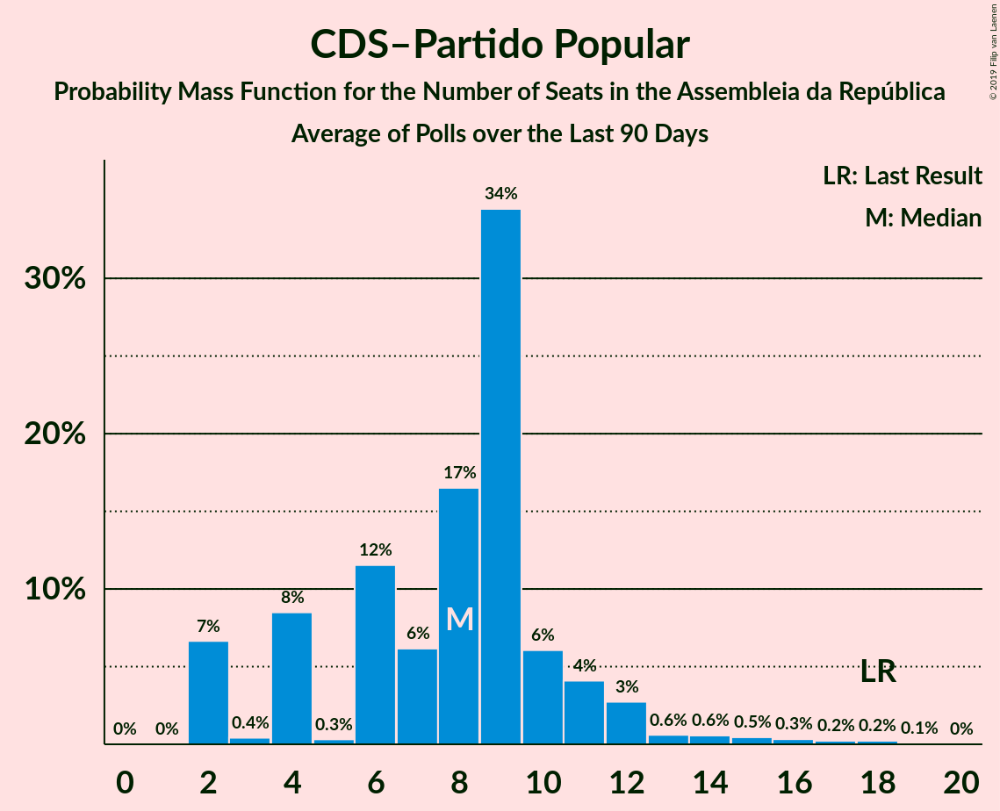

| Number of Seats | Probability | Accumulated | Special Marks |
|:---------------:|:-----------:|:-----------:|:-------------:|
| 2 | 8% | 100% |  |
| 3 | 0.5% | 92% |  |
| 4 | 10% | 91% |  |
| 5 | 0.4% | 81% |  |
| 6 | 6% | 80% |  |
| 7 | 6% | 74% |  |
| 8 | 20% | 68% | Median |
| 9 | 28% | 47% |  |
| 10 | 8% | 19% |  |
| 11 | 5% | 12% |  |
| 12 | 3% | 7% |  |
| 13 | 0.8% | 3% |  |
| 14 | 0.7% | 2% |  |
| 15 | 0.6% | 2% |  |
| 16 | 0.4% | 1.1% |  |
| 17 | 0.3% | 0.7% |  |
| 18 | 0.3% | 0.4% | Last Result |
| 19 | 0.1% | 0.1% |  |
| 20 | 0% | 0% |  |

### Partido Socialista

*For a full overview of the results for this party, see the [Partido Socialista](party-partidosocialista.html) page.*

| Number of Seats | Probability | Accumulated | Special Marks |
|:---------------:|:-----------:|:-----------:|:-------------:|
| 86 | 0% | 100% | Last Result |
| 87 | 0% | 100% |  |
| 88 | 0% | 100% |  |
| 89 | 0% | 100% |  |
| 90 | 0% | 100% |  |
| 91 | 0% | 100% |  |
| 92 | 0% | 100% |  |
| 93 | 0.2% | 100% |  |
| 94 | 0.2% | 99.8% |  |
| 95 | 0.1% | 99.6% |  |
| 96 | 0.1% | 99.5% |  |
| 97 | 0.5% | 99.4% |  |
| 98 | 0.7% | 98.9% |  |
| 99 | 0.4% | 98% |  |
| 100 | 0.4% | 98% |  |
| 101 | 0.9% | 98% |  |
| 102 | 1.1% | 97% |  |
| 103 | 1.4% | 96% |  |
| 104 | 1.3% | 94% |  |
| 105 | 9% | 93% |  |
| 106 | 2% | 84% |  |
| 107 | 2% | 82% |  |
| 108 | 2% | 80% |  |
| 109 | 3% | 78% |  |
| 110 | 3% | 75% |  |
| 111 | 4% | 71% |  |
| 112 | 7% | 68% |  |
| 113 | 5% | 61% |  |
| 114 | 4% | 56% |  |
| 115 | 6% | 52% | Median |
| 116 | 3% | 45% | Majority |
| 117 | 12% | 42% |  |
| 118 | 2% | 30% |  |
| 119 | 25% | 28% |  |
| 120 | 1.2% | 3% |  |
| 121 | 0.6% | 1.4% |  |
| 122 | 0.3% | 0.8% |  |
| 123 | 0.2% | 0.5% |  |
| 124 | 0.2% | 0.3% |  |
| 125 | 0.1% | 0.2% |  |
| 126 | 0.1% | 0.1% |  |
| 127 | 0% | 0% |  |

### Bloco de Esquerda

*For a full overview of the results for this party, see the [Bloco de Esquerda](party-blocodeesquerda.html) page.*

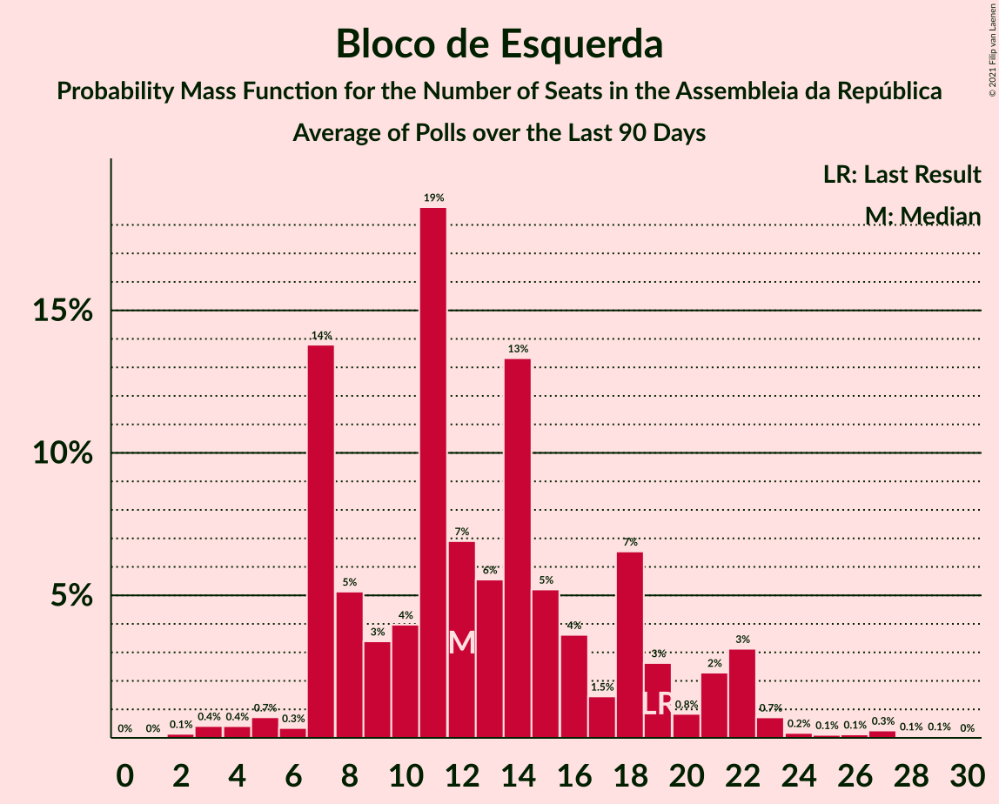

| Number of Seats | Probability | Accumulated | Special Marks |
|:---------------:|:-----------:|:-----------:|:-------------:|
| 11 | 0% | 100% |  |
| 12 | 0% | 99.9% |  |
| 13 | 0.1% | 99.9% |  |
| 14 | 0.2% | 99.8% |  |
| 15 | 0.6% | 99.6% |  |
| 16 | 0.9% | 99.0% |  |
| 17 | 5% | 98% |  |
| 18 | 19% | 93% |  |
| 19 | 7% | 75% | Last Result |
| 20 | 13% | 68% |  |
| 21 | 31% | 55% | Median |
| 22 | 3% | 24% |  |
| 23 | 4% | 21% |  |
| 24 | 6% | 17% |  |
| 25 | 1.3% | 11% |  |
| 26 | 8% | 10% |  |
| 27 | 0.9% | 2% |  |
| 28 | 0.5% | 0.9% |  |
| 29 | 0.1% | 0.4% |  |
| 30 | 0% | 0.3% |  |
| 31 | 0.2% | 0.2% |  |
| 32 | 0% | 0.1% |  |
| 33 | 0% | 0.1% |  |
| 34 | 0% | 0% |  |

### Coligação Democrática Unitária

*For a full overview of the results for this party, see the [Coligação Democrática Unitária](party-coligaçãodemocráticaunitária.html) page.*

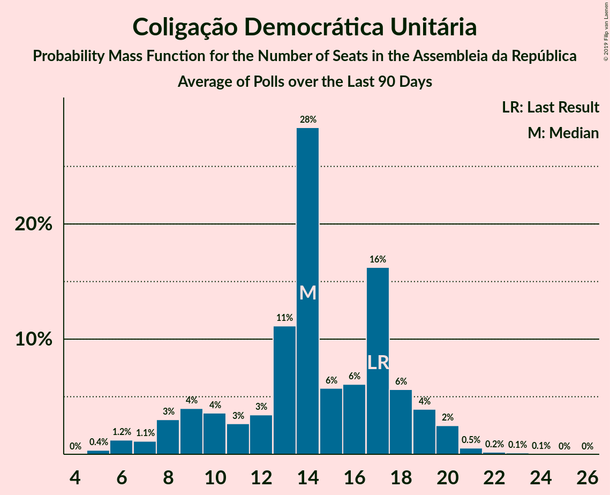

| Number of Seats | Probability | Accumulated | Special Marks |
|:---------------:|:-----------:|:-----------:|:-------------:|
| 5 | 0.3% | 100% |  |
| 6 | 0.1% | 99.7% |  |
| 7 | 0.1% | 99.6% |  |
| 8 | 0.3% | 99.5% |  |
| 9 | 0.5% | 99.1% |  |
| 10 | 0.6% | 98.6% |  |
| 11 | 3% | 98% |  |
| 12 | 1.0% | 95% |  |
| 13 | 7% | 94% |  |
| 14 | 60% | 87% | Median |
| 15 | 2% | 27% |  |
| 16 | 2% | 24% |  |
| 17 | 8% | 22% | Last Result |
| 18 | 4% | 14% |  |
| 19 | 5% | 10% |  |
| 20 | 3% | 5% |  |
| 21 | 1.0% | 2% |  |
| 22 | 0.4% | 0.8% |  |
| 23 | 0.2% | 0.4% |  |
| 24 | 0.2% | 0.2% |  |
| 25 | 0% | 0% |  |

### Pessoas–Animais–Natureza

*For a full overview of the results for this party, see the [Pessoas–Animais–Natureza](party-pessoas–animais–natureza.html) page.*

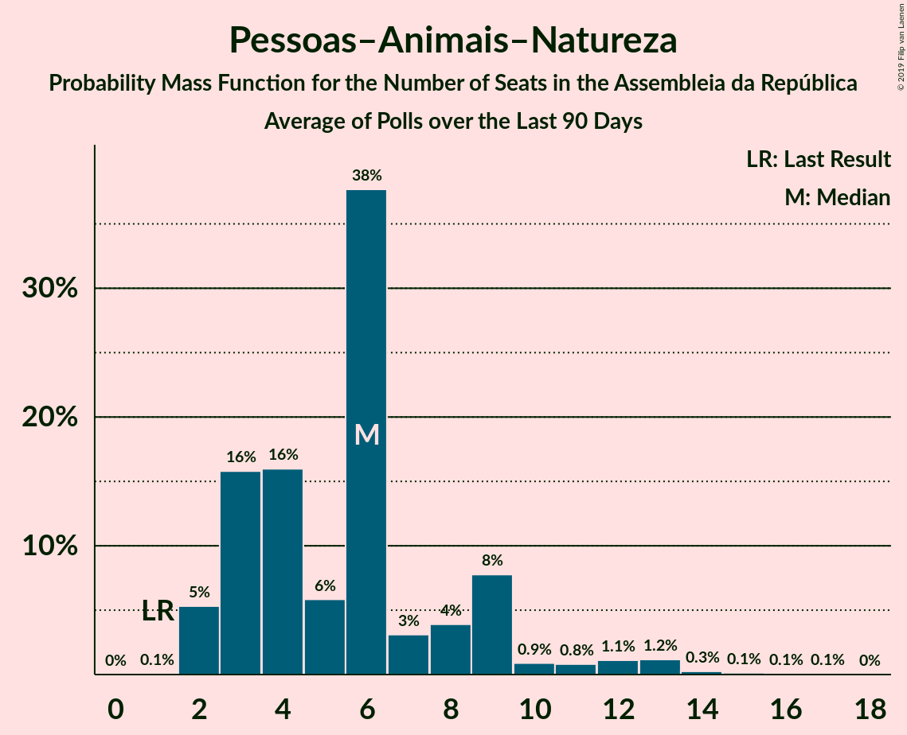

| Number of Seats | Probability | Accumulated | Special Marks |
|:---------------:|:-----------:|:-----------:|:-------------:|
| 1 | 0.1% | 100% | Last Result |
| 2 | 0.7% | 99.9% |  |
| 3 | 13% | 99.2% |  |
| 4 | 11% | 87% |  |
| 5 | 2% | 76% |  |
| 6 | 58% | 74% | Median |
| 7 | 3% | 16% |  |
| 8 | 6% | 13% |  |
| 9 | 4% | 7% |  |
| 10 | 0.9% | 3% |  |
| 11 | 0.4% | 2% |  |
| 12 | 0.4% | 1.3% |  |
| 13 | 0.6% | 1.0% |  |
| 14 | 0.3% | 0.4% |  |
| 15 | 0.1% | 0.1% |  |
| 16 | 0% | 0.1% |  |
| 17 | 0% | 0% |  |

### LIVRE

*For a full overview of the results for this party, see the [LIVRE](party-livre.html) page.*

| Number of Seats | Probability | Accumulated | Special Marks |
|:---------------:|:-----------:|:-----------:|:-------------:|
| 0 | 51% | 100% | Last Result, Median |
| 1 | 47% | 49% |  |
| 2 | 2% | 2% |  |
| 3 | 0% | 0.1% |  |
| 4 | 0% | 0% |  |

### Iniciativa Liberal

*For a full overview of the results for this party, see the [Iniciativa Liberal](party-iniciativaliberal.html) page.*

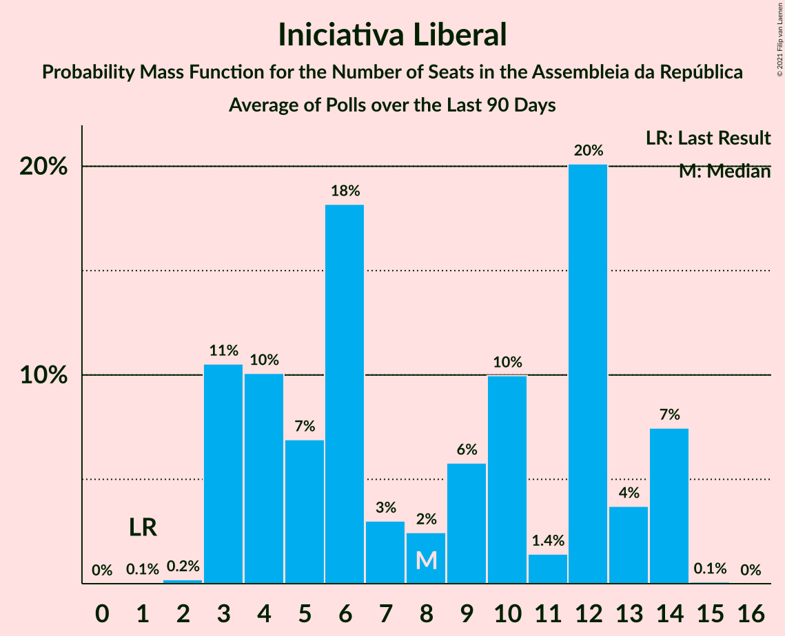

| Number of Seats | Probability | Accumulated | Special Marks |
|:---------------:|:-----------:|:-----------:|:-------------:|
| 0 | 61% | 100% | Last Result, Median |
| 1 | 14% | 39% |  |
| 2 | 25% | 25% |  |
| 3 | 0.1% | 0.3% |  |
| 4 | 0.2% | 0.3% |  |
| 5 | 0% | 0.1% |  |
| 6 | 0.1% | 0.1% |  |
| 7 | 0% | 0% |  |

### Aliança

*For a full overview of the results for this party, see the [Aliança](party-aliança.html) page.*

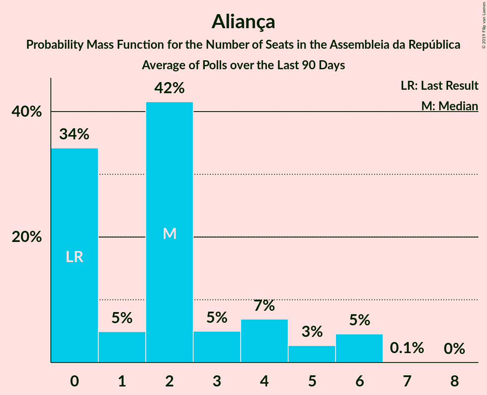

| Number of Seats | Probability | Accumulated | Special Marks |
|:---------------:|:-----------:|:-----------:|:-------------:|
| 0 | 99.9% | 100% | Last Result, Median |
| 1 | 0% | 0.1% |  |
| 2 | 0.1% | 0.1% |  |
| 3 | 0% | 0% |  |

### Chega

*For a full overview of the results for this party, see the [Chega](party-chega.html) page.*

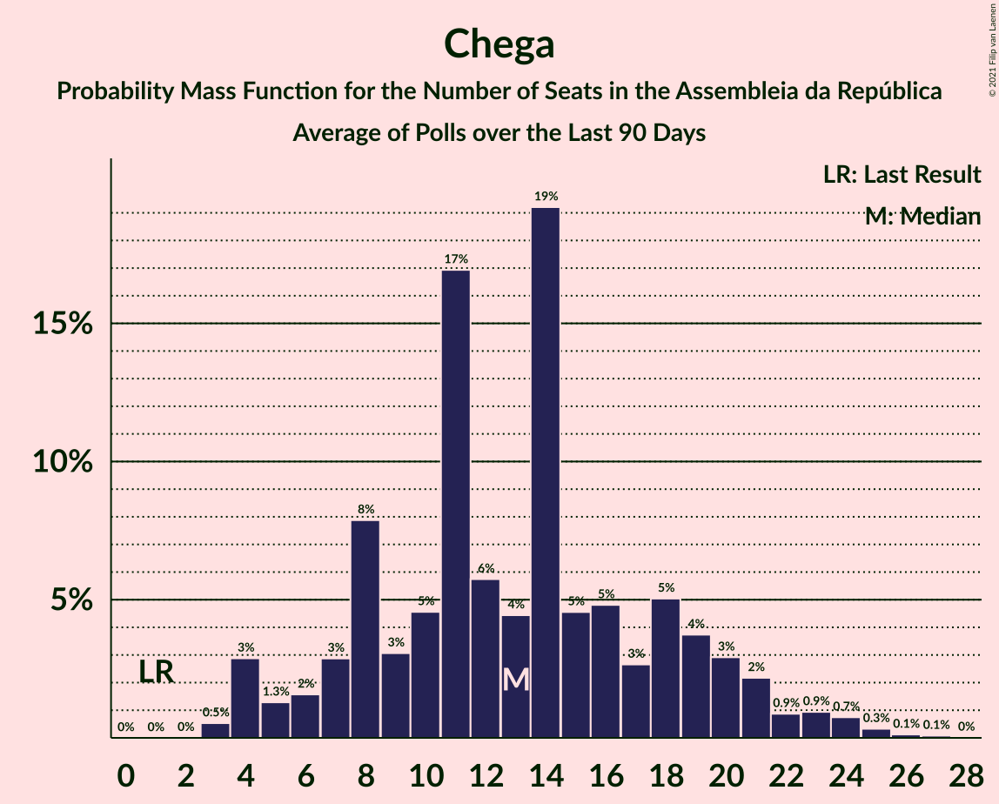

| Number of Seats | Probability | Accumulated | Special Marks |
|:---------------:|:-----------:|:-----------:|:-------------:|
| 0 | 97% | 100% | Last Result, Median |
| 1 | 0.4% | 3% |  |
| 2 | 2% | 3% |  |
| 3 | 0% | 0% |  |

## Coalitions

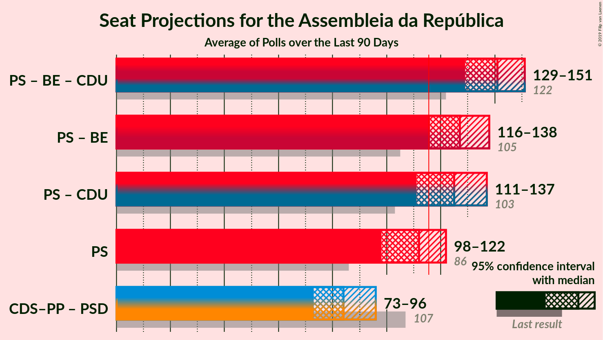

### Confidence Intervals

| Coalition | Last Result | Median | Majority? | 80% Confidence Interval | 90% Confidence Interval | 95% Confidence Interval | 99% Confidence Interval |
|:---------:|:-----------:|:------:|:---------:|:-----------------------:|:-----------------------:|:-----------------------:|:-----------------------:|
| Partido Socialista – Bloco de Esquerda – Coligação Democrática Unitária | 122 | 149 | 100% | 142–154 | 140–154 | 137–155 | 129–158 |
| Partido Socialista – Bloco de Esquerda | 105 | 135 | 99.4% | 127–140 | 123–140 | 121–140 | 115–143 |
| Partido Socialista – Coligação Democrática Unitária | 103 | 130 | 98% | 119–133 | 119–134 | 116–135 | 108–138 |
| Partido Socialista | 86 | 115 | 45% | 105–119 | 103–119 | 101–120 | 95–123 |
| CDS–Partido Popular – Partido Social Democrata | 107 | 75 | 0% | 70–80 | 69–83 | 68–85 | 64–93 |

### Partido Socialista – Bloco de Esquerda – Coligação Democrática Unitária

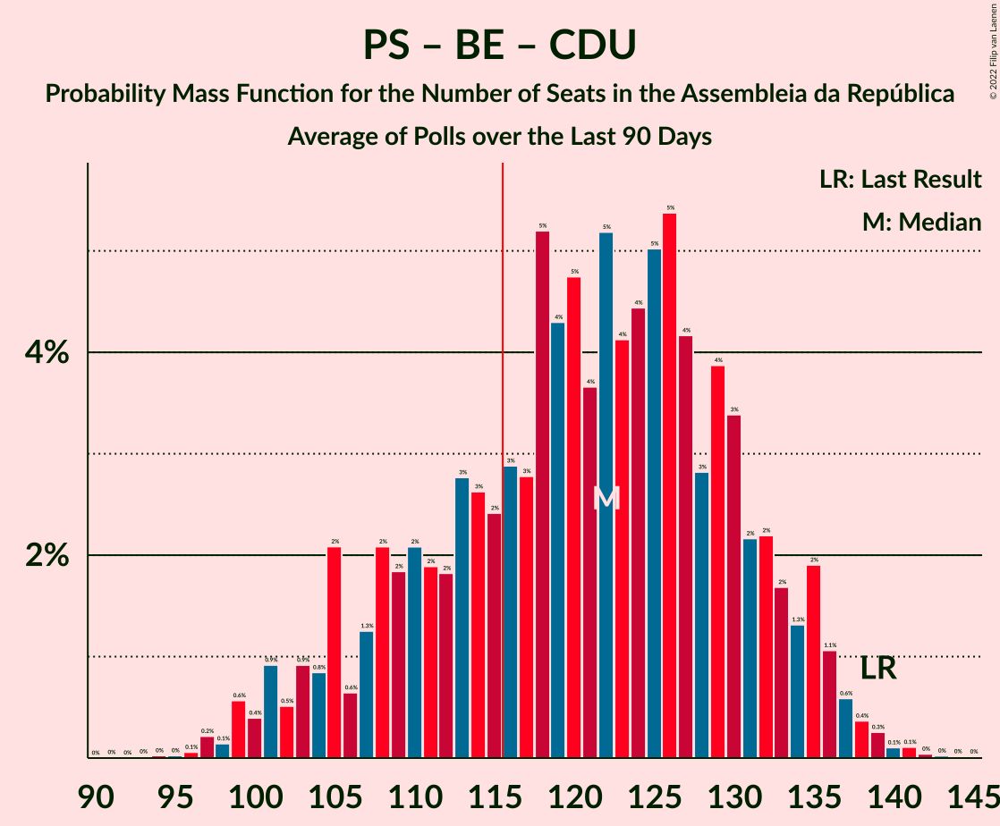

| Number of Seats | Probability | Accumulated | Special Marks |
|:---------------:|:-----------:|:-----------:|:-------------:|
| 122 | 0% | 100% | Last Result |
| 123 | 0% | 100% |  |
| 124 | 0.2% | 100% |  |
| 125 | 0% | 99.8% |  |
| 126 | 0% | 99.8% |  |
| 127 | 0.1% | 99.8% |  |
| 128 | 0% | 99.6% |  |
| 129 | 0.3% | 99.6% |  |
| 130 | 0% | 99.3% |  |
| 131 | 0.1% | 99.3% |  |
| 132 | 0.1% | 99.2% |  |
| 133 | 0.1% | 99.1% |  |
| 134 | 0.4% | 99.0% |  |
| 135 | 0.6% | 98.6% |  |
| 136 | 0.3% | 98% |  |
| 137 | 0.5% | 98% |  |
| 138 | 1.1% | 97% |  |
| 139 | 0.9% | 96% |  |
| 140 | 1.2% | 95% |  |
| 141 | 2% | 94% |  |
| 142 | 2% | 92% |  |
| 143 | 2% | 90% |  |
| 144 | 3% | 88% |  |
| 145 | 10% | 85% |  |
| 146 | 5% | 75% |  |
| 147 | 9% | 71% |  |
| 148 | 5% | 61% |  |
| 149 | 14% | 56% |  |
| 150 | 4% | 42% | Median |
| 151 | 3% | 38% |  |
| 152 | 3% | 35% |  |
| 153 | 2% | 32% |  |
| 154 | 26% | 30% |  |
| 155 | 2% | 4% |  |
| 156 | 1.0% | 2% |  |
| 157 | 0.8% | 1.4% |  |
| 158 | 0.3% | 0.6% |  |
| 159 | 0.1% | 0.3% |  |
| 160 | 0.1% | 0.2% |  |
| 161 | 0% | 0.1% |  |
| 162 | 0% | 0% |  |

### Partido Socialista – Bloco de Esquerda

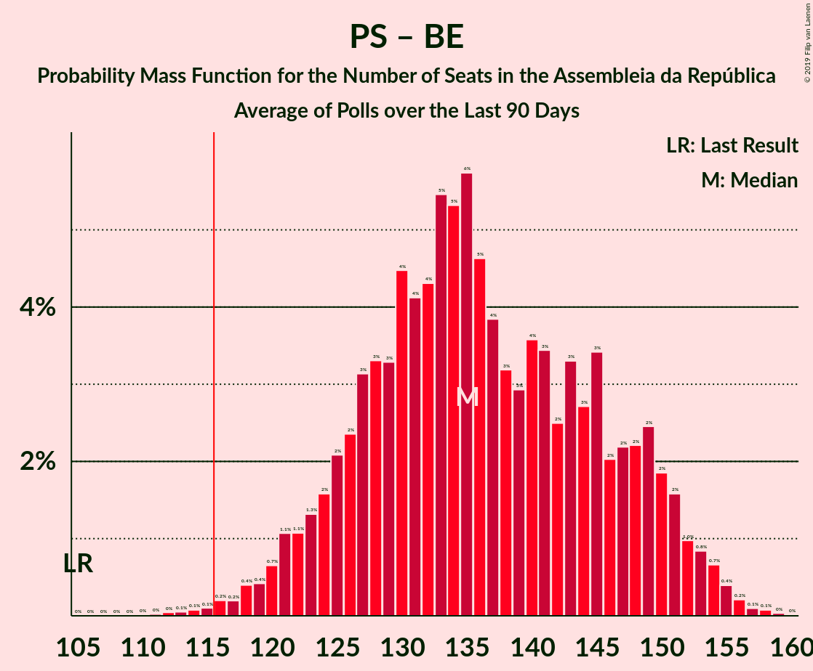

| Number of Seats | Probability | Accumulated | Special Marks |
|:---------------:|:-----------:|:-----------:|:-------------:|
| 105 | 0% | 100% | Last Result |
| 106 | 0% | 100% |  |
| 107 | 0% | 100% |  |
| 108 | 0% | 100% |  |
| 109 | 0% | 100% |  |
| 110 | 0% | 100% |  |
| 111 | 0.2% | 100% |  |
| 112 | 0% | 99.8% |  |
| 113 | 0.1% | 99.8% |  |
| 114 | 0% | 99.7% |  |
| 115 | 0.2% | 99.6% |  |
| 116 | 0.3% | 99.4% | Majority |
| 117 | 0.2% | 99.2% |  |
| 118 | 0.4% | 99.0% |  |
| 119 | 0.3% | 98.6% |  |
| 120 | 0.6% | 98% |  |
| 121 | 1.1% | 98% |  |
| 122 | 1.0% | 97% |  |
| 123 | 1.1% | 96% |  |
| 124 | 1.3% | 95% |  |
| 125 | 2% | 93% |  |
| 126 | 1.4% | 92% |  |
| 127 | 2% | 90% |  |
| 128 | 3% | 88% |  |
| 129 | 3% | 86% |  |
| 130 | 4% | 83% |  |
| 131 | 10% | 79% |  |
| 132 | 4% | 69% |  |
| 133 | 6% | 65% |  |
| 134 | 5% | 59% |  |
| 135 | 14% | 54% |  |
| 136 | 6% | 40% | Median |
| 137 | 3% | 34% |  |
| 138 | 2% | 31% |  |
| 139 | 2% | 29% |  |
| 140 | 25% | 27% |  |
| 141 | 1.0% | 2% |  |
| 142 | 0.6% | 1.3% |  |
| 143 | 0.3% | 0.7% |  |
| 144 | 0.2% | 0.4% |  |
| 145 | 0.1% | 0.2% |  |
| 146 | 0% | 0.1% |  |
| 147 | 0% | 0.1% |  |
| 148 | 0% | 0% |  |

### Partido Socialista – Coligação Democrática Unitária

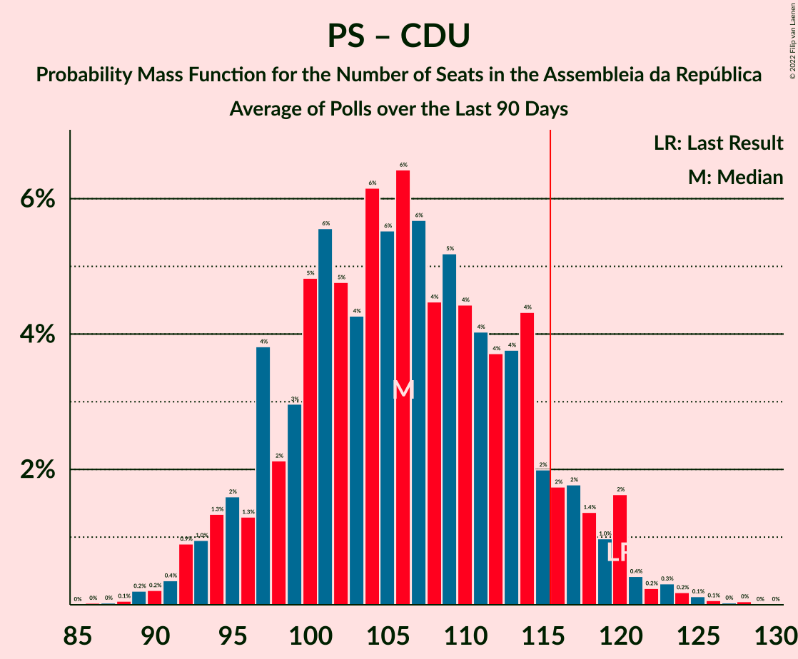

| Number of Seats | Probability | Accumulated | Special Marks |
|:---------------:|:-----------:|:-----------:|:-------------:|
| 101 | 0% | 100% |  |
| 102 | 0% | 99.9% |  |
| 103 | 0.1% | 99.9% | Last Result |
| 104 | 0% | 99.8% |  |
| 105 | 0% | 99.8% |  |
| 106 | 0.2% | 99.8% |  |
| 107 | 0.1% | 99.6% |  |
| 108 | 0.2% | 99.5% |  |
| 109 | 0% | 99.3% |  |
| 110 | 0.2% | 99.3% |  |
| 111 | 0.2% | 99.0% |  |
| 112 | 0.4% | 98.8% |  |
| 113 | 0.2% | 98% |  |
| 114 | 0.3% | 98% |  |
| 115 | 0.4% | 98% |  |
| 116 | 0.6% | 98% | Majority |
| 117 | 0.5% | 97% |  |
| 118 | 0.9% | 96% |  |
| 119 | 8% | 96% |  |
| 120 | 2% | 88% |  |
| 121 | 2% | 86% |  |
| 122 | 2% | 84% |  |
| 123 | 5% | 82% |  |
| 124 | 3% | 78% |  |
| 125 | 3% | 75% |  |
| 126 | 4% | 71% |  |
| 127 | 5% | 67% |  |
| 128 | 5% | 62% |  |
| 129 | 7% | 57% | Median |
| 130 | 5% | 51% |  |
| 131 | 12% | 46% |  |
| 132 | 2% | 34% |  |
| 133 | 26% | 31% |  |
| 134 | 2% | 6% |  |
| 135 | 1.3% | 4% |  |
| 136 | 0.8% | 2% |  |
| 137 | 0.6% | 1.5% |  |
| 138 | 0.5% | 0.9% |  |
| 139 | 0.2% | 0.4% |  |
| 140 | 0.1% | 0.2% |  |
| 141 | 0% | 0.1% |  |
| 142 | 0% | 0.1% |  |
| 143 | 0% | 0% |  |

### Partido Socialista

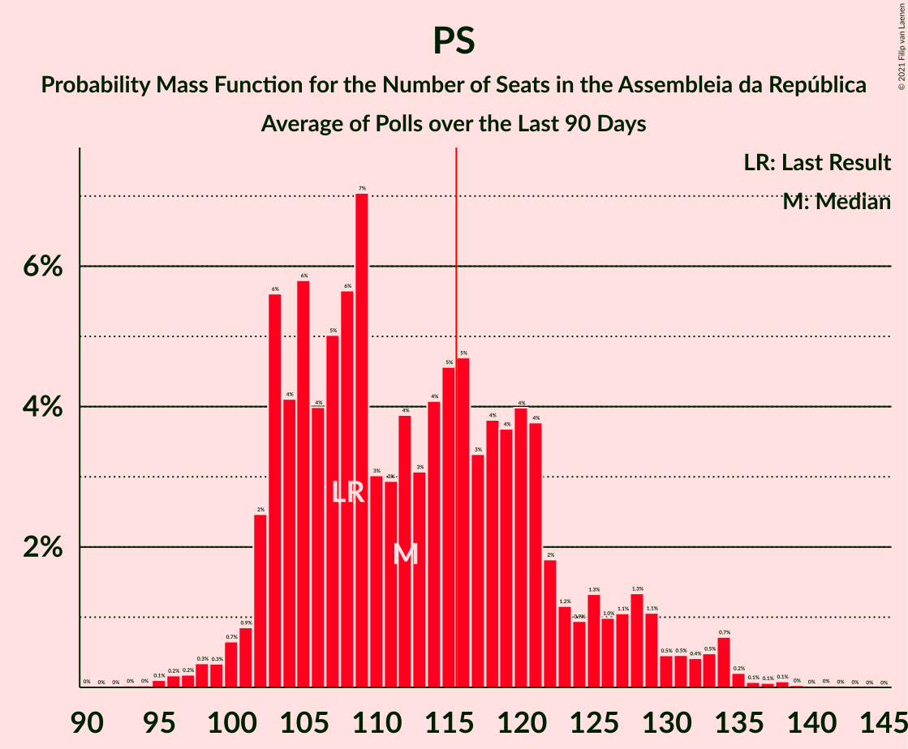

| Number of Seats | Probability | Accumulated | Special Marks |
|:---------------:|:-----------:|:-----------:|:-------------:|
| 86 | 0% | 100% | Last Result |
| 87 | 0% | 100% |  |
| 88 | 0% | 100% |  |
| 89 | 0% | 100% |  |
| 90 | 0% | 100% |  |
| 91 | 0% | 100% |  |
| 92 | 0% | 100% |  |
| 93 | 0.2% | 100% |  |
| 94 | 0.2% | 99.8% |  |
| 95 | 0.1% | 99.6% |  |
| 96 | 0.1% | 99.5% |  |
| 97 | 0.5% | 99.4% |  |
| 98 | 0.7% | 98.9% |  |
| 99 | 0.4% | 98% |  |
| 100 | 0.4% | 98% |  |
| 101 | 0.9% | 98% |  |
| 102 | 1.1% | 97% |  |
| 103 | 1.4% | 96% |  |
| 104 | 1.3% | 94% |  |
| 105 | 9% | 93% |  |
| 106 | 2% | 84% |  |
| 107 | 2% | 82% |  |
| 108 | 2% | 80% |  |
| 109 | 3% | 78% |  |
| 110 | 3% | 75% |  |
| 111 | 4% | 71% |  |
| 112 | 7% | 68% |  |
| 113 | 5% | 61% |  |
| 114 | 4% | 56% |  |
| 115 | 6% | 52% | Median |
| 116 | 3% | 45% | Majority |
| 117 | 12% | 42% |  |
| 118 | 2% | 30% |  |
| 119 | 25% | 28% |  |
| 120 | 1.2% | 3% |  |
| 121 | 0.6% | 1.4% |  |
| 122 | 0.3% | 0.8% |  |
| 123 | 0.2% | 0.5% |  |
| 124 | 0.2% | 0.3% |  |
| 125 | 0.1% | 0.2% |  |
| 126 | 0.1% | 0.1% |  |
| 127 | 0% | 0% |  |

### CDS–Partido Popular – Partido Social Democrata

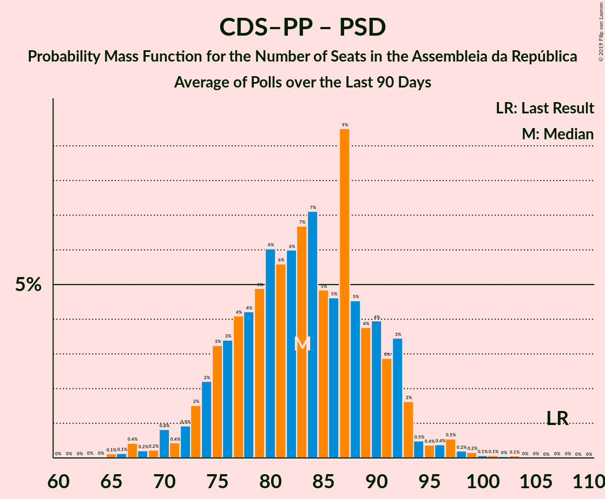

| Number of Seats | Probability | Accumulated | Special Marks |
|:---------------:|:-----------:|:-----------:|:-------------:|
| 62 | 0% | 100% |  |
| 63 | 0.1% | 99.9% |  |
| 64 | 0.4% | 99.8% |  |
| 65 | 0.3% | 99.5% |  |
| 66 | 0.5% | 99.2% |  |
| 67 | 1.0% | 98.7% |  |
| 68 | 1.3% | 98% |  |
| 69 | 2% | 96% |  |
| 70 | 26% | 95% |  |
| 71 | 2% | 69% |  |
| 72 | 3% | 66% |  |
| 73 | 3% | 63% |  |
| 74 | 4% | 60% |  |
| 75 | 15% | 56% | Median |
| 76 | 6% | 40% |  |
| 77 | 7% | 35% |  |
| 78 | 3% | 28% |  |
| 79 | 12% | 24% |  |
| 80 | 2% | 12% |  |
| 81 | 2% | 10% |  |
| 82 | 2% | 7% |  |
| 83 | 1.1% | 6% |  |
| 84 | 1.0% | 4% |  |
| 85 | 1.0% | 3% |  |
| 86 | 0.4% | 2% |  |
| 87 | 0.5% | 2% |  |
| 88 | 0.2% | 2% |  |
| 89 | 0.1% | 1.4% |  |
| 90 | 0.4% | 1.3% |  |
| 91 | 0.2% | 0.9% |  |
| 92 | 0.2% | 0.7% |  |
| 93 | 0.1% | 0.6% |  |
| 94 | 0.1% | 0.5% |  |
| 95 | 0% | 0.4% |  |
| 96 | 0% | 0.4% |  |
| 97 | 0% | 0.4% |  |
| 98 | 0.1% | 0.4% |  |
| 99 | 0% | 0.2% |  |
| 100 | 0.2% | 0.2% |  |
| 101 | 0% | 0% |  |
| 102 | 0% | 0% |  |
| 103 | 0% | 0% |  |
| 104 | 0% | 0% |  |
| 105 | 0% | 0% |  |
| 106 | 0% | 0% |  |
| 107 | 0% | 0% | Last Result |

## Technical Information

+ **Number of polls included in this average:** 5
+ **Lowest number of simulations done in a poll included in this average:** 0
+ **Total number of simulations done in the polls included in this average:** 2,229,248
+ **Error estimate:** 4.63%
