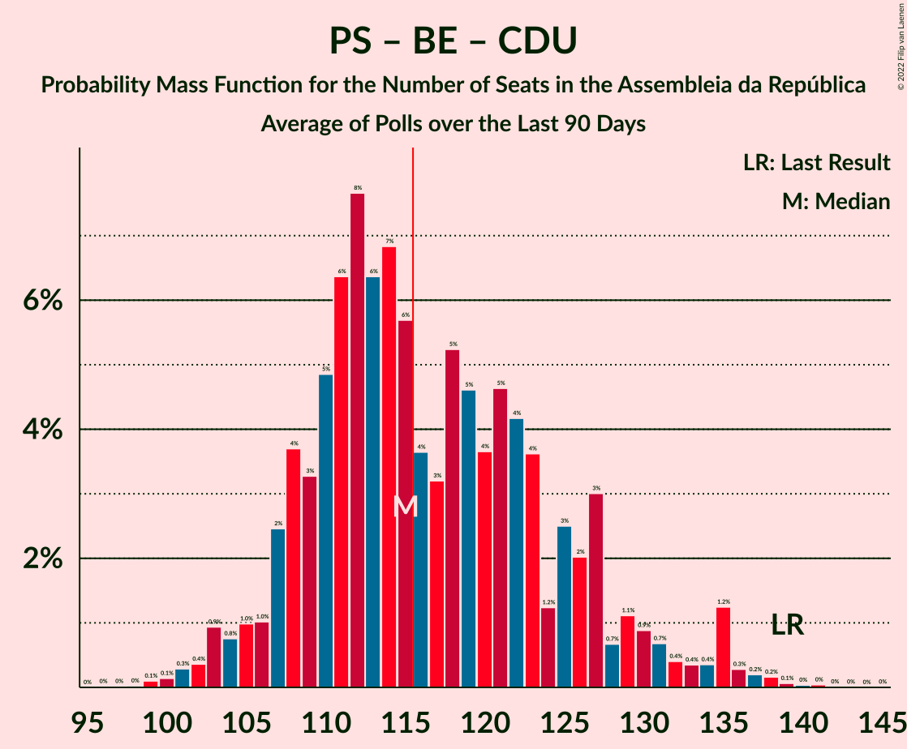

# Poll Average

<a href="#voting-intentions">Voting Intentions</a> | <a href="#seats">Seats</a> | <a href="#coalitions">Coalitions</a> | <a href="#technical-information">Technical Information</a>

## Summary

The table below lists the polls on which the average is based. They are the most recent polls (less than 90 days old) registered and analyzed so far.

| Period     | Polling firm/Commissioner(s) | PSD | CDS–PP | PS | BE | CDU | PAN | L | IL | A | CH |
|:----------:|:----------------------------:|:--:|:--:|:--:|:--:|:--:|:--:|:--:|:--:|:--:|:--:|
| 4 October 2015 | General Election | 36.9%   89 | 36.9%   18 | 32.3%   86 | 10.2%   19 | 8.2%   17 | 1.4%   1 | 0.7%   0 | 0.0%   0 | 0.0%   0 | 0.0%   0 |
| N/A | Poll Average | 21–31%   59–88 | 3–7%   3–12 | 33–43%   95–127 | 8–13%   16–27 | 5–10%   8–20 | 2–6%   2–9 | 0–3%   0–2 | 0–2%   0–2 | 0–2%   0–1 | 0–2%   0–2 |
| [27–30 September 2019](2019-09-30-Pitagórica.html) | Pitagórica   Jornal de Notícias | 25–32%   71–95 | 3–6%   2–10 | 32–39%   89–113 | 7–12%   14–26 | 6–10%   9–22 | 2–4%   1–6 | 1–3%   0–2 | 1–2%   0–2 | 1–2%   0–2 | 1–3%   0–2 |
| [26–29 September 2019](2019-09-29-CESOP–UCP.html) | CESOP–UCP   Público and RTP | 28–31%   79–89 | 4–6%   6–7 | 35–38%   100–112 | 9–11%   18–24 | 5–7%   7–13 | 2–4%   2–4 | 1%   0–1 | 1%   0 | 1%   0 | 1%   0 |
| [21–25 September 2019](2019-09-25-Aximage.html) | Aximage   Jornal Económico | 22–29%   60–81 | 4–7%   4–12 | 34–41%   97–119 | 9–14%   18–30 | 5–9%   7–19 | 2–6%   2–8 | 1–3%   0–3 | 1–2%   0–2 | N/A   N/A | 1–3%   0–2 |
| [7–12 September 2019](2019-09-12-Eurosondagem.html) | Eurosondagem | 22–25%   60–74 | 5–7%   6–11 | 36–40%   107–121 | 8–11%   17–24 | 6–8%   10–18 | 4–5%   4–8 | N/A   N/A | N/A   N/A | N/A   N/A | N/A   N/A |
| [2–11 September 2019](2019-09-11-Intercampus.html) | Intercampus   Correio da Manhã and Negócios | 21–27%   56–75 | 5–8%   6–17 | 35–41%   100–120 | 8–12%   15–26 | 7–11%   13–22 | 4–7%   5–13 | N/A   N/A | N/A   N/A | N/A   N/A | N/A   N/A |
| [24 August–5 September 2019](2019-09-05-GfKMetris.html) | GfK Metris   Expresso and SIC Notícias | 20–26%   59–72 | 4–7%   4–10 | 38–45%   111–131 | 7–11%   15–24 | 5–8%   6–16 | 3–6%   3–9 | 0–1%   0–1 | 0–1%   0 | 0–1%   0 | 0–1%   0 |
| 4 October 2015 | General Election | 36.9%   89 | 36.9%   18 | 32.3%   86 | 10.2%   19 | 8.2%   17 | 1.4%   1 | 0.7%   0 | 0.0%   0 | 0.0%   0 | 0.0%   0 |

Only polls for which at least the sample size has been published are included in the table above.

**Legend:**
+ **Top half of each row:** Voting intentions (95% confidence interval)
+ **Bottom half of each row:** Seat projections for the Assembleia da República (95% confidence interval)
+ **PSD:** Partido Social Democrata
+ **CDS–PP:** CDS–Partido Popular
+ **PS:** Partido Socialista
+ **BE:** Bloco de Esquerda
+ **CDU:** Coligação Democrática Unitária
+ **PAN:** Pessoas–Animais–Natureza
+ **L:** LIVRE
+ **IL:** Iniciativa Liberal
+ **A:** Aliança
+ **CH:** Chega
+ **N/A (single party):** Party not included the published results
+ **N/A (entire row):** Calculation for this opinion poll not started yet

## Voting Intentions

### Confidence Intervals

| Party | Last Result | Median | 80% Confidence Interval | 90% Confidence Interval | 95% Confidence Interval | 99% Confidence Interval |
|:-----:|:-----------:|:------:|:-----------------------:|:-----------------------:|:-----------------------:|:-----------------------:|
| <a href="#partido-social-democrata">Partido Social Democrata</a> | 36.9% | 24.7% | 22.1–30.0% |21.5–30.5% | 20.9–31.0% | 19.9–32.1% |
| <a href="#cds–partido-popular">CDS–Partido Popular</a> | 36.9% | 5.2% | 4.1–6.5% |3.7–7.0% | 3.4–7.4% | 2.9–8.1% |
| <a href="#partido-socialista">Partido Socialista</a> | 32.3% | 37.6% | 35.1–41.4% |34.1–42.5% | 33.3–43.4% | 31.9–44.9% |
| <a href="#bloco-de-esquerda">Bloco de Esquerda</a> | 10.2% | 9.8% | 8.4–11.3% |8.0–12.0% | 7.7–12.6% | 7.0–13.7% |
| <a href="#coligação-democrática-unitária">Coligação Democrática Unitária</a> | 8.2% | 7.0% | 5.6–9.0% |5.3–9.5% | 5.1–10.0% | 4.5–10.8% |
| <a href="#pessoas–animais–natureza">Pessoas–Animais–Natureza</a> | 1.4% | 3.9% | 2.7–5.4% |2.5–5.8% | 2.2–6.2% | 1.8–6.9% |
| <a href="#livre">LIVRE</a> | 0.7% | 1.1% | 0.3–2.2% |0.2–2.5% | 0.1–2.7% | 0.1–3.2% |
| <a href="#iniciativa-liberal">Iniciativa Liberal</a> | 0.0% | 1.0% | 0.3–1.7% |0.2–1.9% | 0.1–2.2% | 0.1–2.6% |
| <a href="#aliança">Aliança</a> | 0.0% | 0.9% | 0.2–1.5% |0.2–1.8% | 0.1–2.0% | 0.1–2.5% |
| <a href="#chega">Chega</a> | 0.0% | 1.1% | 0.3–2.0% |0.2–2.3% | 0.1–2.5% | 0.1–3.0% |

### Partido Social Democrata

*For a full overview of the results for this party, see the [Partido Social Democrata](party-partidosocialdemocrata.html) page.*

| Voting Intentions | Probability | Accumulated | Special Marks |
|:-----------------:|:-----------:|:-----------:|:-------------:|
| 17.5–18.5% | 0% | 100% |  |
| 18.5–19.5% | 0.2% | 100% |  |
| 19.5–20.5% | 1.1% | 99.8% |  |
| 20.5–21.5% | 4% | 98.6% |  |
| 21.5–22.5% | 10% | 95% |  |
| 22.5–23.5% | 17% | 84% |  |
| 23.5–24.5% | 16% | 68% |  |
| 24.5–25.5% | 10% | 52% | Median |
| 25.5–26.5% | 7% | 42% |  |
| 26.5–27.5% | 5% | 35% |  |
| 27.5–28.5% | 6% | 30% |  |
| 28.5–29.5% | 10% | 24% |  |
| 29.5–30.5% | 10% | 15% |  |
| 30.5–31.5% | 4% | 5% |  |
| 31.5–32.5% | 0.8% | 1.1% |  |
| 32.5–33.5% | 0.2% | 0.3% |  |
| 33.5–34.5% | 0.1% | 0.1% |  |
| 34.5–35.5% | 0% | 0% |  |
| 35.5–36.5% | 0% | 0% |  |
| 36.5–37.5% | 0% | 0% | Last Result |

### CDS–Partido Popular

*For a full overview of the results for this party, see the [CDS–Partido Popular](party-cds–partidopopular.html) page.*

| Voting Intentions | Probability | Accumulated | Special Marks |
|:-----------------:|:-----------:|:-----------:|:-------------:|
| 0.5–1.5% | 0% | 100% |  |
| 1.5–2.5% | 0.1% | 100% |  |
| 2.5–3.5% | 3% | 99.9% |  |
| 3.5–4.5% | 17% | 97% |  |
| 4.5–5.5% | 44% | 79% | Median |
| 5.5–6.5% | 26% | 35% |  |
| 6.5–7.5% | 8% | 9% |  |
| 7.5–8.5% | 2% | 2% |  |
| 8.5–9.5% | 0.2% | 0.2% |  |
| 9.5–10.5% | 0% | 0% |  |
| 10.5–11.5% | 0% | 0% |  |
| 11.5–12.5% | 0% | 0% |  |
| 12.5–13.5% | 0% | 0% |  |
| 13.5–14.5% | 0% | 0% |  |
| 14.5–15.5% | 0% | 0% |  |
| 15.5–16.5% | 0% | 0% |  |
| 16.5–17.5% | 0% | 0% |  |
| 17.5–18.5% | 0% | 0% |  |
| 18.5–19.5% | 0% | 0% |  |
| 19.5–20.5% | 0% | 0% |  |
| 20.5–21.5% | 0% | 0% |  |
| 21.5–22.5% | 0% | 0% |  |
| 22.5–23.5% | 0% | 0% |  |
| 23.5–24.5% | 0% | 0% |  |
| 24.5–25.5% | 0% | 0% |  |
| 25.5–26.5% | 0% | 0% |  |
| 26.5–27.5% | 0% | 0% |  |
| 27.5–28.5% | 0% | 0% |  |
| 28.5–29.5% | 0% | 0% |  |
| 29.5–30.5% | 0% | 0% |  |
| 30.5–31.5% | 0% | 0% |  |
| 31.5–32.5% | 0% | 0% |  |
| 32.5–33.5% | 0% | 0% |  |
| 33.5–34.5% | 0% | 0% |  |
| 34.5–35.5% | 0% | 0% |  |
| 35.5–36.5% | 0% | 0% |  |
| 36.5–37.5% | 0% | 0% | Last Result |

### Partido Socialista

*For a full overview of the results for this party, see the [Partido Socialista](party-partidosocialista.html) page.*

| Voting Intentions | Probability | Accumulated | Special Marks |
|:-----------------:|:-----------:|:-----------:|:-------------:|
| 28.5–29.5% | 0% | 100% |  |
| 29.5–30.5% | 0.1% | 100% |  |
| 30.5–31.5% | 0.3% | 99.9% |  |
| 31.5–32.5% | 0.8% | 99.7% | Last Result |
| 32.5–33.5% | 2% | 98.9% |  |
| 33.5–34.5% | 4% | 97% |  |
| 34.5–35.5% | 7% | 93% |  |
| 35.5–36.5% | 15% | 86% |  |
| 36.5–37.5% | 19% | 71% |  |
| 37.5–38.5% | 17% | 52% | Median |
| 38.5–39.5% | 12% | 35% |  |
| 39.5–40.5% | 8% | 22% |  |
| 40.5–41.5% | 5% | 15% |  |
| 41.5–42.5% | 4% | 9% |  |
| 42.5–43.5% | 3% | 5% |  |
| 43.5–44.5% | 1.5% | 2% |  |
| 44.5–45.5% | 0.6% | 0.8% |  |
| 45.5–46.5% | 0.2% | 0.2% |  |
| 46.5–47.5% | 0% | 0% |  |

### Bloco de Esquerda

*For a full overview of the results for this party, see the [Bloco de Esquerda](party-blocodeesquerda.html) page.*

| Voting Intentions | Probability | Accumulated | Special Marks |
|:-----------------:|:-----------:|:-----------:|:-------------:|
| 4.5–5.5% | 0% | 100% |  |
| 5.5–6.5% | 0.1% | 100% |  |
| 6.5–7.5% | 2% | 99.9% |  |
| 7.5–8.5% | 10% | 98% |  |
| 8.5–9.5% | 29% | 88% |  |
| 9.5–10.5% | 36% | 59% | Last Result, Median |
| 10.5–11.5% | 15% | 23% |  |
| 11.5–12.5% | 6% | 8% |  |
| 12.5–13.5% | 2% | 3% |  |
| 13.5–14.5% | 0.5% | 0.6% |  |
| 14.5–15.5% | 0.1% | 0.1% |  |
| 15.5–16.5% | 0% | 0% |  |

### Coligação Democrática Unitária

*For a full overview of the results for this party, see the [Coligação Democrática Unitária](party-coligaçãodemocráticaunitária.html) page.*

| Voting Intentions | Probability | Accumulated | Special Marks |
|:-----------------:|:-----------:|:-----------:|:-------------:|
| 2.5–3.5% | 0% | 100% |  |
| 3.5–4.5% | 0.5% | 100% |  |
| 4.5–5.5% | 8% | 99.5% |  |
| 5.5–6.5% | 29% | 92% |  |
| 6.5–7.5% | 28% | 63% | Median |
| 7.5–8.5% | 19% | 35% | Last Result |
| 8.5–9.5% | 11% | 15% |  |
| 9.5–10.5% | 4% | 5% |  |
| 10.5–11.5% | 0.8% | 0.9% |  |
| 11.5–12.5% | 0.1% | 0.1% |  |
| 12.5–13.5% | 0% | 0% |  |

### Pessoas–Animais–Natureza

*For a full overview of the results for this party, see the [Pessoas–Animais–Natureza](party-pessoas–animais–natureza.html) page.*

| Voting Intentions | Probability | Accumulated | Special Marks |
|:-----------------:|:-----------:|:-----------:|:-------------:|
| 0.0–0.5% | 0% | 100% |  |
| 0.5–1.5% | 0.1% | 100% | Last Result |
| 1.5–2.5% | 6% | 99.9% |  |
| 2.5–3.5% | 33% | 94% |  |
| 3.5–4.5% | 31% | 60% | Median |
| 4.5–5.5% | 22% | 29% |  |
| 5.5–6.5% | 6% | 8% |  |
| 6.5–7.5% | 1.1% | 1.2% |  |
| 7.5–8.5% | 0.1% | 0.1% |  |
| 8.5–9.5% | 0% | 0% |  |

### LIVRE

*For a full overview of the results for this party, see the [LIVRE](party-livre.html) page.*

| Voting Intentions | Probability | Accumulated | Special Marks |
|:-----------------:|:-----------:|:-----------:|:-------------:|
| 0.0–0.5% | 20% | 100% |  |
| 0.5–1.5% | 49% | 80% | Last Result, Median |
| 1.5–2.5% | 26% | 30% |  |
| 2.5–3.5% | 4% | 4% |  |
| 3.5–4.5% | 0.2% | 0.2% |  |
| 4.5–5.5% | 0% | 0% |  |

### Iniciativa Liberal

*For a full overview of the results for this party, see the [Iniciativa Liberal](party-iniciativaliberal.html) page.*

| Voting Intentions | Probability | Accumulated | Special Marks |
|:-----------------:|:-----------:|:-----------:|:-------------:|
| 0.0–0.5% | 21% | 100% | Last Result |
| 0.5–1.5% | 64% | 79% | Median |
| 1.5–2.5% | 14% | 14% |  |
| 2.5–3.5% | 0.7% | 0.7% |  |
| 3.5–4.5% | 0% | 0% |  |

### Aliança

*For a full overview of the results for this party, see the [Aliança](party-aliança.html) page.*

| Voting Intentions | Probability | Accumulated | Special Marks |
|:-----------------:|:-----------:|:-----------:|:-------------:|
| 0.0–0.5% | 28% | 100% | Last Result |
| 0.5–1.5% | 63% | 72% | Median |
| 1.5–2.5% | 9% | 10% |  |
| 2.5–3.5% | 0.5% | 0.5% |  |
| 3.5–4.5% | 0% | 0% |  |

### Chega

*For a full overview of the results for this party, see the [Chega](party-chega.html) page.*

| Voting Intentions | Probability | Accumulated | Special Marks |
|:-----------------:|:-----------:|:-----------:|:-------------:|
| 0.0–0.5% | 21% | 100% | Last Result |
| 0.5–1.5% | 55% | 79% | Median |
| 1.5–2.5% | 22% | 24% |  |
| 2.5–3.5% | 2% | 2% |  |
| 3.5–4.5% | 0.1% | 0.1% |  |
| 4.5–5.5% | 0% | 0% |  |

## Seats

### Confidence Intervals

| Party | Last Result | Median | 80% Confidence Interval | 90% Confidence Interval | 95% Confidence Interval | 99% Confidence Interval |
|:-----:|:-----------:|:------:|:-----------------------:|:-----------------------:|:-----------------------:|:-----------------------:|
| <a href="#partido-social-democrata">Partido Social Democrata</a> | 89 | 70 | 61–85 |60–86 | 59–88 | 56–95 |
| <a href="#cds–partido-popular">CDS–Partido Popular</a> | 18 | 7 | 6–10 |4–11 | 3–12 | 2–17 |
| <a href="#partido-socialista">Partido Socialista</a> | 86 | 110 | 101–119 |99–125 | 95–127 | 89–130 |
| <a href="#bloco-de-esquerda">Bloco de Esquerda</a> | 19 | 20 | 17–24 |17–26 | 16–27 | 13–29 |
| <a href="#coligação-democrática-unitária">Coligação Democrática Unitária</a> | 17 | 14 | 9–18 |8–20 | 8–20 | 6–23 |
| <a href="#pessoas–animais–natureza">Pessoas–Animais–Natureza</a> | 1 | 6 | 3–7 |2–9 | 2–9 | 2–13 |
| <a href="#livre">LIVRE</a> | 0 | 1 | 0–2 |0–2 | 0–2 | 0–4 |
| <a href="#iniciativa-liberal">Iniciativa Liberal</a> | 0 | 0 | 0 |0–1 | 0–2 | 0–2 |
| <a href="#aliança">Aliança</a> | 0 | 0 | 0 |0 | 0–1 | 0–2 |
| <a href="#chega">Chega</a> | 0 | 0 | 0 |0–2 | 0–2 | 0–2 |

### Partido Social Democrata

*For a full overview of the results for this party, see the [Partido Social Democrata](party-partidosocialdemocrata.html) page.*

| Number of Seats | Probability | Accumulated | Special Marks |
|:---------------:|:-----------:|:-----------:|:-------------:|
| 53 | 0% | 100% |  |
| 54 | 0.1% | 99.9% |  |
| 55 | 0.2% | 99.8% |  |
| 56 | 0.5% | 99.6% |  |
| 57 | 0.4% | 99.2% |  |
| 58 | 0.6% | 98.8% |  |
| 59 | 2% | 98% |  |
| 60 | 2% | 96% |  |
| 61 | 5% | 94% |  |
| 62 | 2% | 89% |  |
| 63 | 4% | 87% |  |
| 64 | 3% | 83% |  |
| 65 | 3% | 80% |  |
| 66 | 5% | 77% |  |
| 67 | 8% | 73% |  |
| 68 | 7% | 64% |  |
| 69 | 7% | 58% |  |
| 70 | 3% | 51% | Median |
| 71 | 3% | 48% |  |
| 72 | 2% | 45% |  |
| 73 | 3% | 43% |  |
| 74 | 3% | 39% |  |
| 75 | 2% | 37% |  |
| 76 | 2% | 34% |  |
| 77 | 2% | 32% |  |
| 78 | 2% | 30% |  |
| 79 | 2% | 28% |  |
| 80 | 3% | 26% |  |
| 81 | 2% | 22% |  |
| 82 | 2% | 20% |  |
| 83 | 3% | 18% |  |
| 84 | 3% | 15% |  |
| 85 | 4% | 12% |  |
| 86 | 5% | 8% |  |
| 87 | 0.8% | 3% |  |
| 88 | 0.3% | 3% |  |
| 89 | 0.3% | 2% | Last Result |
| 90 | 0.1% | 2% |  |
| 91 | 0.3% | 2% |  |
| 92 | 0.2% | 2% |  |
| 93 | 0.8% | 2% |  |
| 94 | 0.2% | 0.7% |  |
| 95 | 0.3% | 0.5% |  |
| 96 | 0.1% | 0.2% |  |
| 97 | 0% | 0.1% |  |
| 98 | 0% | 0.1% |  |
| 99 | 0% | 0% |  |

### CDS–Partido Popular

*For a full overview of the results for this party, see the [CDS–Partido Popular](party-cds–partidopopular.html) page.*

| Number of Seats | Probability | Accumulated | Special Marks |
|:---------------:|:-----------:|:-----------:|:-------------:|
| 2 | 2% | 100% |  |
| 3 | 1.1% | 98% |  |
| 4 | 3% | 97% |  |
| 5 | 0.6% | 93% |  |
| 6 | 37% | 93% |  |
| 7 | 21% | 56% | Median |
| 8 | 15% | 34% |  |
| 9 | 4% | 20% |  |
| 10 | 7% | 16% |  |
| 11 | 4% | 9% |  |
| 12 | 2% | 5% |  |
| 13 | 0.7% | 2% |  |
| 14 | 0.6% | 2% |  |
| 15 | 0.4% | 1.3% |  |
| 16 | 0.3% | 0.8% |  |
| 17 | 0.2% | 0.5% |  |
| 18 | 0.2% | 0.3% | Last Result |
| 19 | 0.1% | 0.1% |  |
| 20 | 0% | 0% |  |

### Partido Socialista

*For a full overview of the results for this party, see the [Partido Socialista](party-partidosocialista.html) page.*

| Number of Seats | Probability | Accumulated | Special Marks |
|:---------------:|:-----------:|:-----------:|:-------------:|
| 85 | 0% | 100% |  |
| 86 | 0% | 99.9% | Last Result |
| 87 | 0.1% | 99.9% |  |
| 88 | 0.1% | 99.8% |  |
| 89 | 0.6% | 99.7% |  |
| 90 | 0.4% | 99.1% |  |
| 91 | 0.1% | 98.6% |  |
| 92 | 0.4% | 98% |  |
| 93 | 0.1% | 98% |  |
| 94 | 0.3% | 98% |  |
| 95 | 0.3% | 98% |  |
| 96 | 0.7% | 97% |  |
| 97 | 0.5% | 97% |  |
| 98 | 0.8% | 96% |  |
| 99 | 1.1% | 95% |  |
| 100 | 3% | 94% |  |
| 101 | 2% | 91% |  |
| 102 | 3% | 89% |  |
| 103 | 3% | 86% |  |
| 104 | 4% | 83% |  |
| 105 | 5% | 79% |  |
| 106 | 9% | 74% |  |
| 107 | 5% | 65% |  |
| 108 | 4% | 60% |  |
| 109 | 3% | 56% |  |
| 110 | 5% | 53% | Median |
| 111 | 5% | 49% |  |
| 112 | 4% | 44% |  |
| 113 | 4% | 39% |  |
| 114 | 5% | 35% |  |
| 115 | 8% | 30% |  |
| 116 | 5% | 22% | Majority |
| 117 | 3% | 17% |  |
| 118 | 3% | 15% |  |
| 119 | 2% | 11% |  |
| 120 | 1.1% | 9% |  |
| 121 | 0.7% | 8% |  |
| 122 | 1.2% | 8% |  |
| 123 | 0.6% | 6% |  |
| 124 | 0.3% | 6% |  |
| 125 | 0.6% | 6% |  |
| 126 | 0.2% | 5% |  |
| 127 | 3% | 5% |  |
| 128 | 0.7% | 2% |  |
| 129 | 0.5% | 1.3% |  |
| 130 | 0.3% | 0.8% |  |
| 131 | 0.1% | 0.5% |  |
| 132 | 0.2% | 0.3% |  |
| 133 | 0% | 0.1% |  |
| 134 | 0% | 0.1% |  |
| 135 | 0% | 0.1% |  |
| 136 | 0% | 0% |  |

### Bloco de Esquerda

*For a full overview of the results for this party, see the [Bloco de Esquerda](party-blocodeesquerda.html) page.*

| Number of Seats | Probability | Accumulated | Special Marks |
|:---------------:|:-----------:|:-----------:|:-------------:|
| 10 | 0.1% | 100% |  |
| 11 | 0.1% | 99.9% |  |
| 12 | 0.1% | 99.8% |  |
| 13 | 0.3% | 99.7% |  |
| 14 | 0.4% | 99.4% |  |
| 15 | 0.8% | 99.0% |  |
| 16 | 0.8% | 98% |  |
| 17 | 8% | 97% |  |
| 18 | 15% | 90% |  |
| 19 | 15% | 75% | Last Result |
| 20 | 11% | 60% | Median |
| 21 | 12% | 49% |  |
| 22 | 7% | 37% |  |
| 23 | 11% | 30% |  |
| 24 | 11% | 19% |  |
| 25 | 2% | 8% |  |
| 26 | 2% | 6% |  |
| 27 | 1.4% | 4% |  |
| 28 | 1.4% | 2% |  |
| 29 | 0.2% | 0.7% |  |
| 30 | 0.1% | 0.5% |  |
| 31 | 0% | 0.4% |  |
| 32 | 0.1% | 0.4% |  |
| 33 | 0.1% | 0.3% |  |
| 34 | 0.1% | 0.2% |  |
| 35 | 0% | 0.2% |  |
| 36 | 0% | 0.1% |  |
| 37 | 0% | 0.1% |  |
| 38 | 0.1% | 0.1% |  |
| 39 | 0% | 0% |  |

### Coligação Democrática Unitária

*For a full overview of the results for this party, see the [Coligação Democrática Unitária](party-coligaçãodemocráticaunitária.html) page.*

| Number of Seats | Probability | Accumulated | Special Marks |
|:---------------:|:-----------:|:-----------:|:-------------:|
| 5 | 0.2% | 100% |  |
| 6 | 0.9% | 99.8% |  |
| 7 | 1.1% | 98.9% |  |
| 8 | 4% | 98% |  |
| 9 | 13% | 94% |  |
| 10 | 4% | 81% |  |
| 11 | 7% | 77% |  |
| 12 | 2% | 69% |  |
| 13 | 10% | 67% |  |
| 14 | 23% | 57% | Median |
| 15 | 3% | 34% |  |
| 16 | 3% | 31% |  |
| 17 | 15% | 28% | Last Result |
| 18 | 4% | 14% |  |
| 19 | 4% | 10% |  |
| 20 | 3% | 5% |  |
| 21 | 1.4% | 2% |  |
| 22 | 0.6% | 1.1% |  |
| 23 | 0.2% | 0.5% |  |
| 24 | 0.3% | 0.3% |  |
| 25 | 0% | 0% |  |

### Pessoas–Animais–Natureza

*For a full overview of the results for this party, see the [Pessoas–Animais–Natureza](party-pessoas–animais–natureza.html) page.*

| Number of Seats | Probability | Accumulated | Special Marks |
|:---------------:|:-----------:|:-----------:|:-------------:|
| 1 | 0.4% | 100% | Last Result |
| 2 | 6% | 99.5% |  |
| 3 | 22% | 94% |  |
| 4 | 15% | 72% |  |
| 5 | 6% | 57% |  |
| 6 | 39% | 51% | Median |
| 7 | 3% | 13% |  |
| 8 | 4% | 10% |  |
| 9 | 3% | 5% |  |
| 10 | 0.6% | 2% |  |
| 11 | 0.3% | 1.2% |  |
| 12 | 0.2% | 0.9% |  |
| 13 | 0.4% | 0.7% |  |
| 14 | 0.2% | 0.3% |  |
| 15 | 0% | 0.1% |  |
| 16 | 0% | 0% |  |

### LIVRE

*For a full overview of the results for this party, see the [LIVRE](party-livre.html) page.*

| Number of Seats | Probability | Accumulated | Special Marks |
|:---------------:|:-----------:|:-----------:|:-------------:|
| 0 | 31% | 100% | Last Result |
| 1 | 59% | 69% | Median |
| 2 | 9% | 10% |  |
| 3 | 0.4% | 1.0% |  |
| 4 | 0.2% | 0.6% |  |
| 5 | 0.4% | 0.4% |  |
| 6 | 0% | 0% |  |

### Iniciativa Liberal

*For a full overview of the results for this party, see the [Iniciativa Liberal](party-iniciativaliberal.html) page.*

| Number of Seats | Probability | Accumulated | Special Marks |
|:---------------:|:-----------:|:-----------:|:-------------:|
| 0 | 95% | 100% | Last Result, Median |
| 1 | 2% | 5% |  |
| 2 | 3% | 3% |  |
| 3 | 0% | 0% |  |

### Aliança

*For a full overview of the results for this party, see the [Aliança](party-aliança.html) page.*

| Number of Seats | Probability | Accumulated | Special Marks |
|:---------------:|:-----------:|:-----------:|:-------------:|
| 0 | 97% | 100% | Last Result, Median |
| 1 | 0.9% | 3% |  |
| 2 | 2% | 2% |  |
| 3 | 0% | 0% |  |

### Chega

*For a full overview of the results for this party, see the [Chega](party-chega.html) page.*

| Number of Seats | Probability | Accumulated | Special Marks |
|:---------------:|:-----------:|:-----------:|:-------------:|
| 0 | 91% | 100% | Last Result, Median |
| 1 | 0.6% | 9% |  |
| 2 | 8% | 8% |  |
| 3 | 0.1% | 0.1% |  |
| 4 | 0% | 0.1% |  |
| 5 | 0% | 0% |  |

## Coalitions

### Confidence Intervals

| Coalition | Last Result | Median | Majority? | 80% Confidence Interval | 90% Confidence Interval | 95% Confidence Interval | 99% Confidence Interval |
|:---------:|:-----------:|:------:|:---------:|:-----------------------:|:-----------------------:|:-----------------------:|:-----------------------:|
| Partido Socialista – Bloco de Esquerda – Coligação Democrática Unitária | 122 | 145 | 100% | 134–154 | 134–157 | 130–158 | 125–161 |
| Partido Socialista – Bloco de Esquerda | 105 | 131 | 97% | 123–140 | 119–145 | 115–148 | 109–152 |
| Partido Socialista – Coligação Democrática Unitária | 103 | 125 | 82% | 114–134 | 113–136 | 110–138 | 105–143 |
| Partido Socialista | 86 | 110 | 22% | 101–119 | 99–125 | 95–127 | 89–130 |
| CDS–Partido Popular – Partido Social Democrata | 107 | 78 | 0% | 69–91 | 67–92 | 66–95 | 64–99 |

### Partido Socialista – Bloco de Esquerda – Coligação Democrática Unitária

| Number of Seats | Probability | Accumulated | Special Marks |
|:---------------:|:-----------:|:-----------:|:-------------:|
| 121 | 0.1% | 100% |  |
| 122 | 0.1% | 99.9% | Last Result |
| 123 | 0.1% | 99.8% |  |
| 124 | 0.2% | 99.8% |  |
| 125 | 0.3% | 99.6% |  |
| 126 | 0.2% | 99.3% |  |
| 127 | 0.9% | 99.1% |  |
| 128 | 0.2% | 98% |  |
| 129 | 0.3% | 98% |  |
| 130 | 0.4% | 98% |  |
| 131 | 0.2% | 97% |  |
| 132 | 0.7% | 97% |  |
| 133 | 1.0% | 96% |  |
| 134 | 7% | 95% |  |
| 135 | 2% | 89% |  |
| 136 | 4% | 86% |  |
| 137 | 3% | 83% |  |
| 138 | 3% | 80% |  |
| 139 | 3% | 76% |  |
| 140 | 5% | 73% |  |
| 141 | 3% | 68% |  |
| 142 | 4% | 66% |  |
| 143 | 3% | 62% |  |
| 144 | 4% | 58% | Median |
| 145 | 4% | 54% |  |
| 146 | 4% | 50% |  |
| 147 | 5% | 45% |  |
| 148 | 6% | 40% |  |
| 149 | 6% | 34% |  |
| 150 | 4% | 28% |  |
| 151 | 6% | 24% |  |
| 152 | 4% | 18% |  |
| 153 | 2% | 14% |  |
| 154 | 2% | 12% |  |
| 155 | 2% | 10% |  |
| 156 | 2% | 8% |  |
| 157 | 3% | 6% |  |
| 158 | 0.9% | 3% |  |
| 159 | 0.8% | 2% |  |
| 160 | 0.3% | 1.3% |  |
| 161 | 0.5% | 1.0% |  |
| 162 | 0.1% | 0.4% |  |
| 163 | 0.1% | 0.3% |  |
| 164 | 0.1% | 0.2% |  |
| 165 | 0% | 0% |  |

### Partido Socialista – Bloco de Esquerda

| Number of Seats | Probability | Accumulated | Special Marks |
|:---------------:|:-----------:|:-----------:|:-------------:|
| 104 | 0% | 100% |  |
| 105 | 0% | 99.9% | Last Result |
| 106 | 0% | 99.9% |  |
| 107 | 0.1% | 99.9% |  |
| 108 | 0.3% | 99.8% |  |
| 109 | 0.1% | 99.5% |  |
| 110 | 0.7% | 99.5% |  |
| 111 | 0.1% | 98.7% |  |
| 112 | 0.2% | 98.6% |  |
| 113 | 0.3% | 98% |  |
| 114 | 0.3% | 98% |  |
| 115 | 0.6% | 98% |  |
| 116 | 0.5% | 97% | Majority |
| 117 | 0.6% | 97% |  |
| 118 | 0.5% | 96% |  |
| 119 | 1.3% | 96% |  |
| 120 | 1.1% | 94% |  |
| 121 | 1.0% | 93% |  |
| 122 | 2% | 92% |  |
| 123 | 6% | 90% |  |
| 124 | 3% | 84% |  |
| 125 | 8% | 81% |  |
| 126 | 4% | 74% |  |
| 127 | 4% | 70% |  |
| 128 | 6% | 67% |  |
| 129 | 4% | 61% |  |
| 130 | 5% | 57% | Median |
| 131 | 5% | 52% |  |
| 132 | 5% | 47% |  |
| 133 | 4% | 42% |  |
| 134 | 5% | 38% |  |
| 135 | 6% | 32% |  |
| 136 | 4% | 26% |  |
| 137 | 4% | 23% |  |
| 138 | 2% | 19% |  |
| 139 | 3% | 16% |  |
| 140 | 3% | 13% |  |
| 141 | 1.1% | 10% |  |
| 142 | 2% | 9% |  |
| 143 | 0.8% | 7% |  |
| 144 | 0.9% | 6% |  |
| 145 | 0.5% | 5% |  |
| 146 | 0.7% | 5% |  |
| 147 | 0.8% | 4% |  |
| 148 | 2% | 3% |  |
| 149 | 0.2% | 1.0% |  |
| 150 | 0.1% | 0.8% |  |
| 151 | 0.1% | 0.7% |  |
| 152 | 0.3% | 0.6% |  |
| 153 | 0.1% | 0.3% |  |
| 154 | 0.2% | 0.2% |  |
| 155 | 0.1% | 0.1% |  |
| 156 | 0% | 0% |  |

### Partido Socialista – Coligação Democrática Unitária

| Number of Seats | Probability | Accumulated | Special Marks |
|:---------------:|:-----------:|:-----------:|:-------------:|
| 100 | 0.1% | 100% |  |
| 101 | 0% | 99.9% |  |
| 102 | 0% | 99.8% |  |
| 103 | 0.1% | 99.8% | Last Result |
| 104 | 0.1% | 99.7% |  |
| 105 | 0.2% | 99.6% |  |
| 106 | 0.7% | 99.4% |  |
| 107 | 0.5% | 98.8% |  |
| 108 | 0.3% | 98% |  |
| 109 | 0.3% | 98% |  |
| 110 | 0.4% | 98% |  |
| 111 | 0.9% | 97% |  |
| 112 | 1.3% | 96% |  |
| 113 | 2% | 95% |  |
| 114 | 3% | 93% |  |
| 115 | 8% | 90% |  |
| 116 | 3% | 82% | Majority |
| 117 | 5% | 80% |  |
| 118 | 3% | 74% |  |
| 119 | 4% | 72% |  |
| 120 | 3% | 68% |  |
| 121 | 3% | 64% |  |
| 122 | 3% | 61% |  |
| 123 | 3% | 58% |  |
| 124 | 4% | 55% | Median |
| 125 | 5% | 51% |  |
| 126 | 4% | 46% |  |
| 127 | 4% | 42% |  |
| 128 | 7% | 37% |  |
| 129 | 6% | 31% |  |
| 130 | 5% | 25% |  |
| 131 | 4% | 19% |  |
| 132 | 2% | 15% |  |
| 133 | 2% | 13% |  |
| 134 | 2% | 11% |  |
| 135 | 1.1% | 9% |  |
| 136 | 3% | 8% |  |
| 137 | 1.2% | 4% |  |
| 138 | 0.7% | 3% |  |
| 139 | 0.7% | 2% |  |
| 140 | 0.5% | 2% |  |
| 141 | 0.4% | 1.1% |  |
| 142 | 0.1% | 0.7% |  |
| 143 | 0.5% | 0.6% |  |
| 144 | 0% | 0.1% |  |
| 145 | 0% | 0.1% |  |
| 146 | 0% | 0.1% |  |
| 147 | 0% | 0% |  |

### Partido Socialista

| Number of Seats | Probability | Accumulated | Special Marks |
|:---------------:|:-----------:|:-----------:|:-------------:|
| 85 | 0% | 100% |  |
| 86 | 0% | 99.9% | Last Result |
| 87 | 0.1% | 99.9% |  |
| 88 | 0.1% | 99.8% |  |
| 89 | 0.6% | 99.7% |  |
| 90 | 0.4% | 99.1% |  |
| 91 | 0.1% | 98.6% |  |
| 92 | 0.4% | 98% |  |
| 93 | 0.1% | 98% |  |
| 94 | 0.3% | 98% |  |
| 95 | 0.3% | 98% |  |
| 96 | 0.7% | 97% |  |
| 97 | 0.5% | 97% |  |
| 98 | 0.8% | 96% |  |
| 99 | 1.1% | 95% |  |
| 100 | 3% | 94% |  |
| 101 | 2% | 91% |  |
| 102 | 3% | 89% |  |
| 103 | 3% | 86% |  |
| 104 | 4% | 83% |  |
| 105 | 5% | 79% |  |
| 106 | 9% | 74% |  |
| 107 | 5% | 65% |  |
| 108 | 4% | 60% |  |
| 109 | 3% | 56% |  |
| 110 | 5% | 53% | Median |
| 111 | 5% | 49% |  |
| 112 | 4% | 44% |  |
| 113 | 4% | 39% |  |
| 114 | 5% | 35% |  |
| 115 | 8% | 30% |  |
| 116 | 5% | 22% | Majority |
| 117 | 3% | 17% |  |
| 118 | 3% | 15% |  |
| 119 | 2% | 11% |  |
| 120 | 1.1% | 9% |  |
| 121 | 0.7% | 8% |  |
| 122 | 1.2% | 8% |  |
| 123 | 0.6% | 6% |  |
| 124 | 0.3% | 6% |  |
| 125 | 0.6% | 6% |  |
| 126 | 0.2% | 5% |  |
| 127 | 3% | 5% |  |
| 128 | 0.7% | 2% |  |
| 129 | 0.5% | 1.3% |  |
| 130 | 0.3% | 0.8% |  |
| 131 | 0.1% | 0.5% |  |
| 132 | 0.2% | 0.3% |  |
| 133 | 0% | 0.1% |  |
| 134 | 0% | 0.1% |  |
| 135 | 0% | 0.1% |  |
| 136 | 0% | 0% |  |

### CDS–Partido Popular – Partido Social Democrata

| Number of Seats | Probability | Accumulated | Special Marks |
|:---------------:|:-----------:|:-----------:|:-------------:|
| 61 | 0.1% | 100% |  |
| 62 | 0.1% | 99.9% |  |
| 63 | 0.3% | 99.8% |  |
| 64 | 0.5% | 99.5% |  |
| 65 | 1.1% | 99.0% |  |
| 66 | 1.1% | 98% |  |
| 67 | 4% | 97% |  |
| 68 | 2% | 93% |  |
| 69 | 2% | 92% |  |
| 70 | 2% | 90% |  |
| 71 | 2% | 87% |  |
| 72 | 4% | 85% |  |
| 73 | 3% | 81% |  |
| 74 | 7% | 78% |  |
| 75 | 7% | 71% |  |
| 76 | 6% | 64% |  |
| 77 | 6% | 58% | Median |
| 78 | 4% | 52% |  |
| 79 | 4% | 48% |  |
| 80 | 4% | 45% |  |
| 81 | 4% | 41% |  |
| 82 | 3% | 37% |  |
| 83 | 4% | 35% |  |
| 84 | 3% | 31% |  |
| 85 | 3% | 28% |  |
| 86 | 3% | 26% |  |
| 87 | 3% | 23% |  |
| 88 | 2% | 20% |  |
| 89 | 3% | 18% |  |
| 90 | 3% | 15% |  |
| 91 | 4% | 12% |  |
| 92 | 5% | 9% |  |
| 93 | 0.8% | 4% |  |
| 94 | 0.2% | 3% |  |
| 95 | 0.3% | 3% |  |
| 96 | 0.3% | 2% |  |
| 97 | 0.2% | 2% |  |
| 98 | 0.6% | 2% |  |
| 99 | 0.9% | 1.3% |  |
| 100 | 0.1% | 0.4% |  |
| 101 | 0.1% | 0.3% |  |
| 102 | 0% | 0.2% |  |
| 103 | 0% | 0.1% |  |
| 104 | 0% | 0.1% |  |
| 105 | 0% | 0% |  |
| 106 | 0% | 0% |  |
| 107 | 0% | 0% | Last Result |

## Technical Information

+ **Number of polls included in this average:** 6
+ **Lowest number of simulations done in a poll included in this average:** 524,288
+ **Total number of simulations done in the polls included in this average:** 5,242,880
+ **Error estimate:** 3.12%
