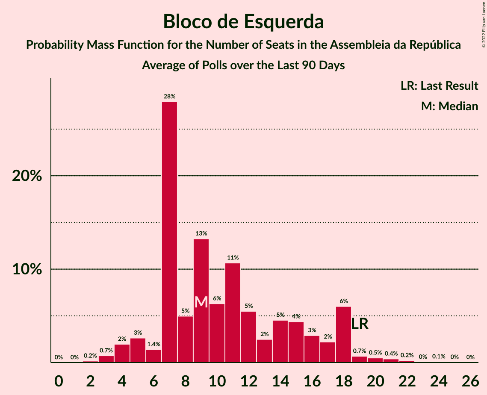

# Poll Average

<a href="#voting-intentions">Voting Intentions</a> | <a href="#seats">Seats</a> | <a href="#coalitions">Coalitions</a> | <a href="#technical-information">Technical Information</a>

## Summary

The table below lists the polls on which the average is based. They are the most recent polls (less than 90 days old) registered and analyzed so far.

| Period     | Polling firm/Commissioner(s) | PSD | CDS–PP | PS | BE | CDU | PAN | L | IL | A | CH |
|:----------:|:----------------------------:|:--:|:--:|:--:|:--:|:--:|:--:|:--:|:--:|:--:|:--:|
| 4 October 2015 | General Election | 36.9%   89 | 36.9%   18 | 32.3%   86 | 10.2%   19 | 8.2%   17 | 1.4%   1 | 0.7%   0 | 0.0%   0 | 0.0%   0 | 0.0%   0 |
| N/A | Poll Average | 21–29%   59–84 | 3–7%   2–13 | 34–44%   97–127 | 8–13%   17–27 | 5–10%   7–20 | 2–6%   2–9 | 0–3%   0–2 | 0–3%   0–2 | 0–2%   0 | 0–2%   0–2 |
| [24–27 September 2019](2019-09-27-Pitagórica.html) | Pitagórica   Jornal de Notícias | 23–30%   66–91 | 2–6%   2–7 | 33–41%   95–117 | 8–13%   17–29 | 5–9%   6–18 | 2–5%   2–6 | 1–3%   0–2 | 1–3%   0–3 | 0–2%   0 | 1–2%   0–2 |
| [21–25 September 2019](2019-09-25-Aximage.html) | Aximage   Jornal Económico | 22–29%   59–82 | 4–7%   3–13 | 34–41%   94–120 | 9–14%   17–31 | 5–9%   7–19 | 2–6%   2–8 | 1–3%   0–2 | 1–2%   0–2 | N/A   N/A | 1–3%   0–2 |
| [7–12 September 2019](2019-09-12-Eurosondagem.html) | Eurosondagem | 22–25%   60–74 | 5–7%   6–11 | 36–40%   107–121 | 8–11%   17–24 | 6–8%   10–18 | 4–5%   4–8 | N/A   N/A | N/A   N/A | N/A   N/A | N/A   N/A |
| [2–11 September 2019](2019-09-11-Intercampus.html) | Intercampus   Correio da Manhã and Negócios | 21–27%   56–75 | 5–8%   6–17 | 35–41%   100–120 | 8–12%   15–26 | 7–11%   13–22 | 4–7%   5–13 | N/A   N/A | N/A   N/A | N/A   N/A | N/A   N/A |
| [24 August–5 September 2019](2019-09-05-GfKMetris.html) | GfK Metris   Expresso and SIC Notícias | 20–26%   59–72 | 4–7%   4–10 | 38–45%   114–131 | 7–11%   15–24 | 5–8%   8–16 | 3–6%   4–9 | 0–1%   0 | 0–1%   0 | 0–1%   0 | 0–1%   0 |
| 4 October 2015 | General Election | 36.9%   89 | 36.9%   18 | 32.3%   86 | 10.2%   19 | 8.2%   17 | 1.4%   1 | 0.7%   0 | 0.0%   0 | 0.0%   0 | 0.0%   0 |

Only polls for which at least the sample size has been published are included in the table above.

**Legend:**
+ **Top half of each row:** Voting intentions (95% confidence interval)
+ **Bottom half of each row:** Seat projections for the Assembleia da República (95% confidence interval)
+ **PSD:** Partido Social Democrata
+ **CDS–PP:** CDS–Partido Popular
+ **PS:** Partido Socialista
+ **BE:** Bloco de Esquerda
+ **CDU:** Coligação Democrática Unitária
+ **PAN:** Pessoas–Animais–Natureza
+ **L:** LIVRE
+ **IL:** Iniciativa Liberal
+ **A:** Aliança
+ **CH:** Chega
+ **N/A (single party):** Party not included the published results
+ **N/A (entire row):** Calculation for this opinion poll not started yet

## Voting Intentions

### Confidence Intervals

| Party | Last Result | Median | 80% Confidence Interval | 90% Confidence Interval | 95% Confidence Interval | 99% Confidence Interval |
|:-----:|:-----------:|:------:|:-----------------------:|:-----------------------:|:-----------------------:|:-----------------------:|
| <a href="#partido-social-democrata">Partido Social Democrata</a> | 36.9% | 24.0% | 21.9–27.2% |21.3–28.1% | 20.8–28.9% | 19.8–30.3% |
| <a href="#cds–partido-popular">CDS–Partido Popular</a> | 36.9% | 5.3% | 3.7–6.6% |3.3–7.1% | 2.9–7.4% | 2.4–8.2% |
| <a href="#partido-socialista">Partido Socialista</a> | 32.3% | 38.3% | 35.7–41.8% |34.9–42.8% | 34.2–43.6% | 32.9–45.0% |
| <a href="#bloco-de-esquerda">Bloco de Esquerda</a> | 10.2% | 9.9% | 8.5–11.8% |8.0–12.4% | 7.7–12.9% | 7.0–13.9% |
| <a href="#coligação-democrática-unitária">Coligação Democrática Unitária</a> | 8.2% | 7.0% | 5.5–8.8% |5.2–9.4% | 4.9–9.9% | 4.4–10.8% |
| <a href="#pessoas–animais–natureza">Pessoas–Animais–Natureza</a> | 1.4% | 4.2% | 3.0–5.5% |2.7–5.9% | 2.4–6.3% | 2.0–7.0% |
| <a href="#livre">LIVRE</a> | 0.7% | 1.3% | 0.2–2.2% |0.2–2.5% | 0.1–2.8% | 0.1–3.3% |
| <a href="#iniciativa-liberal">Iniciativa Liberal</a> | 0.0% | 1.2% | 0.2–2.5% |0.2–2.8% | 0.1–3.1% | 0.1–3.6% |
| <a href="#aliança">Aliança</a> | 0.0% | 0.5% | 0.2–1.1% |0.1–1.3% | 0.1–1.5% | 0.1–1.9% |
| <a href="#chega">Chega</a> | 0.0% | 1.1% | 0.2–2.0% |0.2–2.3% | 0.1–2.5% | 0.1–3.0% |

### Partido Social Democrata

*For a full overview of the results for this party, see the [Partido Social Democrata](party-partidosocialdemocrata.html) page.*

| Voting Intentions | Probability | Accumulated | Special Marks |
|:-----------------:|:-----------:|:-----------:|:-------------:|
| 17.5–18.5% | 0% | 100% |  |
| 18.5–19.5% | 0.3% | 100% |  |
| 19.5–20.5% | 1.4% | 99.7% |  |
| 20.5–21.5% | 5% | 98% |  |
| 21.5–22.5% | 13% | 93% |  |
| 22.5–23.5% | 21% | 81% |  |
| 23.5–24.5% | 20% | 60% | Median |
| 24.5–25.5% | 14% | 40% |  |
| 25.5–26.5% | 10% | 26% |  |
| 26.5–27.5% | 7% | 15% |  |
| 27.5–28.5% | 4% | 8% |  |
| 28.5–29.5% | 2% | 3% |  |
| 29.5–30.5% | 0.9% | 1.2% |  |
| 30.5–31.5% | 0.3% | 0.4% |  |
| 31.5–32.5% | 0.1% | 0.1% |  |
| 32.5–33.5% | 0% | 0% |  |
| 33.5–34.5% | 0% | 0% |  |
| 34.5–35.5% | 0% | 0% |  |
| 35.5–36.5% | 0% | 0% |  |
| 36.5–37.5% | 0% | 0% | Last Result |

### CDS–Partido Popular

*For a full overview of the results for this party, see the [CDS–Partido Popular](party-cds–partidopopular.html) page.*

| Voting Intentions | Probability | Accumulated | Special Marks |
|:-----------------:|:-----------:|:-----------:|:-------------:|
| 0.5–1.5% | 0% | 100% |  |
| 1.5–2.5% | 0.7% | 100% |  |
| 2.5–3.5% | 8% | 99.3% |  |
| 3.5–4.5% | 18% | 92% |  |
| 4.5–5.5% | 34% | 74% | Median |
| 5.5–6.5% | 29% | 40% |  |
| 6.5–7.5% | 9% | 11% |  |
| 7.5–8.5% | 2% | 2% |  |
| 8.5–9.5% | 0.2% | 0.2% |  |
| 9.5–10.5% | 0% | 0% |  |
| 10.5–11.5% | 0% | 0% |  |
| 11.5–12.5% | 0% | 0% |  |
| 12.5–13.5% | 0% | 0% |  |
| 13.5–14.5% | 0% | 0% |  |
| 14.5–15.5% | 0% | 0% |  |
| 15.5–16.5% | 0% | 0% |  |
| 16.5–17.5% | 0% | 0% |  |
| 17.5–18.5% | 0% | 0% |  |
| 18.5–19.5% | 0% | 0% |  |
| 19.5–20.5% | 0% | 0% |  |
| 20.5–21.5% | 0% | 0% |  |
| 21.5–22.5% | 0% | 0% |  |
| 22.5–23.5% | 0% | 0% |  |
| 23.5–24.5% | 0% | 0% |  |
| 24.5–25.5% | 0% | 0% |  |
| 25.5–26.5% | 0% | 0% |  |
| 26.5–27.5% | 0% | 0% |  |
| 27.5–28.5% | 0% | 0% |  |
| 28.5–29.5% | 0% | 0% |  |
| 29.5–30.5% | 0% | 0% |  |
| 30.5–31.5% | 0% | 0% |  |
| 31.5–32.5% | 0% | 0% |  |
| 32.5–33.5% | 0% | 0% |  |
| 33.5–34.5% | 0% | 0% |  |
| 34.5–35.5% | 0% | 0% |  |
| 35.5–36.5% | 0% | 0% |  |
| 36.5–37.5% | 0% | 0% | Last Result |

### Partido Socialista

*For a full overview of the results for this party, see the [Partido Socialista](party-partidosocialista.html) page.*

| Voting Intentions | Probability | Accumulated | Special Marks |
|:-----------------:|:-----------:|:-----------:|:-------------:|
| 30.5–31.5% | 0.1% | 100% |  |
| 31.5–32.5% | 0.2% | 99.9% | Last Result |
| 32.5–33.5% | 0.9% | 99.7% |  |
| 33.5–34.5% | 3% | 98.8% |  |
| 34.5–35.5% | 5% | 96% |  |
| 35.5–36.5% | 10% | 91% |  |
| 36.5–37.5% | 16% | 81% |  |
| 37.5–38.5% | 19% | 65% | Median |
| 38.5–39.5% | 16% | 45% |  |
| 39.5–40.5% | 10% | 29% |  |
| 40.5–41.5% | 7% | 18% |  |
| 41.5–42.5% | 5% | 11% |  |
| 42.5–43.5% | 3% | 6% |  |
| 43.5–44.5% | 2% | 3% |  |
| 44.5–45.5% | 0.7% | 0.9% |  |
| 45.5–46.5% | 0.2% | 0.2% |  |
| 46.5–47.5% | 0% | 0% |  |
| 47.5–48.5% | 0% | 0% |  |

### Bloco de Esquerda

*For a full overview of the results for this party, see the [Bloco de Esquerda](party-blocodeesquerda.html) page.*

| Voting Intentions | Probability | Accumulated | Special Marks |
|:-----------------:|:-----------:|:-----------:|:-------------:|
| 4.5–5.5% | 0% | 100% |  |
| 5.5–6.5% | 0.1% | 100% |  |
| 6.5–7.5% | 2% | 99.9% |  |
| 7.5–8.5% | 10% | 98% |  |
| 8.5–9.5% | 28% | 88% |  |
| 9.5–10.5% | 30% | 60% | Last Result, Median |
| 10.5–11.5% | 18% | 30% |  |
| 11.5–12.5% | 8% | 12% |  |
| 12.5–13.5% | 3% | 4% |  |
| 13.5–14.5% | 0.8% | 0.9% |  |
| 14.5–15.5% | 0.1% | 0.2% |  |
| 15.5–16.5% | 0% | 0% |  |

### Coligação Democrática Unitária

*For a full overview of the results for this party, see the [Coligação Democrática Unitária](party-coligaçãodemocráticaunitária.html) page.*

| Voting Intentions | Probability | Accumulated | Special Marks |
|:-----------------:|:-----------:|:-----------:|:-------------:|
| 2.5–3.5% | 0% | 100% |  |
| 3.5–4.5% | 1.0% | 100% |  |
| 4.5–5.5% | 9% | 99.0% |  |
| 5.5–6.5% | 25% | 90% |  |
| 6.5–7.5% | 33% | 64% | Median |
| 7.5–8.5% | 18% | 32% | Last Result |
| 8.5–9.5% | 9% | 13% |  |
| 9.5–10.5% | 3% | 4% |  |
| 10.5–11.5% | 0.7% | 0.8% |  |
| 11.5–12.5% | 0.1% | 0.1% |  |
| 12.5–13.5% | 0% | 0% |  |

### Pessoas–Animais–Natureza

*For a full overview of the results for this party, see the [Pessoas–Animais–Natureza](party-pessoas–animais–natureza.html) page.*

| Voting Intentions | Probability | Accumulated | Special Marks |
|:-----------------:|:-----------:|:-----------:|:-------------:|
| 0.5–1.5% | 0% | 100% | Last Result |
| 1.5–2.5% | 4% | 100% |  |
| 2.5–3.5% | 22% | 96% |  |
| 3.5–4.5% | 39% | 75% | Median |
| 4.5–5.5% | 27% | 36% |  |
| 5.5–6.5% | 8% | 9% |  |
| 6.5–7.5% | 1.4% | 1.5% |  |
| 7.5–8.5% | 0.1% | 0.1% |  |
| 8.5–9.5% | 0% | 0% |  |

### LIVRE

*For a full overview of the results for this party, see the [LIVRE](party-livre.html) page.*

| Voting Intentions | Probability | Accumulated | Special Marks |
|:-----------------:|:-----------:|:-----------:|:-------------:|
| 0.0–0.5% | 27% | 100% |  |
| 0.5–1.5% | 37% | 73% | Last Result, Median |
| 1.5–2.5% | 31% | 36% |  |
| 2.5–3.5% | 4% | 4% |  |
| 3.5–4.5% | 0.2% | 0.2% |  |
| 4.5–5.5% | 0% | 0% |  |

### Iniciativa Liberal

*For a full overview of the results for this party, see the [Iniciativa Liberal](party-iniciativaliberal.html) page.*

| Voting Intentions | Probability | Accumulated | Special Marks |
|:-----------------:|:-----------:|:-----------:|:-------------:|
| 0.0–0.5% | 28% | 100% | Last Result |
| 0.5–1.5% | 34% | 72% | Median |
| 1.5–2.5% | 29% | 38% |  |
| 2.5–3.5% | 8% | 8% |  |
| 3.5–4.5% | 0.6% | 0.6% |  |
| 4.5–5.5% | 0% | 0% |  |

### Aliança

*For a full overview of the results for this party, see the [Aliança](party-aliança.html) page.*

| Voting Intentions | Probability | Accumulated | Special Marks |
|:-----------------:|:-----------:|:-----------:|:-------------:|
| 0.0–0.5% | 53% | 100% | Last Result |
| 0.5–1.5% | 45% | 47% | Median |
| 1.5–2.5% | 2% | 2% |  |
| 2.5–3.5% | 0% | 0% |  |

### Chega

*For a full overview of the results for this party, see the [Chega](party-chega.html) page.*

| Voting Intentions | Probability | Accumulated | Special Marks |
|:-----------------:|:-----------:|:-----------:|:-------------:|
| 0.0–0.5% | 28% | 100% | Last Result |
| 0.5–1.5% | 45% | 72% | Median |
| 1.5–2.5% | 25% | 28% |  |
| 2.5–3.5% | 2% | 2% |  |
| 3.5–4.5% | 0.1% | 0.1% |  |
| 4.5–5.5% | 0% | 0% |  |

## Seats

### Confidence Intervals

| Party | Last Result | Median | 80% Confidence Interval | 90% Confidence Interval | 95% Confidence Interval | 99% Confidence Interval |
|:-----:|:-----------:|:------:|:-----------------------:|:-----------------------:|:-----------------------:|:-----------------------:|
| <a href="#partido-social-democrata">Partido Social Democrata</a> | 89 | 68 | 61–77 |60–81 | 59–84 | 55–91 |
| <a href="#cds–partido-popular">CDS–Partido Popular</a> | 18 | 7 | 4–11 |2–12 | 2–13 | 2–17 |
| <a href="#partido-socialista">Partido Socialista</a> | 86 | 113 | 103–127 |99–127 | 97–127 | 93–131 |
| <a href="#bloco-de-esquerda">Bloco de Esquerda</a> | 19 | 21 | 18–25 |17–26 | 17–27 | 14–32 |
| <a href="#coligação-democrática-unitária">Coligação Democrática Unitária</a> | 17 | 14 | 9–18 |8–19 | 7–20 | 6–22 |
| <a href="#pessoas–animais–natureza">Pessoas–Animais–Natureza</a> | 1 | 6 | 3–8 |3–9 | 2–9 | 2–13 |
| <a href="#livre">LIVRE</a> | 0 | 1 | 0–2 |0–2 | 0–2 | 0–4 |
| <a href="#iniciativa-liberal">Iniciativa Liberal</a> | 0 | 0 | 0–2 |0–2 | 0–2 | 0–4 |
| <a href="#aliança">Aliança</a> | 0 | 0 | 0 |0 | 0 | 0 |
| <a href="#chega">Chega</a> | 0 | 0 | 0 |0–2 | 0–2 | 0–2 |

### Partido Social Democrata

*For a full overview of the results for this party, see the [Partido Social Democrata](party-partidosocialdemocrata.html) page.*

| Number of Seats | Probability | Accumulated | Special Marks |
|:---------------:|:-----------:|:-----------:|:-------------:|
| 53 | 0% | 100% |  |
| 54 | 0.1% | 99.9% |  |
| 55 | 0.3% | 99.8% |  |
| 56 | 0.5% | 99.5% |  |
| 57 | 0.5% | 99.0% |  |
| 58 | 0.5% | 98% |  |
| 59 | 2% | 98% |  |
| 60 | 2% | 96% |  |
| 61 | 13% | 94% |  |
| 62 | 2% | 81% |  |
| 63 | 3% | 79% |  |
| 64 | 3% | 76% |  |
| 65 | 3% | 73% |  |
| 66 | 6% | 70% |  |
| 67 | 9% | 64% |  |
| 68 | 5% | 55% | Median |
| 69 | 4% | 49% |  |
| 70 | 6% | 45% |  |
| 71 | 9% | 39% |  |
| 72 | 2% | 30% |  |
| 73 | 4% | 28% |  |
| 74 | 4% | 25% |  |
| 75 | 1.2% | 20% |  |
| 76 | 5% | 19% |  |
| 77 | 5% | 14% |  |
| 78 | 1.4% | 9% |  |
| 79 | 0.8% | 8% |  |
| 80 | 1.4% | 7% |  |
| 81 | 2% | 6% |  |
| 82 | 0.8% | 4% |  |
| 83 | 0.2% | 3% |  |
| 84 | 1.4% | 3% |  |
| 85 | 0.3% | 1.5% |  |
| 86 | 0.1% | 1.2% |  |
| 87 | 0.1% | 1.0% |  |
| 88 | 0.1% | 0.9% |  |
| 89 | 0% | 0.8% | Last Result |
| 90 | 0.1% | 0.8% |  |
| 91 | 0.4% | 0.7% |  |
| 92 | 0% | 0.3% |  |
| 93 | 0% | 0.3% |  |
| 94 | 0.1% | 0.3% |  |
| 95 | 0.2% | 0.2% |  |
| 96 | 0% | 0% |  |

### CDS–Partido Popular

*For a full overview of the results for this party, see the [CDS–Partido Popular](party-cds–partidopopular.html) page.*

| Number of Seats | Probability | Accumulated | Special Marks |
|:---------------:|:-----------:|:-----------:|:-------------:|
| 2 | 5% | 100% |  |
| 3 | 1.3% | 95% |  |
| 4 | 11% | 94% |  |
| 5 | 0.6% | 82% |  |
| 6 | 25% | 82% |  |
| 7 | 16% | 57% | Median |
| 8 | 17% | 41% |  |
| 9 | 5% | 24% |  |
| 10 | 8% | 18% |  |
| 11 | 5% | 10% |  |
| 12 | 2% | 5% |  |
| 13 | 0.8% | 3% |  |
| 14 | 0.7% | 2% |  |
| 15 | 0.5% | 1.5% |  |
| 16 | 0.4% | 1.0% |  |
| 17 | 0.3% | 0.6% |  |
| 18 | 0.2% | 0.3% | Last Result |
| 19 | 0.1% | 0.1% |  |
| 20 | 0% | 0% |  |

### Partido Socialista

*For a full overview of the results for this party, see the [Partido Socialista](party-partidosocialista.html) page.*

| Number of Seats | Probability | Accumulated | Special Marks |
|:---------------:|:-----------:|:-----------:|:-------------:|
| 86 | 0% | 100% | Last Result |
| 87 | 0% | 100% |  |
| 88 | 0% | 100% |  |
| 89 | 0.1% | 99.9% |  |
| 90 | 0% | 99.8% |  |
| 91 | 0.1% | 99.8% |  |
| 92 | 0.1% | 99.7% |  |
| 93 | 0.4% | 99.6% |  |
| 94 | 0.2% | 99.3% |  |
| 95 | 0.1% | 99.0% |  |
| 96 | 1.0% | 98.9% |  |
| 97 | 2% | 98% |  |
| 98 | 0.5% | 96% |  |
| 99 | 0.7% | 95% |  |
| 100 | 0.8% | 94% |  |
| 101 | 1.4% | 94% |  |
| 102 | 1.3% | 92% |  |
| 103 | 2% | 91% |  |
| 104 | 3% | 89% |  |
| 105 | 8% | 86% |  |
| 106 | 3% | 78% |  |
| 107 | 2% | 75% |  |
| 108 | 2% | 73% |  |
| 109 | 3% | 70% |  |
| 110 | 4% | 67% |  |
| 111 | 5% | 64% |  |
| 112 | 5% | 59% |  |
| 113 | 9% | 54% | Median |
| 114 | 4% | 45% |  |
| 115 | 8% | 41% |  |
| 116 | 4% | 33% | Majority |
| 117 | 7% | 29% |  |
| 118 | 5% | 22% |  |
| 119 | 2% | 17% |  |
| 120 | 1.4% | 15% |  |
| 121 | 0.8% | 14% |  |
| 122 | 1.3% | 13% |  |
| 123 | 0.5% | 12% |  |
| 124 | 0.3% | 11% |  |
| 125 | 0.2% | 11% |  |
| 126 | 0.3% | 11% |  |
| 127 | 8% | 11% |  |
| 128 | 0.4% | 2% |  |
| 129 | 1.4% | 2% |  |
| 130 | 0% | 0.5% |  |
| 131 | 0.2% | 0.5% |  |
| 132 | 0.2% | 0.4% |  |
| 133 | 0% | 0.1% |  |
| 134 | 0% | 0.1% |  |
| 135 | 0.1% | 0.1% |  |
| 136 | 0% | 0% |  |

### Bloco de Esquerda

*For a full overview of the results for this party, see the [Bloco de Esquerda](party-blocodeesquerda.html) page.*

| Number of Seats | Probability | Accumulated | Special Marks |
|:---------------:|:-----------:|:-----------:|:-------------:|
| 11 | 0% | 100% |  |
| 12 | 0% | 99.9% |  |
| 13 | 0.1% | 99.9% |  |
| 14 | 0.4% | 99.7% |  |
| 15 | 0.8% | 99.3% |  |
| 16 | 0.8% | 98.5% |  |
| 17 | 5% | 98% |  |
| 18 | 15% | 92% |  |
| 19 | 8% | 78% | Last Result |
| 20 | 12% | 69% |  |
| 21 | 17% | 57% | Median |
| 22 | 8% | 40% |  |
| 23 | 7% | 32% |  |
| 24 | 14% | 26% |  |
| 25 | 2% | 11% |  |
| 26 | 6% | 10% |  |
| 27 | 1.3% | 4% |  |
| 28 | 1.1% | 2% |  |
| 29 | 0.2% | 1.3% |  |
| 30 | 0.4% | 1.1% |  |
| 31 | 0.2% | 0.7% |  |
| 32 | 0.3% | 0.6% |  |
| 33 | 0.1% | 0.3% |  |
| 34 | 0.1% | 0.2% |  |
| 35 | 0.1% | 0.2% |  |
| 36 | 0% | 0.1% |  |
| 37 | 0% | 0.1% |  |
| 38 | 0% | 0% |  |

### Coligação Democrática Unitária

*For a full overview of the results for this party, see the [Coligação Democrática Unitária](party-coligaçãodemocráticaunitária.html) page.*

| Number of Seats | Probability | Accumulated | Special Marks |
|:---------------:|:-----------:|:-----------:|:-------------:|
| 5 | 0.3% | 100% |  |
| 6 | 1.0% | 99.7% |  |
| 7 | 1.3% | 98.7% |  |
| 8 | 4% | 97% |  |
| 9 | 12% | 93% |  |
| 10 | 5% | 81% |  |
| 11 | 3% | 76% |  |
| 12 | 1.3% | 73% |  |
| 13 | 9% | 72% |  |
| 14 | 26% | 62% | Median |
| 15 | 6% | 36% |  |
| 16 | 4% | 30% |  |
| 17 | 14% | 26% | Last Result |
| 18 | 4% | 12% |  |
| 19 | 5% | 9% |  |
| 20 | 2% | 4% |  |
| 21 | 0.8% | 1.5% |  |
| 22 | 0.4% | 0.7% |  |
| 23 | 0.1% | 0.3% |  |
| 24 | 0.2% | 0.2% |  |
| 25 | 0% | 0% |  |

### Pessoas–Animais–Natureza

*For a full overview of the results for this party, see the [Pessoas–Animais–Natureza](party-pessoas–animais–natureza.html) page.*

| Number of Seats | Probability | Accumulated | Special Marks |
|:---------------:|:-----------:|:-----------:|:-------------:|
| 1 | 0.2% | 100% | Last Result |
| 2 | 3% | 99.8% |  |
| 3 | 16% | 97% |  |
| 4 | 20% | 81% |  |
| 5 | 2% | 61% |  |
| 6 | 43% | 59% | Median |
| 7 | 3% | 16% |  |
| 8 | 6% | 13% |  |
| 9 | 5% | 7% |  |
| 10 | 0.8% | 2% |  |
| 11 | 0.4% | 1.5% |  |
| 12 | 0.3% | 1.1% |  |
| 13 | 0.5% | 0.8% |  |
| 14 | 0.2% | 0.3% |  |
| 15 | 0% | 0.1% |  |
| 16 | 0% | 0% |  |

### LIVRE

*For a full overview of the results for this party, see the [LIVRE](party-livre.html) page.*

| Number of Seats | Probability | Accumulated | Special Marks |
|:---------------:|:-----------:|:-----------:|:-------------:|
| 0 | 38% | 100% | Last Result |
| 1 | 52% | 62% | Median |
| 2 | 9% | 10% |  |
| 3 | 0.3% | 1.0% |  |
| 4 | 0.1% | 0.6% |  |
| 5 | 0.5% | 0.5% |  |
| 6 | 0% | 0% |  |

### Iniciativa Liberal

*For a full overview of the results for this party, see the [Iniciativa Liberal](party-iniciativaliberal.html) page.*

| Number of Seats | Probability | Accumulated | Special Marks |
|:---------------:|:-----------:|:-----------:|:-------------:|
| 0 | 72% | 100% | Last Result, Median |
| 1 | 9% | 28% |  |
| 2 | 17% | 18% |  |
| 3 | 0% | 0.9% |  |
| 4 | 0.5% | 0.8% |  |
| 5 | 0.1% | 0.3% |  |
| 6 | 0.2% | 0.2% |  |
| 7 | 0% | 0% |  |

### Aliança

*For a full overview of the results for this party, see the [Aliança](party-aliança.html) page.*

| Number of Seats | Probability | Accumulated | Special Marks |
|:---------------:|:-----------:|:-----------:|:-------------:|
| 0 | 99.9% | 100% | Last Result, Median |
| 1 | 0% | 0.1% |  |
| 2 | 0.1% | 0.1% |  |
| 3 | 0% | 0% |  |

### Chega

*For a full overview of the results for this party, see the [Chega](party-chega.html) page.*

| Number of Seats | Probability | Accumulated | Special Marks |
|:---------------:|:-----------:|:-----------:|:-------------:|
| 0 | 92% | 100% | Last Result, Median |
| 1 | 0.6% | 8% |  |
| 2 | 7% | 7% |  |
| 3 | 0.2% | 0.3% |  |
| 4 | 0.1% | 0.1% |  |
| 5 | 0% | 0% |  |

## Coalitions

### Confidence Intervals

| Coalition | Last Result | Median | Majority? | 80% Confidence Interval | 90% Confidence Interval | 95% Confidence Interval | 99% Confidence Interval |
|:---------:|:-----------:|:------:|:---------:|:-----------------------:|:-----------------------:|:-----------------------:|:-----------------------:|
| Partido Socialista – Bloco de Esquerda – Coligação Democrática Unitária | 122 | 148 | 100% | 139–157 | 135–157 | 133–159 | 126–161 |
| Partido Socialista – Bloco de Esquerda | 105 | 134 | 99.4% | 124–147 | 121–148 | 120–148 | 115–152 |
| Partido Socialista – Coligação Democrática Unitária | 103 | 127 | 91% | 117–136 | 112–136 | 109–138 | 103–143 |
| Partido Socialista | 86 | 113 | 33% | 103–127 | 99–127 | 97–127 | 93–131 |
| CDS–Partido Popular – Partido Social Democrata | 107 | 76 | 0% | 67–84 | 67–88 | 65–90 | 63–97 |

### Partido Socialista – Bloco de Esquerda – Coligação Democrática Unitária

| Number of Seats | Probability | Accumulated | Special Marks |
|:---------------:|:-----------:|:-----------:|:-------------:|
| 121 | 0.1% | 100% |  |
| 122 | 0% | 99.9% | Last Result |
| 123 | 0% | 99.9% |  |
| 124 | 0.1% | 99.8% |  |
| 125 | 0.1% | 99.7% |  |
| 126 | 0.3% | 99.6% |  |
| 127 | 0.1% | 99.3% |  |
| 128 | 0% | 99.2% |  |
| 129 | 0.2% | 99.2% |  |
| 130 | 0.1% | 99.0% |  |
| 131 | 0.2% | 98.9% |  |
| 132 | 0.2% | 98.7% |  |
| 133 | 2% | 98% |  |
| 134 | 0.8% | 96% |  |
| 135 | 1.1% | 95% |  |
| 136 | 1.0% | 94% |  |
| 137 | 1.2% | 93% |  |
| 138 | 2% | 92% |  |
| 139 | 1.1% | 91% |  |
| 140 | 2% | 89% |  |
| 141 | 2% | 88% |  |
| 142 | 5% | 86% |  |
| 143 | 2% | 81% |  |
| 144 | 6% | 78% |  |
| 145 | 8% | 72% |  |
| 146 | 5% | 64% |  |
| 147 | 6% | 58% |  |
| 148 | 5% | 52% | Median |
| 149 | 10% | 47% |  |
| 150 | 4% | 37% |  |
| 151 | 4% | 33% |  |
| 152 | 9% | 29% |  |
| 153 | 3% | 20% |  |
| 154 | 2% | 18% |  |
| 155 | 3% | 16% |  |
| 156 | 1.4% | 14% |  |
| 157 | 9% | 12% |  |
| 158 | 0.4% | 3% |  |
| 159 | 0.3% | 3% |  |
| 160 | 0.5% | 2% |  |
| 161 | 1.5% | 2% |  |
| 162 | 0.1% | 0.4% |  |
| 163 | 0.3% | 0.3% |  |
| 164 | 0% | 0% |  |

### Partido Socialista – Bloco de Esquerda

| Number of Seats | Probability | Accumulated | Special Marks |
|:---------------:|:-----------:|:-----------:|:-------------:|
| 105 | 0% | 100% | Last Result |
| 106 | 0% | 100% |  |
| 107 | 0% | 100% |  |
| 108 | 0% | 100% |  |
| 109 | 0% | 100% |  |
| 110 | 0% | 100% |  |
| 111 | 0.1% | 100% |  |
| 112 | 0% | 99.9% |  |
| 113 | 0.1% | 99.8% |  |
| 114 | 0.1% | 99.8% |  |
| 115 | 0.2% | 99.7% |  |
| 116 | 0.3% | 99.4% | Majority |
| 117 | 0.8% | 99.1% |  |
| 118 | 0.3% | 98% |  |
| 119 | 0.4% | 98% |  |
| 120 | 2% | 98% |  |
| 121 | 1.4% | 95% |  |
| 122 | 1.5% | 94% |  |
| 123 | 1.2% | 92% |  |
| 124 | 1.3% | 91% |  |
| 125 | 3% | 90% |  |
| 126 | 1.3% | 87% |  |
| 127 | 2% | 86% |  |
| 128 | 5% | 84% |  |
| 129 | 7% | 79% |  |
| 130 | 4% | 72% |  |
| 131 | 6% | 68% |  |
| 132 | 4% | 62% |  |
| 133 | 5% | 58% |  |
| 134 | 7% | 53% | Median |
| 135 | 12% | 46% |  |
| 136 | 5% | 35% |  |
| 137 | 5% | 30% |  |
| 138 | 3% | 25% |  |
| 139 | 2% | 22% |  |
| 140 | 3% | 20% |  |
| 141 | 1.1% | 17% |  |
| 142 | 4% | 16% |  |
| 143 | 0.6% | 12% |  |
| 144 | 0.3% | 12% |  |
| 145 | 0.3% | 11% |  |
| 146 | 0.2% | 11% |  |
| 147 | 2% | 11% |  |
| 148 | 8% | 9% |  |
| 149 | 0.1% | 1.0% |  |
| 150 | 0% | 0.9% |  |
| 151 | 0% | 0.9% |  |
| 152 | 0.7% | 0.8% |  |
| 153 | 0.1% | 0.1% |  |
| 154 | 0% | 0.1% |  |
| 155 | 0% | 0% |  |

### Partido Socialista – Coligação Democrática Unitária

| Number of Seats | Probability | Accumulated | Special Marks |
|:---------------:|:-----------:|:-----------:|:-------------:|
| 97 | 0.1% | 100% |  |
| 98 | 0.1% | 99.9% |  |
| 99 | 0% | 99.8% |  |
| 100 | 0% | 99.8% |  |
| 101 | 0% | 99.8% |  |
| 102 | 0.2% | 99.7% |  |
| 103 | 0.1% | 99.5% | Last Result |
| 104 | 0% | 99.4% |  |
| 105 | 0.1% | 99.4% |  |
| 106 | 0.2% | 99.3% |  |
| 107 | 0.2% | 99.1% |  |
| 108 | 0.4% | 98.9% |  |
| 109 | 1.1% | 98.5% |  |
| 110 | 2% | 97% |  |
| 111 | 0.3% | 95% |  |
| 112 | 0.4% | 95% |  |
| 113 | 1.4% | 95% |  |
| 114 | 0.8% | 93% |  |
| 115 | 0.9% | 92% |  |
| 116 | 1.1% | 91% | Majority |
| 117 | 0.6% | 90% |  |
| 118 | 1.3% | 90% |  |
| 119 | 4% | 88% |  |
| 120 | 5% | 84% |  |
| 121 | 5% | 79% |  |
| 122 | 3% | 74% |  |
| 123 | 4% | 71% |  |
| 124 | 5% | 68% |  |
| 125 | 4% | 63% |  |
| 126 | 4% | 59% |  |
| 127 | 5% | 55% | Median |
| 128 | 7% | 50% |  |
| 129 | 5% | 43% |  |
| 130 | 7% | 37% |  |
| 131 | 9% | 31% |  |
| 132 | 2% | 22% |  |
| 133 | 2% | 20% |  |
| 134 | 3% | 18% |  |
| 135 | 1.4% | 15% |  |
| 136 | 9% | 13% |  |
| 137 | 0.9% | 4% |  |
| 138 | 0.6% | 3% |  |
| 139 | 0.2% | 2% |  |
| 140 | 0.1% | 2% |  |
| 141 | 0.2% | 2% |  |
| 142 | 0.2% | 2% |  |
| 143 | 2% | 2% |  |
| 144 | 0% | 0% |  |

### Partido Socialista

| Number of Seats | Probability | Accumulated | Special Marks |
|:---------------:|:-----------:|:-----------:|:-------------:|
| 86 | 0% | 100% | Last Result |
| 87 | 0% | 100% |  |
| 88 | 0% | 100% |  |
| 89 | 0.1% | 99.9% |  |
| 90 | 0% | 99.8% |  |
| 91 | 0.1% | 99.8% |  |
| 92 | 0.1% | 99.7% |  |
| 93 | 0.4% | 99.6% |  |
| 94 | 0.2% | 99.3% |  |
| 95 | 0.1% | 99.0% |  |
| 96 | 1.0% | 98.9% |  |
| 97 | 2% | 98% |  |
| 98 | 0.5% | 96% |  |
| 99 | 0.7% | 95% |  |
| 100 | 0.8% | 94% |  |
| 101 | 1.4% | 94% |  |
| 102 | 1.3% | 92% |  |
| 103 | 2% | 91% |  |
| 104 | 3% | 89% |  |
| 105 | 8% | 86% |  |
| 106 | 3% | 78% |  |
| 107 | 2% | 75% |  |
| 108 | 2% | 73% |  |
| 109 | 3% | 70% |  |
| 110 | 4% | 67% |  |
| 111 | 5% | 64% |  |
| 112 | 5% | 59% |  |
| 113 | 9% | 54% | Median |
| 114 | 4% | 45% |  |
| 115 | 8% | 41% |  |
| 116 | 4% | 33% | Majority |
| 117 | 7% | 29% |  |
| 118 | 5% | 22% |  |
| 119 | 2% | 17% |  |
| 120 | 1.4% | 15% |  |
| 121 | 0.8% | 14% |  |
| 122 | 1.3% | 13% |  |
| 123 | 0.5% | 12% |  |
| 124 | 0.3% | 11% |  |
| 125 | 0.2% | 11% |  |
| 126 | 0.3% | 11% |  |
| 127 | 8% | 11% |  |
| 128 | 0.4% | 2% |  |
| 129 | 1.4% | 2% |  |
| 130 | 0% | 0.5% |  |
| 131 | 0.2% | 0.5% |  |
| 132 | 0.2% | 0.4% |  |
| 133 | 0% | 0.1% |  |
| 134 | 0% | 0.1% |  |
| 135 | 0.1% | 0.1% |  |
| 136 | 0% | 0% |  |

### CDS–Partido Popular – Partido Social Democrata

| Number of Seats | Probability | Accumulated | Special Marks |
|:---------------:|:-----------:|:-----------:|:-------------:|
| 61 | 0.3% | 100% |  |
| 62 | 0.1% | 99.6% |  |
| 63 | 0.2% | 99.5% |  |
| 64 | 0.6% | 99.3% |  |
| 65 | 2% | 98.7% |  |
| 66 | 0.8% | 97% |  |
| 67 | 10% | 96% |  |
| 68 | 2% | 86% |  |
| 69 | 2% | 85% |  |
| 70 | 2% | 83% |  |
| 71 | 2% | 80% |  |
| 72 | 3% | 78% |  |
| 73 | 4% | 75% |  |
| 74 | 10% | 71% |  |
| 75 | 11% | 61% | Median |
| 76 | 5% | 50% |  |
| 77 | 7% | 45% |  |
| 78 | 4% | 38% |  |
| 79 | 7% | 34% |  |
| 80 | 5% | 27% |  |
| 81 | 3% | 22% |  |
| 82 | 5% | 20% |  |
| 83 | 4% | 14% |  |
| 84 | 2% | 10% |  |
| 85 | 1.1% | 9% |  |
| 86 | 1.0% | 8% |  |
| 87 | 0.5% | 7% |  |
| 88 | 2% | 6% |  |
| 89 | 1.1% | 4% |  |
| 90 | 2% | 3% |  |
| 91 | 0.3% | 1.4% |  |
| 92 | 0.2% | 1.2% |  |
| 93 | 0.1% | 1.0% |  |
| 94 | 0.1% | 0.9% |  |
| 95 | 0% | 0.8% |  |
| 96 | 0% | 0.7% |  |
| 97 | 0.3% | 0.7% |  |
| 98 | 0.2% | 0.4% |  |
| 99 | 0% | 0.2% |  |
| 100 | 0.1% | 0.2% |  |
| 101 | 0% | 0.1% |  |
| 102 | 0.1% | 0.1% |  |
| 103 | 0% | 0% |  |
| 104 | 0% | 0% |  |
| 105 | 0% | 0% |  |
| 106 | 0% | 0% |  |
| 107 | 0% | 0% | Last Result |

## Technical Information

+ **Number of polls included in this average:** 5
+ **Lowest number of simulations done in a poll included in this average:** 131,072
+ **Total number of simulations done in the polls included in this average:** 2,621,440
+ **Error estimate:** 2.85%
