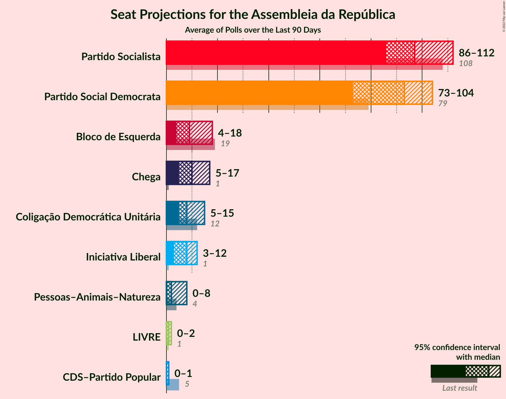

# Poll Average

<a href="#voting-intentions">Voting Intentions</a> | <a href="#seats">Seats</a> | <a href="#coalitions">Coalitions</a> | <a href="#technical-information">Technical Information</a>

## Summary

The table below lists the polls on which the average is based. They are the most recent polls (less than 90 days old) registered and analyzed so far.

| Period     | Polling firm/Commissioner(s) | PS | PSD | BE | CDU | CDS–PP | PAN | CH | IL | L | A |
|:----------:|:----------------------------:|:--:|:--:|:--:|:--:|:--:|:--:|:--:|:--:|:--:|:--:|
| 6 October 2019 | General Election | 36.4%   108 | 27.8%   79 | 9.5%   19 | 6.3%   12 | 4.2%   5 | 3.3%   4 | 1.3%   1 | 1.3%   1 | 1.1%   1 | 0.8%   0 |
| N/A | Poll Average | 35–41%   100–116 | 25–31%   69–85 | 7–10%   12–19 | 4–6%   5–10 | 2–4%   1–3 | 2–4%   2–4 | 5–8%   5–11 | 4–6%   5–11 | N/A   N/A | N/A   N/A |
| [3–7 May 2021](2021-05-07-CESOP–UCP.html) | CESOP–UCP   Público and RTP | 35–41%   100–116 | 25–31%   69–85 | 7–10%   12–19 | 4–6%   5–10 | 2–4%   1–3 | 2–4%   2–4 | 5–8%   5–11 | 4–6%   5–11 | N/A   N/A | N/A   N/A |
| [22–25 April 2021](2021-04-25-Aximage.html) | Aximage   Diário de Notícias, Jornal de Notícias and TSF Rádio Notícias | N/A   N/A | N/A   N/A | N/A   N/A | N/A   N/A | N/A   N/A | N/A   N/A | N/A   N/A | N/A   N/A | N/A   N/A | N/A   N/A |
| [7–13 April 2021](2021-04-13-Intercampus.html) | Intercampus   Correio da Manhã and Negócios | N/A   N/A | N/A   N/A | N/A   N/A | N/A   N/A | N/A   N/A | N/A   N/A | N/A   N/A | N/A   N/A | N/A   N/A | N/A   N/A |
| [5–13 April 2021](2021-04-13-ICSISCTE.html) | ICS/ISCTE   Expresso and SIC Notícias | N/A   N/A | N/A   N/A | N/A   N/A | N/A   N/A | N/A   N/A | N/A   N/A | N/A   N/A | N/A   N/A | N/A   N/A | N/A   N/A |
| [5–8 April 2021](2021-04-08-Eurosondagem.html) | Eurosondagem   Porto Canal and Sol | N/A   N/A | N/A   N/A | N/A   N/A | N/A   N/A | N/A   N/A | N/A   N/A | N/A   N/A | N/A   N/A | N/A   N/A | N/A   N/A |
| 6 October 2019 | General Election | 36.4%   108 | 27.8%   79 | 9.5%   19 | 6.3%   12 | 4.2%   5 | 3.3%   4 | 1.3%   1 | 1.3%   1 | 1.1%   1 | 0.8%   0 |

Only polls for which at least the sample size has been published are included in the table above.

**Legend:**
+ **Top half of each row:** Voting intentions (95% confidence interval)
+ **Bottom half of each row:** Seat projections for the Assembleia da República (95% confidence interval)
+ **PS:** Partido Socialista
+ **PSD:** Partido Social Democrata
+ **BE:** Bloco de Esquerda
+ **CDU:** Coligação Democrática Unitária
+ **CDS–PP:** CDS–Partido Popular
+ **PAN:** Pessoas–Animais–Natureza
+ **CH:** Chega
+ **IL:** Iniciativa Liberal
+ **L:** LIVRE
+ **A:** Aliança
+ **N/A (single party):** Party not included the published results
+ **N/A (entire row):** Calculation for this opinion poll not started yet

## Voting Intentions

### Confidence Intervals

| Party | Last Result | Median | 80% Confidence Interval | 90% Confidence Interval | 95% Confidence Interval | 99% Confidence Interval |
|:-----:|:-----------:|:------:|:-----------------------:|:-----------------------:|:-----------------------:|:-----------------------:|
| <a href="#partido-socialista">Partido Socialista</a> | 36.4% | 38.0% | 36.2–39.9% |35.7–40.4% | 35.2–40.9% | 34.4–41.8% |
| <a href="#partido-social-democrata">Partido Social Democrata</a> | 27.8% | 28.0% | 26.3–29.7% |25.8–30.2% | 25.4–30.7% | 24.6–31.5% |
| <a href="#bloco-de-esquerda">Bloco de Esquerda</a> | 9.5% | 8.1% | 7.1–9.2% |6.8–9.5% | 6.6–9.7% | 6.1–10.3% |
| <a href="#coligação-democrática-unitária">Coligação Democrática Unitária</a> | 6.3% | 5.0% | 4.2–5.9% |4.0–6.2% | 3.9–6.4% | 3.5–6.9% |
| <a href="#cds–partido-popular">CDS–Partido Popular</a> | 4.2% | 3.1% | 2.5–3.8% |2.3–4.0% | 2.2–4.2% | 1.9–4.6% |
| <a href="#pessoas–animais–natureza">Pessoas–Animais–Natureza</a> | 3.3% | 3.1% | 2.5–3.8% |2.3–4.0% | 2.2–4.2% | 1.9–4.6% |
| <a href="#chega">Chega</a> | 1.3% | 6.0% | 5.2–7.0% |4.9–7.3% | 4.7–7.5% | 4.4–8.0% |
| <a href="#iniciativa-liberal">Iniciativa Liberal</a> | 1.3% | 5.0% | 4.2–5.9% |4.0–6.2% | 3.9–6.4% | 3.5–6.9% |
| <a href="#livre">LIVRE</a> | 1.1% | N/A | N/A |N/A | N/A | N/A |
| <a href="#aliança">Aliança</a> | 0.8% | N/A | N/A |N/A | N/A | N/A |

### Partido Socialista

*For a full overview of the results for this party, see the [Partido Socialista](party-partidosocialista.html) page.*

| Voting Intentions | Probability | Accumulated | Special Marks |
|:-----------------:|:-----------:|:-----------:|:-------------:|
| 31.5–32.5% | 0% | 100% |  |
| 32.5–33.5% | 0.1% | 100% |  |
| 33.5–34.5% | 0.7% | 99.9% |  |
| 34.5–35.5% | 3% | 99.3% |  |
| 35.5–36.5% | 11% | 96% | Last Result |
| 36.5–37.5% | 22% | 85% |  |
| 37.5–38.5% | 27% | 63% | Median |
| 38.5–39.5% | 21% | 36% |  |
| 39.5–40.5% | 11% | 15% |  |
| 40.5–41.5% | 3% | 4% |  |
| 41.5–42.5% | 0.7% | 0.8% |  |
| 42.5–43.5% | 0.1% | 0.1% |  |
| 43.5–44.5% | 0% | 0% |  |

### Partido Social Democrata

*For a full overview of the results for this party, see the [Partido Social Democrata](party-partidosocialdemocrata.html) page.*

| Voting Intentions | Probability | Accumulated | Special Marks |
|:-----------------:|:-----------:|:-----------:|:-------------:|
| 22.5–23.5% | 0% | 100% |  |
| 23.5–24.5% | 0.4% | 100% |  |
| 24.5–25.5% | 3% | 99.6% |  |
| 25.5–26.5% | 11% | 97% |  |
| 26.5–27.5% | 23% | 86% |  |
| 27.5–28.5% | 29% | 63% | Last Result, Median |
| 28.5–29.5% | 21% | 34% |  |
| 29.5–30.5% | 9% | 12% |  |
| 30.5–31.5% | 3% | 3% |  |
| 31.5–32.5% | 0.4% | 0.5% |  |
| 32.5–33.5% | 0% | 0% |  |
| 33.5–34.5% | 0% | 0% |  |

### Bloco de Esquerda

*For a full overview of the results for this party, see the [Bloco de Esquerda](party-blocodeesquerda.html) page.*

| Voting Intentions | Probability | Accumulated | Special Marks |
|:-----------------:|:-----------:|:-----------:|:-------------:|
| 4.5–5.5% | 0% | 100% |  |
| 5.5–6.5% | 2% | 100% |  |
| 6.5–7.5% | 23% | 98% |  |
| 7.5–8.5% | 47% | 74% | Median |
| 8.5–9.5% | 24% | 28% |  |
| 9.5–10.5% | 4% | 4% | Last Result |
| 10.5–11.5% | 0.2% | 0.2% |  |
| 11.5–12.5% | 0% | 0% |  |

### Coligação Democrática Unitária

*For a full overview of the results for this party, see the [Coligação Democrática Unitária](party-coligaçãodemocráticaunitária.html) page.*

| Voting Intentions | Probability | Accumulated | Special Marks |
|:-----------------:|:-----------:|:-----------:|:-------------:|
| 1.5–2.5% | 0% | 100% |  |
| 2.5–3.5% | 0.5% | 100% |  |
| 3.5–4.5% | 22% | 99.5% |  |
| 4.5–5.5% | 55% | 78% | Median |
| 5.5–6.5% | 21% | 22% | Last Result |
| 6.5–7.5% | 2% | 2% |  |
| 7.5–8.5% | 0% | 0% |  |

### CDS–Partido Popular

*For a full overview of the results for this party, see the [CDS–Partido Popular](party-cds–partidopopular.html) page.*

| Voting Intentions | Probability | Accumulated | Special Marks |
|:-----------------:|:-----------:|:-----------:|:-------------:|
| 0.5–1.5% | 0% | 100% |  |
| 1.5–2.5% | 13% | 100% |  |
| 2.5–3.5% | 67% | 87% | Median |
| 3.5–4.5% | 19% | 19% | Last Result |
| 4.5–5.5% | 0.6% | 0.6% |  |
| 5.5–6.5% | 0% | 0% |  |

### Pessoas–Animais–Natureza

*For a full overview of the results for this party, see the [Pessoas–Animais–Natureza](party-pessoas–animais–natureza.html) page.*

| Voting Intentions | Probability | Accumulated | Special Marks |
|:-----------------:|:-----------:|:-----------:|:-------------:|
| 0.5–1.5% | 0% | 100% |  |
| 1.5–2.5% | 13% | 100% |  |
| 2.5–3.5% | 67% | 87% | Last Result, Median |
| 3.5–4.5% | 19% | 19% |  |
| 4.5–5.5% | 0.6% | 0.6% |  |
| 5.5–6.5% | 0% | 0% |  |

### Iniciativa Liberal

*For a full overview of the results for this party, see the [Iniciativa Liberal](party-iniciativaliberal.html) page.*

| Voting Intentions | Probability | Accumulated | Special Marks |
|:-----------------:|:-----------:|:-----------:|:-------------:|
| 0.5–1.5% | 0% | 100% | Last Result |
| 1.5–2.5% | 0% | 100% |  |
| 2.5–3.5% | 0.5% | 100% |  |
| 3.5–4.5% | 22% | 99.5% |  |
| 4.5–5.5% | 55% | 78% | Median |
| 5.5–6.5% | 21% | 22% |  |
| 6.5–7.5% | 2% | 2% |  |
| 7.5–8.5% | 0% | 0% |  |

### Chega

*For a full overview of the results for this party, see the [Chega](party-chega.html) page.*

| Voting Intentions | Probability | Accumulated | Special Marks |
|:-----------------:|:-----------:|:-----------:|:-------------:|
| 0.5–1.5% | 0% | 100% | Last Result |
| 1.5–2.5% | 0% | 100% |  |
| 2.5–3.5% | 0% | 100% |  |
| 3.5–4.5% | 1.2% | 100% |  |
| 4.5–5.5% | 24% | 98.8% |  |
| 5.5–6.5% | 52% | 75% | Median |
| 6.5–7.5% | 21% | 23% |  |
| 7.5–8.5% | 2% | 2% |  |
| 8.5–9.5% | 0.1% | 0.1% |  |
| 9.5–10.5% | 0% | 0% |  |

## Seats

### Confidence Intervals

| Party | Last Result | Median | 80% Confidence Interval | 90% Confidence Interval | 95% Confidence Interval | 99% Confidence Interval |
|:-----:|:-----------:|:------:|:-----------------------:|:-----------------------:|:-----------------------:|:-----------------------:|
| <a href="#partido-socialista">Partido Socialista</a> | 108 | 108 | 103–113 |102–116 | 100–116 | 97–118 |
| <a href="#partido-social-democrata">Partido Social Democrata</a> | 79 | 77 | 71–82 |70–84 | 69–85 | 67–88 |
| <a href="#bloco-de-esquerda">Bloco de Esquerda</a> | 19 | 17 | 14–18 |13–18 | 12–19 | 11–20 |
| <a href="#coligação-democrática-unitária">Coligação Democrática Unitária</a> | 12 | 7 | 6–8 |5–9 | 5–10 | 5–11 |
| <a href="#cds–partido-popular">CDS–Partido Popular</a> | 5 | 2 | 2–3 |1–3 | 1–3 | 1–5 |
| <a href="#pessoas–animais–natureza">Pessoas–Animais–Natureza</a> | 4 | 3 | 2–4 |2–4 | 2–4 | 1–5 |
| <a href="#chega">Chega</a> | 1 | 9 | 7–11 |6–11 | 5–11 | 4–12 |
| <a href="#iniciativa-liberal">Iniciativa Liberal</a> | 1 | 6 | 6–10 |5–10 | 5–11 | 4–12 |
| <a href="#livre">LIVRE</a> | 1 | N/A | N/A |N/A | N/A | N/A |
| <a href="#aliança">Aliança</a> | 0 | N/A | N/A |N/A | N/A | N/A |

### Partido Socialista

*For a full overview of the results for this party, see the [Partido Socialista](party-partidosocialista.html) page.*

| Number of Seats | Probability | Accumulated | Special Marks |
|:---------------:|:-----------:|:-----------:|:-------------:|
| 92 | 0% | 100% |  |
| 93 | 0% | 99.9% |  |
| 94 | 0.1% | 99.9% |  |
| 95 | 0% | 99.8% |  |
| 96 | 0.1% | 99.8% |  |
| 97 | 0.5% | 99.7% |  |
| 98 | 1.1% | 99.3% |  |
| 99 | 0.6% | 98% |  |
| 100 | 0.6% | 98% |  |
| 101 | 1.2% | 97% |  |
| 102 | 4% | 96% |  |
| 103 | 7% | 92% |  |
| 104 | 13% | 85% |  |
| 105 | 5% | 72% |  |
| 106 | 5% | 67% |  |
| 107 | 4% | 62% |  |
| 108 | 25% | 58% | Last Result, Median |
| 109 | 7% | 33% |  |
| 110 | 4% | 27% |  |
| 111 | 2% | 22% |  |
| 112 | 6% | 21% |  |
| 113 | 4% | 14% |  |
| 114 | 0.9% | 10% |  |
| 115 | 2% | 9% |  |
| 116 | 5% | 7% | Majority |
| 117 | 0.9% | 2% |  |
| 118 | 0.6% | 0.9% |  |
| 119 | 0.2% | 0.3% |  |
| 120 | 0.1% | 0.1% |  |
| 121 | 0% | 0.1% |  |
| 122 | 0% | 0% |  |

### Partido Social Democrata

*For a full overview of the results for this party, see the [Partido Social Democrata](party-partidosocialdemocrata.html) page.*

| Number of Seats | Probability | Accumulated | Special Marks |
|:---------------:|:-----------:|:-----------:|:-------------:|
| 63 | 0% | 100% |  |
| 64 | 0% | 99.9% |  |
| 65 | 0% | 99.9% |  |
| 66 | 0.2% | 99.9% |  |
| 67 | 0.3% | 99.7% |  |
| 68 | 0.3% | 99.5% |  |
| 69 | 3% | 99.1% |  |
| 70 | 3% | 96% |  |
| 71 | 5% | 94% |  |
| 72 | 1.1% | 89% |  |
| 73 | 4% | 88% |  |
| 74 | 7% | 84% |  |
| 75 | 6% | 76% |  |
| 76 | 4% | 70% |  |
| 77 | 18% | 66% | Median |
| 78 | 9% | 49% |  |
| 79 | 14% | 39% | Last Result |
| 80 | 8% | 25% |  |
| 81 | 5% | 17% |  |
| 82 | 2% | 12% |  |
| 83 | 3% | 10% |  |
| 84 | 2% | 7% |  |
| 85 | 3% | 5% |  |
| 86 | 0.5% | 1.3% |  |
| 87 | 0.2% | 0.8% |  |
| 88 | 0.3% | 0.6% |  |
| 89 | 0% | 0.3% |  |
| 90 | 0.1% | 0.3% |  |
| 91 | 0.1% | 0.2% |  |
| 92 | 0% | 0.1% |  |
| 93 | 0% | 0% |  |

### Bloco de Esquerda

*For a full overview of the results for this party, see the [Bloco de Esquerda](party-blocodeesquerda.html) page.*

| Number of Seats | Probability | Accumulated | Special Marks |
|:---------------:|:-----------:|:-----------:|:-------------:|
| 8 | 0% | 100% |  |
| 9 | 0.1% | 99.9% |  |
| 10 | 0.1% | 99.9% |  |
| 11 | 0.8% | 99.8% |  |
| 12 | 2% | 99.0% |  |
| 13 | 7% | 97% |  |
| 14 | 5% | 90% |  |
| 15 | 22% | 85% |  |
| 16 | 8% | 63% |  |
| 17 | 31% | 55% | Median |
| 18 | 19% | 24% |  |
| 19 | 4% | 5% | Last Result |
| 20 | 0.5% | 0.7% |  |
| 21 | 0.1% | 0.2% |  |
| 22 | 0.1% | 0.1% |  |
| 23 | 0% | 0% |  |

### Coligação Democrática Unitária

*For a full overview of the results for this party, see the [Coligação Democrática Unitária](party-coligaçãodemocráticaunitária.html) page.*

| Number of Seats | Probability | Accumulated | Special Marks |
|:---------------:|:-----------:|:-----------:|:-------------:|
| 3 | 0.2% | 100% |  |
| 4 | 0.3% | 99.8% |  |
| 5 | 7% | 99.6% |  |
| 6 | 35% | 93% |  |
| 7 | 34% | 58% | Median |
| 8 | 16% | 24% |  |
| 9 | 5% | 8% |  |
| 10 | 2% | 3% |  |
| 11 | 0.4% | 0.7% |  |
| 12 | 0.1% | 0.3% | Last Result |
| 13 | 0.1% | 0.2% |  |
| 14 | 0.1% | 0.1% |  |
| 15 | 0% | 0% |  |

### CDS–Partido Popular

*For a full overview of the results for this party, see the [CDS–Partido Popular](party-cds–partidopopular.html) page.*

| Number of Seats | Probability | Accumulated | Special Marks |
|:---------------:|:-----------:|:-----------:|:-------------:|
| 1 | 6% | 100% |  |
| 2 | 55% | 94% | Median |
| 3 | 37% | 38% |  |
| 4 | 0.1% | 2% |  |
| 5 | 2% | 2% | Last Result |
| 6 | 0% | 0% |  |

### Pessoas–Animais–Natureza

*For a full overview of the results for this party, see the [Pessoas–Animais–Natureza](party-pessoas–animais–natureza.html) page.*

| Number of Seats | Probability | Accumulated | Special Marks |
|:---------------:|:-----------:|:-----------:|:-------------:|
| 1 | 2% | 100% |  |
| 2 | 36% | 98% |  |
| 3 | 22% | 62% | Median |
| 4 | 38% | 40% | Last Result |
| 5 | 2% | 2% |  |
| 6 | 0.3% | 0.3% |  |
| 7 | 0% | 0% |  |

### Chega

*For a full overview of the results for this party, see the [Chega](party-chega.html) page.*

| Number of Seats | Probability | Accumulated | Special Marks |
|:---------------:|:-----------:|:-----------:|:-------------:|
| 1 | 0% | 100% | Last Result |
| 2 | 0% | 100% |  |
| 3 | 0% | 100% |  |
| 4 | 1.2% | 100% |  |
| 5 | 2% | 98.8% |  |
| 6 | 6% | 97% |  |
| 7 | 4% | 91% |  |
| 8 | 36% | 87% |  |
| 9 | 21% | 52% | Median |
| 10 | 14% | 31% |  |
| 11 | 16% | 17% |  |
| 12 | 0.4% | 0.6% |  |
| 13 | 0.1% | 0.2% |  |
| 14 | 0.1% | 0.1% |  |
| 15 | 0% | 0% |  |

### Iniciativa Liberal

*For a full overview of the results for this party, see the [Iniciativa Liberal](party-iniciativaliberal.html) page.*

| Number of Seats | Probability | Accumulated | Special Marks |
|:---------------:|:-----------:|:-----------:|:-------------:|
| 1 | 0% | 100% | Last Result |
| 2 | 0% | 100% |  |
| 3 | 0% | 100% |  |
| 4 | 2% | 100% |  |
| 5 | 4% | 98% |  |
| 6 | 66% | 94% | Median |
| 7 | 6% | 28% |  |
| 8 | 4% | 23% |  |
| 9 | 3% | 18% |  |
| 10 | 12% | 15% |  |
| 11 | 2% | 4% |  |
| 12 | 2% | 2% |  |
| 13 | 0% | 0% |  |

### LIVRE

*For a full overview of the results for this party, see the [LIVRE](party-livre.html) page.*

### Aliança

*For a full overview of the results for this party, see the [Aliança](party-aliança.html) page.*

## Coalitions

### Confidence Intervals

| Coalition | Last Result | Median | Majority? | 80% Confidence Interval | 90% Confidence Interval | 95% Confidence Interval | 99% Confidence Interval |
|:---------:|:-----------:|:------:|:---------:|:-----------------------:|:-----------------------:|:-----------------------:|:-----------------------:|
| Partido Socialista – Bloco de Esquerda – Coligação Democrática Unitária | 139 | 131 | 99.9% | 125–137 | 124–139 | 122–140 | 119–141 |
| Partido Socialista – Bloco de Esquerda | 127 | 124 | 98% | 119–130 | 117–132 | 116–133 | 112–134 |
| Partido Socialista – Coligação Democrática Unitária | 120 | 114 | 33% | 110–121 | 109–123 | 107–123 | 104–125 |
| Partido Socialista | 108 | 108 | 7% | 103–113 | 102–116 | 100–116 | 97–118 |
| Partido Social Democrata – CDS–Partido Popular | 84 | 79 | 0% | 74–85 | 72–86 | 71–88 | 70–90 |

### Partido Socialista – Bloco de Esquerda – Coligação Democrática Unitária

| Number of Seats | Probability | Accumulated | Special Marks |
|:---------------:|:-----------:|:-----------:|:-------------:|
| 113 | 0% | 100% |  |
| 114 | 0% | 99.9% |  |
| 115 | 0% | 99.9% |  |
| 116 | 0% | 99.9% | Majority |
| 117 | 0% | 99.9% |  |
| 118 | 0.2% | 99.8% |  |
| 119 | 0.3% | 99.7% |  |
| 120 | 0.7% | 99.4% |  |
| 121 | 0.7% | 98.7% |  |
| 122 | 1.1% | 98% |  |
| 123 | 0.8% | 97% |  |
| 124 | 4% | 96% |  |
| 125 | 4% | 93% |  |
| 126 | 7% | 89% |  |
| 127 | 5% | 82% |  |
| 128 | 7% | 77% |  |
| 129 | 16% | 70% |  |
| 130 | 1.4% | 54% |  |
| 131 | 5% | 53% |  |
| 132 | 20% | 48% | Median |
| 133 | 2% | 28% |  |
| 134 | 4% | 25% |  |
| 135 | 5% | 22% |  |
| 136 | 4% | 17% |  |
| 137 | 6% | 13% |  |
| 138 | 0.7% | 7% |  |
| 139 | 4% | 7% | Last Result |
| 140 | 2% | 3% |  |
| 141 | 0.5% | 0.7% |  |
| 142 | 0% | 0.2% |  |
| 143 | 0% | 0.1% |  |
| 144 | 0.1% | 0.1% |  |
| 145 | 0% | 0% |  |

### Partido Socialista – Bloco de Esquerda

| Number of Seats | Probability | Accumulated | Special Marks |
|:---------------:|:-----------:|:-----------:|:-------------:|
| 106 | 0% | 100% |  |
| 107 | 0% | 99.9% |  |
| 108 | 0% | 99.9% |  |
| 109 | 0% | 99.9% |  |
| 110 | 0.1% | 99.9% |  |
| 111 | 0.2% | 99.8% |  |
| 112 | 0.1% | 99.6% |  |
| 113 | 0.2% | 99.5% |  |
| 114 | 1.0% | 99.3% |  |
| 115 | 0.7% | 98% |  |
| 116 | 2% | 98% | Majority |
| 117 | 3% | 96% |  |
| 118 | 2% | 93% |  |
| 119 | 10% | 91% |  |
| 120 | 3% | 81% |  |
| 121 | 10% | 78% |  |
| 122 | 6% | 69% |  |
| 123 | 13% | 63% |  |
| 124 | 2% | 50% |  |
| 125 | 15% | 48% | Median |
| 126 | 12% | 34% |  |
| 127 | 2% | 22% | Last Result |
| 128 | 4% | 20% |  |
| 129 | 1.3% | 16% |  |
| 130 | 7% | 15% |  |
| 131 | 0.7% | 8% |  |
| 132 | 4% | 7% |  |
| 133 | 0.2% | 3% |  |
| 134 | 2% | 2% |  |
| 135 | 0.3% | 0.4% |  |
| 136 | 0% | 0.1% |  |
| 137 | 0% | 0.1% |  |
| 138 | 0.1% | 0.1% |  |
| 139 | 0% | 0% |  |

### Partido Socialista – Coligação Democrática Unitária

| Number of Seats | Probability | Accumulated | Special Marks |
|:---------------:|:-----------:|:-----------:|:-------------:|
| 99 | 0% | 100% |  |
| 100 | 0% | 99.9% |  |
| 101 | 0.1% | 99.9% |  |
| 102 | 0% | 99.8% |  |
| 103 | 0.1% | 99.8% |  |
| 104 | 0.6% | 99.7% |  |
| 105 | 0.7% | 99.1% |  |
| 106 | 0.5% | 98% |  |
| 107 | 2% | 98% |  |
| 108 | 1.0% | 96% |  |
| 109 | 4% | 95% |  |
| 110 | 10% | 91% |  |
| 111 | 5% | 82% |  |
| 112 | 12% | 77% |  |
| 113 | 3% | 65% |  |
| 114 | 13% | 62% |  |
| 115 | 16% | 48% | Median |
| 116 | 3% | 33% | Majority |
| 117 | 2% | 29% |  |
| 118 | 9% | 27% |  |
| 119 | 6% | 18% |  |
| 120 | 2% | 12% | Last Result |
| 121 | 2% | 10% |  |
| 122 | 3% | 8% |  |
| 123 | 4% | 6% |  |
| 124 | 0.5% | 1.2% |  |
| 125 | 0.4% | 0.7% |  |
| 126 | 0.2% | 0.3% |  |
| 127 | 0% | 0.1% |  |
| 128 | 0% | 0% |  |

### Partido Socialista

| Number of Seats | Probability | Accumulated | Special Marks |
|:---------------:|:-----------:|:-----------:|:-------------:|
| 92 | 0% | 100% |  |
| 93 | 0% | 99.9% |  |
| 94 | 0.1% | 99.9% |  |
| 95 | 0% | 99.8% |  |
| 96 | 0.1% | 99.8% |  |
| 97 | 0.5% | 99.7% |  |
| 98 | 1.1% | 99.3% |  |
| 99 | 0.6% | 98% |  |
| 100 | 0.6% | 98% |  |
| 101 | 1.2% | 97% |  |
| 102 | 4% | 96% |  |
| 103 | 7% | 92% |  |
| 104 | 13% | 85% |  |
| 105 | 5% | 72% |  |
| 106 | 5% | 67% |  |
| 107 | 4% | 62% |  |
| 108 | 25% | 58% | Last Result, Median |
| 109 | 7% | 33% |  |
| 110 | 4% | 27% |  |
| 111 | 2% | 22% |  |
| 112 | 6% | 21% |  |
| 113 | 4% | 14% |  |
| 114 | 0.9% | 10% |  |
| 115 | 2% | 9% |  |
| 116 | 5% | 7% | Majority |
| 117 | 0.9% | 2% |  |
| 118 | 0.6% | 0.9% |  |
| 119 | 0.2% | 0.3% |  |
| 120 | 0.1% | 0.1% |  |
| 121 | 0% | 0.1% |  |
| 122 | 0% | 0% |  |

### Partido Social Democrata – CDS–Partido Popular

| Number of Seats | Probability | Accumulated | Special Marks |
|:---------------:|:-----------:|:-----------:|:-------------:|
| 66 | 0% | 100% |  |
| 67 | 0% | 99.9% |  |
| 68 | 0.1% | 99.9% |  |
| 69 | 0.3% | 99.9% |  |
| 70 | 0.5% | 99.6% |  |
| 71 | 2% | 99.1% |  |
| 72 | 3% | 97% |  |
| 73 | 0.2% | 94% |  |
| 74 | 5% | 94% |  |
| 75 | 5% | 88% |  |
| 76 | 7% | 84% |  |
| 77 | 2% | 77% |  |
| 78 | 7% | 75% |  |
| 79 | 19% | 67% | Median |
| 80 | 2% | 48% |  |
| 81 | 13% | 45% |  |
| 82 | 11% | 32% |  |
| 83 | 7% | 21% |  |
| 84 | 4% | 14% | Last Result |
| 85 | 0.8% | 10% |  |
| 86 | 4% | 9% |  |
| 87 | 2% | 5% |  |
| 88 | 2% | 3% |  |
| 89 | 0.3% | 1.0% |  |
| 90 | 0.3% | 0.7% |  |
| 91 | 0% | 0.3% |  |
| 92 | 0.1% | 0.3% |  |
| 93 | 0% | 0.2% |  |
| 94 | 0.1% | 0.2% |  |
| 95 | 0% | 0.1% |  |
| 96 | 0% | 0% |  |

## Technical Information

+ **Number of polls included in this average:** 5
+ **Lowest number of simulations done in a poll included in this average:** 0
+ **Total number of simulations done in the polls included in this average:** 131,072
+ **Error estimate:** 1.36%
