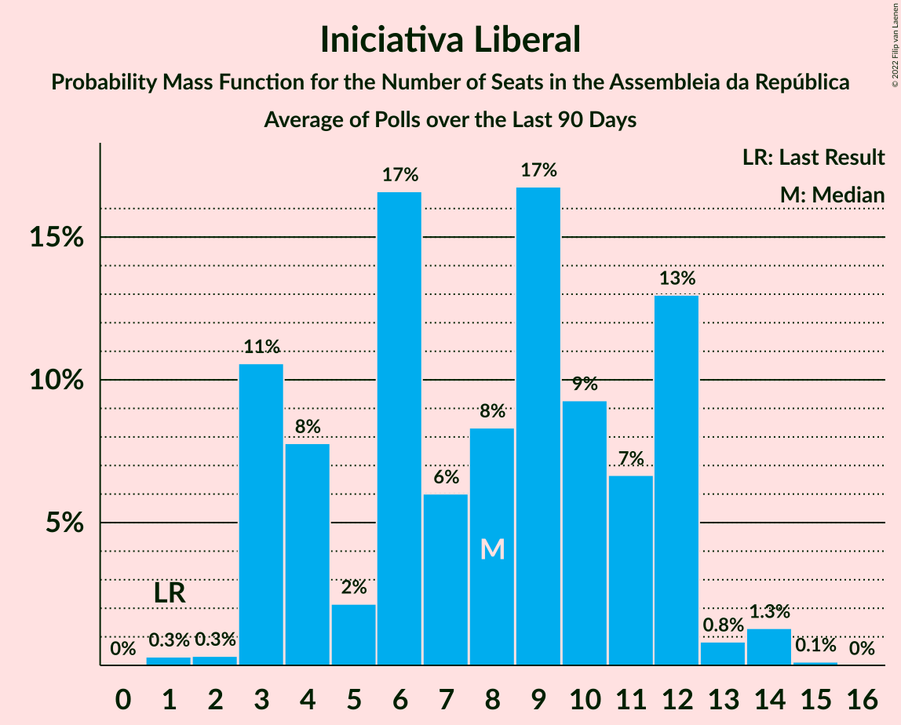

# Poll Average

<a href="#voting-intentions">Voting Intentions</a> | <a href="#seats">Seats</a> | <a href="#coalitions">Coalitions</a> | <a href="#technical-information">Technical Information</a>

## Summary

The table below lists the polls on which the average is based. They are the most recent polls (less than 90 days old) registered and analyzed so far.

| Period     | Polling firm/Commissioner(s) | PS | PSD | BE | CDU | CDS–PP | PAN | CH | IL | L | A |
|:----------:|:----------------------------:|:--:|:--:|:--:|:--:|:--:|:--:|:--:|:--:|:--:|:--:|
| 6 October 2019 | General Election | 36.4%   108 | 27.8%   79 | 9.5%   19 | 6.3%   12 | 4.2%   5 | 3.3%   4 | 1.3%   1 | 1.3%   1 | 1.1%   1 | 0.8%   0 |
| N/A | Poll Average | 32–42%   87–119 | 27–36%   72–101 | 4–10%   5–19 | 4–8%   5–15 | 1–3%   0–2 | 1–5%   0–8 | 4–9%   4–14 | 3–7%   3–12 | 0–3%   0–3 | N/A   N/A |
| [4–10 January 2022](2022-01-10-Intercampus.html) | Intercampus   CMTV, Correio da Manhã and Negócios | 32–39%   85–110 | 26–33%   68–93 | 7–11%   11–21 | 4–8%   6–16 | 1–2%   0–1 | 3–6%   2–10 | 5–9%   8–17 | 4–8%   5–13 | 0–2%   0–1 | N/A   N/A |
| [6–10 January 2022](2022-01-10-CESOP–UCP.html) | CESOP–UCP   Público and RTP | 36–42%   103–119 | 28–33%   75–90 | 5–7%   7–14 | 4–6%   5–10 | 1–3%   0–2 | 2–4%   2–4 | 5–7%   7–11 | 3–5%   3–7 | 1–3%   1–3 | N/A   N/A |
| [30 December 2021–9 January 2022](2022-01-09-Pitagórica.html) | Pitagórica   CNN Portugal and TVI | 36–44%   98–122 | 26–34%   71–95 | 5–9%   7–16 | 4–7%   5–14 | 1–3%   0–1 | 1–3%   0–3 | 4–8%   4–13 | 4–7%   4–12 | N/A   N/A | N/A   N/A |
| [10–20 December 2021](2021-12-20-ICSISCTE.html) | ICS/ISCTE   Expresso and SIC Notícias | 35–41%   96–117 | 28–34%   76–97 | 4–7%   3–11 | 5–8%   6–15 | 1–3%   0–2 | 1–3%   0–3 | 6–9%   8–15 | 3–5%   3–8 | N/A   N/A | N/A   N/A |
| [9–13 December 2021](2021-12-13-Aximage.html) | Aximage   Diário de Notícias, Jornal de Notícias and TSF Rádio Notícias | 31–40%   84–112 | 29–38%   78–105 | 5–10%   7–20 | 3–8%   5–15 | 1–3%   0–2 | 1–4%   0–5 | 4–9%   4–15 | 2–6%   3–10 | N/A   N/A | N/A   N/A |
| 6 October 2019 | General Election | 36.4%   108 | 27.8%   79 | 9.5%   19 | 6.3%   12 | 4.2%   5 | 3.3%   4 | 1.3%   1 | 1.3%   1 | 1.1%   1 | 0.8%   0 |

Only polls for which at least the sample size has been published are included in the table above.

**Legend:**
+ **Top half of each row:** Voting intentions (95% confidence interval)
+ **Bottom half of each row:** Seat projections for the Assembleia da República (95% confidence interval)
+ **PS:** Partido Socialista
+ **PSD:** Partido Social Democrata
+ **BE:** Bloco de Esquerda
+ **CDU:** Coligação Democrática Unitária
+ **CDS–PP:** CDS–Partido Popular
+ **PAN:** Pessoas–Animais–Natureza
+ **CH:** Chega
+ **IL:** Iniciativa Liberal
+ **L:** LIVRE
+ **A:** Aliança
+ **N/A (single party):** Party not included the published results
+ **N/A (entire row):** Calculation for this opinion poll not started yet

## Voting Intentions

### Confidence Intervals

| Party | Last Result | Median | 80% Confidence Interval | 90% Confidence Interval | 95% Confidence Interval | 99% Confidence Interval |
|:-----:|:-----------:|:------:|:-----------------------:|:-----------------------:|:-----------------------:|:-----------------------:|
| <a href="#partido-socialista">Partido Socialista</a> | 36.4% | 37.7% | 34.0–40.7% |33.0–41.5% | 32.2–42.2% | 30.8–43.7% |
| <a href="#partido-social-democrata">Partido Social Democrata</a> | 27.8% | 30.6% | 28.1–33.7% |27.4–34.8% | 26.8–35.9% | 25.6–37.7% |
| <a href="#bloco-de-esquerda">Bloco de Esquerda</a> | 9.5% | 6.5% | 4.9–9.0% |4.5–9.6% | 4.2–10.1% | 3.7–11.1% |
| <a href="#coligação-democrática-unitária">Coligação Democrática Unitária</a> | 6.3% | 5.5% | 4.4–6.9% |4.1–7.3% | 3.8–7.7% | 3.3–8.4% |
| <a href="#cds–partido-popular">CDS–Partido Popular</a> | 4.2% | 1.7% | 1.0–2.5% |0.8–2.7% | 0.7–2.9% | 0.5–3.4% |
| <a href="#pessoas–animais–natureza">Pessoas–Animais–Natureza</a> | 3.3% | 2.7% | 1.6–4.4% |1.4–4.9% | 1.3–5.3% | 1.0–6.1% |
| <a href="#chega">Chega</a> | 1.3% | 6.5% | 5.2–8.0% |4.8–8.5% | 4.5–8.9% | 4.0–9.7% |
| <a href="#iniciativa-liberal">Iniciativa Liberal</a> | 1.3% | 4.5% | 3.4–6.1% |3.1–6.6% | 2.9–7.0% | 2.4–7.8% |
| <a href="#livre">LIVRE</a> | 1.1% | 1.5% | 0.5–2.4% |0.4–2.6% | 0.3–2.8% | 0.2–3.1% |
| <a href="#aliança">Aliança</a> | 0.8% | N/A | N/A |N/A | N/A | N/A |

### Partido Socialista

*For a full overview of the results for this party, see the [Partido Socialista](party-partidosocialista.html) page.*

| Voting Intentions | Probability | Accumulated | Special Marks |
|:-----------------:|:-----------:|:-----------:|:-------------:|
| 27.5–28.5% | 0% | 100% |  |
| 28.5–29.5% | 0.1% | 100% |  |
| 29.5–30.5% | 0.3% | 99.9% |  |
| 30.5–31.5% | 0.9% | 99.6% |  |
| 31.5–32.5% | 2% | 98.8% |  |
| 32.5–33.5% | 4% | 97% |  |
| 33.5–34.5% | 7% | 92% |  |
| 34.5–35.5% | 9% | 86% |  |
| 35.5–36.5% | 11% | 77% | Last Result |
| 36.5–37.5% | 14% | 66% |  |
| 37.5–38.5% | 15% | 52% | Median |
| 38.5–39.5% | 15% | 37% |  |
| 39.5–40.5% | 11% | 22% |  |
| 40.5–41.5% | 6% | 11% |  |
| 41.5–42.5% | 3% | 5% |  |
| 42.5–43.5% | 1.1% | 2% |  |
| 43.5–44.5% | 0.4% | 0.6% |  |
| 44.5–45.5% | 0.1% | 0.2% |  |
| 45.5–46.5% | 0% | 0% |  |

### Partido Social Democrata

*For a full overview of the results for this party, see the [Partido Social Democrata](party-partidosocialdemocrata.html) page.*

| Voting Intentions | Probability | Accumulated | Special Marks |
|:-----------------:|:-----------:|:-----------:|:-------------:|
| 22.5–23.5% | 0% | 100% |  |
| 23.5–24.5% | 0.1% | 100% |  |
| 24.5–25.5% | 0.4% | 99.9% |  |
| 25.5–26.5% | 1.4% | 99.5% |  |
| 26.5–27.5% | 4% | 98% |  |
| 27.5–28.5% | 9% | 94% | Last Result |
| 28.5–29.5% | 16% | 85% |  |
| 29.5–30.5% | 20% | 70% |  |
| 30.5–31.5% | 18% | 50% | Median |
| 31.5–32.5% | 13% | 32% |  |
| 32.5–33.5% | 8% | 19% |  |
| 33.5–34.5% | 5% | 11% |  |
| 34.5–35.5% | 3% | 6% |  |
| 35.5–36.5% | 2% | 3% |  |
| 36.5–37.5% | 0.9% | 1.4% |  |
| 37.5–38.5% | 0.4% | 0.6% |  |
| 38.5–39.5% | 0.1% | 0.2% |  |
| 39.5–40.5% | 0% | 0.1% |  |
| 40.5–41.5% | 0% | 0% |  |

### Bloco de Esquerda

*For a full overview of the results for this party, see the [Bloco de Esquerda](party-blocodeesquerda.html) page.*

| Voting Intentions | Probability | Accumulated | Special Marks |
|:-----------------:|:-----------:|:-----------:|:-------------:|
| 1.5–2.5% | 0% | 100% |  |
| 2.5–3.5% | 0.2% | 100% |  |
| 3.5–4.5% | 5% | 99.8% |  |
| 4.5–5.5% | 18% | 95% |  |
| 5.5–6.5% | 27% | 76% |  |
| 6.5–7.5% | 20% | 50% | Median |
| 7.5–8.5% | 15% | 30% |  |
| 8.5–9.5% | 10% | 15% |  |
| 9.5–10.5% | 4% | 5% | Last Result |
| 10.5–11.5% | 1.1% | 1.2% |  |
| 11.5–12.5% | 0.2% | 0.2% |  |
| 12.5–13.5% | 0% | 0% |  |

### Coligação Democrática Unitária

*For a full overview of the results for this party, see the [Coligação Democrática Unitária](party-coligaçãodemocráticaunitária.html) page.*

| Voting Intentions | Probability | Accumulated | Special Marks |
|:-----------------:|:-----------:|:-----------:|:-------------:|
| 1.5–2.5% | 0% | 100% |  |
| 2.5–3.5% | 1.0% | 100% |  |
| 3.5–4.5% | 13% | 98.9% |  |
| 4.5–5.5% | 36% | 86% |  |
| 5.5–6.5% | 33% | 49% | Last Result, Median |
| 6.5–7.5% | 13% | 17% |  |
| 7.5–8.5% | 3% | 3% |  |
| 8.5–9.5% | 0.4% | 0.4% |  |
| 9.5–10.5% | 0% | 0% |  |

### CDS–Partido Popular

*For a full overview of the results for this party, see the [CDS–Partido Popular](party-cds–partidopopular.html) page.*

| Voting Intentions | Probability | Accumulated | Special Marks |
|:-----------------:|:-----------:|:-----------:|:-------------:|
| 0.0–0.5% | 0.7% | 100% |  |
| 0.5–1.5% | 38% | 99.3% |  |
| 1.5–2.5% | 52% | 61% | Median |
| 2.5–3.5% | 8% | 9% |  |
| 3.5–4.5% | 0.2% | 0.2% | Last Result |
| 4.5–5.5% | 0% | 0% |  |

### Pessoas–Animais–Natureza

*For a full overview of the results for this party, see the [Pessoas–Animais–Natureza](party-pessoas–animais–natureza.html) page.*

| Voting Intentions | Probability | Accumulated | Special Marks |
|:-----------------:|:-----------:|:-----------:|:-------------:|
| 0.0–0.5% | 0% | 100% |  |
| 0.5–1.5% | 8% | 100% |  |
| 1.5–2.5% | 38% | 92% |  |
| 2.5–3.5% | 32% | 54% | Last Result, Median |
| 3.5–4.5% | 15% | 23% |  |
| 4.5–5.5% | 6% | 8% |  |
| 5.5–6.5% | 2% | 2% |  |
| 6.5–7.5% | 0.2% | 0.2% |  |
| 7.5–8.5% | 0% | 0% |  |

### Iniciativa Liberal

*For a full overview of the results for this party, see the [Iniciativa Liberal](party-iniciativaliberal.html) page.*

| Voting Intentions | Probability | Accumulated | Special Marks |
|:-----------------:|:-----------:|:-----------:|:-------------:|
| 0.5–1.5% | 0% | 100% | Last Result |
| 1.5–2.5% | 0.9% | 100% |  |
| 2.5–3.5% | 14% | 99.1% |  |
| 3.5–4.5% | 38% | 85% | Median |
| 4.5–5.5% | 28% | 48% |  |
| 5.5–6.5% | 15% | 20% |  |
| 6.5–7.5% | 5% | 5% |  |
| 7.5–8.5% | 0.8% | 0.9% |  |
| 8.5–9.5% | 0.1% | 0.1% |  |
| 9.5–10.5% | 0% | 0% |  |

### Chega

*For a full overview of the results for this party, see the [Chega](party-chega.html) page.*

| Voting Intentions | Probability | Accumulated | Special Marks |
|:-----------------:|:-----------:|:-----------:|:-------------:|
| 0.5–1.5% | 0% | 100% | Last Result |
| 1.5–2.5% | 0% | 100% |  |
| 2.5–3.5% | 0.1% | 100% |  |
| 3.5–4.5% | 3% | 99.9% |  |
| 4.5–5.5% | 16% | 97% |  |
| 5.5–6.5% | 34% | 82% | Median |
| 6.5–7.5% | 29% | 48% |  |
| 7.5–8.5% | 14% | 18% |  |
| 8.5–9.5% | 4% | 4% |  |
| 9.5–10.5% | 0.6% | 0.7% |  |
| 10.5–11.5% | 0.1% | 0.1% |  |
| 11.5–12.5% | 0% | 0% |  |

### LIVRE

*For a full overview of the results for this party, see the [LIVRE](party-livre.html) page.*

| Voting Intentions | Probability | Accumulated | Special Marks |
|:-----------------:|:-----------:|:-----------:|:-------------:|
| 0.0–0.5% | 13% | 100% |  |
| 0.5–1.5% | 40% | 87% | Last Result, Median |
| 1.5–2.5% | 41% | 48% |  |
| 2.5–3.5% | 6% | 6% |  |
| 3.5–4.5% | 0.1% | 0.1% |  |
| 4.5–5.5% | 0% | 0% |  |

## Seats

### Confidence Intervals

| Party | Last Result | Median | 80% Confidence Interval | 90% Confidence Interval | 95% Confidence Interval | 99% Confidence Interval |
|:-----:|:-----------:|:------:|:-----------------------:|:-----------------------:|:-----------------------:|:-----------------------:|
| <a href="#partido-socialista">Partido Socialista</a> | 108 | 106 | 93–115 |89–117 | 87–119 | 83–122 |
| <a href="#partido-social-democrata">Partido Social Democrata</a> | 79 | 84 | 76–95 |74–98 | 72–101 | 67–105 |
| <a href="#bloco-de-esquerda">Bloco de Esquerda</a> | 19 | 11 | 7–18 |7–18 | 5–19 | 3–22 |
| <a href="#coligação-democrática-unitária">Coligação Democrática Unitária</a> | 12 | 8 | 6–13 |5–14 | 5–15 | 4–17 |
| <a href="#cds–partido-popular">CDS–Partido Popular</a> | 5 | 0 | 0–1 |0–1 | 0–2 | 0–2 |
| <a href="#pessoas–animais–natureza">Pessoas–Animais–Natureza</a> | 4 | 2 | 1–5 |0–6 | 0–8 | 0–10 |
| <a href="#chega">Chega</a> | 1 | 11 | 8–13 |6–14 | 4–14 | 4–18 |
| <a href="#iniciativa-liberal">Iniciativa Liberal</a> | 1 | 6 | 4–10 |4–12 | 3–12 | 3–14 |
| <a href="#livre">LIVRE</a> | 1 | 1 | 0–2 |0–3 | 0–3 | 0–4 |
| <a href="#aliança">Aliança</a> | 0 | N/A | N/A |N/A | N/A | N/A |

### Partido Socialista

*For a full overview of the results for this party, see the [Partido Socialista](party-partidosocialista.html) page.*

| Number of Seats | Probability | Accumulated | Special Marks |
|:---------------:|:-----------:|:-----------:|:-------------:|
| 78 | 0% | 100% |  |
| 79 | 0% | 99.9% |  |
| 80 | 0.1% | 99.9% |  |
| 81 | 0.1% | 99.9% |  |
| 82 | 0.2% | 99.7% |  |
| 83 | 0.3% | 99.5% |  |
| 84 | 0.3% | 99.2% |  |
| 85 | 0.4% | 98.9% |  |
| 86 | 0.8% | 98% |  |
| 87 | 1.0% | 98% |  |
| 88 | 1.0% | 97% |  |
| 89 | 1.2% | 96% |  |
| 90 | 0.7% | 94% |  |
| 91 | 0.9% | 94% |  |
| 92 | 1.4% | 93% |  |
| 93 | 3% | 91% |  |
| 94 | 3% | 88% |  |
| 95 | 2% | 85% |  |
| 96 | 2% | 84% |  |
| 97 | 3% | 81% |  |
| 98 | 3% | 78% |  |
| 99 | 3% | 75% |  |
| 100 | 2% | 72% |  |
| 101 | 3% | 70% |  |
| 102 | 3% | 68% |  |
| 103 | 4% | 65% |  |
| 104 | 3% | 61% |  |
| 105 | 4% | 58% |  |
| 106 | 5% | 54% | Median |
| 107 | 6% | 49% |  |
| 108 | 5% | 43% | Last Result |
| 109 | 8% | 39% |  |
| 110 | 4% | 31% |  |
| 111 | 4% | 27% |  |
| 112 | 4% | 23% |  |
| 113 | 3% | 19% |  |
| 114 | 4% | 15% |  |
| 115 | 3% | 12% |  |
| 116 | 3% | 9% | Majority |
| 117 | 1.3% | 6% |  |
| 118 | 1.5% | 5% |  |
| 119 | 1.5% | 4% |  |
| 120 | 1.0% | 2% |  |
| 121 | 0.4% | 1.1% |  |
| 122 | 0.3% | 0.8% |  |
| 123 | 0.2% | 0.4% |  |
| 124 | 0.1% | 0.3% |  |
| 125 | 0.1% | 0.2% |  |
| 126 | 0% | 0.1% |  |
| 127 | 0% | 0.1% |  |
| 128 | 0% | 0.1% |  |
| 129 | 0% | 0.1% |  |
| 130 | 0% | 0% |  |

### Partido Social Democrata

*For a full overview of the results for this party, see the [Partido Social Democrata](party-partidosocialdemocrata.html) page.*

| Number of Seats | Probability | Accumulated | Special Marks |
|:---------------:|:-----------:|:-----------:|:-------------:|
| 64 | 0% | 100% |  |
| 65 | 0.1% | 99.9% |  |
| 66 | 0.1% | 99.9% |  |
| 67 | 0.3% | 99.7% |  |
| 68 | 0.2% | 99.5% |  |
| 69 | 0.3% | 99.3% |  |
| 70 | 0.5% | 99.0% |  |
| 71 | 0.7% | 98.6% |  |
| 72 | 2% | 98% |  |
| 73 | 1.3% | 96% |  |
| 74 | 2% | 95% |  |
| 75 | 2% | 94% |  |
| 76 | 3% | 91% |  |
| 77 | 4% | 88% |  |
| 78 | 5% | 84% |  |
| 79 | 4% | 80% | Last Result |
| 80 | 5% | 76% |  |
| 81 | 6% | 71% |  |
| 82 | 6% | 66% |  |
| 83 | 8% | 60% |  |
| 84 | 6% | 53% | Median |
| 85 | 6% | 47% |  |
| 86 | 7% | 41% |  |
| 87 | 5% | 34% |  |
| 88 | 4% | 29% |  |
| 89 | 4% | 25% |  |
| 90 | 3% | 21% |  |
| 91 | 2% | 19% |  |
| 92 | 3% | 16% |  |
| 93 | 2% | 14% |  |
| 94 | 2% | 12% |  |
| 95 | 2% | 10% |  |
| 96 | 1.5% | 9% |  |
| 97 | 1.3% | 7% |  |
| 98 | 1.3% | 6% |  |
| 99 | 1.0% | 4% |  |
| 100 | 0.7% | 3% |  |
| 101 | 0.6% | 3% |  |
| 102 | 0.6% | 2% |  |
| 103 | 0.4% | 2% |  |
| 104 | 0.4% | 1.2% |  |
| 105 | 0.3% | 0.7% |  |
| 106 | 0.1% | 0.4% |  |
| 107 | 0.1% | 0.3% |  |
| 108 | 0.1% | 0.2% |  |
| 109 | 0% | 0.1% |  |
| 110 | 0% | 0.1% |  |
| 111 | 0% | 0% |  |

### Bloco de Esquerda

*For a full overview of the results for this party, see the [Bloco de Esquerda](party-blocodeesquerda.html) page.*

| Number of Seats | Probability | Accumulated | Special Marks |
|:---------------:|:-----------:|:-----------:|:-------------:|
| 2 | 0.1% | 100% |  |
| 3 | 0.5% | 99.9% |  |
| 4 | 1.3% | 99.4% |  |
| 5 | 1.0% | 98% |  |
| 6 | 1.0% | 97% |  |
| 7 | 27% | 96% |  |
| 8 | 5% | 70% |  |
| 9 | 5% | 65% |  |
| 10 | 4% | 59% |  |
| 11 | 10% | 55% | Median |
| 12 | 6% | 45% |  |
| 13 | 7% | 38% |  |
| 14 | 6% | 32% |  |
| 15 | 6% | 25% |  |
| 16 | 5% | 19% |  |
| 17 | 3% | 14% |  |
| 18 | 8% | 11% |  |
| 19 | 1.3% | 3% | Last Result |
| 20 | 0.7% | 2% |  |
| 21 | 0.6% | 1.2% |  |
| 22 | 0.4% | 0.7% |  |
| 23 | 0.1% | 0.3% |  |
| 24 | 0.1% | 0.2% |  |
| 25 | 0% | 0.1% |  |
| 26 | 0% | 0.1% |  |
| 27 | 0% | 0% |  |

### Coligação Democrática Unitária

*For a full overview of the results for this party, see the [Coligação Democrática Unitária](party-coligaçãodemocráticaunitária.html) page.*

| Number of Seats | Probability | Accumulated | Special Marks |
|:---------------:|:-----------:|:-----------:|:-------------:|
| 2 | 0.1% | 100% |  |
| 3 | 0.2% | 99.9% |  |
| 4 | 0.5% | 99.7% |  |
| 5 | 8% | 99.2% |  |
| 6 | 13% | 91% |  |
| 7 | 16% | 79% |  |
| 8 | 21% | 62% | Median |
| 9 | 14% | 42% |  |
| 10 | 7% | 28% |  |
| 11 | 4% | 21% |  |
| 12 | 4% | 17% | Last Result |
| 13 | 3% | 13% |  |
| 14 | 5% | 9% |  |
| 15 | 3% | 4% |  |
| 16 | 0.7% | 1.2% |  |
| 17 | 0.3% | 0.5% |  |
| 18 | 0.2% | 0.3% |  |
| 19 | 0.1% | 0.1% |  |
| 20 | 0% | 0% |  |

### CDS–Partido Popular

*For a full overview of the results for this party, see the [CDS–Partido Popular](party-cds–partidopopular.html) page.*

| Number of Seats | Probability | Accumulated | Special Marks |
|:---------------:|:-----------:|:-----------:|:-------------:|
| 0 | 61% | 100% | Median |
| 1 | 34% | 39% |  |
| 2 | 4% | 4% |  |
| 3 | 0.3% | 0.4% |  |
| 4 | 0.1% | 0.1% |  |
| 5 | 0% | 0% | Last Result |

### Pessoas–Animais–Natureza

*For a full overview of the results for this party, see the [Pessoas–Animais–Natureza](party-pessoas–animais–natureza.html) page.*

| Number of Seats | Probability | Accumulated | Special Marks |
|:---------------:|:-----------:|:-----------:|:-------------:|
| 0 | 7% | 100% |  |
| 1 | 20% | 93% |  |
| 2 | 34% | 73% | Median |
| 3 | 10% | 39% |  |
| 4 | 17% | 29% | Last Result |
| 5 | 3% | 12% |  |
| 6 | 5% | 9% |  |
| 7 | 0.5% | 4% |  |
| 8 | 0.9% | 3% |  |
| 9 | 2% | 2% |  |
| 10 | 0.4% | 0.6% |  |
| 11 | 0.1% | 0.2% |  |
| 12 | 0.1% | 0.1% |  |
| 13 | 0% | 0% |  |

### Chega

*For a full overview of the results for this party, see the [Chega](party-chega.html) page.*

| Number of Seats | Probability | Accumulated | Special Marks |
|:---------------:|:-----------:|:-----------:|:-------------:|
| 1 | 0% | 100% | Last Result |
| 2 | 0% | 100% |  |
| 3 | 0.3% | 100% |  |
| 4 | 2% | 99.7% |  |
| 5 | 1.1% | 97% |  |
| 6 | 2% | 96% |  |
| 7 | 4% | 94% |  |
| 8 | 15% | 90% |  |
| 9 | 10% | 75% |  |
| 10 | 14% | 65% |  |
| 11 | 34% | 51% | Median |
| 12 | 4% | 17% |  |
| 13 | 4% | 13% |  |
| 14 | 6% | 9% |  |
| 15 | 0.8% | 2% |  |
| 16 | 0.5% | 2% |  |
| 17 | 0.4% | 1.1% |  |
| 18 | 0.4% | 0.8% |  |
| 19 | 0.1% | 0.3% |  |
| 20 | 0.1% | 0.2% |  |
| 21 | 0% | 0.1% |  |
| 22 | 0% | 0.1% |  |
| 23 | 0% | 0% |  |

### Iniciativa Liberal

*For a full overview of the results for this party, see the [Iniciativa Liberal](party-iniciativaliberal.html) page.*

| Number of Seats | Probability | Accumulated | Special Marks |
|:---------------:|:-----------:|:-----------:|:-------------:|
| 1 | 0.1% | 100% | Last Result |
| 2 | 0% | 99.9% |  |
| 3 | 4% | 99.9% |  |
| 4 | 14% | 95% |  |
| 5 | 17% | 82% |  |
| 6 | 36% | 65% | Median |
| 7 | 7% | 29% |  |
| 8 | 4% | 22% |  |
| 9 | 5% | 18% |  |
| 10 | 5% | 13% |  |
| 11 | 2% | 8% |  |
| 12 | 5% | 6% |  |
| 13 | 0.3% | 1.0% |  |
| 14 | 0.6% | 0.7% |  |
| 15 | 0.1% | 0.1% |  |
| 16 | 0% | 0% |  |

### LIVRE

*For a full overview of the results for this party, see the [LIVRE](party-livre.html) page.*

| Number of Seats | Probability | Accumulated | Special Marks |
|:---------------:|:-----------:|:-----------:|:-------------:|
| 0 | 37% | 100% |  |
| 1 | 35% | 63% | Last Result, Median |
| 2 | 21% | 28% |  |
| 3 | 6% | 6% |  |
| 4 | 0.5% | 0.5% |  |
| 5 | 0% | 0% |  |

### Aliança

*For a full overview of the results for this party, see the [Aliança](party-aliança.html) page.*

## Coalitions

### Confidence Intervals

| Coalition | Last Result | Median | Majority? | 80% Confidence Interval | 90% Confidence Interval | 95% Confidence Interval | 99% Confidence Interval |
|:---------:|:-----------:|:------:|:---------:|:-----------------------:|:-----------------------:|:-----------------------:|:-----------------------:|
| Partido Socialista – Bloco de Esquerda – Coligação Democrática Unitária | 139 | 125 | 89% | 115–134 | 112–136 | 110–138 | 105–141 |
| Partido Socialista – Bloco de Esquerda | 127 | 116 | 57% | 106–125 | 103–128 | 101–130 | 96–133 |
| Partido Socialista – Coligação Democrática Unitária | 120 | 115 | 47% | 101–123 | 98–126 | 95–127 | 92–131 |
| Partido Socialista | 108 | 106 | 9% | 93–115 | 89–117 | 87–119 | 83–122 |
| Partido Social Democrata – CDS–Partido Popular | 84 | 84 | 0% | 76–95 | 74–98 | 72–101 | 67–106 |

### Partido Socialista – Bloco de Esquerda – Coligação Democrática Unitária

| Number of Seats | Probability | Accumulated | Special Marks |
|:---------------:|:-----------:|:-----------:|:-------------:|
| 100 | 0% | 100% |  |
| 101 | 0% | 99.9% |  |
| 102 | 0.1% | 99.9% |  |
| 103 | 0.1% | 99.8% |  |
| 104 | 0.1% | 99.8% |  |
| 105 | 0.2% | 99.6% |  |
| 106 | 0.3% | 99.4% |  |
| 107 | 0.4% | 99.2% |  |
| 108 | 0.6% | 98.8% |  |
| 109 | 0.6% | 98% |  |
| 110 | 0.8% | 98% |  |
| 111 | 1.0% | 97% |  |
| 112 | 1.2% | 96% |  |
| 113 | 1.4% | 95% |  |
| 114 | 2% | 93% |  |
| 115 | 2% | 91% |  |
| 116 | 2% | 89% | Majority |
| 117 | 2% | 87% |  |
| 118 | 3% | 85% |  |
| 119 | 4% | 82% |  |
| 120 | 3% | 78% |  |
| 121 | 4% | 76% |  |
| 122 | 5% | 72% |  |
| 123 | 5% | 67% |  |
| 124 | 7% | 62% |  |
| 125 | 6% | 55% | Median |
| 126 | 7% | 49% |  |
| 127 | 6% | 42% |  |
| 128 | 4% | 35% |  |
| 129 | 5% | 31% |  |
| 130 | 6% | 26% |  |
| 131 | 4% | 20% |  |
| 132 | 3% | 16% |  |
| 133 | 3% | 14% |  |
| 134 | 3% | 11% |  |
| 135 | 3% | 8% |  |
| 136 | 1.4% | 5% |  |
| 137 | 1.2% | 4% |  |
| 138 | 1.0% | 3% |  |
| 139 | 0.6% | 2% | Last Result |
| 140 | 0.5% | 1.1% |  |
| 141 | 0.2% | 0.7% |  |
| 142 | 0.1% | 0.4% |  |
| 143 | 0.1% | 0.3% |  |
| 144 | 0.1% | 0.2% |  |
| 145 | 0% | 0.1% |  |
| 146 | 0% | 0.1% |  |
| 147 | 0% | 0% |  |

### Partido Socialista – Bloco de Esquerda

| Number of Seats | Probability | Accumulated | Special Marks |
|:---------------:|:-----------:|:-----------:|:-------------:|
| 91 | 0% | 100% |  |
| 92 | 0% | 99.9% |  |
| 93 | 0.1% | 99.9% |  |
| 94 | 0.1% | 99.9% |  |
| 95 | 0.1% | 99.8% |  |
| 96 | 0.2% | 99.7% |  |
| 97 | 0.2% | 99.5% |  |
| 98 | 0.3% | 99.3% |  |
| 99 | 0.4% | 98.9% |  |
| 100 | 0.9% | 98.6% |  |
| 101 | 0.8% | 98% |  |
| 102 | 0.9% | 97% |  |
| 103 | 1.2% | 96% |  |
| 104 | 1.3% | 95% |  |
| 105 | 2% | 94% |  |
| 106 | 2% | 92% |  |
| 107 | 2% | 89% |  |
| 108 | 3% | 87% |  |
| 109 | 4% | 85% |  |
| 110 | 3% | 81% |  |
| 111 | 3% | 78% |  |
| 112 | 4% | 75% |  |
| 113 | 4% | 72% |  |
| 114 | 4% | 68% |  |
| 115 | 6% | 63% |  |
| 116 | 8% | 57% | Majority |
| 117 | 5% | 49% | Median |
| 118 | 5% | 44% |  |
| 119 | 6% | 39% |  |
| 120 | 5% | 33% |  |
| 121 | 5% | 28% |  |
| 122 | 5% | 23% |  |
| 123 | 3% | 18% |  |
| 124 | 3% | 15% |  |
| 125 | 2% | 12% |  |
| 126 | 2% | 9% |  |
| 127 | 2% | 7% | Last Result |
| 128 | 1.2% | 5% |  |
| 129 | 1.2% | 4% |  |
| 130 | 1.2% | 3% |  |
| 131 | 0.5% | 2% |  |
| 132 | 0.4% | 1.1% |  |
| 133 | 0.4% | 0.7% |  |
| 134 | 0.1% | 0.3% |  |
| 135 | 0.1% | 0.2% |  |
| 136 | 0% | 0.1% |  |
| 137 | 0% | 0.1% |  |
| 138 | 0% | 0.1% |  |
| 139 | 0% | 0% |  |

### Partido Socialista – Coligação Democrática Unitária

| Number of Seats | Probability | Accumulated | Special Marks |
|:---------------:|:-----------:|:-----------:|:-------------:|
| 87 | 0% | 100% |  |
| 88 | 0% | 99.9% |  |
| 89 | 0.1% | 99.9% |  |
| 90 | 0.1% | 99.8% |  |
| 91 | 0.2% | 99.7% |  |
| 92 | 0.3% | 99.5% |  |
| 93 | 0.4% | 99.2% |  |
| 94 | 0.5% | 98.7% |  |
| 95 | 0.8% | 98% |  |
| 96 | 0.6% | 97% |  |
| 97 | 1.3% | 97% |  |
| 98 | 1.0% | 96% |  |
| 99 | 1.3% | 95% |  |
| 100 | 2% | 93% |  |
| 101 | 2% | 91% |  |
| 102 | 2% | 89% |  |
| 103 | 2% | 87% |  |
| 104 | 3% | 86% |  |
| 105 | 2% | 83% |  |
| 106 | 2% | 81% |  |
| 107 | 2% | 79% |  |
| 108 | 3% | 76% |  |
| 109 | 3% | 73% |  |
| 110 | 2% | 71% |  |
| 111 | 4% | 68% |  |
| 112 | 3% | 65% |  |
| 113 | 4% | 61% |  |
| 114 | 4% | 57% | Median |
| 115 | 5% | 53% |  |
| 116 | 5% | 47% | Majority |
| 117 | 9% | 43% |  |
| 118 | 4% | 34% |  |
| 119 | 4% | 30% |  |
| 120 | 5% | 25% | Last Result |
| 121 | 3% | 20% |  |
| 122 | 5% | 17% |  |
| 123 | 3% | 12% |  |
| 124 | 2% | 9% |  |
| 125 | 2% | 7% |  |
| 126 | 2% | 5% |  |
| 127 | 1.1% | 3% |  |
| 128 | 0.8% | 2% |  |
| 129 | 0.5% | 1.3% |  |
| 130 | 0.3% | 0.9% |  |
| 131 | 0.2% | 0.6% |  |
| 132 | 0.2% | 0.4% |  |
| 133 | 0.1% | 0.2% |  |
| 134 | 0% | 0.1% |  |
| 135 | 0% | 0.1% |  |
| 136 | 0% | 0.1% |  |
| 137 | 0% | 0% |  |

### Partido Socialista

| Number of Seats | Probability | Accumulated | Special Marks |
|:---------------:|:-----------:|:-----------:|:-------------:|
| 78 | 0% | 100% |  |
| 79 | 0% | 99.9% |  |
| 80 | 0.1% | 99.9% |  |
| 81 | 0.1% | 99.9% |  |
| 82 | 0.2% | 99.7% |  |
| 83 | 0.3% | 99.5% |  |
| 84 | 0.3% | 99.2% |  |
| 85 | 0.4% | 98.9% |  |
| 86 | 0.8% | 98% |  |
| 87 | 1.0% | 98% |  |
| 88 | 1.0% | 97% |  |
| 89 | 1.2% | 96% |  |
| 90 | 0.7% | 94% |  |
| 91 | 0.9% | 94% |  |
| 92 | 1.4% | 93% |  |
| 93 | 3% | 91% |  |
| 94 | 3% | 88% |  |
| 95 | 2% | 85% |  |
| 96 | 2% | 84% |  |
| 97 | 3% | 81% |  |
| 98 | 3% | 78% |  |
| 99 | 3% | 75% |  |
| 100 | 2% | 72% |  |
| 101 | 3% | 70% |  |
| 102 | 3% | 68% |  |
| 103 | 4% | 65% |  |
| 104 | 3% | 61% |  |
| 105 | 4% | 58% |  |
| 106 | 5% | 54% | Median |
| 107 | 6% | 49% |  |
| 108 | 5% | 43% | Last Result |
| 109 | 8% | 39% |  |
| 110 | 4% | 31% |  |
| 111 | 4% | 27% |  |
| 112 | 4% | 23% |  |
| 113 | 3% | 19% |  |
| 114 | 4% | 15% |  |
| 115 | 3% | 12% |  |
| 116 | 3% | 9% | Majority |
| 117 | 1.3% | 6% |  |
| 118 | 1.5% | 5% |  |
| 119 | 1.5% | 4% |  |
| 120 | 1.0% | 2% |  |
| 121 | 0.4% | 1.1% |  |
| 122 | 0.3% | 0.8% |  |
| 123 | 0.2% | 0.4% |  |
| 124 | 0.1% | 0.3% |  |
| 125 | 0.1% | 0.2% |  |
| 126 | 0% | 0.1% |  |
| 127 | 0% | 0.1% |  |
| 128 | 0% | 0.1% |  |
| 129 | 0% | 0.1% |  |
| 130 | 0% | 0% |  |

### Partido Social Democrata – CDS–Partido Popular

| Number of Seats | Probability | Accumulated | Special Marks |
|:---------------:|:-----------:|:-----------:|:-------------:|
| 64 | 0% | 100% |  |
| 65 | 0.1% | 99.9% |  |
| 66 | 0.1% | 99.9% |  |
| 67 | 0.3% | 99.8% |  |
| 68 | 0.2% | 99.5% |  |
| 69 | 0.3% | 99.3% |  |
| 70 | 0.4% | 99.1% |  |
| 71 | 0.7% | 98.7% |  |
| 72 | 1.4% | 98% |  |
| 73 | 1.3% | 97% |  |
| 74 | 1.5% | 95% |  |
| 75 | 2% | 94% |  |
| 76 | 3% | 92% |  |
| 77 | 3% | 89% |  |
| 78 | 5% | 86% |  |
| 79 | 4% | 81% |  |
| 80 | 5% | 78% |  |
| 81 | 4% | 73% |  |
| 82 | 6% | 69% |  |
| 83 | 6% | 63% |  |
| 84 | 7% | 57% | Last Result, Median |
| 85 | 6% | 50% |  |
| 86 | 5% | 44% |  |
| 87 | 8% | 39% |  |
| 88 | 3% | 31% |  |
| 89 | 4% | 27% |  |
| 90 | 4% | 23% |  |
| 91 | 2% | 19% |  |
| 92 | 3% | 17% |  |
| 93 | 2% | 15% |  |
| 94 | 2% | 12% |  |
| 95 | 2% | 11% |  |
| 96 | 1.4% | 9% |  |
| 97 | 1.2% | 8% |  |
| 98 | 1.5% | 6% |  |
| 99 | 1.1% | 5% |  |
| 100 | 0.7% | 4% |  |
| 101 | 0.5% | 3% |  |
| 102 | 0.7% | 2% |  |
| 103 | 0.5% | 2% |  |
| 104 | 0.5% | 1.3% |  |
| 105 | 0.3% | 0.8% |  |
| 106 | 0.2% | 0.5% |  |
| 107 | 0.1% | 0.3% |  |
| 108 | 0.1% | 0.2% |  |
| 109 | 0% | 0.1% |  |
| 110 | 0% | 0.1% |  |
| 111 | 0% | 0% |  |

## Technical Information

+ **Number of polls included in this average:** 5
+ **Lowest number of simulations done in a poll included in this average:** 1,048,576
+ **Total number of simulations done in the polls included in this average:** 5,242,880
+ **Error estimate:** 3.52%
