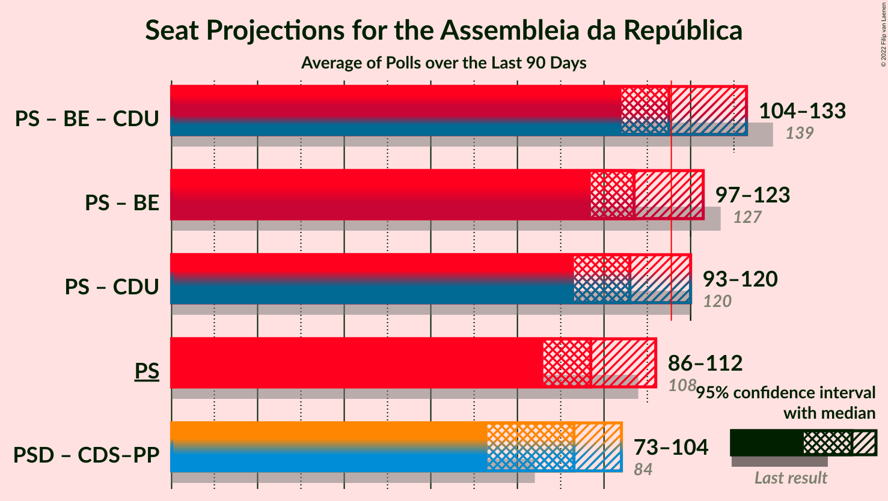

# Poll Average

<a href="#voting-intentions">Voting Intentions</a> | <a href="#seats">Seats</a> | <a href="#coalitions">Coalitions</a> | <a href="#technical-information">Technical Information</a>

## Summary

The table below lists the polls on which the average is based. They are the most recent polls (less than 90 days old) registered and analyzed so far.

| Period     | Polling firm/Commissioner(s) | PSD | CDS–PP | PS | BE | CDU | PAN | A |
|:----------:|:----------------------------:|:--:|:--:|:--:|:--:|:--:|:--:|:--:|
| 4 October 2015 | General Election | 36.9%   89 | 36.9%   18 | 32.3%   86 | 10.2%   19 | 8.2%   17 | 1.4%   1 | 0.0%   0 |
| N/A | Poll Average | 20–29%   56–80 | 4–8%   4–16 | 35–43%   102–129 | 7–12%   13–28 | 5–9%   7–20 | 2–6%   2–8 | 0–2%   0–2 |
| [12–15 July 2019](2019-07-15-Aximage.html) | Aximage   Correio da Manhã and Negócios | 20–27%   59–81 | 3–7%   4–12 | 34–41%   101–128 | 7–12%   14–28 | 5–9%   7–20 | 3–6%   3–9 | N/A   N/A |
| [7–11 July 2019](2019-07-11-Eurosondagem.html) | Eurosondagem   Associação Mutualista Montepio | 21–26%   60–77 | 5–8%   7–18 | 34–40%   103–121 | 7–11%   15–24 | 5–9%   8–18 | 3–6%   4–9 | 1–2%   0–2 |
| [15–27 June 2019](2019-06-27-ICSISCTE.html) | ICS/ISCTE   Expresso and SIC Notícias | 20–26%   56–75 | 4–7%   4–11 | 35–41%   102–122 | 9–13%   18–29 | 6–10%   12–21 | 3–6%   3–8 | 0–1%   0 |
| [10–19 May 2019](2019-05-19-Pitagórica.html) | Pitagórica | 19–26%   54–76 | 4–8%   6–18 | 37–44%   109–134 | 6–11%   10–24 | 5–9%   6–19 | 2–5%   2–8 | 1–3%   0–2 |
| [16–19 May 2019](2019-05-19-CESOP–UCP.html) | CESOP–UCP | 26–30%   70–82 | 6–8%   8–14 | 37–41%   101–114 | 8–10%   14–20 | 7–9%   13–18 | 2–4%   2–4 | 1–2%   0 |
| 4 October 2015 | General Election | 36.9%   89 | 36.9%   18 | 32.3%   86 | 10.2%   19 | 8.2%   17 | 1.4%   1 | 0.0%   0 |

Only polls for which at least the sample size has been published are included in the table above.

**Legend:**
+ **Top half of each row:** Voting intentions (95% confidence interval)
+ **Bottom half of each row:** Seat projections for the Assembleia da República (95% confidence interval)
+ **PSD:** Partido Social Democrata
+ **CDS–PP:** CDS–Partido Popular
+ **PS:** Partido Socialista
+ **BE:** Bloco de Esquerda
+ **CDU:** Coligação Democrática Unitária
+ **PAN:** Pessoas–Animais–Natureza
+ **A:** Aliança
+ **N/A (single party):** Party not included the published results
+ **N/A (entire row):** Calculation for this opinion poll not started yet

## Voting Intentions

### Confidence Intervals

| Party | Last Result | Median | 80% Confidence Interval | 90% Confidence Interval | 95% Confidence Interval | 99% Confidence Interval |
|:-----:|:-----------:|:------:|:-----------------------:|:-----------------------:|:-----------------------:|:-----------------------:|
| <a href="#partido-social-democrata">Partido Social Democrata</a> | 36.9% | 23.8% | 21.4–28.0% |20.7–28.7% | 20.2–29.2% | 19.2–30.1% |
| <a href="#cds–partido-popular">CDS–Partido Popular</a> | 36.9% | 6.0% | 4.4–7.4% |4.1–7.8% | 3.8–8.0% | 3.3–8.6% |
| <a href="#partido-socialista">Partido Socialista</a> | 32.3% | 38.4% | 35.9–41.1% |35.2–42.0% | 34.6–42.9% | 33.4–44.5% |
| <a href="#bloco-de-esquerda">Bloco de Esquerda</a> | 10.2% | 9.3% | 7.8–11.3% |7.4–11.9% | 7.0–12.4% | 6.3–13.4% |
| <a href="#coligação-democrática-unitária">Coligação Democrática Unitária</a> | 8.2% | 7.3% | 5.9–8.7% |5.5–9.1% | 5.2–9.4% | 4.6–10.2% |
| <a href="#pessoas–animais–natureza">Pessoas–Animais–Natureza</a> | 1.4% | 3.8% | 2.8–5.0% |2.6–5.3% | 2.5–5.6% | 2.2–6.2% |
| <a href="#aliança">Aliança</a> | 0.0% | 1.2% | 0.3–2.0% |0.2–2.2% | 0.1–2.4% | 0.1–2.9% |

### Partido Social Democrata

*For a full overview of the results for this party, see the [Partido Social Democrata](party-partidosocialdemocrata.html) page.*

| Voting Intentions | Probability | Accumulated | Special Marks |
|:-----------------:|:-----------:|:-----------:|:-------------:|
| 16.5–17.5% | 0% | 100% |  |
| 17.5–18.5% | 0.1% | 100% |  |
| 18.5–19.5% | 0.8% | 99.8% |  |
| 19.5–20.5% | 3% | 99.0% |  |
| 20.5–21.5% | 8% | 96% |  |
| 21.5–22.5% | 15% | 88% |  |
| 22.5–23.5% | 19% | 73% |  |
| 23.5–24.5% | 17% | 54% | Median |
| 24.5–25.5% | 11% | 37% |  |
| 25.5–26.5% | 6% | 26% |  |
| 26.5–27.5% | 6% | 20% |  |
| 27.5–28.5% | 8% | 14% |  |
| 28.5–29.5% | 5% | 6% |  |
| 29.5–30.5% | 1.3% | 1.4% |  |
| 30.5–31.5% | 0.2% | 0.2% |  |
| 31.5–32.5% | 0% | 0% |  |
| 32.5–33.5% | 0% | 0% |  |
| 33.5–34.5% | 0% | 0% |  |
| 34.5–35.5% | 0% | 0% |  |
| 35.5–36.5% | 0% | 0% |  |
| 36.5–37.5% | 0% | 0% | Last Result |

### CDS–Partido Popular

*For a full overview of the results for this party, see the [CDS–Partido Popular](party-cds–partidopopular.html) page.*

| Voting Intentions | Probability | Accumulated | Special Marks |
|:-----------------:|:-----------:|:-----------:|:-------------:|
| 1.5–2.5% | 0% | 100% |  |
| 2.5–3.5% | 1.1% | 100% |  |
| 3.5–4.5% | 11% | 98.9% |  |
| 4.5–5.5% | 24% | 88% |  |
| 5.5–6.5% | 29% | 64% | Median |
| 6.5–7.5% | 26% | 34% |  |
| 7.5–8.5% | 8% | 8% |  |
| 8.5–9.5% | 0.6% | 0.6% |  |
| 9.5–10.5% | 0% | 0% |  |
| 10.5–11.5% | 0% | 0% |  |
| 11.5–12.5% | 0% | 0% |  |
| 12.5–13.5% | 0% | 0% |  |
| 13.5–14.5% | 0% | 0% |  |
| 14.5–15.5% | 0% | 0% |  |
| 15.5–16.5% | 0% | 0% |  |
| 16.5–17.5% | 0% | 0% |  |
| 17.5–18.5% | 0% | 0% |  |
| 18.5–19.5% | 0% | 0% |  |
| 19.5–20.5% | 0% | 0% |  |
| 20.5–21.5% | 0% | 0% |  |
| 21.5–22.5% | 0% | 0% |  |
| 22.5–23.5% | 0% | 0% |  |
| 23.5–24.5% | 0% | 0% |  |
| 24.5–25.5% | 0% | 0% |  |
| 25.5–26.5% | 0% | 0% |  |
| 26.5–27.5% | 0% | 0% |  |
| 27.5–28.5% | 0% | 0% |  |
| 28.5–29.5% | 0% | 0% |  |
| 29.5–30.5% | 0% | 0% |  |
| 30.5–31.5% | 0% | 0% |  |
| 31.5–32.5% | 0% | 0% |  |
| 32.5–33.5% | 0% | 0% |  |
| 33.5–34.5% | 0% | 0% |  |
| 34.5–35.5% | 0% | 0% |  |
| 35.5–36.5% | 0% | 0% |  |
| 36.5–37.5% | 0% | 0% | Last Result |

### Partido Socialista

*For a full overview of the results for this party, see the [Partido Socialista](party-partidosocialista.html) page.*

| Voting Intentions | Probability | Accumulated | Special Marks |
|:-----------------:|:-----------:|:-----------:|:-------------:|
| 30.5–31.5% | 0% | 100% |  |
| 31.5–32.5% | 0.1% | 100% | Last Result |
| 32.5–33.5% | 0.5% | 99.9% |  |
| 33.5–34.5% | 2% | 99.4% |  |
| 34.5–35.5% | 5% | 98% |  |
| 35.5–36.5% | 10% | 93% |  |
| 36.5–37.5% | 16% | 83% |  |
| 37.5–38.5% | 20% | 67% | Median |
| 38.5–39.5% | 19% | 47% |  |
| 39.5–40.5% | 13% | 28% |  |
| 40.5–41.5% | 7% | 15% |  |
| 41.5–42.5% | 4% | 7% |  |
| 42.5–43.5% | 2% | 3% |  |
| 43.5–44.5% | 0.9% | 1.4% |  |
| 44.5–45.5% | 0.3% | 0.5% |  |
| 45.5–46.5% | 0.1% | 0.1% |  |
| 46.5–47.5% | 0% | 0% |  |

### Bloco de Esquerda

*For a full overview of the results for this party, see the [Bloco de Esquerda](party-blocodeesquerda.html) page.*

| Voting Intentions | Probability | Accumulated | Special Marks |
|:-----------------:|:-----------:|:-----------:|:-------------:|
| 4.5–5.5% | 0% | 100% |  |
| 5.5–6.5% | 0.9% | 100% |  |
| 6.5–7.5% | 6% | 99.1% |  |
| 7.5–8.5% | 20% | 94% |  |
| 8.5–9.5% | 33% | 73% | Median |
| 9.5–10.5% | 21% | 40% | Last Result |
| 10.5–11.5% | 12% | 19% |  |
| 11.5–12.5% | 6% | 8% |  |
| 12.5–13.5% | 2% | 2% |  |
| 13.5–14.5% | 0.3% | 0.4% |  |
| 14.5–15.5% | 0% | 0% |  |

### Coligação Democrática Unitária

*For a full overview of the results for this party, see the [Coligação Democrática Unitária](party-coligaçãodemocráticaunitária.html) page.*

| Voting Intentions | Probability | Accumulated | Special Marks |
|:-----------------:|:-----------:|:-----------:|:-------------:|
| 2.5–3.5% | 0% | 100% |  |
| 3.5–4.5% | 0.4% | 100% |  |
| 4.5–5.5% | 5% | 99.6% |  |
| 5.5–6.5% | 20% | 95% |  |
| 6.5–7.5% | 32% | 75% | Median |
| 7.5–8.5% | 30% | 43% | Last Result |
| 8.5–9.5% | 11% | 13% |  |
| 9.5–10.5% | 2% | 2% |  |
| 10.5–11.5% | 0.2% | 0.2% |  |
| 11.5–12.5% | 0% | 0% |  |

### Pessoas–Animais–Natureza

*For a full overview of the results for this party, see the [Pessoas–Animais–Natureza](party-pessoas–animais–natureza.html) page.*

| Voting Intentions | Probability | Accumulated | Special Marks |
|:-----------------:|:-----------:|:-----------:|:-------------:|
| 0.5–1.5% | 0% | 100% | Last Result |
| 1.5–2.5% | 3% | 100% |  |
| 2.5–3.5% | 34% | 97% |  |
| 3.5–4.5% | 42% | 63% | Median |
| 4.5–5.5% | 18% | 21% |  |
| 5.5–6.5% | 3% | 3% |  |
| 6.5–7.5% | 0.2% | 0.2% |  |
| 7.5–8.5% | 0% | 0% |  |

### Aliança

*For a full overview of the results for this party, see the [Aliança](party-aliança.html) page.*

| Voting Intentions | Probability | Accumulated | Special Marks |
|:-----------------:|:-----------:|:-----------:|:-------------:|
| 0.0–0.5% | 21% | 100% | Last Result |
| 0.5–1.5% | 53% | 79% | Median |
| 1.5–2.5% | 25% | 26% |  |
| 2.5–3.5% | 2% | 2% |  |
| 3.5–4.5% | 0% | 0% |  |
| 4.5–5.5% | 0% | 0% |  |

## Seats

### Confidence Intervals

| Party | Last Result | Median | 80% Confidence Interval | 90% Confidence Interval | 95% Confidence Interval | 99% Confidence Interval |
|:-----:|:-----------:|:------:|:-----------------------:|:-----------------------:|:-----------------------:|:-----------------------:|
| <a href="#partido-social-democrata">Partido Social Democrata</a> | 89 | 69 | 60–76 |58–78 | 56–80 | 53–83 |
| <a href="#cds–partido-popular">CDS–Partido Popular</a> | 18 | 9 | 6–13 |6–14 | 4–16 | 3–19 |
| <a href="#partido-socialista">Partido Socialista</a> | 86 | 112 | 105–123 |103–127 | 102–129 | 99–134 |
| <a href="#bloco-de-esquerda">Bloco de Esquerda</a> | 19 | 18 | 16–25 |15–27 | 13–28 | 10–29 |
| <a href="#coligação-democrática-unitária">Coligação Democrática Unitária</a> | 17 | 14 | 10–18 |8–19 | 7–20 | 6–21 |
| <a href="#pessoas–animais–natureza">Pessoas–Animais–Natureza</a> | 1 | 5 | 3–6 |3–8 | 2–8 | 2–10 |
| <a href="#aliança">Aliança</a> | 0 | 0 | 0 |0–2 | 0–2 | 0–2 |

### Partido Social Democrata

*For a full overview of the results for this party, see the [Partido Social Democrata](party-partidosocialdemocrata.html) page.*

| Number of Seats | Probability | Accumulated | Special Marks |
|:---------------:|:-----------:|:-----------:|:-------------:|
| 51 | 0.1% | 100% |  |
| 52 | 0.1% | 99.9% |  |
| 53 | 0.3% | 99.8% |  |
| 54 | 0.6% | 99.5% |  |
| 55 | 0.6% | 98.8% |  |
| 56 | 1.3% | 98% |  |
| 57 | 1.3% | 97% |  |
| 58 | 2% | 96% |  |
| 59 | 4% | 94% |  |
| 60 | 4% | 91% |  |
| 61 | 4% | 86% |  |
| 62 | 3% | 82% |  |
| 63 | 3% | 79% |  |
| 64 | 3% | 76% |  |
| 65 | 4% | 73% |  |
| 66 | 5% | 69% |  |
| 67 | 8% | 64% |  |
| 68 | 5% | 56% |  |
| 69 | 4% | 51% | Median |
| 70 | 4% | 47% |  |
| 71 | 4% | 42% |  |
| 72 | 5% | 38% |  |
| 73 | 5% | 33% |  |
| 74 | 8% | 28% |  |
| 75 | 6% | 20% |  |
| 76 | 5% | 14% |  |
| 77 | 3% | 9% |  |
| 78 | 2% | 6% |  |
| 79 | 2% | 4% |  |
| 80 | 0.8% | 3% |  |
| 81 | 0.8% | 2% |  |
| 82 | 0.4% | 1.1% |  |
| 83 | 0.4% | 0.7% |  |
| 84 | 0.1% | 0.3% |  |
| 85 | 0.1% | 0.2% |  |
| 86 | 0% | 0.1% |  |
| 87 | 0% | 0.1% |  |
| 88 | 0% | 0% |  |
| 89 | 0% | 0% | Last Result |

### CDS–Partido Popular

*For a full overview of the results for this party, see the [CDS–Partido Popular](party-cds–partidopopular.html) page.*

| Number of Seats | Probability | Accumulated | Special Marks |
|:---------------:|:-----------:|:-----------:|:-------------:|
| 2 | 0.3% | 100% |  |
| 3 | 0.3% | 99.7% |  |
| 4 | 2% | 99.4% |  |
| 5 | 1.2% | 97% |  |
| 6 | 11% | 96% |  |
| 7 | 11% | 85% |  |
| 8 | 19% | 73% |  |
| 9 | 8% | 55% | Median |
| 10 | 15% | 47% |  |
| 11 | 13% | 32% |  |
| 12 | 7% | 20% |  |
| 13 | 6% | 12% |  |
| 14 | 2% | 7% |  |
| 15 | 2% | 5% |  |
| 16 | 0.8% | 3% |  |
| 17 | 0.8% | 2% |  |
| 18 | 0.9% | 2% | Last Result |
| 19 | 0.5% | 0.6% |  |
| 20 | 0.1% | 0.1% |  |
| 21 | 0% | 0% |  |

### Partido Socialista

*For a full overview of the results for this party, see the [Partido Socialista](party-partidosocialista.html) page.*

| Number of Seats | Probability | Accumulated | Special Marks |
|:---------------:|:-----------:|:-----------:|:-------------:|
| 86 | 0% | 100% | Last Result |
| 87 | 0% | 100% |  |
| 88 | 0% | 100% |  |
| 89 | 0% | 100% |  |
| 90 | 0% | 100% |  |
| 91 | 0% | 100% |  |
| 92 | 0% | 100% |  |
| 93 | 0% | 100% |  |
| 94 | 0% | 100% |  |
| 95 | 0% | 100% |  |
| 96 | 0% | 100% |  |
| 97 | 0% | 99.9% |  |
| 98 | 0.2% | 99.9% |  |
| 99 | 0.3% | 99.7% |  |
| 100 | 0.4% | 99.4% |  |
| 101 | 0.8% | 99.0% |  |
| 102 | 1.3% | 98% |  |
| 103 | 2% | 97% |  |
| 104 | 3% | 95% |  |
| 105 | 4% | 92% |  |
| 106 | 5% | 87% |  |
| 107 | 5% | 82% |  |
| 108 | 5% | 77% |  |
| 109 | 6% | 72% |  |
| 110 | 6% | 66% |  |
| 111 | 6% | 59% |  |
| 112 | 8% | 54% | Median |
| 113 | 6% | 46% |  |
| 114 | 5% | 40% |  |
| 115 | 4% | 35% |  |
| 116 | 5% | 31% | Majority |
| 117 | 3% | 26% |  |
| 118 | 3% | 23% |  |
| 119 | 3% | 20% |  |
| 120 | 2% | 17% |  |
| 121 | 2% | 15% |  |
| 122 | 2% | 13% |  |
| 123 | 2% | 11% |  |
| 124 | 1.4% | 9% |  |
| 125 | 1.4% | 8% |  |
| 126 | 1.1% | 6% |  |
| 127 | 1.3% | 5% |  |
| 128 | 0.9% | 4% |  |
| 129 | 0.8% | 3% |  |
| 130 | 0.8% | 2% |  |
| 131 | 0.5% | 2% |  |
| 132 | 0.3% | 1.1% |  |
| 133 | 0.3% | 0.8% |  |
| 134 | 0.2% | 0.5% |  |
| 135 | 0.1% | 0.3% |  |
| 136 | 0.1% | 0.2% |  |
| 137 | 0% | 0.1% |  |
| 138 | 0% | 0.1% |  |
| 139 | 0% | 0.1% |  |
| 140 | 0% | 0% |  |

### Bloco de Esquerda

*For a full overview of the results for this party, see the [Bloco de Esquerda](party-blocodeesquerda.html) page.*

| Number of Seats | Probability | Accumulated | Special Marks |
|:---------------:|:-----------:|:-----------:|:-------------:|
| 9 | 0.1% | 100% |  |
| 10 | 0.8% | 99.8% |  |
| 11 | 0.4% | 99.1% |  |
| 12 | 0.6% | 98.6% |  |
| 13 | 0.8% | 98% |  |
| 14 | 2% | 97% |  |
| 15 | 5% | 95% |  |
| 16 | 6% | 91% |  |
| 17 | 16% | 85% |  |
| 18 | 19% | 69% | Median |
| 19 | 7% | 50% | Last Result |
| 20 | 10% | 43% |  |
| 21 | 5% | 33% |  |
| 22 | 4% | 28% |  |
| 23 | 4% | 24% |  |
| 24 | 8% | 20% |  |
| 25 | 4% | 12% |  |
| 26 | 2% | 7% |  |
| 27 | 2% | 6% |  |
| 28 | 3% | 4% |  |
| 29 | 0.8% | 1.1% |  |
| 30 | 0.1% | 0.3% |  |
| 31 | 0.1% | 0.2% |  |
| 32 | 0.1% | 0.2% |  |
| 33 | 0% | 0.1% |  |
| 34 | 0% | 0.1% |  |
| 35 | 0% | 0.1% |  |
| 36 | 0% | 0% |  |

### Coligação Democrática Unitária

*For a full overview of the results for this party, see the [Coligação Democrática Unitária](party-coligaçãodemocráticaunitária.html) page.*

| Number of Seats | Probability | Accumulated | Special Marks |
|:---------------:|:-----------:|:-----------:|:-------------:|
| 5 | 0.4% | 100% |  |
| 6 | 1.4% | 99.6% |  |
| 7 | 1.4% | 98% |  |
| 8 | 3% | 97% |  |
| 9 | 4% | 94% |  |
| 10 | 4% | 90% |  |
| 11 | 2% | 86% |  |
| 12 | 3% | 84% |  |
| 13 | 11% | 81% |  |
| 14 | 28% | 71% | Median |
| 15 | 5% | 43% |  |
| 16 | 6% | 37% |  |
| 17 | 18% | 32% | Last Result |
| 18 | 6% | 13% |  |
| 19 | 4% | 7% |  |
| 20 | 2% | 3% |  |
| 21 | 0.5% | 0.9% |  |
| 22 | 0.2% | 0.4% |  |
| 23 | 0.1% | 0.2% |  |
| 24 | 0.1% | 0.1% |  |
| 25 | 0% | 0% |  |

### Pessoas–Animais–Natureza

*For a full overview of the results for this party, see the [Pessoas–Animais–Natureza](party-pessoas–animais–natureza.html) page.*

| Number of Seats | Probability | Accumulated | Special Marks |
|:---------------:|:-----------:|:-----------:|:-------------:|
| 1 | 0.1% | 100% | Last Result |
| 2 | 4% | 99.9% |  |
| 3 | 17% | 96% |  |
| 4 | 25% | 79% |  |
| 5 | 6% | 54% | Median |
| 6 | 39% | 48% |  |
| 7 | 3% | 9% |  |
| 8 | 3% | 6% |  |
| 9 | 2% | 2% |  |
| 10 | 0.3% | 0.7% |  |
| 11 | 0.1% | 0.4% |  |
| 12 | 0% | 0.3% |  |
| 13 | 0.1% | 0.2% |  |
| 14 | 0.1% | 0.1% |  |
| 15 | 0% | 0% |  |

### Aliança

*For a full overview of the results for this party, see the [Aliança](party-aliança.html) page.*

| Number of Seats | Probability | Accumulated | Special Marks |
|:---------------:|:-----------:|:-----------:|:-------------:|
| 0 | 91% | 100% | Last Result, Median |
| 1 | 2% | 9% |  |
| 2 | 7% | 7% |  |
| 3 | 0.1% | 0.1% |  |
| 4 | 0% | 0.1% |  |
| 5 | 0% | 0% |  |

## Coalitions

### Confidence Intervals

| Coalition | Last Result | Median | Majority? | 80% Confidence Interval | 90% Confidence Interval | 95% Confidence Interval | 99% Confidence Interval |
|:---------:|:-----------:|:------:|:---------:|:-----------------------:|:-----------------------:|:-----------------------:|:-----------------------:|
| Partido Socialista – Bloco de Esquerda – Coligação Democrática Unitária | 122 | 146 | 100% | 139–157 | 137–158 | 136–160 | 133–163 |
| Partido Socialista – Bloco de Esquerda | 105 | 132 | 99.9% | 124–142 | 122–145 | 121–147 | 118–152 |
| Partido Socialista – Coligação Democrática Unitária | 103 | 127 | 98.6% | 120–137 | 118–139 | 117–141 | 113–145 |
| Partido Socialista | 86 | 112 | 31% | 105–123 | 103–127 | 102–129 | 99–134 |
| CDS–Partido Popular – Partido Social Democrata | 107 | 78 | 0% | 68–87 | 67–89 | 65–90 | 62–93 |

### Partido Socialista – Bloco de Esquerda – Coligação Democrática Unitária

| Number of Seats | Probability | Accumulated | Special Marks |
|:---------------:|:-----------:|:-----------:|:-------------:|
| 122 | 0% | 100% | Last Result |
| 123 | 0% | 100% |  |
| 124 | 0% | 100% |  |
| 125 | 0% | 100% |  |
| 126 | 0% | 100% |  |
| 127 | 0% | 100% |  |
| 128 | 0% | 100% |  |
| 129 | 0% | 100% |  |
| 130 | 0.1% | 99.9% |  |
| 131 | 0.1% | 99.8% |  |
| 132 | 0.2% | 99.7% |  |
| 133 | 0.3% | 99.5% |  |
| 134 | 0.6% | 99.2% |  |
| 135 | 0.8% | 98.6% |  |
| 136 | 2% | 98% |  |
| 137 | 2% | 96% |  |
| 138 | 3% | 94% |  |
| 139 | 4% | 92% |  |
| 140 | 5% | 88% |  |
| 141 | 6% | 82% |  |
| 142 | 6% | 76% |  |
| 143 | 5% | 70% |  |
| 144 | 6% | 65% | Median |
| 145 | 6% | 59% |  |
| 146 | 4% | 53% |  |
| 147 | 4% | 49% |  |
| 148 | 4% | 45% |  |
| 149 | 5% | 40% |  |
| 150 | 4% | 35% |  |
| 151 | 4% | 31% |  |
| 152 | 4% | 27% |  |
| 153 | 4% | 23% |  |
| 154 | 3% | 19% |  |
| 155 | 3% | 16% |  |
| 156 | 3% | 13% |  |
| 157 | 3% | 10% |  |
| 158 | 2% | 7% |  |
| 159 | 2% | 5% |  |
| 160 | 1.1% | 3% |  |
| 161 | 0.9% | 2% |  |
| 162 | 0.5% | 1.2% |  |
| 163 | 0.4% | 0.7% |  |
| 164 | 0.2% | 0.4% |  |
| 165 | 0.1% | 0.2% |  |
| 166 | 0.1% | 0.1% |  |
| 167 | 0% | 0% |  |

### Partido Socialista – Bloco de Esquerda

| Number of Seats | Probability | Accumulated | Special Marks |
|:---------------:|:-----------:|:-----------:|:-------------:|
| 105 | 0% | 100% | Last Result |
| 106 | 0% | 100% |  |
| 107 | 0% | 100% |  |
| 108 | 0% | 100% |  |
| 109 | 0% | 100% |  |
| 110 | 0% | 100% |  |
| 111 | 0% | 100% |  |
| 112 | 0% | 100% |  |
| 113 | 0% | 100% |  |
| 114 | 0% | 100% |  |
| 115 | 0.1% | 100% |  |
| 116 | 0.1% | 99.9% | Majority |
| 117 | 0.2% | 99.8% |  |
| 118 | 0.4% | 99.5% |  |
| 119 | 0.8% | 99.2% |  |
| 120 | 0.8% | 98% |  |
| 121 | 2% | 98% |  |
| 122 | 2% | 96% |  |
| 123 | 3% | 94% |  |
| 124 | 3% | 91% |  |
| 125 | 4% | 88% |  |
| 126 | 6% | 83% |  |
| 127 | 5% | 77% |  |
| 128 | 5% | 72% |  |
| 129 | 4% | 68% |  |
| 130 | 5% | 63% | Median |
| 131 | 5% | 58% |  |
| 132 | 4% | 53% |  |
| 133 | 4% | 49% |  |
| 134 | 6% | 44% |  |
| 135 | 5% | 38% |  |
| 136 | 5% | 33% |  |
| 137 | 3% | 28% |  |
| 138 | 4% | 25% |  |
| 139 | 2% | 21% |  |
| 140 | 3% | 19% |  |
| 141 | 3% | 15% |  |
| 142 | 3% | 12% |  |
| 143 | 2% | 10% |  |
| 144 | 2% | 7% |  |
| 145 | 2% | 6% |  |
| 146 | 1.0% | 4% |  |
| 147 | 0.8% | 3% |  |
| 148 | 0.9% | 2% |  |
| 149 | 0.6% | 2% |  |
| 150 | 0.3% | 1.0% |  |
| 151 | 0.2% | 0.8% |  |
| 152 | 0.2% | 0.6% |  |
| 153 | 0.1% | 0.3% |  |
| 154 | 0.1% | 0.2% |  |
| 155 | 0% | 0.1% |  |
| 156 | 0% | 0.1% |  |
| 157 | 0% | 0% |  |

### Partido Socialista – Coligação Democrática Unitária

| Number of Seats | Probability | Accumulated | Special Marks |
|:---------------:|:-----------:|:-----------:|:-------------:|
| 103 | 0% | 100% | Last Result |
| 104 | 0% | 100% |  |
| 105 | 0% | 100% |  |
| 106 | 0% | 100% |  |
| 107 | 0% | 100% |  |
| 108 | 0% | 100% |  |
| 109 | 0% | 100% |  |
| 110 | 0% | 100% |  |
| 111 | 0.1% | 99.9% |  |
| 112 | 0.2% | 99.9% |  |
| 113 | 0.4% | 99.7% |  |
| 114 | 0.4% | 99.3% |  |
| 115 | 0.3% | 98.9% |  |
| 116 | 0.7% | 98.6% | Majority |
| 117 | 1.2% | 98% |  |
| 118 | 2% | 97% |  |
| 119 | 3% | 95% |  |
| 120 | 5% | 92% |  |
| 121 | 5% | 87% |  |
| 122 | 5% | 82% |  |
| 123 | 6% | 77% |  |
| 124 | 7% | 70% |  |
| 125 | 6% | 63% |  |
| 126 | 6% | 57% | Median |
| 127 | 6% | 51% |  |
| 128 | 5% | 45% |  |
| 129 | 6% | 40% |  |
| 130 | 6% | 34% |  |
| 131 | 4% | 27% |  |
| 132 | 3% | 23% |  |
| 133 | 3% | 21% |  |
| 134 | 3% | 18% |  |
| 135 | 2% | 15% |  |
| 136 | 3% | 13% |  |
| 137 | 3% | 11% |  |
| 138 | 2% | 8% |  |
| 139 | 2% | 6% |  |
| 140 | 0.9% | 4% |  |
| 141 | 1.0% | 3% |  |
| 142 | 0.8% | 2% |  |
| 143 | 0.4% | 1.2% |  |
| 144 | 0.2% | 0.8% |  |
| 145 | 0.2% | 0.5% |  |
| 146 | 0.1% | 0.4% |  |
| 147 | 0.1% | 0.2% |  |
| 148 | 0.1% | 0.1% |  |
| 149 | 0% | 0.1% |  |
| 150 | 0% | 0% |  |

### Partido Socialista

| Number of Seats | Probability | Accumulated | Special Marks |
|:---------------:|:-----------:|:-----------:|:-------------:|
| 86 | 0% | 100% | Last Result |
| 87 | 0% | 100% |  |
| 88 | 0% | 100% |  |
| 89 | 0% | 100% |  |
| 90 | 0% | 100% |  |
| 91 | 0% | 100% |  |
| 92 | 0% | 100% |  |
| 93 | 0% | 100% |  |
| 94 | 0% | 100% |  |
| 95 | 0% | 100% |  |
| 96 | 0% | 100% |  |
| 97 | 0% | 99.9% |  |
| 98 | 0.2% | 99.9% |  |
| 99 | 0.3% | 99.7% |  |
| 100 | 0.4% | 99.4% |  |
| 101 | 0.8% | 99.0% |  |
| 102 | 1.3% | 98% |  |
| 103 | 2% | 97% |  |
| 104 | 3% | 95% |  |
| 105 | 4% | 92% |  |
| 106 | 5% | 87% |  |
| 107 | 5% | 82% |  |
| 108 | 5% | 77% |  |
| 109 | 6% | 72% |  |
| 110 | 6% | 66% |  |
| 111 | 6% | 59% |  |
| 112 | 8% | 54% | Median |
| 113 | 6% | 46% |  |
| 114 | 5% | 40% |  |
| 115 | 4% | 35% |  |
| 116 | 5% | 31% | Majority |
| 117 | 3% | 26% |  |
| 118 | 3% | 23% |  |
| 119 | 3% | 20% |  |
| 120 | 2% | 17% |  |
| 121 | 2% | 15% |  |
| 122 | 2% | 13% |  |
| 123 | 2% | 11% |  |
| 124 | 1.4% | 9% |  |
| 125 | 1.4% | 8% |  |
| 126 | 1.1% | 6% |  |
| 127 | 1.3% | 5% |  |
| 128 | 0.9% | 4% |  |
| 129 | 0.8% | 3% |  |
| 130 | 0.8% | 2% |  |
| 131 | 0.5% | 2% |  |
| 132 | 0.3% | 1.1% |  |
| 133 | 0.3% | 0.8% |  |
| 134 | 0.2% | 0.5% |  |
| 135 | 0.1% | 0.3% |  |
| 136 | 0.1% | 0.2% |  |
| 137 | 0% | 0.1% |  |
| 138 | 0% | 0.1% |  |
| 139 | 0% | 0.1% |  |
| 140 | 0% | 0% |  |

### CDS–Partido Popular – Partido Social Democrata

| Number of Seats | Probability | Accumulated | Special Marks |
|:---------------:|:-----------:|:-----------:|:-------------:|
| 59 | 0% | 100% |  |
| 60 | 0.1% | 99.9% |  |
| 61 | 0.3% | 99.8% |  |
| 62 | 0.4% | 99.6% |  |
| 63 | 0.6% | 99.1% |  |
| 64 | 0.7% | 98.6% |  |
| 65 | 1.2% | 98% |  |
| 66 | 2% | 97% |  |
| 67 | 4% | 95% |  |
| 68 | 3% | 91% |  |
| 69 | 2% | 88% |  |
| 70 | 2% | 85% |  |
| 71 | 3% | 83% |  |
| 72 | 4% | 80% |  |
| 73 | 4% | 76% |  |
| 74 | 5% | 72% |  |
| 75 | 6% | 67% |  |
| 76 | 4% | 61% |  |
| 77 | 4% | 57% |  |
| 78 | 4% | 53% | Median |
| 79 | 5% | 49% |  |
| 80 | 5% | 44% |  |
| 81 | 4% | 39% |  |
| 82 | 5% | 35% |  |
| 83 | 4% | 30% |  |
| 84 | 5% | 26% |  |
| 85 | 5% | 21% |  |
| 86 | 4% | 15% |  |
| 87 | 3% | 11% |  |
| 88 | 2% | 7% |  |
| 89 | 2% | 5% |  |
| 90 | 1.1% | 3% |  |
| 91 | 1.0% | 2% |  |
| 92 | 0.5% | 1.3% |  |
| 93 | 0.4% | 0.8% |  |
| 94 | 0.2% | 0.4% |  |
| 95 | 0.1% | 0.2% |  |
| 96 | 0% | 0.1% |  |
| 97 | 0% | 0% |  |
| 98 | 0% | 0% |  |
| 99 | 0% | 0% |  |
| 100 | 0% | 0% |  |
| 101 | 0% | 0% |  |
| 102 | 0% | 0% |  |
| 103 | 0% | 0% |  |
| 104 | 0% | 0% |  |
| 105 | 0% | 0% |  |
| 106 | 0% | 0% |  |
| 107 | 0% | 0% | Last Result |

## Technical Information

+ **Number of polls included in this average:** 5
+ **Lowest number of simulations done in a poll included in this average:** 65,536
+ **Total number of simulations done in the polls included in this average:** 4,259,840
+ **Error estimate:** 2.91%
