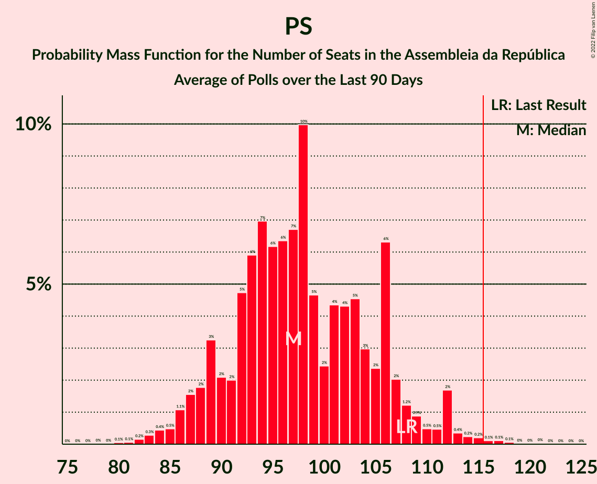

# Poll Average

<a href="#voting-intentions">Voting Intentions</a> | <a href="#seats">Seats</a> | <a href="#coalitions">Coalitions</a> | <a href="#technical-information">Technical Information</a>

## Summary

The table below lists the polls on which the average is based. They are the most recent polls (less than 90 days old) registered and analyzed so far.

| Period     | Polling firm/Commissioner(s) | PSD | CDS–PP | PS | BE | CDU | PAN | A |
|:----------:|:----------------------------:|:--:|:--:|:--:|:--:|:--:|:--:|:--:|
| 4 October 2015 | General Election | 36.9%   89 | 36.9%   18 | 32.3%   86 | 10.2%   19 | 8.2%   17 | 1.4%   1 | 0.0%   0 |
| N/A | Poll Average | 21–28%   58–79 | 6–12%   8–24 | 34–43%   91–125 | 6–11%   9–24 | 6–9%   11–19 | 1–5%   1–6 | N/A   N/A |
| [2–9 January 2019](2019-01-09-Eurosondagem.html) | Eurosondagem   Expresso and SIC | 22–28%   58–79 | 6–9%   7–21 | 37–43%   105–132 | 6–9%   8–24 | 6–9%   10–19 | 1–3%   0–3 | N/A   N/A |
| [4–7 January 2019](2019-01-07-Aximage.html) | Aximage   Correio da Manhã | 21–28%   62–79 | 7–12%   12–25 | 34–42%   91–109 | 7–11%   14–19 | 5–10%   13–23 | 2–5%   2–6 | N/A   N/A |
| 4 October 2015 | General Election | 36.9%   89 | 36.9%   18 | 32.3%   86 | 10.2%   19 | 8.2%   17 | 1.4%   1 | 0.0%   0 |

Only polls for which at least the sample size has been published are included in the table above.

**Legend:**
+ **Top half of each row:** Voting intentions (95% confidence interval)
+ **Bottom half of each row:** Seat projections for the Assembleia da República (95% confidence interval)
+ **PSD:** Partido Social Democrata
+ **CDS–PP:** CDS–Partido Popular
+ **PS:** Partido Socialista
+ **BE:** Bloco de Esquerda
+ **CDU:** Coligação Democrática Unitária
+ **PAN:** Pessoas–Animais–Natureza
+ **A:** Aliança
+ **N/A (single party):** Party not included the published results
+ **N/A (entire row):** Calculation for this opinion poll not started yet

## Voting Intentions

### Confidence Intervals

| Party | Last Result | Median | 80% Confidence Interval | 90% Confidence Interval | 95% Confidence Interval | 99% Confidence Interval |
|:-----:|:-----------:|:------:|:-----------------------:|:-----------------------:|:-----------------------:|:-----------------------:|
| <a href="#partido-social-democrata">Partido Social Democrata</a> | 36.9% | 24.5% | 22.5–26.5% |21.9–27.1% | 21.4–27.6% | 20.3–28.6% |
| <a href="#cds–partido-popular">CDS–Partido Popular</a> | 36.9% | 8.2% | 6.5–10.5% |6.2–11.1% | 5.9–11.5% | 5.4–12.5% |
| <a href="#partido-socialista">Partido Socialista</a> | 32.3% | 39.0% | 36.0–41.5% |35.2–42.1% | 34.5–42.7% | 33.2–43.7% |
| <a href="#bloco-de-esquerda">Bloco de Esquerda</a> | 10.2% | 8.2% | 6.9–10.0% |6.6–10.5% | 6.3–11.0% | 5.8–11.9% |
| <a href="#coligação-democrática-unitária">Coligação Democrática Unitária</a> | 8.2% | 7.2% | 6.1–8.5% |5.8–8.9% | 5.6–9.3% | 5.1–10.1% |
| <a href="#pessoas–animais–natureza">Pessoas–Animais–Natureza</a> | 1.4% | 2.6% | 1.6–4.2% |1.4–4.6% | 1.3–4.9% | 1.1–5.6% |
| <a href="#aliança">Aliança</a> | 0.0% | N/A | N/A |N/A | N/A | N/A |

### Partido Social Democrata

*For a full overview of the results for this party, see the [Partido Social Democrata](party-partidosocialdemocrata.html) page.*

| Voting Intentions | Probability | Accumulated | Special Marks |
|:-----------------:|:-----------:|:-----------:|:-------------:|
| 17.5–18.5% | 0% | 100% |  |
| 18.5–19.5% | 0.1% | 100% |  |
| 19.5–20.5% | 0.6% | 99.9% |  |
| 20.5–21.5% | 2% | 99.3% |  |
| 21.5–22.5% | 7% | 97% |  |
| 22.5–23.5% | 16% | 90% |  |
| 23.5–24.5% | 24% | 74% |  |
| 24.5–25.5% | 24% | 50% | Median |
| 25.5–26.5% | 16% | 26% |  |
| 26.5–27.5% | 7% | 10% |  |
| 27.5–28.5% | 2% | 3% |  |
| 28.5–29.5% | 0.5% | 0.6% |  |
| 29.5–30.5% | 0.1% | 0.1% |  |
| 30.5–31.5% | 0% | 0% |  |
| 31.5–32.5% | 0% | 0% |  |
| 32.5–33.5% | 0% | 0% |  |
| 33.5–34.5% | 0% | 0% |  |
| 34.5–35.5% | 0% | 0% |  |
| 35.5–36.5% | 0% | 0% |  |
| 36.5–37.5% | 0% | 0% | Last Result |

### CDS–Partido Popular

*For a full overview of the results for this party, see the [CDS–Partido Popular](party-cds–partidopopular.html) page.*

| Voting Intentions | Probability | Accumulated | Special Marks |
|:-----------------:|:-----------:|:-----------:|:-------------:|
| 3.5–4.5% | 0% | 100% |  |
| 4.5–5.5% | 0.7% | 100% |  |
| 5.5–6.5% | 10% | 99.3% |  |
| 6.5–7.5% | 25% | 89% |  |
| 7.5–8.5% | 22% | 64% | Median |
| 8.5–9.5% | 18% | 42% |  |
| 9.5–10.5% | 14% | 24% |  |
| 10.5–11.5% | 7% | 9% |  |
| 11.5–12.5% | 2% | 2% |  |
| 12.5–13.5% | 0.4% | 0.4% |  |
| 13.5–14.5% | 0% | 0% |  |
| 14.5–15.5% | 0% | 0% |  |
| 15.5–16.5% | 0% | 0% |  |
| 16.5–17.5% | 0% | 0% |  |
| 17.5–18.5% | 0% | 0% |  |
| 18.5–19.5% | 0% | 0% |  |
| 19.5–20.5% | 0% | 0% |  |
| 20.5–21.5% | 0% | 0% |  |
| 21.5–22.5% | 0% | 0% |  |
| 22.5–23.5% | 0% | 0% |  |
| 23.5–24.5% | 0% | 0% |  |
| 24.5–25.5% | 0% | 0% |  |
| 25.5–26.5% | 0% | 0% |  |
| 26.5–27.5% | 0% | 0% |  |
| 27.5–28.5% | 0% | 0% |  |
| 28.5–29.5% | 0% | 0% |  |
| 29.5–30.5% | 0% | 0% |  |
| 30.5–31.5% | 0% | 0% |  |
| 31.5–32.5% | 0% | 0% |  |
| 32.5–33.5% | 0% | 0% |  |
| 33.5–34.5% | 0% | 0% |  |
| 34.5–35.5% | 0% | 0% |  |
| 35.5–36.5% | 0% | 0% |  |
| 36.5–37.5% | 0% | 0% | Last Result |

### Partido Socialista

*For a full overview of the results for this party, see the [Partido Socialista](party-partidosocialista.html) page.*

| Voting Intentions | Probability | Accumulated | Special Marks |
|:-----------------:|:-----------:|:-----------:|:-------------:|
| 30.5–31.5% | 0% | 100% |  |
| 31.5–32.5% | 0.2% | 100% | Last Result |
| 32.5–33.5% | 0.6% | 99.8% |  |
| 33.5–34.5% | 2% | 99.2% |  |
| 34.5–35.5% | 4% | 97% |  |
| 35.5–36.5% | 8% | 93% |  |
| 36.5–37.5% | 12% | 85% |  |
| 37.5–38.5% | 16% | 74% |  |
| 38.5–39.5% | 19% | 58% | Median |
| 39.5–40.5% | 18% | 40% |  |
| 40.5–41.5% | 13% | 22% |  |
| 41.5–42.5% | 6% | 9% |  |
| 42.5–43.5% | 2% | 3% |  |
| 43.5–44.5% | 0.6% | 0.7% |  |
| 44.5–45.5% | 0.1% | 0.1% |  |
| 45.5–46.5% | 0% | 0% |  |

### Bloco de Esquerda

*For a full overview of the results for this party, see the [Bloco de Esquerda](party-blocodeesquerda.html) page.*

| Voting Intentions | Probability | Accumulated | Special Marks |
|:-----------------:|:-----------:|:-----------:|:-------------:|
| 3.5–4.5% | 0% | 100% |  |
| 4.5–5.5% | 0.1% | 100% |  |
| 5.5–6.5% | 4% | 99.9% |  |
| 6.5–7.5% | 22% | 96% |  |
| 7.5–8.5% | 33% | 73% | Median |
| 8.5–9.5% | 24% | 40% |  |
| 9.5–10.5% | 11% | 16% | Last Result |
| 10.5–11.5% | 4% | 5% |  |
| 11.5–12.5% | 0.8% | 1.0% |  |
| 12.5–13.5% | 0.1% | 0.1% |  |
| 13.5–14.5% | 0% | 0% |  |

### Coligação Democrática Unitária

*For a full overview of the results for this party, see the [Coligação Democrática Unitária](party-coligaçãodemocráticaunitária.html) page.*

| Voting Intentions | Probability | Accumulated | Special Marks |
|:-----------------:|:-----------:|:-----------:|:-------------:|
| 3.5–4.5% | 0.1% | 100% |  |
| 4.5–5.5% | 2% | 99.9% |  |
| 5.5–6.5% | 19% | 98% |  |
| 6.5–7.5% | 41% | 78% | Median |
| 7.5–8.5% | 28% | 38% | Last Result |
| 8.5–9.5% | 8% | 10% |  |
| 9.5–10.5% | 1.3% | 1.5% |  |
| 10.5–11.5% | 0.2% | 0.2% |  |
| 11.5–12.5% | 0% | 0% |  |

### Pessoas–Animais–Natureza

*For a full overview of the results for this party, see the [Pessoas–Animais–Natureza](party-pessoas–animais–natureza.html) page.*

| Voting Intentions | Probability | Accumulated | Special Marks |
|:-----------------:|:-----------:|:-----------:|:-------------:|
| 0.0–0.5% | 0% | 100% |  |
| 0.5–1.5% | 8% | 100% | Last Result |
| 1.5–2.5% | 40% | 92% |  |
| 2.5–3.5% | 27% | 52% | Median |
| 3.5–4.5% | 20% | 25% |  |
| 4.5–5.5% | 5% | 5% |  |
| 5.5–6.5% | 0.5% | 0.5% |  |
| 6.5–7.5% | 0% | 0% |  |

## Seats

### Confidence Intervals

| Party | Last Result | Median | 80% Confidence Interval | 90% Confidence Interval | 95% Confidence Interval | 99% Confidence Interval |
|:-----:|:-----------:|:------:|:-----------------------:|:-----------------------:|:-----------------------:|:-----------------------:|
| <a href="#partido-social-democrata">Partido Social Democrata</a> | 89 | 69 | 67–75 |61–77 | 58–79 | 54–80 |
| <a href="#cds–partido-popular">CDS–Partido Popular</a> | 18 | 13 | 10–24 |10–24 | 8–24 | 7–28 |
| <a href="#partido-socialista">Partido Socialista</a> | 86 | 109 | 99–115 |92–118 | 91–125 | 91–133 |
| <a href="#bloco-de-esquerda">Bloco de Esquerda</a> | 19 | 18 | 14–24 |10–24 | 9–24 | 8–28 |
| <a href="#coligação-democrática-unitária">Coligação Democrática Unitária</a> | 17 | 14 | 13–18 |13–19 | 11–19 | 6–23 |
| <a href="#pessoas–animais–natureza">Pessoas–Animais–Natureza</a> | 1 | 2 | 1–6 |1–6 | 1–6 | 0–6 |
| <a href="#aliança">Aliança</a> | 0 | N/A | N/A |N/A | N/A | N/A |

### Partido Social Democrata

*For a full overview of the results for this party, see the [Partido Social Democrata](party-partidosocialdemocrata.html) page.*

| Number of Seats | Probability | Accumulated | Special Marks |
|:---------------:|:-----------:|:-----------:|:-------------:|
| 52 | 0.3% | 100% |  |
| 53 | 0.1% | 99.7% |  |
| 54 | 0% | 99.5% |  |
| 55 | 0.1% | 99.5% |  |
| 56 | 0% | 99.4% |  |
| 57 | 0% | 99.4% |  |
| 58 | 2% | 99.3% |  |
| 59 | 1.2% | 97% |  |
| 60 | 0.1% | 96% |  |
| 61 | 1.3% | 96% |  |
| 62 | 2% | 94% |  |
| 63 | 0.4% | 92% |  |
| 64 | 0% | 92% |  |
| 65 | 0.4% | 92% |  |
| 66 | 0.1% | 91% |  |
| 67 | 36% | 91% |  |
| 68 | 0.7% | 55% |  |
| 69 | 5% | 54% | Median |
| 70 | 0% | 49% |  |
| 71 | 0% | 49% |  |
| 72 | 0.3% | 49% |  |
| 73 | 24% | 49% |  |
| 74 | 3% | 25% |  |
| 75 | 13% | 21% |  |
| 76 | 0.3% | 8% |  |
| 77 | 5% | 7% |  |
| 78 | 0% | 3% |  |
| 79 | 2% | 3% |  |
| 80 | 0.9% | 1.2% |  |
| 81 | 0% | 0.2% |  |
| 82 | 0.1% | 0.2% |  |
| 83 | 0% | 0.2% |  |
| 84 | 0% | 0.1% |  |
| 85 | 0% | 0.1% |  |
| 86 | 0% | 0.1% |  |
| 87 | 0% | 0.1% |  |
| 88 | 0% | 0.1% |  |
| 89 | 0% | 0.1% | Last Result |
| 90 | 0% | 0.1% |  |
| 91 | 0.1% | 0.1% |  |
| 92 | 0% | 0% |  |

### CDS–Partido Popular

*For a full overview of the results for this party, see the [CDS–Partido Popular](party-cds–partidopopular.html) page.*

| Number of Seats | Probability | Accumulated | Special Marks |
|:---------------:|:-----------:|:-----------:|:-------------:|
| 6 | 0.1% | 100% |  |
| 7 | 2% | 99.9% |  |
| 8 | 0.5% | 98% |  |
| 9 | 0% | 97% |  |
| 10 | 37% | 97% |  |
| 11 | 0.1% | 60% |  |
| 12 | 9% | 60% |  |
| 13 | 8% | 51% | Median |
| 14 | 0.3% | 43% |  |
| 15 | 0.1% | 43% |  |
| 16 | 1.4% | 43% |  |
| 17 | 0.2% | 42% |  |
| 18 | 2% | 41% | Last Result |
| 19 | 0.2% | 39% |  |
| 20 | 5% | 39% |  |
| 21 | 5% | 34% |  |
| 22 | 0.9% | 29% |  |
| 23 | 0.1% | 28% |  |
| 24 | 26% | 28% |  |
| 25 | 2% | 2% |  |
| 26 | 0.1% | 0.6% |  |
| 27 | 0% | 0.5% |  |
| 28 | 0.1% | 0.5% |  |
| 29 | 0.4% | 0.5% |  |
| 30 | 0% | 0% |  |

### Partido Socialista

*For a full overview of the results for this party, see the [Partido Socialista](party-partidosocialista.html) page.*

| Number of Seats | Probability | Accumulated | Special Marks |
|:---------------:|:-----------:|:-----------:|:-------------:|
| 86 | 0% | 100% | Last Result |
| 87 | 0% | 100% |  |
| 88 | 0% | 100% |  |
| 89 | 0.1% | 100% |  |
| 90 | 0% | 99.9% |  |
| 91 | 5% | 99.9% |  |
| 92 | 1.2% | 95% |  |
| 93 | 0.2% | 94% |  |
| 94 | 0% | 94% |  |
| 95 | 0% | 94% |  |
| 96 | 0% | 94% |  |
| 97 | 0.3% | 94% |  |
| 98 | 2% | 94% |  |
| 99 | 26% | 92% |  |
| 100 | 0.2% | 66% |  |
| 101 | 1.0% | 66% |  |
| 102 | 0.3% | 65% |  |
| 103 | 0.5% | 65% |  |
| 104 | 0% | 64% |  |
| 105 | 0.8% | 64% |  |
| 106 | 0% | 63% |  |
| 107 | 0.1% | 63% |  |
| 108 | 5% | 63% |  |
| 109 | 10% | 59% | Median |
| 110 | 0% | 49% |  |
| 111 | 0% | 49% |  |
| 112 | 0.2% | 49% |  |
| 113 | 5% | 49% |  |
| 114 | 3% | 44% |  |
| 115 | 33% | 41% |  |
| 116 | 1.3% | 8% | Majority |
| 117 | 0.8% | 7% |  |
| 118 | 3% | 6% |  |
| 119 | 0.1% | 3% |  |
| 120 | 0% | 3% |  |
| 121 | 0% | 3% |  |
| 122 | 0% | 3% |  |
| 123 | 0% | 3% |  |
| 124 | 0% | 3% |  |
| 125 | 0% | 3% |  |
| 126 | 0.1% | 2% |  |
| 127 | 0% | 2% |  |
| 128 | 0% | 2% |  |
| 129 | 0% | 2% |  |
| 130 | 0.1% | 2% |  |
| 131 | 0% | 2% |  |
| 132 | 2% | 2% |  |
| 133 | 0.5% | 0.6% |  |
| 134 | 0.1% | 0.1% |  |
| 135 | 0% | 0% |  |

### Bloco de Esquerda

*For a full overview of the results for this party, see the [Bloco de Esquerda](party-blocodeesquerda.html) page.*

| Number of Seats | Probability | Accumulated | Special Marks |
|:---------------:|:-----------:|:-----------:|:-------------:|
| 5 | 0.1% | 100% |  |
| 6 | 0.1% | 99.9% |  |
| 7 | 0% | 99.8% |  |
| 8 | 2% | 99.8% |  |
| 9 | 2% | 98% |  |
| 10 | 1.3% | 96% |  |
| 11 | 0.4% | 94% |  |
| 12 | 0.1% | 94% |  |
| 13 | 0.2% | 94% |  |
| 14 | 27% | 94% |  |
| 15 | 0.1% | 66% |  |
| 16 | 1.1% | 66% |  |
| 17 | 0.4% | 65% |  |
| 18 | 20% | 65% | Median |
| 19 | 7% | 45% | Last Result |
| 20 | 0% | 37% |  |
| 21 | 0.2% | 37% |  |
| 22 | 0% | 37% |  |
| 23 | 0.5% | 37% |  |
| 24 | 36% | 37% |  |
| 25 | 0.1% | 0.7% |  |
| 26 | 0% | 0.6% |  |
| 27 | 0% | 0.6% |  |
| 28 | 0.6% | 0.6% |  |
| 29 | 0% | 0% |  |

### Coligação Democrática Unitária

*For a full overview of the results for this party, see the [Coligação Democrática Unitária](party-coligaçãodemocráticaunitária.html) page.*

| Number of Seats | Probability | Accumulated | Special Marks |
|:---------------:|:-----------:|:-----------:|:-------------:|
| 5 | 0.2% | 100% |  |
| 6 | 0.8% | 99.8% |  |
| 7 | 0% | 99.0% |  |
| 8 | 0.1% | 99.0% |  |
| 9 | 0.2% | 98.9% |  |
| 10 | 0.6% | 98.7% |  |
| 11 | 1.3% | 98% |  |
| 12 | 0.4% | 97% |  |
| 13 | 40% | 97% |  |
| 14 | 38% | 57% | Median |
| 15 | 0.3% | 19% |  |
| 16 | 0.8% | 19% |  |
| 17 | 6% | 18% | Last Result |
| 18 | 2% | 12% |  |
| 19 | 8% | 10% |  |
| 20 | 0.1% | 1.5% |  |
| 21 | 0% | 1.3% |  |
| 22 | 0% | 1.3% |  |
| 23 | 1.3% | 1.3% |  |
| 24 | 0% | 0% |  |

### Pessoas–Animais–Natureza

*For a full overview of the results for this party, see the [Pessoas–Animais–Natureza](party-pessoas–animais–natureza.html) page.*

| Number of Seats | Probability | Accumulated | Special Marks |
|:---------------:|:-----------:|:-----------:|:-------------:|
| 0 | 2% | 100% |  |
| 1 | 37% | 98% | Last Result |
| 2 | 21% | 61% | Median |
| 3 | 4% | 40% |  |
| 4 | 7% | 36% |  |
| 5 | 0% | 29% |  |
| 6 | 29% | 29% |  |
| 7 | 0.1% | 0.1% |  |
| 8 | 0% | 0% |  |

## Coalitions

### Confidence Intervals

| Coalition | Last Result | Median | Majority? | 80% Confidence Interval | 90% Confidence Interval | 95% Confidence Interval | 99% Confidence Interval |
|:---------:|:-----------:|:------:|:---------:|:-----------------------:|:-----------------------:|:-----------------------:|:-----------------------:|
| Partido Socialista – Bloco de Esquerda – Coligação Democrática Unitária | 122 | 141 | 100% | 127–152 | 126–155 | 126–156 | 126–161 |
| Partido Socialista – Bloco de Esquerda | 105 | 127 | 65% | 113–139 | 111–139 | 110–147 | 110–151 |
| Partido Socialista – Coligação Democrática Unitária | 103 | 124 | 66% | 112–131 | 110–137 | 110–137 | 109–143 |
| Partido Socialista | 86 | 109 | 8% | 99–115 | 92–118 | 91–125 | 91–133 |
| CDS–Partido Popular – Partido Social Democrata | 107 | 87 | 0% | 77–97 | 72–98 | 71–98 | 69–98 |

### Partido Socialista – Bloco de Esquerda – Coligação Democrática Unitária

| Number of Seats | Probability | Accumulated | Special Marks |
|:---------------:|:-----------:|:-----------:|:-------------:|
| 116 | 0.1% | 100% | Majority |
| 117 | 0% | 99.9% |  |
| 118 | 0% | 99.9% |  |
| 119 | 0% | 99.9% |  |
| 120 | 0% | 99.9% |  |
| 121 | 0% | 99.9% |  |
| 122 | 0% | 99.9% | Last Result |
| 123 | 0% | 99.9% |  |
| 124 | 0% | 99.9% |  |
| 125 | 0% | 99.9% |  |
| 126 | 5% | 99.8% |  |
| 127 | 22% | 95% |  |
| 128 | 0% | 73% |  |
| 129 | 6% | 73% |  |
| 130 | 0% | 67% |  |
| 131 | 0.2% | 67% |  |
| 132 | 0.8% | 66% |  |
| 133 | 0.5% | 66% |  |
| 134 | 0.1% | 65% |  |
| 135 | 0% | 65% |  |
| 136 | 0.1% | 65% |  |
| 137 | 0.4% | 65% |  |
| 138 | 0.1% | 65% |  |
| 139 | 0.5% | 64% |  |
| 140 | 11% | 64% |  |
| 141 | 9% | 53% | Median |
| 142 | 0.4% | 44% |  |
| 143 | 0% | 44% |  |
| 144 | 0% | 44% |  |
| 145 | 0% | 44% |  |
| 146 | 0.1% | 44% |  |
| 147 | 0.3% | 44% |  |
| 148 | 0% | 44% |  |
| 149 | 0% | 44% |  |
| 150 | 5% | 44% |  |
| 151 | 0.1% | 39% |  |
| 152 | 32% | 38% |  |
| 153 | 0.6% | 7% |  |
| 154 | 0.1% | 6% |  |
| 155 | 3% | 6% |  |
| 156 | 0.1% | 3% |  |
| 157 | 0.8% | 2% |  |
| 158 | 0% | 2% |  |
| 159 | 0% | 2% |  |
| 160 | 0% | 2% |  |
| 161 | 2% | 2% |  |
| 162 | 0% | 0% |  |

### Partido Socialista – Bloco de Esquerda

| Number of Seats | Probability | Accumulated | Special Marks |
|:---------------:|:-----------:|:-----------:|:-------------:|
| 105 | 0% | 100% | Last Result |
| 106 | 0% | 100% |  |
| 107 | 0.1% | 100% |  |
| 108 | 0% | 99.9% |  |
| 109 | 0% | 99.9% |  |
| 110 | 5% | 99.9% |  |
| 111 | 1.4% | 95% |  |
| 112 | 1.5% | 94% |  |
| 113 | 26% | 92% |  |
| 114 | 0.5% | 67% |  |
| 115 | 1.0% | 66% |  |
| 116 | 0.1% | 65% | Majority |
| 117 | 1.3% | 65% |  |
| 118 | 0% | 64% |  |
| 119 | 0% | 64% |  |
| 120 | 0% | 64% |  |
| 121 | 0% | 64% |  |
| 122 | 0% | 64% |  |
| 123 | 4% | 64% |  |
| 124 | 0.9% | 60% |  |
| 125 | 0.4% | 59% |  |
| 126 | 5% | 59% |  |
| 127 | 10% | 54% | Median |
| 128 | 0% | 44% |  |
| 129 | 0.1% | 44% |  |
| 130 | 0.3% | 44% |  |
| 131 | 0% | 44% |  |
| 132 | 0% | 44% |  |
| 133 | 0% | 44% |  |
| 134 | 0.6% | 44% |  |
| 135 | 0.2% | 43% |  |
| 136 | 4% | 43% |  |
| 137 | 5% | 38% |  |
| 138 | 0% | 34% |  |
| 139 | 31% | 34% |  |
| 140 | 0% | 3% |  |
| 141 | 0% | 3% |  |
| 142 | 0% | 3% |  |
| 143 | 0% | 3% |  |
| 144 | 0% | 3% |  |
| 145 | 0% | 3% |  |
| 146 | 0% | 3% |  |
| 147 | 0.2% | 3% |  |
| 148 | 0% | 2% |  |
| 149 | 0% | 2% |  |
| 150 | 0.9% | 2% |  |
| 151 | 1.4% | 1.4% |  |
| 152 | 0% | 0% |  |

### Partido Socialista – Coligação Democrática Unitária

| Number of Seats | Probability | Accumulated | Special Marks |
|:---------------:|:-----------:|:-----------:|:-------------:|
| 98 | 0.1% | 100% |  |
| 99 | 0% | 99.9% |  |
| 100 | 0% | 99.9% |  |
| 101 | 0% | 99.9% |  |
| 102 | 0.1% | 99.9% |  |
| 103 | 0% | 99.8% | Last Result |
| 104 | 0% | 99.8% |  |
| 105 | 0% | 99.8% |  |
| 106 | 0% | 99.8% |  |
| 107 | 0.2% | 99.8% |  |
| 108 | 0.1% | 99.6% |  |
| 109 | 0.3% | 99.6% |  |
| 110 | 6% | 99.3% |  |
| 111 | 0.5% | 93% |  |
| 112 | 5% | 93% |  |
| 113 | 22% | 88% |  |
| 114 | 0.1% | 66% |  |
| 115 | 0% | 66% |  |
| 116 | 0% | 66% | Majority |
| 117 | 0% | 66% |  |
| 118 | 0% | 66% |  |
| 119 | 0% | 66% |  |
| 120 | 0% | 66% |  |
| 121 | 0.1% | 66% |  |
| 122 | 6% | 66% |  |
| 123 | 9% | 60% | Median |
| 124 | 1.5% | 50% |  |
| 125 | 0.1% | 49% |  |
| 126 | 5% | 49% |  |
| 127 | 0.5% | 44% |  |
| 128 | 31% | 44% |  |
| 129 | 0% | 13% |  |
| 130 | 0.4% | 12% |  |
| 131 | 2% | 12% |  |
| 132 | 2% | 10% |  |
| 133 | 0.4% | 8% |  |
| 134 | 1.1% | 7% |  |
| 135 | 0.3% | 6% |  |
| 136 | 0.3% | 6% |  |
| 137 | 3% | 6% |  |
| 138 | 0.8% | 2% |  |
| 139 | 0% | 2% |  |
| 140 | 0% | 2% |  |
| 141 | 0% | 2% |  |
| 142 | 0% | 2% |  |
| 143 | 1.4% | 2% |  |
| 144 | 0.2% | 0.2% |  |
| 145 | 0% | 0% |  |

### Partido Socialista

| Number of Seats | Probability | Accumulated | Special Marks |
|:---------------:|:-----------:|:-----------:|:-------------:|
| 86 | 0% | 100% | Last Result |
| 87 | 0% | 100% |  |
| 88 | 0% | 100% |  |
| 89 | 0.1% | 100% |  |
| 90 | 0% | 99.9% |  |
| 91 | 5% | 99.9% |  |
| 92 | 1.2% | 95% |  |
| 93 | 0.2% | 94% |  |
| 94 | 0% | 94% |  |
| 95 | 0% | 94% |  |
| 96 | 0% | 94% |  |
| 97 | 0.3% | 94% |  |
| 98 | 2% | 94% |  |
| 99 | 26% | 92% |  |
| 100 | 0.2% | 66% |  |
| 101 | 1.0% | 66% |  |
| 102 | 0.3% | 65% |  |
| 103 | 0.5% | 65% |  |
| 104 | 0% | 64% |  |
| 105 | 0.8% | 64% |  |
| 106 | 0% | 63% |  |
| 107 | 0.1% | 63% |  |
| 108 | 5% | 63% |  |
| 109 | 10% | 59% | Median |
| 110 | 0% | 49% |  |
| 111 | 0% | 49% |  |
| 112 | 0.2% | 49% |  |
| 113 | 5% | 49% |  |
| 114 | 3% | 44% |  |
| 115 | 33% | 41% |  |
| 116 | 1.3% | 8% | Majority |
| 117 | 0.8% | 7% |  |
| 118 | 3% | 6% |  |
| 119 | 0.1% | 3% |  |
| 120 | 0% | 3% |  |
| 121 | 0% | 3% |  |
| 122 | 0% | 3% |  |
| 123 | 0% | 3% |  |
| 124 | 0% | 3% |  |
| 125 | 0% | 3% |  |
| 126 | 0.1% | 2% |  |
| 127 | 0% | 2% |  |
| 128 | 0% | 2% |  |
| 129 | 0% | 2% |  |
| 130 | 0.1% | 2% |  |
| 131 | 0% | 2% |  |
| 132 | 2% | 2% |  |
| 133 | 0.5% | 0.6% |  |
| 134 | 0.1% | 0.1% |  |
| 135 | 0% | 0% |  |

### CDS–Partido Popular – Partido Social Democrata

| Number of Seats | Probability | Accumulated | Special Marks |
|:---------------:|:-----------:|:-----------:|:-------------:|
| 65 | 0.1% | 100% |  |
| 66 | 0% | 99.9% |  |
| 67 | 0% | 99.9% |  |
| 68 | 0% | 99.9% |  |
| 69 | 2% | 99.9% |  |
| 70 | 0% | 98% |  |
| 71 | 3% | 98% |  |
| 72 | 1.2% | 95% |  |
| 73 | 0.1% | 94% |  |
| 74 | 0.2% | 94% |  |
| 75 | 0.6% | 94% |  |
| 76 | 0.1% | 93% |  |
| 77 | 32% | 93% |  |
| 78 | 0.1% | 62% |  |
| 79 | 5% | 61% |  |
| 80 | 0% | 56% |  |
| 81 | 0.3% | 56% |  |
| 82 | 0.1% | 56% | Median |
| 83 | 0% | 56% |  |
| 84 | 1.3% | 56% |  |
| 85 | 0% | 55% |  |
| 86 | 0.2% | 55% |  |
| 87 | 9% | 54% |  |
| 88 | 9% | 45% |  |
| 89 | 0.6% | 36% |  |
| 90 | 0.2% | 35% |  |
| 91 | 0.1% | 35% |  |
| 92 | 0.2% | 35% |  |
| 93 | 0.3% | 35% |  |
| 94 | 0.1% | 35% |  |
| 95 | 0.4% | 35% |  |
| 96 | 0.8% | 34% |  |
| 97 | 28% | 33% |  |
| 98 | 5% | 5% |  |
| 99 | 0.1% | 0.2% |  |
| 100 | 0% | 0.2% |  |
| 101 | 0% | 0.2% |  |
| 102 | 0% | 0.1% |  |
| 103 | 0% | 0.1% |  |
| 104 | 0% | 0.1% |  |
| 105 | 0% | 0.1% |  |
| 106 | 0% | 0.1% |  |
| 107 | 0% | 0.1% | Last Result |
| 108 | 0% | 0.1% |  |
| 109 | 0% | 0.1% |  |
| 110 | 0.1% | 0.1% |  |
| 111 | 0% | 0% |  |

## Technical Information

+ **Number of polls included in this average:** 2
+ **Lowest number of simulations done in a poll included in this average:** 1,024
+ **Total number of simulations done in the polls included in this average:** 2,048
+ **Error estimate:** 3.81%
