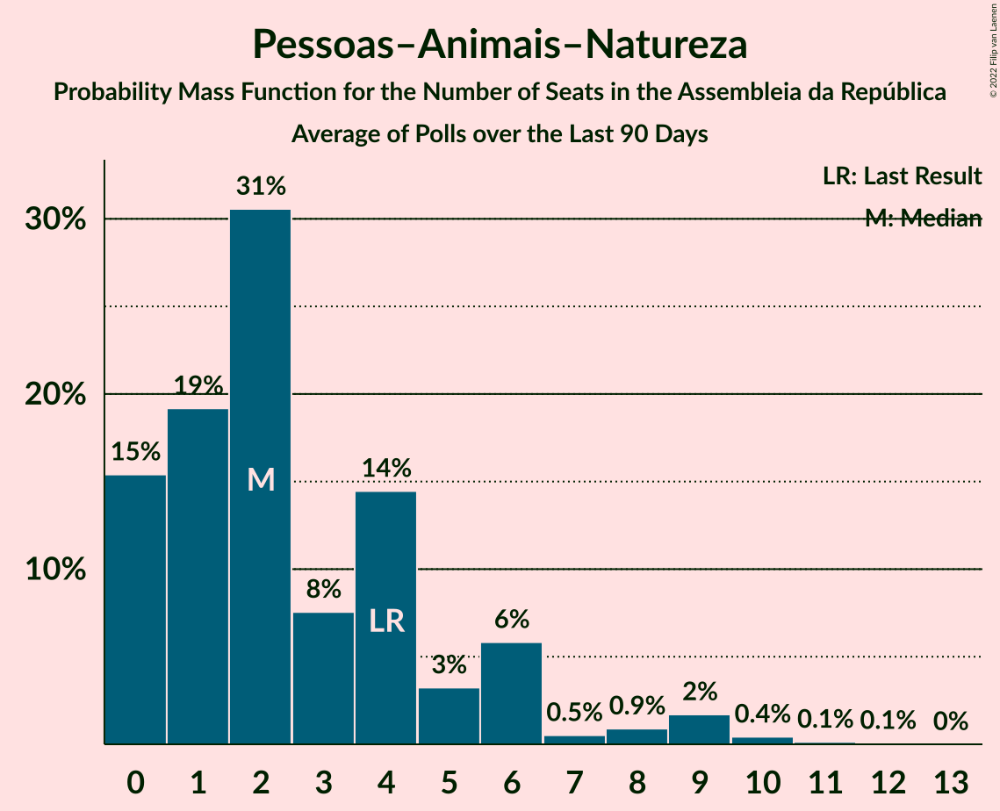
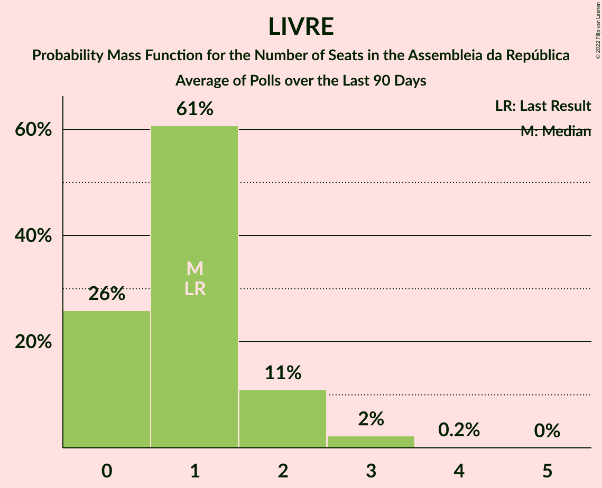

# Poll Average

<a href="#voting-intentions">Voting Intentions</a> | <a href="#seats">Seats</a> | <a href="#coalitions">Coalitions</a> | <a href="#technical-information">Technical Information</a>

## Summary

The table below lists the polls on which the average is based. They are the most recent polls (less than 90 days old) registered and analyzed so far.

| Period     | Polling firm/Commissioner(s) | PS | PSD | BE | CDU | CDS–PP | PAN | CH | IL | L | A |
|:----------:|:----------------------------:|:--:|:--:|:--:|:--:|:--:|:--:|:--:|:--:|:--:|:--:|
| 6 October 2019 | General Election | 36.4%   108 | 27.8%   79 | 9.5%   19 | 6.3%   12 | 4.2%   5 | 3.3%   4 | 1.3%   1 | 1.3%   1 | 1.1%   1 | 0.8%   0 |
| N/A | Poll Average | 34–45%   102–129 | 22–30%   58–85 | 4–11%   7–22 | 4–7%   5–14 | 0–3%   0–2 | 2–6%   1–9 | 5–11%   7–22 | 1–8%   1–14 | 0–1%   0–1 | N/A   N/A |
| [24 January 2021](2021-01-24-CESOP–UCP.html) | CESOP–UCP   Público and RTP | 34–36%   102–109 | 22–24%   62–69 | 7–9%   14–18 | 5–7%   8–14 | 2%   0–1 | 2%   1–2 | 8–10%   14–20 | 6–8%   12–14 | 1%   0–1 | N/A   N/A |
| [7–18 January 2021](2021-01-18-Pitagórica.html) | Pitagórica   Observador and TVI | 39–46%   111–134 | 22–29%   59–79 | 4–7%   4–14 | 4–7%   5–15 | 1–3%   0–2 | 1–4%   0–4 | 5–9%   7–17 | 3–7%   4–12 | N/A   N/A | N/A   N/A |
| [11–14 January 2021](2021-01-14-Eurosondagem.html) | Eurosondagem   Porto Canal and Sol | 36–42%   106–123 | 25–31%   73–88 | 5–8%   7–16 | 4–7%   5–14 | 1–3%   0–2 | 1–3%   1–4 | 4–7%   4–12 | 1–2%   0–3 | N/A   N/A | N/A   N/A |
| [4–7 January 2021](2021-01-07-Intercampus.html) | Intercampus | 34–42%   97–122 | 21–28%   55–76 | 7–12%   12–25 | 4–8%   5–15 | 1–4%   0–4 | 2–5%   2–8 | 7–12%   11–25 | 3–6%   3–9 | 0–1%   0 | N/A   N/A |
| [19–22 December 2020](2020-12-22-Aximage.html) | Aximage   Diário de Notícias, Jornal de Notícias and TSF Rádio Notícias | 35–42%   102–121 | 22–28%   61–79 | 7–11%   12–21 | 4–7%   6–14 | 0–1%   0 | 3–6%   4–10 | 6–10%   9–18 | 2–5%   3–7 | 0–1%   0–1 | N/A   N/A |
| 6 October 2019 | General Election | 36.4%   108 | 27.8%   79 | 9.5%   19 | 6.3%   12 | 4.2%   5 | 3.3%   4 | 1.3%   1 | 1.3%   1 | 1.1%   1 | 0.8%   0 |

Only polls for which at least the sample size has been published are included in the table above.

**Legend:**
+ **Top half of each row:** Voting intentions (95% confidence interval)
+ **Bottom half of each row:** Seat projections for the Assembleia da República (95% confidence interval)
+ **PS:** Partido Socialista
+ **PSD:** Partido Social Democrata
+ **BE:** Bloco de Esquerda
+ **CDU:** Coligação Democrática Unitária
+ **CDS–PP:** CDS–Partido Popular
+ **PAN:** Pessoas–Animais–Natureza
+ **CH:** Chega
+ **IL:** Iniciativa Liberal
+ **L:** LIVRE
+ **A:** Aliança
+ **N/A (single party):** Party not included the published results
+ **N/A (entire row):** Calculation for this opinion poll not started yet

## Voting Intentions

### Confidence Intervals

| Party | Last Result | Median | 80% Confidence Interval | 90% Confidence Interval | 95% Confidence Interval | 99% Confidence Interval |
|:-----:|:-----------:|:------:|:-----------------------:|:-----------------------:|:-----------------------:|:-----------------------:|
| <a href="#partido-socialista">Partido Socialista</a> | 36.4% | 38.5% | 34.9–42.6% |34.4–43.8% | 34.1–44.7% | 33.5–46.3% |
| <a href="#partido-social-democrata">Partido Social Democrata</a> | 27.8% | 25.1% | 22.6–28.4% |22.2–29.2% | 21.8–29.8% | 20.7–30.9% |
| <a href="#bloco-de-esquerda">Bloco de Esquerda</a> | 9.5% | 7.8% | 5.4–9.7% |4.9–10.2% | 4.5–10.8% | 3.9–11.7% |
| <a href="#coligação-democrática-unitária">Coligação Democrática Unitária</a> | 6.3% | 5.7% | 4.7–6.7% |4.4–7.0% | 4.1–7.4% | 3.7–8.1% |
| <a href="#cds–partido-popular">CDS–Partido Popular</a> | 4.2% | 1.9% | 0.3–2.7% |0.2–3.0% | 0.1–3.3% | 0.1–3.9% |
| <a href="#pessoas–animais–natureza">Pessoas–Animais–Natureza</a> | 3.3% | 2.6% | 1.8–4.9% |1.7–5.4% | 1.5–5.7% | 1.3–6.4% |
| <a href="#chega">Chega</a> | 1.3% | 7.9% | 5.4–9.6% |5.0–10.1% | 4.7–10.6% | 4.2–11.7% |
| <a href="#iniciativa-liberal">Iniciativa Liberal</a> | 1.3% | 4.1% | 1.3–7.0% |1.1–7.3% | 1.0–7.5% | 0.8–7.8% |
| <a href="#livre">LIVRE</a> | 1.1% | 0.6% | 0.2–1.1% |0.1–1.2% | 0.1–1.3% | 0.0–1.4% |
| <a href="#aliança">Aliança</a> | 0.8% | N/A | N/A |N/A | N/A | N/A |

### Partido Socialista

*For a full overview of the results for this party, see the [Partido Socialista](party-partidosocialista.html) page.*

| Voting Intentions | Probability | Accumulated | Special Marks |
|:-----------------:|:-----------:|:-----------:|:-------------:|
| 31.5–32.5% | 0% | 100% |  |
| 32.5–33.5% | 0.5% | 99.9% |  |
| 33.5–34.5% | 6% | 99.4% |  |
| 34.5–35.5% | 12% | 94% |  |
| 35.5–36.5% | 9% | 81% | Last Result |
| 36.5–37.5% | 10% | 72% |  |
| 37.5–38.5% | 13% | 63% |  |
| 38.5–39.5% | 14% | 50% | Median |
| 39.5–40.5% | 11% | 36% |  |
| 40.5–41.5% | 8% | 24% |  |
| 41.5–42.5% | 6% | 16% |  |
| 42.5–43.5% | 4% | 10% |  |
| 43.5–44.5% | 3% | 6% |  |
| 44.5–45.5% | 2% | 3% |  |
| 45.5–46.5% | 0.8% | 1.2% |  |
| 46.5–47.5% | 0.3% | 0.4% |  |
| 47.5–48.5% | 0.1% | 0.1% |  |
| 48.5–49.5% | 0% | 0% |  |

### Partido Social Democrata

*For a full overview of the results for this party, see the [Partido Social Democrata](party-partidosocialdemocrata.html) page.*

| Voting Intentions | Probability | Accumulated | Special Marks |
|:-----------------:|:-----------:|:-----------:|:-------------:|
| 17.5–18.5% | 0% | 100% |  |
| 18.5–19.5% | 0.1% | 100% |  |
| 19.5–20.5% | 0.3% | 99.9% |  |
| 20.5–21.5% | 1.3% | 99.6% |  |
| 21.5–22.5% | 8% | 98% |  |
| 22.5–23.5% | 18% | 91% |  |
| 23.5–24.5% | 15% | 72% |  |
| 24.5–25.5% | 14% | 57% | Median |
| 25.5–26.5% | 14% | 43% |  |
| 26.5–27.5% | 12% | 30% |  |
| 27.5–28.5% | 9% | 18% | Last Result |
| 28.5–29.5% | 6% | 9% |  |
| 29.5–30.5% | 2% | 3% |  |
| 30.5–31.5% | 0.7% | 0.9% |  |
| 31.5–32.5% | 0.1% | 0.2% |  |
| 32.5–33.5% | 0% | 0% |  |

### Bloco de Esquerda

*For a full overview of the results for this party, see the [Bloco de Esquerda](party-blocodeesquerda.html) page.*

| Voting Intentions | Probability | Accumulated | Special Marks |
|:-----------------:|:-----------:|:-----------:|:-------------:|
| 1.5–2.5% | 0% | 100% |  |
| 2.5–3.5% | 0.1% | 100% |  |
| 3.5–4.5% | 3% | 99.9% |  |
| 4.5–5.5% | 10% | 97% |  |
| 5.5–6.5% | 16% | 88% |  |
| 6.5–7.5% | 16% | 72% |  |
| 7.5–8.5% | 30% | 56% | Median |
| 8.5–9.5% | 16% | 27% |  |
| 9.5–10.5% | 8% | 11% | Last Result |
| 10.5–11.5% | 3% | 3% |  |
| 11.5–12.5% | 0.6% | 0.7% |  |
| 12.5–13.5% | 0.1% | 0.1% |  |
| 13.5–14.5% | 0% | 0% |  |

### Coligação Democrática Unitária

*For a full overview of the results for this party, see the [Coligação Democrática Unitária](party-coligaçãodemocráticaunitária.html) page.*

| Voting Intentions | Probability | Accumulated | Special Marks |
|:-----------------:|:-----------:|:-----------:|:-------------:|
| 1.5–2.5% | 0% | 100% |  |
| 2.5–3.5% | 0.3% | 100% |  |
| 3.5–4.5% | 8% | 99.7% |  |
| 4.5–5.5% | 33% | 92% |  |
| 5.5–6.5% | 47% | 59% | Last Result, Median |
| 6.5–7.5% | 11% | 13% |  |
| 7.5–8.5% | 2% | 2% |  |
| 8.5–9.5% | 0.1% | 0.1% |  |
| 9.5–10.5% | 0% | 0% |  |

### CDS–Partido Popular

*For a full overview of the results for this party, see the [CDS–Partido Popular](party-cds–partidopopular.html) page.*

| Voting Intentions | Probability | Accumulated | Special Marks |
|:-----------------:|:-----------:|:-----------:|:-------------:|
| 0.0–0.5% | 16% | 100% |  |
| 0.5–1.5% | 14% | 84% |  |
| 1.5–2.5% | 55% | 69% | Median |
| 2.5–3.5% | 13% | 14% |  |
| 3.5–4.5% | 1.2% | 1.3% | Last Result |
| 4.5–5.5% | 0.1% | 0.1% |  |
| 5.5–6.5% | 0% | 0% |  |

### Pessoas–Animais–Natureza

*For a full overview of the results for this party, see the [Pessoas–Animais–Natureza](party-pessoas–animais–natureza.html) page.*

| Voting Intentions | Probability | Accumulated | Special Marks |
|:-----------------:|:-----------:|:-----------:|:-------------:|
| 0.0–0.5% | 0% | 100% |  |
| 0.5–1.5% | 3% | 100% |  |
| 1.5–2.5% | 46% | 97% |  |
| 2.5–3.5% | 19% | 52% | Last Result, Median |
| 3.5–4.5% | 17% | 32% |  |
| 4.5–5.5% | 12% | 15% |  |
| 5.5–6.5% | 3% | 4% |  |
| 6.5–7.5% | 0.3% | 0.3% |  |
| 7.5–8.5% | 0% | 0% |  |

### Iniciativa Liberal

*For a full overview of the results for this party, see the [Iniciativa Liberal](party-iniciativaliberal.html) page.*

| Voting Intentions | Probability | Accumulated | Special Marks |
|:-----------------:|:-----------:|:-----------:|:-------------:|
| 0.0–0.5% | 0% | 100% |  |
| 0.5–1.5% | 14% | 100% | Last Result |
| 1.5–2.5% | 7% | 86% |  |
| 2.5–3.5% | 16% | 79% |  |
| 3.5–4.5% | 23% | 63% | Median |
| 4.5–5.5% | 14% | 40% |  |
| 5.5–6.5% | 7% | 26% |  |
| 6.5–7.5% | 17% | 19% |  |
| 7.5–8.5% | 2% | 2% |  |
| 8.5–9.5% | 0% | 0% |  |

### Chega

*For a full overview of the results for this party, see the [Chega](party-chega.html) page.*

| Voting Intentions | Probability | Accumulated | Special Marks |
|:-----------------:|:-----------:|:-----------:|:-------------:|
| 0.5–1.5% | 0% | 100% | Last Result |
| 1.5–2.5% | 0% | 100% |  |
| 2.5–3.5% | 0% | 100% |  |
| 3.5–4.5% | 1.5% | 100% |  |
| 4.5–5.5% | 10% | 98% |  |
| 5.5–6.5% | 15% | 88% |  |
| 6.5–7.5% | 16% | 73% |  |
| 7.5–8.5% | 19% | 57% | Median |
| 8.5–9.5% | 27% | 38% |  |
| 9.5–10.5% | 8% | 11% |  |
| 10.5–11.5% | 2% | 3% |  |
| 11.5–12.5% | 0.5% | 0.6% |  |
| 12.5–13.5% | 0.1% | 0.1% |  |
| 13.5–14.5% | 0% | 0% |  |

### LIVRE

*For a full overview of the results for this party, see the [LIVRE](party-livre.html) page.*

| Voting Intentions | Probability | Accumulated | Special Marks |
|:-----------------:|:-----------:|:-----------:|:-------------:|
| 0.0–0.5% | 43% | 100% |  |
| 0.5–1.5% | 56% | 57% | Last Result, Median |
| 1.5–2.5% | 0.2% | 0.2% |  |
| 2.5–3.5% | 0% | 0% |  |

## Seats

### Confidence Intervals

| Party | Last Result | Median | 80% Confidence Interval | 90% Confidence Interval | 95% Confidence Interval | 99% Confidence Interval |
|:-----:|:-----------:|:------:|:-----------------------:|:-----------------------:|:-----------------------:|:-----------------------:|
| <a href="#partido-socialista">Partido Socialista</a> | 108 | 112 | 104–122 |103–127 | 102–129 | 97–134 |
| <a href="#partido-social-democrata">Partido Social Democrata</a> | 79 | 68 | 63–80 |60–83 | 58–85 | 55–88 |
| <a href="#bloco-de-esquerda">Bloco de Esquerda</a> | 19 | 14 | 7–19 |7–21 | 7–22 | 4–25 |
| <a href="#coligação-democrática-unitária">Coligação Democrática Unitária</a> | 12 | 9 | 6–13 |6–14 | 5–14 | 5–15 |
| <a href="#cds–partido-popular">CDS–Partido Popular</a> | 5 | 1 | 0–2 |0–2 | 0–2 | 0–4 |
| <a href="#pessoas–animais–natureza">Pessoas–Animais–Natureza</a> | 4 | 2 | 1–6 |1–8 | 1–9 | 0–10 |
| <a href="#chega">Chega</a> | 1 | 14 | 8–19 |8–20 | 7–22 | 4–25 |
| <a href="#iniciativa-liberal">Iniciativa Liberal</a> | 1 | 5 | 1–12 |1–14 | 1–14 | 0–14 |
| <a href="#livre">LIVRE</a> | 1 | 0 | 0–1 |0–1 | 0–1 | 0–1 |
| <a href="#aliança">Aliança</a> | 0 | N/A | N/A |N/A | N/A | N/A |

### Partido Socialista

*For a full overview of the results for this party, see the [Partido Socialista](party-partidosocialista.html) page.*

| Number of Seats | Probability | Accumulated | Special Marks |
|:---------------:|:-----------:|:-----------:|:-------------:|
| 92 | 0% | 100% |  |
| 93 | 0% | 99.9% |  |
| 94 | 0.1% | 99.9% |  |
| 95 | 0% | 99.8% |  |
| 96 | 0.1% | 99.8% |  |
| 97 | 0.2% | 99.7% |  |
| 98 | 0.2% | 99.5% |  |
| 99 | 0.1% | 99.3% |  |
| 100 | 0.3% | 99.2% |  |
| 101 | 0.9% | 99.0% |  |
| 102 | 2% | 98% |  |
| 103 | 3% | 96% |  |
| 104 | 4% | 93% |  |
| 105 | 4% | 89% |  |
| 106 | 5% | 84% |  |
| 107 | 4% | 80% |  |
| 108 | 4% | 76% | Last Result |
| 109 | 9% | 72% |  |
| 110 | 3% | 63% |  |
| 111 | 4% | 60% |  |
| 112 | 6% | 55% | Median |
| 113 | 3% | 50% |  |
| 114 | 4% | 47% |  |
| 115 | 3% | 43% |  |
| 116 | 10% | 40% | Majority |
| 117 | 4% | 30% |  |
| 118 | 4% | 26% |  |
| 119 | 3% | 23% |  |
| 120 | 4% | 19% |  |
| 121 | 4% | 15% |  |
| 122 | 2% | 11% |  |
| 123 | 1.3% | 9% |  |
| 124 | 0.9% | 8% |  |
| 125 | 1.1% | 7% |  |
| 126 | 0.8% | 6% |  |
| 127 | 0.9% | 5% |  |
| 128 | 1.1% | 4% |  |
| 129 | 0.8% | 3% |  |
| 130 | 0.4% | 2% |  |
| 131 | 0.4% | 2% |  |
| 132 | 0.3% | 2% |  |
| 133 | 0.4% | 1.4% |  |
| 134 | 0.6% | 1.0% |  |
| 135 | 0.2% | 0.4% |  |
| 136 | 0.1% | 0.3% |  |
| 137 | 0.1% | 0.2% |  |
| 138 | 0.1% | 0.1% |  |
| 139 | 0% | 0.1% |  |
| 140 | 0% | 0% |  |

### Partido Social Democrata

*For a full overview of the results for this party, see the [Partido Social Democrata](party-partidosocialdemocrata.html) page.*

| Number of Seats | Probability | Accumulated | Special Marks |
|:---------------:|:-----------:|:-----------:|:-------------:|
| 52 | 0% | 100% |  |
| 53 | 0.1% | 99.9% |  |
| 54 | 0.2% | 99.8% |  |
| 55 | 0.3% | 99.6% |  |
| 56 | 0.6% | 99.3% |  |
| 57 | 0.9% | 98.7% |  |
| 58 | 1.2% | 98% |  |
| 59 | 1.4% | 97% |  |
| 60 | 1.1% | 95% |  |
| 61 | 1.2% | 94% |  |
| 62 | 2% | 93% |  |
| 63 | 3% | 91% |  |
| 64 | 4% | 88% |  |
| 65 | 5% | 83% |  |
| 66 | 20% | 78% |  |
| 67 | 5% | 58% |  |
| 68 | 5% | 53% | Median |
| 69 | 11% | 48% |  |
| 70 | 4% | 37% |  |
| 71 | 4% | 33% |  |
| 72 | 2% | 29% |  |
| 73 | 1.1% | 28% |  |
| 74 | 2% | 26% |  |
| 75 | 3% | 25% |  |
| 76 | 3% | 22% |  |
| 77 | 2% | 19% |  |
| 78 | 3% | 17% |  |
| 79 | 3% | 14% | Last Result |
| 80 | 1.4% | 11% |  |
| 81 | 1.5% | 9% |  |
| 82 | 1.5% | 8% |  |
| 83 | 2% | 6% |  |
| 84 | 1.2% | 4% |  |
| 85 | 1.2% | 3% |  |
| 86 | 0.7% | 2% |  |
| 87 | 0.4% | 1.1% |  |
| 88 | 0.3% | 0.7% |  |
| 89 | 0.1% | 0.5% |  |
| 90 | 0.2% | 0.4% |  |
| 91 | 0.1% | 0.1% |  |
| 92 | 0% | 0.1% |  |
| 93 | 0% | 0.1% |  |
| 94 | 0% | 0% |  |

### Bloco de Esquerda

*For a full overview of the results for this party, see the [Bloco de Esquerda](party-blocodeesquerda.html) page.*

| Number of Seats | Probability | Accumulated | Special Marks |
|:---------------:|:-----------:|:-----------:|:-------------:|
| 2 | 0.1% | 100% |  |
| 3 | 0.3% | 99.9% |  |
| 4 | 0.3% | 99.6% |  |
| 5 | 0.6% | 99.2% |  |
| 6 | 0.3% | 98.6% |  |
| 7 | 10% | 98% |  |
| 8 | 4% | 88% |  |
| 9 | 2% | 84% |  |
| 10 | 3% | 82% |  |
| 11 | 8% | 79% |  |
| 12 | 4% | 71% |  |
| 13 | 3% | 67% |  |
| 14 | 17% | 64% | Median |
| 15 | 6% | 46% |  |
| 16 | 14% | 40% |  |
| 17 | 4% | 27% |  |
| 18 | 12% | 23% |  |
| 19 | 3% | 10% | Last Result |
| 20 | 0.8% | 7% |  |
| 21 | 2% | 6% |  |
| 22 | 3% | 4% |  |
| 23 | 0.7% | 1.3% |  |
| 24 | 0.2% | 0.7% |  |
| 25 | 0.1% | 0.5% |  |
| 26 | 0.1% | 0.4% |  |
| 27 | 0.2% | 0.3% |  |
| 28 | 0% | 0.1% |  |
| 29 | 0% | 0.1% |  |
| 30 | 0% | 0% |  |

### Coligação Democrática Unitária

*For a full overview of the results for this party, see the [Coligação Democrática Unitária](party-coligaçãodemocráticaunitária.html) page.*

| Number of Seats | Probability | Accumulated | Special Marks |
|:---------------:|:-----------:|:-----------:|:-------------:|
| 3 | 0.1% | 100% |  |
| 4 | 0.3% | 99.9% |  |
| 5 | 4% | 99.7% |  |
| 6 | 6% | 95% |  |
| 7 | 22% | 89% |  |
| 8 | 7% | 67% |  |
| 9 | 10% | 60% | Median |
| 10 | 23% | 50% |  |
| 11 | 7% | 26% |  |
| 12 | 6% | 20% | Last Result |
| 13 | 5% | 14% |  |
| 14 | 7% | 9% |  |
| 15 | 2% | 2% |  |
| 16 | 0.3% | 0.4% |  |
| 17 | 0.1% | 0.2% |  |
| 18 | 0.1% | 0.1% |  |
| 19 | 0% | 0% |  |

### CDS–Partido Popular

*For a full overview of the results for this party, see the [CDS–Partido Popular](party-cds–partidopopular.html) page.*

| Number of Seats | Probability | Accumulated | Special Marks |
|:---------------:|:-----------:|:-----------:|:-------------:|
| 0 | 45% | 100% |  |
| 1 | 45% | 55% | Median |
| 2 | 8% | 10% |  |
| 3 | 1.2% | 2% |  |
| 4 | 0.6% | 0.8% |  |
| 5 | 0.2% | 0.2% | Last Result |
| 6 | 0% | 0% |  |

### Pessoas–Animais–Natureza

*For a full overview of the results for this party, see the [Pessoas–Animais–Natureza](party-pessoas–animais–natureza.html) page.*

| Number of Seats | Probability | Accumulated | Special Marks |
|:---------------:|:-----------:|:-----------:|:-------------:|
| 0 | 2% | 100% |  |
| 1 | 19% | 98% |  |
| 2 | 37% | 79% | Median |
| 3 | 7% | 43% |  |
| 4 | 11% | 35% | Last Result |
| 5 | 5% | 25% |  |
| 6 | 13% | 20% |  |
| 7 | 0.7% | 6% |  |
| 8 | 0.7% | 6% |  |
| 9 | 4% | 5% |  |
| 10 | 0.3% | 0.8% |  |
| 11 | 0.4% | 0.5% |  |
| 12 | 0% | 0% |  |

### Chega

*For a full overview of the results for this party, see the [Chega](party-chega.html) page.*

| Number of Seats | Probability | Accumulated | Special Marks |
|:---------------:|:-----------:|:-----------:|:-------------:|
| 1 | 0% | 100% | Last Result |
| 2 | 0% | 100% |  |
| 3 | 0% | 100% |  |
| 4 | 0.6% | 100% |  |
| 5 | 0.6% | 99.4% |  |
| 6 | 0.9% | 98.8% |  |
| 7 | 1.3% | 98% |  |
| 8 | 8% | 97% |  |
| 9 | 5% | 88% |  |
| 10 | 4% | 83% |  |
| 11 | 18% | 80% |  |
| 12 | 4% | 61% |  |
| 13 | 3% | 57% |  |
| 14 | 24% | 54% | Median |
| 15 | 4% | 30% |  |
| 16 | 3% | 27% |  |
| 17 | 3% | 24% |  |
| 18 | 8% | 20% |  |
| 19 | 6% | 12% |  |
| 20 | 2% | 6% |  |
| 21 | 1.3% | 4% |  |
| 22 | 0.8% | 3% |  |
| 23 | 0.8% | 2% |  |
| 24 | 0.7% | 1.3% |  |
| 25 | 0.3% | 0.6% |  |
| 26 | 0.2% | 0.3% |  |
| 27 | 0.1% | 0.1% |  |
| 28 | 0% | 0.1% |  |
| 29 | 0% | 0% |  |

### Iniciativa Liberal

*For a full overview of the results for this party, see the [Iniciativa Liberal](party-iniciativaliberal.html) page.*

| Number of Seats | Probability | Accumulated | Special Marks |
|:---------------:|:-----------:|:-----------:|:-------------:|
| 0 | 2% | 100% |  |
| 1 | 15% | 98% | Last Result |
| 2 | 1.2% | 83% |  |
| 3 | 10% | 82% |  |
| 4 | 15% | 72% |  |
| 5 | 9% | 57% | Median |
| 6 | 19% | 48% |  |
| 7 | 2% | 29% |  |
| 8 | 1.3% | 27% |  |
| 9 | 1.0% | 26% |  |
| 10 | 3% | 25% |  |
| 11 | 0.7% | 22% |  |
| 12 | 13% | 21% |  |
| 13 | 3% | 9% |  |
| 14 | 6% | 6% |  |
| 15 | 0% | 0% |  |

### LIVRE

*For a full overview of the results for this party, see the [LIVRE](party-livre.html) page.*

| Number of Seats | Probability | Accumulated | Special Marks |
|:---------------:|:-----------:|:-----------:|:-------------:|
| 0 | 88% | 100% | Median |
| 1 | 12% | 12% | Last Result |
| 2 | 0% | 0% |  |

### Aliança

*For a full overview of the results for this party, see the [Aliança](party-aliança.html) page.*

## Coalitions

### Confidence Intervals

| Coalition | Last Result | Median | Majority? | 80% Confidence Interval | 90% Confidence Interval | 95% Confidence Interval | 99% Confidence Interval |
|:---------:|:-----------:|:------:|:---------:|:-----------------------:|:-----------------------:|:-----------------------:|:-----------------------:|
| Partido Socialista – Bloco de Esquerda – Coligação Democrática Unitária | 139 | 137 | 100% | 130–144 | 129–146 | 127–148 | 124–152 |
| Partido Socialista – Bloco de Esquerda | 127 | 127 | 99.3% | 120–134 | 119–137 | 118–140 | 115–143 |
| Partido Socialista – Coligação Democrática Unitária | 120 | 122 | 84% | 114–131 | 113–136 | 111–139 | 107–143 |
| Partido Socialista | 108 | 112 | 40% | 104–122 | 103–127 | 102–129 | 97–134 |
| Partido Social Democrata – CDS–Partido Popular | 84 | 69 | 0% | 64–81 | 61–84 | 59–86 | 56–89 |

### Partido Socialista – Bloco de Esquerda – Coligação Democrática Unitária

| Number of Seats | Probability | Accumulated | Special Marks |
|:---------------:|:-----------:|:-----------:|:-------------:|
| 119 | 0% | 100% |  |
| 120 | 0% | 99.9% |  |
| 121 | 0% | 99.9% |  |
| 122 | 0.1% | 99.9% |  |
| 123 | 0.1% | 99.8% |  |
| 124 | 0.3% | 99.6% |  |
| 125 | 0.6% | 99.3% |  |
| 126 | 0.5% | 98.7% |  |
| 127 | 1.2% | 98% |  |
| 128 | 2% | 97% |  |
| 129 | 4% | 95% |  |
| 130 | 5% | 91% |  |
| 131 | 4% | 87% |  |
| 132 | 4% | 82% |  |
| 133 | 6% | 78% |  |
| 134 | 6% | 72% |  |
| 135 | 9% | 65% | Median |
| 136 | 6% | 57% |  |
| 137 | 14% | 50% |  |
| 138 | 7% | 36% |  |
| 139 | 5% | 29% | Last Result |
| 140 | 3% | 24% |  |
| 141 | 4% | 21% |  |
| 142 | 3% | 17% |  |
| 143 | 3% | 13% |  |
| 144 | 2% | 10% |  |
| 145 | 2% | 8% |  |
| 146 | 2% | 6% |  |
| 147 | 1.2% | 4% |  |
| 148 | 0.6% | 3% |  |
| 149 | 0.7% | 2% |  |
| 150 | 0.8% | 2% |  |
| 151 | 0.3% | 0.9% |  |
| 152 | 0.2% | 0.6% |  |
| 153 | 0.1% | 0.3% |  |
| 154 | 0.1% | 0.2% |  |
| 155 | 0% | 0.1% |  |
| 156 | 0% | 0.1% |  |
| 157 | 0% | 0% |  |

### Partido Socialista – Bloco de Esquerda

| Number of Seats | Probability | Accumulated | Special Marks |
|:---------------:|:-----------:|:-----------:|:-------------:|
| 110 | 0% | 100% |  |
| 111 | 0% | 99.9% |  |
| 112 | 0.1% | 99.9% |  |
| 113 | 0.1% | 99.8% |  |
| 114 | 0.1% | 99.7% |  |
| 115 | 0.2% | 99.6% |  |
| 116 | 0.6% | 99.3% | Majority |
| 117 | 0.8% | 98.7% |  |
| 118 | 2% | 98% |  |
| 119 | 4% | 96% |  |
| 120 | 5% | 92% |  |
| 121 | 3% | 86% |  |
| 122 | 5% | 83% |  |
| 123 | 5% | 78% |  |
| 124 | 6% | 73% |  |
| 125 | 7% | 67% |  |
| 126 | 4% | 60% | Median |
| 127 | 7% | 56% | Last Result |
| 128 | 7% | 49% |  |
| 129 | 5% | 42% |  |
| 130 | 14% | 37% |  |
| 131 | 4% | 22% |  |
| 132 | 4% | 18% |  |
| 133 | 3% | 14% |  |
| 134 | 2% | 12% |  |
| 135 | 2% | 9% |  |
| 136 | 2% | 7% |  |
| 137 | 0.9% | 5% |  |
| 138 | 1.0% | 4% |  |
| 139 | 0.5% | 3% |  |
| 140 | 0.9% | 3% |  |
| 141 | 0.7% | 2% |  |
| 142 | 0.4% | 1.0% |  |
| 143 | 0.2% | 0.7% |  |
| 144 | 0.1% | 0.4% |  |
| 145 | 0.1% | 0.3% |  |
| 146 | 0.1% | 0.2% |  |
| 147 | 0% | 0.1% |  |
| 148 | 0% | 0.1% |  |
| 149 | 0% | 0% |  |

### Partido Socialista – Coligação Democrática Unitária

| Number of Seats | Probability | Accumulated | Special Marks |
|:---------------:|:-----------:|:-----------:|:-------------:|
| 102 | 0% | 100% |  |
| 103 | 0% | 99.9% |  |
| 104 | 0.1% | 99.9% |  |
| 105 | 0.1% | 99.8% |  |
| 106 | 0.2% | 99.8% |  |
| 107 | 0.2% | 99.6% |  |
| 108 | 0.2% | 99.4% |  |
| 109 | 0.5% | 99.2% |  |
| 110 | 0.5% | 98.7% |  |
| 111 | 0.8% | 98% |  |
| 112 | 2% | 97% |  |
| 113 | 3% | 96% |  |
| 114 | 4% | 92% |  |
| 115 | 5% | 88% |  |
| 116 | 3% | 84% | Majority |
| 117 | 3% | 81% |  |
| 118 | 6% | 78% |  |
| 119 | 12% | 72% |  |
| 120 | 4% | 60% | Last Result |
| 121 | 3% | 56% | Median |
| 122 | 3% | 53% |  |
| 123 | 12% | 50% |  |
| 124 | 5% | 38% |  |
| 125 | 3% | 33% |  |
| 126 | 3% | 30% |  |
| 127 | 4% | 27% |  |
| 128 | 4% | 23% |  |
| 129 | 4% | 19% |  |
| 130 | 4% | 15% |  |
| 131 | 2% | 11% |  |
| 132 | 2% | 10% |  |
| 133 | 1.1% | 8% |  |
| 134 | 1.2% | 7% |  |
| 135 | 0.6% | 6% |  |
| 136 | 0.8% | 5% |  |
| 137 | 0.6% | 4% |  |
| 138 | 1.0% | 4% |  |
| 139 | 1.0% | 3% |  |
| 140 | 0.4% | 2% |  |
| 141 | 0.3% | 1.3% |  |
| 142 | 0.4% | 1.0% |  |
| 143 | 0.3% | 0.6% |  |
| 144 | 0.1% | 0.3% |  |
| 145 | 0.1% | 0.2% |  |
| 146 | 0% | 0.1% |  |
| 147 | 0% | 0.1% |  |
| 148 | 0% | 0% |  |

### Partido Socialista

| Number of Seats | Probability | Accumulated | Special Marks |
|:---------------:|:-----------:|:-----------:|:-------------:|
| 92 | 0% | 100% |  |
| 93 | 0% | 99.9% |  |
| 94 | 0.1% | 99.9% |  |
| 95 | 0% | 99.8% |  |
| 96 | 0.1% | 99.8% |  |
| 97 | 0.2% | 99.7% |  |
| 98 | 0.2% | 99.5% |  |
| 99 | 0.1% | 99.3% |  |
| 100 | 0.3% | 99.2% |  |
| 101 | 0.9% | 99.0% |  |
| 102 | 2% | 98% |  |
| 103 | 3% | 96% |  |
| 104 | 4% | 93% |  |
| 105 | 4% | 89% |  |
| 106 | 5% | 84% |  |
| 107 | 4% | 80% |  |
| 108 | 4% | 76% | Last Result |
| 109 | 9% | 72% |  |
| 110 | 3% | 63% |  |
| 111 | 4% | 60% |  |
| 112 | 6% | 55% | Median |
| 113 | 3% | 50% |  |
| 114 | 4% | 47% |  |
| 115 | 3% | 43% |  |
| 116 | 10% | 40% | Majority |
| 117 | 4% | 30% |  |
| 118 | 4% | 26% |  |
| 119 | 3% | 23% |  |
| 120 | 4% | 19% |  |
| 121 | 4% | 15% |  |
| 122 | 2% | 11% |  |
| 123 | 1.3% | 9% |  |
| 124 | 0.9% | 8% |  |
| 125 | 1.1% | 7% |  |
| 126 | 0.8% | 6% |  |
| 127 | 0.9% | 5% |  |
| 128 | 1.1% | 4% |  |
| 129 | 0.8% | 3% |  |
| 130 | 0.4% | 2% |  |
| 131 | 0.4% | 2% |  |
| 132 | 0.3% | 2% |  |
| 133 | 0.4% | 1.4% |  |
| 134 | 0.6% | 1.0% |  |
| 135 | 0.2% | 0.4% |  |
| 136 | 0.1% | 0.3% |  |
| 137 | 0.1% | 0.2% |  |
| 138 | 0.1% | 0.1% |  |
| 139 | 0% | 0.1% |  |
| 140 | 0% | 0% |  |

### Partido Social Democrata – CDS–Partido Popular

| Number of Seats | Probability | Accumulated | Special Marks |
|:---------------:|:-----------:|:-----------:|:-------------:|
| 53 | 0.1% | 100% |  |
| 54 | 0.1% | 99.9% |  |
| 55 | 0.3% | 99.8% |  |
| 56 | 0.2% | 99.5% |  |
| 57 | 0.8% | 99.3% |  |
| 58 | 0.7% | 98.5% |  |
| 59 | 1.3% | 98% |  |
| 60 | 1.2% | 97% |  |
| 61 | 1.5% | 95% |  |
| 62 | 2% | 94% |  |
| 63 | 2% | 92% |  |
| 64 | 3% | 90% |  |
| 65 | 5% | 87% |  |
| 66 | 11% | 82% |  |
| 67 | 13% | 71% |  |
| 68 | 7% | 58% |  |
| 69 | 11% | 51% | Median |
| 70 | 4% | 39% |  |
| 71 | 4% | 35% |  |
| 72 | 3% | 32% |  |
| 73 | 1.2% | 29% |  |
| 74 | 2% | 28% |  |
| 75 | 3% | 26% |  |
| 76 | 3% | 24% |  |
| 77 | 3% | 21% |  |
| 78 | 2% | 18% |  |
| 79 | 3% | 16% |  |
| 80 | 3% | 13% |  |
| 81 | 2% | 11% |  |
| 82 | 1.2% | 9% |  |
| 83 | 2% | 8% |  |
| 84 | 2% | 6% | Last Result |
| 85 | 0.9% | 4% |  |
| 86 | 1.4% | 3% |  |
| 87 | 0.7% | 2% |  |
| 88 | 0.4% | 1.0% |  |
| 89 | 0.2% | 0.7% |  |
| 90 | 0.1% | 0.5% |  |
| 91 | 0.2% | 0.4% |  |
| 92 | 0% | 0.2% |  |
| 93 | 0% | 0.1% |  |
| 94 | 0% | 0.1% |  |
| 95 | 0% | 0% |  |

## Technical Information

+ **Number of polls included in this average:** 5
+ **Lowest number of simulations done in a poll included in this average:** 131,072
+ **Total number of simulations done in the polls included in this average:** 4,325,376
+ **Error estimate:** 3.03%
