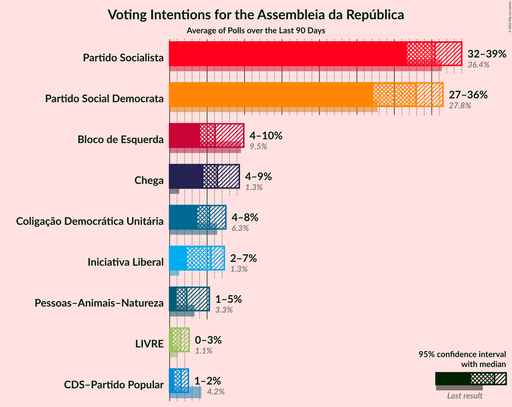

# Poll Average

<a href="#voting-intentions">Voting Intentions</a> | <a href="#seats">Seats</a> | <a href="#coalitions">Coalitions</a> | <a href="#technical-information">Technical Information</a>

## Summary

The table below lists the polls on which the average is based. They are the most recent polls (less than 90 days old) registered and analyzed so far.

| Period     | Polling firm/Commissioner(s) | PSD | CDS–PP | PS | BE | CDU | PAN |
|:----------:|:----------------------------:|:--:|:--:|:--:|:--:|:--:|:--:|
| 4 October 2015 | General Election | 36.9%   89 | 36.9%   18 | 32.3%   86 | 10.2%   19 | 8.2%   17 | 1.4%   1 |
| N/A | Poll Average | 24–30%   64–81 | 6–9%   7–18 | 39–45%   109–127 | 6–10%   10–18 | 6–9%   8–17 | 1–3%   0–3 |
| [4–7 January 2019](2019-01-07-Aximage.html) | Aximage   Correio da Manhã | N/A   N/A | N/A   N/A | N/A   N/A | N/A   N/A | N/A   N/A | N/A   N/A |
| [7–14 November 2018](2018-11-14-Eurosondagem.html) | Eurosondagem   Expresso and SIC | 24–30%   64–81 | 6–9%   7–18 | 39–45%   109–127 | 6–9%   10–18 | 6–9%   8–17 | 1–3%   0–3 |
| 4 October 2015 | General Election | 36.9%   89 | 36.9%   18 | 32.3%   86 | 10.2%   19 | 8.2%   17 | 1.4%   1 |

Only polls for which at least the sample size has been published are included in the table above.

**Legend:**
+ **Top half of each row:** Voting intentions (95% confidence interval)
+ **Bottom half of each row:** Seat projections for the Assembleia da República (95% confidence interval)
+ **PSD:** Partido Social Democrata
+ **CDS–PP:** CDS–Partido Popular
+ **PS:** Partido Socialista
+ **BE:** Bloco de Esquerda
+ **CDU:** Coligação Democrática Unitária
+ **PAN:** Pessoas–Animais–Natureza
+ **N/A (single party):** Party not included the published results
+ **N/A (entire row):** Calculation for this opinion poll not started yet

## Voting Intentions

### Confidence Intervals

| Party | Last Result | Median | 80% Confidence Interval | 90% Confidence Interval | 95% Confidence Interval | 99% Confidence Interval |
|:-----:|:-----------:|:------:|:-----------------------:|:-----------------------:|:-----------------------:|:-----------------------:|
| <a href="#partido-social-democrata">Partido Social Democrata</a> | 36.9% | 26.8% | 25.1–28.6% |24.6–29.2% | 24.2–29.6% | 23.4–30.5% |
| <a href="#cds–partido-popular">CDS–Partido Popular</a> | 36.9% | 7.0% | 6.1–8.1% |5.8–8.4% | 5.6–8.7% | 5.2–9.3% |
| <a href="#partido-socialista">Partido Socialista</a> | 32.3% | 41.9% | 39.9–43.8% |39.3–44.4% | 38.9–44.9% | 37.9–45.9% |
| <a href="#bloco-de-esquerda">Bloco de Esquerda</a> | 10.2% | 7.7% | 6.7–8.8% |6.4–9.2% | 6.2–9.5% | 5.8–10.1% |
| <a href="#coligação-democrática-unitária">Coligação Democrática Unitária</a> | 8.2% | 7.0% | 6.1–8.1% |5.8–8.4% | 5.6–8.7% | 5.2–9.3% |
| <a href="#pessoas–animais–natureza">Pessoas–Animais–Natureza</a> | 1.4% | 1.8% | 1.3–2.4% |1.2–2.6% | 1.1–2.8% | 1.0–3.1% |

### Partido Social Democrata

*For a full overview of the results for this party, see the [Partido Social Democrata](party-partidosocialdemocrata.html) page.*

| Voting Intentions | Probability | Accumulated | Special Marks |
|:-----------------:|:-----------:|:-----------:|:-------------:|
| 21.5–22.5% | 0.1% | 100% |  |
| 22.5–23.5% | 0.7% | 99.9% |  |
| 23.5–24.5% | 4% | 99.3% |  |
| 24.5–25.5% | 13% | 95% |  |
| 25.5–26.5% | 24% | 83% |  |
| 26.5–27.5% | 28% | 58% | Median |
| 27.5–28.5% | 19% | 31% |  |
| 28.5–29.5% | 9% | 11% |  |
| 29.5–30.5% | 2% | 3% |  |
| 30.5–31.5% | 0.4% | 0.5% |  |
| 31.5–32.5% | 0% | 0.1% |  |
| 32.5–33.5% | 0% | 0% |  |
| 33.5–34.5% | 0% | 0% |  |
| 34.5–35.5% | 0% | 0% |  |
| 35.5–36.5% | 0% | 0% |  |
| 36.5–37.5% | 0% | 0% | Last Result |

### CDS–Partido Popular

*For a full overview of the results for this party, see the [CDS–Partido Popular](party-cds–partidopopular.html) page.*

| Voting Intentions | Probability | Accumulated | Special Marks |
|:-----------------:|:-----------:|:-----------:|:-------------:|
| 3.5–4.5% | 0% | 100% |  |
| 4.5–5.5% | 2% | 100% |  |
| 5.5–6.5% | 25% | 98% |  |
| 6.5–7.5% | 46% | 73% | Median |
| 7.5–8.5% | 23% | 26% |  |
| 8.5–9.5% | 3% | 4% |  |
| 9.5–10.5% | 0.2% | 0.2% |  |
| 10.5–11.5% | 0% | 0% |  |
| 11.5–12.5% | 0% | 0% |  |
| 12.5–13.5% | 0% | 0% |  |
| 13.5–14.5% | 0% | 0% |  |
| 14.5–15.5% | 0% | 0% |  |
| 15.5–16.5% | 0% | 0% |  |
| 16.5–17.5% | 0% | 0% |  |
| 17.5–18.5% | 0% | 0% |  |
| 18.5–19.5% | 0% | 0% |  |
| 19.5–20.5% | 0% | 0% |  |
| 20.5–21.5% | 0% | 0% |  |
| 21.5–22.5% | 0% | 0% |  |
| 22.5–23.5% | 0% | 0% |  |
| 23.5–24.5% | 0% | 0% |  |
| 24.5–25.5% | 0% | 0% |  |
| 25.5–26.5% | 0% | 0% |  |
| 26.5–27.5% | 0% | 0% |  |
| 27.5–28.5% | 0% | 0% |  |
| 28.5–29.5% | 0% | 0% |  |
| 29.5–30.5% | 0% | 0% |  |
| 30.5–31.5% | 0% | 0% |  |
| 31.5–32.5% | 0% | 0% |  |
| 32.5–33.5% | 0% | 0% |  |
| 33.5–34.5% | 0% | 0% |  |
| 34.5–35.5% | 0% | 0% |  |
| 35.5–36.5% | 0% | 0% |  |
| 36.5–37.5% | 0% | 0% | Last Result |

### Partido Socialista

*For a full overview of the results for this party, see the [Partido Socialista](party-partidosocialista.html) page.*

| Voting Intentions | Probability | Accumulated | Special Marks |
|:-----------------:|:-----------:|:-----------:|:-------------:|
| 31.5–32.5% | 0% | 100% | Last Result |
| 32.5–33.5% | 0% | 100% |  |
| 33.5–34.5% | 0% | 100% |  |
| 34.5–35.5% | 0% | 100% |  |
| 35.5–36.5% | 0% | 100% |  |
| 36.5–37.5% | 0.2% | 100% |  |
| 37.5–38.5% | 1.3% | 99.8% |  |
| 38.5–39.5% | 5% | 98% |  |
| 39.5–40.5% | 13% | 93% |  |
| 40.5–41.5% | 22% | 80% |  |
| 41.5–42.5% | 25% | 58% | Median |
| 42.5–43.5% | 19% | 33% |  |
| 43.5–44.5% | 10% | 14% |  |
| 44.5–45.5% | 3% | 4% |  |
| 45.5–46.5% | 0.7% | 0.9% |  |
| 46.5–47.5% | 0.1% | 0.1% |  |
| 47.5–48.5% | 0% | 0% |  |

### Bloco de Esquerda

*For a full overview of the results for this party, see the [Bloco de Esquerda](party-blocodeesquerda.html) page.*

| Voting Intentions | Probability | Accumulated | Special Marks |
|:-----------------:|:-----------:|:-----------:|:-------------:|
| 3.5–4.5% | 0% | 100% |  |
| 4.5–5.5% | 0.2% | 100% |  |
| 5.5–6.5% | 7% | 99.8% |  |
| 6.5–7.5% | 35% | 93% |  |
| 7.5–8.5% | 42% | 58% | Median |
| 8.5–9.5% | 15% | 17% |  |
| 9.5–10.5% | 2% | 2% | Last Result |
| 10.5–11.5% | 0.1% | 0.1% |  |
| 11.5–12.5% | 0% | 0% |  |

### Coligação Democrática Unitária

*For a full overview of the results for this party, see the [Coligação Democrática Unitária](party-coligaçãodemocráticaunitária.html) page.*

| Voting Intentions | Probability | Accumulated | Special Marks |
|:-----------------:|:-----------:|:-----------:|:-------------:|
| 3.5–4.5% | 0% | 100% |  |
| 4.5–5.5% | 2% | 100% |  |
| 5.5–6.5% | 25% | 98% |  |
| 6.5–7.5% | 46% | 73% | Median |
| 7.5–8.5% | 23% | 26% | Last Result |
| 8.5–9.5% | 3% | 4% |  |
| 9.5–10.5% | 0.2% | 0.2% |  |
| 10.5–11.5% | 0% | 0% |  |

### Pessoas–Animais–Natureza

*For a full overview of the results for this party, see the [Pessoas–Animais–Natureza](party-pessoas–animais–natureza.html) page.*

| Voting Intentions | Probability | Accumulated | Special Marks |
|:-----------------:|:-----------:|:-----------:|:-------------:|
| 0.0–0.5% | 0% | 100% |  |
| 0.5–1.5% | 24% | 100% | Last Result |
| 1.5–2.5% | 69% | 76% | Median |
| 2.5–3.5% | 6% | 6% |  |
| 3.5–4.5% | 0.1% | 0.1% |  |
| 4.5–5.5% | 0% | 0% |  |

## Seats

### Confidence Intervals

| Party | Last Result | Median | 80% Confidence Interval | 90% Confidence Interval | 95% Confidence Interval | 99% Confidence Interval |
|:-----:|:-----------:|:------:|:-----------------------:|:-----------------------:|:-----------------------:|:-----------------------:|
| <a href="#partido-social-democrata">Partido Social Democrata</a> | 89 | 73 | 68–78 |66–79 | 64–81 | 61–84 |
| <a href="#cds–partido-popular">CDS–Partido Popular</a> | 18 | 11 | 9–14 |8–17 | 7–18 | 6–19 |
| <a href="#partido-socialista">Partido Socialista</a> | 86 | 117 | 113–122 |110–125 | 109–127 | 106–130 |
| <a href="#bloco-de-esquerda">Bloco de Esquerda</a> | 19 | 14 | 10–18 |10–18 | 10–18 | 9–19 |
| <a href="#coligação-democrática-unitária">Coligação Democrática Unitária</a> | 17 | 13 | 9–17 |9–17 | 8–17 | 6–19 |
| <a href="#pessoas–animais–natureza">Pessoas–Animais–Natureza</a> | 1 | 1 | 1–2 |0–2 | 0–3 | 0–3 |

### Partido Social Democrata

*For a full overview of the results for this party, see the [Partido Social Democrata](party-partidosocialdemocrata.html) page.*

| Number of Seats | Probability | Accumulated | Special Marks |
|:---------------:|:-----------:|:-----------:|:-------------:|
| 59 | 0.1% | 100% |  |
| 60 | 0.1% | 99.9% |  |
| 61 | 0.3% | 99.7% |  |
| 62 | 0.4% | 99.5% |  |
| 63 | 0.5% | 99.1% |  |
| 64 | 1.4% | 98.6% |  |
| 65 | 2% | 97% |  |
| 66 | 0.7% | 95% |  |
| 67 | 3% | 95% |  |
| 68 | 4% | 92% |  |
| 69 | 5% | 88% |  |
| 70 | 6% | 82% |  |
| 71 | 11% | 76% |  |
| 72 | 5% | 66% |  |
| 73 | 10% | 60% | Median |
| 74 | 11% | 50% |  |
| 75 | 5% | 39% |  |
| 76 | 12% | 34% |  |
| 77 | 8% | 21% |  |
| 78 | 5% | 13% |  |
| 79 | 3% | 8% |  |
| 80 | 0.9% | 5% |  |
| 81 | 2% | 4% |  |
| 82 | 1.3% | 2% |  |
| 83 | 0.2% | 0.8% |  |
| 84 | 0.3% | 0.6% |  |
| 85 | 0.1% | 0.3% |  |
| 86 | 0.1% | 0.1% |  |
| 87 | 0.1% | 0.1% |  |
| 88 | 0% | 0% |  |
| 89 | 0% | 0% | Last Result |

### CDS–Partido Popular

*For a full overview of the results for this party, see the [CDS–Partido Popular](party-cds–partidopopular.html) page.*

| Number of Seats | Probability | Accumulated | Special Marks |
|:---------------:|:-----------:|:-----------:|:-------------:|
| 6 | 0.6% | 100% |  |
| 7 | 2% | 99.3% |  |
| 8 | 4% | 97% |  |
| 9 | 7% | 93% |  |
| 10 | 27% | 86% |  |
| 11 | 20% | 58% | Median |
| 12 | 13% | 38% |  |
| 13 | 11% | 25% |  |
| 14 | 5% | 14% |  |
| 15 | 3% | 9% |  |
| 16 | 1.2% | 7% |  |
| 17 | 2% | 5% |  |
| 18 | 1.0% | 3% | Last Result |
| 19 | 2% | 2% |  |
| 20 | 0% | 0.1% |  |
| 21 | 0% | 0% |  |

### Partido Socialista

*For a full overview of the results for this party, see the [Partido Socialista](party-partidosocialista.html) page.*

| Number of Seats | Probability | Accumulated | Special Marks |
|:---------------:|:-----------:|:-----------:|:-------------:|
| 86 | 0% | 100% | Last Result |
| 87 | 0% | 100% |  |
| 88 | 0% | 100% |  |
| 89 | 0% | 100% |  |
| 90 | 0% | 100% |  |
| 91 | 0% | 100% |  |
| 92 | 0% | 100% |  |
| 93 | 0% | 100% |  |
| 94 | 0% | 100% |  |
| 95 | 0% | 100% |  |
| 96 | 0% | 100% |  |
| 97 | 0% | 100% |  |
| 98 | 0% | 100% |  |
| 99 | 0% | 100% |  |
| 100 | 0% | 100% |  |
| 101 | 0% | 100% |  |
| 102 | 0% | 100% |  |
| 103 | 0.1% | 100% |  |
| 104 | 0.1% | 99.9% |  |
| 105 | 0.1% | 99.8% |  |
| 106 | 0.3% | 99.7% |  |
| 107 | 0.7% | 99.4% |  |
| 108 | 1.0% | 98.7% |  |
| 109 | 1.5% | 98% |  |
| 110 | 2% | 96% |  |
| 111 | 2% | 95% |  |
| 112 | 2% | 92% |  |
| 113 | 7% | 91% |  |
| 114 | 7% | 83% |  |
| 115 | 8% | 77% |  |
| 116 | 9% | 68% | Majority |
| 117 | 14% | 59% | Median |
| 118 | 9% | 45% |  |
| 119 | 15% | 35% |  |
| 120 | 4% | 20% |  |
| 121 | 3% | 17% |  |
| 122 | 4% | 14% |  |
| 123 | 3% | 10% |  |
| 124 | 2% | 7% |  |
| 125 | 2% | 5% |  |
| 126 | 0.8% | 3% |  |
| 127 | 1.3% | 3% |  |
| 128 | 0.2% | 1.3% |  |
| 129 | 0.6% | 1.2% |  |
| 130 | 0.2% | 0.6% |  |
| 131 | 0.1% | 0.4% |  |
| 132 | 0.2% | 0.3% |  |
| 133 | 0% | 0.1% |  |
| 134 | 0.1% | 0.1% |  |
| 135 | 0% | 0% |  |

### Bloco de Esquerda

*For a full overview of the results for this party, see the [Bloco de Esquerda](party-blocodeesquerda.html) page.*

| Number of Seats | Probability | Accumulated | Special Marks |
|:---------------:|:-----------:|:-----------:|:-------------:|
| 8 | 0% | 100% |  |
| 9 | 1.3% | 99.9% |  |
| 10 | 10% | 98.6% |  |
| 11 | 7% | 88% |  |
| 12 | 8% | 82% |  |
| 13 | 12% | 74% |  |
| 14 | 22% | 62% | Median |
| 15 | 10% | 41% |  |
| 16 | 5% | 31% |  |
| 17 | 14% | 26% |  |
| 18 | 11% | 12% |  |
| 19 | 0.4% | 0.8% | Last Result |
| 20 | 0.2% | 0.5% |  |
| 21 | 0.1% | 0.2% |  |
| 22 | 0% | 0.1% |  |
| 23 | 0% | 0.1% |  |
| 24 | 0.1% | 0.1% |  |
| 25 | 0% | 0% |  |

### Coligação Democrática Unitária

*For a full overview of the results for this party, see the [Coligação Democrática Unitária](party-coligaçãodemocráticaunitária.html) page.*

| Number of Seats | Probability | Accumulated | Special Marks |
|:---------------:|:-----------:|:-----------:|:-------------:|
| 6 | 1.0% | 100% |  |
| 7 | 0.7% | 99.0% |  |
| 8 | 2% | 98% |  |
| 9 | 14% | 97% |  |
| 10 | 4% | 82% |  |
| 11 | 12% | 78% |  |
| 12 | 9% | 66% |  |
| 13 | 7% | 56% | Median |
| 14 | 28% | 49% |  |
| 15 | 7% | 21% |  |
| 16 | 4% | 14% |  |
| 17 | 8% | 10% | Last Result |
| 18 | 0.9% | 2% |  |
| 19 | 0.5% | 0.7% |  |
| 20 | 0.2% | 0.2% |  |
| 21 | 0.1% | 0.1% |  |
| 22 | 0% | 0% |  |

### Pessoas–Animais–Natureza

*For a full overview of the results for this party, see the [Pessoas–Animais–Natureza](party-pessoas–animais–natureza.html) page.*

| Number of Seats | Probability | Accumulated | Special Marks |
|:---------------:|:-----------:|:-----------:|:-------------:|
| 0 | 10% | 100% |  |
| 1 | 57% | 90% | Last Result, Median |
| 2 | 30% | 34% |  |
| 3 | 4% | 4% |  |
| 4 | 0.3% | 0.4% |  |
| 5 | 0% | 0% |  |

## Coalitions

### Confidence Intervals

| Coalition | Last Result | Median | Majority? | 80% Confidence Interval | 90% Confidence Interval | 95% Confidence Interval | 99% Confidence Interval |
|:---------:|:-----------:|:------:|:---------:|:-----------------------:|:-----------------------:|:-----------------------:|:-----------------------:|
| Partido Socialista – Bloco de Esquerda – Coligação Democrática Unitária | 122 | 144 | 100% | 139–149 | 137–151 | 136–153 | 132–156 |
| Partido Socialista – Bloco de Esquerda | 105 | 131 | 100% | 126–137 | 124–139 | 123–141 | 120–144 |
| Partido Socialista – Coligação Democrática Unitária | 103 | 130 | 99.9% | 124–135 | 122–138 | 121–139 | 118–142 |
| Partido Socialista | 86 | 117 | 68% | 113–122 | 110–125 | 109–127 | 106–130 |
| CDS–Partido Popular – Partido Social Democrata | 107 | 85 | 0% | 79–90 | 77–92 | 76–93 | 73–96 |

### Partido Socialista – Bloco de Esquerda – Coligação Democrática Unitária

| Number of Seats | Probability | Accumulated | Special Marks |
|:---------------:|:-----------:|:-----------:|:-------------:|
| 122 | 0% | 100% | Last Result |
| 123 | 0% | 100% |  |
| 124 | 0% | 100% |  |
| 125 | 0% | 100% |  |
| 126 | 0% | 100% |  |
| 127 | 0% | 100% |  |
| 128 | 0% | 100% |  |
| 129 | 0% | 100% |  |
| 130 | 0.1% | 99.9% |  |
| 131 | 0.1% | 99.9% |  |
| 132 | 0.3% | 99.8% |  |
| 133 | 0.5% | 99.4% |  |
| 134 | 0.4% | 99.0% |  |
| 135 | 0.8% | 98.6% |  |
| 136 | 1.0% | 98% |  |
| 137 | 4% | 97% |  |
| 138 | 2% | 93% |  |
| 139 | 7% | 91% |  |
| 140 | 4% | 84% |  |
| 141 | 5% | 80% |  |
| 142 | 14% | 75% |  |
| 143 | 7% | 61% |  |
| 144 | 10% | 54% | Median |
| 145 | 5% | 44% |  |
| 146 | 11% | 39% |  |
| 147 | 4% | 28% |  |
| 148 | 11% | 24% |  |
| 149 | 4% | 13% |  |
| 150 | 1.3% | 9% |  |
| 151 | 3% | 8% |  |
| 152 | 2% | 5% |  |
| 153 | 1.4% | 3% |  |
| 154 | 0.4% | 2% |  |
| 155 | 0.8% | 2% |  |
| 156 | 0.3% | 0.7% |  |
| 157 | 0.1% | 0.4% |  |
| 158 | 0.2% | 0.3% |  |
| 159 | 0.1% | 0.1% |  |
| 160 | 0% | 0% |  |

### Partido Socialista – Bloco de Esquerda

| Number of Seats | Probability | Accumulated | Special Marks |
|:---------------:|:-----------:|:-----------:|:-------------:|
| 105 | 0% | 100% | Last Result |
| 106 | 0% | 100% |  |
| 107 | 0% | 100% |  |
| 108 | 0% | 100% |  |
| 109 | 0% | 100% |  |
| 110 | 0% | 100% |  |
| 111 | 0% | 100% |  |
| 112 | 0% | 100% |  |
| 113 | 0% | 100% |  |
| 114 | 0% | 100% |  |
| 115 | 0% | 100% |  |
| 116 | 0% | 100% | Majority |
| 117 | 0.1% | 100% |  |
| 118 | 0.1% | 99.9% |  |
| 119 | 0.1% | 99.8% |  |
| 120 | 0.3% | 99.7% |  |
| 121 | 0.5% | 99.4% |  |
| 122 | 0.9% | 99.0% |  |
| 123 | 0.9% | 98% |  |
| 124 | 2% | 97% |  |
| 125 | 2% | 95% |  |
| 126 | 4% | 92% |  |
| 127 | 8% | 88% |  |
| 128 | 9% | 80% |  |
| 129 | 9% | 72% |  |
| 130 | 6% | 63% |  |
| 131 | 8% | 56% | Median |
| 132 | 6% | 49% |  |
| 133 | 13% | 43% |  |
| 134 | 11% | 30% |  |
| 135 | 4% | 19% |  |
| 136 | 3% | 15% |  |
| 137 | 3% | 12% |  |
| 138 | 1.1% | 9% |  |
| 139 | 4% | 8% |  |
| 140 | 0.5% | 4% |  |
| 141 | 1.0% | 3% |  |
| 142 | 0.9% | 2% |  |
| 143 | 0.7% | 1.3% |  |
| 144 | 0.2% | 0.6% |  |
| 145 | 0.2% | 0.3% |  |
| 146 | 0% | 0.2% |  |
| 147 | 0.1% | 0.1% |  |
| 148 | 0% | 0.1% |  |
| 149 | 0% | 0% |  |

### Partido Socialista – Coligação Democrática Unitária

| Number of Seats | Probability | Accumulated | Special Marks |
|:---------------:|:-----------:|:-----------:|:-------------:|
| 103 | 0% | 100% | Last Result |
| 104 | 0% | 100% |  |
| 105 | 0% | 100% |  |
| 106 | 0% | 100% |  |
| 107 | 0% | 100% |  |
| 108 | 0% | 100% |  |
| 109 | 0% | 100% |  |
| 110 | 0% | 100% |  |
| 111 | 0% | 100% |  |
| 112 | 0% | 100% |  |
| 113 | 0% | 100% |  |
| 114 | 0% | 100% |  |
| 115 | 0% | 99.9% |  |
| 116 | 0.1% | 99.9% | Majority |
| 117 | 0.2% | 99.8% |  |
| 118 | 0.2% | 99.7% |  |
| 119 | 0.5% | 99.5% |  |
| 120 | 0.6% | 99.0% |  |
| 121 | 1.3% | 98% |  |
| 122 | 2% | 97% |  |
| 123 | 3% | 95% |  |
| 124 | 3% | 92% |  |
| 125 | 2% | 89% |  |
| 126 | 5% | 87% |  |
| 127 | 9% | 82% |  |
| 128 | 8% | 72% |  |
| 129 | 4% | 64% |  |
| 130 | 13% | 60% | Median |
| 131 | 14% | 47% |  |
| 132 | 8% | 32% |  |
| 133 | 9% | 25% |  |
| 134 | 4% | 16% |  |
| 135 | 3% | 11% |  |
| 136 | 1.5% | 8% |  |
| 137 | 2% | 7% |  |
| 138 | 3% | 5% |  |
| 139 | 0.8% | 3% |  |
| 140 | 1.0% | 2% |  |
| 141 | 0.3% | 1.0% |  |
| 142 | 0.3% | 0.6% |  |
| 143 | 0.2% | 0.4% |  |
| 144 | 0.1% | 0.1% |  |
| 145 | 0% | 0.1% |  |
| 146 | 0% | 0% |  |

### Partido Socialista

| Number of Seats | Probability | Accumulated | Special Marks |
|:---------------:|:-----------:|:-----------:|:-------------:|
| 86 | 0% | 100% | Last Result |
| 87 | 0% | 100% |  |
| 88 | 0% | 100% |  |
| 89 | 0% | 100% |  |
| 90 | 0% | 100% |  |
| 91 | 0% | 100% |  |
| 92 | 0% | 100% |  |
| 93 | 0% | 100% |  |
| 94 | 0% | 100% |  |
| 95 | 0% | 100% |  |
| 96 | 0% | 100% |  |
| 97 | 0% | 100% |  |
| 98 | 0% | 100% |  |
| 99 | 0% | 100% |  |
| 100 | 0% | 100% |  |
| 101 | 0% | 100% |  |
| 102 | 0% | 100% |  |
| 103 | 0.1% | 100% |  |
| 104 | 0.1% | 99.9% |  |
| 105 | 0.1% | 99.8% |  |
| 106 | 0.3% | 99.7% |  |
| 107 | 0.7% | 99.4% |  |
| 108 | 1.0% | 98.7% |  |
| 109 | 1.5% | 98% |  |
| 110 | 2% | 96% |  |
| 111 | 2% | 95% |  |
| 112 | 2% | 92% |  |
| 113 | 7% | 91% |  |
| 114 | 7% | 83% |  |
| 115 | 8% | 77% |  |
| 116 | 9% | 68% | Majority |
| 117 | 14% | 59% | Median |
| 118 | 9% | 45% |  |
| 119 | 15% | 35% |  |
| 120 | 4% | 20% |  |
| 121 | 3% | 17% |  |
| 122 | 4% | 14% |  |
| 123 | 3% | 10% |  |
| 124 | 2% | 7% |  |
| 125 | 2% | 5% |  |
| 126 | 0.8% | 3% |  |
| 127 | 1.3% | 3% |  |
| 128 | 0.2% | 1.3% |  |
| 129 | 0.6% | 1.2% |  |
| 130 | 0.2% | 0.6% |  |
| 131 | 0.1% | 0.4% |  |
| 132 | 0.2% | 0.3% |  |
| 133 | 0% | 0.1% |  |
| 134 | 0.1% | 0.1% |  |
| 135 | 0% | 0% |  |

### CDS–Partido Popular – Partido Social Democrata

| Number of Seats | Probability | Accumulated | Special Marks |
|:---------------:|:-----------:|:-----------:|:-------------:|
| 70 | 0.1% | 100% |  |
| 71 | 0.1% | 99.9% |  |
| 72 | 0.2% | 99.7% |  |
| 73 | 0.5% | 99.5% |  |
| 74 | 0.8% | 99.0% |  |
| 75 | 0.4% | 98% |  |
| 76 | 2% | 98% |  |
| 77 | 1.4% | 96% |  |
| 78 | 2% | 95% |  |
| 79 | 3% | 93% |  |
| 80 | 4% | 90% |  |
| 81 | 11% | 86% |  |
| 82 | 5% | 75% |  |
| 83 | 12% | 69% |  |
| 84 | 3% | 57% | Median |
| 85 | 9% | 54% |  |
| 86 | 12% | 46% |  |
| 87 | 12% | 34% |  |
| 88 | 5% | 22% |  |
| 89 | 3% | 17% |  |
| 90 | 6% | 14% |  |
| 91 | 3% | 8% |  |
| 92 | 3% | 6% |  |
| 93 | 1.0% | 3% |  |
| 94 | 0.7% | 2% |  |
| 95 | 0.4% | 1.1% |  |
| 96 | 0.3% | 0.8% |  |
| 97 | 0.3% | 0.5% |  |
| 98 | 0.1% | 0.2% |  |
| 99 | 0.1% | 0.1% |  |
| 100 | 0% | 0% |  |
| 101 | 0% | 0% |  |
| 102 | 0% | 0% |  |
| 103 | 0% | 0% |  |
| 104 | 0% | 0% |  |
| 105 | 0% | 0% |  |
| 106 | 0% | 0% |  |
| 107 | 0% | 0% | Last Result |

## Technical Information

+ **Number of polls included in this average:** 2
+ **Lowest number of simulations done in a poll included in this average:** 0
+ **Total number of simulations done in the polls included in this average:** 131,072
+ **Error estimate:** 0.91%
