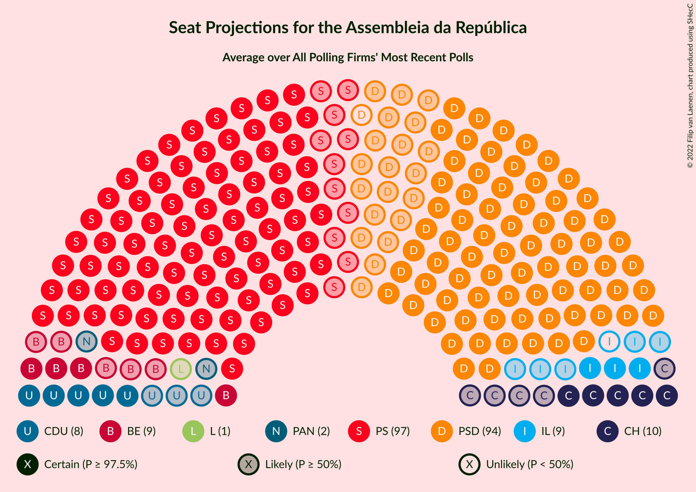

# Overview

The table below lists the most recent polls (less than 90 days old) registered and analyzed so far.

| Period     | Polling firm/Commissioner(s) | PS | PSD | BE | CDU | CDS–PP | PAN | CH | IL | L | A |
|:----------:|:----------------------------:|:--:|:--:|:--:|:--:|:--:|:--:|:--:|:--:|:--:|:--:|
| 6 October 2019 | General Election | 36.4%   108 | 27.8%   79 | 9.5%   19 | 6.3%   12 | 4.2%   5 | 3.3%   4 | 1.3%   1 | 1.3%   1 | 1.1%   1 | 0.8%   0 |
| N/A | [Poll Average](average.html) | 35–42%   103–121 | 22–30%   58–85 | 6–11%   8–20 | 4–7%   6–14 | 1–4%   0–2 | 2–5%   1–6 | 5–11%   7–21 | 1–6%   1–10 | 0–1%   0 | N/A   N/A |
| [7–18 January 2021](2021-01-18-Pitagórica.html) | Pitagórica   Observador and TVI | N/A   N/A | N/A   N/A | N/A   N/A | N/A   N/A | N/A   N/A | N/A   N/A | N/A   N/A | N/A   N/A | N/A   N/A | N/A   N/A |
| [11–14 January 2021](2021-01-14-Eurosondagem.html) | Eurosondagem   Porto Canal and Sol | 36–42%   108–122 | 25–31%   73–88 | 5–8%   7–16 | 4–7%   5–13 | 1–3%   0–2 | 1–3%   1–3 | 4–7%   5–11 | 1–2%   0–2 | N/A   N/A | N/A   N/A |
| [11–14 January 2021](2021-01-14-CESOP–UCP.html) | CESOP–UCP   Público and RTP | 37–41%   103–116 | 26–30%   69–81 | 6–8%   7–15 | 5–7%   7–14 | 1–3%   0–1 | 1–3%   0–2 | 7–9%   11–15 | 4–6%   5–10 | N/A   N/A | N/A   N/A |
| [4–7 January 2021](2021-01-07-Intercampus.html) | Intercampus | 34–42%   101–120 | 21–28%   57–76 | 7–12%   13–24 | 4–8%   5–15 | 1–4%   0–3 | 2–5%   2–7 | 7–12%   11–24 | 3–6%   3–9 | 0–1%   0 | N/A   N/A |
| [19–22 December 2020](2020-12-22-Aximage.html) | Aximage   Diário de Notícias, Jornal de Notícias and TSF Rádio Notícias | N/A   N/A | N/A   N/A | N/A   N/A | N/A   N/A | N/A   N/A | N/A   N/A | N/A   N/A | N/A   N/A | N/A   N/A | N/A   N/A |
| 6 October 2019 | General Election | 36.4%   108 | 27.8%   79 | 9.5%   19 | 6.3%   12 | 4.2%   5 | 3.3%   4 | 1.3%   1 | 1.3%   1 | 1.1%   1 | 0.8%   0 |

Only polls for which at least the sample size has been published are included in the table above.

**Legend:**
+ **Top half of each row:** Voting intentions (95% confidence interval)
+ **Bottom half of each row:** Seat projections for the Assembleia da República (95% confidence interval)
+ **PS:** Partido Socialista
+ **PSD:** Partido Social Democrata
+ **BE:** Bloco de Esquerda
+ **CDU:** Coligação Democrática Unitária
+ **CDS–PP:** CDS–Partido Popular
+ **PAN:** Pessoas–Animais–Natureza
+ **CH:** Chega
+ **IL:** Iniciativa Liberal
+ **L:** LIVRE
+ **A:** Aliança
+ **N/A (single party):** Party not included the published results
+ **N/A (entire row):** Calculation for this opinion poll not started yet

