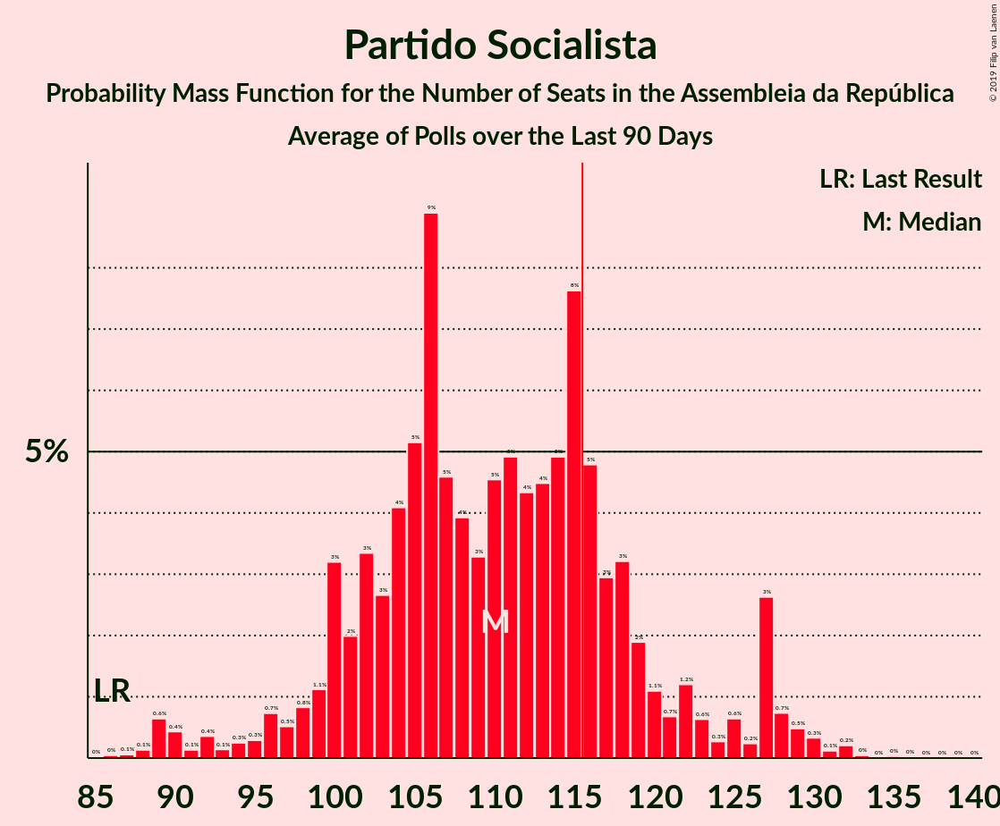

# Partido Socialista

<a href="#voting-intentions">Voting Intentions</a> | <a href="#seats">Seats</a>

## Voting Intentions

Last result: **36.4%** (General Election of 6 October 2019)

### Confidence Intervals

| Period     | Polling firm/Commissioner(s) | Median | 80% Confidence Interval | 90% Confidence Interval | 95% Confidence Interval | 99% Confidence Interval |
|:----------:|:----------------:|:-----------:|:-----------------------:|:-----------------------:|:-----------------------:|:-----------------------:|
| N/A | [Poll Average](average.html) | 37.9% | 33.7–42.1% | 32.8–42.9% | 32.0–43.5% | 30.7–44.6% |
| [16–19 August 2021](2021-08-19-Eurosondagem.html) | Eurosondagem | 41.3% | 39.3–43.2% | 38.8–43.8% | 38.3–44.3% | 37.4–45.2% |
| [26–29 July 2021](2021-07-29-Eurosondagem.html) | Eurosondagem   Porto Canal and Sol | 41.1% | 39.1–43.1% | 38.6–43.6% | 38.1–44.1% | 37.2–45.1% |
| [7–16 July 2021](2021-07-16-Intercampus.html) | Intercampus   Correio da Manhã and Negócios | 34.8% | 32.3–37.3% | 31.7–38.0% | 31.1–38.6% | 29.9–39.9% |
| [10–12 July 2021](2021-07-12-Aximage.html) | Aximage   Diário de Notícias, Jornal de Notícias and TSF Rádio Notícias | 37.6% | 35.4–39.9% | 34.8–40.6% | 34.2–41.1% | 33.2–42.2% |
| [5–8 July 2021](2021-07-08-Eurosondagem.html) | Eurosondagem | 40.8% | 38.9–42.8% | 38.3–43.4% | 37.8–43.9% | 36.9–44.8% |
| [8–16 June 2021](2021-06-16-Intercampus.html) | Intercampus   Correio da Manhã and Negócios | 34.5% | 32.1–37.1% | 31.4–37.8% | 30.9–38.4% | 29.7–39.6% |
| [31 May–3 June 2021](2021-06-03-Eurosondagem.html) | Eurosondagem   Porto Canal and Sol | 40.0% | 38.0–42.0% | 37.5–42.5% | 37.0–43.0% | 36.1–44.0% |
| [26–30 May 2021](2021-05-30-Aximage.html) | Aximage   Diário de Notícias, Jornal de Notícias and TSF Rádio Notícias | 38.9% | 36.8–41.2% | 36.1–41.8% | 35.6–42.4% | 34.6–43.5% |
| [10–13 May 2021](2021-05-13-Eurosondagem.html) | Eurosondagem   Porto Canal and Sol | 39.4% | 37.4–41.4% | 36.9–42.0% | 36.4–42.4% | 35.5–43.4% |
| [5–11 May 2021](2021-05-11-Intercampus.html) | Intercampus   Correio da Manhã and Negócios | 38.0% | 35.5–40.5% | 34.8–41.3% | 34.2–41.9% | 33.0–43.1% |
| [3–7 May 2021](2021-05-07-CESOP–UCP.html) | CESOP–UCP   Público and RTP | 38.0% | 36.2–39.9% | 35.7–40.5% | 35.2–40.9% | 34.4–41.8% |
| [22–25 April 2021](2021-04-25-Aximage.html) | Aximage   Diário de Notícias, Jornal de Notícias and TSF Rádio Notícias | 38.2% | 36.1–40.4% | 35.5–41.0% | 34.9–41.5% | 33.9–42.6% |
| [7–13 April 2021](2021-04-13-Intercampus.html) | Intercampus   Correio da Manhã and Negócios | 36.1% | 33.7–38.7% | 33.0–39.4% | 32.4–40.0% | 31.2–41.3% |
| [5–13 April 2021](2021-04-13-ICSISCTE.html) | ICS/ISCTE   Expresso and SIC Notícias | 37.0% | 34.9–39.3% | 34.3–39.9% | 33.7–40.4% | 32.7–41.5% |
| [5–8 April 2021](2021-04-08-Eurosondagem.html) | Eurosondagem   Porto Canal and Sol | 39.6% | 37.7–41.6% | 37.1–42.2% | 36.6–42.6% | 35.7–43.6% |
| [24–27 March 2021](2021-03-27-Aximage.html) | Aximage   Diário de Notícias, Jornal de Notícias and TSF Rádio Notícias | 39.8% | N/A | N/A | N/A | N/A |
| [4–10 March 2021](2021-03-10-Intercampus.html) | Intercampus   Correio da Manhã and Negócios | 37.6% | 35.1–40.1% | 34.4–40.8% | 33.8–41.5% | 32.7–42.7% |
| [1–4 March 2021](2021-03-04-Eurosondagem.html) | Eurosondagem | 39.5% | 37.6–41.5% | 37.0–42.1% | 36.5–42.6% | 35.6–43.5% |
| [17–20 February 2021](2021-02-20-Aximage.html) | Aximage   Diário de Notícias, Jornal de Notícias and TSF Rádio Notícias | 37.6% | 35.5–39.8% | 34.9–40.4% | 34.3–41.0% | 33.3–42.0% |
| [8–13 February 2021](2021-02-13-Intercampus.html) | Intercampus   Correio da Manhã and Negócios | 37.6% | 35.1–40.2% | 34.4–40.9% | 33.8–41.5% | 32.7–42.8% |
| [8–11 February 2021](2021-02-11-Eurosondagem.html) | Eurosondagem   Porto Canal and Sol | 39.3% | 37.4–41.3% | 36.9–41.9% | 36.4–42.4% | 35.5–43.3% |
| [24 January 2021](2021-01-24-CESOP–UCP.html) | CESOP–UCP   Público and RTP | 35.0% | 34.1–35.9% | 33.9–36.2% | 33.6–36.4% | 33.2–36.8% |
| [7–18 January 2021](2021-01-18-Pitagórica.html) | Pitagórica   Observador and TVI | 42.4% | 39.9–45.0% | 39.2–45.7% | 38.6–46.3% | 37.4–47.6% |
| [9–15 January 2021](2021-01-15-Aximage.html) | Aximage   Diário de Notícias, Jornal de Notícias and TSF Rádio Notícias | 39.8% | 37.4–42.4% | 36.7–43.1% | 36.1–43.7% | 34.9–44.9% |
| [11–14 January 2021](2021-01-14-Eurosondagem.html) | Eurosondagem   Porto Canal and Sol | 39.0% | 37.1–41.0% | 36.5–41.5% | 36.0–42.0% | 35.1–43.0% |
| [11–14 January 2021](2021-01-14-CESOP–UCP.html) | CESOP–UCP   Público and RTP | 39.0% | 37.6–40.4% | 37.2–40.8% | 36.9–41.1% | 36.2–41.8% |
| [29 December 2020–10 January 2021](2021-01-10-Pitagórica.html) | Pitagórica   Observador and TVI | 41.3% | 38.9–43.9% | 38.1–44.6% | 37.5–45.2% | 36.4–46.5% |
| [4–7 January 2021](2021-01-07-Intercampus.html) | Intercampus | 38.0% | 35.5–40.6% | 34.8–41.3% | 34.2–41.9% | 33.0–43.2% |
| [22 December 2020–3 January 2021](2021-01-03-Pitagórica.html) | Pitagórica   Observador and TVI | 40.9% | 38.4–43.4% | 37.7–44.1% | 37.1–44.7% | 35.9–46.0% |
| [17–27 December 2020](2020-12-27-Pitagórica.html) | Pitagórica   Observador and TVI | 39.7% | 37.3–42.3% | 36.6–43.0% | 36.0–43.6% | 34.8–44.9% |
| [19–22 December 2020](2020-12-22-Aximage.html) | Aximage   Diário de Notícias, Jornal de Notícias and TSF Rádio Notícias | 38.5% | 36.4–40.8% | 35.8–41.4% | 35.3–41.9% | 34.2–43.0% |
| [17–20 December 2020](2020-12-20-Pitagórica.html) | Pitagórica   Observador and TVI | 40.4% | 37.9–42.9% | 37.2–43.7% | 36.6–44.3% | 35.4–45.5% |
| [14–18 December 2020](2020-12-18-Intercampus.html) | Intercampus   Correio da Manhã and Negócios | 38.0% | 35.5–40.6% | 34.8–41.3% | 34.2–41.9% | 33.0–43.2% |
| [10–13 December 2020](2020-12-13-Pitagórica.html) | Pitagórica   Observador and TVI | 42.0% | 39.5–44.5% | 38.8–45.3% | 38.2–45.9% | 37.0–47.1% |
| [4–11 December 2020](2020-12-11-CESOP–UCP.html) | CESOP–UCP   Público and RTP | 37.0% | 35.3–38.8% | 34.9–39.3% | 34.5–39.7% | 33.7–40.5% |
| [7–10 December 2020](2020-12-10-Eurosondagem.html) | Eurosondagem   Porto Canal and Sol | 38.8% | 36.9–40.8% | 36.4–41.4% | 35.9–41.9% | 35.0–42.8% |
| [23–26 November 2020](2020-11-26-Aximage.html) | Aximage | 37.2% | 34.9–39.7% | 34.2–40.4% | 33.6–41.0% | 32.5–42.2% |
| [11–25 November 2020](2020-11-25-ICSISCTE.html) | ICS/ISCTE | 39.0% | 36.9–41.3% | 36.2–41.9% | 35.7–42.5% | 34.7–43.5% |
| [9–16 November 2020](2020-11-16-Intercampus.html) | Intercampus   Correio da Manhã and Negócios | 37.1% | 34.7–39.7% | 34.0–40.4% | 33.4–41.0% | 32.3–42.2% |
| [2–5 November 2020](2020-11-05-Eurosondagem.html) | Eurosondagem   Porto Canal and Sol | 38.3% | 36.3–40.3% | 35.8–40.8% | 35.3–41.3% | 34.4–42.3% |
| [22–26 October 2020](2020-10-26-Aximage.html) | Aximage | 35.6% | 33.3–38.0% | 32.7–38.7% | 32.1–39.2% | 31.0–40.4% |
| [6–11 October 2020](2020-10-11-Intercampus.html) | Intercampus   Correio da Manhã and Negócios | 37.5% | 35.1–40.1% | 34.4–40.8% | 33.8–41.4% | 32.6–42.7% |
| [5–8 October 2020](2020-10-08-Eurosondagem.html) | Eurosondagem | 38.8% | 36.9–40.8% | 36.3–41.4% | 35.8–41.9% | 34.9–42.8% |
| [14–24 September 2020](2020-09-24-ICSISCTE.html) | ICS/ISCTE | 37.3% | 35.2–39.6% | 34.6–40.2% | 34.0–40.7% | 33.0–41.8% |
| [12–15 September 2020](2020-09-15-Aximage.html) | Aximage | 37.6% | 35.2–40.2% | 34.5–41.0% | 33.9–41.6% | 32.7–42.8% |
| [7–10 September 2020](2020-09-10-Eurosondagem.html) | Eurosondagem | 38.5% | 36.5–40.4% | 36.0–41.0% | 35.5–41.5% | 34.6–42.4% |
| [4–9 September 2020](2020-09-09-Intercampus.html) | Intercampus   Correio da Manhã and Negócios | 37.5% | 35.0–40.0% | 34.3–40.7% | 33.7–41.4% | 32.6–42.6% |
| [6–11 August 2020](2020-08-11-Intercampus.html) | Intercampus   Correio da Manhã and Negócios | 39.6% | 37.1–42.2% | 36.4–42.9% | 35.8–43.6% | 34.6–44.8% |
| [13–18 July 2020](2020-07-18-CESOP–UCP.html) | CESOP–UCP   Público and RTP | 39.0% | 37.4–40.6% | 36.9–41.1% | 36.5–41.5% | 35.8–42.3% |
| [8–13 July 2020](2020-07-13-Intercampus.html) | Intercampus   Correio da Manhã and Negócios | 39.0% | 36.6–41.6% | 35.9–42.3% | 35.3–42.9% | 34.1–44.2% |
| [5–8 July 2020](2020-07-08-Aximage.html) | Aximage   Jornal Económico | 40.4% | 37.9–42.9% | 37.2–43.7% | 36.6–44.3% | 35.4–45.5% |
| [29 June–2 July 2020](2020-07-02-Eurosondagem.html) | Eurosondagem | 38.4% | 36.5–40.4% | 36.0–41.0% | 35.5–41.5% | 34.6–42.4% |
| [9–13 June 2020](2020-06-13-Intercampus.html) | Intercampus   Correio da Manhã and Negócios | 40.0% | 37.5–42.6% | 36.8–43.3% | 36.2–43.9% | 35.0–45.2% |
| [5–8 June 2020](2020-06-08-Aximage.html) | Aximage   Jornal Económico | 39.9% | 36.7–43.3% | 35.8–44.3% | 35.0–45.1% | 33.5–46.7% |
| [1–4 June 2020](2020-06-04-Eurosondagem.html) | Eurosondagem | 38.0% | 36.1–40.0% | 35.5–40.5% | 35.1–41.0% | 34.2–42.0% |
| [16–24 May 2020](2020-05-24-Pitagórica.html) | Pitagórica   Jornal de Notícias | 44.8% | 42.5–47.0% | 41.9–47.7% | 41.4–48.2% | 40.3–49.3% |
| [17–20 May 2020](2020-05-20-Eurosondagem.html) | Eurosondagem | 37.9% | 36.5–39.2% | 36.2–39.6% | 35.8–40.0% | 35.2–40.6% |
| [5–9 May 2020](2020-05-09-Intercampus.html) | Intercampus   Correio da Manhã and Negócios | 40.3% | 37.8–42.9% | 37.1–43.6% | 36.5–44.2% | 35.3–45.5% |
| [4–7 May 2020](2020-05-07-Eurosondagem.html) | Eurosondagem | 37.7% | 35.8–39.7% | 35.2–40.3% | 34.8–40.8% | 33.9–41.7% |
| [15–26 April 2020](2020-04-26-Pitagórica.html) | Pitagórica   Jornal de Notícias | 41.8% | 39.3–44.4% | 38.6–45.2% | 37.9–45.8% | 36.7–47.1% |
| [9–14 April 2020](2020-04-14-Intercampus.html) | Intercampus   Correio da Manhã and Negócios | 35.5% | 33.1–38.0% | 32.4–38.7% | 31.8–39.3% | 30.7–40.5% |
| [29 March–2 April 2020](2020-04-02-Eurosondagem.html) | Eurosondagem | 37.5% | 35.6–39.5% | 35.0–40.1% | 34.6–40.5% | 33.6–41.5% |
| [13–21 March 2020](2020-03-21-Pitagórica.html) | Pitagórica   Jornal de Notícias | 41.7% | 39.1–44.3% | 38.4–45.0% | 37.8–45.6% | 36.6–46.9% |
| [13–19 March 2020](2020-03-19-Intercampus.html) | Intercampus   Correio da Manhã and Negócios | 31.4% | 29.1–33.9% | 28.4–34.6% | 27.9–35.2% | 26.8–36.4% |
| [1–5 March 2020](2020-03-05-Eurosondagem.html) | Eurosondagem | 37.3% | 35.4–39.3% | 34.8–39.8% | 34.4–40.3% | 33.4–41.3% |
| [14–18 February 2020](2020-02-18-Aximage.html) | Aximage | 35.0% | 33.0–37.2% | 32.4–37.8% | 31.9–38.3% | 30.9–39.4% |
| [11–17 February 2020](2020-02-17-Intercampus.html) | Intercampus   Correio da Manhã and Negócios | 31.1% | 28.8–33.6% | 28.1–34.3% | 27.6–34.9% | 26.5–36.1% |
| [2–6 February 2020](2020-02-06-Eurosondagem.html) | Eurosondagem | 37.4% | 35.5–39.4% | 34.9–40.0% | 34.4–40.5% | 33.5–41.4% |
| [22 January–5 February 2020](2020-02-05-ICSISCTE.html) | ICS/ISCTE | 33.0% | 30.9–35.2% | 30.3–35.8% | 29.8–36.3% | 28.8–37.4% |
| [19–24 January 2020](2020-01-24-Intercampus.html) | Intercampus   Correio da Manhã and Negócios | 32.8% | N/A | N/A | N/A | N/A |
| [5–9 January 2020](2020-01-09-Eurosondagem.html) | Eurosondagem | 37.2% | N/A | N/A | N/A | N/A |
| [12–17 December 2019](2019-12-17-Intercampus.html) | Intercampus   Correio da Manhã and Negócios | 33.8% | N/A | N/A | N/A | N/A |
| [8–12 December 2019](2019-12-12-Eurosondagem.html) | Eurosondagem | 37.1% | N/A | N/A | N/A | N/A |
| [20–26 November 2019](2019-11-26-Intercampus.html) | Intercampus   Correio da Manhã and Negócios | 34.9% | N/A | N/A | N/A | N/A |
| [17–21 November 2019](2019-11-21-Eurosondagem.html) | Eurosondagem | 36.9% | N/A | N/A | N/A | N/A |
| [8–11 November 2019](2019-11-11-Aximage.html) | Aximage | 37.4% | N/A | N/A | N/A | N/A |
| [22–28 October 2019](2019-10-28-Intercampus.html) | Intercampus   Correio da Manhã and Negócios | 37.1% | N/A | N/A | N/A | N/A |

### Probability Mass Function

The following table shows the probability mass function per percentage block of voting intentions for the [poll average](average.html) for Partido Socialista.

| Voting Intentions | Probability | Accumulated | Special Marks |
|:-----------------:|:-----------:|:-----------:|:-------------:|
| 27.5–28.5% | 0% | 100% |  |
| 28.5–29.5% | 0.1% | 100% |  |
| 29.5–30.5% | 0.3% | 99.9% |  |
| 30.5–31.5% | 1.1% | 99.6% |  |
| 31.5–32.5% | 3% | 98.5% |  |
| 32.5–33.5% | 5% | 96% |  |
| 33.5–34.5% | 7% | 91% |  |
| 34.5–35.5% | 9% | 84% |  |
| 35.5–36.5% | 11% | 75% | Last Result |
| 36.5–37.5% | 11% | 64% |  |
| 37.5–38.5% | 10% | 53% | Median |
| 38.5–39.5% | 9% | 43% |  |
| 39.5–40.5% | 9% | 34% |  |
| 40.5–41.5% | 10% | 25% |  |
| 41.5–42.5% | 8% | 15% |  |
| 42.5–43.5% | 4% | 7% |  |
| 43.5–44.5% | 2% | 2% |  |
| 44.5–45.5% | 0.4% | 0.5% |  |
| 45.5–46.5% | 0.1% | 0.1% |  |
| 46.5–47.5% | 0% | 0% |  |

## Seats

Last result: **108** seats (General Election of 6 October 2019)

### Confidence Intervals

| Period     | Polling firm/Commissioner(s) | Median | 80% Confidence Interval | 90% Confidence Interval | 95% Confidence Interval | 99% Confidence Interval |
|:----------:|:----------------:|:------:|:-----------------------:|:-----------------------:|:-----------------------:|:-----------------------:|
| N/A | [Poll Average](average.html) | 109 | 100–118 | 98–120 | 95–122 | 89–126 |
| [16–19 August 2021](2021-08-19-Eurosondagem.html) | Eurosondagem | 115 | 110–120 | 108–122 | 106–124 | 104–127 |
| [26–29 July 2021](2021-07-29-Eurosondagem.html) | Eurosondagem   Porto Canal and Sol | 117 | 111–122 | 109–124 | 108–125 | 105–129 |
| [7–16 July 2021](2021-07-16-Intercampus.html) | Intercampus   Correio da Manhã and Negócios | 103 | 97–111 | 94–113 | 91–115 | 86–118 |
| [10–12 July 2021](2021-07-12-Aximage.html) | Aximage   Diário de Notícias, Jornal de Notícias and TSF Rádio Notícias | 109 | 103–116 | 101–118 | 99–121 | 96–124 |
| [5–8 July 2021](2021-07-08-Eurosondagem.html) | Eurosondagem | 118 | 111–122 | 109–124 | 108–126 | 105–129 |
| [8–16 June 2021](2021-06-16-Intercampus.html) | Intercampus   Correio da Manhã and Negócios | 100 | 92–109 | 90–111 | 88–114 | 83–116 |
| [31 May–3 June 2021](2021-06-03-Eurosondagem.html) | Eurosondagem   Porto Canal and Sol | 117 | 110–122 | 109–123 | 107–125 | 104–128 |
| [26–30 May 2021](2021-05-30-Aximage.html) | Aximage   Diário de Notícias, Jornal de Notícias and TSF Rádio Notícias | 115 | 107–121 | 106–123 | 105–125 | 102–129 |
| [10–13 May 2021](2021-05-13-Eurosondagem.html) | Eurosondagem   Porto Canal and Sol | 115 | 108–120 | 106–122 | 105–124 | 103–126 |
| [5–11 May 2021](2021-05-11-Intercampus.html) | Intercampus   Correio da Manhã and Negócios | 110 | 105–120 | 103–122 | 101–123 | 100–128 |
| [3–7 May 2021](2021-05-07-CESOP–UCP.html) | CESOP–UCP   Público and RTP | 108 | 103–114 | 102–116 | 100–116 | 97–119 |
| [22–25 April 2021](2021-04-25-Aximage.html) | Aximage   Diário de Notícias, Jornal de Notícias and TSF Rádio Notícias | 111 | 105–116 | 102–117 | 101–119 | 97–122 |
| [7–13 April 2021](2021-04-13-Intercampus.html) | Intercampus   Correio da Manhã and Negócios | 104 | 98–113 | 96–116 | 93–117 | 89–122 |
| [5–13 April 2021](2021-04-13-ICSISCTE.html) | ICS/ISCTE   Expresso and SIC Notícias | 106 | 99–113 | 97–114 | 96–116 | 90–118 |
| [5–8 April 2021](2021-04-08-Eurosondagem.html) | Eurosondagem   Porto Canal and Sol | 115 | 109–120 | 106–122 | 105–123 | 103–127 |
| [24–27 March 2021](2021-03-27-Aximage.html) | Aximage   Diário de Notícias, Jornal de Notícias and TSF Rádio Notícias |  |  |  |  |  |
| [4–10 March 2021](2021-03-10-Intercampus.html) | Intercampus   Correio da Manhã and Negócios | 110 | 104–119 | 101–121 | 99–123 | 95–127 |
| [1–4 March 2021](2021-03-04-Eurosondagem.html) | Eurosondagem | 114 | 108–120 | 107–121 | 105–122 | 102–126 |
| [17–20 February 2021](2021-02-20-Aximage.html) | Aximage   Diário de Notícias, Jornal de Notícias and TSF Rádio Notícias | 108 | 101–115 | 99–116 | 98–117 | 95–121 |
| [8–13 February 2021](2021-02-13-Intercampus.html) | Intercampus   Correio da Manhã and Negócios | 108 | 102–116 | 100–119 | 98–122 | 95–126 |
| [8–11 February 2021](2021-02-11-Eurosondagem.html) | Eurosondagem   Porto Canal and Sol | 115 | 109–120 | 107–121 | 106–122 | 103–128 |
| [24 January 2021](2021-01-24-CESOP–UCP.html) | CESOP–UCP   Público and RTP | 106 | 103–109 | 102–109 | 102–109 | 101–111 |
| [7–18 January 2021](2021-01-18-Pitagórica.html) | Pitagórica   Observador and TVI | 121 | 115–131 | 113–133 | 111–134 | 108–138 |
| [9–15 January 2021](2021-01-15-Aximage.html) | Aximage   Diário de Notícias, Jornal de Notícias and TSF Rádio Notícias | 115 | 107–121 | 106–124 | 104–126 | 100–130 |
| [11–14 January 2021](2021-01-14-Eurosondagem.html) | Eurosondagem   Porto Canal and Sol | 116 | 110–121 | 108–122 | 106–123 | 104–127 |
| [11–14 January 2021](2021-01-14-CESOP–UCP.html) | CESOP–UCP   Público and RTP | 111 | 106–114 | 105–115 | 104–116 | 102–118 |
| [29 December 2020–10 January 2021](2021-01-10-Pitagórica.html) | Pitagórica   Observador and TVI | 114 | 108–125 | 107–128 | 106–130 | 103–134 |
| [4–7 January 2021](2021-01-07-Intercampus.html) | Intercampus | 110 | 103–117 | 101–120 | 97–122 | 94–125 |
| [22 December 2020–3 January 2021](2021-01-03-Pitagórica.html) | Pitagórica   Observador and TVI | 119 | 110–129 | 108–130 | 107–131 | 104–135 |
| [17–27 December 2020](2020-12-27-Pitagórica.html) | Pitagórica   Observador and TVI | 114 | 107–122 | 104–123 | 103–125 | 99–130 |
| [19–22 December 2020](2020-12-22-Aximage.html) | Aximage   Diário de Notícias, Jornal de Notícias and TSF Rádio Notícias | 113 | 105–118 | 104–119 | 102–121 | 100–123 |
| [17–20 December 2020](2020-12-20-Pitagórica.html) | Pitagórica   Observador and TVI | 115 | 107–122 | 105–123 | 103–126 | 99–130 |
| [14–18 December 2020](2020-12-18-Intercampus.html) | Intercampus   Correio da Manhã and Negócios | 112 | 105–121 | 103–123 | 102–125 | 98–130 |
| [10–13 December 2020](2020-12-13-Pitagórica.html) | Pitagórica   Observador and TVI | 119 | 111–127 | 110–130 | 108–133 | 105–136 |
| [4–11 December 2020](2020-12-11-CESOP–UCP.html) | CESOP–UCP   Público and RTP | 103 | 97–108 | 95–110 | 93–111 | 90–114 |
| [7–10 December 2020](2020-12-10-Eurosondagem.html) | Eurosondagem   Porto Canal and Sol | 112 | 107–119 | 105–120 | 103–122 | 99–124 |
| [23–26 November 2020](2020-11-26-Aximage.html) | Aximage | 110 | 103–117 | 101–119 | 100–121 | 96–125 |
| [11–25 November 2020](2020-11-25-ICSISCTE.html) | ICS/ISCTE | 115 | 108–122 | 107–125 | 106–126 | 103–129 |
| [9–16 November 2020](2020-11-16-Intercampus.html) | Intercampus   Correio da Manhã and Negócios | 109 | 103–117 | 101–120 | 99–122 | 95–125 |
| [2–5 November 2020](2020-11-05-Eurosondagem.html) | Eurosondagem   Porto Canal and Sol | 110 | 103–116 | 102–118 | 100–119 | 96–121 |
| [22–26 October 2020](2020-10-26-Aximage.html) | Aximage | 102 | 96–110 | 93–112 | 91–114 | 86–117 |
| [6–11 October 2020](2020-10-11-Intercampus.html) | Intercampus   Correio da Manhã and Negócios | 109 | 102–116 | 99–117 | 98–120 | 93–124 |
| [5–8 October 2020](2020-10-08-Eurosondagem.html) | Eurosondagem | 112 | 106–118 | 105–119 | 103–120 | 99–122 |
| [14–24 September 2020](2020-09-24-ICSISCTE.html) | ICS/ISCTE |  |  |  |  |  |
| [12–15 September 2020](2020-09-15-Aximage.html) | Aximage | 114 | 106–120 | 104–124 | 102–129 | 99–129 |
| [7–10 September 2020](2020-09-10-Eurosondagem.html) | Eurosondagem | 113 | 106–119 | 104–119 | 103–121 | 100–122 |
| [4–9 September 2020](2020-09-09-Intercampus.html) | Intercampus   Correio da Manhã and Negócios | 110 | 104–117 | 101–120 | 98–120 | 95–126 |
| [6–11 August 2020](2020-08-11-Intercampus.html) | Intercampus   Correio da Manhã and Negócios | 112 | 106–120 | 104–122 | 103–123 | 100–126 |
| [13–18 July 2020](2020-07-18-CESOP–UCP.html) | CESOP–UCP   Público and RTP | 114 | 109–118 | 107–119 | 106–121 | 104–124 |
| [8–13 July 2020](2020-07-13-Intercampus.html) | Intercampus   Correio da Manhã and Negócios | 111 | 105–122 | 102–122 | 100–122 | 98–129 |
| [5–8 July 2020](2020-07-08-Aximage.html) | Aximage   Jornal Económico | 119 | 112–127 | 109–129 | 105–130 | 102–136 |
| [29 June–2 July 2020](2020-07-02-Eurosondagem.html) | Eurosondagem | 111 | 105–117 | 102–118 | 100–119 | 96–121 |
| [9–13 June 2020](2020-06-13-Intercampus.html) | Intercampus   Correio da Manhã and Negócios | 112 | 108–121 | 108–124 | 105–126 | 102–127 |
| [5–8 June 2020](2020-06-08-Aximage.html) | Aximage   Jornal Económico | 118 | 105–131 | 104–131 | 102–133 | 96–137 |
| [1–4 June 2020](2020-06-04-Eurosondagem.html) | Eurosondagem | 113 | 107–118 | 103–119 | 101–120 | 98–122 |
| [16–24 May 2020](2020-05-24-Pitagórica.html) | Pitagórica   Jornal de Notícias | 129 | 122–136 | 119–137 | 118–137 | 116–141 |
| [17–20 May 2020](2020-05-20-Eurosondagem.html) | Eurosondagem | 110 | 108–114 | 107–115 | 106–116 | 103–119 |
| [5–9 May 2020](2020-05-09-Intercampus.html) | Intercampus   Correio da Manhã and Negócios | 117 | 110–126 | 109–127 | 108–128 | 104–134 |
| [4–7 May 2020](2020-05-07-Eurosondagem.html) | Eurosondagem | 112 | 105–115 | 102–117 | 100–119 | 97–121 |
| [15–26 April 2020](2020-04-26-Pitagórica.html) | Pitagórica   Jornal de Notícias | 120 | 114–128 | 112–130 | 109–131 | 106–134 |
| [9–14 April 2020](2020-04-14-Intercampus.html) | Intercampus   Correio da Manhã and Negócios | 105 | 99–109 | 97–112 | 95–114 | 89–117 |
| [29 March–2 April 2020](2020-04-02-Eurosondagem.html) | Eurosondagem | 111 | 106–118 | 104–119 | 102–121 | 98–125 |
| [13–21 March 2020](2020-03-21-Pitagórica.html) | Pitagórica   Jornal de Notícias | 118 | 111–125 | 108–127 | 107–129 | 104–132 |
| [13–19 March 2020](2020-03-19-Intercampus.html) | Intercampus   Correio da Manhã and Negócios | 93 | 80–93 | 80–97 | 79–100 | 75–106 |
| [1–5 March 2020](2020-03-05-Eurosondagem.html) | Eurosondagem | 109 | 104–116 | 103–119 | 103–119 | 98–124 |
| [14–18 February 2020](2020-02-18-Aximage.html) | Aximage | 106 | 101–115 | 100–117 | 98–118 | 95–120 |
| [11–17 February 2020](2020-02-17-Intercampus.html) | Intercampus   Correio da Manhã and Negócios | 94 | 78–98 | 78–104 | 77–105 | 74–107 |
| [2–6 February 2020](2020-02-06-Eurosondagem.html) | Eurosondagem | 112 | 107–119 | 107–120 | 106–120 | 102–124 |
| [22 January–5 February 2020](2020-02-05-ICSISCTE.html) | ICS/ISCTE | 97 | 85–103 | 85–104 | 85–105 | 80–109 |
| [19–24 January 2020](2020-01-24-Intercampus.html) | Intercampus   Correio da Manhã and Negócios |  |  |  |  |  |
| [5–9 January 2020](2020-01-09-Eurosondagem.html) | Eurosondagem |  |  |  |  |  |
| [12–17 December 2019](2019-12-17-Intercampus.html) | Intercampus   Correio da Manhã and Negócios |  |  |  |  |  |
| [8–12 December 2019](2019-12-12-Eurosondagem.html) | Eurosondagem |  |  |  |  |  |
| [20–26 November 2019](2019-11-26-Intercampus.html) | Intercampus   Correio da Manhã and Negócios |  |  |  |  |  |
| [17–21 November 2019](2019-11-21-Eurosondagem.html) | Eurosondagem |  |  |  |  |  |
| [8–11 November 2019](2019-11-11-Aximage.html) | Aximage |  |  |  |  |  |
| [22–28 October 2019](2019-10-28-Intercampus.html) | Intercampus   Correio da Manhã and Negócios |  |  |  |  |  |

### Probability Mass Function

The following table shows the probability mass function per seat for the [poll average](average.html) for Partido Socialista.

| Number of Seats | Probability | Accumulated | Special Marks |
|:---------------:|:-----------:|:-----------:|:-------------:|
| 84 | 0% | 100% |  |
| 85 | 0% | 99.9% |  |
| 86 | 0.1% | 99.9% |  |
| 87 | 0.1% | 99.8% |  |
| 88 | 0.1% | 99.7% |  |
| 89 | 0.1% | 99.6% |  |
| 90 | 0.2% | 99.5% |  |
| 91 | 0.3% | 99.2% |  |
| 92 | 0.2% | 99.0% |  |
| 93 | 0.3% | 98.8% |  |
| 94 | 0.3% | 98.5% |  |
| 95 | 0.9% | 98% |  |
| 96 | 0.8% | 97% |  |
| 97 | 1.1% | 97% |  |
| 98 | 2% | 95% |  |
| 99 | 3% | 94% |  |
| 100 | 2% | 91% |  |
| 101 | 1.4% | 89% |  |
| 102 | 5% | 88% |  |
| 103 | 4% | 83% |  |
| 104 | 4% | 79% |  |
| 105 | 3% | 75% |  |
| 106 | 5% | 72% |  |
| 107 | 7% | 67% |  |
| 108 | 6% | 60% | Last Result |
| 109 | 6% | 54% | Median |
| 110 | 4% | 48% |  |
| 111 | 4% | 44% |  |
| 112 | 4% | 40% |  |
| 113 | 5% | 35% |  |
| 114 | 4% | 30% |  |
| 115 | 6% | 27% |  |
| 116 | 5% | 21% | Majority |
| 117 | 3% | 16% |  |
| 118 | 5% | 12% |  |
| 119 | 2% | 8% |  |
| 120 | 1.2% | 5% |  |
| 121 | 2% | 4% |  |
| 122 | 0.8% | 3% |  |
| 123 | 0.9% | 2% |  |
| 124 | 0.2% | 1.0% |  |
| 125 | 0.2% | 0.8% |  |
| 126 | 0.3% | 0.5% |  |
| 127 | 0.2% | 0.2% |  |
| 128 | 0% | 0.1% |  |
| 129 | 0% | 0.1% |  |
| 130 | 0% | 0% |  |

